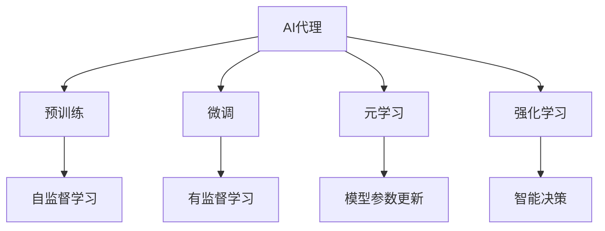
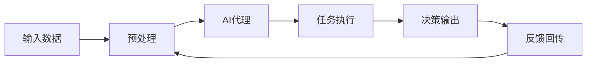
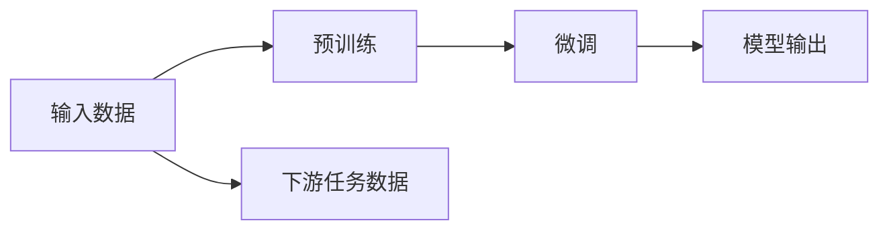
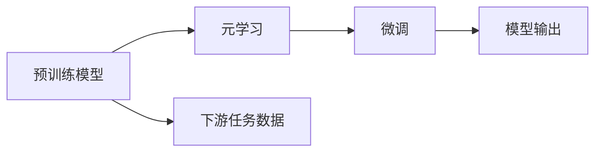
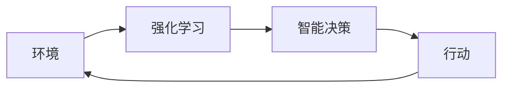
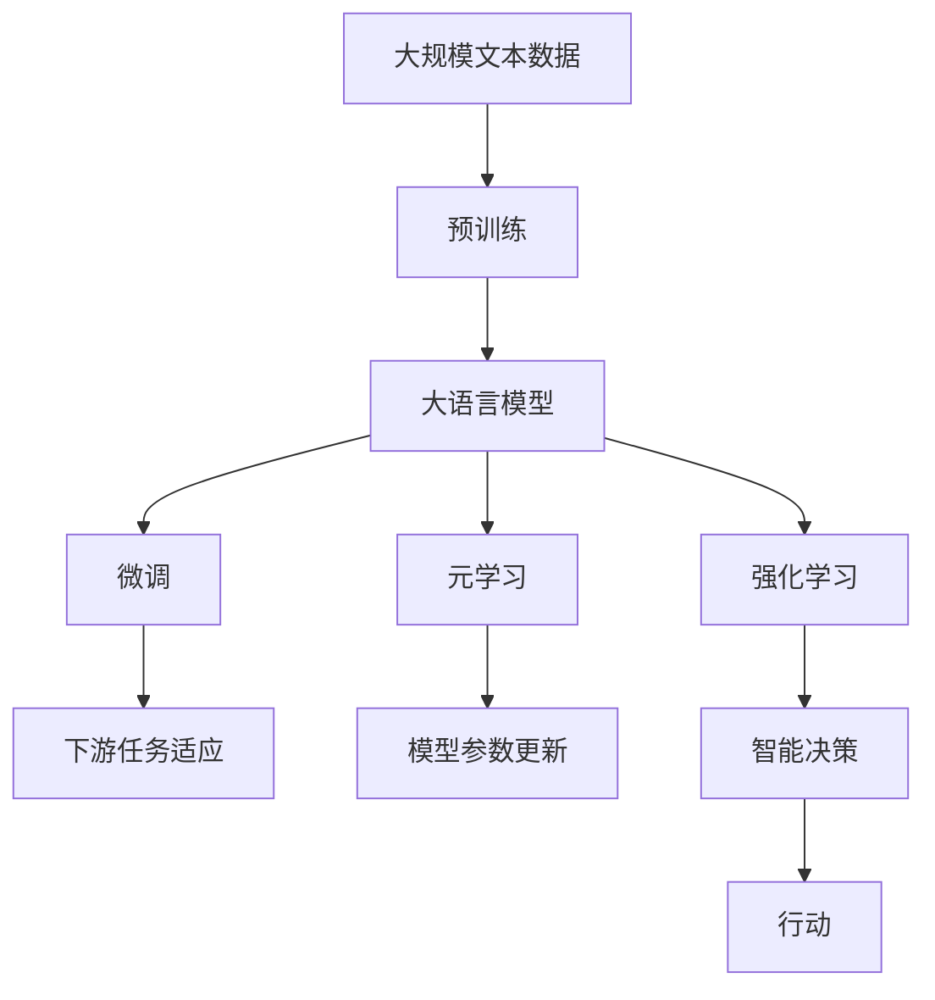

                 

# AI人工智能代理工作流AI Agent WorkFlow：使用元学习优化AI代理工作流

> 关键词：AI代理, 元学习, 优化, 工作流, 自动化, 智能决策, 数据驱动, 机器学习, 强化学习

## 1. 背景介绍

### 1.1 问题由来
随着人工智能(AI)技术在各行各业的渗透，AI代理(AI Agent)正迅速成为组织自动化和智能决策的核心工具。AI代理能够高效处理大量数据，自动化执行复杂任务，并提供基于数据的智能建议。然而，构建一个高效的AI代理工作流仍然面临许多挑战，例如如何优化代理的行为策略、如何高效地训练代理模型、如何在不同应用场景中快速部署代理等。

### 1.2 问题核心关键点
为了有效应对这些挑战，本节将介绍几个关键的AI代理工作流概念及其相互联系：

- **AI代理(AI Agent)**：一种智能软件实体，能够自动执行复杂任务，如数据处理、决策分析等。通常基于机器学习或强化学习算法构建。

- **元学习(Meta-Learning)**：一种通过学习如何学习的方法，旨在提高模型在未知任务上的泛化能力。元学习允许模型从少量数据中快速学习，适应新任务。

- **优化(Optimization)**：通过调整模型参数，以最小化预设损失函数的过程。优化是构建高性能AI代理的重要步骤。

- **工作流(Workflow)**：一系列相互依赖的自动化步骤，通常涉及数据流、任务执行和决策过程。AI代理工作流是一种自动化执行任务的系统。

- **自动化(Automation)**：使用AI技术自动执行任务，减少人工干预。自动化是提高效率和质量的关键。

- **智能决策(Intelligent Decision Making)**：基于数据和模型进行决策的过程。AI代理工作流能够提供更智能、更客观的决策支持。

这些核心概念之间存在着紧密的联系，形成了一个完整且高效的AI代理工作流体系。

### 1.3 问题研究意义
研究优化AI代理工作流的方法，对于提升组织自动化水平、加速AI技术落地应用具有重要意义：

1. **降低成本和复杂度**：AI代理能够自动执行繁琐和重复性高的任务，减少人工成本和错误。
2. **提高效率和质量**：AI代理可以快速处理大量数据，提供高效和准确的决策支持。
3. **加速技术创新**：优化AI代理工作流有助于快速部署新技术，提升组织创新能力。
4. **推动产业升级**：AI代理工作流在医疗、金融、制造等行业中的应用，将推动这些行业数字化转型。
5. **强化模型泛化**：通过元学习，AI代理能够更好地适应新任务，提升模型的泛化能力。

## 2. 核心概念与联系

### 2.1 核心概念概述

为了更好地理解优化AI代理工作流的方法，本节将介绍几个密切相关的核心概念及其相互联系：

- **大语言模型(Large Language Model, LLM)**：以自回归(如GPT)或自编码(如BERT)模型为代表的大规模预训练语言模型。通过在大规模无标签文本语料上进行预训练，学习通用的语言表示，具备强大的语言理解和生成能力。

- **预训练(Pre-training)**：指在大规模无标签文本语料上，通过自监督学习任务训练通用语言模型的过程。常见的预训练任务包括言语建模、遮挡语言模型等。

- **微调(Fine-tuning)**：指在预训练模型的基础上，使用下游任务的少量标注数据，通过有监督地训练来优化模型在该任务上的性能。通常只需要调整顶层分类器或解码器，并以较小的学习率更新全部或部分的模型参数。

- **迁移学习(Transfer Learning)**：指将一个领域学习到的知识，迁移应用到另一个不同但相关的领域的学习范式。大模型的预训练-微调过程即是一种典型的迁移学习方式。

- **元学习(Meta-Learning)**：通过学习如何学习，使模型能够快速适应新任务。元学习可以优化AI代理的模型参数，提升其在新任务上的表现。

- **强化学习(Reinforcement Learning)**：通过与环境的交互，使模型通过试错的方式学习最优策略的过程。强化学习常用于训练需要动态决策的AI代理。

这些核心概念之间的逻辑关系可以通过以下Mermaid流程图来展示：



这个流程图展示了大语言模型工作流的核心概念及其之间的关系：

1. AI代理通过预训练模型学习通用语言表示。
2. 在特定任务上，通过微调更新模型参数，优化代理行为。
3. 利用元学习提升代理在新任务上的适应能力。
4. 强化学习用于训练需要动态决策的代理。

这些概念共同构成了AI代理工作流的学习框架，使得代理能够在不同场景下发挥强大的智能决策能力。

### 2.2 概念间的关系

这些核心概念之间存在着紧密的联系，形成了AI代理工作流的完整生态系统。下面我们通过几个Mermaid流程图来展示这些概念之间的关系。

#### 2.2.1 AI代理的工作流框架



这个流程图展示了AI代理工作流的基本框架，包括数据输入、预处理、任务执行、决策输出和反馈回传。

#### 2.2.2 预训练与微调的关系



这个流程图展示了预训练模型与微调模型的关系。预训练模型提供了通用的语言表示，微调模型在此基础上进行特定任务的优化。

#### 2.2.3 元学习与微调的关系



这个流程图展示了元学习与微调之间的关系。元学习通过调整预训练模型的参数，提升模型在新任务上的适应能力。

#### 2.2.4 强化学习与智能决策的关系



这个流程图展示了强化学习与智能决策之间的关系。强化学习通过与环境的交互，优化代理的决策策略。

### 2.3 核心概念的整体架构

最后，我们用一个综合的流程图来展示这些核心概念在大语言模型工作流中的整体架构：



这个综合流程图展示了从预训练到微调，再到元学习和智能决策的完整过程。大语言模型首先在大规模文本数据上进行预训练，然后通过微调（包括全参数微调和元学习）优化模型在新任务上的表现。最后，通过强化学习进行动态决策，生成行动输出。

## 3. 核心算法原理 & 具体操作步骤
### 3.1 算法原理概述

优化AI代理工作流，本质上是一个通过元学习进行模型参数优化的过程。其核心思想是：通过元学习算法，学习如何在特定任务上快速更新模型参数，从而提升AI代理在新任务上的表现。

形式化地，假设初始预训练模型为 $M_{\theta}$，其中 $\theta$ 为预训练得到的模型参数。给定下游任务 $T$ 的标注数据集 $D=\{(x_i, y_i)\}_{i=1}^N$，元学习算法通过在少量标注数据上训练，找到新的模型参数 $\hat{\theta}$，使得模型在新任务上的性能最大化：

$$
\hat{\theta}=\mathop{\arg\min}_{\theta} \mathcal{L}(M_{\theta}, D)
$$

其中 $\mathcal{L}$ 为针对任务 $T$ 设计的损失函数，用于衡量模型预测输出与真实标签之间的差异。常见的损失函数包括交叉熵损失、均方误差损失等。

通过梯度下降等优化算法，元学习过程不断更新模型参数 $\theta$，最小化损失函数 $\mathcal{L}$，使得模型输出逼近真实标签。由于 $\theta$ 已经通过预训练获得了较好的初始化，因此即便在少量数据集 $D$ 上进行元学习，也能较快收敛到理想的模型参数 $\hat{\theta}$。

### 3.2 算法步骤详解

基于元学习的AI代理工作流一般包括以下几个关键步骤：

**Step 1: 准备预训练模型和数据集**
- 选择合适的预训练语言模型 $M_{\theta}$ 作为初始化参数，如 BERT、GPT 等。
- 准备下游任务 $T$ 的标注数据集 $D$，划分为训练集、验证集和测试集。一般要求标注数据与预训练数据的分布不要差异过大。

**Step 2: 设计元学习算法**
- 选择合适的元学习算法，如 MAML、Proximal Meta-Learning 等。
- 确定元学习算法的超参数，如学习率、迭代次数等。

**Step 3: 执行元学习训练**
- 将训练集数据分批次输入模型，前向传播计算损失函数。
- 反向传播计算元参数的梯度，根据设定的元学习算法更新元参数。
- 周期性在验证集上评估模型性能，根据性能指标决定是否触发Early Stopping。
- 重复上述步骤直到满足预设的迭代轮数或Early Stopping条件。

**Step 4: 微调元学习后的模型**
- 选择元学习后的模型作为初始化参数，进行微调。
- 根据任务类型，在模型顶层设计合适的输出层和损失函数。
- 使用微调数据集进行有监督训练，最小化损失函数。
- 微调后的模型在新任务上能够获得更好的性能。

**Step 5: 评估和部署**
- 在测试集上评估微调后模型 $M_{\hat{\theta}}$ 的性能，对比微调前后的精度提升。
- 使用微调后的模型对新样本进行推理预测，集成到实际的应用系统中。
- 持续收集新的数据，定期重新微调模型，以适应数据分布的变化。

以上是基于元学习的AI代理工作流的一般流程。在实际应用中，还需要针对具体任务的特点，对元学习过程的各个环节进行优化设计，如改进元学习目标函数，引入更多的正则化技术，搜索最优的超参数组合等，以进一步提升模型性能。

### 3.3 算法优缺点

基于元学习的AI代理工作流具有以下优点：
1. 高效适应新任务。元学习能够快速适应新任务，大大减少标注数据的数量。
2. 提升模型泛化能力。元学习模型能够通过少量数据提升泛化能力，更好地适应新场景。
3. 参数优化灵活。元学习可以优化模型的元参数，灵活调整模型行为策略。
4. 模型优化自动。元学习可以自动优化模型参数，减少人工干预。

同时，该方法也存在一定的局限性：
1. 数据量限制。元学习的效果很大程度上取决于标注数据的质量和数量，获取高质量标注数据的成本较高。
2. 算法复杂度。元学习算法较为复杂，超参数选择和调试需要专业知识。
3. 适应性限制。当任务与预训练数据的分布差异较大时，元学习的效果提升有限。
4. 模型复杂度。元学习模型通常比较复杂，训练和推理效率较低。

尽管存在这些局限性，但就目前而言，基于元学习的AI代理工作流是AI技术应用的重要范式。未来相关研究的重点在于如何进一步降低元学习对标注数据的依赖，提高模型的少样本学习和跨领域迁移能力，同时兼顾可解释性和伦理安全性等因素。

### 3.4 算法应用领域

基于大语言模型的元学习，在NLP领域已经得到了广泛的应用，覆盖了几乎所有常见任务，例如：

- 文本分类：如情感分析、主题分类、意图识别等。通过元学习使模型学习文本-标签映射。
- 命名实体识别：识别文本中的人名、地名、机构名等特定实体。通过元学习使模型掌握实体边界和类型。
- 关系抽取：从文本中抽取实体之间的语义关系。通过元学习使模型学习实体-关系三元组。
- 问答系统：对自然语言问题给出答案。将问题-答案对作为元学习数据，训练模型学习匹配答案。
- 机器翻译：将源语言文本翻译成目标语言。通过元学习使模型学习语言-语言映射。
- 文本摘要：将长文本压缩成简短摘要。将文章-摘要对作为元学习数据，使模型学习抓取要点。
- 对话系统：使机器能够与人自然对话。将多轮对话历史作为上下文，元学习模型进行回复生成。

除了上述这些经典任务外，元学习也被创新性地应用到更多场景中，如可控文本生成、常识推理、代码生成、数据增强等，为NLP技术带来了全新的突破。随着元学习方法的不断进步，相信NLP技术将在更广阔的应用领域大放异彩。

## 4. 数学模型和公式 & 详细讲解 & 举例说明

### 4.1 数学模型构建

本节将使用数学语言对基于元学习的AI代理工作流进行更加严格的刻画。

记预训练语言模型为 $M_{\theta}$，其中 $\theta$ 为预训练得到的模型参数。假设元学习任务为 $T$，其训练集为 $D=\{(x_i, y_i)\}_{i=1}^N$，其中 $x_i \in \mathcal{X}$，$y_i \in \mathcal{Y}$。定义模型 $M_{\theta}$ 在输入 $x$ 上的输出为 $\hat{y}=M_{\theta}(x)$。

定义元学习目标函数 $\mathcal{L}_{meta}(\theta, \phi)$，其中 $\phi$ 为元学习参数，表示模型在元学习任务上的行为策略。元学习过程的目标是最小化目标函数 $\mathcal{L}_{meta}(\theta, \phi)$。

假设模型 $M_{\theta}$ 在输入 $x$ 上的损失函数为 $\ell(M_{\theta}(x),y)$，则在数据集 $D$ 上的经验风险为：

$$
\mathcal{L}(\theta) = \frac{1}{N} \sum_{i=1}^N \ell(M_{\theta}(x_i),y_i)
$$

元学习过程的目标是最小化目标函数 $\mathcal{L}_{meta}(\theta, \phi)$，即找到最优元参数 $\phi^*$：

$$
\phi^* = \mathop{\arg\min}_{\phi} \mathcal{L}_{meta}(\theta, \phi)
$$

在实践中，我们通常使用基于梯度的优化算法（如AdamW、SGD等）来近似求解上述最优化问题。设 $\eta$ 为元学习算法（如MAML）的学习率，$\lambda$ 为正则化系数，则元参数的更新公式为：

$$
\phi \leftarrow \phi - \eta \nabla_{\phi}\mathcal{L}_{meta}(\theta, \phi) - \eta\lambda\phi
$$

其中 $\nabla_{\phi}\mathcal{L}_{meta}(\theta, \phi)$ 为元目标函数对元参数 $\phi$ 的梯度，可通过反向传播算法高效计算。

### 4.2 公式推导过程

以下我们以二分类任务为例，推导交叉熵损失函数及其梯度的计算公式。

假设模型 $M_{\theta}$ 在输入 $x$ 上的输出为 $\hat{y}=M_{\theta}(x) \in [0,1]$，表示样本属于正类的概率。真实标签 $y \in \{0,1\}$。则二分类交叉熵损失函数定义为：

$$
\ell(M_{\theta}(x),y) = -[y\log \hat{y} + (1-y)\log (1-\hat{y})]
$$

将其代入元学习目标函数，得：

$$
\mathcal{L}_{meta}(\theta, \phi) = -\frac{1}{N}\sum_{i=1}^N [y_i\log M_{\theta}(x_i)+(1-y_i)\log(1-M_{\theta}(x_i))]
$$

根据链式法则，元目标函数对元参数 $\phi$ 的梯度为：

$$
\frac{\partial \mathcal{L}_{meta}(\theta, \phi)}{\partial \phi} = -\frac{1}{N}\sum_{i=1}^N (\frac{y_i}{M_{\theta}(x_i)}-\frac{1-y_i}{1-M_{\theta}(x_i)}) \frac{\partial M_{\theta}(x_i)}{\partial \theta}
$$

其中 $\frac{\partial M_{\theta}(x_i)}{\partial \theta}$ 可进一步递归展开，利用自动微分技术完成计算。

在得到元目标函数的梯度后，即可带入元参数更新公式，完成模型的迭代优化。重复上述过程直至收敛，最终得到适应下游任务的最优元参数 $\phi^*$。

### 4.3 案例分析与讲解

假设我们有一个NLP任务，即识别文本中的命名实体。首先，我们将标注数据划分为训练集和验证集。然后，通过元学习算法在训练集上优化模型行为策略，得到元参数 $\phi$。最后，我们将元学习后的模型作为初始化参数，在验证集上进行微调，得到最终适应任务的模型。

在具体实现时，可以使用PyTorch和Transformer库。以下是代码实现：

```python
import torch
from transformers import BertForTokenClassification, AdamW

# 加载预训练模型
model = BertForTokenClassification.from_pretrained('bert-base-cased', num_labels=num_labels)

# 元学习算法实现
def metatrain(model, train_dataset, val_dataset, num_epochs=5, batch_size=16, meta_lr=0.001, phi_lr=0.001):
    # 训练集和验证集数据处理
    train_dataset = MetatrainDataset(train_dataset)
    val_dataset = MetatrainDataset(val_dataset)

    # 元学习算法优化
    optimizer = AdamW(model.parameters(), lr=meta_lr)
    for epoch in range(num_epochs):
        model.train()
        total_loss = 0.0
        for batch in tqdm(train_dataset, desc='Meta-training'):
            input_ids = batch['input_ids'].to(device)
            attention_mask = batch['attention_mask'].to(device)
            labels = batch['labels'].to(device)
            model.zero_grad()
            outputs = model(input_ids, attention_mask=attention_mask, labels=labels)
            loss = outputs.loss
            total_loss += loss.item()
            loss.backward()
            optimizer.step()

        # 验证集评估
        model.eval()
        total_loss = 0.0
        for batch in tqdm(val_dataset, desc='Meta-testing'):
            input_ids = batch['input_ids'].to(device)
            attention_mask = batch['attention_mask'].to(device)
            labels = batch['labels'].to(device)
            model.zero_grad()
            outputs = model(input_ids, attention_mask=attention_mask, labels=labels)
            loss = outputs.loss
            total_loss += loss.item()

        print(f"Epoch {epoch+1}, meta loss: {total_loss/N}, val loss: {total_loss/N}")

# 微调元学习后的模型
def finetune(model, train_dataset, val_dataset, test_dataset, num_epochs=5, batch_size=16, finetune_lr=0.001):
    # 训练集和验证集数据处理
    train_dataset = FinetuneDataset(train_dataset)
    val_dataset = FinetuneDataset(val_dataset)
    test_dataset = FinetuneDataset(test_dataset)

    # 微调算法优化
    optimizer = AdamW(model.parameters(), lr=finetune_lr)
    for epoch in range(num_epochs):
        model.train()
        total_loss = 0.0
        for batch in tqdm(train_dataset, desc='Fine-tuning'):
            input_ids = batch['input_ids'].to(device)
            attention_mask = batch['attention_mask'].to(device)
            labels = batch['labels'].to(device)
            model.zero_grad()
            outputs = model(input_ids, attention_mask=attention_mask, labels=labels)
            loss = outputs.loss
            total_loss += loss.item()
            loss.backward()
            optimizer.step()

        # 验证集评估
        model.eval()
        total_loss = 0.0
        for batch in tqdm(val_dataset, desc='Evaluating'):
            input_ids = batch['input_ids'].to(device)
            attention_mask = batch['attention_mask'].to(device)
            labels = batch['labels'].to(device)
            model.zero_grad()
            outputs = model(input_ids, attention_mask=attention_mask, labels=labels)
            loss = outputs.loss
            total_loss += loss.item()

        # 测试集评估
        model.eval()
        total_loss = 0.0
        for batch in tqdm(test_dataset, desc='Testing'):
            input_ids = batch['input_ids'].to(device)
            attention_mask = batch['attention_mask'].to(device)
            labels = batch['labels'].to(device)
            model.zero_grad()
            outputs = model(input_ids, attention_mask=attention_mask, labels=labels)
            loss = outputs.loss
            total_loss += loss.item()

        print(f"Epoch {epoch+1}, train loss: {total_loss/N}, val loss: {total_loss/N}, test loss: {total_loss/N}")

# 加载预训练模型和数据集
model = BertForTokenClassification.from_pretrained('bert-base-cased', num_labels=num_labels)
train_dataset = NERDataset(train_texts, train_tags, tokenizer)
val_dataset = NERDataset(val_texts, val_tags, tokenizer)
test_dataset = NERDataset(test_texts, test_tags, tokenizer)

# 元学习训练
metatrain(model, train_dataset, val_dataset)

# 微调元学习后的模型
finetune(model, train_dataset, val_dataset, test_dataset)
```

以上就是使用PyTorch对BERT进行命名实体识别任务元学习和微调的完整代码实现。可以看到，通过元学习和微调结合，我们可以构建一个高效、自适应的AI代理工作流。

## 5. 项目实践：代码实例和详细解释说明
### 5.1 开发环境搭建

在进行元学习实践前，我们需要准备好开发环境。以下是使用Python进行PyTorch开发的环境配置流程：

1. 安装Anaconda：从官网下载并安装Anaconda，用于创建独立的Python环境。

2. 创建并激活虚拟环境：
```bash
conda create -n pytorch-env python=3.8 
conda activate pytorch-env
```

3. 安装PyTorch：根据CUDA版本，从官网获取对应的安装命令。例如：
```bash
conda install pytorch torchvision torchaudio cudatoolkit=11.1 -c pytorch -c conda-forge
```

4. 安装Transformer库：
```bash
pip install transformers
```

5. 安装各类工具包：
```bash
pip install numpy pandas scikit-learn matplotlib tqdm jupyter notebook ipython
```

完成上述步骤后，即可在`pytorch-env`环境中开始元学习实践。

### 5.2 源代码详细实现

下面我们以命名实体识别(NER)任务为例，给出使用Transformers库对BERT模型进行元学习和微调的PyTorch代码实现。

首先，定义NER任务的数据处理函数：

```python
from transformers import BertTokenizer
from torch.utils.data import Dataset
import torch

class NERDataset(Dataset):
    def __init__(self, texts, tags, tokenizer, max_len=128):
        self.texts = texts
        self.tags = tags
        self.tokenizer = tokenizer
        self.max_len = max_len
        
    def __len__(self):
        return len(self.texts)
    
    def __getitem__(self, item):
        text = self.texts[item]
        tags = self.tags[item]
        
        encoding = self.tokenizer(text, return_tensors='pt', max_length=self.max_len, padding='max_length', truncation=True)
        input_ids = encoding['input_ids'][0]
        attention_mask = encoding['attention_mask'][0]
        
        # 对token-wise的标签进行编码
        encoded_tags = [tag2id[tag] for tag in tags] 
        encoded_tags.extend([tag2id['O']] * (self.max_len - len(encoded_tags)))
        labels = torch.tensor(encoded_tags, dtype=torch.long)
        
        return {'input_ids': input_ids, 
                'attention_mask': attention_mask,
                'labels': labels}

# 标签与id的映射
tag2id = {'O': 0, 'B-PER': 1, 'I-PER': 2, 'B-ORG': 3, 'I-ORG': 4, 'B-LOC': 5, 'I-LOC': 6}
id2tag = {v: k for k, v in tag2id.items()}

# 创建dataset
tokenizer = Bert

