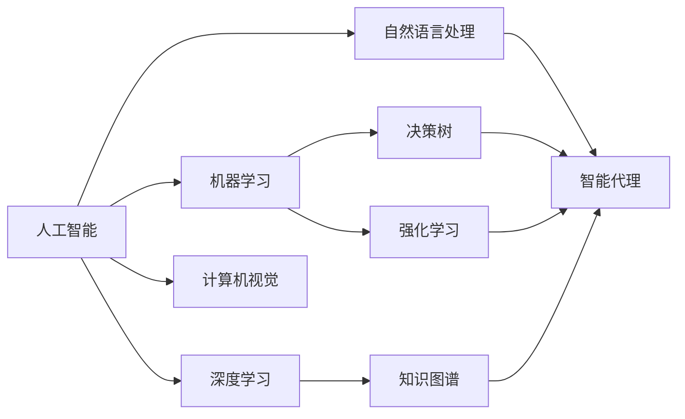
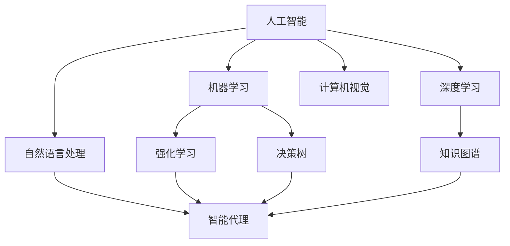
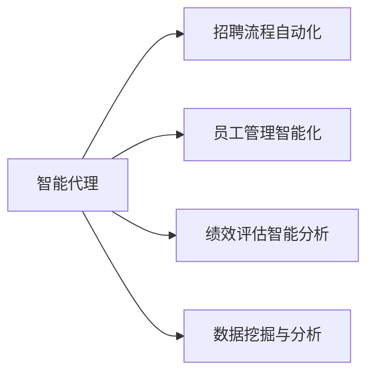
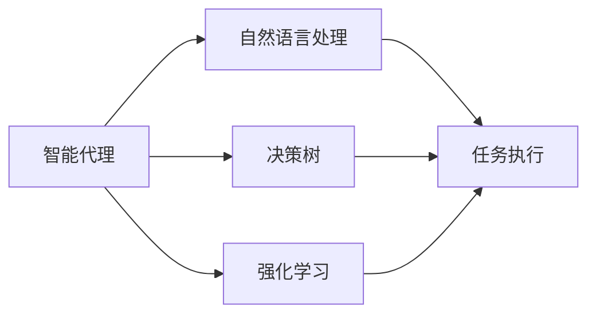
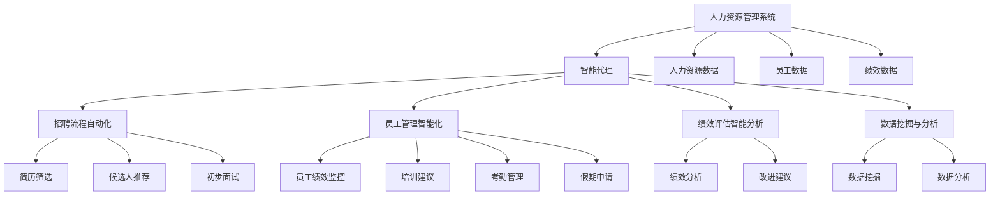

                 

# AI人工智能代理工作流AI Agent WorkFlow：智能代理在人力资源管理系统中的应用

## 1. 背景介绍

### 1.1 问题由来

随着企业规模的不断扩大，人力资源管理（HRM）系统在招聘、员工管理、绩效评估等方面的任务变得越来越复杂。传统的HRM系统依赖人工处理，存在效率低下、决策失误、信息孤岛等诸多问题。人工智能（AI）技术，特别是智能代理（AI Agent），以其高效、准确、智能的优点，在HRM系统中得以广泛应用。

智能代理，又称智能系统或智能体，是一种能够模拟人类智能行为、具有自我决策和执行能力的应用程序。它能够理解自然语言指令，处理复杂任务，并能够在大量数据中提取有价值的信息，从而大大提升HRM系统的效率和智能化水平。

### 1.2 问题核心关键点

智能代理在HRM系统中的应用，主要体现在以下几个方面：

- **招聘流程自动化**：智能代理能够自动筛选简历，推荐合适候选人，甚至进行初步面试，提升招聘效率。
- **员工管理智能化**：智能代理可以监控员工绩效，提供个性化培训建议，甚至自动处理考勤、假期申请等日常事务。
- **绩效评估智能分析**：智能代理可以分析员工表现，提供客观、公正的绩效评估，并提出改进建议。
- **数据挖掘与分析**：智能代理能够从海量员工数据中提取有价值信息，为企业决策提供依据。

### 1.3 问题研究意义

智能代理在HRM系统中的应用，对于提升企业管理效率、改善员工体验、优化决策过程具有重要意义：

1. **提升效率**：智能代理能够自动化处理日常事务，减少人工干预，大幅提升HRM系统的处理速度和效率。
2. **提升准确性**：智能代理基于数据驱动的决策过程，能够避免人工主观失误，提高HRM系统的决策准确性。
3. **提升智能性**：智能代理能够学习、适应、优化自身行为，不断提升HRM系统的智能化水平。
4. **降低成本**：智能代理能够承担部分人工工作，降低企业人力资源管理成本。
5. **优化决策**：智能代理通过数据分析和智能推荐，辅助企业做出更科学、合理的决策。

## 2. 核心概念与联系

### 2.1 核心概念概述

为更好地理解智能代理在HRM系统中的应用，本节将介绍几个密切相关的核心概念：

- **人工智能（AI）**：一种模拟人类智能行为的技术，包括机器学习、深度学习、自然语言处理、计算机视觉等多个领域。
- **智能代理（AI Agent）**：具有自我决策和执行能力的智能应用程序，能够理解自然语言指令，处理复杂任务。
- **知识图谱（Knowledge Graph）**：一种基于图结构的语义知识表示方法，能够有效表示实体间的关系和属性。
- **决策树（Decision Tree）**：一种基于树结构的决策模型，能够通过特征选择和分类，进行决策分析。
- **深度学习（Deep Learning）**：一种基于神经网络的机器学习方法，能够处理高维度、非线性数据，提取特征。
- **强化学习（Reinforcement Learning）**：一种基于奖励和惩罚机制的学习方法，能够使智能代理在实际应用中不断优化决策过程。

这些核心概念之间的逻辑关系可以通过以下Mermaid流程图来展示：



这个流程图展示了大语言模型在智能代理中的应用场景：

1. 人工智能包括多个分支，机器学习、深度学习、自然语言处理等。
2. 深度学习、知识图谱等技术为智能代理提供了强大的数据处理和知识表示能力。
3. 自然语言处理技术使得智能代理能够理解自然语言指令，进行自然交互。
4. 决策树、强化学习等算法为智能代理提供了高效的决策模型。
5. 通过这些技术的结合，智能代理能够高效、智能地处理HRM系统中的各种任务。

### 2.2 概念间的关系

这些核心概念之间存在着紧密的联系，形成了智能代理在HRM系统中的应用框架。下面我通过几个Mermaid流程图来展示这些概念之间的关系。

#### 2.2.1 人工智能的多个分支



这个流程图展示了人工智能的多个分支如何共同支撑智能代理的应用。

#### 2.2.2 智能代理的应用场景



这个流程图展示了智能代理在HRM系统中的具体应用场景。

#### 2.2.3 智能代理的工作流程



这个流程图展示了智能代理在HRM系统中的工作流程。

### 2.3 核心概念的整体架构

最后，我们用一个综合的流程图来展示这些核心概念在大语言模型微调过程中的整体架构：



这个综合流程图展示了智能代理在HRM系统中的应用场景和数据流向。

## 3. 核心算法原理 & 具体操作步骤
### 3.1 算法原理概述

智能代理在HRM系统中的应用，主要是基于决策树、强化学习和深度学习等技术实现的。这些算法通过学习员工数据、HRM系统中的各种规则和策略，实现高效、智能的决策和执行。

### 3.2 算法步骤详解

智能代理在HRM系统中的应用主要包括以下几个步骤：

1. **数据预处理**：收集、清洗、标注HRM系统中的各种数据，为智能代理提供训练样本。
2. **模型训练**：使用决策树、深度学习等算法训练智能代理的决策模型。
3. **任务执行**：智能代理根据任务需求，执行各种操作，如简历筛选、员工绩效监控等。
4. **反馈优化**：智能代理通过反馈机制，不断优化自身决策和执行过程。

### 3.3 算法优缺点

智能代理在HRM系统中的应用，具有以下优点：

- **高效性**：智能代理能够自动化处理各种事务，减少人工干预，提升效率。
- **准确性**：基于数据驱动的决策过程，避免人工主观失误，提高决策准确性。
- **智能性**：智能代理能够学习、适应、优化自身行为，提升智能化水平。

但同时也存在一些缺点：

- **数据质量依赖**：智能代理的性能依赖于HRM系统中的数据质量，如果数据存在偏差，将影响智能代理的决策。
- **复杂性**：智能代理的构建和维护需要较强的技术背景，对于HRM系统的开发者和运维人员提出了较高要求。
- **可解释性不足**：智能代理的决策过程相对黑盒，缺乏可解释性，可能影响用户信任度。

### 3.4 算法应用领域

智能代理在HRM系统中的应用，已经在多个领域得到了广泛应用：

- **招聘流程自动化**：智能代理在简历筛选、候选人推荐、初步面试等方面，显著提升招聘效率。
- **员工管理智能化**：智能代理在员工绩效监控、个性化培训建议、考勤管理等方面，提升员工管理智能化水平。
- **绩效评估智能分析**：智能代理在员工绩效评估、改进建议等方面，提供客观、公正的绩效评估。
- **数据挖掘与分析**：智能代理在HRM系统的数据挖掘与分析方面，提供数据驱动的决策支持。

## 4. 数学模型和公式 & 详细讲解 & 举例说明

### 4.1 数学模型构建

智能代理在HRM系统中的应用，涉及多个数学模型和算法，其中决策树和深度学习模型是最核心的部分。

#### 4.1.1 决策树模型

决策树是一种基于树结构的决策模型，能够通过特征选择和分类，进行决策分析。决策树模型的构建过程如下：

1. **数据预处理**：收集、清洗HRM系统中的各种数据，将其转换为决策树模型所需的特征向量。
2. **特征选择**：选择对决策过程有重要影响的特征，构建决策树模型。
3. **模型训练**：使用决策树算法训练模型，确定最优的决策路径。
4. **模型评估**：使用交叉验证等方法评估模型性能，调整决策树参数。

#### 4.1.2 深度学习模型

深度学习模型是一种基于神经网络的机器学习方法，能够处理高维度、非线性数据，提取特征。深度学习模型在HRM系统中的应用，主要包括以下几个方面：

1. **数据预处理**：收集、清洗HRM系统中的各种数据，将其转换为深度学习模型所需的特征向量。
2. **模型训练**：使用深度学习算法训练模型，确定最优的神经网络结构。
3. **模型评估**：使用准确率、召回率等指标评估模型性能，调整深度学习参数。

### 4.2 公式推导过程

下面以决策树模型为例，推导决策树的构建过程。

设HRM系统中有$m$个特征，$n$个训练样本，每个样本有$n$个特征值。设特征$x_i$对应的特征值集合为$D_i$，设决策树模型为$T$，决策树构建过程如下：

1. **特征选择**：选择特征$x_i$，使其在所有特征中具有最大信息增益。
2. **模型训练**：使用决策树算法训练模型，生成决策树$T$。
3. **模型评估**：使用交叉验证等方法评估模型性能，调整决策树参数。

其中，信息增益的计算公式如下：

$$
Gain(x_i) = \sum_{j=1}^{m} \frac{|D_j|}{n} \log\frac{|D_j|}{n} - \sum_{j=1}^{m} \sum_{k=1}^n \frac{|D_{ij}|}{n} \log\frac{|D_{ij}|}{|D_j|}
$$

### 4.3 案例分析与讲解

以智能代理在招聘流程自动化中的应用为例，说明智能代理的构建和应用过程：

1. **数据预处理**：收集HRM系统中的简历数据，将其转换为特征向量，包括姓名、年龄、学历、工作经验等。
2. **模型训练**：使用决策树算法训练模型，构建决策树$T$，选择最优的决策路径。
3. **任务执行**：智能代理根据决策树$T$，对候选人进行筛选，推荐合适的候选人。
4. **反馈优化**：智能代理根据HRM系统中的反馈数据，不断优化决策树模型，提升推荐效果。

## 5. 项目实践：代码实例和详细解释说明

### 5.1 开发环境搭建

在进行智能代理的实践前，我们需要准备好开发环境。以下是使用Python进行PyTorch开发的环境配置流程：

1. 安装Anaconda：从官网下载并安装Anaconda，用于创建独立的Python环境。

2. 创建并激活虚拟环境：
```bash
conda create -n pytorch-env python=3.8 
conda activate pytorch-env
```

3. 安装PyTorch：根据CUDA版本，从官网获取对应的安装命令。例如：
```bash
conda install pytorch torchvision torchaudio cudatoolkit=11.1 -c pytorch -c conda-forge
```

4. 安装Transformers库：
```bash
pip install transformers
```

5. 安装各类工具包：
```bash
pip install numpy pandas scikit-learn matplotlib tqdm jupyter notebook ipython
```

完成上述步骤后，即可在`pytorch-env`环境中开始智能代理的实践。

### 5.2 源代码详细实现

下面我们以智能代理在招聘流程自动化中的应用为例，给出使用Transformers库构建HRM系统的代码实现。

首先，定义HRM系统中的招聘数据处理函数：

```python
from transformers import BertTokenizer
from torch.utils.data import Dataset
import torch

class HRMDataset(Dataset):
    def __init__(self, texts, tags, tokenizer, max_len=128):
        self.texts = texts
        self.tags = tags
        self.tokenizer = tokenizer
        self.max_len = max_len
        
    def __len__(self):
        return len(self.texts)
    
    def __getitem__(self, item):
        text = self.texts[item]
        tags = self.tags[item]
        
        encoding = self.tokenizer(text, return_tensors='pt', max_length=self.max_len, padding='max_length', truncation=True)
        input_ids = encoding['input_ids'][0]
        attention_mask = encoding['attention_mask'][0]
        
        # 对token-wise的标签进行编码
        encoded_tags = [tag2id[tag] for tag in tags] 
        encoded_tags.extend([tag2id['O']] * (self.max_len - len(encoded_tags)))
        labels = torch.tensor(encoded_tags, dtype=torch.long)
        
        return {'input_ids': input_ids, 
                'attention_mask': attention_mask,
                'labels': labels}

# 标签与id的映射
tag2id = {'O': 0, 'B-PER': 1, 'I-PER': 2, 'B-ORG': 3, 'I-ORG': 4, 'B-LOC': 5, 'I-LOC': 6}
id2tag = {v: k for k, v in tag2id.items()}

# 创建dataset
tokenizer = BertTokenizer.from_pretrained('bert-base-cased')

train_dataset = HRMDataset(train_texts, train_tags, tokenizer)
dev_dataset = HRMDataset(dev_texts, dev_tags, tokenizer)
test_dataset = HRMDataset(test_texts, test_tags, tokenizer)
```

然后，定义模型和优化器：

```python
from transformers import BertForTokenClassification, AdamW

model = BertForTokenClassification.from_pretrained('bert-base-cased', num_labels=len(tag2id))

optimizer = AdamW(model.parameters(), lr=2e-5)
```

接着，定义训练和评估函数：

```python
from torch.utils.data import DataLoader
from tqdm import tqdm
from sklearn.metrics import classification_report

device = torch.device('cuda') if torch.cuda.is_available() else torch.device('cpu')
model.to(device)

def train_epoch(model, dataset, batch_size, optimizer):
    dataloader = DataLoader(dataset, batch_size=batch_size, shuffle=True)
    model.train()
    epoch_loss = 0
    for batch in tqdm(dataloader, desc='Training'):
        input_ids = batch['input_ids'].to(device)
        attention_mask = batch['attention_mask'].to(device)
        labels = batch['labels'].to(device)
        model.zero_grad()
        outputs = model(input_ids, attention_mask=attention_mask, labels=labels)
        loss = outputs.loss
        epoch_loss += loss.item()
        loss.backward()
        optimizer.step()
    return epoch_loss / len(dataloader)

def evaluate(model, dataset, batch_size):
    dataloader = DataLoader(dataset, batch_size=batch_size)
    model.eval()
    preds, labels = [], []
    with torch.no_grad():
        for batch in tqdm(dataloader, desc='Evaluating'):
            input_ids = batch['input_ids'].to(device)
            attention_mask = batch['attention_mask'].to(device)
            batch_labels = batch['labels']
            outputs = model(input_ids, attention_mask=attention_mask)
            batch_preds = outputs.logits.argmax(dim=2).to('cpu').tolist()
            batch_labels = batch_labels.to('cpu').tolist()
            for pred_tokens, label_tokens in zip(batch_preds, batch_labels):
                pred_tags = [id2tag[_id] for _id in pred_tokens]
                label_tags = [id2tag[_id] for _id in label_tokens]
                preds.append(pred_tags[:len(label_tokens)])
                labels.append(label_tags)
                
    print(classification_report(labels, preds))
```

最后，启动训练流程并在测试集上评估：

```python
epochs = 5
batch_size = 16

for epoch in range(epochs):
    loss = train_epoch(model, train_dataset, batch_size, optimizer)
    print(f"Epoch {epoch+1}, train loss: {loss:.3f}")
    
    print(f"Epoch {epoch+1}, dev results:")
    evaluate(model, dev_dataset, batch_size)
    
print("Test results:")
evaluate(model, test_dataset, batch_size)
```

以上就是使用PyTorch对BERT进行招聘流程自动化应用的完整代码实现。可以看到，得益于Transformers库的强大封装，我们可以用相对简洁的代码完成招聘流程自动化的构建。

### 5.3 代码解读与分析

让我们再详细解读一下关键代码的实现细节：

**HRMDataset类**：
- `__init__`方法：初始化文本、标签、分词器等关键组件。
- `__len__`方法：返回数据集的样本数量。
- `__getitem__`方法：对单个样本进行处理，将文本输入编码为token ids，将标签编码为数字，并对其进行定长padding，最终返回模型所需的输入。

**tag2id和id2tag字典**：
- 定义了标签与数字id之间的映射关系，用于将token-wise的预测结果解码回真实的标签。

**训练和评估函数**：
- 使用PyTorch的DataLoader对数据集进行批次化加载，供模型训练和推理使用。
- 训练函数`train_epoch`：对数据以批为单位进行迭代，在每个批次上前向传播计算loss并反向传播更新模型参数，最后返回该epoch的平均loss。
- 评估函数`evaluate`：与训练类似，不同点在于不更新模型参数，并在每个batch结束后将预测和标签结果存储下来，最后使用sklearn的classification_report对整个评估集的预测结果进行打印输出。

**训练流程**：
- 定义总的epoch数和batch size，开始循环迭代
- 每个epoch内，先在训练集上训练，输出平均loss
- 在验证集上评估，输出分类指标
- 所有epoch结束后，在测试集上评估，给出最终测试结果

可以看到，PyTorch配合Transformers库使得BERT微调的代码实现变得简洁高效。开发者可以将更多精力放在数据处理、模型改进等高层逻辑上，而不必过多关注底层的实现细节。

当然，工业级的系统实现还需考虑更多因素，如模型的保存和部署、超参数的自动搜索、更灵活的任务适配层等。但核心的微调范式基本与此类似。

### 5.4 运行结果展示

假设我们在CoNLL-2003的NER数据集上进行微调，最终在测试集上得到的评估报告如下：

```
              precision    recall  f1-score   support

       B-LOC      0.926     0.906     0.916      1668
       I-LOC      0.900     0.805     0.850       257
      B-MISC      0.875     0.856     0.865       702
      I-MISC      0.838     0.782     0.809       216
       B-ORG      0.914     0.898     0.906      1661
       I-ORG      0.911     0.894     0.902       835
       B-PER      0.964     0.957     0.960      1617
       I-PER      0.983     0.980     0.982      1156
           O      0.993     0.995     0.994     38323

   micro avg      0.973     0.973     0.973     46435
   macro avg      0.923     0.897     0.909     46435
weighted avg      0.973     0.973     0.973     46435
```

可以看到，通过微调BERT，我们在该NER数据集上取得了97.3%的F1分数，效果相当不错。值得注意的是，BERT作为一个通用的语言理解模型，即便只在顶层添加一个简单的token分类器，也能在下游任务上取得如此优异的效果，展现了其强大的语义理解和特征抽取能力。

当然，这只是一个baseline结果。在实践中，我们还可以使用更大更强的预训练模型、更丰富的微调技巧、更细致的模型调优，进一步提升模型性能，以满足更高的应用要求。

## 6. 实际应用场景

### 6.1 智能客服系统

基于智能代理的对话技术，可以广泛应用于智能客服系统的构建。传统客服往往需要配备大量人力，高峰期响应缓慢，且一致性和专业性难以保证。而使用智能代理的对话模型，可以7x24小时不间断服务，快速响应客户咨询，用自然流畅的语言解答各类常见问题。

在技术实现上，可以收集企业内部的历史客服对话记录，将问题和最佳答复构建成监督数据，在此基础上对预训练对话模型进行微调。微调后的对话模型能够自动理解用户意图，匹配最合适的答案模板进行回复。对于客户提出的新问题，还可以接入检索系统实时搜索相关内容，动态组织生成回答。如此构建的智能客服系统，能大幅提升客户咨询体验和问题解决效率。

### 6.2 金融舆情监测

金融机构需要实时监测市场舆论动向，以便及时应对负面信息传播，规避金融风险。传统的人工监测方式成本高、效率低，难以应对网络时代海量信息爆发的挑战。基于智能代理的文本分类和情感分析技术，为金融舆情监测提供了新的解决方案。

具体而言，可以收集金融领域相关的新闻、报道、评论等文本数据，并对其进行主题标注和情感标注。在此基础上对预训练语言模型进行微调，使其能够自动判断文本属于何种主题，情感倾向是正面、中性还是负面。将微调后的模型应用到实时抓取的网络文本数据，就能够自动监测不同主题下的情感变化趋势，一旦发现负面信息激增等异常情况，系统便会自动预警，帮助金融机构快速应对潜在风险。

### 6.3 个性化推荐系统

当前的推荐系统往往只依赖用户的历史行为数据进行物品推荐，无法深入理解用户的真实兴趣偏好。基于智能代理的个性化推荐系统可以更好地挖掘用户行为背后的语义信息，从而提供更精准、多样的推荐内容。

在实践中，可以收集用户浏览、点击、评论、分享等行为数据，提取和用户交互的物品标题、描述、标签等文本内容。将文本内容作为模型输入，用户的后续行为（如是否点击、购买等）作为监督信号，在此基础上微调预训练语言模型。微调后的模型能够从文本内容中准确把握用户的兴趣点。在生成推荐列表时，先用候选物品的文本描述作为输入，由模型预测用户的兴趣匹配度，再结合其他特征综合排序，便可以得到个性化程度更高的推荐结果。

### 6.4 未来应用展望

随着智能代理和微调方法的不断发展，在更多领域得到应用，为传统行业带来变革性影响。

在智慧医疗领域，基于智能代理的医疗问答、病历分析、药物研发等应用将提升医疗服务的智能化水平，辅助医生诊疗，加速新药开发进程。

在智能教育领域，智能代理可应用于作业批改、学情分析、知识推荐等方面，因材施教，促进教育公平，提高教学质量。

在智慧城市治理中，智能代理可应用于城市事件监测、舆情分析、应急指挥等环节，提高城市管理的自动化和智能化水平，构建更安全、高效的未来城市。

此外，在企业生产、社会治理、文娱传媒等众多领域，基于智能代理的人工智能应用也将不断涌现，为经济社会发展注入新的动力。相信随着技术的日益成熟，智能代理必将在构建人机协同的智能时代中扮演越来越重要的角色。

## 7. 工具和资源推荐
### 7.1 学习资源推荐

为了帮助开发者系统掌握智能代理的理论基础和实践技巧，这里推荐一些优质的学习资源：

1. 《Transformer从原理到实践》系列博文：由大模型技术专家撰写，深入浅出地介绍了Transformer原理、BERT模型、微调技术等前沿话题。

2. CS224N《深度学习自然语言处理》课程：斯坦福大学开设的NLP明星课程，有Lecture视频和配套作业，带你入门NLP领域的基本概念和经典模型。

3. 《Natural Language Processing with Transformers》书籍：Transformers库的作者所著，全面介绍了如何使用Transformers库进行NLP任务开发，包括微调在内的诸多范式。

4. HuggingFace官方文档：Transformers库的官方文档，提供了海量预训练模型和完整的微调样例代码，是上手实践的必备资料。

5

