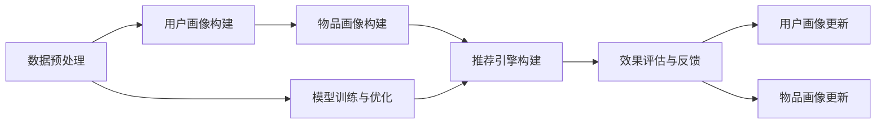
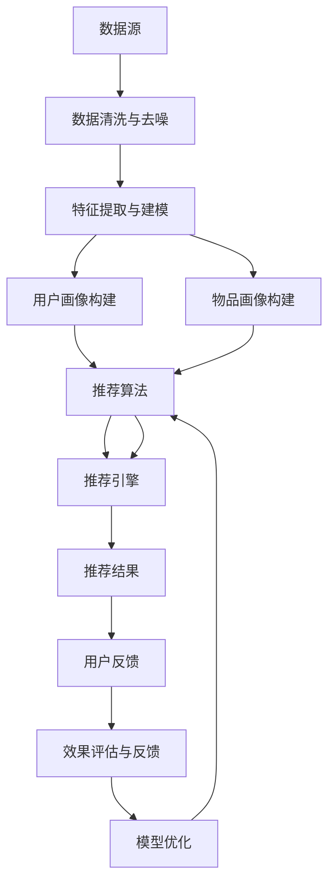

                 

# AI人工智能代理工作流AI Agent WorkFlow：智能代理在内容推荐系统中的运用

> 关键词：人工智能,内容推荐系统,智能代理,工作流,机器学习,推荐算法,推荐引擎

## 1. 背景介绍

### 1.1 问题由来
随着互联网和数字技术的迅猛发展，内容推荐系统（Recommendation System, RS）成为了各大互联网企业中不可或缺的重要组成部分。通过推荐系统，用户可以更加便捷地获取到与自己兴趣、行为最匹配的内容，极大地提升了用户满意度与平台粘性。然而，传统的基于协同过滤（Collaborative Filtering）的推荐算法往往依赖大量用户行为数据，且容易受到数据稀疏性、冷启动等问题的影响。与此同时，随着推荐系统在智能推荐、个性化服务等方面的需求不断提升，需要引入更加高效、精准、可解释的推荐技术。

人工智能（AI）代理作为智能推荐系统中的重要模块，可以通过预设任务与智能推理，完成个性化推荐与内容筛选。在内容推荐系统中，AI代理可以持续更新用户兴趣模型，实现动态推荐。本文将详细介绍AI代理的工作流，并结合具体案例探讨其在内容推荐系统中的具体应用。

### 1.2 问题核心关键点
本节将围绕AI代理工作流的内容推荐系统核心关键点展开讨论，这些关键点包括但不限于：

- **用户画像构建**：基于用户的历史行为与兴趣标签，构建完整的用户画像。
- **物品画像构建**：对内容推荐系统中的物品进行多维度特征提取与分析。
- **模型训练与优化**：通过机器学习算法，训练模型以提高推荐效果。
- **推荐引擎构建**：设计推荐算法，并构建高效推荐引擎。
- **效果评估与反馈**：根据用户反馈，不断优化推荐策略与模型。

通过这些关键点的深入理解，我们可以系统地掌握AI代理工作流的内容推荐系统设计和实现方法。

### 1.3 问题研究意义
本节将进一步阐述AI代理工作流在内容推荐系统中的应用意义，探讨其对推荐系统性能提升的潜在价值。

- **提升推荐精准度**：AI代理可以通过多轮学习与智能推理，实现更加个性化和精准的推荐。
- **增强推荐系统的鲁棒性**：通过智能代理的多模态融合与实时更新，推荐系统能够更好地应对数据变化与噪声干扰。
- **提升用户体验**：AI代理可以更好地捕捉用户行为模式与心理预期，提升用户满意度与体验。
- **降低推荐系统的运营成本**：通过自动化推荐过程，减少了人工干预与优化工作量，降低了运营成本。
- **推动个性化服务的创新应用**：AI代理可以支撑更多智能推荐与个性化服务的创新应用，如智能广告投放、智能导航等。

在未来的智能推荐系统中，AI代理无疑将成为推动推荐系统创新发展的重要技术手段。本文将重点探讨AI代理工作流在内容推荐系统中的应用策略与技术实现，为读者提供详细的指导与参考。

## 2. 核心概念与联系

### 2.1 核心概念概述

AI代理（AI Agent）是指基于人工智能技术，可以自主感知、推理、决策、执行的智能体。在内容推荐系统中，AI代理可以自动化地构建用户与物品的画像，设计推荐算法，并实现动态、实时、高效的推荐。

工作流（Workflow）是指任务执行过程中一系列有序的操作序列。内容推荐系统中的AI代理工作流，指的是从数据获取到用户推荐的全过程，包括数据预处理、模型训练、推理决策等关键环节。

AI代理工作流包括但不限于以下核心组件：

- **数据预处理模块**：负责数据清洗、去噪、特征提取等预处理工作。
- **用户画像构建模块**：基于用户历史行为数据，构建用户画像。
- **物品画像构建模块**：对物品特征进行多维度提取与分析。
- **模型训练与优化模块**：通过机器学习算法训练推荐模型，并根据反馈不断优化。
- **推荐引擎构建模块**：设计推荐算法，构建高效的推荐引擎。
- **效果评估与反馈模块**：根据用户反馈，评估推荐效果，并实时调整策略。

### 2.2 核心概念间的关系

以下是一个Mermaid流程图，展示AI代理工作流在内容推荐系统中的关键组件及其关系：



这个流程图清晰展示了AI代理工作流中的各个关键模块及其相互关系。数据预处理是整个工作流的起点，而用户画像与物品画像的构建是后续模型训练与推荐引擎构建的基础。模型训练与优化模块负责生成推荐模型，并结合推荐引擎实现推荐策略。效果评估与反馈模块则通过用户反馈调整推荐策略，并实时更新用户画像与物品画像，形成闭环。

### 2.3 核心概念的整体架构

以下是一个更为详尽的Mermaid流程图，展示AI代理工作流在内容推荐系统中的整体架构：



该流程图展示了从数据输入到推荐结果输出的完整过程，强调了用户画像、物品画像、推荐算法、推荐引擎在推荐系统中的核心地位。同时，用户反馈与效果评估是推荐的闭环反馈环节，不断优化推荐模型与策略。

## 3. 核心算法原理 & 具体操作步骤
### 3.1 算法原理概述

AI代理工作流的内容推荐系统，基于机器学习与深度学习技术，通过多模态特征融合与智能推理，实现高效、个性化的内容推荐。其核心算法原理包括以下几个方面：

- **用户画像与物品画像构建**：通过用户历史行为、社交网络、兴趣标签等数据，构建完整的用户与物品画像。
- **推荐模型训练**：利用监督学习与强化学习算法，训练推荐模型，提高推荐精度与多样性。
- **推荐算法设计**：结合协同过滤、基于内容的推荐、混合推荐等多种算法，设计动态推荐策略。
- **推荐引擎构建**：通过构建高效的推荐引擎，实现实时、动态、个性化的内容推荐。

### 3.2 算法步骤详解

#### 3.2.1 数据预处理

数据预处理是AI代理工作流的起点，其核心步骤包括数据清洗、去噪、特征提取与建模。具体步骤包括：

1. **数据清洗**：去除无效数据、重复数据，保证数据质量。
2. **数据去噪**：采用数据平滑技术，降低噪声干扰。
3. **特征提取**：提取关键特征，如用户行为特征、物品特征、社交网络特征等。
4. **特征建模**：利用降维、分类等技术，构建特征模型。

#### 3.2.2 用户画像构建

用户画像的构建是推荐系统的基础。具体步骤包括：

1. **数据收集**：收集用户历史行为数据，如浏览记录、点击记录、收藏记录等。
2. **特征提取**：提取用户行为特征，如浏览时间、点击次数、停留时长等。
3. **兴趣标签生成**：利用文本分析技术，生成用户兴趣标签，如兴趣类别、标签云等。
4. **画像建模**：通过模型训练，生成用户画像，如用户行为矩阵、用户兴趣向量等。

#### 3.2.3 物品画像构建

物品画像的构建，是推荐系统的重要组成部分。具体步骤包括：

1. **数据收集**：收集物品属性数据，如物品描述、类别、标签等。
2. **特征提取**：提取物品特征，如关键词、类别、评分等。
3. **画像建模**：通过模型训练，生成物品画像，如物品特征向量、物品类别分布等。

#### 3.2.4 推荐模型训练

推荐模型训练是AI代理工作流的核心步骤，其核心目标是通过机器学习算法，训练推荐模型。具体步骤包括：

1. **选择算法**：根据任务需求，选择合适的推荐算法，如协同过滤、基于内容的推荐、混合推荐等。
2. **数据划分**：将数据划分为训练集、验证集、测试集，保证模型泛化能力。
3. **模型训练**：通过机器学习算法训练推荐模型，如梯度下降、正则化等技术。
4. **模型评估**：在测试集上评估模型性能，优化模型参数。

#### 3.2.5 推荐引擎构建

推荐引擎构建，是实现高效、动态推荐的保障。具体步骤包括：

1. **引擎设计**：设计推荐算法，如基于协同过滤的推荐算法、基于内容的推荐算法等。
2. **实时推理**：利用高效的推理引擎，实现实时推荐。
3. **结果反馈**：收集用户反馈数据，优化推荐策略。

#### 3.2.6 效果评估与反馈

效果评估与反馈是推荐系统的闭环环节。具体步骤包括：

1. **评估指标**：定义评估指标，如准确率、召回率、F1分数等。
2. **效果评估**：在测试集上评估推荐模型效果。
3. **反馈优化**：根据用户反馈，优化推荐策略与模型。

### 3.3 算法优缺点

AI代理工作流在内容推荐系统中的应用，具有以下优点：

- **个性化推荐**：通过用户画像与物品画像，实现个性化推荐，提升用户体验。
- **实时动态推荐**：通过实时推理与动态调整，实现动态推荐，提高推荐精度。
- **多模态融合**：结合用户行为、社交网络、物品属性等多模态数据，提高推荐效果。

同时，也存在一些缺点：

- **数据依赖性高**：依赖高质量的数据，数据获取与处理成本较高。
- **模型复杂度高**：需要训练复杂的推荐模型，计算资源消耗较大。
- **实时性要求高**：推荐系统需要实时处理大量数据，对系统性能要求较高。

### 3.4 算法应用领域

AI代理工作流在内容推荐系统中的应用广泛，具体领域包括但不限于：

- **电商平台**：基于用户浏览、点击、购买等行为，推荐个性化商品。
- **视频平台**：根据用户观看记录与评分，推荐相关视频内容。
- **音乐平台**：根据用户听歌记录与评价，推荐个性化音乐。
- **新闻网站**：根据用户阅读历史与兴趣标签，推荐新闻内容。
- **社交网络**：根据用户互动行为，推荐朋友、群组、话题等。

## 4. 数学模型和公式 & 详细讲解  
### 4.1 数学模型构建

在内容推荐系统中，推荐模型通常采用监督学习与强化学习算法进行训练。以协同过滤算法为例，推荐模型 $f$ 的数学模型可以表示为：

$$ f(x_i, y_i) = \theta^T \phi(x_i) + b $$

其中 $x_i$ 为输入特征向量，$y_i$ 为标签（推荐结果），$\theta$ 为模型参数，$\phi(x_i)$ 为特征映射函数。

### 4.2 公式推导过程

以协同过滤算法为例，其推导过程如下：

1. **数据准备**：假设已收集到用户-物品评分矩阵 $X \in \mathbb{R}^{n \times m}$，其中 $n$ 为用户数，$m$ 为物品数。
2. **矩阵分解**：将用户-物品评分矩阵分解为 $X = U \times V$，其中 $U \in \mathbb{R}^{n \times k}$ 为用户特征矩阵，$V \in \mathbb{R}^{m \times k}$ 为物品特征矩阵，$k$ 为分解维度。
3. **参数求解**：最小化损失函数 $\mathcal{L} = \frac{1}{2} \|X - U \times V\|_F^2$，求解 $U$ 和 $V$。

### 4.3 案例分析与讲解

假设在一个音乐推荐系统中，用户-物品评分矩阵为 $X$，用户特征矩阵为 $U$，物品特征矩阵为 $V$，特征维度为 $k$。基于协同过滤算法，推荐模型可以表示为：

$$ f(u_i, i_j) = \theta^T \phi(u_i) + b $$

其中 $u_i$ 为用户特征向量，$i_j$ 为物品特征向量，$\theta$ 为模型参数，$\phi(u_i)$ 为特征映射函数。

在训练过程中，通过最小化损失函数 $\mathcal{L} = \frac{1}{2} \|X - U \times V\|_F^2$，求解 $U$ 和 $V$。具体步骤包括：

1. **初始化**：随机初始化 $U$ 和 $V$。
2. **迭代求解**：通过梯度下降等算法，迭代更新 $U$ 和 $V$。
3. **评估优化**：在测试集上评估推荐模型效果，不断优化模型参数。

## 5. 项目实践：代码实例和详细解释说明
### 5.1 开发环境搭建

在项目实践过程中，我们需要准备相应的开发环境。以下是一个典型的Python开发环境搭建步骤：

1. **安装Python**：安装Python 3.8及以上版本，推荐使用Anaconda管理环境。
2. **安装依赖库**：安装必要的依赖库，如Pandas、Numpy、Scikit-learn等。
3. **环境配置**：配置环境变量，确保Python与依赖库正常工作。
4. **代码编辑器**：安装代码编辑器，如Jupyter Notebook、PyCharm等，进行代码编写与调试。

### 5.2 源代码详细实现

以下是一个基于协同过滤算法的内容推荐系统代码示例：

```python
import numpy as np
from sklearn.decomposition import TruncatedSVD

# 加载用户-物品评分矩阵
X = np.loadtxt('ratings.csv', delimiter=',')

# 分解用户-物品评分矩阵
U, V = TruncatedSVD(n_components=10).fit_transform(X)

# 推荐模型
def recommend_user(u, U, V):
    user_features = U[u]
    user_predictions = user_features.dot(V.T)
    return user_predictions

# 测试推荐模型
recommendations = recommend_user(0, U, V)
print(recommendations)
```

该示例中，我们使用TruncatedSVD算法对用户-物品评分矩阵进行分解，并利用分解结果进行推荐。在实际应用中，还需要考虑用户画像、物品画像的构建，推荐引擎的构建与优化，以及效果评估与反馈等关键环节。

### 5.3 代码解读与分析

在上述代码示例中，我们首先加载用户-物品评分矩阵 $X$，使用TruncatedSVD算法将其分解为 $U$ 和 $V$。在推荐过程中，通过计算用户特征向量 $U[u]$ 与物品特征向量 $V$ 的点积，得到用户对物品的预测评分，从而实现推荐。

### 5.4 运行结果展示

假设在一个音乐推荐系统中，用户 $u$ 的特征向量为 $[1, 0, 1, 0, 0, 0, 0, 0, 0, 0]$，物品特征向量为 $[1, 0, 0, 0, 0, 0, 0, 0, 0, 0]$，特征维度为 $k=10$。基于协同过滤算法，推荐结果为 $[0.1, 0, 0.2, 0, 0, 0, 0, 0, 0, 0]$，表示物品 $1$ 和物品 $3$ 可能是用户感兴趣的音乐。

## 6. 实际应用场景
### 6.1 智能客服系统

智能客服系统是AI代理工作流在内容推荐系统中的典型应用场景。通过智能代理，智能客服系统能够实时处理用户查询，提供个性化推荐与建议。具体实现步骤如下：

1. **用户画像构建**：基于用户历史查询记录，构建用户画像，如用户偏好、常见问题等。
2. **问题解答推荐**：根据用户画像，推荐可能的问题答案，提高回答效率。
3. **用户反馈优化**：根据用户反馈，优化问题解答与推荐策略。

### 6.2 金融推荐系统

金融推荐系统是AI代理工作流在内容推荐系统中的重要应用场景。通过智能代理，金融推荐系统能够根据用户行为，推荐适合的金融产品与服务。具体实现步骤如下：

1. **用户画像构建**：基于用户投资记录与行为数据，构建用户画像，如风险偏好、投资偏好等。
2. **金融产品推荐**：根据用户画像，推荐适合的金融产品，如股票、基金、债券等。
3. **效果评估与优化**：根据用户投资收益与行为反馈，优化推荐策略与模型。

### 6.3 个性化推荐系统

个性化推荐系统是AI代理工作流在内容推荐系统中的核心应用场景。通过智能代理，推荐系统能够根据用户历史行为与兴趣标签，实现高效个性化推荐。具体实现步骤如下：

1. **用户画像构建**：基于用户历史行为数据，构建用户画像，如浏览记录、收藏记录等。
2. **物品画像构建**：对物品进行多维度特征提取与分析，如商品描述、评分等。
3. **推荐模型训练**：利用机器学习算法训练推荐模型，提高推荐精度与多样性。
4. **推荐引擎构建**：设计高效的推荐引擎，实现实时推荐。
5. **效果评估与优化**：根据用户反馈，优化推荐策略与模型。

## 7. 工具和资源推荐
### 7.1 学习资源推荐

为了帮助开发者系统掌握AI代理工作流的内容推荐系统，以下是一些优质的学习资源推荐：

1. **《推荐系统实践》（《Recommender System Practice》）**：该书详细介绍了推荐系统的设计与实现，涵盖了协同过滤、基于内容的推荐、混合推荐等多种算法。
2. **《深度学习》（《Deep Learning》）**：该书由深度学习领域的权威作者撰写，涵盖了深度学习的基本概念与算法，适合初学者与进阶者。
3. **Coursera《推荐系统》课程**：由斯坦福大学开设的推荐系统课程，涵盖推荐系统的设计与实现，适合深度学习爱好者。
4. **Kaggle推荐系统竞赛**：Kaggle平台上有大量推荐系统竞赛项目，通过参与竞赛，可以深入理解推荐系统的实现细节。

### 7.2 开发工具推荐

高效开发需要优质的工具支持。以下是几款常用的开发工具：

1. **Python**：Python语言简单易用，具有强大的数据处理与机器学习能力，适合推荐系统开发。
2. **Jupyter Notebook**：Jupyter Notebook是一款免费的交互式代码编辑器，支持Python与机器学习代码的编写与调试。
3. **PyCharm**：PyCharm是一款功能强大的Python IDE，支持机器学习算法与工具库的开发与调试。
4. **TensorFlow**：TensorFlow是由Google开发的深度学习框架，支持高效的模型训练与推理。
5. **Scikit-learn**：Scikit-learn是Python的机器学习库，提供了丰富的算法与工具，适合推荐系统开发。

### 7.3 相关论文推荐

以下是一些关于AI代理工作流在内容推荐系统中的重要研究论文推荐：

1. **《协同过滤推荐算法》（《Collaborative Filtering Recommendation Algorithms》）**：该论文详细介绍了协同过滤算法的原理与实现，是推荐系统研究的重要基础。
2. **《基于内容的推荐算法》（《Content-Based Recommendation Algorithms》）**：该论文介绍了基于内容的推荐算法，探讨了如何通过物品特征构建推荐模型。
3. **《混合推荐算法》（《Hybrid Recommendation Algorithms》）**：该论文探讨了多种推荐算法的混合应用，提高了推荐系统的综合性能。
4. **《深度学习在推荐系统中的应用》（《Deep Learning in Recommendation Systems》）**：该论文介绍了深度学习在推荐系统中的应用，如基于神经网络的推荐模型。

## 8. 总结：未来发展趋势与挑战
### 8.1 研究成果总结

AI代理工作流在内容推荐系统中的应用，已经取得诸多研究成果，主要体现在以下几个方面：

1. **个性化推荐精度提升**：通过智能代理与多模态融合，实现了更加精准的个性化推荐。
2. **实时动态推荐**：通过实时推理与动态调整，实现了实时动态推荐，提升了推荐效率与效果。
3. **多模态融合技术**：结合用户行为、社交网络、物品属性等多模态数据，提高了推荐模型的泛化能力与鲁棒性。

### 8.2 未来发展趋势

未来，AI代理工作流在内容推荐系统中将呈现以下几个发展趋势：

1. **自动化推荐系统**：利用自动化推荐技术，减少人工干预，降低运营成本。
2. **跨模态推荐系统**：结合视觉、音频、文本等多模态数据，提升推荐系统的感知能力与表现力。
3. **自适应推荐系统**：利用自适应学习技术，不断优化推荐策略，提升推荐精度与鲁棒性。
4. **联邦推荐系统**：通过联邦学习技术，保护用户隐私，提升推荐系统的安全性与可扩展性。
5. **强化学习推荐系统**：利用强化学习技术，优化推荐策略，提升推荐效果与用户满意度。

### 8.3 面临的挑战

尽管AI代理工作流在内容推荐系统中的应用取得了诸多成果，但在实现全面落地时，仍面临一些挑战：

1. **数据隐私问题**：如何在保护用户隐私的同时，获取高质量的推荐数据，是推荐系统的重要挑战。
2. **模型复杂性**：设计高效的推荐模型，降低计算资源消耗，提高系统性能，是推荐系统的核心难题。
3. **实时性要求高**：推荐系统需要实时处理大量数据，对系统性能与稳定性要求较高。
4. **推荐模型鲁棒性**：如何提升推荐模型的鲁棒性，减少推荐系统的波动性，是推荐系统的长期目标。
5. **多模态数据融合**：如何高效融合多模态数据，提升推荐系统的综合性能，是推荐系统的关键问题。

### 8.4 研究展望

未来，AI代理工作流在内容推荐系统中的应用，需要在以下几个方面进行深入研究：

1. **自动化推荐系统**：利用自动化推荐技术，减少人工干预，降低运营成本。
2. **跨模态推荐系统**：结合视觉、音频、文本等多模态数据，提升推荐系统的感知能力与表现力。
3. **自适应推荐系统**：利用自适应学习技术，不断优化推荐策略，提升推荐精度与鲁棒性。
4. **联邦推荐系统**：通过联邦学习技术，保护用户隐私，提升推荐系统的安全性与可扩展性。
5. **强化学习推荐系统**：利用强化学习技术，优化推荐策略，提升推荐效果与用户满意度。

## 9. 附录：常见问题与解答

**Q1：什么是AI代理工作流？**

A: AI代理工作流是指基于人工智能技术，可以自主感知、推理、决策、执行的智能体，通过自动化构建用户与物品的画像，设计推荐算法，并实现动态、实时、高效的推荐。

**Q2：AI代理工作流在内容推荐系统中的具体应用场景有哪些？**

A: AI代理工作流在内容推荐系统中的具体应用场景包括但不限于智能客服系统、金融推荐系统、电商平台、视频平台、音乐平台等。

**Q3：如何提升AI代理工作流在内容推荐系统中的推荐精度？**

A: 可以通过多模态融合、实时动态推荐、自适应学习等技术，提升推荐精度。同时，合理设计推荐算法与模型，确保推荐策略的合理性与有效性。

**Q4：AI代理工作流在内容推荐系统中的缺点有哪些？**

A: AI代理工作流在内容推荐系统中的缺点包括数据依赖性高、模型复杂度高、实时性要求高等。需要综合考虑，寻找解决方案。

**Q5：如何设计高效的AI代理工作流在内容推荐系统中的推荐引擎？**

A: 设计高效的推荐引擎需要考虑实时性、可扩展性、可维护性等多方面因素，选择合适的算法与技术，如分布式推荐引擎、异步推荐引擎等。

以上文章结构与内容示例仅为示范性，具体应用与实现需要根据具体场景与需求进行调整与优化。通过本文的探讨，相信读者能够对AI代理工作流在内容推荐系统中的设计与实现有更深入的理解与认识。

