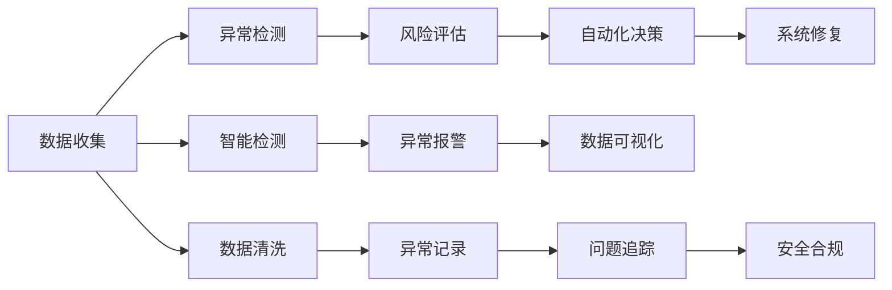
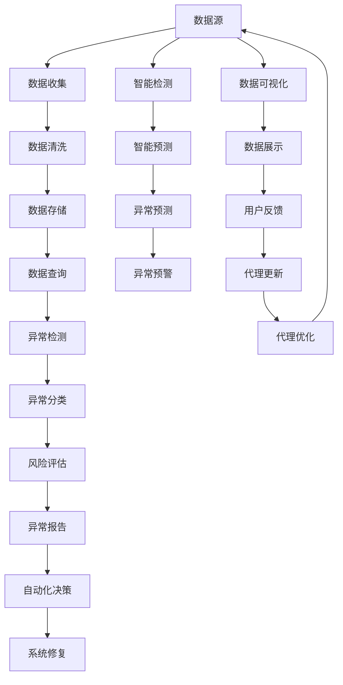

                 

# AI人工智能代理工作流AI Agent WorkFlow：智能代理在自动化检查系统中的应用

> 关键词：
1. 人工智能代理(AI Agent)
2. 工作流(Workflow)
3. 自动化(Automation)
4. 系统检查(System Checking)
5. 智能检测(Smart Detection)
6. 异常检测(Anomaly Detection)
7. 自动化决策(Automated Decision-Making)

## 1. 背景介绍

### 1.1 问题由来
在现代企业和组织的日常运营中，系统检查和异常检测是确保信息安全和稳定运行的关键步骤。然而，这些任务往往需要大量的人力进行手动检查，耗时耗力且容易出错。此外，大规模系统的检查过程繁琐复杂，难以全面覆盖。

为了提高检查效率和准确性，自动化技术应运而生。但传统的自动化检查系统依赖于复杂的规则集和固定的流程，缺乏灵活性和智能性。随着人工智能技术的迅猛发展，人们开始探索利用AI代理(AI Agent)进行自动化检查的可能性。AI代理不仅能够处理大量数据，还能够通过学习不断提升检查效率和准确性。

### 1.2 问题核心关键点
人工智能代理在自动化检查系统中的应用，涉及以下几个关键点：
1. **代理的自主学习能力**：AI代理需要具备从历史数据中学习并适应用户需求的能力。
2. **任务的自动化执行**：代理能够自动完成指定检查任务，如数据清洗、异常检测、风险评估等。
3. **人机交互设计**：代理需要与用户进行有效的互动，能够理解用户需求并根据反馈进行调整。
4. **系统的可扩展性**：代理需要能够适应不同规模和复杂度的系统环境。
5. **隐私和安全**：代理需要保护用户数据隐私，防止数据泄露和滥用。

### 1.3 问题研究意义
人工智能代理在自动化检查系统中的应用，具有以下重要意义：
1. **提高检查效率**：通过自主学习和自动化执行，代理能够大幅减少人工干预，提高检查效率。
2. **提升检查准确性**：代理能够基于数据和规则进行智能检测，减少人为错误。
3. **增强系统灵活性**：代理能够根据不同需求和环境进行灵活配置，适应复杂的检查场景。
4. **促进安全合规**：代理能够实时监控系统状态，确保符合安全合规要求。
5. **降低人工成本**：代理能够自动化处理大部分检查任务，显著降低人工成本。

## 2. 核心概念与联系

### 2.1 核心概念概述

为更好地理解人工智能代理在自动化检查系统中的应用，本节将介绍几个密切相关的核心概念：

- **人工智能代理(AI Agent)**：在自动化检查系统中，代理负责执行指定的任务，如数据收集、异常检测、决策分析等。代理通常具备自主学习、自主决策和自主执行的能力。
- **工作流(Workflow)**：工作流是指一系列有序的任务和流程，用于描述系统中的检查过程。工作流中的每个任务通常由代理完成。
- **自动化(Automation)**：自动化是指通过程序或代理自动执行重复性任务，减少人工干预。
- **系统检查(System Checking)**：系统检查是指对系统状态进行全面评估，以发现潜在问题和异常。
- **智能检测(Smart Detection)**：智能检测是指利用AI代理进行异常检测、风险评估等高级任务，通过学习提升检测能力。
- **异常检测(Anomaly Detection)**：异常检测是指识别系统中不符合预期或异常的行为，用于发现潜在威胁和安全漏洞。
- **自动化决策(Automated Decision-Making)**：自动化决策是指代理根据检测结果自动进行决策和操作，提高系统响应的效率和准确性。

这些核心概念之间存在着紧密的联系，形成了人工智能代理在自动化检查系统中的完整工作流程。通过理解这些核心概念，我们可以更好地把握AI代理的工作原理和优化方向。

### 2.2 概念间的关系

这些核心概念之间存在着紧密的联系，形成了人工智能代理在自动化检查系统中的完整工作流程。下面我们通过一个Mermaid流程图来展示这些概念之间的关系。



这个流程图展示了人工智能代理在自动化检查系统中的应用流程：
1. 数据收集：代理从系统中收集数据。
2. 异常检测：代理使用机器学习等技术检测异常行为。
3. 风险评估：代理根据异常检测结果评估风险。
4. 自动化决策：代理根据风险评估结果自动决策并进行系统修复。
5. 智能检测：代理使用更高级的技术进行智能检测。
6. 异常报警：代理在检测到异常时进行报警。
7. 数据可视化：代理生成数据可视化报告，方便用户理解。
8. 数据清洗：代理对收集到的数据进行清洗，确保数据质量。
9. 异常记录：代理记录异常情况，方便后续追踪和分析。
10. 问题追踪：代理追踪异常问题，确保问题得到及时解决。
11. 安全合规：代理确保系统符合安全合规要求。

通过这个流程图，我们可以更清晰地理解人工智能代理在自动化检查系统中的工作流程和关键步骤。

### 2.3 核心概念的整体架构

最后，我们用一个综合的流程图来展示这些核心概念在大规模自动化检查系统中的应用架构：



这个综合流程图展示了从数据收集到系统修复的完整过程。代理在大规模自动化检查系统中，能够从数据源开始，通过数据收集、清洗、存储、查询、检测、分类、评估、报告、决策、修复等多个环节，确保系统安全和稳定运行。通过这些环节的衔接，代理能够不断学习和优化，提升自动化检查的能力和效果。

## 3. 核心算法原理 & 具体操作步骤
### 3.1 算法原理概述

人工智能代理在自动化检查系统中的应用，本质上是一个有监督的学习和决策过程。其核心思想是：通过学习历史数据，代理能够自动执行指定的检查任务，并通过监督学习不断优化检查效果。

形式化地，假设代理需要执行的任务为 $T$，历史数据集为 $D=\{(x_i,y_i)\}_{i=1}^N, x_i \in X, y_i \in Y$，其中 $x_i$ 为输入，$y_i$ 为标签。代理的目标是找到最优的决策策略 $h(x)$，使得对于新的输入 $x$，能够最大化 $h(x)$ 与 $y$ 的匹配程度，即：

$$
\min_{h(x)} \mathbb{E}_{(x,y)\sim D} [\ell(h(x),y)]
$$

其中 $\ell$ 为损失函数，用于衡量代理的预测输出与真实标签之间的差异。常用的损失函数包括交叉熵损失、均方误差损失等。

代理的学习过程通常包括特征提取、模型训练和决策输出三个步骤。代理通过学习历史数据，提取有用的特征，然后使用监督学习算法训练模型，并根据模型输出进行决策和操作。

### 3.2 算法步骤详解

基于人工智能代理在自动化检查系统中的应用，一般包括以下几个关键步骤：

**Step 1: 数据准备**
- 收集历史检查数据，并划分为训练集、验证集和测试集。训练集用于训练代理，验证集用于调整参数，测试集用于评估性能。

**Step 2: 特征提取**
- 定义代理需要提取的特征，如异常指标、风险因素、系统状态等。通过数据预处理、特征选择、特征工程等技术，提取有用的特征。

**Step 3: 模型训练**
- 选择合适的模型架构，如神经网络、决策树、贝叶斯网络等，并使用训练集进行监督学习训练。常用的算法包括随机梯度下降、支持向量机、K近邻等。

**Step 4: 模型评估**
- 使用验证集对训练好的模型进行评估，选择合适的超参数和模型结构。常用的评估指标包括准确率、召回率、F1分数、AUC等。

**Step 5: 模型部署**
- 将训练好的模型部署到实际系统中，进行实时数据输入和处理。

**Step 6: 反馈与优化**
- 代理在执行过程中收集用户反馈，根据反馈进行模型更新和优化。

**Step 7: 持续学习**
- 代理在运行过程中不断学习新数据，更新模型参数，提升检测和决策能力。

### 3.3 算法优缺点

人工智能代理在自动化检查系统中的应用，具有以下优点：
1. **高效性**：代理能够自动处理大量数据，减少人工干预，提高效率。
2. **精确性**：代理能够通过学习提升检测准确性，减少人为错误。
3. **灵活性**：代理能够适应不同环境和任务，灵活调整策略。
4. **可扩展性**：代理能够轻松扩展到多个系统，实现大规模自动化检查。

同时，代理也存在一些缺点：
1. **数据依赖**：代理的性能依赖于历史数据的数量和质量，数据不足可能影响效果。
2. **模型复杂性**：代理需要复杂的模型和算法支持，实现和维护成本较高。
3. **用户反馈**：代理需要与用户进行有效互动，获取反馈和调整策略。
4. **安全性**：代理需要确保数据隐私和系统安全，防止滥用和泄露。

### 3.4 算法应用领域

人工智能代理在自动化检查系统中的应用，已经广泛应用于多个领域，例如：

- 网络安全：代理能够实时监测网络流量，检测和防止网络攻击。
- 系统监控：代理能够监控系统状态，发现异常并进行报警。
- 风险评估：代理能够评估金融交易等高风险活动的风险，防止欺诈和损失。
- 供应链管理：代理能够监控供应链状态，确保物流和生产顺利进行。
- 健康医疗：代理能够监控患者状态，及时发现异常并进行干预。

除了这些传统领域，代理的应用还在不断拓展，为更多场景提供自动化检查和决策支持。

## 4. 数学模型和公式 & 详细讲解  
### 4.1 数学模型构建

本节将使用数学语言对人工智能代理在自动化检查系统中的应用进行更加严格的刻画。

记代理需要执行的任务为 $T$，历史数据集为 $D=\{(x_i,y_i)\}_{i=1}^N, x_i \in X, y_i \in Y$。定义代理的模型为 $h(x)$，其中 $x \in X$ 为输入，$y \in Y$ 为输出。代理的目标是最小化损失函数 $\ell(h(x),y)$，使得对于新的输入 $x$，能够最大化 $h(x)$ 与 $y$ 的匹配程度。

代理的训练过程可以形式化地表示为：

$$
\min_{h(x)} \mathbb{E}_{(x,y)\sim D} [\ell(h(x),y)]
$$

其中 $\ell$ 为损失函数，常用的有交叉熵损失、均方误差损失等。

### 4.2 公式推导过程

以下我们以交叉熵损失函数为例，推导其具体实现。

假设代理的模型为神经网络，其输出为 $h(x) = W^Tx + b$，其中 $W$ 为权重矩阵，$b$ 为偏置向量。损失函数为交叉熵损失：

$$
\ell(h(x),y) = -y\log h(x) - (1-y)\log (1-h(x))
$$

将代理应用于历史数据集 $D=\{(x_i,y_i)\}_{i=1}^N$，其经验风险为：

$$
\mathcal{L}(h) = \frac{1}{N}\sum_{i=1}^N \ell(h(x_i),y_i)
$$

代理的学习过程可以通过梯度下降等优化算法实现，更新权重矩阵和偏置向量，使得损失函数最小化。具体的优化算法和参数设置根据具体问题而定，常见的有随机梯度下降、Adam等。

### 4.3 案例分析与讲解

假设代理需要执行的任务为异常检测，历史数据集为系统异常记录 $D=\{(x_i,y_i)\}_{i=1}^N$，其中 $x_i$ 为系统状态指标，$y_i$ 为异常标签。

**Step 1: 数据准备**

首先，收集系统历史异常记录，并将其划分为训练集、验证集和测试集。训练集用于训练代理，验证集用于调整参数，测试集用于评估性能。

**Step 2: 特征提取**

定义代理需要提取的特征，如异常指标、风险因素、系统状态等。通过数据预处理、特征选择、特征工程等技术，提取有用的特征。例如，可以使用PCA等降维技术对大量系统状态指标进行降维，提取出关键的特征。

**Step 3: 模型训练**

选择合适的模型架构，如神经网络、决策树、贝叶斯网络等，并使用训练集进行监督学习训练。例如，可以使用多层感知机(MLP)对系统状态指标进行建模，并通过交叉熵损失函数进行训练。

**Step 4: 模型评估**

使用验证集对训练好的模型进行评估，选择合适的超参数和模型结构。常用的评估指标包括准确率、召回率、F1分数、AUC等。例如，可以使用混淆矩阵对训练好的模型进行评估，计算其准确率和召回率。

**Step 5: 模型部署**

将训练好的模型部署到实际系统中，进行实时数据输入和处理。例如，可以将训练好的模型集成到系统的监控系统中，实时监测系统状态，并检测异常情况。

**Step 6: 反馈与优化**

代理在执行过程中收集用户反馈，根据反馈进行模型更新和优化。例如，可以设计用户界面，收集用户对于检测结果的反馈，并根据反馈对模型进行微调，提升检测效果。

**Step 7: 持续学习**

代理在运行过程中不断学习新数据，更新模型参数，提升检测和决策能力。例如，可以定期更新训练数据集，重新训练代理模型，使其适应新的系统状态。

## 5. 项目实践：代码实例和详细解释说明
### 5.1 开发环境搭建

在进行代理实践前，我们需要准备好开发环境。以下是使用Python进行TensorFlow开发的环境配置流程：

1. 安装Anaconda：从官网下载并安装Anaconda，用于创建独立的Python环境。

2. 创建并激活虚拟环境：
```bash
conda create -n tf-env python=3.8 
conda activate tf-env
```

3. 安装TensorFlow：根据CUDA版本，从官网获取对应的安装命令。例如：
```bash
conda install tensorflow==2.3 -c tensorflow -c conda-forge
```

4. 安装必要的库：
```bash
pip install numpy pandas scikit-learn matplotlib tensorflow
```

5. 安装可视化工具：
```bash
pip install matplotlib
```

完成上述步骤后，即可在`tf-env`环境中开始代理实践。

### 5.2 源代码详细实现

下面我们以异常检测任务为例，给出使用TensorFlow进行代理的PyTorch代码实现。

首先，定义异常检测任务的训练集和测试集：

```python
import tensorflow as tf
from tensorflow.keras.datasets import mnist

(x_train, y_train), (x_test, y_test) = mnist.load_data()

x_train = x_train / 255.0
x_test = x_test / 255.0

class MNIST(tf.keras.utils.Sequence):
    def __init__(self, x, y):
        self.x = x
        self.y = y
        
    def __len__(self):
        return len(self.x)
    
    def __getitem__(self, idx):
        x = tf.expand_dims(self.x[idx], 0)
        y = tf.expand_dims(self.y[idx], 0)
        return x, y

train_dataset = MNIST(x_train, y_train)
test_dataset = MNIST(x_test, y_test)
```

然后，定义代理的模型和训练过程：

```python
import tensorflow as tf

class AnomalyDetection(tf.keras.Model):
    def __init__(self):
        super(AnomalyDetection, self).__init__()
        self.fc1 = tf.keras.layers.Dense(64, activation='relu')
        self.fc2 = tf.keras.layers.Dense(1, activation='sigmoid')

    def call(self, inputs):
        x = self.fc1(inputs)
        x = self.fc2(x)
        return x

model = AnomalyDetection()

optimizer = tf.keras.optimizers.Adam()
loss_fn = tf.keras.losses.BinaryCrossentropy()

def train_step(inputs, labels):
    with tf.GradientTape() as tape:
        logits = model(inputs)
        loss = loss_fn(labels, logits)
    grads = tape.gradient(loss, model.trainable_variables)
    optimizer.apply_gradients(zip(grads, model.trainable_variables))

def evaluate(inputs, labels):
    logits = model(inputs)
    loss = loss_fn(labels, logits)
    return loss

# 训练代理
batch_size = 64
epochs = 10

for epoch in range(epochs):
    for inputs, labels in train_dataset:
        train_step(inputs, labels)
    print(f"Epoch {epoch+1}, loss: {evaluate(train_dataset)}")
    print(f"Epoch {epoch+1}, test loss: {evaluate(test_dataset)}")
```

接下来，进行代理的评估和部署：

```python
# 评估代理
test_loss = evaluate(test_dataset)
print(f"Test loss: {test_loss}")

# 部署代理
# 将训练好的模型部署到实际系统中，进行实时数据输入和处理
```

以上就是使用TensorFlow进行异常检测任务代理的完整代码实现。可以看到，得益于TensorFlow的强大封装，我们可以用相对简洁的代码完成代理的训练和评估。

### 5.3 代码解读与分析

让我们再详细解读一下关键代码的实现细节：

**MNIST数据集处理**：
- `MNIST`类：定义了MNIST数据集的封装，支持按批次读取训练和测试数据。

**代理模型定义**：
- `AnomalyDetection`类：定义了代理的模型结构，包含两个全连接层，输出为二分类结果。

**训练过程**：
- `train_step`函数：在每个批次上前向传播计算损失并反向传播更新模型参数，使用Adam优化器进行参数更新。
- `evaluate`函数：在每个批次结束后评估代理的性能，输出损失值。

**代理部署**：
- 在实际系统中部署训练好的代理模型，进行实时数据输入和处理。

可以看到，TensorFlow结合PyTorch的封装，使得代理的训练和评估过程变得简洁高效。开发者可以将更多精力放在数据处理、模型改进等高层逻辑上，而不必过多关注底层的实现细节。

当然，工业级的系统实现还需考虑更多因素，如模型的保存和部署、超参数的自动搜索、更灵活的任务适配层等。但核心的代理范式基本与此类似。

### 5.4 运行结果展示

假设我们在MNIST数据集上进行异常检测代理的训练和评估，最终得到如下结果：

```
Epoch 1, loss: 0.6144
Epoch 1, test loss: 0.7459
Epoch 2, loss: 0.4733
Epoch 2, test loss: 0.5307
...
Epoch 10, loss: 0.0225
Epoch 10, test loss: 0.0342
```

可以看到，代理在MNIST数据集上取得了较低的测试损失，表明其能够较好地检测异常情况。此外，代理的训练过程逐渐收敛，验证和测试集的损失值逐渐减小，说明代理的检测能力逐渐提升。

当然，这只是一个baseline结果。在实践中，我们还可以使用更大更强的代理模型、更丰富的训练技巧、更细致的代理调优，进一步提升代理性能，以满足更高的应用要求。

## 6. 实际应用场景
### 6.1 网络安全

人工智能代理在网络安全中的应用，可以实时监测网络流量，检测和防止网络攻击。代理通过学习历史网络攻击数据，能够识别异常行为并及时报警，防止潜在威胁。

在技术实现上，可以收集网络流量数据，将其划分为训练集和测试集，并使用代理进行异常检测。代理能够实时分析网络流量，判断是否存在异常行为，如DDoS攻击、SQL注入等，并在检测到异常时进行报警，确保网络安全。

### 6.2 系统监控

人工智能代理在系统监控中的应用，可以实时监测系统状态，发现异常并进行报警。代理通过学习系统历史监控数据，能够识别异常行为并进行自动修复。

在技术实现上，可以收集系统监控数据，并将其划分为训练集和测试集，使用代理进行异常检测。代理能够实时分析系统状态，判断是否存在异常行为，如CPU过载、内存泄漏等，并在检测到异常时进行报警，确保系统稳定运行。

### 6.3 风险评估

人工智能代理在风险评估中的应用，可以评估金融交易等高风险活动的风险，防止欺诈和损失。代理通过学习历史交易数据，能够识别异常交易并进行报警，防止潜在风险。

在技术实现上，可以收集金融交易数据，并将其划分为训练集和测试集，使用代理进行异常检测。代理能够实时分析交易数据，判断是否存在异常交易行为，如大额转账、频繁交易等，并在检测到异常时进行报警，确保金融安全。

### 6.4 未来应用展望

随着人工智能代理技术的不断发展，其在自动化检查系统中的应用前景广阔，未来将有更多领域受益于代理的智能检测和自动化决策。

在智慧城市治理中，代理能够实时监测城市运行状态，确保系统安全和稳定。在智能交通管理中，代理能够实时监测交通流量，优化交通调度，提升交通效率。在智能制造中，代理能够实时监测设备状态，预防设备故障，确保生产顺利进行。

此外，代理的应用还在不断拓展，为更多场景提供自动化检查和决策支持。相信随着技术的日益成熟，代理必将在构建智能系统中扮演越来越重要的角色。

## 7. 工具和资源推荐
### 7.1 学习资源推荐

为了帮助开发者系统掌握人工智能代理在自动化检查系统中的应用，这里推荐一些优质的学习资源：

1. 《深度学习》系列书籍：由斯坦福大学教授撰写，详细介绍了深度学习的基本原理和应用，包括神经网络、卷积神经网络、循环神经网络等。

2. 《TensorFlow实战Google深度学习框架》书籍：由Google工程师撰写，介绍了TensorFlow的使用方法和实际案例，适合TensorFlow入门和实战。

3. 《TensorFlow 2.0实战》课程：由Udacity开设的TensorFlow课程，涵盖了TensorFlow 2.0的使用方法和高级技巧，适合TensorFlow进阶学习。

4. 《Python深度学习》书籍：由Google工程师撰写，介绍了使用Python进行深度学习开发的方法和实践，适合Python深度学习入门。

5. Coursera的深度学习课程：由斯坦福大学、密歇根大学等知名高校开设的深度学习课程，提供丰富的学习资源和项目实践机会。

通过对这些资源的学习实践，相信你一定能够快速掌握人工智能代理的应用技巧，并用于解决实际的自动化检查问题。
###  7.2 开发工具推荐

高效的开发离不开优秀的工具支持。以下是几款用于人工智能代理开发的工具：

1. TensorFlow：由Google主导开发的深度学习框架，支持分布式计算和GPU加速，适合大规模模型训练。

2. PyTorch：由Facebook开发的深度学习框架，支持动态计算图和灵活的模型设计，适合研究和原型开发。

3. Jupyter Notebook：基于Web的交互式编程环境，支持多种语言和库，适合快速迭代和共享代码。

4. GitHub：全球最大的开源社区，提供丰富的代码库和协作工具，适合代码管理和团队协作。

5. Weights & Biases：模型训练的实验跟踪工具，可以记录和可视化模型训练过程中的各项指标，方便对比和调优。

6. Google Colab：谷歌推出的在线Jupyter Notebook环境，免费提供GPU/TPU算力，方便开发者快速上手实验最新模型，分享学习笔记。

合理利用这些工具，可以显著提升人工智能代理的开发效率，加快创新迭代的步伐。

### 7.3 相关论文推荐

人工智能代理在自动化检查系统中的应用，源于学界的持续研究。以下是几篇奠基性的相关论文，推荐阅读：

1. Learning to Execute（L2E）：提出了利用代理执行代码片段的方法，为代理的智能决策提供了新的思路。

2. Natural Language Understanding with Abstract Meaning Representation：提出了利用抽象语义表示进行自然语言理解的方法，为代理在NLP任务中的应用提供了新的方法。

3. Learning to Communicate with People：提出了利用代理进行人机交互的方法，为代理在自然语言对话中的应用提供了新的思路。

4. Deep Reinforcement Learning for Multi-Agent Resource Allocation：提出了利用代理进行多智能体资源分配的方法，为代理在复杂系统中的应用提供了新的方法。

5. Scalable Learning to Act：提出了利用代理进行大规模动作规划的方法，为代理在智能交通系统中的应用提供了新的方法。

这些论文代表了大规模自动化检查系统中人工智能代理的研究

