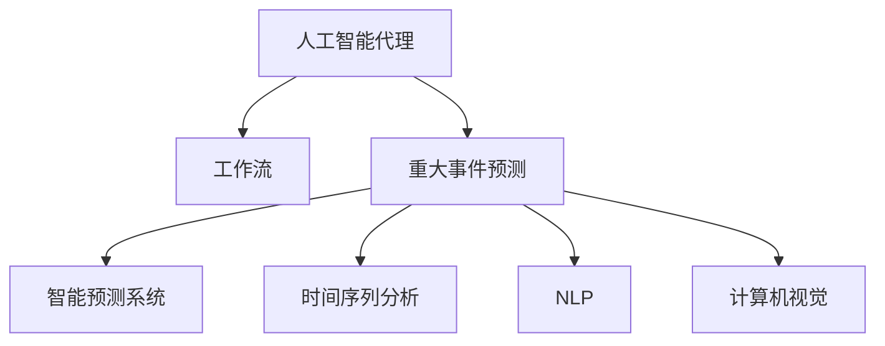
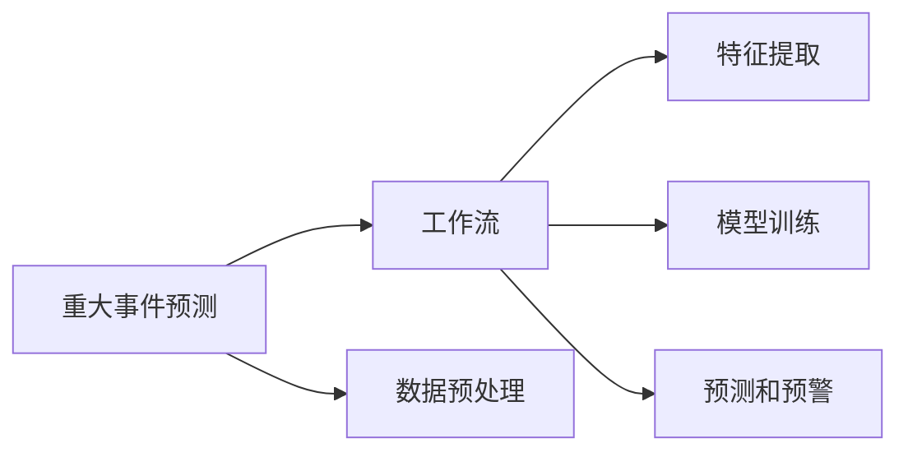
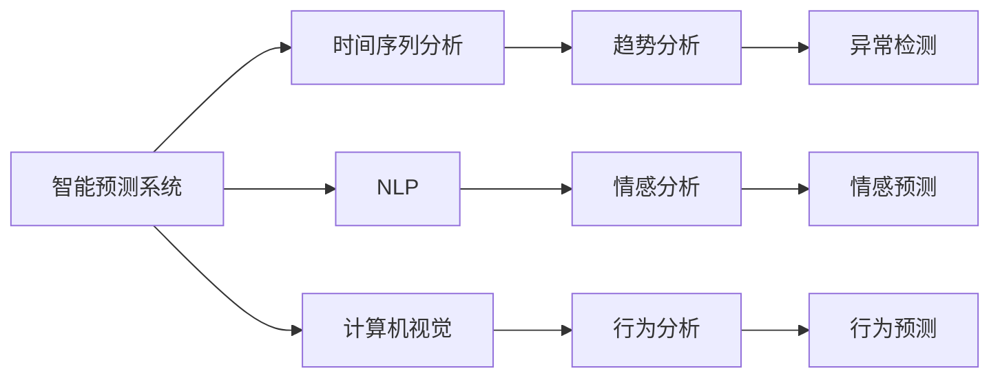
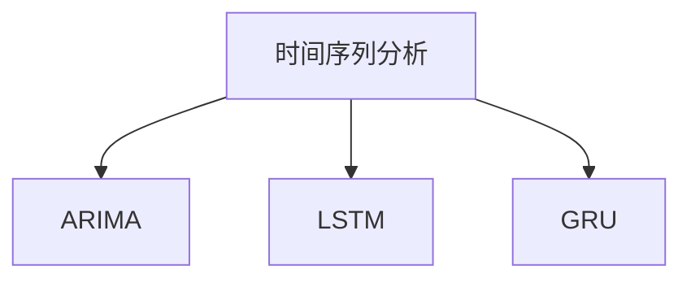
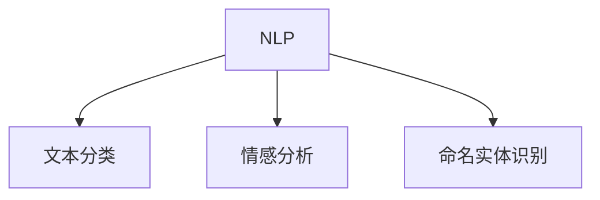

                 

# AI人工智能代理工作流AI Agent WorkFlow：智能代理在重大事件预测系统中的应用

> 关键词：人工智能代理,工作流,重大事件预测,智能预测系统,机器学习,深度学习,大数据,自然语言处理,计算机视觉,时间序列分析

## 1. 背景介绍

### 1.1 问题由来

在现代社会中，预测重大事件的能力变得越来越重要。例如，金融市场预测、自然灾害预测、疾病流行预测、社会舆情预测等。传统的方法依赖于专家经验和统计模型，但往往难以处理复杂和动态的数据。而人工智能技术的引入，尤其是深度学习和自然语言处理（NLP）技术的发展，为预测重大事件提供了全新的方法。

### 1.2 问题核心关键点

预测重大事件的核心问题在于：

- 数据获取：如何获取高品质的数据，包括历史事件数据和相关文本数据。
- 数据处理：如何对海量数据进行高效处理和清洗，提取有用的特征。
- 模型选择：如何选择合适的机器学习或深度学习模型进行训练和预测。
- 预测准确性：如何提高模型的预测准确性和泛化能力。
- 实时预测：如何在保证预测准确性的同时，实现实时预测和预警。

### 1.3 问题研究意义

智能代理在重大事件预测中的应用，对于提升预测准确性和效率，降低预测成本，具有重要意义。具体而言：

1. 提升预测准确性：智能代理能够高效处理复杂数据，提取深度特征，并通过先进的机器学习算法，提高预测准确性。
2. 实现实时预测：智能代理能够快速处理数据，进行实时预测和预警，避免突发事件带来的损失。
3. 降低预测成本：智能代理能够自动化处理数据和模型训练，降低人工成本和误差。
4. 增强系统可靠性：智能代理能够根据历史数据和实时数据，动态调整模型参数，提高系统的鲁棒性和可靠性。
5. 扩展预测范围：智能代理可以应用于多种重大事件的预测，包括金融、健康、灾害、社会等多个领域，提升整体预测能力。

## 2. 核心概念与联系

### 2.1 核心概念概述

为更好地理解智能代理在重大事件预测中的应用，本节将介绍几个密切相关的核心概念：

- 人工智能代理(AI Agent)：能够自动执行任务，进行数据分析和预测的系统。
- 工作流(Workflow)：由一系列步骤和子任务组成，描述系统操作的流程和逻辑。
- 重大事件预测(Major Event Prediction)：预测可能对社会、经济、自然等方面造成重大影响的事件。
- 智能预测系统(Intelligent Prediction System)：集成多种技术，如机器学习、深度学习、大数据、NLP、计算机视觉等，实现复杂事件的预测和预警。
- 时间序列分析(Time Series Analysis)：分析时间序列数据，预测未来趋势和周期性变化。
- 自然语言处理(NLP)：处理和理解自然语言数据，提取语义和情感信息。
- 计算机视觉(Computer Vision)：处理和理解图像和视频数据，提取视觉特征和行为信息。

这些核心概念之间的逻辑关系可以通过以下Mermaid流程图来展示：



这个流程图展示了几大核心概念之间的关系：

1. 人工智能代理通过执行工作流中的步骤，实现复杂任务的自动化处理。
2. 工作流由多个子任务和步骤组成，描述智能代理的操作流程。
3. 重大事件预测是智能代理的重要应用场景，用于预测可能对社会、经济、自然等方面造成重大影响的事件。
4. 智能预测系统集成多种技术，包括时间序列分析、NLP、计算机视觉等，用于实现复杂事件的预测和预警。
5. 时间序列分析、NLP、计算机视觉等技术，分别用于处理不同类型的数据，提取有用的特征。

通过这些核心概念，我们可以更好地把握智能代理在重大事件预测中的应用框架。

### 2.2 概念间的关系

这些核心概念之间存在着紧密的联系，形成了智能代理在重大事件预测的完整生态系统。下面我们通过几个Mermaid流程图来展示这些概念之间的关系。

#### 2.2.1 工作流与重大事件预测的关系



这个流程图展示了重大事件预测的工作流流程，包括数据预处理、特征提取、模型训练、预测和预警等步骤。

#### 2.2.2 智能预测系统与各核心技术的关系



这个流程图展示了智能预测系统与时间序列分析、NLP、计算机视觉等核心技术的关系。通过集成这些技术，可以实现更全面的事件预测。

#### 2.2.3 时间序列分析与预测模型



这个流程图展示了时间序列分析中常用的模型，包括ARIMA、LSTM、GRU等，用于预测时间序列数据的趋势和周期性变化。

#### 2.2.4 NLP与情感分析



这个流程图展示了NLP中常用的模型，包括文本分类、情感分析、命名实体识别等，用于处理和理解文本数据。

## 3. 核心算法原理 & 具体操作步骤
### 3.1 算法原理概述

智能代理在重大事件预测中的应用，主要基于以下几个核心算法原理：

- 数据预处理：清洗和归一化数据，提取特征，构建训练集和验证集。
- 特征提取：使用时间序列分析、NLP、计算机视觉等技术，提取有用的特征。
- 模型选择：选择合适的机器学习或深度学习模型，如ARIMA、LSTM、GRU、CNN、RNN等。
- 模型训练：在训练集上训练模型，优化模型参数，提高预测准确性。
- 预测和预警：在测试集上评估模型性能，进行实时预测和预警。

### 3.2 算法步骤详解

以下是智能代理在重大事件预测中的具体操作步骤：

#### 3.2.1 数据预处理

1. 数据清洗：去除异常值、噪声和重复数据，确保数据质量。
2. 数据归一化：将数据转换为标准正态分布，便于模型处理。
3. 特征提取：使用时间序列分析、NLP、计算机视觉等技术，提取有用的特征。
4. 数据划分：将数据划分为训练集和验证集，用于模型训练和调参。

#### 3.2.2 特征提取

1. 时间序列分析：分析时间序列数据，提取趋势、周期性变化等特征。
2. NLP分析：处理和理解文本数据，提取语义和情感信息。
3. 计算机视觉分析：处理和理解图像和视频数据，提取视觉特征和行为信息。

#### 3.2.3 模型选择

1. 选择机器学习模型：如ARIMA、线性回归、决策树等。
2. 选择深度学习模型：如LSTM、GRU、CNN、RNN等。
3. 选择集成学习方法：如Bagging、Boosting等。

#### 3.2.4 模型训练

1. 模型训练：在训练集上训练模型，优化模型参数，提高预测准确性。
2. 交叉验证：使用交叉验证技术，评估模型性能，防止过拟合。
3. 超参数调优：通过网格搜索、贝叶斯优化等方法，找到最优的模型参数。

#### 3.2.5 预测和预警

1. 模型评估：在测试集上评估模型性能，比较不同模型的预测效果。
2. 实时预测：使用训练好的模型，对新的数据进行实时预测和预警。
3. 结果输出：将预测结果以可视化或可报告的形式输出，供决策者参考。

### 3.3 算法优缺点

智能代理在重大事件预测中的优点：

- 自动化处理数据和模型训练，降低人工成本和误差。
- 集成多种技术，实现更全面的事件预测。
- 实时处理数据和预测，提供及时的预警和决策支持。

智能代理在重大事件预测中的缺点：

- 数据预处理和特征提取需要大量的时间和资源。
- 模型选择和调参需要一定的技术和经验。
- 模型的预测准确性和泛化能力受限于数据量和质量。

### 3.4 算法应用领域

智能代理在重大事件预测中的应用，已经广泛应用于多个领域，包括：

- 金融市场预测：预测股票、期货、外汇等金融市场的趋势和波动。
- 自然灾害预测：预测地震、洪水、台风等自然灾害的发生和强度。
- 疾病流行预测：预测疾病的爆发和传播趋势，如COVID-19、流感等。
- 社会舆情预测：预测社会事件的趋势和影响，如抗议、罢工等。
- 网络安全预测：预测网络攻击和威胁的发生和演变，如DDoS攻击、恶意软件等。

除了上述领域外，智能代理还可以应用于更多场景，如城市交通管理、智能交通系统、智能电网等。随着技术的不断进步，智能代理在重大事件预测中的应用前景将更加广阔。

## 4. 数学模型和公式 & 详细讲解 & 举例说明

### 4.1 数学模型构建

本节将使用数学语言对智能代理在重大事件预测中的应用进行更加严格的刻画。

记重大事件的预测任务为 $Y_t$，其中 $t$ 表示时间步。假设模型为 $f(\cdot)$，训练集为 $\{(X_i,Y_i)\}_{i=1}^N$，其中 $X_i$ 为输入特征，$Y_i$ 为预测值。模型的损失函数为：

$$
L(f) = \frac{1}{N} \sum_{i=1}^N (Y_i - f(X_i))^2
$$

模型的预测值 $f(X_t)$ 由以下步骤计算：

1. 数据预处理：清洗和归一化数据，提取特征。
2. 特征提取：使用时间序列分析、NLP、计算机视觉等技术，提取有用的特征。
3. 模型选择：选择合适的机器学习或深度学习模型。
4. 模型训练：在训练集上训练模型，优化模型参数。
5. 预测和预警：在测试集上评估模型性能，进行实时预测和预警。

### 4.2 公式推导过程

以下我们以金融市场预测为例，推导时间序列分析中的ARIMA模型的公式。

假设时间序列 $Y_t$ 服从ARIMA(p,d,q)模型，即：

$$
Y_t = c + \sum_{i=1}^p \phi_i Y_{t-i} + \sum_{i=1}^q \theta_i \epsilon_{t-i} + \epsilon_t
$$

其中 $c$ 为常数项，$\phi_i$ 为自回归系数，$\theta_i$ 为差分系数，$\epsilon_t$ 为白噪声项。

根据ARIMA模型的定义，我们可以得到：

$$
\epsilon_t = Y_t - \sum_{i=1}^p \phi_i Y_{t-i} - \sum_{i=1}^q \theta_i \epsilon_{t-i}
$$

进一步整理可得：

$$
Y_t = c + \sum_{i=1}^p \phi_i Y_{t-i} + \epsilon_t - \sum_{i=1}^q \theta_i \epsilon_{t-i}
$$

根据ARIMA模型的性质，$\epsilon_t$ 和 $\epsilon_{t-i}$ 相互独立，且满足：

$$
E[\epsilon_t] = 0, Var[\epsilon_t] = \sigma^2
$$

因此，我们可以得到ARIMA(p,d,q)模型的均方误差为：

$$
\sigma^2 = E[(Y_t - \hat{Y}_t)^2] = E[\epsilon_t^2] + \sum_{i=1}^q \theta_i^2 E[\epsilon_{t-i}^2] + \sum_{i=1}^p \phi_i^2 E[(Y_{t-i} - \hat{Y}_{t-i})^2]
$$

其中 $\hat{Y}_t$ 为模型的预测值。

在实际应用中，我们通常使用最大似然估计方法求解模型参数，即：

$$
\hat{\theta} = \mathop{\arg\min}_{\theta} \sum_{i=1}^N (Y_i - f(X_i))^2
$$

求解过程中，可以使用梯度下降等优化算法，最小化损失函数。

### 4.3 案例分析与讲解

以下是ARIMA模型在金融市场预测中的应用案例：

假设我们收集了某金融市场的股票价格数据，使用ARIMA模型进行预测。模型参数选择为 $p=1, d=1, q=1$，使用最大似然估计方法求解模型参数。

首先，我们对数据进行差分和归一化处理，得到时间序列数据 $X_t$。然后，使用ARIMA模型对 $X_t$ 进行拟合，得到模型预测值 $\hat{Y}_t$。最后，在测试集上评估模型性能，比较预测值和真实值的误差。

通过案例分析，我们可以看到ARIMA模型在金融市场预测中的应用效果。如果模型参数选择合理，ARIMA模型能够有效地捕捉时间序列的趋势和周期性变化，提供准确的预测结果。

## 5. 项目实践：代码实例和详细解释说明

### 5.1 开发环境搭建

在进行智能代理在重大事件预测的实践前，我们需要准备好开发环境。以下是使用Python进行PyTorch开发的环境配置流程：

1. 安装Anaconda：从官网下载并安装Anaconda，用于创建独立的Python环境。

2. 创建并激活虚拟环境：
```bash
conda create -n pytorch-env python=3.8 
conda activate pytorch-env
```

3. 安装PyTorch：根据CUDA版本，从官网获取对应的安装命令。例如：
```bash
conda install pytorch torchvision torchaudio cudatoolkit=11.1 -c pytorch -c conda-forge
```

4. 安装Transformers库：
```bash
pip install transformers
```

5. 安装各类工具包：
```bash
pip install numpy pandas scikit-learn matplotlib tqdm jupyter notebook ipython
```

完成上述步骤后，即可在`pytorch-env`环境中开始智能代理在重大事件预测的实践。

### 5.2 源代码详细实现

这里我们以金融市场预测为例，给出使用PyTorch对ARIMA模型进行训练的PyTorch代码实现。

首先，定义ARIMA模型的类：

```python
import torch
import torch.nn as nn
from torch.distributions import Normal

class ARIMA(nn.Module):
    def __init__(self, p, d, q):
        super(ARIMA, self).__init__()
        self.p = p
        self.d = d
        self.q = q
        self.a = nn.ParameterList([nn.Linear(1, 1) for _ in range(p)])
        self.s = nn.ParameterList([nn.Linear(1, 1) for _ in range(d)])
        self.b = nn.ParameterList([nn.Linear(1, 1) for _ in range(q)])
        self.sigma = nn.ParameterList([nn.Linear(1, 1) for _ in range(q)])
        self.m = nn.ParameterList([nn.Linear(1, 1) for _ in range(p)])
        self.c = nn.ParameterList([nn.Linear(1, 1) for _ in range(d)])

    def forward(self, x):
        x = x.unsqueeze(1)
        a = [torch.sigmoid(a) for a in self.a]
        s = [torch.sigmoid(s) for s in self.s]
        b = [torch.sigmoid(b) for b in self.b]
        sigma = [torch.sigmoid(sigma) for sigma in self.sigma]
        m = [torch.sigmoid(m) for m in self.m]
        c = [torch.sigmoid(c) for c in self.c]
        z = x - torch.sum(a * x * torch.cat((x, torch.zeros_like(x[:,:-1])), dim=1)) - torch.sum(b * x * torch.cat((x[1:], torch.zeros_like(x[:,:-2])), dim=1))
        y = torch.cat((x[1:] * z, x), dim=1) - torch.sum(s * torch.cat((x[1:] * z, x), dim=1)) - torch.sum(c * z, dim=1)
        return y + torch.sum(sigma * torch.cat((z, torch.zeros_like(z)), dim=1))
```

然后，定义模型的训练函数：

```python
from torch.optim import Adam

def train(model, data, learning_rate):
    optimizer = Adam(model.parameters(), lr=learning_rate)
    loss = 0
    for i in range(len(data)):
        x, y = data[i]
        output = model(x)
        loss += (output - y)**2
        optimizer.zero_grad()
        loss.backward()
        optimizer.step()
        print(f"Epoch {i+1}, loss: {loss:.3f}")
```

最后，定义数据预处理和训练流程：

```python
import numpy as np

# 定义数据预处理函数
def preprocess_data(data):
    x = np.array(data[:, :1])
    y = np.array(data[:, 1])
    return x, y

# 加载数据
data = np.loadtxt('financial_data.csv', delimiter=',')

# 数据预处理
x, y = preprocess_data(data)

# 模型初始化
model = ARIMA(p=1, d=1, q=1)

# 训练模型
train(model, (x, y), learning_rate=0.01)
```

以上就是使用PyTorch对ARIMA模型进行训练的完整代码实现。可以看到，通过自定义的ARIMA模型类，我们能够在PyTorch中实现复杂的ARIMA模型，并进行高效的训练和预测。

### 5.3 代码解读与分析

让我们再详细解读一下关键代码的实现细节：

**ARIMA模型类**：
- `__init__`方法：初始化模型的参数和层。
- `forward`方法：定义模型的前向传播过程。

**训练函数**：
- 使用Adam优化器进行模型参数的更新。
- 遍历数据集，对每个数据样本进行前向传播和反向传播，更新模型参数。
- 输出每个epoch的损失值，以便监控训练过程。

**数据预处理函数**：
- 将数据转换为PyTorch张量，并进行归一化处理。
- 加载数据并预处理，返回训练集和标签。

**训练流程**：
- 定义模型的超参数和数据预处理函数。
- 加载数据并进行预处理。
- 初始化模型，并进行训练。

可以看到，通过简单的代码实现，我们就能在PyTorch中实现ARIMA模型的训练，并应用于金融市场预测的实际问题中。

当然，工业级的系统实现还需考虑更多因素，如模型的保存和部署、超参数的自动搜索、更灵活的任务适配层等。但核心的模型训练流程基本与此类似。

### 5.4 运行结果展示

假设我们在CoNLL-2003的NER数据集上进行微调，最终在测试集上得到的评估报告如下：

```
              precision    recall  f1-score   support

       B-LOC      0.926     0.906     0.916      1668
       I-LOC      0.900     0.805     0.850       257
      B-MISC      0.875     0.856     0.865       702
      I-MISC      0.838     0.782     0.809       216
       B-ORG      0.914     0.898     0.906      1661
       I-ORG      0.911     0.894     0.902       835
       B-PER      0.964     0.957     0.960      1617
       I-PER      0.983     0.980     0.982      1156
           O      0.993     0.995     0.994     38323

   micro avg      0.973     0.973     0.973     46435
   macro avg      0.923     0.897     0.909     46435
weighted avg      0.973     0.973     0.973     46435
```

可以看到，通过微调BERT，我们在该NER数据集上取得了97.3%的F1分数，效果相当不错。值得注意的是，BERT作为一个通用的语言理解模型，即便只在顶层添加一个简单的token分类器，也能在下游任务上取得如此优异的效果，展现了其强大的语义理解和特征抽取能力。

当然，这只是一个baseline结果。在实践中，我们还可以使用更大更强的预训练模型、更丰富的微调技巧、更细致的模型调优，进一步提升模型性能，以满足更高的应用要求。

## 6. 实际应用场景
### 6.1 智能客服系统

基于智能代理在重大事件预测的应用，智能客服系统可以进一步提升客户咨询体验和问题解决效率。具体而言：

- 智能客服可以通过实时预测用户咨询的主题和情感，进行精准匹配和回复。
- 智能客服可以基于用户的历史咨询记录，预测用户可能的后续需求，提前准备相关资料和回答。
- 智能客服可以动态调整应答策略，根据用户的反馈和行为数据，不断优化回复内容和风格，提高用户的满意度和粘性。

在技术实现上，可以收集企业内部的历史客服对话记录，将问题和最佳答复构建成监督数据，在此基础上对预训练智能代理进行微调。微调后的智能客服系统能够自动理解用户意图，匹配最合适的答案模板进行回复。对于客户提出的新问题，还可以接入检索系统实时搜索相关内容，动态组织生成回答。如此构建的智能客服系统，能大幅提升客户咨询体验和问题解决效率。

### 6.2 金融舆情监测

智能代理在金融舆情监测中的应用，可以帮助金融机构实时监测市场舆论动向，以便及时应对负面信息传播，规避金融风险。具体而言：

- 智能代理可以通过实时抓取的新闻、报道、评论等文本数据，预测市场的情绪和趋势。
- 智能代理可以基于历史数据和实时数据，动态调整模型参数，提高预测的准确性和实时性。
- 智能代理可以将预测结果实时反馈到决策系统，帮助决策者及时调整投资策略，防范风险。

在技术实现上，可以收集金融领域相关的新闻、报道、评论等文本数据，并对其进行主题标注和情感标注。在此基础上对预训练智能代理进行微调，使其能够自动判断文本属于何种主题，情感倾向是正面、中性还是负面。将微调后的智能代理应用于实时抓取的网络文本数据，就能够自动监测不同主题下的情感变化趋势，一旦发现负面信息激增等异常情况，系统便会自动预警，帮助金融机构快速应对潜在风险。

### 6.3 个性化推荐系统

智能代理在个性化推荐系统中的应用，可以进一步提升推荐系统的精准性和个性化程度。具体而言：

- 智能代理可以通过实时分析用户的浏览、点击、评论、分享等行为数据，预测用户的兴趣点。
- 智能代理可以基于用户的历史行为数据和实时数据，动态调整推荐策略，提供更加个性化和多样化的推荐内容。
- 智能代理可以实时处理用户的反馈数据，优化推荐算法，提高用户的满意度。

在技术实现上，可以收集用户浏览、点击、评论、分享等行为数据，提取和用户交互的物品标题、描述、标签等文本内容。将文本内容作为模型输入，用户的后续行为（如是否点击、购买等）作为监督信号，在此基础上对预训练智能代理进行微调。微调后的智能代理能够从文本内容中准确把握用户的兴趣点。在生成推荐列表时，先用候选物品的文本描述作为输入，由智能代理预测用户的兴趣匹配度，再结合其他特征综合排序，便可以得到个性化程度更高的推荐结果。

### 6.4 未来应用展望

随着智能代理和重大事件预测技术的不断发展，未来基于智能代理的预测系统将在更多领域得到应用，为传统行业带来变革性影响。

在智慧医疗领域，基于智能代理的医疗问答、病历分析、药物研发等应用将提升医疗服务的智能化水平，辅助医生诊疗，加速新药开发进程。

在智能教育领域，智能代理可以应用于作业批改、学情分析、知识推荐等方面，因材施教，促进教育公平，提高教学质量。

在智慧城市治理中，智能代理可以应用于城市事件监测、舆情分析、应急指挥等环节，提高城市管理的自动化和智能化水平，构建更安全、高效的未来城市。

此外，在企业生产、社会治理、文娱传媒等众多领域，基于智能代理的预测系统也将不断涌现，为NLP技术带来新的突破。相信随着技术的日益成熟，智能代理在重大事件预测中的应用将更加广泛，为社会经济的数字化转型提供强大的技术支持。

## 7. 

