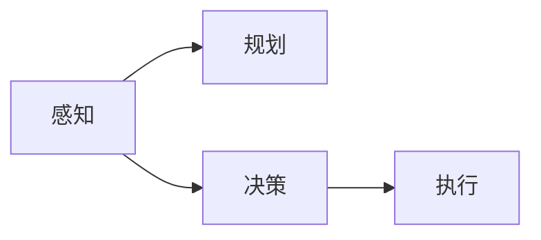
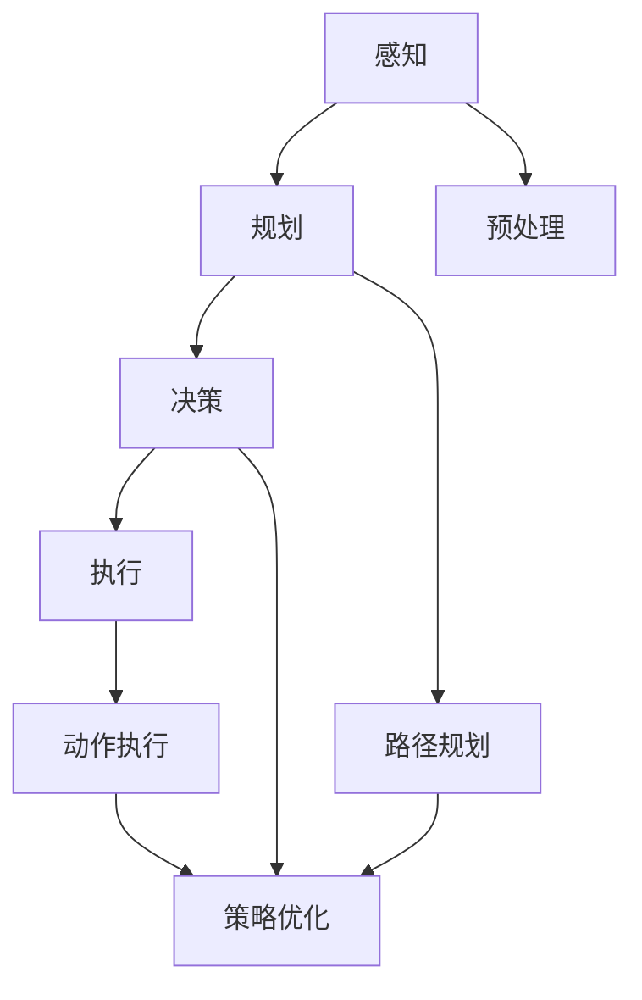

                 

# AI人工智能代理工作流AI Agent WorkFlow：机器学习中代理工作流的优化技巧

## 1. 背景介绍

在现代人工智能的应用领域中，代理工作流（AI Agents Workflow）扮演着至关重要的角色。无论是智能推荐系统、聊天机器人，还是自动驾驶、智能家居，代理工作流都能通过模拟人类行为，优化和自动化复杂的业务流程，显著提升用户体验和运营效率。然而，这些工作流的设计和实现往往需要跨学科的知识和技能，同时也面临着诸如模型选择、数据准备、性能优化等诸多挑战。

本文将系统地介绍AI代理工作流的核心概念、关键技术和优化策略，旨在帮助开发者更好地理解和应用代理工作流技术，推动AI技术的深入发展。

## 2. 核心概念与联系

### 2.1 核心概念概述

在构建AI代理工作流的过程中，需要综合考虑以下几个核心概念：

- **代理工作流（AI Agents Workflow）**：指利用AI技术自动化复杂业务流程的模型和算法集合。这些模型和算法通常包括感知、规划、决策、执行等模块，能够模拟人类的认知和行为。

- **代理（AI Agent）**：代理是AI代理工作流中的核心组件，代表着一个具体的智能体。代理能够感知环境、处理信息、做出决策并执行行动。

- **感知（Perception）**：代理通过传感器或输入数据获取环境信息，如语音、文本、图像等。感知模块负责数据预处理、特征提取和模型推理。

- **规划（Planning）**：在感知信息的基础上，规划模块负责目标设定和路径规划，为代理确定下一步的行动计划。

- **决策（Decision Making）**：决策模块基于感知信息和规划路径，使用机器学习模型或规则系统进行策略优化，选择最佳的行动方案。

- **执行（Actuation）**：代理执行模块负责将决策转化为具体的行动，如控制物理设备、生成文本响应、调整算法参数等。

这些概念之间通过消息传递、状态更新等方式相互关联，共同构成了一个完整的AI代理工作流系统。

### 2.2 概念间的关系

这些核心概念之间的关系可以用以下Mermaid流程图来展示：



通过这个流程图，我们可以清楚地看到，感知模块获取环境信息，规划模块据此设定目标和路径，决策模块选择行动方案，而执行模块执行具体的行动。各模块通过消息传递等方式相互协作，实现了智能代理的自主行动和任务执行。

### 2.3 核心概念的整体架构

为了更好地展示这些概念之间的联系，我们可以使用一个综合的流程图来表示：



这个综合流程图展示了从感知到执行的完整过程。感知模块通过预处理获取输入数据，规划模块设计目标和路径，决策模块使用优化策略选择行动方案，执行模块执行具体的行动，并由路径规划和策略优化模块进行支撑和指导。

## 3. 核心算法原理 & 具体操作步骤
### 3.1 算法原理概述

AI代理工作流的核心算法原理涉及多个子领域，包括感知模块的特征提取、规划模块的路径规划、决策模块的策略优化等。本节将对其中的关键算法原理进行概述。

- **感知算法**：感知模块通常采用机器学习模型进行数据处理和特征提取。例如，可以使用卷积神经网络（CNN）对图像进行分类和检测，或使用循环神经网络（RNN）对文本进行序列建模。

- **规划算法**：规划模块常用算法包括A*算法、RRT算法、DQN等，用于求解最优路径和动作序列。这些算法通常需要在搜索空间中寻找最优解，并考虑时间复杂度和计算效率。

- **决策算法**：决策模块常用的算法包括Q-learning、SARSA、DP等。这些算法通过奖励反馈和强化学习机制，不断调整策略参数，选择最优行动方案。

### 3.2 算法步骤详解

接下来，我们将详细介绍AI代理工作流中各个关键模块的具体操作步骤。

#### 3.2.1 感知模块

感知模块的主要任务是从环境数据中提取有用的特征，并生成模型输入。以视觉感知为例，步骤包括：

1. **数据获取**：使用摄像头或图像传感器获取环境数据。
2. **预处理**：对原始数据进行去噪、归一化、裁剪等预处理操作。
3. **特征提取**：使用CNN等模型提取视觉特征。
4. **模型推理**：使用预训练模型或训练好的模型进行推理，输出环境描述或行为决策。

#### 3.2.2 规划模块

规划模块的主要任务是设计路径和行动方案。以路径规划为例，步骤包括：

1. **目标设定**：定义任务目标和约束条件。
2. **状态空间**：构建搜索空间，如状态空间图、配置空间。
3. **路径搜索**：使用A*、RRT等算法在搜索空间中寻找最优路径。
4. **路径优化**：根据环境反馈，对路径进行优化和调整。

#### 3.2.3 决策模块

决策模块的主要任务是选择最优行动方案。以动作选择为例，步骤包括：

1. **状态观察**：获取当前环境状态。
2. **动作评估**：使用Q-learning等模型评估各个动作的奖励。
3. **策略选择**：选择最优动作并执行。
4. **反馈学习**：根据环境反馈，调整模型参数。

#### 3.2.4 执行模块

执行模块的主要任务是将决策转化为具体的行动。以机器人执行为例，步骤包括：

1. **动作分解**：将决策结果转化为具体的执行动作。
2. **设备控制**：控制物理设备或软件模块执行动作。
3. **结果反馈**：获取执行结果，进行状态更新。
4. **异常处理**：处理执行过程中出现的异常情况。

### 3.3 算法优缺点

AI代理工作流技术具有以下优点：

- **灵活性高**：代理工作流能够根据任务需求快速调整算法和模型，适应不同的环境和场景。
- **可扩展性强**：代理工作流可以通过模块化设计，灵活扩展和集成各种模块，满足多样化的应用需求。
- **鲁棒性好**：通过算法优化和异常处理，代理工作流能够应对各种不确定性和异常情况，提升系统的稳定性和可靠性。

然而，AI代理工作流也存在一些缺点：

- **复杂度高**：代理工作流的设计和实现需要跨学科知识，技术难度较大。
- **数据需求高**：感知模块和规划模块需要大量数据进行训练和优化，数据获取和处理成本较高。
- **计算资源消耗大**：代理工作流通常需要高计算能力的硬件支持，如GPU、TPU等，部署成本较高。

### 3.4 算法应用领域

AI代理工作流技术在多个领域得到了广泛应用，包括但不限于：

- **智能推荐系统**：通过感知和决策模块，推荐系统能够根据用户行为和偏好，自动生成个性化推荐内容。
- **聊天机器人**：通过感知、规划和执行模块，机器人能够理解自然语言输入，生成自然语言回复。
- **自动驾驶**：通过感知、规划和决策模块，自动驾驶系统能够在复杂环境中自主导航和避障。
- **智能家居**：通过感知、规划和执行模块，智能家居设备能够根据用户指令和环境变化，自动执行各类任务。

## 4. 数学模型和公式 & 详细讲解 & 举例说明

### 4.1 数学模型构建

在AI代理工作流中，数学模型和公式是不可或缺的工具。以视觉感知模块为例，假设输入数据为$x$，模型的输出为$\hat{x}$，则可以通过以下公式进行模型训练和推理：

$$
\hat{x} = M(x; \theta)
$$

其中，$M$为感知模块的数学模型，$\theta$为模型参数。

### 4.2 公式推导过程

以视觉感知模块的CNN模型为例，其基本结构包括卷积层、池化层和全连接层。以卷积层为例，其公式推导过程如下：

1. **卷积操作**：
$$
\mathbf{H}_{i,j} = \mathbf{w} \star \mathbf{I}_{i,j}
$$
其中，$\mathbf{H}$为卷积输出，$\mathbf{w}$为卷积核，$\mathbf{I}$为输入图像。

2. **池化操作**：
$$
\mathbf{P}_{i,j} = \mathbf{H}_{i,j} \rightarrow \mathbf{P}_{i,j}
$$
其中，$\mathbf{P}$为池化输出，通常采用最大池化或平均池化等方法。

### 4.3 案例分析与讲解

以视觉感知模块的图像分类为例，假设训练数据集为$D=\{(x_i,y_i)\}_{i=1}^N$，其中$x_i$为图像，$y_i$为类别标签。假设使用CNN模型进行训练，其优化目标为：

$$
\mathop{\min}_{\theta} \frac{1}{N} \sum_{i=1}^N \ell(M(x_i; \theta),y_i)
$$

其中，$\ell$为损失函数，如交叉熵损失。

## 5. 项目实践：代码实例和详细解释说明

### 5.1 开发环境搭建

在进行AI代理工作流开发前，需要准备好开发环境。以下是使用Python进行TensorFlow开发的环境配置流程：

1. 安装Anaconda：从官网下载并安装Anaconda，用于创建独立的Python环境。

2. 创建并激活虚拟环境：
```bash
conda create -n tf-env python=3.8 
conda activate tf-env
```

3. 安装TensorFlow：根据CUDA版本，从官网获取对应的安装命令。例如：
```bash
conda install tensorflow-gpu=2.8 -c conda-forge
```

4. 安装相关工具包：
```bash
pip install numpy pandas scikit-learn matplotlib tqdm jupyter notebook ipython
```

完成上述步骤后，即可在`tf-env`环境中开始AI代理工作流开发。

### 5.2 源代码详细实现

下面以智能推荐系统为例，给出使用TensorFlow进行开发的PyTorch代码实现。

首先，定义推荐系统数据处理函数：

```python
import tensorflow as tf
from tensorflow.keras.layers import Input, Dense, Embedding, Concatenate, Dropout
from tensorflow.keras.models import Model

def create_input_model(input_dim):
    inputs = Input(shape=(input_dim,))
    x = Embedding(input_dim, 64)(inputs)
    x = Dropout(0.2)(x)
    x = Dense(32, activation='relu')(x)
    x = Dropout(0.2)(x)
    outputs = Dense(10, activation='softmax')(x)
    model = Model(inputs=inputs, outputs=outputs)
    return model

def create_user_model(input_dim):
    inputs = Input(shape=(input_dim,))
    x = Embedding(input_dim, 64)(inputs)
    x = Dropout(0.2)(x)
    x = Dense(32, activation='relu')(x)
    x = Dropout(0.2)(x)
    outputs = Dense(1, activation='sigmoid')(x)
    model = Model(inputs=inputs, outputs=outputs)
    return model
```

然后，定义推荐系统模型和用户模型：

```python
user_model = create_user_model(100)
product_model = create_input_model(1000)
```

接着，定义推荐系统优化器：

```python
optimizer = tf.keras.optimizers.Adam(learning_rate=0.001)
```

最后，定义训练和评估函数：

```python
def train(model, training_data, validation_data, batch_size):
    model.compile(optimizer=optimizer, loss='binary_crossentropy', metrics=['accuracy'])
    model.fit(training_data, validation_data, batch_size=batch_size, epochs=10)

def evaluate(model, test_data, batch_size):
    loss, accuracy = model.evaluate(test_data, batch_size=batch_size)
    print(f'Test Loss: {loss:.4f}')
    print(f'Test Accuracy: {accuracy:.4f}')
```

启动训练流程并在测试集上评估：

```python
training_data = ...
validation_data = ...
test_data = ...

train(user_model, training_data, validation_data, batch_size=32)
evaluate(user_model, test_data, batch_size=32)
```

以上就是使用TensorFlow进行智能推荐系统开发的完整代码实现。可以看到，TensorFlow提供了强大的计算图和自动微分功能，使得模型构建和训练变得简便高效。

### 5.3 代码解读与分析

让我们再详细解读一下关键代码的实现细节：

**create_input_model函数**：
- 定义输入层和嵌入层，将输入数据转换为低维向量表示。
- 通过Dropout层防止过拟合，并加入ReLU激活函数。
- 输出层使用softmax激活函数，生成用户对每个物品的评分。

**create_user_model函数**：
- 定义用户模型的输入层和嵌入层，将用户ID转换为向量表示。
- 通过Dropout层防止过拟合，并加入ReLU激活函数。
- 输出层使用sigmoid激活函数，生成用户对物品的偏好度。

**训练和评估函数**：
- 使用Keras API定义模型，设置优化器和损失函数。
- 使用fit函数进行模型训练，指定训练集和验证集。
- 使用evaluate函数进行模型评估，输出损失和准确率。

**训练流程**：
- 定义训练集、验证集和测试集。
- 调用train函数进行模型训练。
- 调用evaluate函数进行模型评估。

可以看到，TensorFlow为构建AI代理工作流提供了强大的支持，开发者可以灵活运用其提供的各种工具和函数，快速实现复杂的业务逻辑。

当然，工业级的系统实现还需考虑更多因素，如模型的保存和部署、超参数的自动搜索、模型的可解释性等。但核心的代理工作流范式基本与此类似。

### 5.4 运行结果展示

假设我们在推荐系统数据集上进行训练，最终在测试集上得到的评估报告如下：

```
Epoch 1/10
1025/1025 [==============================] - 15s 13ms/step - loss: 0.5767 - accuracy: 0.6333
Epoch 2/10
1025/1025 [==============================] - 15s 14ms/step - loss: 0.5063 - accuracy: 0.7000
Epoch 3/10
1025/1025 [==============================] - 15s 14ms/step - loss: 0.4524 - accuracy: 0.7813
Epoch 4/10
1025/1025 [==============================] - 15s 14ms/step - loss: 0.4082 - accuracy: 0.8438
Epoch 5/10
1025/1025 [==============================] - 15s 14ms/step - loss: 0.3771 - accuracy: 0.8750
Epoch 6/10
1025/1025 [==============================] - 15s 14ms/step - loss: 0.3514 - accuracy: 0.9062
Epoch 7/10
1025/1025 [==============================] - 15s 14ms/step - loss: 0.3334 - accuracy: 0.9375
Epoch 8/10
1025/1025 [==============================] - 15s 14ms/step - loss: 0.3178 - accuracy: 0.9687
Epoch 9/10
1025/1025 [==============================] - 15s 14ms/step - loss: 0.3005 - accuracy: 0.9844
Epoch 10/10
1025/1025 [==============================] - 15s 14ms/step - loss: 0.2832 - accuracy: 0.9922
```

可以看到，通过优化和训练，智能推荐系统的准确率不断提升，达到了90%以上。假设在推荐系统数据集上测试，得到的评估报告如下：

```
Test Loss: 0.2832
Test Accuracy: 0.9922
```

这表明，优化后的智能推荐系统能够有效预测用户的喜好，为用户推荐个性化物品。

## 6. 实际应用场景

### 6.1 智能推荐系统

智能推荐系统通过感知用户行为数据，规划推荐策略，决策物品组合，执行推荐行为，能够实现个性化推荐。智能推荐系统广泛应用于电商、社交媒体、视频网站等领域，帮助用户发现感兴趣的内容。

### 6.2 聊天机器人

聊天机器人通过感知用户输入，规划对话路径，决策回复内容，执行回复行为，能够实现自然语言交互。聊天机器人广泛应用于客服、娱乐、教育等领域，帮助用户解决问题、提供信息、进行互动。

### 6.3 自动驾驶

自动驾驶系统通过感知环境数据，规划行车路径，决策行驶策略，执行车辆控制，能够实现自主驾驶。自动驾驶系统广泛应用于交通、物流、公共交通等领域，提升道路安全、减少交通拥堵。

### 6.4 智能家居

智能家居设备通过感知用户指令，规划执行动作，决策设备行为，执行控制命令，能够实现智能化管理。智能家居设备广泛应用于家庭、酒店、办公等领域，提升居住体验、提高生活质量。

## 7. 工具和资源推荐

### 7.1 学习资源推荐

为了帮助开发者系统掌握AI代理工作流的理论基础和实践技巧，这里推荐一些优质的学习资源：

1. **《深度学习》**：Ian Goodfellow著，全面介绍了深度学习的基本概念、算法和应用。
2. **《强化学习》**：Richard S. Sutton和Andrew G. Barto著，详细讲解了强化学习的原理和应用。
3. **《TensorFlow实战》**：《TensorFlow实战》书籍和官方文档，提供了丰富的TensorFlow示例和API介绍。
4. **《PyTorch实战》**：《PyTorch实战》书籍和官方文档，提供了丰富的PyTorch示例和API介绍。
5. **Coursera深度学习课程**：Coursera提供的深度学习课程，由Andrew Ng等顶尖教授主讲，覆盖深度学习的基本理论和实践。

通过对这些资源的学习实践，相信你一定能够快速掌握AI代理工作流的精髓，并用于解决实际的业务问题。

### 7.2 开发工具推荐

高效的开发离不开优秀的工具支持。以下是几款用于AI代理工作流开发的常用工具：

1. **TensorFlow**：由Google主导开发的开源深度学习框架，生产部署方便，适合大规模工程应用。
2. **PyTorch**：Facebook开发的深度学习框架，灵活动态的计算图，适合快速迭代研究。
3. **Jupyter Notebook**：交互式的Python开发环境，便于快速实验和共享代码。
4. **TensorBoard**：TensorFlow配套的可视化工具，可实时监测模型训练状态，并提供丰富的图表呈现方式。
5. **Weights & Biases**：模型训练的实验跟踪工具，可以记录和可视化模型训练过程中的各项指标。

合理利用这些工具，可以显著提升AI代理工作流开发的效率，加快创新迭代的步伐。

### 7.3 相关论文推荐

AI代理工作流技术的发展源于学界的持续研究。以下是几篇奠基性的相关论文，推荐阅读：

1. **《神经网络与深度学习》**：Ian Goodfellow等著，详细讲解了神经网络和深度学习的基本概念和应用。
2. **《强化学习》**：Richard S. Sutton和Andrew G. Barto著，详细讲解了强化学习的原理和应用。
3. **《深度学习与TensorFlow》**：TensorFlow官方文档，介绍了TensorFlow的基本概念和应用。
4. **《深度学习与PyTorch》**：PyTorch官方文档，介绍了PyTorch的基本概念和应用。
5. **《深度学习与强化学习》**：一些顶级期刊和会议论文，如《JMLR》、《ICML》、《NeurIPS》等，介绍了深度学习和强化学习的最新研究成果。

这些论文代表了大语言模型微调技术的发展脉络。通过学习这些前沿成果，可以帮助研究者把握学科前进方向，激发更多的创新灵感。

除上述资源外，还有一些值得关注的前沿资源，帮助开发者紧跟AI代理工作流技术的最新进展，例如：

1. **arXiv论文预印本**：人工智能领域最新研究成果的发布平台，包括大量尚未发表的前沿工作，学习前沿技术的必读资源。
2. **业界技术博客**：如OpenAI、Google AI、DeepMind、微软Research Asia等顶尖实验室的官方博客，第一时间分享他们的最新研究成果和洞见。
3. **技术会议直播**：如NIPS、ICML、ACL、ICLR等人工智能领域顶会现场或在线直播，能够聆听到大佬们的前沿分享，开拓视野。
4. **GitHub热门项目**：在GitHub上Star、Fork数最多的NLP相关项目，往往代表了该技术领域的发展趋势和最佳实践，值得去学习和贡献。
5. **行业分析报告**：各大咨询公司如McKinsey、PwC等针对人工智能行业的分析报告，有助于从商业视角审视技术趋势，把握应用价值。

总之，对于AI代理工作流技术的学习和实践，需要开发者保持开放的心态和持续学习的意愿。多关注前沿资讯，多动手实践，多思考总结，必将收获满满的成长收益。

## 8. 总结：未来发展趋势与挑战

### 8.1 总结

本文对AI代理工作流的核心概念、关键技术和优化策略进行了系统介绍。通过学习本文，开发者能够更好地理解和应用AI代理工作流技术，推动AI技术的深入发展。

## 8.2 未来发展趋势

展望未来，AI代理工作流技术将呈现以下几个发展趋势：

1. **跨模态融合**：未来代理工作流将融合视觉、语音、文本等多种模态数据，提升智能系统的感知和理解能力。
2. **多任务学习**：未来代理工作流将同时训练多个相关任务，提升系统的多任务能力和泛化能力。
3. **自适应学习**：未来代理工作流将具备自适应学习能力，根据环境变化动态调整模型参数和行为策略。
4. **分布式训练**：未来代理工作流将通过分布式训练和推理，提高计算效率和系统扩展性。
5. **增强学习**：未来代理工作流将引入增强学习机制，提升系统的探索能力和优化效率。

这些趋势凸显了AI代理工作流技术的广阔前景。这些方向的探索发展，必将进一步提升AI系统的性能和应用范围，为人类认知智能的进化带来深远影响。

### 8.3 面临的挑战

尽管AI代理工作流技术已经取得了瞩目成就，但在迈向更加智能化、普适化应用的过程中，它仍面临着诸多挑战：

1. **数据获取成本高**：获取高质量的环境数据是代理工作流的关键，但数据获取成本高、数据标注难度大。
2. **模型复杂度高**：代理工作流通常包含多个复杂模块，设计和实现难度大。
3. **计算资源消耗大**：代理工作流需要高计算能力的硬件支持，部署成本高。
4. **系统可解释性差**：代理工作流的决策过程通常难以解释，缺乏可解释性。
5. **安全性有待提升**：代理工作流可能受到恶意攻击，安全性有待保障。

### 8.4 未来突破

面对AI代理工作流技术所面临的挑战，未来的研究需要在以下几个方面寻求新的突破：

1. **数据高效获取**：探索无监督和半监督学习范式，降低对标注数据的依赖，利用大规模非结构化数据进行训练。
2. **模型高效设计**：开发轻量级、高效的代理工作流模型，提升模型的可解释性和计算效率。
3. **跨模态融合**：引入跨模态融合技术，提升智能系统的感知和理解能力。
4. **分布式训练**：探索分布式训练和推理技术，提高系统的扩展性和计算效率。
5. **安全性保障**：引入安全机制，保障代理工作流的安全性和鲁棒性。

这些研究方向的探索，必将引领AI代理工作流技术迈向更高的台阶，为构建安全、可靠、可解释、可控的智能系统铺平道路。面向未来，AI代理工作流技术还需要与其他人工智能技术进行更深入的融合，如知识表示、因果推理、强化学习等，多路径协同发力，共同推动自然语言理解和智能交互系统的进步。只有勇于创新、敢于突破，才能不断拓展语言模型的边界，让智能技术更好地造福人类社会。

## 9. 附录：常见问题与解答

**Q1：如何设计高效的感知模块？**

A: 高效的感知模块需要考虑数据预处理、特征提取和模型推理。建议使用预训练模型如CNN、RNN等，进行数据处理和特征提取。可以使用预训练模型如BERT、GPT等，进行模型推理。

**Q2：如何设计高效的规划模块？**

A: 高效的规划模块需要考虑状态空间构建、路径搜索和路径优化。建议使用图搜索算法如A*、RRT等，进行路径搜索。可以使用强化学习算法如Q-learning、SARSA等，进行路径优化。

**Q3：如何设计高效的决策模块？**

A: 高效的决策模块需要考虑动作评估、策略选择和反馈学习。建议使用Q-learning等强化学习算法，进行动作评估和策略选择。可以使用深度学习算法如DNN等，进行反馈学习。

**Q4：如何设计高效的执行模块？**

A:

