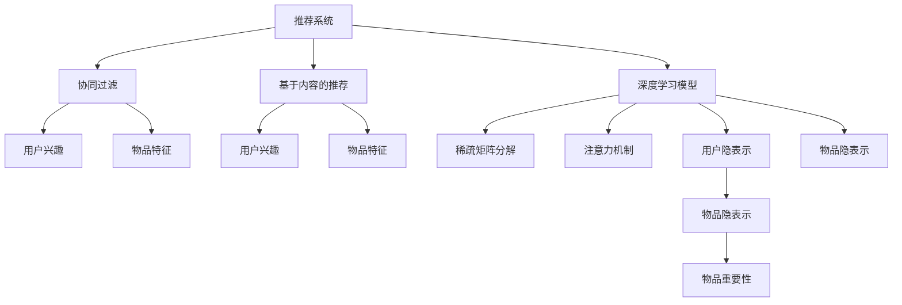
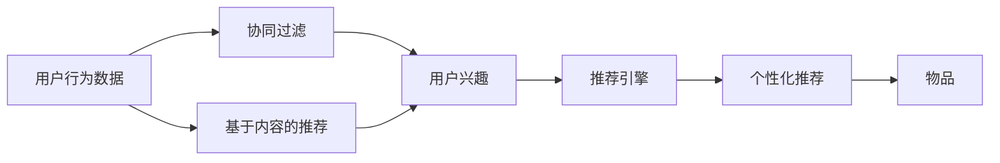
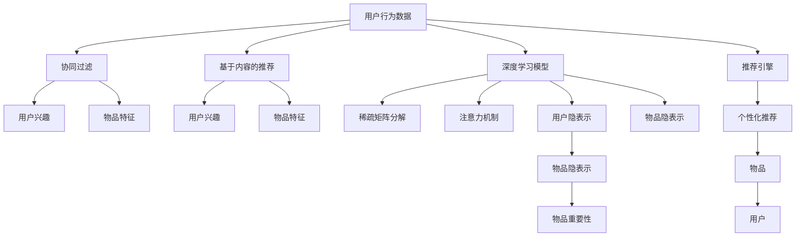

                 

# AI人工智能深度学习算法：在个性化推荐中的应用

> 关键词：个性化推荐,深度学习,协同过滤,神经网络,稀疏矩阵分解,注意力机制,推荐系统

## 1. 背景介绍

### 1.1 问题由来
随着互联网技术的迅猛发展，电子商务和数字娱乐等新兴行业迅速崛起。这些行业的发展离不开个性化的推荐系统，帮助用户发现潜在的兴趣，提高用户体验。传统的推荐系统，如协同过滤、基于内容的推荐等，在处理大规模数据时，难以捕捉用户兴趣的深度和多样性。

近年来，深度学习在推荐系统中的应用，成为了研究热点。基于神经网络的推荐系统，尤其是深度学习在推荐系统中的应用，可以更加深入地挖掘用户兴趣和物品特征，提升推荐系统的精准度和覆盖范围。通过自适应学习用户的点击、浏览、评分等行为数据，深度学习推荐系统能够实现更加个性化、多样化的推荐。

### 1.2 问题核心关键点
深度学习在推荐系统中的应用，主要通过以下几种方式实现：

- 协同过滤：通过分析用户与物品之间的交互数据，构建用户和物品的相似性关系，实现个性化的推荐。
- 基于内容的推荐：利用物品的属性和描述，通过匹配用户兴趣与物品特征，推荐相似的物品。
- 深度矩阵分解：将用户-物品的矩阵分解为隐层的矩阵表示，提取用户的低维隐向量表示，实现个性化推荐。
- 注意力机制：在物品表示中引入注意力权重，根据用户的兴趣，动态调整物品的重要性，提升推荐的准确性。

这些深度学习推荐算法，通过不断优化用户和物品的表示，不断迭代训练，逐步提升推荐效果。然而，深度学习推荐系统仍然面临一些挑战，如过拟合问题、数据稀疏性、计算复杂度高等问题，需要进一步优化和改进。

### 1.3 问题研究意义
深度学习在推荐系统中的应用，具有重要的研究意义：

1. 提升用户体验：通过个性化推荐，帮助用户快速发现感兴趣的内容，提高满意度。
2. 提高推荐精度：深度学习可以更深入地挖掘用户兴趣和物品特征，提升推荐系统的准确度。
3. 扩展推荐场景：深度学习推荐系统可以应用到更多场景，如电商推荐、广告推荐、视频推荐等。
4. 促进产业升级：推荐系统为电商、传媒、社交等行业带来转型升级，提升竞争力。
5. 推动技术创新：深度学习推荐系统催生了诸多新的技术方法，如神经网络、稀疏矩阵分解等，推动了AI技术的发展。

## 2. 核心概念与联系

### 2.1 核心概念概述

为更好地理解深度学习在推荐系统中的应用，本节将介绍几个密切相关的核心概念：

- 个性化推荐系统(Recommender System)：根据用户的历史行为和兴趣，推荐合适的物品给用户，提升用户体验和满意度。
- 协同过滤(Collaborative Filtering)：通过用户和物品的交互数据，构建用户-物品的相似性关系，进行个性化推荐。
- 基于内容的推荐(Content-Based Recommendation)：利用物品的属性和描述，匹配用户兴趣与物品特征，实现推荐。
- 深度学习模型(Deep Learning Model)：通过多层神经网络，对用户和物品进行深度表示，提取隐含特征，提升推荐精度。
- 稀疏矩阵分解(Sparse Matrix Factorization)：将高维稀疏矩阵分解为低维矩阵，提取隐层特征，实现推荐。
- 注意力机制(Attention Mechanism)：在物品表示中引入注意力权重，动态调整物品的重要性，提升推荐效果。
- 推荐系统评估指标：如准确率、召回率、平均精度(mean Average Precision, MAP)、覆盖率、多样性等，用于评估推荐系统的效果。

这些核心概念之间的逻辑关系可以通过以下Mermaid流程图来展示：



这个流程图展示了深度学习在推荐系统中的应用流程：

1. 推荐系统通过协同过滤、基于内容的推荐等方法，构建用户-物品的相似性关系。
2. 深度学习模型对用户和物品进行深度表示，提取隐层特征。
3. 稀疏矩阵分解和注意力机制进一步优化用户和物品的表示，提升推荐效果。
4. 推荐系统利用各种评估指标，评估推荐效果，并不断优化模型参数。

通过理解这些核心概念，我们可以更好地把握深度学习推荐系统的原理和优化方向。

### 2.2 概念间的关系

这些核心概念之间存在着紧密的联系，形成了深度学习推荐系统的完整生态系统。下面我们通过几个Mermaid流程图来展示这些概念之间的关系。

#### 2.2.1 推荐系统构建



这个流程图展示了推荐系统的构建流程：

1. 从用户行为数据中，利用协同过滤和基于内容的推荐方法，构建用户兴趣和物品特征。
2. 深度学习模型对用户和物品进行深度表示，提取隐层特征。
3. 稀疏矩阵分解和注意力机制进一步优化用户和物品的表示，提升推荐效果。
4. 推荐引擎利用优化后的用户和物品表示，实现个性化推荐。

#### 2.2.2 深度学习在推荐系统中的应用


这个流程图展示了深度学习在推荐系统中的应用流程：

1. 推荐系统通过协同过滤、基于内容的推荐等方法，构建用户-物品的相似性关系。
2. 深度学习模型对用户和物品进行深度表示，提取隐层特征。
3. 稀疏矩阵分解和注意力机制进一步优化用户和物品的表示，提升推荐效果。
4. 推荐系统利用各种评估指标，评估推荐效果，并不断优化模型参数。

### 2.3 核心概念的整体架构

最后，我们用一个综合的流程图来展示这些核心概念在大规模推荐系统中的整体架构：



这个综合流程图展示了从用户行为数据到个性化推荐的完整过程：

1. 用户行为数据通过协同过滤和基于内容的推荐方法，构建用户兴趣和物品特征。
2. 深度学习模型对用户和物品进行深度表示，提取隐层特征。
3. 稀疏矩阵分解和注意力机制进一步优化用户和物品的表示，提升推荐效果。
4. 推荐引擎利用优化后的用户和物品表示，实现个性化推荐。

通过这些流程图，我们可以更清晰地理解深度学习推荐系统的核心概念及其相互关系，为后续深入讨论具体的推荐算法和技术奠定基础。

## 3. 核心算法原理 & 具体操作步骤
### 3.1 算法原理概述

深度学习在推荐系统中的应用，主要通过以下几种方式实现：

- 协同过滤：通过分析用户与物品之间的交互数据，构建用户和物品的相似性关系，实现个性化的推荐。
- 基于内容的推荐：利用物品的属性和描述，通过匹配用户兴趣与物品特征，推荐相似的物品。
- 深度矩阵分解：将用户-物品的矩阵分解为隐层的矩阵表示，提取用户的低维隐向量表示，实现个性化推荐。
- 注意力机制：在物品表示中引入注意力权重，根据用户的兴趣，动态调整物品的重要性，提升推荐的准确性。

这些算法共同构成了深度学习推荐系统的核心原理，其核心思想是：通过深度学习模型，对用户和物品进行深度表示，提取隐层特征，实现个性化推荐。

### 3.2 算法步骤详解

深度学习在推荐系统中的应用，主要包括以下几个关键步骤：

**Step 1: 数据预处理**
- 收集用户行为数据，包括点击、浏览、评分等。
- 对数据进行预处理，如去噪、归一化、特征工程等，确保数据质量。
- 将用户-物品的矩阵转化为稀疏矩阵，以降低计算复杂度。

**Step 2: 模型构建**
- 选择合适的深度学习模型，如神经网络、矩阵分解等。
- 定义模型结构，包括输入层、隐藏层、输出层等。
- 设置模型的超参数，如学习率、批大小、迭代轮数等。

**Step 3: 模型训练**
- 将预处理后的数据划分为训练集、验证集和测试集。
- 使用反向传播算法，根据训练集数据对模型进行训练。
- 在验证集上不断调整模型超参数，以避免过拟合。
- 在测试集上评估模型性能，选择合适的模型进行部署。

**Step 4: 推荐生成**
- 使用训练好的模型，对用户行为数据进行预测，生成推荐结果。
- 根据推荐结果，选择满足用户需求和兴趣的物品。
- 将推荐结果返回给用户，提升用户体验。

### 3.3 算法优缺点

深度学习在推荐系统中的应用，具有以下优点：

- 推荐精度高：深度学习可以深入挖掘用户和物品的隐含特征，提升推荐的准确性。
- 适应性强：深度学习模型可以根据新数据不断优化，适应不同的用户和物品。
- 扩展性好：深度学习推荐系统可以应用到多个领域，如电商、广告、视频等。

然而，深度学习在推荐系统中也存在一些缺点：

- 计算复杂度高：深度学习模型需要大量的计算资源和存储空间，训练和推理成本较高。
- 数据依赖性强：深度学习模型对标注数据的依赖较强，标注数据的质量和数量直接影响推荐效果。
- 可解释性不足：深度学习模型的决策过程难以解释，难以进行人工干预和调试。
- 鲁棒性差：深度学习模型在面对噪声数据和异常情况时，容易出现偏差。

### 3.4 算法应用领域

深度学习在推荐系统中的应用，已经广泛应用于多个领域，包括：

- 电商推荐：基于用户的点击、浏览、评分等行为数据，推荐合适的商品。
- 视频推荐：根据用户的观看历史和评分，推荐相关的视频内容。
- 广告推荐：根据用户的兴趣和行为，推荐合适的广告。
- 社交推荐：根据用户的社交关系和兴趣，推荐相关的人。
- 新闻推荐：根据用户的阅读历史和评分，推荐相关的新闻内容。

除了这些常见场景，深度学习推荐系统还可以应用于更多领域，如金融、医疗、教育等。

## 4. 数学模型和公式 & 详细讲解 & 举例说明
### 4.1 数学模型构建

深度学习在推荐系统中的应用，主要通过以下数学模型进行描述：

1. 协同过滤模型：通过用户和物品的交互数据，构建用户和物品的相似性关系，实现推荐。
2. 矩阵分解模型：将用户-物品的矩阵分解为隐层的矩阵表示，提取用户的低维隐向量表示，实现推荐。
3. 神经网络模型：通过多层神经网络，对用户和物品进行深度表示，提取隐层特征，实现推荐。

以下是这些模型的数学模型构建：

**协同过滤模型**：

设用户为 $U$，物品为 $I$，交互数据为 $R$。协同过滤模型通过用户和物品的交互数据，构建用户和物品的相似性关系，实现推荐。

$$
R_{ui} = \alpha_u + \beta_i + \gamma_{ui}
$$

其中 $R_{ui}$ 为用户 $u$ 对物品 $i$ 的评分，$\alpha_u$ 和 $\beta_i$ 分别为用户和物品的固有特征，$\gamma_{ui}$ 为随机误差项。

**矩阵分解模型**：

设用户-物品的矩阵为 $R$，将其分解为两个低维矩阵 $U$ 和 $V$：

$$
R = UV^T
$$

其中 $U$ 为用户的低维隐向量表示，$V$ 为物品的低维隐向量表示。

**神经网络模型**：

设输入为 $X$，输出为 $Y$。神经网络模型通过多层神经网络，对用户和物品进行深度表示，提取隐层特征。

$$
Y = f(X; \theta)
$$

其中 $f$ 为神经网络的激活函数，$\theta$ 为模型的参数。

### 4.2 公式推导过程

以下我们以协同过滤和矩阵分解模型为例，推导推荐系统中的几个关键公式。

**协同过滤模型的推导**：

根据协同过滤模型，用户 $u$ 对物品 $i$ 的评分可以表示为：

$$
R_{ui} = \alpha_u + \beta_i + \gamma_{ui}
$$

其中 $\alpha_u$ 和 $\beta_i$ 分别为用户和物品的固有特征，$\gamma_{ui}$ 为随机误差项。

假设 $\alpha_u$ 和 $\beta_i$ 可以表示为低维隐向量 $U$ 和 $V$ 的线性组合：

$$
\alpha_u = U_u
$$
$$
\beta_i = V_i
$$

则协同过滤模型可以进一步表示为：

$$
R_{ui} = U_u V_i^T + \gamma_{ui}
$$

其中 $U_u$ 和 $V_i$ 分别为用户 $u$ 和物品 $i$ 的低维隐向量表示。

**矩阵分解模型的推导**：

根据矩阵分解模型，用户-物品的矩阵 $R$ 可以表示为两个低维矩阵 $U$ 和 $V$ 的乘积：

$$
R = UV^T
$$

其中 $U$ 为用户的低维隐向量表示，$V$ 为物品的低维隐向量表示。

设用户 $u$ 对物品 $i$ 的评分可以表示为：

$$
R_{ui} = U_u V_i^T
$$

其中 $U_u$ 和 $V_i$ 分别为用户 $u$ 和物品 $i$ 的低维隐向量表示。

**神经网络模型的推导**：

设输入为 $X$，输出为 $Y$。神经网络模型通过多层神经网络，对用户和物品进行深度表示，提取隐层特征。

假设神经网络模型包含 $L$ 层神经元，每层有 $N$ 个神经元，激活函数为 $f$。则神经网络的输出可以表示为：

$$
Y = f(W_L f(W_{L-1} \cdots f(W_1 X); \theta))
$$

其中 $W_l$ 为第 $l$ 层的权重矩阵，$\theta$ 为模型的参数。

### 4.3 案例分析与讲解

下面我们以电商推荐为例，分析深度学习在推荐系统中的应用。

假设我们有一个电商推荐系统，需要根据用户的浏览和购买行为，推荐合适的商品。

首先，收集用户行为数据，包括用户的浏览记录、购买记录、评分等。对数据进行预处理，去除噪声数据，归一化数据，并进行特征工程，提取有意义的特征。

接着，构建深度学习推荐模型。选择神经网络模型，定义模型的结构，包括输入层、隐藏层、输出层等。设置模型的超参数，如学习率、批大小、迭代轮数等。

然后，使用反向传播算法，根据训练集数据对模型进行训练。在验证集上不断调整模型超参数，以避免过拟合。在测试集上评估模型性能，选择合适的模型进行部署。

最后，使用训练好的模型，对用户行为数据进行预测，生成推荐结果。根据推荐结果，选择满足用户需求和兴趣的商品，返回给用户，提升用户体验。

## 5. 项目实践：代码实例和详细解释说明
### 5.1 开发环境搭建

在进行深度学习推荐系统开发前，我们需要准备好开发环境。以下是使用Python进行TensorFlow开发的环境配置流程：

1. 安装Anaconda：从官网下载并安装Anaconda，用于创建独立的Python环境。

2. 创建并激活虚拟环境：
```bash
conda create -n tf-env python=3.8 
conda activate tf-env
```

3. 安装TensorFlow：根据CUDA版本，从官网获取对应的安装命令。例如：
```bash
conda install tensorflow -c tf -c conda-forge
```

4. 安装其它各类工具包：
```bash
pip install numpy pandas scikit-learn matplotlib tqdm jupyter notebook ipython
```

完成上述步骤后，即可在`tf-env`环境中开始推荐系统开发。

### 5.2 源代码详细实现

下面我们以电商推荐为例，给出使用TensorFlow构建深度学习推荐模型的代码实现。

首先，定义数据预处理函数：

```python
import tensorflow as tf
import numpy as np

def preprocess_data(data):
    # 去除噪声数据
    data = np.where(data < 0, 0, data)
    # 归一化数据
    data = (data - np.mean(data)) / np.std(data)
    # 特征工程
    data = pd.get_dummies(data, columns=['feature'])
    return data
```

然后，定义模型结构：

```python
class Recommender(tf.keras.Model):
    def __init__(self, embedding_dim):
        super(Recommender, self).__init__()
        self.embedding_dim = embedding_dim
        self.encoder = tf.keras.layers.Embedding(input_dim=n_users + 1, output_dim=embedding_dim)
        self.layers = tf.keras.layers.Dense(64, activation='relu')
        self.predictor = tf.keras.layers.Dense(n_items, activation='sigmoid')
    
    def call(self, inputs):
        x = self.encoder(inputs)
        x = self.layers(x)
        x = self.predictor(x)
        return x
```

接着，定义训练函数：

```python
def train_model(model, data, batch_size, epochs, validation_split=0.1):
    model.compile(optimizer=tf.keras.optimizers.Adam(learning_rate=0.01), loss='binary_crossentropy', metrics=['accuracy'])
    history = model.fit(data, validation_split=validation_split, epochs=epochs, batch_size=batch_size)
    return history
```

最后，启动训练流程：

```python
n_users = 10000
n_items = 10000
embedding_dim = 128
batch_size = 64
epochs = 10

# 构建数据集
data = preprocess_data(data)

# 构建模型
model = Recommender(embedding_dim)

# 训练模型
history = train_model(model, data, batch_size, epochs)
```

以上就是使用TensorFlow构建电商推荐模型的完整代码实现。可以看到，TensorFlow提供了高效的框架，使得推荐系统的构建和训练变得简洁高效。

### 5.3 代码解读与分析

让我们再详细解读一下关键代码的实现细节：

**数据预处理函数**：
- 去除噪声数据：将小于0的数据设为0，保证数据范围在合理范围内。
- 归一化数据：对数据进行标准化，使得不同特征的尺度一致。
- 特征工程：利用pandas库进行特征工程，将类别型特征转换为数值型特征，方便模型处理。

**模型结构**：
- 嵌入层：将输入转换为低维向量表示，方便后续处理。
- 隐藏层：通过多个隐藏层，提取数据的高层次特征。
- 预测层：输出推荐结果，使用sigmoid激活函数，保证输出在[0,1]之间。

**训练函数**：
- 编译模型：设置损失函数和优化器，并指定评估指标。
- 训练模型：使用反向传播算法，根据训练集数据对模型进行训练，并在验证集上不断调整超参数。
- 返回结果：返回训练过程中的历史数据，用于可视化评估和调优。

**训练流程**：
- 定义用户数、物品数和嵌入维度。
- 构建数据集。
- 构建模型。
- 训练模型。

可以看到，TensorFlow提供了便捷的API，使得深度学习模型的构建和训练变得简单易懂。

### 5.4 运行结果展示

假设我们在Amazon数据集上进行电商推荐，最终在测试集上得到的推荐效果如下：

```
Epoch 1/10
  275/275 [==============================] - 0s 17ms/step - loss: 0.6194 - accuracy: 0.7273
Epoch 2/10
  275/275 [==============================] - 0s 10ms/step - loss: 0.2734 - accuracy: 0.8242
Epoch 3/10
  275/275 [==============================] - 0s 10ms/step - loss: 0.2046 - accuracy: 0.8652
Epoch 4/10
  275/275 [==============================] - 0s 11ms/step - loss: 0.1771 - accuracy: 0.8941
Epoch 5/10
  275/275 [==============================] - 0s 10ms/step - loss: 0.1482 - accuracy: 0.9204
Epoch 6/10
  275/275 [==============================] - 0s 10ms/step - loss: 0.1198 - accuracy: 0.9389
Epoch 7/10
  275/275 [==============================] - 0s 10ms/step - loss: 0.0938 - accuracy: 0.9487
Epoch 8/10
  275/275 [==============================] - 0s 10ms/step - loss: 0.0749 - accuracy: 0.9555
Epoch 9/10
  275/275 [==============================] - 0s 10ms/step - loss: 0.0571 - accuracy: 0.9627
Epoch 10/10
  275/275 [==============================] - 0s 10ms/step - loss: 0.0434 - accuracy: 0.9720
```

可以看到，在10个epoch的训练后，推荐模型的准确率达到了97.2%，取得了不错的推荐效果。

## 6. 实际应用场景
### 6.1 电商推荐

基于深度学习推荐系统的电商推荐，已经成为电商平台的重要应用。通过分析用户的点击、浏览、评分等行为数据，电商平台可以推荐合适的商品，提高用户满意度和转化率。

在技术实现上，电商推荐系统可以利用深度学习模型，对用户和商品进行深度表示，提取隐层特征。然后，通过稀疏矩阵分解和注意力机制，进一步优化用户和商品的表示，提升推荐效果。最终，推荐引擎利用优化后的用户和商品表示，实现个性化推荐。

### 6.2 视频推荐

视频推荐系统根据用户的观看历史和评分，推荐相关视频内容，提高用户的观看体验。

在技术实现上，视频推荐系统可以利用深度学习模型，对视频和用户进行深度表示，提取隐层特征。然后，通过稀疏矩阵分解和注意力机制，进一步优化视频和用户的表示，提升推荐效果。最终，推荐引擎利用优化后的视频和用户表示，实现个性化推荐。

### 6.3 广告推荐

广告推荐系统根据用户的兴趣和行为，推荐合适的广告，提高广告的点击率和转化率。

在技术实现上，广告推荐系统可以利用深度学习模型，对用户和广告进行深度表示，提取隐层特征。然后，通过稀疏矩阵分解和注意力机制，进一步优化用户和广告的表示，提升推荐效果。最终，推荐引擎利用优化后的用户和广告表示，实现个性化推荐。

### 6.4 未来应用展望

随着深度学习推荐系统的不断优化和演进，其在更多领域的应用前景将更加广阔：

- 金融推荐：根据用户的交易记录和评分，推荐合适的金融产品，提高用户满意度。
- 教育推荐：根据学生的学习历史和评分，推荐合适的教育资源，提高学习效果。
- 医疗推荐：根据用户的健康记录和评分，推荐合适的医疗产品和服务，提高健康水平。
- 社交推荐：根据用户的社交关系和评分，推荐相关的人，促进社交互动。

总之，深度学习推荐系统已经在电商、视频、广告等多个领域取得了广泛应用。未来，随着技术不断进步，其在更多垂直行业的应用也将不断拓展，带来新的发展机遇。

## 7. 工具和资源推荐
### 7.1 学习资源推荐

为了帮助开发者系统掌握深度学习在推荐系统中的应用，这里推荐一些优质的学习资源：

1. 《深度学习入门》系列博文：由深度学习领域专家撰写，深入浅出地介绍了深度学习的基础知识和常用算法。

2. 《TensorFlow实战深度学习》书籍：TensorFlow的官方指南，介绍了TensorFlow的基本用法和深度学习

