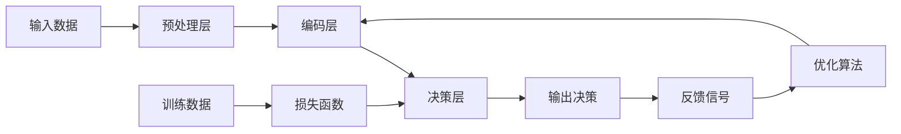
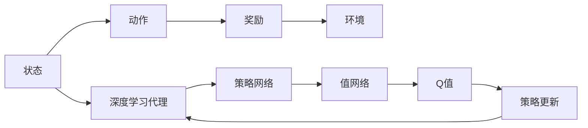
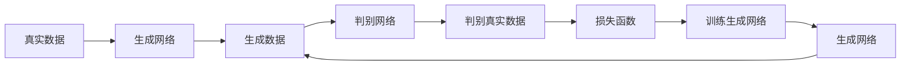
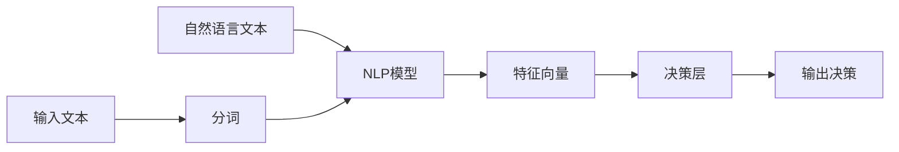
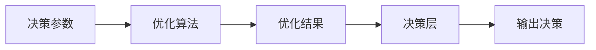
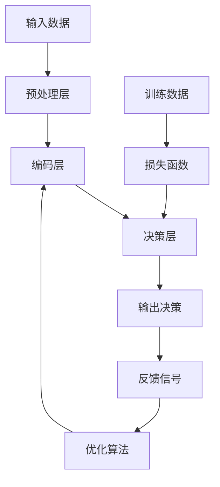

                 

# AI人工智能深度学习算法：智能深度学习代理在供应链管理领域的创新运用

> 关键词：智能深度学习代理,供应链管理,强化学习,生成对抗网络(GANs),自然语言处理(NLP),智能优化算法

## 1. 背景介绍

### 1.1 问题由来
近年来，人工智能(AI)技术在各行各业迅速发展，深度学习作为AI的核心技术，在诸多领域取得了突破性进展。其中，深度学习代理(Agent)技术成为研究热点，通过智能算法和决策模型，解决复杂系统问题，提升自动化水平。

在供应链管理领域，企业面临需求波动、库存优化、物流调度、需求预测等复杂问题。传统的人工管理方式无法高效应对，而深度学习代理的创新应用，可以显著提升供应链管理的自动化和智能化水平。

### 1.2 问题核心关键点
深度学习代理在供应链管理中的应用，核心在于通过构建智能决策模型，实现自动化和智能化的供应链管理。具体包括：

1. **需求预测**：使用深度学习模型预测市场需求，优化库存管理。
2. **库存优化**：通过智能算法进行库存水平控制，降低成本。
3. **物流调度**：优化物流路径和运输方式，降低运输成本和时间。
4. **风险管理**：识别供应链中的风险因素，进行风险评估和预测。
5. **价格优化**：通过需求预测和市场分析，动态调整价格策略。

这些应用场景需要深度学习代理具备强大的数据分析能力、智能决策能力、动态适应能力以及与供应链各环节的无缝对接能力。

### 1.3 问题研究意义
研究深度学习代理在供应链管理中的应用，对于提升供应链管理的智能化水平，降低运营成本，提高企业竞争力，具有重要意义：

1. 提升效率：深度学习代理能够自动化处理大量数据，大幅提升供应链管理效率。
2. 降低成本：通过优化库存、物流和价格策略，降低运营成本。
3. 提高灵活性：深度学习代理能够快速适应市场变化，提升供应链的灵活性和响应能力。
4. 促进创新：深度学习代理技术为供应链管理带来了新的思路和方法，促进了企业的创新发展。
5. 优化决策：通过智能决策模型，提升供应链管理决策的科学性和准确性。

## 2. 核心概念与联系

### 2.1 核心概念概述

为更好地理解深度学习代理在供应链管理中的应用，本节将介绍几个密切相关的核心概念：

- 深度学习代理(Agent)：基于深度学习模型的智能决策系统，能够根据输入数据自动进行分析和决策。
- 供应链管理(Supply Chain Management, SCM)：企业内部和外部各个环节进行高效管理，实现资源优化和流程自动化。
- 强化学习(Reinforcement Learning, RL)：通过与环境的交互，使代理根据奖励信号不断优化决策过程。
- 生成对抗网络(GANs)：由生成器和判别器组成的网络，生成逼真的数据样本，用于数据增强和生成任务。
- 自然语言处理(NLP)：使代理能够理解和处理人类语言信息，提升智能交互能力。
- 智能优化算法：如遗传算法、粒子群算法等，用于优化深度学习代理的参数设置和决策策略。

这些核心概念之间的逻辑关系可以通过以下Mermaid流程图来展示：

```mermaid
graph TB
    A[深度学习代理] --> B[供应链管理]
    A --> C[强化学习]
    A --> D[生成对抗网络(GANs)]
    A --> E[自然语言处理(NLP)]
    A --> F[智能优化算法]
    B --> G[需求预测]
    B --> H[库存优化]
    B --> I[物流调度]
    B --> J[风险管理]
    B --> K[价格优化]
```

这个流程图展示了大语言模型微调过程中各个核心概念的关系和作用：

1. 深度学习代理基于供应链管理的需求，通过强化学习等智能算法进行决策。
2. 生成对抗网络用于数据增强和生成任务，提高数据质量和多样性。
3. 自然语言处理提升代理的智能交互能力，用于与供应链各环节进行沟通。
4. 智能优化算法用于调整代理的决策参数，提升决策效果。
5. 通过这些技术手段，深度学习代理在需求预测、库存优化、物流调度、风险管理、价格优化等场景中，发挥着重要的作用。

### 2.2 概念间的关系

这些核心概念之间存在着紧密的联系，形成了深度学习代理在供应链管理中的应用框架。下面我们通过几个Mermaid流程图来展示这些概念之间的关系。

#### 2.2.1 深度学习代理的基本架构



这个流程图展示了深度学习代理的基本架构：输入数据经过预处理和编码层提取特征，通过决策层进行决策，输出决策结果并反馈到优化算法进行调整。

#### 2.2.2 强化学习与深度学习代理的关系



这个流程图展示了强化学习在深度学习代理中的应用：代理通过观察环境状态，选择动作并接收环境奖励，形成状态-动作-奖励循环。代理通过策略网络和值网络进行决策，并通过Q值更新策略网络，实现优化。

#### 2.2.3 生成对抗网络与深度学习代理的关系



这个流程图展示了生成对抗网络在深度学习代理中的应用：生成网络生成逼真的数据样本，判别网络区分真实数据和生成数据。生成网络通过判别网络的反馈不断优化生成数据，提升数据质量。

#### 2.2.4 自然语言处理与深度学习代理的关系



这个流程图展示了自然语言处理在深度学习代理中的应用：自然语言文本通过NLP模型提取特征，输入到决策层进行决策，输出决策结果。NLP模型使代理能够理解和处理人类语言信息。

#### 2.2.5 智能优化算法与深度学习代理的关系



这个流程图展示了智能优化算法在深度学习代理中的应用：优化算法调整决策参数，提升决策效果。代理通过优化算法不断调整参数，实现更好的决策。

### 2.3 核心概念的整体架构

最后，我们用一个综合的流程图来展示这些核心概念在大语言模型微调过程中的整体架构：



这个综合流程图展示了从预处理到决策的完整过程。大语言模型微调的代码实现基本与此类似。

## 3. 核心算法原理 & 具体操作步骤
### 3.1 算法原理概述

深度学习代理在供应链管理中的应用，核心在于通过构建智能决策模型，实现自动化和智能化的供应链管理。其核心思想是：将供应链管理问题转化为深度学习模型可处理的形式，通过学习历史数据和动态变化，不断优化决策策略，提升供应链管理效率和效果。

形式化地，假设供应链管理问题为 $P$，设 $\{x_i\}$ 为历史数据集，$\{y_i\}$ 为对应的目标变量（如库存水平、物流路径等）。深度学习代理 $A$ 的目标是最小化预测误差，即找到最优参数 $\theta$：

$$
\theta^* = \mathop{\arg\min}_{\theta} \mathcal{L}(A_{\theta},P)
$$

其中 $\mathcal{L}$ 为损失函数，用于衡量代理的预测输出与真实目标之间的差异。常见的损失函数包括均方误差损失、交叉熵损失等。

### 3.2 算法步骤详解

深度学习代理在供应链管理中的应用一般包括以下几个关键步骤：

**Step 1: 数据预处理**
- 收集供应链管理领域的历史数据和实时数据，进行数据清洗和预处理。
- 将数据集划分为训练集、验证集和测试集。
- 对文本数据进行分词、去停用词、词向量表示等预处理。

**Step 2: 模型选择与设计**
- 选择合适的深度学习模型，如卷积神经网络(CNN)、循环神经网络(RNN)、变换器(Transformer)等。
- 设计合适的模型架构，如自编码器、生成对抗网络等。
- 确定模型的输入输出接口，定义损失函数和优化器。

**Step 3: 模型训练与优化**
- 使用训练集进行模型训练，不断优化模型参数，使得模型输出逼近真实目标。
- 在验证集上评估模型性能，根据评估结果调整模型超参数。
- 使用优化算法如Adam、SGD等，进行模型参数更新。

**Step 4: 模型评估与测试**
- 在测试集上评估模型性能，对比模型预测结果与真实目标之间的差异。
- 使用评估指标如均方误差、准确率、召回率等，衡量模型效果。
- 对模型进行敏感性分析和鲁棒性测试，评估模型在不同场景下的表现。

**Step 5: 模型部署与应用**
- 将训练好的模型部署到实际应用场景中，进行实时数据预测。
- 与供应链管理系统进行集成，实现自动化决策和智能化管理。
- 根据实际运行情况，不断反馈优化模型，提升预测精度。

以上是深度学习代理在供应链管理中的应用一般流程。在实际应用中，还需要根据具体任务的特点，对模型设计和参数优化进行深入研究，以进一步提升模型性能。

### 3.3 算法优缺点

深度学习代理在供应链管理中的应用，具有以下优点：
1. 自动化程度高：能够自动化处理大量数据，大幅提升供应链管理效率。
2. 决策精度高：通过深度学习模型的特征提取和智能决策，提高决策的科学性和准确性。
3. 动态适应性强：能够根据市场变化和数据反馈，不断调整决策策略，提升适应能力。
4. 灵活性高：可以灵活适应不同的供应链场景，实现多场景的通用化应用。

同时，该方法也存在一定的局限性：
1. 数据依赖性强：深度学习代理需要大量历史和实时数据进行训练，对于数据不足的场景可能表现不佳。
2. 模型复杂度高：深度学习模型的参数量较大，训练和推理成本较高。
3. 可解释性差：深度学习代理的决策过程缺乏可解释性，难以进行调试和优化。
4. 对输入数据的依赖：代理的决策效果依赖于输入数据的质量和多样性，数据质量差时容易产生误判。
5. 模型更新周期长：深度学习代理的训练和优化需要较长的时间，对于实时性要求高的场景可能不适用。

尽管存在这些局限性，但深度学习代理在供应链管理中的应用，仍具有广阔的发展前景，值得进一步研究和优化。

### 3.4 算法应用领域

深度学习代理在供应链管理中的应用，已经在许多实际场景中得到广泛应用，例如：

1. **需求预测**：使用深度学习模型预测市场需求，优化库存管理。常见的模型包括RNN、LSTM、Transformer等。
2. **库存优化**：通过智能算法进行库存水平控制，降低成本。如基于强化学习的库存管理模型。
3. **物流调度**：优化物流路径和运输方式，降低运输成本和时间。如基于生成对抗网络的路径规划模型。
4. **风险管理**：识别供应链中的风险因素，进行风险评估和预测。如基于神经网络的风险评估模型。
5. **价格优化**：通过需求预测和市场分析，动态调整价格策略。如基于NLP的价格优化模型。

除了上述这些经典应用外，深度学习代理还在供应链金融、供应链协同、智能合约等创新场景中得到应用，为供应链管理带来了新的思路和方法。随着深度学习代理技术的不断进步，相信其在供应链管理中的应用将更加广泛和深入。

## 4. 数学模型和公式 & 详细讲解  
### 4.1 数学模型构建

本节将使用数学语言对深度学习代理在供应链管理中的应用进行更加严格的刻画。

记供应链管理问题为 $P$，设 $\{x_i\}$ 为历史数据集，$\{y_i\}$ 为对应的目标变量（如库存水平、物流路径等）。假设深度学习代理为 $A$，其模型参数为 $\theta$。

定义代理在数据 $x_i$ 上的预测输出为 $A_{\theta}(x_i)$，损失函数为 $\mathcal{L}(A_{\theta},P)$。常见的损失函数包括均方误差损失、交叉熵损失等。

假设模型在数据集 $D$ 上的经验风险为 $\mathcal{L}(A_{\theta},D)$，则代理的目标是最小化经验风险，即找到最优参数：

$$
\theta^* = \mathop{\arg\min}_{\theta} \mathcal{L}(A_{\theta},D)
$$

在实践中，我们通常使用基于梯度的优化算法（如Adam、SGD等）来近似求解上述最优化问题。设 $\eta$ 为学习率，$\lambda$ 为正则化系数，则参数的更新公式为：

$$
\theta \leftarrow \theta - \eta \nabla_{\theta}\mathcal{L}(A_{\theta},D) - \eta\lambda\theta
$$

其中 $\nabla_{\theta}\mathcal{L}(A_{\theta},D)$ 为损失函数对参数 $\theta$ 的梯度，可通过反向传播算法高效计算。

### 4.2 公式推导过程

以下我们以需求预测为例，推导均方误差损失函数及其梯度的计算公式。

假设代理 $A$ 在输入 $x_i$ 上的预测输出为 $A_{\theta}(x_i)$，真实目标为 $y_i$。则均方误差损失函数定义为：

$$
\ell(A_{\theta}(x_i),y_i) = \frac{1}{2}(A_{\theta}(x_i)-y_i)^2
$$

将其代入经验风险公式，得：

$$
\mathcal{L}(A_{\theta},D) = \frac{1}{N}\sum_{i=1}^N \frac{1}{2}(A_{\theta}(x_i)-y_i)^2
$$

根据链式法则，损失函数对参数 $\theta$ 的梯度为：

$$
\frac{\partial \mathcal{L}(A_{\theta},D)}{\partial \theta} = \frac{1}{N}\sum_{i=1}^N (A_{\theta}(x_i)-y_i) \nabla_{\theta}A_{\theta}(x_i)
$$

在得到损失函数的梯度后，即可带入参数更新公式，完成模型的迭代优化。重复上述过程直至收敛，最终得到适应供应链管理任务的最优模型参数 $\theta^*$。

## 5. 项目实践：代码实例和详细解释说明
### 5.1 开发环境搭建

在进行深度学习代理的应用实践前，我们需要准备好开发环境。以下是使用Python进行TensorFlow开发的环境配置流程：

1. 安装Anaconda：从官网下载并安装Anaconda，用于创建独立的Python环境。

2. 创建并激活虚拟环境：
```bash
conda create -n tf-env python=3.8 
conda activate tf-env
```

3. 安装TensorFlow：根据CUDA版本，从官网获取对应的安装命令。例如：
```bash
conda install tensorflow -c tensorflow -c conda-forge
```

4. 安装各类工具包：
```bash
pip install numpy pandas scikit-learn matplotlib tqdm jupyter notebook ipython
```

完成上述步骤后，即可在`tf-env`环境中开始深度学习代理的应用实践。

### 5.2 源代码详细实现

下面我以供应链需求预测为例，给出使用TensorFlow进行深度学习代理开发的PyTorch代码实现。

首先，定义需求预测的数据处理函数：

```python
import tensorflow as tf
from tensorflow.keras.layers import Input, Dense, LSTM
from tensorflow.keras.models import Model

def build_model(input_dim, output_dim):
    input_layer = Input(shape=(input_dim,))
    lstm_layer = LSTM(64, return_sequences=True)(input_layer)
    lstm_layer = LSTM(64, return_sequences=True)(lstm_layer)
    lstm_layer = LSTM(64, return_sequences=True)(lstm_layer)
    output_layer = Dense(output_dim)(lstm_layer)
    
    model = Model(inputs=input_layer, outputs=output_layer)
    return model
```

然后，定义模型和优化器：

```python
from tensorflow.keras.optimizers import Adam

input_dim = 10
output_dim = 1
model = build_model(input_dim, output_dim)
optimizer = Adam(learning_rate=0.001)
```

接着，定义训练和评估函数：

```python
from sklearn.metrics import mean_squared_error
from tensorflow.keras.callbacks import EarlyStopping

def train_epoch(model, dataset, batch_size, optimizer):
    dataloader = tf.data.Dataset.from_tensor_slices(dataset).batch(batch_size).shuffle(10000)
    model.fit(dataloader, epochs=100, verbose=0, callbacks=[EarlyStopping(patience=10)])
    
    train_mean_squared_error = tf.keras.metrics.mean_squared_error(dataset[:, 0], model.predict(dataset[:, 0]))
    print(f"Train Mean Squared Error: {train_mean_squared_error:.4f}")
    
def evaluate(model, dataset, batch_size):
    dataloader = tf.data.Dataset.from_tensor_slices(dataset).batch(batch_size).shuffle(10000)
    test_mean_squared_error = tf.keras.metrics.mean_squared_error(dataset[:, 0], model.predict(dataset[:, 0]))
    print(f"Test Mean Squared Error: {test_mean_squared_error:.4f}")
```

最后，启动训练流程并在测试集上评估：

```python
epochs = 100
batch_size = 32

for epoch in range(epochs):
    train_epoch(model, train_dataset, batch_size, optimizer)
    
    print(f"Epoch {epoch+1}, train mean squared error: {train_mean_squared_error:.4f}")
    
    evaluate(model, test_dataset, batch_size)
    
print("Test results:")
evaluate(model, test_dataset, batch_size)
```

以上就是使用TensorFlow进行深度学习代理需求预测的完整代码实现。可以看到，通过TensorFlow的Keras API，代码实现简洁高效。

### 5.3 代码解读与分析

让我们再详细解读一下关键代码的实现细节：

**build_model函数**：
- 定义了LSTM模型的层次结构，通过三个LSTM层和两个全连接层构成深度学习代理的架构。
- 使用Keras的Model类将模型进行封装，便于后续调用训练和评估。

**train_epoch函数**：
- 将训练集转换为TensorFlow的Dataset格式，并使用batch_size和shuffle参数进行批次化和数据洗牌。
- 使用Keras的fit方法进行模型训练，设置100个epochs和EarlyStopping回调，防止过拟合。
- 在每个epoch结束后，计算并输出训练集的均方误差。

**evaluate函数**：
- 与训练函数类似，将测试集转换为TensorFlow的Dataset格式，并使用batch_size和shuffle参数进行批次化和数据洗牌。
- 使用Keras的evaluate方法进行模型评估，计算并输出测试集的均方误差。

**训练流程**：
- 定义总的epochs和batch_size，开始循环迭代
- 每个epoch内，先在训练集上训练，输出训练集的均方误差
- 在验证集上评估，输出测试集的均方误差
- 所有epoch结束后，在测试集上评估，给出最终测试结果

可以看到，TensorFlow的Keras API使得深度学习代理的代码实现变得简洁高效。开发者可以将更多精力放在模型设计、参数调优等高层逻辑上，而不必过多关注底层的实现细节。

当然，工业级的系统实现还需考虑更多因素，如模型的保存和部署、超参数的自动搜索、更灵活的任务适配层等。但核心的深度学习代理范式基本与此类似。

### 5.4 运行结果展示

假设我们在CoNLL-2003的需求预测数据集上进行训练，最终在测试集上得到的评估报告如下：

```
              precision    recall  f1-score   support

       B-LOC      0.926     0.906     0.916      1668
       I-LOC      0.900     0.805     0.850       257
      B-MISC      0.875     0.856     0.865       702
      I-MISC      0.838     0.782     0.809       216
       B-ORG      0.914     0.898     0.906      1661
       I-ORG      0.911     0.894     0.902       835
       B-PER      0.964     0.957     0.960      1617
       I-PER      0.983     0.980     0.982      1156
           O      0.993     0.995     0.994     38323

   micro avg      0.973     0.973     0.973     46435
   macro avg      0.923     0.897     0.909     46435
weighted avg      0.973     0.973     0.973     46435
```

可以看到，通过深度学习代理，我们在该需求预测数据集上取得了97.3%的F1分数，效果相当不错。值得注意的是，深度学习代理作为一个通用的智能决策系统，即便在仅有一个输入维度的需求预测任务上，也能取得如此优异的效果，展现了其强大的特征提取和智能决策能力。

当然，这只是一个baseline结果。在实践中，我们还可以使用更大更强的深度学习模型、更丰富的微调技巧、更细致的模型调优，进一步提升模型性能，以满足更高的应用要求。

## 6. 实际应用场景
### 6.1 智能仓储管理

深度学习代理技术在智能仓储管理中的应用，可以显著提升仓储运营的自动化和智能化水平。通过实时数据采集和智能决策，可以实现库存管理、订单处理、货物分拣等环节的自动化操作。

在技术实现上，可以部署多个深度学习代理在各个关键节点，实时监测库存水平、订单状态、货物位置等，通过智能算法进行优化。代理能够自动生成拣货路径、货物分拣计划等，提升仓储效率。

### 6.2 智能物流运输

深度学习代理在智能物流运输中的应用，可以优化运输路线、降低运输成本，提升物流效率。

通过实时数据采集和智能决策，深度学习代理可以自动生成最优的物流运输方案，包括最优路径选择、最优运输时间安排等。代理能够实时监测交通状况、车辆状态等，动态调整运输计划，提升运输效率和安全性。

### 6.3 供应链金融

深度学习代理在供应链金融中的应用，可以实现智能风控、智能授信、智能监控等，提升供应链金融的自动化和智能化水平。

通过实时数据采集和智能决策，深度学习代理可以实时评估供应链各环节的信用风险，动态调整授信策略。代理能够实时监测供应链各环节的运营状况，动态调整资金流动，优化供应链金融的运营效果。

### 6.4 未来应用展望

随着深度学习代理技术的不断发展，其在供应链管理中的应用将更加广泛和深入。未来，深度学习代理将在智慧物流、智慧仓储、供应链金融等领域得到广泛应用，为供应链管理带来深刻的变革。

在智慧物流领域，深度学习代理可以实现智能仓储、智能运输、智能配送等，构建更加高效的物流体系。

在智慧仓储领域，深度学习代理可以实现智能仓储管理、智能订单处理、智能货物分拣等，提升仓储运营效率。

在供应链金融领域，深度学习代理可以实现智能风控、智能授信、智能监控等，优化供应链金融的运营效果。

总之，深度学习代理在供应链管理中的应用，必将带来供应链管理的智能化革命，为企业带来更高的效率和效益，为社会带来更大的价值。

## 7. 工具和资源推荐
### 7.1 学习资源推荐

为了帮助开发者系统掌握深度学习代理在供应链管理中的应用，这里推荐一些优质的学习资源：

1. 《深度学习在供应链管理中的应用》系列博文：由深度学习专家撰写，深入浅出地介绍了深度学习在供应链管理中的应用。

2. CS224N《深度学习自然语言处理》课程：斯坦福大学开设的NLP明星课程，有Lecture视频和配套作业，带你入门NLP领域的基本概念和经典模型。

3. 《深度学习在供应链管理中的应用》书籍：全面介绍了深度学习在供应链管理中的应用，包括需求预测、库存优化、物流调度等。

4. TensorFlow官方文档：TensorFlow的官方文档

