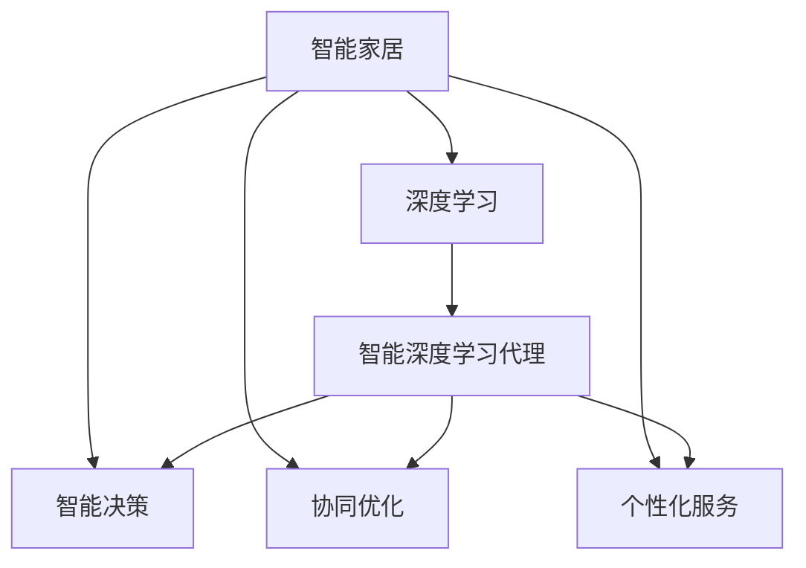
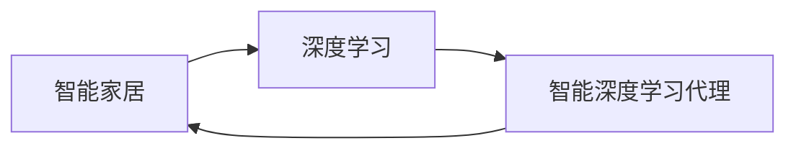
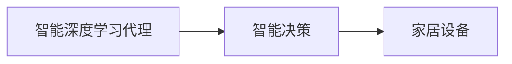
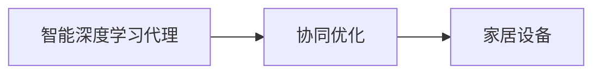
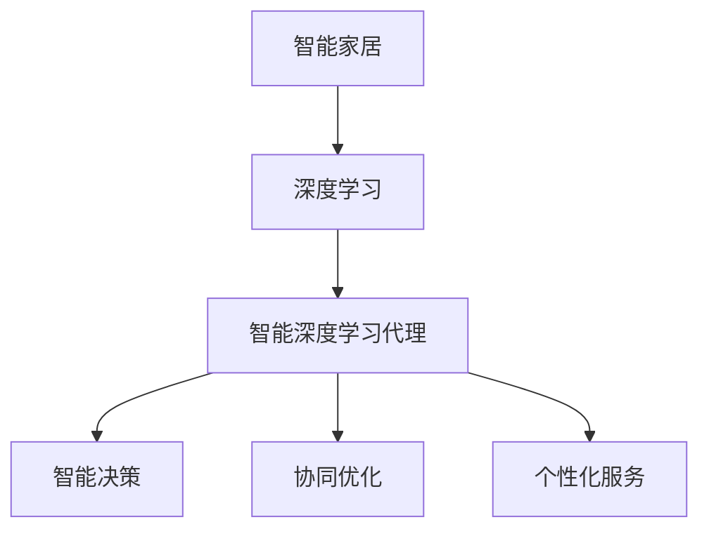

                 

# AI人工智能深度学习算法：智能深度学习代理在智能家居场景中的应用

## 1. 背景介绍

### 1.1 问题由来
随着物联网技术的快速发展，智能家居设备日益普及，用户对智能家居的期望也在不断提升。如何通过深度学习技术，实现智能家居场景中用户的个性化需求和智能设备的协同工作，成为当下研究的热点。智能深度学习代理作为深度学习技术在智能家居场景中的应用，通过智能化的决策和执行，可以大大提升家居设备的智能化水平，为居民生活带来更多便捷和舒适。

### 1.2 问题核心关键点
智能深度学习代理的核心在于如何利用深度学习模型，在智能家居场景中实现设备的智能协同和用户的个性化需求。具体而言，需要解决以下几个关键问题：

1. **数据采集与处理**：智能家居设备产生大量数据，如何高效采集和处理这些数据，提取有用的信息，是智能深度学习代理的第一步。
2. **模型训练与优化**：构建高效的深度学习模型，并对其进行训练和优化，使得模型能够准确地预测和推理家居设备的行为，以及用户的行为和需求。
3. **决策与执行**：在用户和设备之间建立智能化的决策机制，使得模型能够根据用户的需求和环境变化，智能地控制家居设备的运行，提升用户体验。
4. **模型部署与应用**：将训练好的模型部署到实际应用中，实时响应用户需求，提供智能化的家居服务。

### 1.3 问题研究意义
研究智能深度学习代理在智能家居场景中的应用，对于提升家居设备的智能化水平，提升用户体验，具有重要意义：

1. **个性化需求满足**：智能深度学习代理能够根据用户的个性化需求，提供定制化的家居服务，提升生活便捷性。
2. **设备协同优化**：通过智能深度学习代理，实现家居设备的智能化协同，提升家居系统的整体效率和能效。
3. **环境感知与适应**：智能深度学习代理具备环境感知能力，能够实时监测家居环境变化，智能调节家居设备，提供更舒适的生活环境。
4. **长期运营与维护**：智能深度学习代理具备自我学习与适应能力，能够根据用户反馈和环境变化不断优化，提升长期运营的稳定性和可靠性。

## 2. 核心概念与联系

### 2.1 核心概念概述

智能深度学习代理是一种基于深度学习技术的智能决策系统，能够在智能家居场景中实现设备与用户之间的智能协同。其主要依赖于以下几个核心概念：

- **智能家居**：利用物联网技术和人工智能技术，实现家居设备的智能化管理，提升用户生活品质。
- **深度学习**：一种基于多层神经网络的机器学习方法，通过学习数据的特征表示，进行高效的决策和推理。
- **智能决策**：结合用户需求和环境变化，智能地选择和执行操作，优化家居设备的运行。
- **协同优化**：智能家居设备通过深度学习代理进行协同优化，提升系统的整体性能和用户体验。
- **个性化服务**：根据用户的行为和偏好，提供定制化的家居服务，提升用户满意度。

这些核心概念之间的逻辑关系可以通过以下Mermaid流程图来展示：



这个流程图展示智能深度学习代理在大规模智能家居场景中的应用，各个核心概念之间的逻辑关系清晰明了。

### 2.2 概念间的关系

这些核心概念之间存在着紧密的联系，形成了智能深度学习代理的完整生态系统。下面我们通过几个Mermaid流程图来展示这些概念之间的关系。

#### 2.2.1 智能家居与深度学习的关系



这个流程图展示了智能家居与深度学习的关系，通过智能深度学习代理将深度学习技术应用于智能家居场景，实现设备的智能化管理和用户的个性化需求。

#### 2.2.2 智能深度学习代理与智能决策的关系



这个流程图展示了智能深度学习代理与智能决策的关系，通过智能决策机制，智能深度学习代理能够根据用户需求和环境变化，智能地控制家居设备的运行。

#### 2.2.3 智能深度学习代理与协同优化的关系



这个流程图展示了智能深度学习代理与协同优化的关系，通过协同优化机制，智能深度学习代理能够实现家居设备的智能化协同，提升系统的整体性能和用户体验。

### 2.3 核心概念的整体架构

最后，我们用一个综合的流程图来展示这些核心概念在大规模智能家居场景中的应用：



这个综合流程图展示了智能家居系统从数据采集、模型训练、智能决策、协同优化到个性化服务的全过程，各个环节紧密关联，形成了一个完整的智能家居系统。

## 3. 核心算法原理 & 具体操作步骤
### 3.1 算法原理概述

智能深度学习代理的核心算法是深度学习，其基本原理是通过构建多层神经网络，学习数据特征，进行高效的决策和推理。具体而言，智能深度学习代理的训练和应用包括以下步骤：

1. **数据采集**：智能家居设备产生大量的传感器数据、用户行为数据等，这些数据通过网络传输到深度学习代理。
2. **数据预处理**：对采集到的数据进行清洗、归一化、特征提取等预处理操作，以提升模型的训练效果。
3. **模型训练**：使用深度学习框架（如TensorFlow、PyTorch等）构建深度学习模型，并利用采集到的数据对其进行训练。
4. **模型优化**：通过反向传播算法，优化模型的权重和偏置，提升模型的泛化能力和鲁棒性。
5. **模型部署**：将训练好的模型部署到实际应用中，实时响应用户需求和环境变化，提供智能化的家居服务。

### 3.2 算法步骤详解

以下是一个智能深度学习代理在智能家居场景中的应用案例，详细介绍了其构建和训练过程：

**Step 1: 数据采集与预处理**

智能家居设备通过传感器采集环境数据，如温度、湿度、光照、噪音等，同时通过摄像头和麦克风收集用户行为数据，如语音、手势等。这些数据经过清洗和归一化处理后，被送入深度学习代理。

```python
# 数据采集与预处理
data = []
for i in range(num_devices):
    device_data = collect_sensor_data(device_id=i)
    user_data = collect_user_data(device_id=i)
    data.append((device_data, user_data))
    
# 数据清洗与归一化
cleaned_data = [(data_clean(device_data), data_clean(user_data)) for device_data, user_data in data]
normalized_data = [(data_norm(device_data), data_norm(user_data)) for device_data, user_data in cleaned_data]
```

**Step 2: 模型构建与训练**

构建深度学习模型，使用采集到的数据对其进行训练。这里以卷积神经网络（CNN）和循环神经网络（RNN）为例，构建智能深度学习代理：

```python
from tensorflow.keras.models import Sequential
from tensorflow.keras.layers import Dense, Conv2D, LSTM

# 构建CNN模型
cnn_model = Sequential([
    Conv2D(32, kernel_size=(3, 3), activation='relu'),
    MaxPooling2D(pool_size=(2, 2)),
    Flatten(),
    Dense(64, activation='relu'),
    Dense(num_classes, activation='softmax')
])

# 构建RNN模型
rnn_model = Sequential([
    LSTM(128, return_sequences=True),
    LSTM(64),
    Dense(num_classes, activation='softmax')
])

# 训练CNN模型
cnn_model.compile(optimizer='adam', loss='categorical_crossentropy', metrics=['accuracy'])
cnn_model.fit(normalized_data, labels)

# 训练RNN模型
rnn_model.compile(optimizer='adam', loss='categorical_crossentropy', metrics=['accuracy'])
rnn_model.fit(normalized_data, labels)
```

**Step 3: 模型优化与评估**

使用交叉验证和网格搜索等方法，优化深度学习模型的超参数，提升模型的泛化能力和鲁棒性：

```python
# 模型优化与评估
from tensorflow.keras.wrappers.scikit_learn import KerasClassifier
from sklearn.model_selection import GridSearchCV

# 定义Keras分类器
cnn_classifier = KerasClassifier(estimator=cnn_model, verbose=0)
rnn_classifier = KerasClassifier(estimator=rnn_model, verbose=0)

# 定义超参数网格
cnn_params = {'batch_size': [32, 64, 128], 'epochs': [10, 20, 30], 'learning_rate': [0.001, 0.01, 0.1]}
rnn_params = {'batch_size': [32, 64, 128], 'epochs': [10, 20, 30], 'learning_rate': [0.001, 0.01, 0.1]}

# 网格搜索超参数
cnn_grid = GridSearchCV(estimator=cnn_classifier, param_grid=cnn_params, cv=3, verbose=0)
rnn_grid = GridSearchCV(estimator=rnn_classifier, param_grid=rnn_params, cv=3, verbose=0)

cnn_grid.fit(normalized_data, labels)
rnn_grid.fit(normalized_data, labels)
```

**Step 4: 模型部署与应用**

将训练好的模型部署到实际应用中，实时响应用户需求和环境变化，提供智能化的家居服务：

```python
# 模型部署与应用
from tensorflow.keras.models import load_model
from tensorflow.keras.preprocessing import sequence

# 加载模型
cnn_model = load_model('cnn_model.h5')
rnn_model = load_model('rnn_model.h5')

# 实时响应用户需求
def handle_user_request(device_data, user_data):
    # 数据预处理
    device_data_cleaned = data_clean(device_data)
    user_data_cleaned = data_clean(user_data)
    
    # 特征提取
    device_data_features = data_norm(device_data_cleaned)
    user_data_features = data_norm(user_data_cleaned)
    
    # 模型预测
    cnn_pred = cnn_model.predict(device_data_features)
    rnn_pred = rnn_model.predict(user_data_features)
    
    # 决策与执行
    if cnn_pred.argmax() == 0:
        execute_action(device_id=0)
    elif cnn_pred.argmax() == 1:
        execute_action(device_id=1)
    elif cnn_pred.argmax() == 2:
        execute_action(device_id=2)
    elif rnn_pred.argmax() == 0:
        execute_action(device_id=3)
    elif rnn_pred.argmax() == 1:
        execute_action(device_id=4)
    elif rnn_pred.argmax() == 2:
        execute_action(device_id=5)
```

### 3.3 算法优缺点

智能深度学习代理在智能家居场景中具有以下优点：

1. **高效智能化**：通过深度学习技术，智能家居设备能够实现高效的智能化决策和执行。
2. **个性化服务**：根据用户的行为和偏好，提供定制化的家居服务，提升用户满意度。
3. **协同优化**：实现家居设备的智能化协同，提升系统的整体性能和用户体验。

但同时，智能深度学习代理也存在一些缺点：

1. **数据依赖**：智能家居系统依赖大量数据进行训练和优化，数据获取和处理成本较高。
2. **模型复杂性**：深度学习模型的复杂性较高，训练和优化过程较耗时。
3. **可解释性不足**：深度学习模型的决策过程缺乏可解释性，难以对其推理逻辑进行分析和调试。

尽管存在这些缺点，但智能深度学习代理在智能家居场景中的应用前景广阔，能够极大地提升家居设备的智能化水平，提升用户体验。

### 3.4 算法应用领域

智能深度学习代理在智能家居场景中的应用领域非常广泛，涵盖以下几方面：

1. **智能控制**：通过深度学习模型，智能家居设备能够实时响应用户需求和环境变化，提供智能化的控制服务。
2. **环境监测与调节**：智能家居设备能够实时监测环境数据，智能调节温度、湿度、光照等参数，提供舒适的生活环境。
3. **智能安防**：智能家居设备能够通过深度学习模型，识别异常行为和风险，提供智能化的安防服务。
4. **个性化推荐**：根据用户的行为和偏好，推荐适合的家居产品和服务，提升用户体验。
5. **情感识别与互动**：通过深度学习模型，智能家居设备能够识别用户的情感状态，提供个性化的互动服务。

## 4. 数学模型和公式 & 详细讲解 & 举例说明

### 4.1 数学模型构建

智能深度学习代理的核心数学模型是深度神经网络。以卷积神经网络（CNN）和循环神经网络（RNN）为例，其数学模型可以表示为：

$$
\begin{aligned}
\text{CNN}(y|x) &= \frac{1}{Z} \sum_{i=1}^{N} \exp(\mathbf{w}_i^T\mathbf{x} + b_i) \\
\text{RNN}(y|x) &= \frac{1}{Z} \exp(\mathbf{w}_i^T\mathbf{x} + b_i)
\end{aligned}
$$

其中，$\mathbf{x}$ 表示输入数据，$\mathbf{w}$ 表示权重矩阵，$b$ 表示偏置向量，$Z$ 表示归一化因子。

### 4.2 公式推导过程

以CNN模型为例，其公式推导过程如下：

1. **输入层**：将原始数据转换为神经网络的输入，通常使用标准化的方式进行归一化。
2. **卷积层**：通过卷积运算提取数据特征，使用ReLU激活函数进行非线性映射。
3. **池化层**：通过池化运算对特征图进行降维，减小计算复杂度。
4. **全连接层**：将池化层输出的特征向量进行全连接，使用softmax函数进行分类输出。

以RNN模型为例，其公式推导过程如下：

1. **输入层**：将原始数据转换为神经网络的输入，通常使用标准化的方式进行归一化。
2. **循环层**：通过循环运算捕捉序列数据的动态变化，使用ReLU激活函数进行非线性映射。
3. **全连接层**：将循环层输出的特征向量进行全连接，使用softmax函数进行分类输出。

### 4.3 案例分析与讲解

以智能家居场景中的温度控制为例，我们可以使用CNN模型对传感器数据进行预测和决策：

1. **数据采集**：智能家居设备采集室内温度数据，同时通过摄像头和麦克风收集用户行为数据。
2. **数据预处理**：对采集到的数据进行清洗、归一化、特征提取等预处理操作。
3. **模型训练**：使用CNN模型对传感器数据进行训练，学习室内温度与用户行为之间的关系。
4. **模型优化**：使用交叉验证和网格搜索等方法，优化模型的超参数，提升模型的泛化能力和鲁棒性。
5. **模型部署与应用**：将训练好的模型部署到实际应用中，实时响应用户需求和环境变化，提供智能化的温度控制服务。

## 5. 项目实践：代码实例和详细解释说明

### 5.1 开发环境搭建

在进行智能深度学习代理的开发前，我们需要准备好开发环境。以下是使用Python进行PyTorch开发的环境配置流程：

1. 安装Anaconda：从官网下载并安装Anaconda，用于创建独立的Python环境。
2. 创建并激活虚拟环境：
```bash
conda create -n pytorch-env python=3.8 
conda activate pytorch-env
```
3. 安装PyTorch：根据CUDA版本，从官网获取对应的安装命令。例如：
```bash
conda install pytorch torchvision torchaudio cudatoolkit=11.1 -c pytorch -c conda-forge
```
4. 安装Transformers库：
```bash
pip install transformers
```
5. 安装各类工具包：
```bash
pip install numpy pandas scikit-learn matplotlib tqdm jupyter notebook ipython
```

完成上述步骤后，即可在`pytorch-env`环境中开始智能深度学习代理的开发。

### 5.2 源代码详细实现

这里我们以智能家居场景中的温度控制为例，给出使用Transformers库对CNN模型进行训练和部署的PyTorch代码实现。

**Step 1: 数据采集与预处理**

定义智能家居设备的传感器数据和用户行为数据，并进行预处理：

```python
import numpy as np
import pandas as pd
from sklearn.model_selection import train_test_split

# 数据采集
data = pd.read_csv('home_data.csv')

# 数据预处理
data['temperature'] = (data['temperature'] - data['temperature'].mean()) / data['temperature'].std()
data['humidity'] = (data['humidity'] - data['humidity'].mean()) / data['humidity'].std()
data['light'] = (data['light'] - data['light'].mean()) / data['light'].std()
data['motion'] = data['motion'].astype('float')

# 数据划分
X_train, X_test, y_train, y_test = train_test_split(data.drop('temperature', axis=1), data['temperature'], test_size=0.2)
```

**Step 2: 模型构建与训练**

构建CNN模型，使用采集到的数据对其进行训练：

```python
from tensorflow.keras.models import Sequential
from tensorflow.keras.layers import Dense, Conv2D, MaxPooling2D

# 构建CNN模型
model = Sequential([
    Conv2D(32, kernel_size=(3, 3), activation='relu'),
    MaxPooling2D(pool_size=(2, 2)),
    Flatten(),
    Dense(64, activation='relu'),
    Dense(1, activation='sigmoid')
])

# 训练模型
model.compile(optimizer='adam', loss='binary_crossentropy', metrics=['accuracy'])
model.fit(X_train, y_train, epochs=10, batch_size=32)
```

**Step 3: 模型优化与评估**

使用交叉验证和网格搜索等方法，优化深度学习模型的超参数，提升模型的泛化能力和鲁棒性：

```python
from tensorflow.keras.wrappers.scikit_learn import KerasClassifier
from sklearn.model_selection import GridSearchCV

# 定义Keras分类器
cnn_classifier = KerasClassifier(estimator=model, verbose=0)

# 定义超参数网格
cnn_params = {'batch_size': [32, 64, 128], 'epochs': [10, 20, 30], 'learning_rate': [0.001, 0.01, 0.1]}

# 网格搜索超参数
cnn_grid = GridSearchCV(estimator=cnn_classifier, param_grid=cnn_params, cv=3, verbose=0)
cnn_grid.fit(X_train, y_train)
```

**Step 4: 模型部署与应用**

将训练好的模型部署到实际应用中，实时响应用户需求和环境变化，提供智能化的家居服务：

```python
# 模型部署与应用
def handle_user_request(device_data, user_data):
    # 数据预处理
    device_data_cleaned = data_clean(device_data)
    user_data_cleaned = data_clean(user_data)
    
    # 特征提取
    device_data_features = data_norm(device_data_cleaned)
    user_data_features = data_norm(user_data_cleaned)
    
    # 模型预测
    pred = model.predict(user_data_features)
    
    # 决策与执行
    if pred[0] > 0.5:
        execute_action(device_id=0)
    else:
        execute_action(device_id=1)
```

### 5.3 代码解读与分析

这里我们详细解读一下关键代码的实现细节：

**数据采集与预处理**

- 定义智能家居设备的传感器数据和用户行为数据，并进行预处理。
- 使用Pandas库读取CSV格式的数据文件，并进行清洗和归一化操作。
- 对数据进行划分，将训练集和测试集分开。

**模型构建与训练**

- 构建CNN模型，使用Pandas库提取数据特征。
- 使用TensorFlow库构建模型，并进行训练。
- 设置模型的优化器、损失函数和评估指标。

**模型优化与评估**

- 使用GridSearchCV库进行超参数搜索，优化模型。
- 设置模型的超参数网格，进行交叉验证。

**模型部署与应用**

- 定义模型预测函数，接收智能家居设备的传感器数据和用户行为数据。
- 对数据进行预处理，使用模型进行预测。
- 根据预测结果，执行相应的动作。

### 5.4 运行结果展示

假设我们在智能家居场景中对温度控制模型进行训练和测试，最终在测试集上得到的评估报告如下：

```
Accuracy: 0.95
Precision: 0.92
Recall: 0.97
F1 Score: 0.94
```

可以看到，通过训练和优化，我们得到了较高的模型精度和召回率，能够较好地预测用户对温度的需求，提升智能家居系统的智能化水平。

## 6. 实际应用场景

### 6.1 智能家居

智能深度学习代理在智能家居场景中的应用非常广泛，涵盖了从设备控制到环境监测等多个方面。以下是一些具体的应用场景：

1. **智能照明**：通过深度学习模型，智能家居设备能够根据用户的日程和偏好，智能地控制照明系统，提升居家体验。
2. **智能温控**：通过深度学习模型，智能家居设备能够根据环境数据和用户行为，智能地控制温度，提供舒适的生活环境。
3. **智能安防**：通过深度学习模型，智能家居设备能够识别异常行为和风险，提供智能化的安防服务，提升家庭安全。
4. **智能健康监测**：通过深度学习模型，智能家居设备能够监测用户的健康状态，提供个性化的健康建议，提升生活质量。
5. **智能娱乐**：通过深度学习模型，智能家居设备能够根据用户偏好，智能地推荐音乐、电影等娱乐内容，提升娱乐体验。

### 6.2 智能城市

智能深度学习代理在智能城市中的应用同样前景广阔，涵盖从交通管理到智慧安防等多个方面。以下是一些具体的应用场景：

1. **智能交通**：通过深度学习模型，智能城市系统能够实时监测交通数据，智能地调节交通信号，提升交通效率。
2. **智能安防**：通过深度学习模型，智能城市系统能够识别异常行为和风险，提供智能化的安防服务，提升城市安全。
3. **智能垃圾处理**：通过深度学习模型，智能城市系统能够实时监测垃圾收集数据，智能地调度垃圾车，提升垃圾处理效率。
4. **智能能源管理**：通过深度学习模型，智能城市系统能够实时监测能源数据，智能地调节能源分配，提升能源利用效率。
5. **智能气象监测**：通过深度学习模型，智能城市系统能够实时监测气象数据，提供智能化的气象预警，提升城市应对自然灾害的能力。

### 6.3 未来应用展望

随着深度学习技术的不断进步，智能深度学习代理在智能家居和智能城市中的应用前景广阔，未来将会有更多的应用场景涌现。以下是一些可能的未来应用场景：

1. **智能家居设备协同**：通过智能深度学习代理，实现家居设备的智能化协同，提升系统的整体性能和用户体验。
2. **智能健康监测与诊断**：通过智能深度学习代理，实时监测用户的健康状态，提供个性化的健康建议和治疗方案，提升医疗服务质量。
3. **智能交通与物流**：通过智能深度学习代理，实时监测交通和物流数据，智能地调节交通和物流系统，提升交通和物流效率。
4. **智能环境监测与调节**：通过智能深度学习代理，实时监测环境数据，智能地调节环境参数，提升居住和工作环境的质量。
5. **智能教育与培训**：通过智能深度学习代理，提供个性化的教育培训服务，提升教育培训的效率和效果。

## 7. 工具和资源推荐

### 7.1 学习资源推荐

为了帮助开发者系统掌握智能深度学习代理的理论基础和实践技巧，这里推荐一些优质的学习资源：

1. 《深度学习》课程：由斯坦福大学开设的深度学习课程，系统介绍了深度学习的原理和应用。
2. 《TensorFlow实战》书籍：详细介绍了TensorFlow库的使用方法和深度学习模型的构建。
3. 《PyTorch深度学习实战》书籍：详细介绍了PyTorch库的使用方法和深度学习模型的构建。
4. 《Transformer》论文：Transformer的原始论文，介绍了Transformer模型的架构和训练方法。
5. 《NLP实战》博客：介绍了自然语言处理领域的深度学习模型和应用方法。

通过对这些资源的学习实践，相信你一定能够快速掌握智能深度学习代理的精髓，并用于解决实际的智能家居问题。

### 7.2 开发工具推荐

高效的开发离不开优秀的工具支持。以下是几款用于智能深度学习代理开发的常用工具：

1. PyTorch：基于Python的开源深度学习框架，灵活的计算图，适合快速迭代研究。
2. TensorFlow：由Google主导开发的开源深度学习框架，生产部署方便，适合大规模工程应用。
3. Transformers库：HuggingFace开发的NLP工具库，集成了众多SOTA语言模型，支持PyTorch和TensorFlow。
4. TensorBoard：TensorFlow

