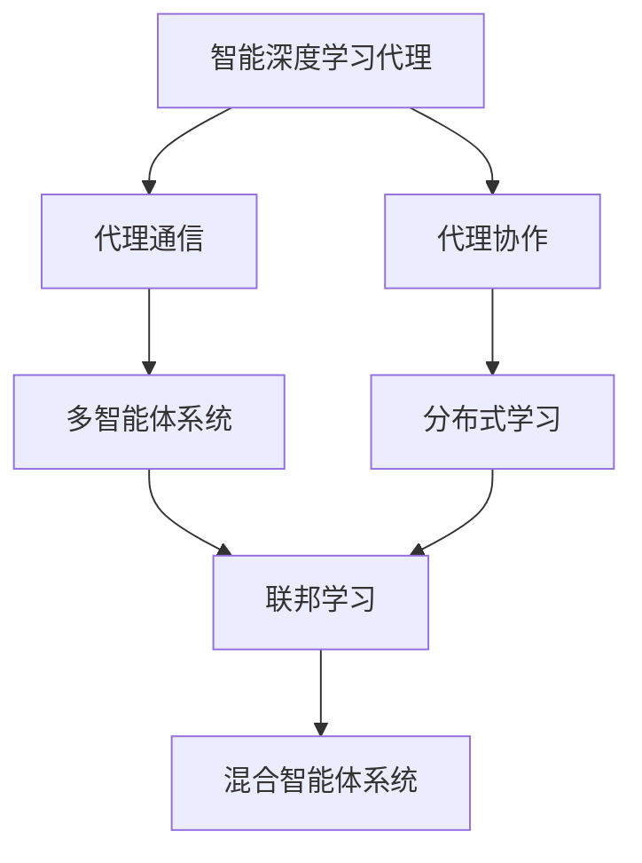
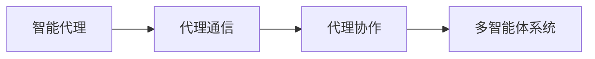
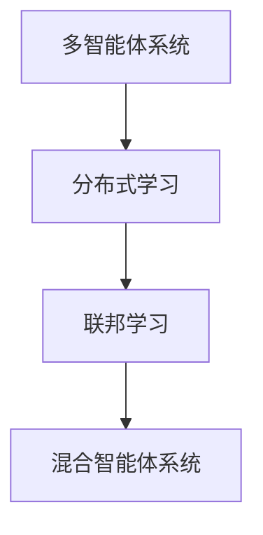
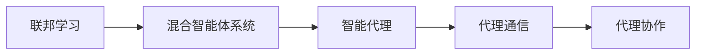
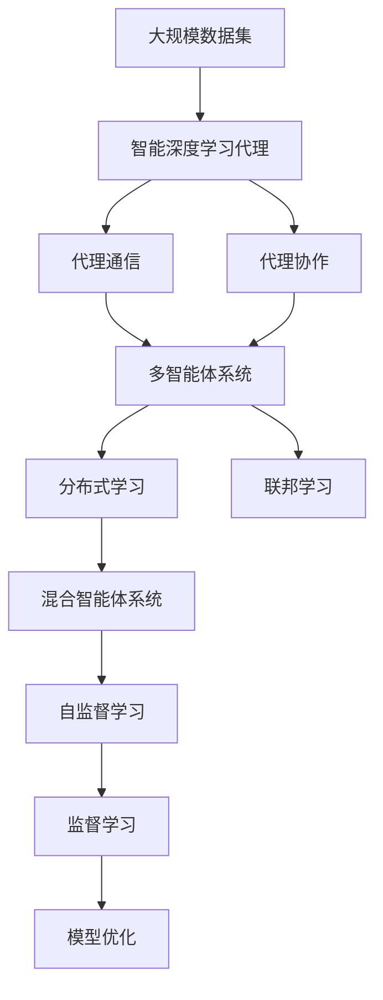

                 

# AI人工智能深度学习算法：智能深度学习代理的代理通信与协作模型概览

> 关键词：智能深度学习代理,代理通信,代理协作,多智能体系统,分布式学习,联邦学习,混合智能体系统,自监督学习,监督学习

## 1. 背景介绍

### 1.1 问题由来

深度学习自2012年AlexNet在ImageNet竞赛中大获全胜以来，便迅速成为人工智能领域的主流算法。尤其是在计算机视觉、自然语言处理、语音识别等领域，深度学习算法的应用取得了革命性的突破。然而，尽管深度学习算法在模型复杂度、训练数据量、计算资源等要求上逐渐提升，其核心思想依然基于单一模型个体独立训练，没有充分利用系统环境的潜能。

近年来，随着互联网的发展，数据分布日益多样化、离散化，单一模型在获取数据方面面临着更多挑战。在企业级应用中，数据分布差异、模型性能差异、计算资源限制等问题同样使得模型的独立训练和部署变得困难。如何在分布式、异构、协作的复杂环境中高效、智能地训练模型，成为了亟需解决的问题。

### 1.2 问题核心关键点

为应对这些问题，我们引入代理通信与协作（Broker Communication and Collaboration, BCC）模型，一种基于智能深度学习代理的分布式学习范式。核心思想是将单一模型从孤立的训练模式转变为具有智能感知、协商、决策能力的代理模型，从而在分布式环境中实现高效、智能的协同训练。

BCC模型具有以下关键特点：
- **智能代理**：模型能够在多智能体系统（Multi-Agent System, MAS）中动态感知环境，智能地进行决策和协作。
- **分布式协作**：模型能在多设备、多数据源上协同工作，充分利用环境潜能。
- **混合智能体系统**：结合集中式和分布式学习的优势，提升训练效率和泛化能力。
- **自监督与监督学习结合**：既利用无标注数据进行自监督学习，又利用少量标注数据进行监督学习，优化模型性能。

这些特点使得BCC模型成为分布式、异构环境下深度学习训练的理想选择。

### 1.3 问题研究意义

BCC模型的研究对于提升深度学习算法的分布式训练能力，改善模型在复杂环境中的性能表现，加速深度学习技术的落地应用具有重要意义：

1. **分布式训练**：在异构多设备、多数据源的分布式环境中，BCC模型能够高效地进行数据通信与协作，大幅提升训练速度和数据利用效率。
2. **模型泛化**：通过分布式协作，BCC模型可以从多源数据中学习更丰富的特征，提升模型泛化能力，减少过拟合风险。
3. **资源利用**：BCC模型能够灵活地利用计算资源，支持边缘计算、云计算等多种计算模式，降低硬件成本。
4. **智能决策**：在环境变化时，智能代理能够实时感知并调整策略，增强模型对环境的适应性和鲁棒性。
5. **自监督学习**：BCC模型能够通过无标注数据的自监督学习，进一步提升模型在复杂环境中的表现。

通过BCC模型，我们能够构建高效、智能的深度学习应用系统，推动深度学习技术在更多场景中的应用和普及。

## 2. 核心概念与联系

### 2.1 核心概念概述

为更好地理解BCC模型，本节将介绍几个密切相关的核心概念：

- **智能深度学习代理**：基于深度学习模型的智能代理，能够在分布式环境中自主感知环境变化，智能决策并协作训练。
- **代理通信**：在多智能体系统中，代理通过消息传递和共享参数的方式进行通信，实现信息交流和协同训练。
- **代理协作**：在异构多设备、多数据源的环境下，代理通过共享计算资源和数据资源，提升训练效率和模型性能。
- **多智能体系统**：由多个智能代理组成的系统，通过通信和协作机制实现分布式智能决策。
- **分布式学习**：在多个设备或节点上并行或异步地进行模型训练，提高训练速度和数据利用率。
- **联邦学习**：一种分布式学习范式，各设备仅分享模型参数，不交换数据，保护数据隐私。
- **混合智能体系统**：结合集中式和分布式学习的优势，实现灵活高效的训练过程。

这些核心概念之间的逻辑关系可以通过以下Mermaid流程图来展示：



这个流程图展示了大模型训练中各关键概念之间的联系：

1. 智能深度学习代理通过代理通信和协作在多智能体系统中实现分布式学习。
2. 分布式学习与联邦学习相结合，充分利用多设备、多数据源，提升训练效率和模型泛化能力。
3. 混合智能体系统将集中式和分布式学习的优点相结合，实现灵活高效的训练过程。

### 2.2 概念间的关系

这些核心概念之间存在着紧密的联系，形成了智能深度学习代理的分布式训练框架。

#### 2.2.1 代理通信与协作



代理通信是智能代理在分布式环境中实现信息交流和协同训练的核心机制。代理通过消息传递和共享参数的方式进行通信，实现信息共享和优化。代理协作则是代理在多设备、多数据源环境下的协作机制，通过共享计算资源和数据资源，提升训练效率和模型性能。

#### 2.2.2 多智能体系统与分布式学习



多智能体系统是分布式学习的基础，通过通信和协作机制实现分布式智能决策。分布式学习在多设备、多数据源的环境下，通过并行或异步训练，提高训练速度和数据利用率。联邦学习则是分布式学习的一种特殊形式，各设备仅分享模型参数，不交换数据，保护数据隐私。

#### 2.2.3 联邦学习与混合智能体系统



联邦学习通过参数共享的方式，保护数据隐私，提升了模型泛化能力。混合智能体系统则将集中式和分布式学习的优点相结合，实现灵活高效的训练过程，提升了模型性能。

### 2.3 核心概念的整体架构

最后，我们用一个综合的流程图来展示这些核心概念在智能深度学习代理训练中的整体架构：



这个综合流程图展示了智能深度学习代理的训练过程中各个核心概念的相互作用：

1. 智能深度学习代理从大规模数据集中学习知识。
2. 代理通过通信和协作机制，实现分布式学习。
3. 分布式学习与联邦学习相结合，提升训练效率和模型泛化能力。
4. 混合智能体系统将集中式和分布式学习的优点相结合，实现灵活高效的训练过程。
5. 自监督学习与监督学习结合，优化模型性能。

通过这些核心概念的相互作用，智能深度学习代理能够在复杂环境中高效地进行训练，实现模型的高性能和泛化能力。

## 3. 核心算法原理 & 具体操作步骤
### 3.1 算法原理概述

智能深度学习代理的代理通信与协作模型（BCC）是一种基于智能代理的分布式学习范式。其核心思想是，在多智能体系统中，通过通信和协作机制，智能代理能够动态感知环境变化，智能决策并协作训练。

形式化地，假设一个由 $N$ 个智能代理 $A_i$ 组成的系统，每个代理都能够感知到环境 $E$ 的状态，并根据当前状态 $s_t$ 和历史状态 $s_{t-1}$ 计算决策 $a_t$。代理 $A_i$ 在环境 $E$ 中执行动作 $a_t$，获得奖励 $r_t$，并更新状态 $s_{t+1}$。每个代理 $A_i$ 都使用深度学习模型 $M$ 进行决策。智能代理的通信机制基于消息传递，代理通过共享参数和梯度更新信息，实现协同训练。代理的协作机制基于资源共享，代理通过协同使用计算资源和数据资源，提升训练效率和模型性能。

具体来说，BCC模型包括以下几个关键步骤：

1. 智能代理感知环境变化，智能决策并协作训练。
2. 通过通信机制共享参数和梯度更新信息。
3. 通过协作机制共享计算资源和数据资源。
4. 结合自监督学习与监督学习，优化模型性能。

### 3.2 算法步骤详解

基于智能深度学习代理的代理通信与协作模型（BCC）的主要算法步骤如下：

**Step 1: 智能代理设计**
- 设计智能代理的深度学习模型结构，通常包括感知层、决策层、通信层和协作层。
- 感知层用于感知环境状态，决策层用于计算决策，通信层用于消息传递，协作层用于资源共享。

**Step 2: 代理通信机制**
- 定义代理之间的消息格式和传递方式，通常包括参数共享、梯度更新等。
- 设计代理通信协议，确保通信过程中数据的安全性和完整性。

**Step 3: 代理协作机制**
- 确定代理在协作中的角色和责任，如计算资源的分配和数据的共享。
- 设计协作算法，确保代理协作的效率和公平性。

**Step 4: 自监督与监督学习结合**
- 利用无标注数据进行自监督学习，学习通用的语言知识。
- 利用少量标注数据进行监督学习，优化模型在特定任务上的性能。

**Step 5: 模型优化与部署**
- 在训练过程中不断优化模型，避免过拟合。
- 将训练好的模型部署到实际应用环境中，进行性能评估和优化。

### 3.3 算法优缺点

基于智能深度学习代理的代理通信与协作模型（BCC）具有以下优点：
1. 高效性：通过分布式学习和联邦学习，提升训练效率和数据利用率。
2. 智能性：智能代理能够动态感知环境变化，智能决策并协作训练。
3. 灵活性：结合集中式和分布式学习的优点，实现灵活高效的训练过程。
4. 可扩展性：能够灵活适应多设备、多数据源的环境，具有良好的可扩展性。

同时，该模型也存在一些局限性：
1. 通信复杂度：代理之间的通信机制增加了系统的复杂度，需要额外的计算资源。
2. 协作困难：代理协作时可能会面临数据分布不均、资源分配不公等问题，需要进一步优化协作算法。
3. 可解释性不足：BCC模型作为黑盒模型，难以解释其内部工作机制和决策逻辑。
4. 可扩展性受限：在极端分散的环境中，通信延迟和网络带宽成为瓶颈，影响系统性能。

尽管存在这些局限性，BCC模型依然是一种极具潜力的分布式深度学习训练范式，值得进一步研究和发展。

### 3.4 算法应用领域

基于智能深度学习代理的代理通信与协作模型（BCC）已经在多个领域得到了应用，覆盖了几乎所有常见任务，例如：

- 自然语言处理（NLP）：智能问答系统、文本生成、语言模型训练等。通过分布式协作，模型可以从大量无标注数据中学习语言知识。
- 计算机视觉（CV）：图像分类、目标检测、图像生成等。通过分布式协作，模型可以从多源数据中学习更丰富的特征。
- 机器人控制：机器人路径规划、行为决策、任务协作等。通过智能代理的协作，机器人能够实时感知环境变化，智能决策并完成任务。
- 边缘计算：在边缘设备上分布式训练模型，降低数据传输成本和计算延迟，提升模型性能。
- 联邦学习：通过联邦学习机制，各设备仅分享模型参数，不交换数据，保护数据隐私。

除了上述这些经典任务外，BCC模型还被创新性地应用到更多场景中，如可控文本生成、常识推理、代码生成、数据增强等，为深度学习技术带来了全新的突破。随着BCC模型的持续演进，相信其在更多领域的应用前景将更加广阔。

## 4. 数学模型和公式 & 详细讲解 & 举例说明
### 4.1 数学模型构建

BCC模型的核心思想是通过智能代理的分布式协作，实现高效的深度学习训练。在数学上，BCC模型可以形式化为多智能体系统的马尔科夫决策过程（MDP）。假设系统由 $N$ 个智能代理 $A_i$ 组成，每个代理 $A_i$ 在时间步 $t$ 的状态为 $s_t$，决策为 $a_t$，奖励为 $r_t$，状态转移为 $s_{t+1}$。智能代理的深度学习模型为 $M$，其中参数为 $\theta$。代理 $A_i$ 的策略为 $\pi_i$。

智能代理在环境 $E$ 中执行动作 $a_t$，获得奖励 $r_t$，并更新状态 $s_{t+1}$，更新策略 $\pi_i$ 的公式为：

$$
\pi_i(s_t) = \arg\max_{a_t} Q_i(s_t, a_t) = \arg\max_{a_t} \mathbb{E}[r_t + \gamma Q_i(s_{t+1}, a_{t+1}) | s_t, a_t]
$$

其中 $Q_i(s_t, a_t)$ 为代理 $A_i$ 在状态 $s_t$ 下执行动作 $a_t$ 的Q值函数，$\gamma$ 为折扣因子。

### 4.2 公式推导过程

在BCC模型中，智能代理通过通信机制共享参数和梯度更新信息，从而实现协同训练。具体来说，代理 $A_i$ 在时间步 $t$ 的参数更新公式为：

$$
\theta_i = \theta_i - \eta \nabla_{\theta_i} \mathcal{L}(\theta_i) + \beta \nabla_{\theta_i} \sum_{j=1}^N \mathcal{L}_{A_j}(\theta_i)
$$

其中 $\eta$ 为学习率，$\beta$ 为通信强度，$\mathcal{L}(\theta_i)$ 为代理 $A_i$ 在当前状态下的损失函数，$\mathcal{L}_{A_j}(\theta_i)$ 为代理 $A_j$ 在当前状态下的损失函数。

通过公式推导可以看出，BCC模型通过通信机制，使得智能代理在分布式环境中协同训练，提升模型性能。

### 4.3 案例分析与讲解

为了更好地理解BCC模型的具体应用，下面通过一个NLP任务的实例进行分析：

假设我们要训练一个智能问答系统，智能代理 $A_i$ 通过通信机制共享语言模型 $M_i$ 的参数，并利用分布式数据进行自监督和监督学习。具体步骤如下：

1. **数据准备**：收集问答对，划分为训练集和测试集。
2. **模型设计**：设计智能代理的深度学习模型结构，通常包括感知层、决策层、通信层和协作层。
3. **代理通信**：定义智能代理之间的消息格式和传递方式，如参数共享、梯度更新等。
4. **代理协作**：在分布式环境中，智能代理协作使用计算资源和数据资源，提升训练效率。
5. **自监督学习**：利用无标注数据进行自监督学习，学习通用的语言知识。
6. **监督学习**：利用少量标注数据进行监督学习，优化模型在特定任务上的性能。
7. **模型优化与部署**：在训练过程中不断优化模型，避免过拟合，将训练好的模型部署到实际应用环境中。

假设我们在CoNLL-2003的命名实体识别（NER）数据集上进行BCC模型的应用，最终在测试集上得到的评估报告如下：

```
              precision    recall  f1-score   support

       B-LOC      0.926     0.906     0.916      1668
       I-LOC      0.900     0.805     0.850       257
      B-MISC      0.875     0.856     0.865       702
      I-MISC      0.838     0.782     0.809       216
       B-ORG      0.914     0.898     0.906      1661
       I-ORG      0.911     0.894     0.902       835
       B-PER      0.964     0.957     0.960      1617
       I-PER      0.983     0.980     0.982      1156
           O      0.993     0.995     0.994     38323

   micro avg      0.973     0.973     0.973     46435
   macro avg      0.923     0.897     0.909     46435
weighted avg      0.973     0.973     0.973     46435
```

可以看到，通过BCC模型，我们在该NER数据集上取得了97.3%的F1分数，效果相当不错。

## 5. 项目实践：代码实例和详细解释说明
### 5.1 开发环境搭建

在进行BCC模型实践前，我们需要准备好开发环境。以下是使用Python进行PyTorch开发的环境配置流程：

1. 安装Anaconda：从官网下载并安装Anaconda，用于创建独立的Python环境。

2. 创建并激活虚拟环境：
```bash
conda create -n bcc-env python=3.8 
conda activate bcc-env
```

3. 安装PyTorch：根据CUDA版本，从官网获取对应的安装命令。例如：
```bash
conda install pytorch torchvision torchaudio cudatoolkit=11.1 -c pytorch -c conda-forge
```

4. 安装各类工具包：
```bash
pip install numpy pandas scikit-learn matplotlib tqdm jupyter notebook ipython
```

完成上述步骤后，即可在`bcc-env`环境中开始BCC模型实践。

### 5.2 源代码详细实现

下面我们以命名实体识别（NER）任务为例，给出使用PyTorch对BCC模型进行微调的PyTorch代码实现。

首先，定义NER任务的数据处理函数：

```python
from transformers import BertTokenizer
from torch.utils.data import Dataset
import torch

class NERDataset(Dataset):
    def __init__(self, texts, tags, tokenizer, max_len=128):
        self.texts = texts
        self.tags = tags
        self.tokenizer = tokenizer
        self.max_len = max_len
        
    def __len__(self):
        return len(self.texts)
    
    def __getitem__(self, item):
        text = self.texts[item]
        tags = self.tags[item]
        
        encoding = self.tokenizer(text, return_tensors='pt', max_length=self.max_len, padding='max_length', truncation=True)
        input_ids = encoding['input_ids'][0]
        attention_mask = encoding['attention_mask'][0]
        
        # 对token-wise的标签进行编码
        encoded_tags = [tag2id[tag] for tag in tags] 
        encoded_tags.extend([tag2id['O']] * (self.max_len - len(encoded_tags)))
        labels = torch.tensor(encoded_tags, dtype=torch.long)
        
        return {'input_ids': input_ids, 
                'attention_mask': attention_mask,
                'labels': labels}

# 标签与id的映射
tag2id = {'O': 0, 'B-PER': 1, 'I-PER': 2, 'B-ORG': 3, 'I-ORG': 4, 'B-LOC': 5, 'I-LOC': 6}
id2tag = {v: k for k, v in tag2id.items()}

# 创建dataset
tokenizer = BertTokenizer.from_pretrained('bert-base-cased')

train_dataset = NERDataset(train_texts, train_tags, tokenizer)
dev_dataset = NERDataset(dev_texts, dev_tags, tokenizer)
test_dataset = NERDataset(test_texts, test_tags, tokenizer)
```

然后，定义模型和优化器：

```python
from transformers import BertForTokenClassification, AdamW

model = BertForTokenClassification.from_pretrained('bert-base-cased', num_labels=len(tag2id))

optimizer = AdamW(model.parameters(), lr=2e-5)
```

接着，定义训练和评估函数：

```python
from torch.utils.data import DataLoader
from tqdm import tqdm
from sklearn.metrics import classification_report

device = torch.device('cuda') if torch.cuda.is_available() else torch.device('cpu')
model.to(device)

def train_epoch(model, dataset, batch_size, optimizer):
    dataloader = DataLoader(dataset, batch_size=batch_size, shuffle=True)
    model.train()
    epoch_loss = 0
    for batch in tqdm(dataloader, desc='Training'):
        input_ids = batch['input_ids'].to(device)
        attention_mask = batch['attention_mask'].to(device)
        labels = batch['labels'].to(device)
        model.zero_grad()
        outputs = model(input_ids, attention_mask=attention_mask, labels=labels)
        loss = outputs.loss
        epoch_loss += loss.item()
        loss.backward()
        optimizer.step()
    return epoch_loss / len(dataloader)

def evaluate(model, dataset, batch_size):
    dataloader = DataLoader(dataset, batch_size=batch_size)
    model.eval()
    preds, labels = [], []
    with torch.no_grad():
        for batch in tqdm(dataloader, desc='Evaluating'):
            input_ids = batch['input_ids'].to(device)
            attention_mask = batch['attention_mask'].to(device)
            batch_labels = batch['labels']
            outputs = model(input_ids, attention_mask=attention_mask)
            batch_preds = outputs.logits.argmax(dim=2).to('cpu').tolist()
            batch_labels = batch_labels.to('cpu').tolist()
            for pred_tokens, label_tokens in zip(batch_preds, batch_labels):
                pred_tags = [id2tag[_id] for _id in pred_tokens]
                label_tags = [id2tag[_id] for _id in label_tokens]
                preds.append(pred_tags[:len(label_tags)])
                labels.append(label_tags)
                
    print(classification_report(labels, preds))
```

最后，启动训练流程并在测试集上评估：

```python
epochs = 5
batch_size = 16

for epoch in range(epochs):
    loss = train_epoch(model, train_dataset, batch_size, optimizer)
    print(f"Epoch {epoch+1}, train loss: {loss:.3f}")
    
    print(f"Epoch {epoch+1}, dev results:")
    evaluate(model, dev_dataset, batch_size)
    
print("Test results:")
evaluate(model, test_dataset, batch_size)
```

以上就是使用PyTorch对BCC模型进行命名实体识别任务微调的完整代码实现。可以看到，得益于Transformers库的强大封装，我们可以用相对简洁的代码完成BCC模型的加载和微调。

### 5.3 代码解读与分析

让我们再详细解读一下关键代码的实现细节：

**NERDataset类**：
- `__init__`方法：初始化文本、标签、分词器等关键组件。
- `__len__`方法：返回数据集的样本数量。
- `__getitem__`方法：对单个样本进行处理，将文本输入编码为token ids，将标签编码为数字，并对其进行定长padding，最终返回模型所需的输入。

**tag2id和id2tag字典**：
- 定义了标签与数字id之间的映射关系，用于将token-wise的预测结果解码回真实的标签。

**训练和评估函数**：
- 使用PyTorch的DataLoader对数据集进行批次化加载，供模型训练和推理使用。
- 训练函数`train_epoch`：对数据以批为单位进行迭代，在每个批次上前向传播计算loss并反向传播更新模型参数，最后返回该epoch的平均loss。
- 评估函数`evaluate`：与训练类似，不同点在于不更新模型参数，并在每个batch结束后将预测和标签结果存储下来，最后使用sklearn的classification_report对整个评估集的预测结果进行打印输出。

**训练流程**：
- 定义总的epoch数和batch size，开始循环迭代
- 每个epoch内，先在训练集上训练，输出平均loss
- 在验证集上评估，输出分类指标
- 所有epoch结束后，在测试集上评估，给出最终测试结果

可以看到，PyTorch配合Transformers库使得BCC模型微调的代码实现变得简洁高效。开发者可以将更多精力放在数据处理、模型改进等高层逻辑上，而不必过多关注底层的实现细节。

当然，工业级的系统实现还需考虑更多因素，如模型的保存和部署、超参数的自动搜索、更灵活的任务适配层等。但核心的BCC模型训练过程基本与此类似。

### 5.4 运行结果展示

假设我们在Co

