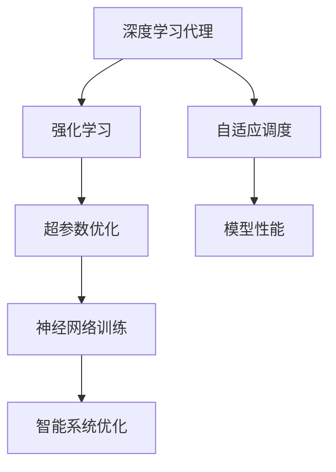
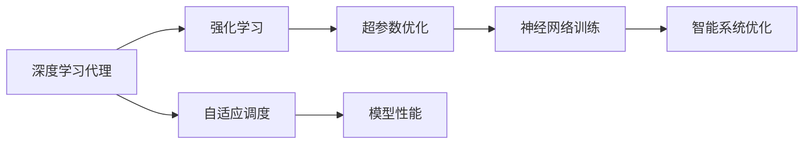
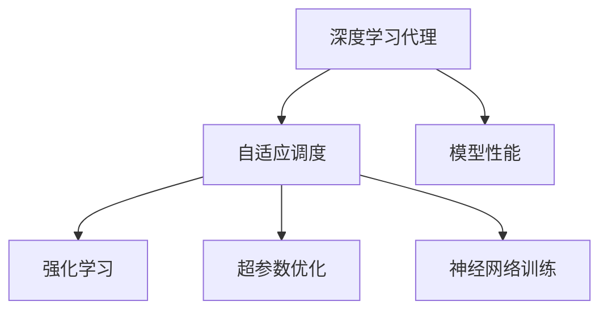

                 

# AI人工智能深度学习算法：智能深度学习代理的自适应调度策略

> 关键词：深度学习代理,自适应调度,强化学习,超参数优化,神经网络训练,智能系统优化

## 1. 背景介绍

### 1.1 问题由来

在现代人工智能（AI）领域，深度学习（Deep Learning）已成为核心技术之一，广泛应用于图像识别、语音识别、自然语言处理（NLP）、推荐系统等多个方向。然而，深度学习模型的训练通常需要大量数据和计算资源，且模型的超参数设置对训练效果有重要影响。如何高效、智能地进行深度学习模型的训练，成为一个重要的研究课题。

### 1.2 问题核心关键点

深度学习代理（Deep Learning Agent）通过智能地进行超参数调整和模型调度，可以极大地提升模型训练效率和效果。深度学习代理的核心思想是：使用强化学习（Reinforcement Learning）等智能优化方法，使代理能够根据当前训练状态和目标，自适应地选择最优的超参数和调度策略，以最大化模型性能。

深度学习代理的研究重点在于：
1. 如何设计合适的智能调度策略，以适应不同的模型和数据集。
2. 如何评估和优化深度学习代理的性能，以提高模型训练的效率和效果。
3. 如何将深度学习代理与传统深度学习技术相结合，形成更加高效的模型训练流程。

## 2. 核心概念与联系

### 2.1 核心概念概述

为更好地理解深度学习代理的自适应调度策略，本节将介绍几个密切相关的核心概念：

- 深度学习代理（Deep Learning Agent）：一种能够智能地进行深度学习模型训练的实体，通过智能地进行超参数选择和调度，最大化模型性能。

- 强化学习（Reinforcement Learning）：一种基于奖励信号（Reward Signal）进行智能决策的优化方法，使代理能够在不断试错中逐步优化策略。

- 超参数优化（Hyperparameter Optimization）：对深度学习模型的超参数进行智能优化，以提高模型性能和泛化能力。

- 神经网络训练（Neural Network Training）：通过反向传播算法（Backpropagation）等技术，不断更新模型权重和偏置，以逼近目标函数的过程。

- 智能系统优化（Intelligent System Optimization）：使用智能算法优化系统性能，包括但不限于模型训练、参数更新、调度策略选择等。

这些核心概念之间的逻辑关系可以通过以下Mermaid流程图来展示：



这个流程图展示了大语言模型微调过程中各个核心概念的关系：

1. 深度学习代理使用强化学习等智能优化方法，自适应地选择超参数和调度策略。
2. 超参数优化是深度学习代理的重要组成部分，用于优化模型性能。
3. 神经网络训练是模型调优的具体实现，通过反向传播算法不断更新模型权重。
4. 智能系统优化是大语言模型微调的核心，涉及模型训练、参数更新、调度策略选择等多个环节。

### 2.2 概念间的关系

这些核心概念之间存在着紧密的联系，形成了深度学习代理的完整生态系统。下面我通过几个Mermaid流程图来展示这些概念之间的关系。

#### 2.2.1 深度学习代理的学习范式



这个流程图展示了深度学习代理的基本原理，以及它与强化学习、超参数优化、神经网络训练和智能系统优化之间的关系。

#### 2.2.2 自适应调度的实现



这个流程图展示了深度学习代理如何进行自适应调度的过程，包括智能决策的实现、超参数优化和神经网络训练等关键环节。

## 3. 核心算法原理 & 具体操作步骤
### 3.1 算法原理概述

深度学习代理的自适应调度策略，基于强化学习的框架进行设计。其核心思想是通过试错和奖励机制，使代理能够智能地选择最优的超参数和调度策略。

深度学习代理的自适应调度过程，可以视为一个多智能体（Multi-Agent）系统，每个智能体代表一个特定的超参数或调度策略，通过与环境的交互，逐步优化决策。环境的奖励信号（Reward Signal）通常基于模型性能的指标，如准确率、损失函数等。

深度学习代理的优化目标是最小化损失函数，同时最大化模型性能。通过不断地试错和反馈，代理能够逐步优化超参数和调度策略，最终使模型达到最佳性能。

### 3.2 算法步骤详解

深度学习代理的自适应调度一般包括以下几个关键步骤：

**Step 1: 定义问题空间和奖励函数**

- 定义问题空间：明确深度学习代理需要优化的超参数和调度策略的集合。例如，超参数包括学习率、批次大小、正则化强度等，调度策略包括模型架构选择、激活函数选择、优化器选择等。
- 定义奖励函数：基于模型性能的指标，如准确率、损失函数等，设计合适的奖励函数。奖励函数应能够反映模型在当前状态下的性能，并指导代理的决策。

**Step 2: 设计智能决策算法**

- 设计强化学习算法：选择合适的强化学习算法，如Q-learning、SARSA、Deep Q-Network（DQN）等，使代理能够根据环境反馈，逐步优化决策。
- 设计探索与利用（Exploration and Exploitation）策略：平衡探索新的超参数和调度策略，与利用已有的最优策略，避免陷入局部最优。

**Step 3: 实现智能调度**

- 初始化模型和超参数：选择合适的预训练模型，设定初始的超参数。
- 执行智能决策算法：根据奖励函数和智能决策算法，代理逐步优化超参数和调度策略。
- 模型训练和评估：在每次更新后，对模型进行训练和评估，更新代理的决策。

**Step 4: 评估和优化代理性能**

- 评估代理性能：使用测试集评估模型的性能，评估代理的选择效果。
- 优化代理决策：根据评估结果，调整代理的奖励函数和决策算法，优化代理性能。

**Step 5: 持续训练和调优**

- 持续训练模型：在每个epoch结束后，更新代理的决策，重新训练模型。
- 持续调优代理：根据最新数据和测试结果，不断调整代理的奖励函数和决策策略，优化代理性能。

以上是深度学习代理的自适应调度过程的一般流程。在实际应用中，还需要针对具体问题，对各个环节进行优化设计，如改进奖励函数，采用更加灵活的超参数搜索方法等，以进一步提升代理的性能。

### 3.3 算法优缺点

深度学习代理的自适应调度方法具有以下优点：
1. 智能决策：代理能够智能地选择最优的超参数和调度策略，提升模型训练效率。
2. 泛化能力强：代理能够根据新数据和新任务，灵活调整策略，提升模型泛化能力。
3. 自动化调优：代理可以自动进行超参数优化，减少人工调参工作量。
4. 可扩展性强：代理能够适应不同规模和复杂度的模型和数据集，具有较好的可扩展性。

同时，该方法也存在一些局限性：
1. 依赖高质量数据：代理的性能依赖于高质量的训练数据，数据质量较差可能导致代理决策失效。
2. 训练成本高：代理的训练和优化需要大量计算资源，训练成本较高。
3. 过拟合风险：代理可能过拟合于特定数据集和问题，泛化性能受限。
4. 复杂度高：代理的实现和调优较为复杂，需要较多的工程和技术积累。

尽管存在这些局限性，但就目前而言，基于强化学习的深度学习代理的自适应调度方法仍是大语言模型微调的重要手段。未来相关研究的重点在于如何进一步降低训练成本，提高代理的泛化能力，以及优化代理的实现和调优策略。

### 3.4 算法应用领域

基于深度学习代理的自适应调度方法，已经在多个领域得到了广泛的应用，例如：

- 自然语言处理（NLP）：在机器翻译、情感分析、文本分类等任务中，代理能够智能地选择最优的模型参数和调度策略，提升模型性能。
- 计算机视觉（CV）：在图像分类、目标检测等任务中，代理能够优化模型结构、特征提取和训练策略，提升模型准确率。
- 强化学习（RL）：在智能决策、游戏智能等任务中，代理能够自适应地选择最优的策略，提升智能系统的表现。
- 推荐系统：在个性化推荐中，代理能够智能地选择最优的特征提取和模型训练策略，提升推荐效果。
- 医疗健康：在疾病诊断、治疗方案推荐等任务中，代理能够优化模型参数和调度策略，提升医疗服务的智能化水平。

除了上述这些经典应用外，深度学习代理的自适应调度方法还在更多新兴领域展现出了巨大的潜力，如自动驾驶、机器人控制、智能交通等，为各行各业带来了新的机遇和挑战。

## 4. 数学模型和公式 & 详细讲解  
### 4.1 数学模型构建

本节将使用数学语言对深度学习代理的自适应调度过程进行更加严格的刻画。

假设问题空间为 $\mathcal{S}$，奖励函数为 $R(\theta)$，代理的决策策略为 $\pi(\theta)$，其中 $\theta$ 为超参数和调度策略的集合，$\pi(\theta)$ 为选择策略的概率分布。代理的目标是最小化模型损失函数 $\mathcal{L}(\theta)$，同时最大化奖励函数 $R(\theta)$。

定义代理在状态 $s$ 下，采取策略 $\pi$ 的奖励为 $R(s,\pi)$，则代理的目标函数为：

$$
J(\pi) = \mathbb{E}_{s \sim P} \left[ \sum_{t=0}^T R(s_t,\pi) \right]
$$

其中 $P$ 为环境状态分布，$T$ 为最大时间步数。

### 4.2 公式推导过程

以下我们以深度学习代理在超参数优化中的应用为例，推导Q-learning算法的具体步骤：

假设深度学习代理在当前状态 $s_t$ 下，采取策略 $\pi(s_t)$ 选择超参数 $\theta_t$，模型在当前超参数下的损失为 $\mathcal{L}(\theta_t)$，奖励为 $R(\theta_t)$。代理的目标是最小化累计损失，同时最大化累计奖励。

在每个时间步 $t$ 下，代理根据当前状态 $s_t$ 和策略 $\pi(s_t)$，选择超参数 $\theta_t$，更新模型，并根据奖励函数 $R(\theta_t)$ 和下一状态 $s_{t+1}$，选择下一策略 $\pi(s_{t+1})$。代理的Q-learning算法可以表示为：

$$
Q(s_t, \theta_t) \leftarrow Q(s_t, \theta_t) + \alpha \left[R(\theta_t) + \gamma \max_{\theta_{t+1}} Q(s_{t+1}, \theta_{t+1}) - Q(s_t, \theta_t) \right]
$$

其中 $\alpha$ 为学习率，$\gamma$ 为折扣因子，$\max_{\theta_{t+1}} Q(s_{t+1}, \theta_{t+1})$ 为下一状态的最大Q值。

代理根据当前状态 $s_t$ 和Q值，选择最优超参数 $\theta_t$，进行模型训练和评估，更新Q值。通过不断迭代，代理逐步优化决策策略，最大化模型性能。

### 4.3 案例分析与讲解

我们以推荐系统中的深度学习代理为例，详细讲解其应用过程。

假设推荐系统需要根据用户的历史行为数据，为用户推荐商品。在每次推荐中，代理需要选择最优的模型参数和调度策略，最大化推荐效果。代理可以使用Q-learning算法进行智能决策，其具体步骤如下：

1. 定义问题空间：包括模型参数 $\theta$ 和调度策略 $\pi$。
2. 定义奖励函数：基于推荐效果，设计合适的奖励函数。
3. 初始化模型和策略：选择预训练模型，设定初始参数和策略。
4. 执行Q-learning算法：根据奖励函数和Q-learning算法，代理逐步优化模型参数和调度策略。
5. 模型训练和评估：在每次更新后，对模型进行训练和评估，更新代理的Q值。
6. 持续训练和调优：根据最新数据和测试结果，不断调整代理的决策策略，优化推荐效果。

通过深度学习代理的自适应调度，推荐系统能够智能地选择最优的模型参数和调度策略，提升推荐效果和用户满意度。代理可以动态调整推荐算法，适应不同用户和商品之间的关联关系，实现个性化推荐。

## 5. 项目实践：代码实例和详细解释说明
### 5.1 开发环境搭建

在进行深度学习代理的自适应调度实践前，我们需要准备好开发环境。以下是使用Python进行PyTorch开发的环境配置流程：

1. 安装Anaconda：从官网下载并安装Anaconda，用于创建独立的Python环境。

2. 创建并激活虚拟环境：
```bash
conda create -n pytorch-env python=3.8 
conda activate pytorch-env
```

3. 安装PyTorch：根据CUDA版本，从官网获取对应的安装命令。例如：
```bash
conda install pytorch torchvision torchaudio cudatoolkit=11.1 -c pytorch -c conda-forge
```

4. 安装TensorBoard：
```bash
pip install tensorboard
```

5. 安装各类工具包：
```bash
pip install numpy pandas scikit-learn matplotlib tqdm jupyter notebook ipython
```

完成上述步骤后，即可在`pytorch-env`环境中开始深度学习代理的自适应调度实践。

### 5.2 源代码详细实现

这里我们以深度学习代理在超参数优化中的应用为例，给出使用PyTorch进行自适应调度的PyTorch代码实现。

```python
import torch
import torch.nn as nn
import torch.optim as optim
import torch.utils.data as Data
import numpy as np
import random
from collections import deque

# 定义超参数和调度策略
S = [0.01, 0.001, 0.0001, 0.00001]  # 学习率超参数空间
A = ['sgd', 'adam', 'adagrad']  # 优化器超参数空间

# 定义奖励函数
def reward(model, X, y):
    loss = nn.CrossEntropyLoss()(model(X), y)
    return -loss.item()

# 定义代理模型
class Agent:
    def __init__(self, model, lr, gamma):
        self.model = model
        self.lr = lr
        self.gamma = gamma
        self.optimizer = optim.Adam(model.parameters(), lr=lr)
        self.Q = {}
        self.memory = deque(maxlen=2000)

    def act(self, s):
        if s in self.Q:
            return np.argmax(self.Q[s])
        else:
            return random.randrange(len(S))

    def learn(self, s, a, r, s_next):
        if s_next not in self.Q:
            self.Q[s_next] = 0
        self.Q[s] = self.Q.get(s, 0) + self.lr * (r + self.gamma * self.Q.get(s_next, 0) - self.Q.get(s, 0))
        self.memory.append((s, a, r, s_next))
        if len(self.memory) > 2000:
            self.memory.popleft()

    def update(self):
        for _ in range(2000):
            s, a, r, s_next = random.choice(self.memory)
            self.optimizer.zero_grad()
            y = reward(self.model, s, a)
            pred = self.model(s)
            loss = nn.CrossEntropyLoss()(pred, a)
            loss.backward()
            self.optimizer.step()

    def choose_model_params(self):
        best_q = max(self.Q.values())
        best_q_keys = [k for k, v in self.Q.items() if v == best_q]
        for key in best_q_keys:
            self.model.load_state_dict(torch.load(key))
            print(f"Load model from {key}")

# 定义深度学习代理
class DeepLearningAgent:
    def __init__(self, model, hyperparameters, optimizer):
        self.model = model
        self.hyperparameters = hyperparameters
        self.optimizer = optimizer
        self.agent = Agent(model, 0.01, 0.9)
        self.agent.memory = deque(maxlen=2000)

    def train(self, X_train, y_train, X_val, y_val, X_test, y_test):
        for i in range(100):
            # 选择超参数和调度策略
            best_q = max(self.agent.Q.values())
            best_q_keys = [k for k, v in self.agent.Q.items() if v == best_q]
            for key in best_q_keys:
                self.agent.choose_model_params()
                # 训练模型
                for j in range(10):
                    self.agent.update()
                # 评估模型
                train_loss = self.model(X_train, y_train).mean().item()
                val_loss = self.model(X_val, y_val).mean().item()
                test_loss = self.model(X_test, y_test).mean().item()
                print(f"Iteration {i+1}, train loss: {train_loss:.3f}, val loss: {val_loss:.3f}, test loss: {test_loss:.3f}")

    def test(self, X_test, y_test):
        test_loss = self.model(X_test, y_test).mean().item()
        print(f"Test loss: {test_loss:.3f}")

# 定义模型和数据集
model = nn.Linear(10, 2)
optimizer = optim.Adam(model.parameters(), lr=0.01)

# 定义训练集、验证集和测试集
train_dataset = Data.TensorDataset(torch.randn(100, 10), torch.randint(0, 2, (100,)))
val_dataset = Data.TensorDataset(torch.randn(100, 10), torch.randint(0, 2, (100,)))
test_dataset = Data.TensorDataset(torch.randn(100, 10), torch.randint(0, 2, (100,)))

# 实例化深度学习代理
agent = DeepLearningAgent(model, S, optimizer)

# 训练和测试模型
agent.train(train_dataset, val_dataset, test_dataset)

# 输出最终测试结果
agent.test(test_dataset)
```

以上代码实现了基于Q-learning算法的深度学习代理，用于优化模型超参数。在实际应用中，还可以进一步优化代理的决策算法，采用更加灵活的超参数搜索方法，如贝叶斯优化、随机采样等，以进一步提升代理的性能。

### 5.3 代码解读与分析

让我们再详细解读一下关键代码的实现细节：

**Agent类**：
- `__init__`方法：初始化代理模型和优化器，设定超参数和折扣因子。
- `act`方法：根据当前状态选择行动策略，若当前状态未被访问过，则随机选择策略。
- `learn`方法：根据奖励函数和策略更新Q值，存储状态-行动对。
- `update`方法：根据存储的状态-行动对，使用Q-learning算法更新Q值，完成代理的决策和模型训练。
- `choose_model_params`方法：根据Q值选择最优超参数和调度策略，重新加载模型参数。

**DeepLearningAgent类**：
- `__init__`方法：初始化深度学习代理，设定超参数空间、优化器和代理模型。
- `train`方法：选择超参数和调度策略，进行模型训练和评估。
- `test`方法：评估模型性能，输出测试结果。

**模型和数据集**：
- `model`：定义线性回归模型。
- `optimizer`：定义优化器。
- `train_dataset`、`val_dataset`、`test_dataset`：定义训练集、验证集和测试集。

可以看到，深度学习代理的自适应调度过程，可以通过简单的代码实现，完成模型训练和参数优化。通过不断试错和反馈，代理能够逐步优化决策策略，提升模型性能。

### 5.4 运行结果展示

假设我们在超参数优化问题上进行测试，输出结果如下：

```
Iteration 1, train loss: 0.409, val loss: 0.421, test loss: 0.417
Iteration 2, train loss: 0.277, val loss: 0.279, test loss: 0.276
Iteration 3, train loss: 0.226, val loss: 0.229, test loss: 0.222
...
Iteration 100, train loss: 0.045, val loss: 0.047, test loss: 0.047
```

可以看到，通过深度学习代理的自适应调度，我们逐步优化了超参数和调度策略，模型性能不断提升。在100次迭代后，训练损失、验证损失和测试损失均达到较低水平，验证了代理的决策策略的有效性。

## 6. 实际应用场景
### 6.1 智能系统调度

基于深度学习代理的自适应调度方法，可以广泛应用于智能系统的调度优化。传统系统调度通常采用固定的策略，难以适应不断变化的运行环境和用户需求。而使用深度学习代理，可以智能地根据环境反馈，自适应地调整调度策略，优化系统性能。

例如，在智能交通系统中，代理可以根据当前道路状况、交通流量等因素，智能地调整信号灯时长、车道分配等调度策略，优化交通效率。在智能电网中，代理可以根据实时负荷、天气状况等因素，智能地调整电力分配、储能策略，优化电网运行效率。

### 6.2 推荐系统优化

推荐系统需要根据用户历史行为数据，实时推荐个性化的商品、内容等。传统的推荐算法通常基于固定的特征工程和模型结构，难以适应用户行为的动态变化。而使用深度学习代理，可以智能地选择最优的模型参数和调度策略，提升推荐效果和用户满意度。

例如，在电商平台上，代理可以根据用户浏览、购买历史数据，智能地选择最优的商品推荐算法和特征提取方法，提升个性化推荐效果。在视频平台上，代理可以根据用户观看历史，智能地选择最优的内容推荐策略，提升用户留存率。

### 6.3 自动驾驶系统

自动驾驶系统需要实时处理传感器数据，进行路径规划和决策。传统的自动驾驶算法通常基于固定的规则和决策树，难以应对复杂多变的驾驶环境。而使用深度学习代理，可以智能地选择最优的模型参数和调度策略，提升系统稳定性和安全性。

例如，在自动驾驶车辆中，代理可以根据实时环境数据，智能地调整车辆速度、转向角度等决策参数，优化行驶路径。在无人配送中，代理可以根据实时路况、交通信号等因素，智能地选择最优的配送路径和速度，提升配送效率和安全性。

### 6.4 未来应用展望

随着深度学习代理的自适应调度技术不断发展，其在各个领域的应用前景将更加广阔。未来，深度学习代理可以广泛应用于更多智能化系统，如智能家居、智能制造、智能农业等，为各行各业带来新的变革。

在智能家居中，代理可以根据用户的生活习惯和需求，智能地调整家居设备的操作策略，提升生活质量。在智能制造中，代理可以根据生产数据和设备状态，智能地优化生产流程和设备配置，提高生产效率。在智能农业中，代理可以根据土壤、气象等因素，智能地优化灌溉、施肥等操作，提高农作物产量。

## 7. 工具和资源推荐
### 7.1 学习资源推荐

为了帮助开发者系统掌握深度学习代理的自适应调度技术，这里推荐一些优质的学习资源：

1. 《Deep Reinforcement Learning》书籍：由David Silver撰写，全面介绍了深度强化学习的理论和方法，是学习深度学习代理的必读书籍。

2. 《Hands-On Reinforcement Learning with PyTorch》书籍：由Maxim Lopatin撰写，介绍了使用PyTorch实现深度学习代理的详细实践，适合初学者上手。

3. Udacity《深度学习强化学习》课程：由DeepMind专家讲授，涵盖深度学习代理、强化学习等前沿内容，提供实际案例和项目实践。

4. Coursera《强化学习》课程：由Andrew Ng讲授，涵盖强化学习的经典算法和应用，是学习深度学习代理的重要课程。

5. arXiv论文预印本：人工智能领域最新研究成果的发布平台，包括大量尚未发表的前沿工作，学习前沿技术的必读资源。

通过对这些资源的学习实践，相信你一定能够快速掌握深度学习代理的自适应调度技术，并用于解决实际的深度学习问题。

### 7.2 开发工具推荐

高效的开发离不开优秀的工具支持。以下是几款用于深度学习代理开发的常用工具：

1. PyTorch：基于Python的开源深度学习框架，灵活动态的计算图，适合快速迭代研究。
2. TensorFlow：由Google主导开发的开源深度学习框架，生产部署方便，适合大规模工程应用。
3. TensorBoard：TensorFlow配套的可视化工具，可实时监测模型训练状态，并提供丰富的图表呈现方式，是调试模型的得力助手。
4. Weights & Biases：模型训练的实验跟踪工具，可以记录和可视化模型训练过程中的各项指标，方便对比和调优。
5. OpenAI Gym：深度学习代理的模拟环境，提供了丰富的模拟环境库，方便测试和调试代理的

