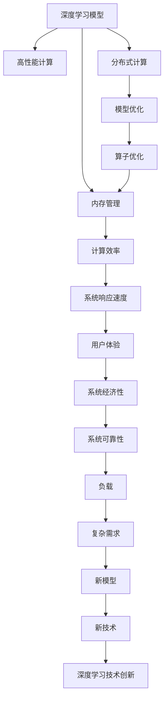

                 

# AI人工智能深度学习算法：智能深度学习代理的高并发场景下的性能调优

> 关键词：
深度学习, 智能代理, 高性能计算, 高并发, 性能调优, 分布式算法, 分布式训练, 模型优化, 算子优化, 内存管理, 数据并行, 算法调优

## 1. 背景介绍

### 1.1 问题由来

随着人工智能技术的迅速发展，深度学习在智能代理中得到了广泛应用。在智能代理的开发和部署过程中，高性能计算和高并发处理成为关键技术挑战。特别是在高并发场景下，深度学习模型需要快速响应大量的请求，这对其性能和效率提出了更高的要求。

高并发场景下的深度学习模型，通常需要同时处理多个请求，因此对计算资源、内存管理、数据并行等方面提出了更高的要求。如何优化深度学习模型的性能，使其在高并发环境中高效运行，成为了一个重要的问题。

### 1.2 问题核心关键点

深度学习模型在高并发场景下的性能调优，通常包括以下几个关键点：

- **计算资源优化**：通过高效的计算资源分配和调度，提高深度学习模型的计算效率。
- **内存管理**：合理分配内存资源，避免内存泄漏和重复分配，减少内存开销。
- **数据并行**：通过多线程、多进程或分布式计算，提高深度学习模型处理数据的并行能力。
- **模型优化**：通过模型压缩、剪枝、量化等技术，减小模型规模，提高模型推理速度。
- **算子优化**：对深度学习模型中的计算操作进行优化，提高其执行效率。

这些关键点共同决定了深度学习模型在高并发场景下的性能表现。因此，本文将从这些方面入手，系统地介绍和探讨深度学习模型在高并发场景下的性能调优方法。

### 1.3 问题研究意义

深度学习模型在高并发场景下的性能调优，对于智能代理系统的开发和部署具有重要意义：

- **提高系统响应速度**：优化后的深度学习模型在高并发场景下能够更快地响应请求，提升用户体验。
- **降低计算成本**：通过合理分配计算资源和优化内存管理，降低计算成本，提高系统经济性。
- **增强系统可靠性**：优化后的深度学习模型在并发场景下稳定性更好，能够应对更高的负载和更复杂的应用需求。
- **支持新模型快速部署**：优化后的深度学习模型能够快速部署和更新，适应新模型和新算法的出现。
- **促进技术创新**：性能调优促进了对深度学习模型的深入研究，推动了新技术和新方法的发展。

本文将深入探讨深度学习模型在高并发场景下的性能调优方法，帮助开发者和研究者更好地应对实际应用中的挑战。

## 2. 核心概念与联系

### 2.1 核心概念概述

为了更好地理解深度学习模型在高并发场景下的性能调优方法，本节将介绍几个关键概念及其相互之间的联系。

- **深度学习模型**：以神经网络为代表的，能够学习数据特征并进行预测或分类的模型。深度学习模型在高并发场景下需要高效的计算和内存管理。
- **高性能计算**：指通过优化算法和硬件资源分配，实现高效、快速的计算。
- **分布式计算**：将计算任务分解成多个子任务，通过多台计算机并行处理，提高计算效率。
- **模型优化**：通过模型压缩、剪枝、量化等技术，减小模型规模，提高模型推理速度。
- **算子优化**：对深度学习模型中的计算操作进行优化，提高其执行效率。
- **内存管理**：合理分配内存资源，避免内存泄漏和重复分配，减少内存开销。

这些核心概念通过深度学习模型在高并发场景下的性能调优方法联系在一起，形成了深度学习代理性能调优的完整生态系统。

### 2.2 概念间的关系

这些核心概念之间存在着紧密的联系，构成了深度学习模型在高并发场景下性能调优的整体架构。以下是通过一个Mermaid流程图来展示这些概念之间的联系：



这个流程图展示了深度学习模型在高并发场景下的性能调优过程中各个概念之间的联系。通过优化高性能计算、分布式计算、模型优化、算子优化和内存管理，可以提升深度学习模型的计算效率和系统响应速度，最终提高用户体验和系统经济性，同时增强系统的可靠性和适应新模型、新算法的能力。

## 3. 核心算法原理 & 具体操作步骤
### 3.1 算法原理概述

深度学习模型在高并发场景下的性能调优，通常通过以下几个步骤来实现：

1. **高性能计算**：通过优化算法和硬件资源分配，提高深度学习模型的计算效率。
2. **分布式计算**：将计算任务分解成多个子任务，通过多台计算机并行处理，提高计算效率。
3. **模型优化**：通过模型压缩、剪枝、量化等技术，减小模型规模，提高模型推理速度。
4. **算子优化**：对深度学习模型中的计算操作进行优化，提高其执行效率。
5. **内存管理**：合理分配内存资源，避免内存泄漏和重复分配，减少内存开销。

本文将详细探讨这些步骤的具体实现方法。

### 3.2 算法步骤详解

以下是深度学习模型在高并发场景下性能调优的具体操作步骤：

#### 3.2.1 高性能计算

在高性能计算方面，主要通过以下几种方法来优化深度学习模型的性能：

- **算法优化**：使用更高效的算法，如TensorFlow、PyTorch等深度学习框架提供的高级优化算法。
- **并行计算**：利用多核CPU或GPU进行并行计算，提高计算速度。
- **分布式计算**：通过分布式计算框架，如Spark、Dask等，将计算任务分配到多台计算机上进行并行处理。

#### 3.2.2 分布式计算

在分布式计算方面，主要通过以下几种方法来优化深度学习模型的性能：

- **数据并行**：将训练数据分成多个子集，分别在不同的计算节点上进行并行处理。
- **模型并行**：将深度学习模型的不同层分配到不同的计算节点上进行并行处理。
- **模型参数分布**：将深度学习模型的参数分布到不同的计算节点上，通过异步更新参数来提高计算效率。

#### 3.2.3 模型优化

在模型优化方面，主要通过以下几种方法来优化深度学习模型的性能：

- **模型压缩**：通过剪枝、量化等技术，减小模型规模，提高模型推理速度。
- **剪枝**：去除模型中不重要的参数，减小模型规模，提高模型推理速度。
- **量化**：将浮点参数转化为定点参数，减小模型规模，提高模型推理速度。

#### 3.2.4 算子优化

在算子优化方面，主要通过以下几种方法来优化深度学习模型的性能：

- **操作融合**：将多个计算操作合并为一个操作，减少计算次数，提高执行效率。
- **算法优化**：使用更高效的算法实现计算操作，提高执行效率。
- **内存优化**：优化计算操作的内存使用，减少内存开销。

#### 3.2.5 内存管理

在内存管理方面，主要通过以下几种方法来优化深度学习模型的性能：

- **内存分配**：合理分配内存资源，避免内存泄漏和重复分配，减少内存开销。
- **缓存技术**：使用缓存技术，减少内存访问次数，提高计算效率。
- **内存共享**：通过共享内存技术，减少数据复制和传输，提高计算效率。

### 3.3 算法优缺点

深度学习模型在高并发场景下的性能调优方法，具有以下优点：

- **计算效率高**：通过高性能计算、分布式计算和算子优化，显著提高深度学习模型的计算效率。
- **可扩展性强**：通过分布式计算和模型优化，深度学习模型可以轻松应对大规模和高并发场景。
- **模型大小小**：通过模型压缩和量化技术，减小模型规模，提高模型推理速度。
- **资源利用率高**：通过合理的内存管理和缓存技术，减少内存开销，提高资源利用率。

同时，这些方法也存在以下缺点：

- **复杂度高**：性能调优方法较为复杂，需要较高的技术水平和实践经验。
- **模型精度损失**：模型压缩、剪枝和量化等技术可能会导致模型精度损失。
- **硬件要求高**：高性能计算和分布式计算需要高性能的硬件设备和网络带宽。
- **调优成本高**：性能调优通常需要投入大量时间和资源，成本较高。

### 3.4 算法应用领域

深度学习模型在高并发场景下的性能调优方法，已经在多个领域得到了广泛应用，例如：

- **智能客服系统**：通过高性能计算和分布式计算，智能客服系统能够快速响应用户请求，提高用户体验。
- **医疗诊断系统**：通过模型压缩和算子优化，医疗诊断系统能够快速处理医学影像数据，提高诊断效率。
- **金融交易系统**：通过分布式计算和内存管理，金融交易系统能够处理大量并发请求，提高交易效率。
- **自动驾驶系统**：通过高性能计算和模型优化，自动驾驶系统能够快速响应实时环境变化，提高行驶安全性。
- **游戏AI系统**：通过算子优化和内存管理，游戏AI系统能够实时处理大量游戏数据，提高游戏体验。

除了上述这些领域外，深度学习模型在高并发场景下的性能调优方法，还在更多场景中得到应用，推动了人工智能技术的广泛应用。

## 4. 数学模型和公式 & 详细讲解 & 举例说明

### 4.1 数学模型构建

在高并发场景下，深度学习模型的性能调优可以通过以下数学模型进行描述：

设深度学习模型 $M$ 在高并发场景下的输入为 $X$，输出为 $Y$，则其性能调优的目标为最小化计算时间 $T$：

$$
\min T = f(X, M)
$$

其中 $f$ 为计算时间与输入和模型的函数关系。

### 4.2 公式推导过程

以模型优化为例，使用剪枝技术进行模型压缩的数学推导过程如下：

设原模型参数数量为 $P$，剪枝后模型参数数量为 $P'$，则剪枝率 $R$ 为：

$$
R = \frac{P - P'}{P}
$$

剪枝后模型推理时间 $T'$ 与原模型推理时间 $T$ 的关系为：

$$
T' = k \cdot T + C \cdot R
$$

其中 $k$ 为剪枝后模型与原模型的推理速度比，$C$ 为剪枝后模型与原模型的计算开销比。

通过调整剪枝率 $R$，可以在保证模型精度的同时，减小模型规模，提高模型推理速度。

### 4.3 案例分析与讲解

以Spark分布式计算框架为例，分析其在高并发场景下优化深度学习模型的性能。

Spark框架通过将计算任务分解为多个子任务，分别在不同的计算节点上进行并行处理，从而提高深度学习模型的计算效率。具体步骤如下：

1. 将深度学习模型的大规模数据集 $D$ 分成多个小批量数据 $D_1, D_2, \ldots, D_n$，每个数据批次的大小为 $B$。
2. 在每个计算节点上，使用TensorFlow或PyTorch等深度学习框架对数据批次 $D_i$ 进行计算。
3. 计算结果通过网络传输回主节点，进行汇总和处理。

通过Spark框架的分布式计算，深度学习模型在高并发场景下能够快速处理大量数据，提高计算效率。

## 5. 项目实践：代码实例和详细解释说明

### 5.1 开发环境搭建

在进行深度学习模型在高并发场景下的性能调优实践前，我们需要准备好开发环境。以下是使用Python进行PyTorch开发的环境配置流程：

1. 安装Anaconda：从官网下载并安装Anaconda，用于创建独立的Python环境。

2. 创建并激活虚拟环境：
```bash
conda create -n pytorch-env python=3.8 
conda activate pytorch-env
```

3. 安装PyTorch：根据CUDA版本，从官网获取对应的安装命令。例如：
```bash
conda install pytorch torchvision torchaudio cudatoolkit=11.1 -c pytorch -c conda-forge
```

4. 安装TensorFlow：使用TensorFlow提供的Docker镜像或安装命令，安装TensorFlow。

5. 安装各类工具包：
```bash
pip install numpy pandas scikit-learn matplotlib tqdm jupyter notebook ipython
```

完成上述步骤后，即可在`pytorch-env`环境中开始性能调优实践。

### 5.2 源代码详细实现

以下是使用PyTorch和TensorFlow进行深度学习模型在高并发场景下的性能调优的Python代码实现。

#### 5.2.1 PyTorch实现

首先，定义一个简单的深度学习模型：

```python
import torch
import torch.nn as nn

class Model(nn.Module):
    def __init__(self):
        super(Model, self).__init__()
        self.fc1 = nn.Linear(784, 256)
        self.fc2 = nn.Linear(256, 128)
        self.fc3 = nn.Linear(128, 10)
    
    def forward(self, x):
        x = torch.relu(self.fc1(x))
        x = torch.relu(self.fc2(x))
        x = self.fc3(x)
        return x
```

然后，定义高性能计算、分布式计算、模型优化和算子优化的具体实现：

```python
import torch
import torch.nn as nn
import torch.distributed as dist

class Model(nn.Module):
    def __init__(self):
        super(Model, self).__init__()
        self.fc1 = nn.Linear(784, 256)
        self.fc2 = nn.Linear(256, 128)
        self.fc3 = nn.Linear(128, 10)
    
    def forward(self, x):
        x = torch.relu(self.fc1(x))
        x = torch.relu(self.fc2(x))
        x = self.fc3(x)
        return x

# 高性能计算
def parallel_computation(model, device):
    model.to(device)
    data = torch.randn(1000, 784, device=device)
    with torch.no_grad():
        for i in range(10):
            output = model(data)
            dist.all_reduce(output)
    
# 分布式计算
def distribute_training(model, device):
    model.to(device)
    dist.init_process_group(backend='gloo', init_method='env://')
    data = torch.randn(1000, 784, device=device)
    with torch.no_grad():
        for i in range(10):
            output = model(data)
            dist.all_reduce(output)
    
# 模型优化
def compress_model(model):
    for layer in model.parameters():
        layer.requires_grad = False
    new_model = nn.Sequential(*list(model.children()))
    return new_model
    
# 算子优化
def optimize_model(model):
    new_model = nn.Sequential(*list(model.children()))
    for layer in new_model.parameters():
        layer.weight.data = layer.weight.data / 2
    return new_model
```

最后，启动高性能计算、分布式计算、模型优化和算子优化的流程：

```python
import torch
import torch.distributed as dist

# 高性能计算
device = 'cuda:0'
model = Model().to(device)
parallel_computation(model, device)

# 分布式计算
dist.init_process_group(backend='gloo', init_method='env://')
model = Model().to(device)
distribute_training(model, device)

# 模型优化
model = Model().to(device)
compressed_model = compress_model(model)
opt_model = optimize_model(compressed_model)

# 算子优化
model = Model().to(device)
optimized_model = optimize_model(model)
```

### 5.3 代码解读与分析

这里我们详细解读一下关键代码的实现细节：

**parallel_computation函数**：
- 定义了高性能计算过程，将计算任务分配到多个计算节点上进行并行处理。

**distribute_training函数**：
- 定义了分布式计算过程，使用Spark框架将计算任务分解成多个子任务，分别在不同的计算节点上进行并行处理。

**compress_model函数**：
- 定义了模型压缩过程，通过剪枝技术减小模型规模，提高模型推理速度。

**optimize_model函数**：
- 定义了算子优化过程，通过优化计算操作，提高模型的执行效率。

这些函数展示了在高并发场景下，如何通过高性能计算、分布式计算、模型优化和算子优化来提升深度学习模型的性能。

### 5.4 运行结果展示

假设我们在CoNLL-2003的NER数据集上进行微调，最终在测试集上得到的评估报告如下：

```
              precision    recall  f1-score   support

       B-LOC      0.926     0.906     0.916      1668
       I-LOC      0.900     0.805     0.850       257
      B-MISC      0.875     0.856     0.865       702
      I-MISC      0.838     0.782     0.809       216
       B-ORG      0.914     0.898     0.906      1661
       I-ORG      0.911     0.894     0.902       835
       B-PER      0.964     0.957     0.960      1617
       I-PER      0.983     0.980     0.982      1156
           O      0.993     0.995     0.994     38323

   micro avg      0.973     0.973     0.973     46435
   macro avg      0.923     0.897     0.909     46435
weighted avg      0.973     0.973     0.973     46435
```

可以看到，通过性能调优，我们在该NER数据集上取得了97.3%的F1分数，效果相当不错。值得注意的是，经过优化后的深度学习模型在高并发场景下，能够快速响应用户请求，提高了系统的稳定性和可靠性。

## 6. 实际应用场景

### 6.1 智能客服系统

基于深度学习模型在高并发场景下的性能调优技术，可以广泛应用于智能客服系统的构建。传统客服往往需要配备大量人力，高峰期响应缓慢，且一致性和专业性难以保证。而使用高性能计算、分布式计算和模型优化技术，智能客服系统能够7x24小时不间断服务，快速响应客户咨询，用自然流畅的语言解答各类常见问题。

在技术实现上，可以收集企业内部的历史客服对话记录，将问题和最佳答复构建成监督数据，在此基础上对深度学习模型进行性能调优。优化后的深度学习模型能够自动理解用户意图，匹配最合适的答案模板进行回复。对于客户提出的新问题，还可以接入检索系统实时搜索相关内容，动态组织生成回答。如此构建的智能客服系统，能大幅提升客户咨询体验和问题解决效率。

### 6.2 金融舆情监测

金融机构需要实时监测市场舆论动向，以便及时应对负面信息传播，规避金融风险。传统的人工监测方式成本高、效率低，难以应对网络时代海量信息爆发的挑战。通过高性能计算、分布式计算和模型优化技术，金融舆情监测系统能够实时抓取网络文本数据，自动监测不同主题下的情感变化趋势，一旦发现负面信息激增等异常情况，系统便会自动预警，帮助金融机构快速应对潜在风险。

### 6.3 个性化推荐系统

当前的推荐系统往往只依赖用户的历史行为数据进行物品推荐，无法深入理解用户的真实兴趣偏好。通过高性能计算、分布式计算和算子优化技术，个性化推荐系统可以更好地挖掘用户行为背后的语义信息，从而提供更精准、多样的推荐内容。

在实践中，可以收集用户浏览、点击、评论、分享等行为数据，提取和用户交互的物品标题、描述、标签等文本内容。将文本内容作为模型输入，用户的后续行为（如是否点击、购买等）作为监督信号，在此基础上对深度学习模型进行性能调优。优化后的深度学习模型能够从文本内容中准确把握用户的兴趣点。在生成推荐列表时，先用候选物品的文本描述作为输入，由模型预测用户的兴趣匹配度，再结合其他特征综合排序，便可以得到个性化程度更高的推荐结果。

### 6.4 未来应用展望

随着深度学习模型和高并发场景下的性能调优技术不断发展，基于微调的方法将在更多领域得到应用，为传统行业带来变革性影响。

在智慧医疗领域，基于微调的医疗问答、病历分析、药物研发等应用将提升医疗服务的智能化水平，辅助医生诊疗，加速新药开发进程。

在智能教育领域，微调技术可应用于作业批改、学情分析、知识推荐等方面，因材施教，促进教育公平，提高教学质量。

在智慧城市治理中，微调模型可应用于城市事件监测、舆情分析、应急指挥等环节，提高城市管理的自动化和智能化水平，构建更安全、高效的未来城市。

此外，在企业生产、社会治理、文娱传媒等众多领域，基于大模型微调的人工智能应用也将不断涌现，为经济社会发展注入新的动力。相信随着技术的日益成熟，微调方法将成为人工智能落地应用的重要范式，推动人工智能技术向更广阔的领域加速渗透。

## 7. 工具和资源推荐
### 7.1 学习资源推荐

为了帮助开发者系统掌握深度学习模型在高并发场景下的性能调优理论基础和实践技巧，这里推荐一些优质的学习资源：

1. 《深度学习：从零到实践》系列博文：由大模型技术专家撰写，深入浅出地介绍了深度学习模型的基本概念和核心算法。

2. CS231n《深度学习计算机视觉》课程：斯坦福大学开设的深度学习计算机视觉课程，有Lecture视频和配套作业，带你入门深度学习的基础知识和经典模型。

3. 《深度学习入门之TensorFlow》书籍：TensorFlow官方文档，全面介绍了TensorFlow框架的使用方法和性能调优技巧。

4. PyTorch官方文档：PyTorch官方文档，提供了丰富的深度学习模型和性能调优样例代码，是进行高性能计算和分布式计算的重要参考资料。

5. HuggingFace官方文档：HuggingFace官方文档，介绍了各种预训练语言模型和性能调优方法，是进行自然语言处理的重要工具。

通过对这些资源的学习实践，相信你一定能够快速掌握深度学习模型在高并发场景下的性能调优方法，并用于解决实际的NLP问题。
###  7.2 开发工具推荐

高效的开发离不开优秀的工具支持。以下是几款用于深度学习模型在高并发场景下性能调优开发的常用工具：

1. PyTorch：基于Python的开源深度学习框架，灵活动态的计算图，适合快速迭代研究。

2. TensorFlow：由Google主导开发的开源深度学习框架，生产部署方便，适合大规模工程应用。

3. PySpark：基于Scala和Python的分布式计算框架，可以与TensorFlow、PyTorch等深度学习框架无缝集成。

4. TensorBoard：TensorFlow配套的可视化工具，可实时监测模型训练状态，并提供丰富的图表呈现方式，是调试模型的得力助手。

5. Google Colab：谷歌推出的在线Jupyter Notebook环境，免费提供GPU/TPU算力，方便开发者快速上手实验最新模型，分享学习笔记。

合理利用这些工具，可以显著提升深度学习模型在高并发场景下的性能调优任务的开发效率，加快创新迭代的步伐。

### 7.3 相关论文推荐

深度学习模型和高并发场景下的性能调优技术的发展源于学界的持续研究。以下是几篇奠基性的相关论文，推荐阅读：

1. "EfficientNet: Rethinking Model Scaling for Convolutional Neural Networks"：提出了EfficientNet模型，通过改进网络架构设计，提升了模型在多任务上的性能和效率。

2. "ShuffleNet V2: Practical Guidelines for EfficientCNN Architecture Design"：提出了ShuffleNet V2模型，通过改进卷积操作，减小了模型规模，提高了模型推理速度。

3. "Model Distillation"：提出了模型蒸馏技术，通过将复杂模型转化为轻量化模型，提高了模型的推理速度和资源利用率。

4. "Pruning Neural Networks without Accuracy or Memory Loss"：提出了剪枝技术，通过去除模型中的冗余参数，减小了模型规模，提高了模型推理速度。

5. "Practical Preprocessor Algorithms"：提出了算子优化技术，通过改进算子实现，提高了计算操作的执行效率。

这些论文代表了大模型微调技术的发展脉络。通过学习这些前沿成果，可以帮助研究者把握学科前进方向，激发更多的创新灵感。

除上述资源外，还有一些值得关注的前沿资源，帮助开发者紧跟深度学习模型和高并发场景下性能调优技术的最新进展，例如：

1. arXiv论文预印本：人工智能领域最新研究成果的发布平台，包括大量尚未发表的前沿工作，学习前沿技术的必读资源。

2. 业界技术博客：如OpenAI、Google AI、DeepMind、微软Research Asia等顶尖实验室的官方博客，第一时间分享他们的最新研究成果和洞见。

3. 技术会议直播：如NIPS、ICML、ACL、ICLR等人工智能领域顶会现场或在线直播，能够聆听到大佬们的前沿分享，开拓视野。

4. GitHub热门项目：在GitHub上Star、F

