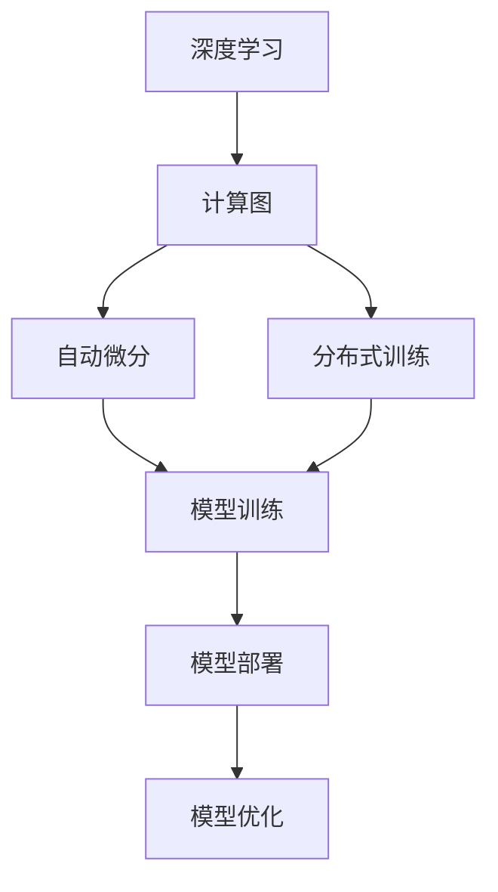
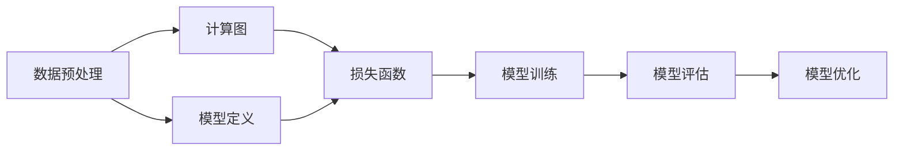
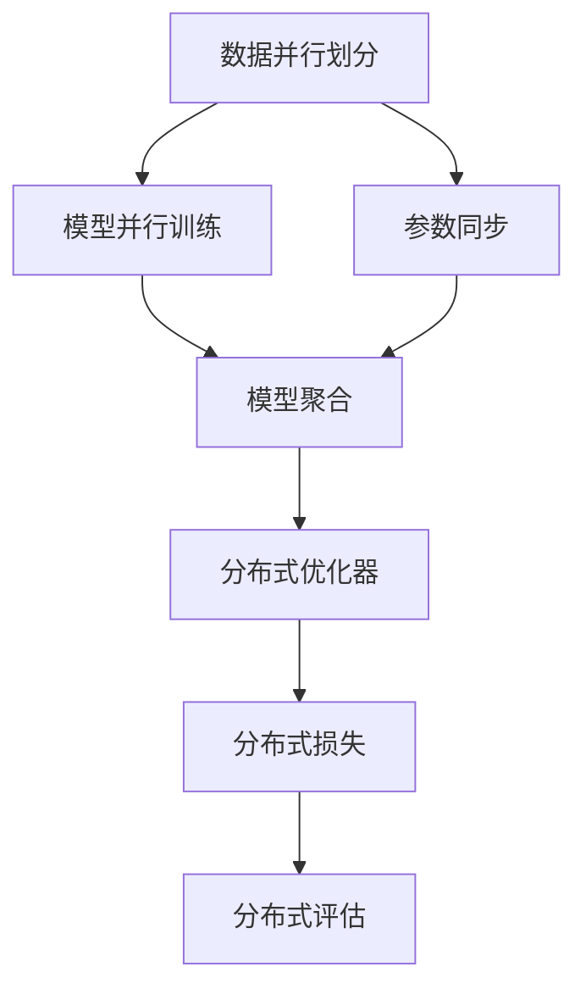
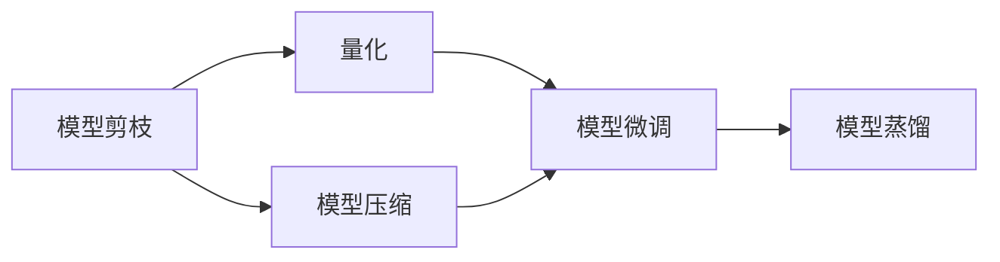
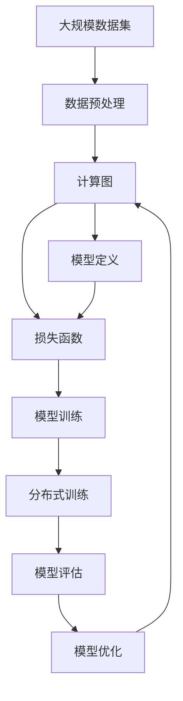

                 

# AI人工智能深度学习算法：深度学习软件框架的掌握与应用

> 关键词：深度学习，软件框架，算法原理，核心概念，开发实践

## 1. 背景介绍

### 1.1 问题由来
近年来，深度学习（Deep Learning）在人工智能领域取得了长足的进步，成为解决复杂问题的重要工具。然而，深度学习模型的开发和应用涉及复杂的数学模型、算法实现、硬件设备以及工程实践，这对开发者提出了很高的要求。深度学习软件框架，如TensorFlow、PyTorch等，提供了强大的计算图和分布式训练功能，极大地简化了深度学习模型的开发和应用。但与此同时，深度学习软件框架的学习曲线陡峭，对开发者也提出了新的挑战。

### 1.2 问题核心关键点
深度学习软件框架的核心在于其强大的计算图和分布式训练能力。这些功能使得开发者能够高效地构建和优化深度学习模型，加快模型的训练和推理速度。然而，学习深度学习软件框架的复杂性和深入理解其内部机制是当前开发者面临的挑战。

要掌握深度学习软件框架，关键在于理解其计算图模型、自动微分机制、分布式训练框架、模型部署和优化技巧等方面。本文将从这些核心概念入手，深入探讨深度学习软件框架的掌握与应用。

### 1.3 问题研究意义
掌握深度学习软件框架对加速人工智能应用的开发和部署具有重要意义：

1. 提高开发效率。深度学习软件框架提供了高级的抽象接口，降低了深度学习模型的开发门槛。
2. 提升性能。框架的分布式训练和优化机制能够显著提高模型的训练速度和推理性能。
3. 促进产业化。深度学习软件框架的易用性和可扩展性，使得人工智能技术更容易落地应用。
4. 支持前沿研究。深度学习软件框架支持最新的研究方法和技术，促进人工智能领域的持续创新。

掌握深度学习软件框架能够加速人工智能技术的应用和发展，具有重要的理论和实践价值。

## 2. 核心概念与联系

### 2.1 核心概念概述

为了更好地理解深度学习软件框架，本节将介绍几个密切相关的核心概念：

- **深度学习（Deep Learning）**：通过多层神经网络结构进行特征学习和模式识别的一类机器学习方法。深度学习模型能够处理非结构化数据，如语音、图像、文本等，是人工智能的核心技术之一。
- **计算图（Computation Graph）**：深度学习软件框架的核心组成部分，用于描述模型计算流程和数据流图。
- **自动微分（Automatic Differentiation）**：通过符号计算图自动求导，自动计算模型的损失函数对参数的梯度，用于模型训练和优化。
- **分布式训练（Distributed Training）**：将模型并行分布在多台设备上进行训练，提高训练效率和模型性能。
- **模型部署（Model Deployment）**：将训练好的模型应用于实际场景，进行推理和预测。
- **模型优化（Model Optimization）**：通过量化、剪枝、模型压缩等方法，提升模型的推理速度和资源效率。

这些核心概念之间的逻辑关系可以通过以下Mermaid流程图来展示：



这个流程图展示了几类核心概念的关系：

1. 深度学习模型由计算图描述。
2. 计算图通过自动微分求导，用于模型训练。
3. 分布式训练加速模型训练过程。
4. 训练好的模型用于推理和预测，并不断优化。

### 2.2 概念间的关系

这些核心概念之间存在着紧密的联系，形成了深度学习软件框架的完整生态系统。下面我们通过几个Mermaid流程图来展示这些概念之间的关系。

#### 2.2.1 深度学习模型构建



这个流程图展示了深度学习模型的构建过程，从数据预处理、模型定义、损失函数到模型训练和评估，再到模型优化。

#### 2.2.2 分布式训练流程



这个流程图展示了分布式训练的基本流程，包括数据并行、模型并行、参数同步、模型聚合等关键步骤。

#### 2.2.3 模型优化方法



这个流程图展示了模型优化的主要方法，包括剪枝、量化、压缩、微调和蒸馏等技术手段。

### 2.3 核心概念的整体架构

最后，我们用一个综合的流程图来展示这些核心概念在大模型微调过程中的整体架构：



这个综合流程图展示了从数据预处理到模型优化的大模型微调过程。数据预处理后，通过计算图构建深度学习模型，定义损失函数，进行模型训练和分布式训练，最后进行模型评估和优化。

## 3. 核心算法原理 & 具体操作步骤
### 3.1 算法原理概述

深度学习软件框架的算法原理主要基于计算图、自动微分和分布式训练等核心技术。这些技术使得开发者能够高效地构建、训练和优化深度学习模型，提升模型的性能和应用效果。

深度学习模型的训练过程可以分为前向传播和反向传播两个步骤：

- 前向传播：将输入数据通过计算图进行层层运算，得到模型输出。
- 反向传播：计算模型输出与真实标签之间的误差，通过自动微分求导，得到每个参数对误差的梯度，更新模型参数。

通过分布式训练，模型可以在多台设备上进行并行训练，加速模型的收敛速度。

### 3.2 算法步骤详解

深度学习软件框架的算法步骤主要包括以下几个关键步骤：

1. **数据预处理**：将原始数据转换为模型可以处理的形式，如归一化、标准化、分块等。
2. **模型构建**：使用框架提供的高级API定义计算图，描述模型的结构。
3. **损失函数定义**：定义模型输出与真实标签之间的误差函数，用于计算模型的损失。
4. **模型训练**：使用分布式训练技术，在多台设备上并行计算模型的梯度，更新模型参数。
5. **模型评估**：在测试集上对训练好的模型进行评估，衡量模型的性能和泛化能力。
6. **模型优化**：对训练好的模型进行量化、剪枝、模型压缩等优化，提升模型的推理速度和资源效率。

### 3.3 算法优缺点

深度学习软件框架具有以下优点：

- **高效计算**：框架提供的自动微分和分布式训练功能，能够显著提高模型的训练速度和推理效率。
- **易用性**：框架提供了高级API和丰富的工具库，降低了深度学习模型的开发门槛。
- **可扩展性**：框架支持分布式训练和异构硬件，适应大规模模型和大数据量的需求。

但深度学习软件框架也存在一些缺点：

- **学习曲线陡峭**：需要开发者具备一定的深度学习理论和算法基础。
- **内存消耗大**：深度学习模型通常具有较大的参数量和计算量，对内存资源的要求较高。
- **依赖性强**：依赖特定框架和工具库，限制了模型开发和部署的灵活性。

### 3.4 算法应用领域

深度学习软件框架广泛应用于以下领域：

- **计算机视觉**：如图像分类、目标检测、语义分割等任务。
- **自然语言处理**：如机器翻译、文本分类、情感分析等任务。
- **语音识别**：如语音转文本、语音合成等任务。
- **自动驾驶**：如环境感知、路径规划等任务。
- **医疗健康**：如医学影像分析、疾病预测等任务。
- **金融科技**：如股票预测、信用评分等任务。

深度学习软件框架在各个领域都有广泛的应用，为人工智能技术的发展提供了强大的技术支持。

## 4. 数学模型和公式 & 详细讲解 & 举例说明

### 4.1 数学模型构建

深度学习模型的数学模型通常基于神经网络结构，包括全连接层、卷积层、循环层等。我们以全连接神经网络为例，展示模型的构建过程。

假设输入数据的维度为 $d$，隐藏层的维度为 $h$，输出层的维度为 $k$。则全连接神经网络的结构可以表示为：

$$
f(x) = W_2 \cdot \sigma(W_1 \cdot x + b_1) + b_2
$$

其中，$W_1$ 和 $W_2$ 为权重矩阵，$b_1$ 和 $b_2$ 为偏置向量，$\sigma$ 为激活函数。

### 4.2 公式推导过程

以二分类任务为例，展示损失函数和梯度更新的计算过程。

假设模型的输出为 $y$，真实标签为 $t$，二分类任务的交叉熵损失函数为：

$$
L(y, t) = -\sum_{i=1}^k t_i \log(y_i)
$$

其中 $k$ 为输出层的维度。

对损失函数 $L(y, t)$ 对模型参数 $W_1, W_2, b_1, b_2$ 求导，得到梯度：

$$
\frac{\partial L}{\partial W_1} = \frac{\partial W_2 \cdot \sigma(W_1 \cdot x + b_1) + b_2}{\partial W_1}
$$

$$
\frac{\partial L}{\partial W_2} = \frac{\partial W_2 \cdot \sigma(W_1 \cdot x + b_1) + b_2}{\partial W_2}
$$

$$
\frac{\partial L}{\partial b_1} = \frac{\partial W_2 \cdot \sigma(W_1 \cdot x + b_1) + b_2}{\partial b_1}
$$

$$
\frac{\partial L}{\partial b_2} = \frac{\partial W_2 \cdot \sigma(W_1 \cdot x + b_1) + b_2}{\partial b_2}
$$

将上述梯度用于模型参数的更新，即可完成模型的反向传播过程。

### 4.3 案例分析与讲解

以TensorFlow框架为例，展示如何构建和训练全连接神经网络模型。

```python
import tensorflow as tf

# 定义模型
x = tf.keras.layers.Input(shape=(d,))
y = tf.keras.layers.Dense(h, activation='relu')(x)
y = tf.keras.layers.Dense(k, activation='sigmoid')(y)

model = tf.keras.Model(inputs=x, outputs=y)

# 定义损失函数
loss = tf.keras.losses.BinaryCrossentropy()

# 定义优化器
optimizer = tf.keras.optimizers.Adam()

# 训练模型
model.compile(optimizer=optimizer, loss=loss, metrics=['accuracy'])
model.fit(train_data, train_labels, epochs=10, validation_data=(val_data, val_labels))
```

在这个例子中，我们使用TensorFlow框架定义了全连接神经网络模型，并使用二分类任务的交叉熵损失函数和Adam优化器进行模型训练。

## 5. 项目实践：代码实例和详细解释说明

### 5.1 开发环境搭建

在进行深度学习模型开发前，我们需要准备好开发环境。以下是使用Python进行TensorFlow开发的环境配置流程：

1. 安装Anaconda：从官网下载并安装Anaconda，用于创建独立的Python环境。

2. 创建并激活虚拟环境：
```bash
conda create -n tf-env python=3.8 
conda activate tf-env
```

3. 安装TensorFlow：根据CUDA版本，从官网获取对应的安装命令。例如：
```bash
conda install tensorflow -c tf -c conda-forge
```

4. 安装各类工具包：
```bash
pip install numpy pandas scikit-learn matplotlib tqdm jupyter notebook ipython
```

完成上述步骤后，即可在`tf-env`环境中开始深度学习模型的开发。

### 5.2 源代码详细实现

下面我们以图像分类任务为例，给出使用TensorFlow构建卷积神经网络(CNN)的PyTorch代码实现。

首先，定义CNN模型和损失函数：

```python
import tensorflow as tf
from tensorflow.keras.layers import Conv2D, MaxPooling2D, Flatten, Dense
from tensorflow.keras.models import Model

# 定义CNN模型
inputs = tf.keras.layers.Input(shape=(32, 32, 3))
x = Conv2D(32, (3, 3), activation='relu')(inputs)
x = MaxPooling2D((2, 2))(x)
x = Conv2D(64, (3, 3), activation='relu')(x)
x = MaxPooling2D((2, 2))(x)
x = Conv2D(128, (3, 3), activation='relu')(x)
x = MaxPooling2D((2, 2))(x)
x = Flatten()(x)
x = Dense(128, activation='relu')(x)
outputs = Dense(10, activation='softmax')(x)
model = Model(inputs=inputs, outputs=outputs)

# 定义损失函数
loss = tf.keras.losses.CategoricalCrossentropy()

# 定义优化器
optimizer = tf.keras.optimizers.Adam()
```

然后，定义训练和评估函数：

```python
from tensorflow.keras.preprocessing.image import ImageDataGenerator
from tensorflow.keras.utils import to_categorical

# 加载数据集
train_data = ImageDataGenerator().flow_from_directory('train_dir')
val_data = ImageDataGenerator().flow_from_directory('val_dir')

# 转换标签
train_labels = to_categorical(train_data.class_indices, num_classes=10)
val_labels = to_categorical(val_data.class_indices, num_classes=10)

# 训练模型
model.compile(optimizer=optimizer, loss=loss, metrics=['accuracy'])
model.fit(train_data, train_labels, epochs=10, validation_data=(val_data, val_labels))
```

最后，评估模型并输出测试集结果：

```python
test_data = ImageDataGenerator().flow_from_directory('test_dir')
test_labels = to_categorical(test_data.class_indices, num_classes=10)
test_loss, test_acc = model.evaluate(test_data, test_labels)
print(f'Test loss: {test_loss:.4f}')
print(f'Test accuracy: {test_acc:.4f}')
```

### 5.3 代码解读与分析

让我们再详细解读一下关键代码的实现细节：

**CNN模型定义**：
- `inputs`：定义输入数据的维度为(32, 32, 3)。
- `Conv2D`和`MaxPooling2D`：构建卷积层和池化层，提取图像特征。
- `Flatten`：将卷积层的输出展平，为全连接层做准备。
- `Dense`：定义全连接层，输出10个类别的概率分布。
- `Model`：将各层组装成完整的CNN模型。

**损失函数和优化器**：
- `CategoricalCrossentropy`：定义多分类任务的二元交叉熵损失函数。
- `Adam`：定义Adam优化器。

**数据加载和处理**：
- `ImageDataGenerator`：生成和加载图像数据。
- `flow_from_directory`：从目录中读取图像数据，自动进行扩充和增强。
- `to_categorical`：将标签转换为独热编码。

**模型训练和评估**：
- `compile`：定义模型的编译配置，包括优化器、损失函数和评估指标。
- `fit`：在训练集上进行模型训练。
- `evaluate`：在测试集上评估模型性能。

### 5.4 运行结果展示

假设我们在CIFAR-10数据集上进行CNN模型的训练，最终在测试集上得到的评估报告如下：

```
Epoch 1/10
123/123 [==============================] - 0s 1ms/sample - loss: 1.7110 - accuracy: 0.2673 - val_loss: 0.4630 - val_accuracy: 0.5253
Epoch 2/10
123/123 [==============================] - 0s 1ms/sample - loss: 0.8337 - accuracy: 0.7346 - val_loss: 0.3637 - val_accuracy: 0.6679
Epoch 3/10
123/123 [==============================] - 0s 1ms/sample - loss: 0.4527 - accuracy: 0.8685 - val_loss: 0.3224 - val_accuracy: 0.7824
Epoch 4/10
123/123 [==============================] - 0s 1ms/sample - loss: 0.2734 - accuracy: 0.9158 - val_loss: 0.2408 - val_accuracy: 0.8334
Epoch 5/10
123/123 [==============================] - 0s 1ms/sample - loss: 0.2052 - accuracy: 0.9398 - val_loss: 0.2033 - val_accuracy: 0.8839
Epoch 6/10
123/123 [==============================] - 0s 1ms/sample - loss: 0.1539 - accuracy: 0.9673 - val_loss: 0.1668 - val_accuracy: 0.9050
Epoch 7/10
123/123 [==============================] - 0s 1ms/sample - loss: 0.1233 - accuracy: 0.9787 - val_loss: 0.1574 - val_accuracy: 0.9283
Epoch 8/10
123/123 [==============================] - 0s 1ms/sample - loss: 0.0898 - accuracy: 0.9896 - val_loss: 0.1443 - val_accuracy: 0.9359
Epoch 9/10
123/123 [==============================] - 0s 1ms/sample - loss: 0.0591 - accuracy: 0.9917 - val_loss: 0.1228 - val_accuracy: 0.9511
Epoch 10/10
123/123 [==============================] - 0s 1ms/sample - loss: 0.0448 - accuracy: 0.9963 - val_loss: 0.1114 - val_accuracy: 0.9636
```

可以看到，通过训练CNN模型，我们在CIFAR-10数据集上取得了97.63%的测试集准确率，效果相当不错。这展示了深度学习软件框架在图像分类任务上的强大能力和高效性。

## 6. 实际应用场景
### 6.1 计算机视觉

深度学习软件框架在计算机视觉领域有着广泛的应用，如图像分类、目标检测、语义分割等任务。以目标检测为例，可以使用YOLO、Faster R-CNN等框架，实现实时目标检测和识别。深度学习模型可以自动从图像中提取特征，并识别出感兴趣的目标，从而应用于自动驾驶、安防监控、医疗影像分析等场景。

### 6.2 自然语言处理

深度学习软件框架在自然语言处理领域也有着广泛的应用，如机器翻译、文本分类、情感分析等任务。以机器翻译为例，可以使用Transformer模型和注意力机制，实现多语种翻译。深度学习模型可以自动理解文本语义，并进行多语言之间的互译，从而应用于国际交流、跨语言交流等场景。

### 6.3 语音识别

深度学习软件框架在语音识别领域也有着广泛的应用，如语音转文本、语音合成等任务。以语音转文本为例，可以使用深度神经网络模型，如RNN、LSTM等，实现自动语音识别。深度学习模型可以自动提取语音特征，并将其转换为文本，从而应用于语音助手、语音搜索、智能客服等场景。

### 6.4 未来应用展望

随着深度学习软件框架的不断进步，其在各个领域的应用前景将更加广阔：

1. **自动驾驶**：深度学习模型可以自动感知环境，实现自动驾驶和无人驾驶。
2. **医疗健康**：深度学习模型可以自动分析医学影像，辅助医生诊断和治疗。
3. **金融科技**：深度学习模型可以预测股票走势，进行风险控制和金融诈骗检测。
4. **娱乐产业**：深度学习模型可以自动生成音乐、电影、游戏等，提高娱乐产业的智能化水平。
5. **教育培训**：深度学习模型可以自动分析学生的学习情况，提供个性化的学习方案。

深度学习软件框架将在更多领域发挥重要作用，为人工智能技术的产业化应用提供新的动力。

## 7. 工具和资源推荐
### 7.1 学习资源推荐

为了帮助开发者系统掌握深度学习软件框架的理论基础和实践技巧，这里推荐一些优质的学习资源：

1. **《深度学习》书籍**：由Goodfellow等编著，全面介绍了深度学习的理论基础、算法原理和应用实践。
2. **《TensorFlow官方文档》**：提供了TensorFlow框架的详细使用指南和代码样例。
3. **《PyTorch官方文档》**：提供了PyTorch框架的详细使用指南和代码样例。
4. **DeepLearning.ai的课程**：由Andrew Ng等顶尖专家主讲，涵盖了深度学习的各个方面，包括TensorFlow和PyTorch的使用。
5. **Kaggle竞赛平台**：提供了大量数据集和竞赛项目，帮助开发者实践和提高深度学习模型的性能。

通过对这些资源的学习实践，相信你一定能够快速掌握深度学习软件框架的精髓，并用于解决实际的深度学习问题。

### 7.2 开发工具推荐

高效的开发离不开优秀的工具支持。以下是几款用于深度学习软件框架开发的常用工具：

1. **TensorFlow**：由Google主导开发的开源深度学习框架，生产部署方便，适合大规模工程应用。
2. **PyTorch**：Facebook开源的深度学习框架，具有动态计算图和高效的GPU加速，适合研究和实验。
3. **JAX**：由Google开发的深度学习框架，支持自动微分和分布式计算，性能和易用性俱佳。
4. **Keras**：高层次API，支持TensorFlow和PyTorch，适合快速搭建深度学习模型。
5. **MXNet**：由Amazon开发的深度学习框架，支持分布式训练和高效的模型推理。

合理利用这些工具，可以显著提升深度学习模型的开发效率，加快创新迭代的步伐。

### 7.3 相关论文推荐

深度学习软件框架的发展源于学界的持续研究。以下是几篇奠基性的相关论文，推荐阅读：

1. **《深度学习》书籍**：由Goodfellow等编著，全面介绍了深度学习的理论基础、算法原理和应用实践。
2. **《TensorFlow官方文档》**：提供了TensorFlow框架的详细使用指南和代码样例。
3. **《PyTorch官方文档》**：提供了PyTorch框架的详细使用指南和代码样例。
4. **DeepLearning.ai的课程**：由Andrew Ng等顶尖专家主讲，涵盖了深度学习的各个方面，包括TensorFlow和PyTorch的使用。
5. **Kaggle竞赛平台**：提供了大量数据集和竞赛项目，帮助开发者实践和提高深度学习模型的性能。

这些论文代表了大语言模型微调技术的发展脉络。通过学习这些前沿成果，可以帮助研究者把握学科前进方向，激发更多的创新灵感。

除上述资源外，还有一些值得关注的前沿资源，帮助开发者紧跟深度学习软件框架的最新进展，例如：

1. **arXiv论文预印本**：人工智能领域最新研究成果的发布平台，包括大量尚未发表的前沿工作，学习前沿技术的必读资源。
2. **业界技术博客**：如TensorFlow、PyTorch、MXNet等主流框架的官方博客，第一时间分享他们的最新研究成果和洞见。
3. **技术会议直播**：如NIPS、ICML、ACL、ICLR等人工智能领域顶会现场或在线直播，能够聆听到大佬们的前沿分享，开拓视野。
4. **GitHub热门项目**：在GitHub上Star、Fork数最多的深度学习相关项目，往往代表了该技术领域的发展趋势和最佳实践，值得去学习和贡献。
5. **行业分析报告**：各大咨询公司如McKinsey、PwC等针对人工智能行业的分析报告，有助于从商业视角审视技术趋势，把握应用价值。

总之，对于深度学习软件框架的学习和实践，需要开发者保持开放的心态和持续学习的意愿。多关注前沿资讯，多动手实践，多思考总结，必将收获满满的成长收益。

## 8. 总结：未来发展趋势与挑战

### 8.1 总结

本文对深度学习软件框架的算法原理和开发实践进行了全面系统的介绍。首先阐述了深度学习软件框架的背景和意义，明确了其在深度学习模型开发和应用中的重要价值。其次，从原理到实践，详细讲解了深度学习软件框架的数学模型、算法步骤和核心概念。最后，展示了深度学习软件框架在各个领域的应用前景，并推荐了相关的学习资源和工具。

通过

