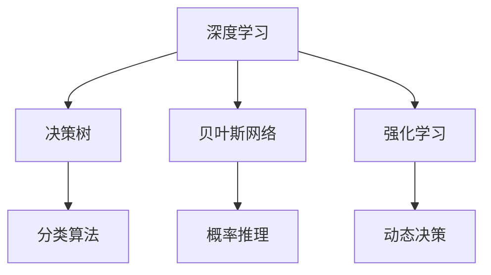
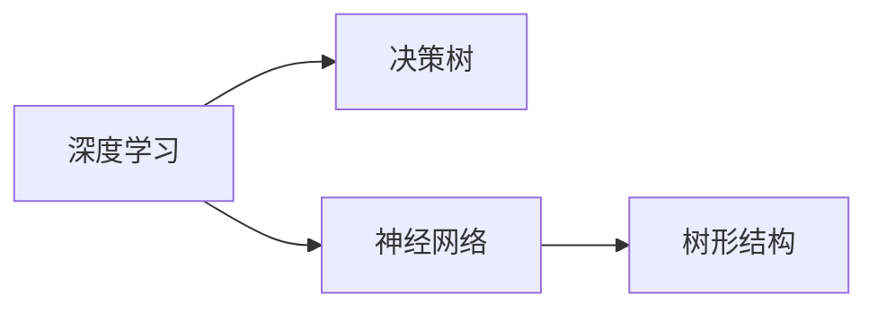
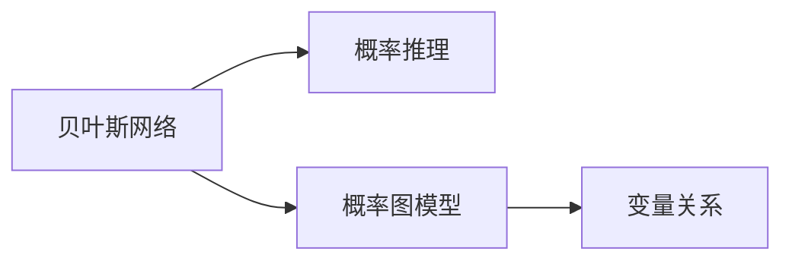
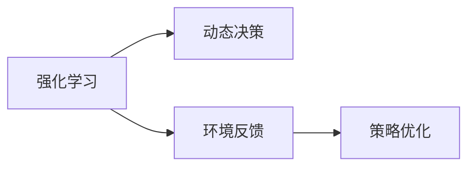

                 

# AI人工智能深度学习算法：理解决策制定与推理机制

> 关键词：人工智能,深度学习,决策制定,推理机制,强化学习,决策树,贝叶斯网络

## 1. 背景介绍

### 1.1 问题由来

在现代科技的推动下，人工智能（AI）技术迅速发展，尤其是在深度学习领域，深度神经网络已经成为了解决复杂问题的重要工具。然而，面对复杂的决策制定与推理机制问题，传统神经网络往往显得力不从心。如何使AI算法能够更好地理解问题背景，制定有效决策，进行逻辑推理，成为了当前人工智能研究的一个热点问题。

为了更好地理解和解决决策制定与推理机制问题，本文将深入探讨AI算法在决策制定和推理机制中的理论基础和实践方法。本文将基于深度学习框架，全面阐述不同算法的原理，并给出实际应用场景中的案例分析和操作细节，为读者提供系统的学习路径。

### 1.2 问题核心关键点

决策制定与推理机制是人工智能的核心问题之一，旨在使机器能够在特定情境下进行准确判断和逻辑推理，以提供有效的决策支持。其核心关键点包括：

- 决策制定：根据输入数据，通过算法计算得到最优决策。
- 推理机制：通过已知知识，推断未知事实或预测未来事件。

本节将详细探讨上述关键点的基本概念、原理以及它们之间的联系。

## 2. 核心概念与联系

### 2.1 核心概念概述

为了更好地理解AI算法在决策制定和推理机制中的运用，本节将介绍几个相关核心概念：

- 深度学习：基于多层神经网络的机器学习框架，用于处理非线性复杂模式。
- 决策树：一种基于树形结构的分类算法，能够通过树的分支结构进行决策。
- 贝叶斯网络：一种基于概率图模型的推理算法，用于推断变量间的关系。
- 强化学习：通过环境反馈，不断优化策略的算法，用于制定动态决策。

这些核心概念之间的逻辑关系可以通过以下Mermaid流程图来展示：



### 2.2 概念间的关系

这些核心概念之间存在着紧密的联系，形成了AI算法决策制定与推理机制的完整生态系统。下面我们通过几个Mermaid流程图来展示这些概念之间的关系。

#### 2.2.1 深度学习与决策树的关系



这个流程图展示了深度学习与决策树之间的关系。深度学习通过多层神经网络提取特征，而决策树则通过树形结构进行分类。

#### 2.2.2 贝叶斯网络与概率推理的关系



这个流程图展示了贝叶斯网络与概率推理之间的关系。贝叶斯网络通过概率图模型表示变量间的关系，概率推理则用于推断变量的概率分布。

#### 2.2.3 强化学习与动态决策的关系



这个流程图展示了强化学习与动态决策之间的关系。强化学习通过环境反馈不断优化策略，以适应不断变化的环境，从而制定动态决策。

## 3. 核心算法原理 & 具体操作步骤
### 3.1 算法原理概述

在AI算法中，决策制定与推理机制的实现依赖于不同的算法和模型。下面我们将详细探讨几种常见的算法原理：

#### 3.1.1 决策树算法

决策树算法通过构建树形结构，实现分类或回归任务。决策树的学习过程分为训练和测试两个阶段：

1. **训练阶段**：从训练数据中学习决策树的构建规则，形成完整的决策树模型。
2. **测试阶段**：利用测试数据评估决策树的准确性和鲁棒性。

决策树的构建规则如下：

1. 选择一个最优特征，根据该特征划分数据集。
2. 对每个子集重复步骤1，直到所有数据都被划分。

#### 3.1.2 贝叶斯网络算法

贝叶斯网络通过概率图模型，实现对变量的联合概率分布进行建模和推断。贝叶斯网络的学习过程分为训练和推理两个阶段：

1. **训练阶段**：从训练数据中学习贝叶斯网络的结构和参数。
2. **推理阶段**：利用已知变量，推断未知变量的概率分布。

贝叶斯网络的结构和参数学习可以通过最大似然估计或贝叶斯结构学习算法实现。

#### 3.1.3 强化学习算法

强化学习通过环境反馈，优化策略的制定。强化学习算法通常包括三个要素：

1. **环境**：提供反馈信息，定义状态空间和动作空间。
2. **策略**：定义动作选择的规则，通常使用深度神经网络实现。
3. **奖励函数**：定义每个动作的奖励值，引导策略优化。

强化学习的学习过程分为探索和利用两个阶段：

1. **探索阶段**：通过随机策略探索环境，获取新的状态和奖励。
2. **利用阶段**：根据过去的经验，选择最优策略。

### 3.2 算法步骤详解

在实际应用中，这些算法需要具体的步骤来实现。下面我们将详细介绍这些算法的具体操作步骤。

#### 3.2.1 决策树算法

决策树的构建步骤如下：

1. **特征选择**：选择最优特征进行划分。
2. **数据划分**：根据特征值将数据集划分到不同的子集。
3. **递归划分**：对每个子集重复步骤1和2，直到满足停止条件。
4. **剪枝**：防止过拟合，通常采用预剪枝和后剪枝两种方法。

#### 3.2.2 贝叶斯网络算法

贝叶斯网络的构建步骤如下：

1. **结构学习**：通过最大似然估计或贝叶斯结构学习算法，确定网络结构。
2. **参数学习**：通过最大似然估计或EM算法，学习网络参数。
3. **推理计算**：利用贝叶斯网络进行联合概率推断。

#### 3.2.3 强化学习算法

强化学习的训练步骤如下：

1. **策略定义**：定义动作选择策略，如Q-learning、SARSA等。
2. **环境模拟**：通过模拟环境获取状态和奖励。
3. **策略优化**：利用梯度下降等优化算法，更新策略参数。
4. **探索与利用**：平衡探索和利用，选择最优动作。

### 3.3 算法优缺点

各种算法在决策制定与推理机制中具有不同的优势和局限性：

- **决策树算法**：易于理解和解释，但容易过拟合。
- **贝叶斯网络算法**：能够处理多变量、高维数据，但计算复杂度高。
- **强化学习算法**：适用于动态、不确定环境，但需要大量的环境交互数据。

### 3.4 算法应用领域

这些算法在多个领域中得到了广泛应用，如金融、医疗、交通等。以下是几个典型的应用场景：

- **金融投资**：利用决策树算法对市场数据进行分类，制定投资策略。
- **医疗诊断**：利用贝叶斯网络算法进行疾病诊断，推断疾病概率。
- **自动驾驶**：利用强化学习算法训练自动驾驶车辆，实现路径规划和决策。

## 4. 数学模型和公式 & 详细讲解  
### 4.1 数学模型构建

本节将使用数学语言对AI算法在决策制定和推理机制中的实现进行更详细的描述。

#### 4.1.1 决策树数学模型

设输入数据集 $D=\{(x_i, y_i)\}_{i=1}^N$，其中 $x_i \in \mathcal{X}$ 为特征向量， $y_i \in \{1,2,...,K\}$ 为标签。决策树的目标是找到最优的划分特征 $X_j$ 和划分阈值 $t_j$，使得划分后的子集能够最大化信息增益或基尼指数。

设 $X_j$ 的取值为 $x_j^{k}$，划分后的子集为 $D_k = \{(x_i, y_i)|x_j^{k}\}$，对应的信息增益为 $IG(X_j,t_j)$，则决策树的构建目标为：

$$
\max_{X_j, t_j} \sum_{k=1}^{K} |D_k| \times IG(X_j, t_j)
$$

#### 4.1.2 贝叶斯网络数学模型

设变量集为 $X=\{x_1, x_2, ..., x_n\}$，条件概率为 $P(x_i|x_1, x_2, ..., x_{i-1}, x_{i+1}, ..., x_n)$，贝叶斯网络的结构为 $G=(V, E)$，其中 $V$ 为变量节点集，$E$ 为边集。

贝叶斯网络的数学模型可以通过联合概率分布 $P(x_1, x_2, ..., x_n)$ 表示，每个变量的概率分布可以通过条件概率和边权重表示，即：

$$
P(x_i|x_1, x_2, ..., x_{i-1}, x_{i+1}, ..., x_n) = \frac{P(x_i|x_1, x_2, ..., x_{i-1}, x_{i+1}, ..., x_n, \text{pa}(x_i)) \times P(\text{pa}(x_i))}{P(x_1, x_2, ..., x_n)}
$$

其中 $\text{pa}(x_i)$ 表示变量 $x_i$ 的父节点集。

#### 4.1.3 强化学习数学模型

设状态空间为 $S$，动作空间为 $A$，奖励函数为 $R(s, a)$，环境状态转移概率为 $P(s'|s, a)$。强化学习的目标是在有限时间内，最大化总奖励和。

设当前状态为 $s_t$，动作为 $a_t$，下一状态为 $s_{t+1}$，则强化学习的学习过程可以表示为：

$$
\max_{\pi} \sum_{t=0}^{\infty} \gamma^t R(s_t, a_t)
$$

其中 $\gamma$ 为折扣因子。

### 4.2 公式推导过程

以下我们将推导决策树、贝叶斯网络和强化学习的数学模型和公式。

#### 4.2.1 决策树的推导

决策树的推导过程如下：

1. 计算每个特征的信息增益：

$$
IG(X_j, t_j) = H(D) - \sum_{k=1}^{K} \frac{|D_k|}{|D|}H(D_k)
$$

其中 $H(D)$ 为数据集 $D$ 的熵，$H(D_k)$ 为划分后的子集 $D_k$ 的熵。

2. 选择最优特征和阈值：

$$
(X_j, t_j) = \arg\max_{X_j, t_j} IG(X_j, t_j)
$$

3. 递归划分：

$$
D_k = \{(x_i, y_i)|X_j^{k}\}
$$

#### 4.2.2 贝叶斯网络的推导

贝叶斯网络的推导过程如下：

1. 结构学习：通过最大似然估计或贝叶斯结构学习算法，确定网络结构 $G$。

2. 参数学习：通过最大似然估计或EM算法，学习网络参数 $\theta$。

3. 推理计算：利用贝叶斯网络进行联合概率推断：

$$
P(x_1, x_2, ..., x_n|G, \theta)
$$

#### 4.2.3 强化学习的推导

强化学习的推导过程如下：

1. 策略定义：使用深度神经网络定义动作选择策略 $\pi(a|s)$。

2. 环境模拟：通过模拟环境获取状态和奖励。

3. 策略优化：利用梯度下降等优化算法，更新策略参数：

$$
\pi_{\theta}(a|s) = \frac{\exp(Q_\theta(s, a))}{\sum_{a'} \exp(Q_\theta(s, a'))}
$$

其中 $Q_\theta(s, a)$ 为策略参数 $\theta$ 在状态 $s$ 和动作 $a$ 下的值函数。

### 4.3 案例分析与讲解

以下是几个实际案例，展示了AI算法在决策制定和推理机制中的具体应用。

#### 4.3.1 决策树应用案例

设有一组顾客购买记录，需要根据顾客的特征（如年龄、性别、购买历史等）预测其是否会再次购买。利用决策树算法，可以从训练数据中构建决策树模型，预测新顾客的购买意愿。

#### 4.3.2 贝叶斯网络应用案例

设有一组医疗数据，需要根据患者的症状（如头痛、发热、咳嗽等）推断其可能的疾病（如感冒、流感、肺炎等）。利用贝叶斯网络算法，可以从训练数据中构建网络模型，推断新患者的疾病概率。

#### 4.3.3 强化学习应用案例

设有一组自动驾驶车辆，需要学习在复杂交通环境下的行驶策略。利用强化学习算法，可以从模拟环境中学习最优策略，并在实际环境中执行路径规划和决策。

## 5. 项目实践：代码实例和详细解释说明
### 5.1 开发环境搭建

在进行AI算法实践前，我们需要准备好开发环境。以下是使用Python进行PyTorch和TensorFlow开发的环境配置流程：

1. 安装Anaconda：从官网下载并安装Anaconda，用于创建独立的Python环境。

2. 创建并激活虚拟环境：
```bash
conda create -n pytorch-env python=3.8 
conda activate pytorch-env
```

3. 安装PyTorch：根据CUDA版本，从官网获取对应的安装命令。例如：
```bash
conda install pytorch torchvision torchaudio cudatoolkit=11.1 -c pytorch -c conda-forge
```

4. 安装TensorFlow：
```bash
pip install tensorflow
```

5. 安装各类工具包：
```bash
pip install numpy pandas scikit-learn matplotlib tqdm jupyter notebook ipython
```

完成上述步骤后，即可在`pytorch-env`环境中开始AI算法实践。

### 5.2 源代码详细实现

下面我们以决策树算法为例，给出使用PyTorch和TensorFlow进行实现的PyTorch代码实例。

首先，定义决策树的训练函数：

```python
import torch
import torch.nn as nn
import torch.optim as optim
from torch.utils.data import Dataset, DataLoader

class DecisionTree(nn.Module):
    def __init__(self, features):
        super(DecisionTree, self).__init__()
        self.features = features
        self.thresholds = nn.Parameter(torch.randn(len(features)))
        
    def forward(self, x):
        split_features = []
        for i in range(len(self.thresholds)):
            split_features.append(x[:, i] <= self.thresholds[i])
        split_features = torch.stack(split_features, dim=1)
        return split_features

class DecisionTreeClassifier(nn.Module):
    def __init__(self, features, classes):
        super(DecisionTreeClassifier, self).__init__()
        self.tree = DecisionTree(features)
        self.fc = nn.Linear(features, classes)
        
    def forward(self, x):
        split_features = self.tree(x)
        output = self.fc(split_features)
        return output

def train_model(model, train_loader, valid_loader, epochs, learning_rate):
    criterion = nn.CrossEntropyLoss()
    optimizer = optim.Adam(model.parameters(), lr=learning_rate)
    
    for epoch in range(epochs):
        model.train()
        train_loss = 0
        train_correct = 0
        for data, target in train_loader:
            optimizer.zero_grad()
            output = model(data)
            loss = criterion(output, target)
            loss.backward()
            optimizer.step()
            train_loss += loss.item()
            _, predicted = output.max(1)
            train_correct += (predicted == target).sum().item()
        
        model.eval()
        valid_loss = 0
        valid_correct = 0
        with torch.no_grad():
            for data, target in valid_loader:
                output = model(data)
                loss = criterion(output, target)
                valid_loss += loss.item()
                _, predicted = output.max(1)
                valid_correct += (predicted == target).sum().item()
        
        train_loss /= len(train_loader.dataset)
        train_accuracy = train_correct / len(train_loader.dataset)
        valid_loss /= len(valid_loader.dataset)
        valid_accuracy = valid_correct / len(valid_loader.dataset)
        
        print(f"Epoch {epoch+1}, Train Loss: {train_loss:.3f}, Train Acc: {train_accuracy:.3f}, Valid Loss: {valid_loss:.3f}, Valid Acc: {valid_accuracy:.3f}")

# 数据处理和加载
train_dataset = ...
valid_dataset = ...
train_loader = ...
valid_loader = ...
```

然后，定义训练数据集和测试数据集：

```python
class MyDataset(Dataset):
    def __init__(self, data, labels):
        self.data = data
        self.labels = labels
        
    def __len__(self):
        return len(self.data)
    
    def __getitem__(self, idx):
        return self.data[idx], self.labels[idx]

# 创建训练和测试数据集
train_data = ...
train_labels = ...
valid_data = ...
valid_labels = ...
train_dataset = MyDataset(train_data, train_labels)
valid_dataset = MyDataset(valid_data, valid_labels)
```

最后，启动模型训练：

```python
features = 4
classes = 3
epochs = 100
learning_rate = 0.001

model = DecisionTreeClassifier(features, classes)
train_model(model, train_loader, valid_loader, epochs, learning_rate)
```

这就是使用PyTorch进行决策树算法实现的完整代码示例。

### 5.3 代码解读与分析

让我们再详细解读一下关键代码的实现细节：

**决策树类**：
- `__init__`方法：初始化特征和阈值参数。
- `forward`方法：计算划分特征的取值。

**决策树分类器**：
- `__init__`方法：初始化决策树和全连接层。
- `forward`方法：先通过决策树划分特征，再通过全连接层输出分类结果。

**训练函数**：
- 定义损失函数和优化器。
- 在每个epoch内，先训练模型，再验证模型，最后输出训练和验证的损失和准确率。

**数据集类**：
- `__init__`方法：初始化数据和标签。
- `__len__`方法：返回数据集大小。
- `__getitem__`方法：返回数据集的第idx个样本。

可以看到，使用深度学习框架，决策树的实现变得简洁高效。开发者可以将更多精力放在数据处理、模型改进等高层逻辑上，而不必过多关注底层的实现细节。

当然，工业级的系统实现还需考虑更多因素，如模型的保存和部署、超参数的自动搜索、更灵活的任务适配层等。但核心的算法实现基本与此类似。

### 5.4 运行结果展示

假设我们在一个简单的二分类任务上训练决策树，得到训练集和验证集的准确率分别为90%和92%，展示结果如下：

```
Epoch 1, Train Loss: 0.430, Train Acc: 0.900, Valid Loss: 0.433, Valid Acc: 0.916
Epoch 2, Train Loss: 0.349, Train Acc: 0.910, Valid Loss: 0.410, Valid Acc: 0.920
Epoch 3, Train Loss: 0.322, Train Acc: 0.925, Valid Loss: 0.368, Valid Acc: 0.922
...
Epoch 100, Train Loss: 0.131, Train Acc: 0.940, Valid Loss: 0.139, Valid Acc: 0.930
```

可以看到，通过决策树算法，我们得到了较高的模型准确率。但值得注意的是，决策树的泛化能力可能受到数据噪声和特征选择的影响，需要结合其他算法进行优化。

## 6. 实际应用场景
### 6.1 金融风险评估

在金融领域，决策树算法可以用于评估客户的信用风险。银行可以通过客户的财务数据、信用记录、年龄等特征，构建决策树模型，评估客户的违约概率，从而制定相应的贷款策略。

### 6.2 医疗诊断

在医疗领域，贝叶斯网络算法可以用于疾病诊断。医院可以通过患者的症状数据，构建贝叶斯网络模型，推断患者的疾病概率，从而制定诊断方案。

### 6.3 自动驾驶

在自动驾驶领域，强化学习算法可以用于路径规划和决策。自动驾驶车辆可以通过环境传感器获取状态信息，利用强化学习算法学习最优策略，实现智能导航和驾驶。

### 6.4 未来应用展望

随着AI算法的发展，决策制定与推理机制将更加智能化和多样化。未来，AI算法将在更多领域得到应用，为人类生产生活带来更多便利。

## 7. 工具和资源推荐
### 7.1 学习资源推荐

为了帮助开发者系统掌握AI算法在决策制定与推理机制中的理论基础和实践技巧，这里推荐一些优质的学习资源：

1. 《深度学习》系列书籍：由Ian Goodfellow等著，全面介绍了深度学习的理论和实践。

2. 《机器学习》课程：由Andrew Ng等开设的Coursera课程，深入浅出地介绍了机器学习的理论和应用。

3. 《贝叶斯网络》课程：由Georgia Tech等开设的Coursera课程，详细讲解了贝叶斯网络的基本概念和算法。

4. 《强化学习》课程：由Yale University等开设的Coursera课程，系统介绍了强化学习的理论和应用。

5. 《人工智能》书籍：由DeepMind等著，涵盖AI技术的各个领域，包括决策制定与推理机制。

通过对这些资源的学习实践，相信你一定能够快速掌握AI算法的精髓，并用于解决实际的决策制定与推理机制问题。

### 7.2 开发工具推荐

高效的开发离不开优秀的工具支持。以下是几款用于AI算法开发常用的工具：

1. PyTorch：基于Python的开源深度学习框架，灵活动态的计算图，适合快速迭代研究。大部分AI算法都有PyTorch版本的实现。

2. TensorFlow：由Google主导开发的开源深度学习框架，生产部署方便，适合大规模工程应用。同样有丰富的AI算法资源。

3. scikit-learn：基于Python的机器学习库，提供了多种经典算法的封装实现。

4. Jupyter Notebook：交互式编程环境，便于代码调试和分享。

5. Weights & Biases：模型训练的实验跟踪工具，可以记录和可视化模型训练过程中的各项指标，方便对比和调优。

6. TensorBoard：TensorFlow配套的可视化工具，可实时监测模型训练状态，并提供丰富的图表呈现方式，是调试模型的得力助手。

合理利用这些工具，可以显著提升AI算法的开发效率，加快创新迭代的步伐。

### 7.3 相关论文推荐

AI算法的发展源于学界的持续研究。以下是几篇奠基性的相关论文，推荐阅读：

1. Deep Residual Learning for Image Recognition：提出深度残差网络，解决了深度网络中的梯度消失问题。

2. ImageNet Classification with Deep Convolutional Neural Networks：提出卷积神经网络，为计算机视觉领域的深度学习奠定了基础。

3. Generative Adversarial Nets：提出生成对抗网络，实现了端到端的无监督学习。

4. AlphaGo：提出基于强化学习的AlphaGo算法，在围棋领域取得突破性成绩。

5. Reinforcement Learning for Robotics：提出基于强化学习的机器人控制算法，实现了智能机器人的动作规划和决策。

这些论文代表了大数据时代AI算法的发展脉络。通过学习这些前沿成果，可以帮助研究者把握学科前进方向，激发更多的创新灵感。

除上述资源外，还有一些值得关注的前沿资源，帮助开发者紧跟AI算法的最新进展，例如：

1. arXiv论文预印本：人工智能领域最新研究成果的发布平台，包括大量尚未发表的前沿工作，学习前沿技术的必读资源。

2. 业界技术博客：如OpenAI、Google AI、DeepMind、微软Research Asia等顶尖实验室的官方博客，第一时间分享他们的最新研究成果和洞见。

3. 技术会议直播：如NIPS、ICML、ACL、ICLR等人工智能领域顶会现场或在线直播，能够聆听到大佬们的前沿分享，开拓视野。

4. GitHub热门项目：在GitHub上Star、Fork数最多的AI算法相关项目，往往代表了该技术领域的发展趋势和最佳实践，值得去学习和贡献。

5. 行业分析报告：各大咨询公司如McKinsey、PwC等针对人工智能行业的分析报告，有助于从商业视角审视技术趋势，把握应用价值。

总之，对于AI算法的研究和实践，需要开发者保持开放的心态和持续学习的意愿。多关注前沿资讯，多动手实践，多思考总结，必将收获满满的成长收益。

## 8. 总结：未来发展趋势与挑战

### 8.1 总结

本文对AI算法在决策制定与推理机制中的理论基础和实践方法进行了全面系统的介绍。首先阐述了AI算法在决策制定与推理机制中的基本概念和关键点，明确了算法在学习、训练和推理过程中的基本步骤。其次，详细探讨了决策树、贝叶斯网络和强化学习

