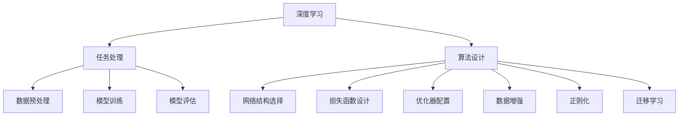
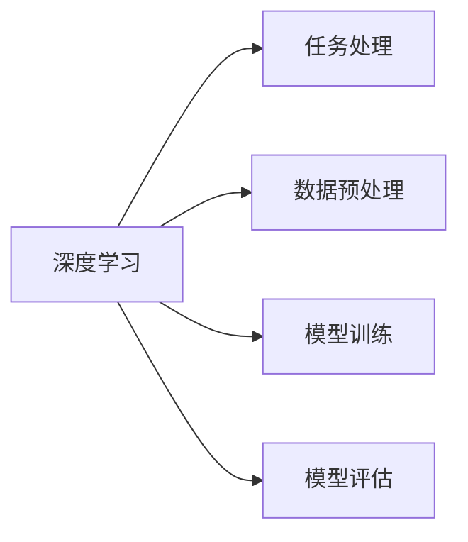
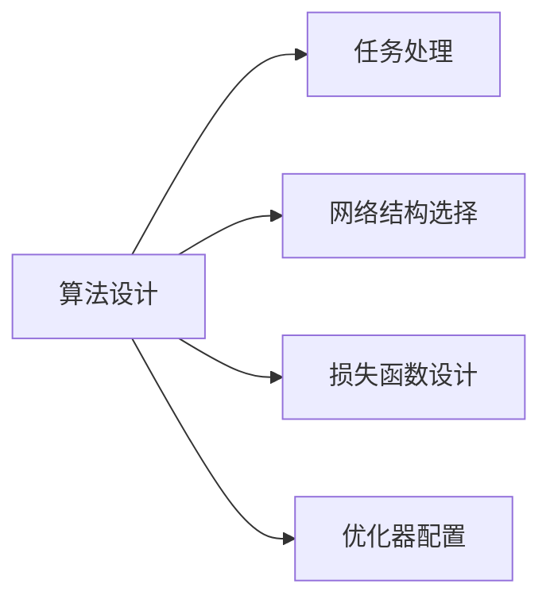
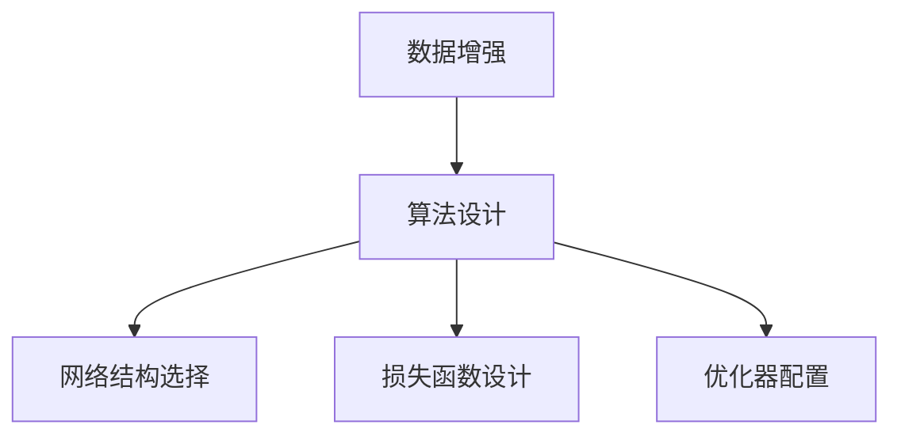
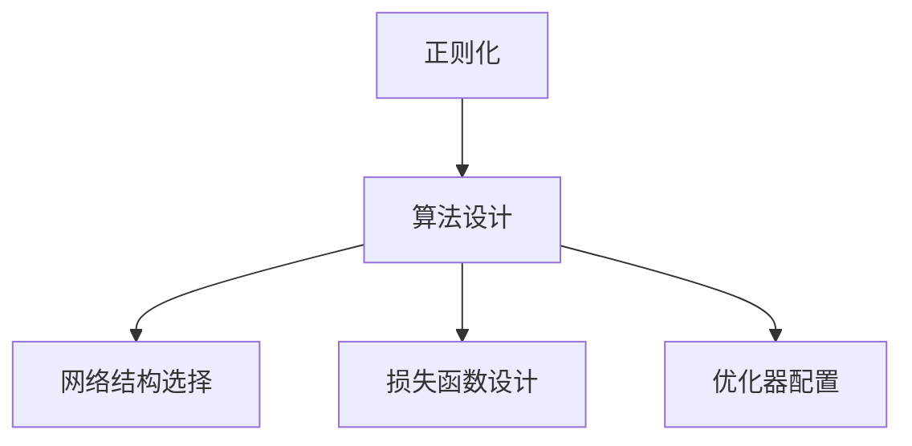
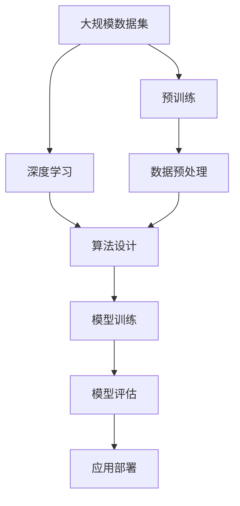

                 

# AI人工智能深度学习算法：设计深度学习任务处理流程

> 关键词：深度学习, 人工智能, 算法设计, 任务处理, 流程优化

## 1. 背景介绍

### 1.1 问题由来
近年来，随着人工智能技术的快速发展，深度学习在多个领域取得了令人瞩目的突破。特别是在计算机视觉、自然语言处理、语音识别等领域，深度学习已经逐渐成为最为有效的工具。然而，尽管深度学习模型在训练数据和计算资源充足的情况下表现出色，但在实际应用中，其复杂度、计算成本和算法调优难度往往限制了其广泛应用。因此，如何在实际任务中高效、准确地设计和使用深度学习算法，成为当下亟待解决的问题。

### 1.2 问题核心关键点
深度学习算法设计的核心在于如何构建合理的网络结构、选择合适的损失函数和优化器，并利用有效的数据增强、正则化、迁移学习等技术，避免过拟合，提高模型的泛化能力。其关键点包括：

1. 网络结构的设计：如何选择合适的网络层数、节点数、激活函数等，是影响模型性能的重要因素。
2. 损失函数的选择：如何设计损失函数，使其既能够准确衡量模型输出与真实标签之间的差异，又能够有效指导模型优化。
3. 优化器配置：如何选择优化器及其参数，确保模型参数的快速收敛，且在全局最优解附近徘徊。
4. 数据增强：如何通过数据增强技术扩充数据集，提升模型的鲁棒性。
5. 正则化：如何在模型训练过程中引入正则化技术，防止模型过拟合。
6. 迁移学习：如何利用已有的预训练模型，快速适应新的任务。

### 1.3 问题研究意义
高效、准确地设计深度学习算法，对于提升AI技术的落地应用、推动行业数字化转型升级具有重要意义：

1. 降低开发成本：合理的算法设计可以显著减少从头训练模型所需的计算资源和时间成本。
2. 提升模型性能：通过科学的设计和调优，深度学习模型能够在特定的任务上取得更优的性能。
3. 加速应用落地：算法设计的合理性直接影响模型的实际应用效果，良好的算法设计能够更快地将AI技术转化为业务价值。
4. 促进技术创新：算法设计的不断优化，推动深度学习技术在更多的领域和场景中得到应用。
5. 赋能产业升级：深度学习算法的广泛应用，可以提升传统行业的数字化水平，实现智能化转型。

## 2. 核心概念与联系

### 2.1 核心概念概述

为更好地理解深度学习任务处理流程，本节将介绍几个密切相关的核心概念：

- 深度学习(Deep Learning)：以神经网络为代表的机器学习技术，通过多层次的特征提取和抽象，解决复杂的模式识别和预测问题。
- 任务处理(Task Handling)：将深度学习算法应用于特定任务的过程，包括数据预处理、模型训练、模型评估等环节。
- 算法设计(Algorithm Design)：深度学习算法的设计过程，包括网络结构选择、损失函数设计、优化器配置等。
- 数据增强(Data Augmentation)：通过对训练数据进行随机变换，生成新的数据样本来扩充数据集，提升模型的泛化能力。
- 正则化(Regularization)：在模型训练过程中引入正则项，防止模型过拟合，提高模型的鲁棒性。
- 迁移学习(Transfer Learning)：将预训练模型的知识迁移到新任务中，减少新任务的数据需求和训练时间。

这些核心概念之间的逻辑关系可以通过以下Mermaid流程图来展示：



这个流程图展示了大语言模型微调过程中各个核心概念的关系：

1. 深度学习提供底层计算模型。
2. 任务处理涵盖数据预处理、模型训练、模型评估等步骤。
3. 算法设计涉及网络结构选择、损失函数设计、优化器配置等技术。
4. 数据增强、正则化、迁移学习等技术用于提升模型性能。

这些核心概念共同构成了深度学习任务处理流程的基础框架，使其能够在各种场景下发挥强大的计算能力和泛化能力。通过理解这些核心概念，我们可以更好地把握深度学习任务处理流程的逻辑结构和应用策略。

### 2.2 概念间的关系

这些核心概念之间存在着紧密的联系，形成了深度学习任务处理流程的完整生态系统。下面我通过几个Mermaid流程图来展示这些概念之间的关系。

#### 2.2.1 深度学习与任务处理的关系



这个流程图展示了深度学习与任务处理的基本关系。深度学习提供计算模型，任务处理则通过数据预处理、模型训练和模型评估等步骤，将这些模型应用于特定任务。

#### 2.2.2 算法设计与任务处理的关系



这个流程图展示了算法设计在任务处理中的作用。算法设计通过选择合适的网络结构、损失函数和优化器，为任务处理提供科学、高效的深度学习模型。

#### 2.2.3 数据增强与算法设计的关联



这个流程图展示了数据增强与算法设计的关系。数据增强通过扩充数据集，提升模型的泛化能力，与算法设计共同作用，优化模型的性能。

#### 2.2.4 正则化与算法设计的结合



这个流程图展示了正则化与算法设计的关系。正则化通过限制模型复杂度，防止模型过拟合，与算法设计共同作用，提高模型的泛化能力和鲁棒性。

#### 2.2.5 迁移学习与任务处理的协同


这个流程图展示了迁移学习与任务处理的关系。迁移学习通过利用预训练模型的知识，快速适应新任务，减少新任务的数据需求和训练时间。

### 2.3 核心概念的整体架构

最后，我们用一个综合的流程图来展示这些核心概念在深度学习任务处理流程中的整体架构：



这个综合流程图展示了从预训练到任务处理的完整过程。深度学习模型首先在大规模数据集上进行预训练，然后通过算法设计进行优化，利用数据增强和正则化技术提升模型性能。最终，通过模型训练和评估，将模型应用于特定任务，并部署到实际应用系统中。通过这些流程图，我们可以更清晰地理解深度学习任务处理流程中各个核心概念的关系和作用，为后续深入讨论具体的任务处理流程奠定基础。

## 3. 核心算法原理 & 具体操作步骤
### 3.1 算法原理概述

深度学习任务处理流程，本质上是一个利用深度学习模型进行任务特定的训练和优化过程。其核心思想是：选择合适的深度学习模型和算法，通过数据预处理、模型训练和模型评估等步骤，使得模型在特定任务上能够达到理想的性能。

形式化地，假设任务 $T$ 的训练集为 $D=\{(x_i,y_i)\}_{i=1}^N, x_i \in \mathcal{X}, y_i \in \mathcal{Y}$，其中 $\mathcal{X}$ 为输入空间，$\mathcal{Y}$ 为输出空间。设深度学习模型为 $M_{\theta}:\mathcal{X} \rightarrow \mathcal{Y}$，其中 $\theta$ 为模型参数。任务处理流程包括数据预处理、模型训练、模型评估等步骤，最终得到适合任务 $T$ 的模型 $M_{\theta^*}$。

通过梯度下降等优化算法，模型不断更新参数 $\theta$，最小化损失函数 $\mathcal{L}(\theta)$，使得模型输出逼近真实标签。由于 $\theta$ 已经通过预训练获得了较好的初始化，因此即便在小规模数据集 $D$ 上进行任务处理，也能较快收敛到理想的模型参数 $\theta^*$。

### 3.2 算法步骤详解

深度学习任务处理流程一般包括以下几个关键步骤：

**Step 1: 数据预处理**

数据预处理是深度学习任务处理流程的基础环节，主要包括以下几个步骤：

1. 数据清洗：删除缺失值、异常值，处理重复记录等。
2. 数据归一化：将数据进行归一化处理，使其在特定范围内。
3. 数据增强：通过随机变换、回译等方式扩充数据集，提升模型的泛化能力。

**Step 2: 模型选择与设计**

模型选择与设计是深度学习任务处理流程的关键步骤，主要包括以下几个方面：

1. 网络结构选择：选择合适的网络层数、节点数、激活函数等，是影响模型性能的重要因素。
2. 损失函数设计：选择合适的损失函数，使其既能够准确衡量模型输出与真实标签之间的差异，又能够有效指导模型优化。
3. 优化器配置：选择合适的优化器及其参数，确保模型参数的快速收敛，且在全局最优解附近徘徊。

**Step 3: 模型训练**

模型训练是深度学习任务处理流程的核心环节，主要包括以下几个步骤：

1. 前向传播：将训练数据输入模型，计算模型的预测输出。
2. 计算损失：根据损失函数计算模型预测输出与真实标签之间的差异。
3. 反向传播：计算损失对模型参数的梯度，更新模型参数。
4. 迭代优化：重复前向传播、计算损失、反向传播等步骤，直至模型收敛。

**Step 4: 模型评估**

模型评估是深度学习任务处理流程的重要环节，主要包括以下几个步骤：

1. 划分数据集：将数据集划分为训练集、验证集和测试集。
2. 计算指标：在测试集上计算模型性能指标，如准确率、精确率、召回率、F1分数等。
3. 调优模型：根据测试集上的性能指标，调整模型参数或算法设置，以提升模型性能。

**Step 5: 应用部署**

应用部署是深度学习任务处理流程的最终环节，主要包括以下几个步骤：

1. 模型优化：对模型进行优化，如裁剪、量化等，减小模型大小，提升推理速度。
2. 模型封装：将模型封装为标准化服务接口，便于集成调用。
3. 部署应用：将模型部署到实际应用系统中，并进行持续监控和调优。

以上是深度学习任务处理流程的一般流程。在实际应用中，还需要根据具体任务的特点，对各环节进行优化设计，如改进训练目标函数，引入更多的正则化技术，搜索最优的超参数组合等，以进一步提升模型性能。

### 3.3 算法优缺点

深度学习任务处理流程具有以下优点：

1. 简单高效。选择合适的算法和模型，能够快速构建适合特定任务的应用系统。
2. 通用适用。适用于各种深度学习任务，如分类、匹配、生成等，设计合适的算法即可实现。
3. 效果显著。在学术界和工业界的诸多任务上，任务处理范式已经刷新了多项最优性能指标。

同时，该方法也存在一定的局限性：

1. 数据需求高。任务处理依赖于高质量的训练数据，数据需求量较大，获取成本较高。
2. 计算成本高。深度学习模型通常具有大量的参数，训练和推理成本较高。
3. 模型可解释性不足。深度学习模型通常缺乏可解释性，难以对其推理逻辑进行分析和调试。
4. 过度拟合风险。模型参数较多时，容易发生过拟合，导致泛化能力不足。

尽管存在这些局限性，但就目前而言，基于任务处理范式仍然是深度学习应用的最主流范式。未来相关研究的重点在于如何进一步降低任务处理对数据和计算资源的需求，提高模型的少样本学习和跨领域迁移能力，同时兼顾可解释性和伦理安全性等因素。

### 3.4 算法应用领域

深度学习任务处理流程在多个领域已经得到了广泛的应用，涵盖几乎所有常见任务，例如：

- 计算机视觉：如图像分类、目标检测、图像分割等。通过训练卷积神经网络，学习图像特征，实现图像处理任务。
- 自然语言处理：如文本分类、命名实体识别、机器翻译等。通过训练循环神经网络或Transformer模型，学习文本表示，实现文本处理任务。
- 语音识别：如语音转文本、说话人识别等。通过训练递归神经网络或Transformer模型，学习语音特征，实现语音处理任务。
- 推荐系统：如个性化推荐、协同过滤等。通过训练神经网络模型，学习用户和物品的交互关系，实现推荐任务。
- 游戏AI：如策略游戏、实时对战等。通过训练深度学习模型，实现智能决策和互动。
- 机器人控制：如自主导航、避障等。通过训练深度学习模型，实现机器人与环境的互动。

除了上述这些经典任务外，深度学习任务处理流程也被创新性地应用到更多场景中，如可控文本生成、常识推理、代码生成、数据增强等，为深度学习技术带来了全新的突破。随着深度学习模型的不断进步，相信深度学习任务处理流程将在更多领域得到应用，为深度学习技术带来更广阔的发展空间。

## 4. 数学模型和公式 & 详细讲解 & 举例说明

### 4.1 数学模型构建

本节将使用数学语言对深度学习任务处理流程进行更加严格的刻画。

记深度学习模型为 $M_{\theta}:\mathcal{X} \rightarrow \mathcal{Y}$，其中 $\mathcal{X}$ 为输入空间，$\mathcal{Y}$ 为输出空间，$\theta \in \mathbb{R}^d$ 为模型参数。假设任务 $T$ 的训练集为 $D=\{(x_i,y_i)\}_{i=1}^N, x_i \in \mathcal{X}, y_i \in \mathcal{Y}$。

定义模型 $M_{\theta}$ 在数据样本 $(x,y)$ 上的损失函数为 $\ell(M_{\theta}(x),y)$，则在数据集 $D$ 上的经验风险为：

$$
\mathcal{L}(\theta) = \frac{1}{N} \sum_{i=1}^N \ell(M_{\theta}(x_i),y_i)
$$

任务处理的目标是最小化经验风险，即找到最优参数：

$$
\theta^* = \mathop{\arg\min}_{\theta} \mathcal{L}(\theta)
$$

在实践中，我们通常使用基于梯度的优化算法（如SGD、Adam等）来近似求解上述最优化问题。设 $\eta$ 为学习率，则参数的更新公式为：

$$
\theta \leftarrow \theta - \eta \nabla_{\theta}\mathcal{L}(\theta)
$$

其中 $\nabla_{\theta}\mathcal{L}(\theta)$ 为损失函数对参数 $\theta$ 的梯度，可通过反向传播算法高效计算。

### 4.2 公式推导过程

以下我们以二分类任务为例，推导交叉熵损失函数及其梯度的计算公式。

假设模型 $M_{\theta}$ 在输入 $x$ 上的输出为 $\hat{y}=M_{\theta}(x) \in [0,1]$，表示样本属于正类的概率。真实标签 $y \in \{0,1\}$。则二分类交叉熵损失函数定义为：

$$
\ell(M_{\theta}(x),y) = -[y\log \hat{y} + (1-y)\log (1-\hat{y})]
$$

将其代入经验风险公式，得：

$$
\mathcal{L}(\theta) = -\frac{1}{N}\sum_{i=1}^N [y_i\log M_{\theta}(x_i)+(1-y_i)\log(1-M_{\theta}(x_i))]
$$

根据链式法则，损失函数对参数 $\theta_k$ 的梯度为：

$$
\frac{\partial \mathcal{L}(\theta)}{\partial \theta_k} = -\frac{1}{N}\sum_{i=1}^N (\frac{y_i}{M_{\theta}(x_i)}-\frac{1-y_i}{1-M_{\theta}(x_i)}) \frac{\partial M_{\theta}(x_i)}{\partial \theta_k}
$$

其中 $\frac{\partial M_{\theta}(x_i)}{\partial \theta_k}$ 可进一步递归展开，利用自动微分技术完成计算。

在得到损失函数的梯度后，即可带入参数更新公式，完成模型的迭代优化。重复上述过程直至收敛，最终得到适应任务 $T$ 的最优模型参数 $\theta^*$。

### 4.3 案例分析与讲解

以图像分类任务为例，展示深度学习任务处理流程的具体实现。

#### 4.3.1 数据预处理

首先，我们需要准备图像数据集，并将其划分为训练集、验证集和测试集。一般要求数据集的分布不要差异过大，以避免模型过拟合。

```python
import os
from PIL import Image
import numpy as np

# 读取图像数据
def read_images(data_dir):
    images = []
    labels = []
    for filename in os.listdir(data_dir):
        if filename.endswith('.jpg'):
            image = Image.open(os.path.join(data_dir, filename))
            images.append(np.array(image))
            labels.append(int(filename.split('_')[0]))
    return images, labels

# 数据增强
from torchvision.transforms import RandomHorizontalFlip, RandomRotation, RandomCrop

def augment_data(data):
    transform = RandomHorizontalFlip(p=0.5) + RandomRotation(degrees=10) + RandomCrop(size=(224, 224))
    data_augmented = []
    for image, label in data:
        image = transform(image)
        data_augmented.append((image, label))
    return data_augmented

# 数据划分
train_data, train_labels = read_images('train')
dev_data, dev_labels = read_images('dev')
test_data, test_labels = read_images('test')

train_data, train_labels = augment_data((train_data, train_labels))
dev_data, dev_labels = augment_data((dev_data, dev_labels))
test_data, test_labels = augment_data((test_data, test_labels))

# 数据归一化
train_data = np.array(train_data) / 255.0
dev_data = np.array(dev_data) / 255.0
test_data = np.array(test_data) / 255.0
```

#### 4.3.2 模型选择与设计

我们选择使用卷积神经网络（Convolutional Neural Network, CNN）进行图像分类任务的处理。具体步骤如下：

1. 构建CNN模型：
```python
import torch.nn as nn
import torch.nn.functional as F

class CNN(nn.Module):
    def __init__(self):
        super(CNN, self).__init__()
        self.conv1 = nn.Conv2d(3, 32, kernel_size=3, stride=1, padding=1)
        self.relu = nn.ReLU()
        self.maxpool = nn.MaxPool2d(kernel_size=2, stride=2)
        self.conv2 = nn.Conv2d(32, 64, kernel_size=3, stride=1, padding=1)
        self.relu = nn.ReLU()
        self.maxpool = nn.MaxPool2d(kernel_size=2, stride=2)
        self.fc1 = nn.Linear(64 * 7 * 7, 256)
        self.relu = nn.ReLU()
        self.fc2 = nn.Linear(256, 10)

    def forward(self, x):
        x = self.conv1(x)
        x = self.relu(x)
        x = self.maxpool(x)
        x = self.conv2(x)
        x = self.relu(x)
        x = self.maxpool(x)
        x = x.view(-1, 64 * 7 * 7)
        x = self.fc1(x)
        x = self.relu(x)
        x = self.fc2(x)
        return x

model = CNN()
```

2. 定义损失函数和优化器：
```python
from torch.nn import CrossEntropyLoss

loss_fn = CrossEntropyLoss()
optimizer = torch.optim.Adam(model.parameters(), lr=0.001)
```

#### 4.3.3 模型训练

使用PyTorch进行模型训练，具体步骤如下：

1. 前向传播：
```python
def forward(model, images, labels):
    outputs = model(images)
    loss = loss_fn(outputs, labels)
    return outputs, loss
```

2. 计算损失和梯度：
```python
for epoch in range(10):
    model.train()
    train_outputs, train_loss = forward(model, train_data, train_labels)
    optimizer.zero_grad()
    train_loss.backward()
    optimizer.step()

    model.eval()
    dev_outputs, dev_loss = forward(model, dev_data, dev_labels)
    test_outputs, test_loss = forward(model, test_data, test_labels)
```

#### 4.3.4 模型评估

使用模型在测试集上评估性能，具体步骤如下：

1. 计算测试集上的指标：
```python
def evaluate(model, images, labels):
    model.eval()
    outputs, loss = forward(model, images, labels)
    _, predicted = torch.max(outputs.data, 1)
    accuracy = (predicted == labels).sum().item() / labels.size(0)
    return accuracy
```

2. 调用评估函数：
```python
test_accuracy = evaluate(model, test_data, test_labels)
print('Test accuracy:', test_accuracy)
```

通过上述代码，我们可以实现深度学习任务处理流程的完整实现。可以看到，利用深度学习模型进行图像分类任务，需要经过数据预处理、模型选择与设计、模型训练、模型评估等多个环节，每个环节都需要科学的设计和优化。

## 5. 项目实践：代码实例和详细解释说明
### 5.1 开发环境搭建

在进行深度学习任务处理流程实践前，我们需要准备好开发环境。以下是使用Python进行PyTorch开发的环境配置流程：

1. 安装Anaconda：从官网下载并安装Anaconda，用于创建独立的Python环境。

2. 创建并激活虚拟环境：
```bash
conda create -n pytorch-env python=3.8 
conda activate pytorch-env
```

3. 安装PyTorch：根据CUDA版本，从官网获取对应的安装命令。例如：
```bash
conda install pytorch torchvision torchaudio cudatoolkit=11.1 -c pytorch -c conda-forge
```

4. 安装各类工具包：
```bash
pip install numpy pandas scikit-learn matplotlib tqdm jupyter notebook ipython
```

完成上述步骤后，即可在`pytorch-env`环境中开始深度学习任务处理流程的实践。

### 5.2 源代码详细实现

下面我们以图像分类任务为例，给出使用PyTorch进行深度学习任务处理流程的PyTorch代码实现。

首先，定义数据预处理函数：

```python
from torchvision import datasets, transforms

# 数据预处理
transform_train = transforms.Compose([
    transforms.RandomCrop(32, padding=4),
    transforms.RandomHorizontalFlip(),
    transforms.ToTensor(),
    transforms.Normalize(mean=[0.485, 0.456, 0.406], std=[0.229, 0.224, 0.225])
])

transform_test = transforms.Compose([
    transforms.ToTensor(),
    transforms.Normalize(mean=[0.485, 0.456, 0.406], std=[0.229, 0.224, 0.225])
])

train_data = datasets.CIFAR10(root='./data', train=True, download=True, transform=transform_train)
test_data = datasets.CIFAR10(root='./data', train=False, download=True, transform=transform_test)
```

然后，定义模型和优化器：

```python
import torch.nn as nn
import torch.nn.functional as F

class CNN(nn.Module):
    def __init__(self):
        super(CNN, self).__init__()
        self.conv1 = nn.Conv2d(3, 32, kernel_size=3, stride=1, padding=1)
        self.relu = nn.ReLU()
        self.maxpool = nn.MaxPool2d(kernel_size=2, stride=2)
        self.conv2 = nn.Conv2d(32, 64, kernel_size=3, stride=1, padding=1)
        self.relu = nn.ReLU()
        self.maxpool = nn.MaxPool2d(kernel_size=2, stride=2)
        self.fc1 = nn.Linear(64 * 7 * 7, 256)
        self.relu = nn.ReLU()
        self.fc2

