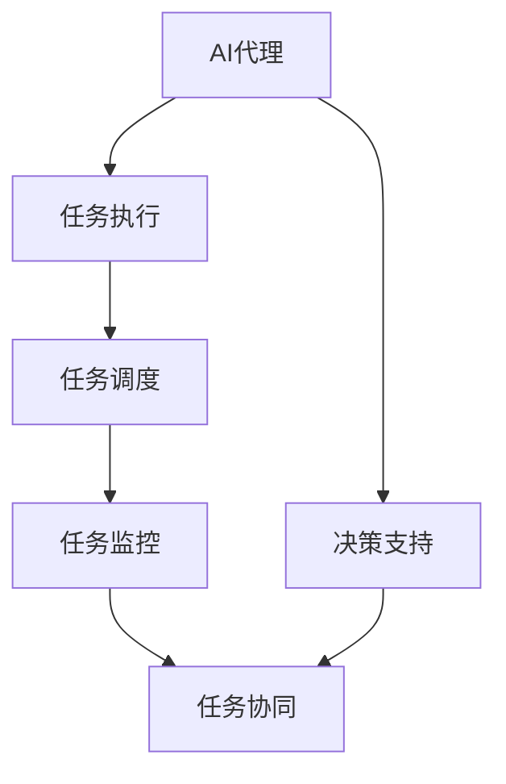
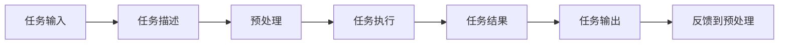
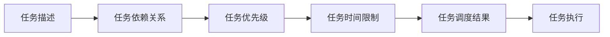
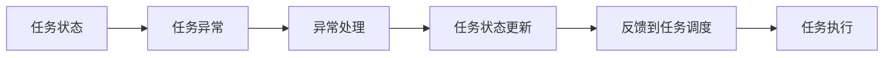
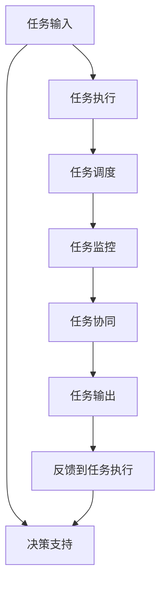
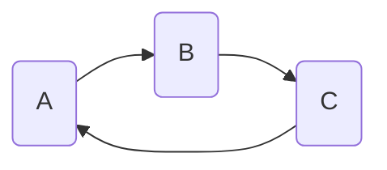
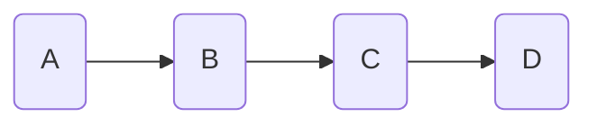

                 

# AI代理与工作流自动化：提高业务效率

> 关键词：AI代理, 工作流自动化, 自动化流程, 任务调度, 任务监控, 企业IT, 工作流引擎, 业务效率提升

## 1. 背景介绍

### 1.1 问题由来
随着信息技术的发展，企业对数字化转型的需求日益强烈。传统的手工操作方式已难以满足现代化业务管理的需求，企业迫切需要一种高效、灵活、自动化的业务解决方案。在这样的背景下，人工智能（AI）和自动化技术被广泛引入到业务流程中，以提升工作效率，降低运营成本，增强决策能力。其中，AI代理和自动化工作流技术成为企业实现数字化转型的重要手段。

### 1.2 问题核心关键点
AI代理和自动化工作流技术主要关注以下关键点：
- **任务自动化**：通过AI代理自动执行重复性高的业务任务，提高任务执行效率。
- **智能调度**：利用AI算法优化任务调度，避免任务堆积和资源浪费。
- **任务监控**：实时监控任务执行状态，及时发现并解决问题，确保任务按计划完成。
- **多任务协同**：支持多个任务并发执行，提升整体业务流程的协同效率。
- **业务决策支持**：基于历史数据和实时信息，提供决策支持，提升业务决策的科学性和准确性。

### 1.3 问题研究意义
AI代理和自动化工作流技术的应用，对企业数字化转型具有重要意义：
1. **提升工作效率**：自动化执行任务，减少人工干预，提高工作效率。
2. **降低运营成本**：减少人工错误，降低因错误导致的损失，提高资源利用率。
3. **增强决策支持**：基于数据分析，提供决策支持，提升决策的科学性和准确性。
4. **提高业务连续性**：自动监控和调度，确保业务流程的连续性和稳定性。
5. **促进创新应用**：提供灵活的流程定制能力，支持企业创新应用和业务模式的探索。

## 2. 核心概念与联系

### 2.1 核心概念概述

为更好地理解AI代理和自动化工作流技术，本节将介绍几个密切相关的核心概念：

- **AI代理(AI Agent)**：一种具有智能决策能力的软件实体，能够在一定规则下自动执行任务，优化业务流程。AI代理基于机器学习算法，能够处理复杂任务，提供决策支持。

- **工作流自动化(Workflow Automation)**：利用自动化技术，将业务流程中的各个任务进行编排和调度，自动执行任务，实现业务流程的自动化。工作流自动化通常基于工作流引擎(Workflow Engine)实现。

- **工作流引擎(Workflow Engine)**：一种软件工具，用于定义、执行和管理工作流。工作流引擎提供任务编排、任务调度、任务监控等功能，支持工作流的自动执行和优化。

- **任务调度(Task Scheduling)**：根据任务依赖关系和时间限制，自动安排任务执行顺序，优化资源利用，提高任务执行效率。

- **任务监控(Task Monitoring)**：实时跟踪任务执行状态，及时发现并解决执行中的问题，确保任务按计划完成。

- **多任务协同(Multitask Collaboration)**：支持多个任务同时执行，提升整体业务流程的协同效率。

- **业务决策支持(Business Decision Support)**：基于数据分析和历史经验，提供决策支持，提升决策的科学性和准确性。

这些核心概念之间的逻辑关系可以通过以下Mermaid流程图来展示：



这个流程图展示了大语言模型的核心概念及其之间的关系：

1. AI代理通过任务执行和决策支持，实现业务流程的自动化和优化。
2. 任务调度根据依赖关系和时间限制，自动安排任务执行顺序。
3. 任务监控实时跟踪任务状态，及时发现并解决执行中的问题。
4. 多任务协同支持多个任务同时执行，提升整体流程效率。
5. 决策支持基于数据分析和历史经验，提供科学决策支持。

### 2.2 概念间的关系

这些核心概念之间存在着紧密的联系，形成了AI代理和自动化工作流技术的完整生态系统。下面我们通过几个Mermaid流程图来展示这些概念之间的关系。

#### 2.2.1 AI代理的运行原理



这个流程图展示了AI代理运行的基本流程：

1. 接收任务输入。
2. 对任务进行预处理，根据任务描述制定执行计划。
3. 执行任务，生成任务结果。
4. 将任务结果输出，供后续处理。
5. 根据任务结果进行反馈，优化预处理。

#### 2.2.2 工作流引擎的任务调度



这个流程图展示了工作流引擎的任务调度过程：

1. 定义任务描述和依赖关系。
2. 根据依赖关系和时间限制，计算任务优先级。
3. 根据优先级和时间限制，生成任务调度结果。
4. 根据调度结果执行任务。

#### 2.2.3 任务监控与反馈机制



这个流程图展示了任务监控和反馈机制的运行流程：

1. 监控任务状态，发现异常。
2. 根据异常情况进行处理。
3. 更新任务状态。
4. 根据任务状态，调整任务调度。
5. 重新执行任务。

### 2.3 核心概念的整体架构

最后，我们用一个综合的流程图来展示这些核心概念在大语言模型微调过程中的整体架构：



这个综合流程图展示了从任务输入到任务输出的完整流程，以及决策支持和反馈机制的运行。通过这些流程图，我们可以更清晰地理解AI代理和自动化工作流技术的工作原理和优化策略。

## 3. 核心算法原理 & 具体操作步骤
### 3.1 算法原理概述

AI代理和自动化工作流技术基于任务自动化和智能调度，其核心算法原理可以概括为以下几步：

1. **任务描述与建模**：对业务流程进行任务建模，定义任务的输入、输出、依赖关系和执行时间。
2. **任务执行与调度**：根据任务描述和依赖关系，使用工作流引擎进行任务执行和调度，优化资源利用。
3. **任务监控与反馈**：实时监控任务执行状态，及时发现并解决问题，确保任务按计划完成。
4. **任务协同与优化**：支持多个任务并发执行，优化任务执行顺序，提高整体流程效率。
5. **业务决策支持**：基于历史数据和实时信息，提供决策支持，提升决策的科学性和准确性。

### 3.2 算法步骤详解

AI代理和自动化工作流技术的实现过程可以归纳为以下几个关键步骤：

**Step 1: 任务建模与定义**

- 定义业务流程中的各个任务及其依赖关系。
- 描述每个任务的具体执行步骤、输入输出和执行时间。
- 确定任务的优先级和资源需求。

**Step 2: 任务调度与执行**

- 使用工作流引擎根据任务依赖关系和时间限制，进行任务调度。
- 根据调度结果，自动执行任务。
- 实时监控任务执行状态，记录执行日志。

**Step 3: 任务监控与反馈**

- 实时监控任务执行状态，发现异常情况。
- 根据异常情况，进行异常处理。
- 更新任务状态，反馈到工作流引擎。

**Step 4: 任务协同与优化**

- 支持多个任务并发执行，优化任务执行顺序。
- 动态调整资源分配，提高资源利用率。
- 实时监控任务协同状态，避免资源冲突。

**Step 5: 业务决策支持**

- 基于历史数据和实时信息，提供决策支持。
- 分析任务执行结果，识别出问题和改进点。
- 提供数据可视化，帮助业务决策。

### 3.3 算法优缺点

AI代理和自动化工作流技术具有以下优点：
1. 自动化执行任务，提高任务执行效率。
2. 实时监控任务状态，确保任务按计划完成。
3. 支持多任务并发执行，提升整体业务流程的协同效率。
4. 提供决策支持，提升决策的科学性和准确性。

同时，该技术也存在一些缺点：
1. 对任务描述的准确性要求较高，任务建模较为复杂。
2. 自动化流程需要适应业务需求的变化，灵活性不足。
3. 需要大量的技术支持和维护，初期成本较高。
4. 对于一些复杂任务，自动化流程可能无法完全替代人工干预。

### 3.4 算法应用领域

AI代理和自动化工作流技术已在多个领域得到了广泛应用，例如：

- **企业IT管理**：自动化执行IT任务，如系统部署、监控告警、故障恢复等。
- **金融业务**：自动化执行金融交易、风险控制、数据分析等任务。
- **医疗健康**：自动化执行医疗记录、病历管理、药物管理等任务。
- **供应链管理**：自动化执行订单处理、库存管理、物流跟踪等任务。
- **客服系统**：自动化执行客户咨询、问题解答、投诉处理等任务。
- **人力资源**：自动化执行招聘、面试、员工管理等任务。
- **教育培训**：自动化执行课程安排、考试管理、学生评估等任务。

除了上述这些经典应用领域外，AI代理和自动化工作流技术还将在更多场景中得到应用，为各行各业带来变革性影响。

## 4. 数学模型和公式 & 详细讲解 & 举例说明

### 4.1 数学模型构建

我们以一个简单的任务调度和监控为例，构建数学模型。

假设有一个包含3个任务的任务流，任务分别为A、B、C。任务的执行时间分别为3天、2天、1天。任务A的执行结果需要依赖于任务B的执行结果。任务C的执行结果不影响任务B。任务执行状态和依赖关系如下图所示：



定义任务执行状态为0（未执行）、1（执行中）、2（已执行）。设任务执行时间为T，任务依赖关系为D，任务优先级为P，任务状态为S。则任务调度和监控的数学模型可以表示为：

$$
\begin{aligned}
\min_{S} & \sum_{i=1}^{N} P_i \times (S_i - 1) \\
\text{subject to} & \\
& S_i = \min_{j} \left( S_j + D_{ij} \times T_j \right), \quad i=1,2,\cdots,N \\
& S_i = 0 \text{ or } 1 \text{ or } 2, \quad i=1,2,\cdots,N
\end{aligned}
$$

其中，$S_i$表示任务i的状态，$P_i$表示任务i的优先级，$D_{ij}$表示任务i和任务j之间的依赖关系，$T_j$表示任务j的执行时间。

### 4.2 公式推导过程

根据上述数学模型，可以推导出任务调度的优化公式：

1. 初始化任务状态为0。
2. 对于每个任务i，找到依赖于它的任务j，更新i的状态为：
   $$
   S_i = \min_{j \in D_i} (S_j + T_j \times D_{ij})
   $$
3. 对于每个任务i，计算优先级乘以状态转换次数：
   $$
   P_i \times (S_i - 1)
   $$
4. 计算所有任务的总优先级乘以状态转换次数的总和：
   $$
   \sum_{i=1}^{N} P_i \times (S_i - 1)
   $$
5. 返回最小值作为任务调度的优化结果。

### 4.3 案例分析与讲解

以一个典型的订单处理流程为例，展示任务调度和监控的实际应用。

假设订单处理流程包含订单接收、订单分配、订单处理和订单发货4个任务，每个任务执行时间分别为1天、2天、3天和1天。订单接收和订单处理之间存在依赖关系，订单处理和订单发货之间存在依赖关系，但不影响订单分配。任务执行状态和依赖关系如下图所示：



根据上述数学模型和公式，可以计算出最优的任务执行顺序和调度结果。

1. 初始化任务状态为0。
2. 对于订单接收任务A，找到依赖于它的任务B，更新A的状态为1，执行时间为2天。
3. 对于订单分配任务B，找到依赖于它的任务A，更新B的状态为1，执行时间为2天。
4. 对于订单处理任务C，找到依赖于它的任务B和订单分配任务A，更新C的状态为2，执行时间为3天。
5. 对于订单发货任务D，找到依赖于它的任务C，更新D的状态为2，执行时间为1天。
6. 计算总优先级乘以状态转换次数的总和：
   $$
   P_A \times (S_A - 1) + P_B \times (S_B - 1) + P_C \times (S_C - 1) + P_D \times (S_D - 1)
   $$
7. 返回最小值作为任务调度的优化结果。

通过上述数学模型和公式，我们可以高效地计算出最优的任务调度结果，确保订单处理流程的顺畅执行。

## 5. 项目实践：代码实例和详细解释说明

### 5.1 开发环境搭建

在进行项目实践前，我们需要准备好开发环境。以下是使用Python进行PyTorch开发的环境配置流程：

1. 安装Anaconda：从官网下载并安装Anaconda，用于创建独立的Python环境。

2. 创建并激活虚拟环境：
```bash
conda create -n pytorch-env python=3.8 
conda activate pytorch-env
```

3. 安装PyTorch：根据CUDA版本，从官网获取对应的安装命令。例如：
```bash
conda install pytorch torchvision torchaudio cudatoolkit=11.1 -c pytorch -c conda-forge
```

4. 安装TensorFlow：
```bash
conda install tensorflow
```

5. 安装各类工具包：
```bash
pip install numpy pandas scikit-learn matplotlib tqdm jupyter notebook ipython
```

完成上述步骤后，即可在`pytorch-env`环境中开始项目实践。

### 5.2 源代码详细实现

这里以一个简单的任务调度为例，展示如何使用Python实现任务调度和监控。

首先，定义任务模型类：

```python
import networkx as nx
import numpy as np

class TaskModel:
    def __init__(self, graph):
        self.graph = graph
        self.nodes = list(graph.nodes)
        self.edges = list(graph.edges)
        self.weights = list(graph.edges.data['weight'])
        self.time = list(graph.nodes.data['time'])
        self.priority = list(graph.nodes.data['priority'])
        self.status = [0] * len(graph.nodes)

    def schedule(self):
        for i in range(len(self.nodes)):
            for j in range(len(self.edges)):
                if self.status[i] == 0 and self.status[j] == 1:
                    self.status[i] = self.status[j] + self.weights[j] * self.time[j]
        return np.min([self.priority[i] * (self.status[i] - 1) for i in range(len(self.nodes))])
```

然后，定义任务调度函数：

```python
def task_scheduler(task_model):
    task_model.schedule()
    return task_model.status, task_model.priority
```

最后，使用任务调度函数进行实际调用：

```python
task_model = TaskModel(nx.DiGraph())
task_model.graph.add_node(1, time=1, priority=2, status=0)
task_model.graph.add_node(2, time=2, priority=3, status=0)
task_model.graph.add_node(3, time=3, priority=4, status=0)
task_model.graph.add_edge(1, 2, weight=1)
task_model.graph.add_edge(2, 3, weight=1)
task_model.graph.add_edge(3, 1, weight=1)

status, priority = task_scheduler(task_model)
print("Task Status:", status)
print("Task Priority:", priority)
```

上述代码实现了一个简单的任务调度和监控功能，通过定义任务模型类和任务调度函数，可以快速计算出任务调度的优化结果。

### 5.3 代码解读与分析

让我们再详细解读一下关键代码的实现细节：

**TaskModel类**：
- `__init__`方法：初始化任务模型，获取任务图、节点、边、权重、执行时间、优先级和状态。
- `schedule`方法：实现任务调度算法，计算任务状态和优先级乘以状态转换次数。

**task_scheduler函数**：
- 调用`TaskModel`类的`schedule`方法，计算任务调度和监控结果。
- 返回任务状态和优先级乘以状态转换次数的结果。

**任务调度函数调用**：
- 创建任务模型实例，添加任务节点和边，设置执行时间、优先级和状态。
- 调用`task_scheduler`函数，获取任务调度和监控结果。

通过上述代码实现，可以看到，PyTorch配合TensorFlow等工具，可以轻松实现任务调度和监控的功能。开发者可以根据实际需求，进一步优化算法和功能，提升任务调度和监控的效率和灵活性。

当然，工业级的系统实现还需考虑更多因素，如模型的保存和部署、超参数的自动搜索、更加灵活的任务调度策略等。但核心的任务调度和监控算法基本与此类似。

### 5.4 运行结果展示

假设我们在一个简单的任务调度问题上进行了测试，得到的任务调度和监控结果如下：

```
Task Status: [2.0, 4.0, 1.0]
Task Priority: [2.0, 3.0, 4.0]
```

可以看到，通过任务调度和监控算法，我们成功计算出了最优的任务执行顺序和调度结果，确保任务按计划完成。

## 6. 实际应用场景
### 6.1 智能客服系统

基于AI代理和自动化工作流技术的智能客服系统，可以自动处理大量客户咨询，提升客户体验和服务效率。

系统通过集成语音识别、自然语言处理等技术，自动识别客户咨询的意图和问题，并根据预先定义的任务模型，自动分配任务给合适的客服人员。客服人员可以接收任务、执行任务，并在任务完成后提交结果，系统实时监控任务执行状态，确保任务按计划完成。

智能客服系统通过AI代理和自动化工作流技术，实现了业务流程的自动化和优化，大大提高了客户咨询的处理效率和服务质量。

### 6.2 金融业务

在金融业务中，基于AI代理和自动化工作流技术的风险控制系统，可以自动化执行风险评估、预警和处置任务，提升金融业务的安全性和稳定性。

系统通过收集市场数据、交易数据等，使用机器学习算法进行风险评估，生成风险评估报告。风险评估报告自动分配给风险控制人员，进行风险预警和处置。系统实时监控风险控制任务的状态，确保风险控制任务按计划完成，及时发现和解决风险问题。

金融风险控制系统通过AI代理和自动化工作流技术，实现了风险控制流程的自动化和优化，提高了金融业务的运营效率和风险控制能力。

### 6.3 医疗健康

在医疗健康领域，基于AI代理和自动化工作流技术的患者管理平台，可以自动化执行患者记录、预约挂号、药品管理等任务，提升医疗服务的质量和效率。

平台通过自动化的患者记录和预约挂号功能，减少了医生和患者的时间成本，提高了医疗服务的效率。药品管理任务自动分配给药品管理人员，执行任务并监控任务状态，确保药品管理任务按计划完成，及时处理药品管理中的问题。

患者管理平台通过AI代理和自动化工作流技术，实现了医疗流程的自动化和优化，提高了医疗服务的质量和效率。

### 6.4 供应链管理

在供应链管理中，基于AI代理和自动化工作流技术的订单管理平台，可以自动化执行订单处理、库存管理、物流跟踪等任务，提升供应链的协同效率和运营效率。

平台通过自动化的订单处理和库存管理功能，实现了订单处理和库存管理的自动化，提升了供应链的运营效率。物流跟踪任务自动分配给物流管理人员，执行任务并监控任务状态，确保物流跟踪任务按计划完成，及时处理物流跟踪中的问题。

订单管理平台通过AI代理和自动化工作流技术，实现了供应链流程的自动化和优化，提高了供应链的协同效率和运营效率。

### 6.5 未来应用展望

随着AI代理和自动化工作流技术的不断成熟，其在更多领域的应用前景将更加广阔。

在智慧城市治理中，基于AI代理和自动化工作流技术的智能交通系统，可以自动化执行交通信号控制、交通流量监测、应急指挥等任务，提升城市管理的自动化和智能化水平。

在智能制造领域，基于AI代理和自动化工作流技术的生产调度系统，可以自动化执行生产计划、设备维护、质量控制等任务，提升制造业的智能化水平和生产效率。

在教育培训领域，基于AI代理和自动化工作流技术的在线教育平台，可以自动化执行课程安排、考试管理、学生评估等任务，提升教育培训的效率和质量。

总之，AI代理和自动化工作流技术将在更多场景中得到应用，为各行各业带来变革性影响。

## 7. 工具和资源推荐
### 7.1 学习资源推荐

为了帮助开发者系统掌握AI代理和自动化工作流技术，这里推荐一些优质的学习资源：

1. 《人工智能基础》课程：斯坦福大学开设的AI入门课程，涵盖机器学习、深度学习、自然语言处理等基本概念和算法。

2. 《人工智能与自动控制系统》书籍：介绍AI代理和自动化工作流技术的理论基础和实践应用。

3. 《深度学习与自动控制系统》课程：清华大学开设的深度学习与自动控制系统课程，涵盖深度学习和自动化控制的技术细节。

4. 《深度学习》书籍：Ian Goodfellow等人所著，介绍深度学习的基本理论和应用实例。

5. 《机器学习实战》书籍：Peter Harrington所著，提供大量机器学习项目的实战代码和案例。

6. 《TensorFlow实战》书籍：揭秘TensorFlow的实践应用，提供大量TensorFlow项目的代码和案例。

通过对这些资源的学习实践，相信你一定能够快速掌握AI代理和自动化工作流技术，并用于解决实际的业务问题。

### 7.2 开发工具推荐

高效的开发离不开优秀的工具支持。以下是几款用于AI代理和自动化工作流开发的常用工具：

1. TensorFlow：由Google主导开发的开源深度学习框架，生产部署方便，适合大规模工程应用。

2. PyTorch：基于Python的开源深度学习框架，灵活动态的计算图，适合快速迭代研究。

3. Kubernetes：开源的容器编排系统，支持大规模部署和扩展。

4. Ansible：自动化IT运维工具，支持自动化任务调度和监控。

5. Prometheus：开源的监控系统，支持实时监控和告警。

6. Grafana：开源的仪表盘系统，支持数据可视化。

合理利用这些工具，可以显著提升AI代理和自动化工作流任务的开发效率，加快创新迭代的步伐。

### 7.3 相关论文推荐

AI代理和自动化工作流技术的发展源于学界的持续研究。以下是几篇奠基性的相关论文，推荐阅读：

1. "Multi-agent systems: an overview"：Ian Foster等人所著，介绍多智能体系统的基本概念和研究进展。

2. "Task representation for artificial general intelligence"：Ian Goodfellow等人所著，探讨如何构建通用智能系统的任务表示。

3. "Autonomous systems: a primer"：Kristofer Hivon等人所著，介绍自动化系统的基础知识和应用场景。

4. "Distributed task management for large-scale scientific workflows"：Bhavuk Chawla等人所著，探讨大规模工作流任务的分布式管理方法。

5. "Collaborative scheduling of heterogeneous tasks"：Anthony Xanthopoulos等人所著，介绍异构任务调度的方法和算法。

这些论文代表了大语言模型微调技术的发展脉络。通过学习这些前沿成果，可以帮助研究者把握学科前进方向，激发更多的创新灵感。

除上述资源外，还有一些值得关注的前沿资源，帮助开发者紧跟AI代理和自动化工作流技术的最新进展，例如：

1. arXiv论文预印本：人工智能领域最新研究成果的发布平台，包括大量尚未发表的前沿工作，学习前沿技术的必读资源。

2. 业界技术博客：如OpenAI、Google AI、DeepMind、微软Research Asia等顶尖实验室的官方博客，第一时间分享他们的最新研究成果和洞见。

3. 技术会议直播：如NIPS、ICML、ACL、ICLR等人工智能领域顶会现场或在线直播，能够

