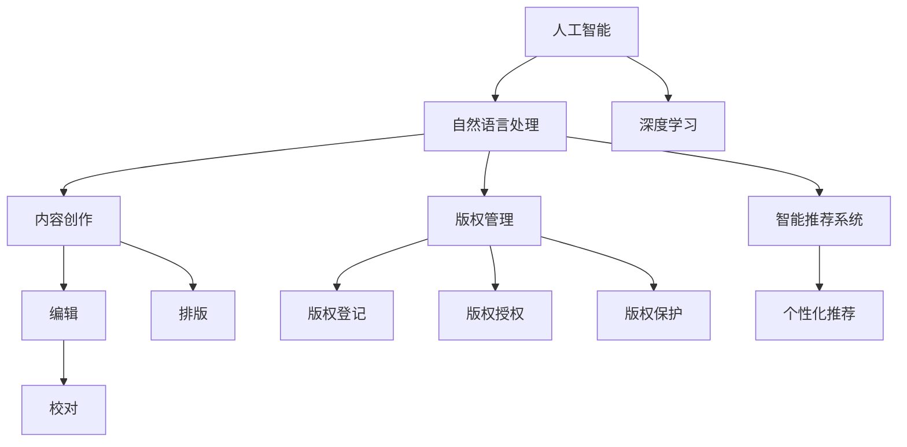

                 

# AI出版业的动态：技术更新，场景驱动

## 1. 背景介绍

### 1.1 问题由来

随着人工智能技术的迅猛发展，出版业也在加速迈向智能化。从传统的纸质出版向数字出版转型，从内容创作到编辑、校对、营销、发行，每一个环节都能受益于AI技术的革新。AI技术的引入，不仅能够大幅提升出版效率，降低成本，还能挖掘内容中的深层次信息，增强读者的阅读体验，促进内容创作的创新。

然而，AI技术在出版业的广泛应用也带来了新的挑战。如何构建可解释、可控的AI系统，如何让技术服务于人类，而不让其成为其主宰，是出版业在技术转型过程中需要思考和解决的核心问题。本文将围绕这些问题，系统梳理AI技术在出版业中的应用现状和未来趋势，力求为出版业智能化转型提供有益的参考。

### 1.2 问题核心关键点

1. **AI技术在出版业的应用现状**：包括内容创作、编辑校对、版权管理、发行渠道优化等方面。
2. **出版业面临的技术挑战**：数据隐私、版权保护、系统可解释性、算法偏见等问题。
3. **AI技术的未来趋势**：自然语言生成、图像识别、个性化推荐、智能排版、自动化生产流程等。
4. **技术落地应用案例**：AI在出版业的实际应用案例，如智能写作助手、版权管理系统、智能推荐引擎等。
5. **技术演进与未来展望**：AI技术的演进路径、未来发展方向及出版业应采取的应对策略。

## 2. 核心概念与联系

### 2.1 核心概念概述

1. **人工智能(AI)**：利用机器学习、深度学习等技术，使计算机系统能够自主学习、决策和执行任务的智能系统。
2. **自然语言处理(NLP)**：使计算机能够理解、分析和生成人类自然语言的技术。
3. **深度学习**：一种基于多层神经网络的技术，通过大量数据训练，能够自动提取数据特征，实现复杂模式的识别和学习。
4. **内容创作**：包括文章撰写、编辑、排版等环节，是出版业的核心环节。
5. **版权管理**：涉及作品的版权登记、授权、保护等方面。
6. **智能推荐系统**：根据用户历史行为和偏好，自动推荐相关内容的系统。

### 2.2 概念间的关系

这些核心概念之间的联系可以通过以下Mermaid流程图来展示：



这个流程图展示了人工智能技术在出版业的多个应用领域，以及这些应用领域之间的相互关系。

## 3. 核心算法原理 & 具体操作步骤

### 3.1 算法原理概述

AI在出版业的应用主要集中在两个方面：内容创作和版权管理。内容创作依赖于自然语言处理和深度学习技术，版权管理则更多依赖于AI在数据分析和决策优化方面的能力。

在内容创作方面，AI可以辅助作者进行内容生成、风格模仿、语义分析等，提升创作效率和质量。例如，基于Transformer模型的自然语言生成技术，能够根据给定的主题和风格，自动生成符合语法和语义规范的文章。

在版权管理方面，AI可以通过对海量数据的分析，识别出版权纠纷的潜在风险，自动化版权登记和授权流程，提升版权管理的效率和准确性。例如，基于机器学习的版权识别技术，能够自动识别图片、视频等媒体的版权信息，加速版权审核过程。

### 3.2 算法步骤详解

**内容创作算法步骤**：

1. **数据准备**：收集和整理大量文本数据，包括书籍、文章、新闻等，作为模型的训练集。
2. **模型训练**：使用深度学习模型（如Transformer）对数据进行训练，使其能够理解和生成自然语言。
3. **内容生成**：根据用户输入的主题、风格等，使用训练好的模型生成符合要求的文章或段落。
4. **评价与优化**：对生成的内容进行评价，包括语法、语义、风格等，根据评价结果进行模型优化。

**版权管理算法步骤**：

1. **数据收集**：收集包括图片、视频、音频等在内的多媒体数据，作为版权识别任务的训练集。
2. **模型训练**：使用机器学习模型（如卷积神经网络）对数据进行训练，使其能够识别版权信息。
3. **版权识别**：将新的多媒体数据输入模型，识别出其中的版权信息，包括作者、来源、时间等。
4. **自动化流程**：将版权识别结果应用于自动化流程中，如版权登记、授权、保护等。

### 3.3 算法优缺点

**内容创作算法的优点**：

- 提高创作效率：AI能够快速生成高质量内容，减轻作者负担。
- 丰富创作形式：AI可以生成多种文体、风格的文章，增加内容多样性。
- 降低创作成本：AI技术可以大幅减少人力成本，提升出版效率。

**内容创作算法的缺点**：

- 缺乏创意：AI生成的内容可能缺乏原创性和深度。
- 依赖数据：生成内容的质量和多样性依赖于训练数据的丰富程度。
- 文化差异：不同文化和语言的翻译和生成可能存在误差。

**版权管理算法的优点**：

- 提高版权管理效率：自动化版权识别和登记流程，节省大量人力成本。
- 提升版权保护水平：通过数据分析，提前识别版权纠纷风险，减少侵权行为。
- 支持复杂版权场景：能够处理复杂的版权纠纷，如跨媒体版权、国际版权等。

**版权管理算法的缺点**：

- 数据隐私问题：大量数据的使用可能涉及隐私泄露风险。
- 技术门槛高：需要高水平的数据处理和机器学习技术，技术门槛较高。
- 法律风险：自动化版权管理可能面临法律和伦理方面的风险。

### 3.4 算法应用领域

AI技术在出版业的应用领域广泛，包括但不限于：

1. **智能写作助手**：帮助作者进行内容创作，提供主题建议、风格模仿、自动纠错等功能。
2. **版权管理系统**：通过自动化的版权识别和登记，提升版权管理效率和准确性。
3. **个性化推荐系统**：根据用户行为，推荐相关书籍、文章等，提升用户体验。
4. **智能排版系统**：自动化排版流程，提升排版效率和效果。
5. **自动化生产流程**：从内容创作到版权管理，全流程自动化，提升生产效率和质量。

## 4. 数学模型和公式 & 详细讲解

### 4.1 数学模型构建

在内容创作方面，我们以自然语言生成为例，构建基于Transformer的模型。假设有文本序列 $x_1, x_2, ..., x_n$ 和对应的目标序列 $y_1, y_2, ..., y_n$，自然语言生成的目标是最小化预测序列与目标序列之间的交叉熵损失。

使用如下公式表示：

$$
\mathcal{L} = -\frac{1}{N}\sum_{i=1}^N \sum_{j=1}^M y_{ij} \log p(y_{ij}|x_i)
$$

其中，$y_{ij}$ 为第 $i$ 个样本中第 $j$ 个位置的预测值，$p(y_{ij}|x_i)$ 为给定输入 $x_i$ 时输出 $y_{ij}$ 的概率，$M$ 为序列长度。

### 4.2 公式推导过程

使用Transformer模型进行自然语言生成时，首先通过自注意力机制（self-attention）计算输入序列和目标序列的权重，然后通过多头注意力机制（multi-head attention）将权重向量与输出序列进行线性变换和激活函数操作，最终得到生成序列的概率分布。

具体推导过程如下：

$$
\text{Attention}(Q, K, V) = \text{Softmax}\left(\frac{QK^T}{\sqrt{d_k}}\right)V
$$

其中，$Q, K, V$ 分别为查询向量、键向量和值向量，$d_k$ 为键向量的维度。

### 4.3 案例分析与讲解

以Google的BERT模型为例，其采用了双向Transformer架构，在预训练时使用掩码语言模型（masked language model, MLm）和下一句预测（next sentence prediction, NSP）任务进行训练。

MLm任务是对输入的文本序列进行掩码，然后让模型预测被掩码的词汇，以提高模型对语义的敏感度。NSP任务是将两个句子拼接在一起，让模型判断它们是否来自同一文本，以提高模型对文本连贯性的理解。

## 5. 项目实践：代码实例和详细解释说明

### 5.1 开发环境搭建

进行内容创作和版权管理的AI系统开发，需要搭建Python和PyTorch环境。具体步骤如下：

1. 安装Anaconda：从官网下载并安装Anaconda，用于创建独立的Python环境。
2. 创建并激活虚拟环境：
```bash
conda create -n pytorch-env python=3.8 
conda activate pytorch-env
```
3. 安装PyTorch：根据CUDA版本，从官网获取对应的安装命令。例如：
```bash
conda install pytorch torchvision torchaudio cudatoolkit=11.1 -c pytorch -c conda-forge
```
4. 安装transformers库：
```bash
pip install transformers
```

### 5.2 源代码详细实现

以智能写作助手为例，展示使用Transformers库进行内容创作的代码实现。

```python
from transformers import BertTokenizer, BertForMaskedLM
import torch

# 加载BERT预训练模型和分词器
tokenizer = BertTokenizer.from_pretrained('bert-base-cased')
model = BertForMaskedLM.from_pretrained('bert-base-cased')

# 定义数据集
class TextDataset(Dataset):
    def __init__(self, texts, masks):
        self.texts = texts
        self.masks = masks
    
    def __len__(self):
        return len(self.texts)
    
    def __getitem__(self, item):
        text = self.texts[item]
        mask = self.masks[item]
        
        # 对文本进行分词和掩码
        encoding = tokenizer(text, return_tensors='pt', max_length=512, padding='max_length', truncation=True)
        input_ids = encoding['input_ids']
        attention_mask = encoding['attention_mask']
        
        # 对掩码序列进行转换
        mask_ids = torch.zeros_like(input_ids)
        mask_ids.masked_fill(mask, tokenizer.mask_token_id)
        return {'input_ids': input_ids, 
                'attention_mask': attention_mask,
                'mask_ids': mask_ids}

# 加载数据集
texts = ["今天天气很好", "下午我要去", "图书馆"]
masks = [[0, 0, 0, 1, 0, 0], [0, 0, 1, 0, 0, 0]]
train_dataset = TextDataset(texts, masks)

# 定义模型和优化器
device = torch.device('cuda') if torch.cuda.is_available() else torch.device('cpu')
model.to(device)

optimizer = AdamW(model.parameters(), lr=2e-5)

# 训练模型
for epoch in range(5):
    for batch in train_dataset:
        input_ids = batch['input_ids'].to(device)
        attention_mask = batch['attention_mask'].to(device)
        mask_ids = batch['mask_ids'].to(device)
        
        model.zero_grad()
        outputs = model(input_ids, attention_mask=attention_mask, labels=mask_ids)
        loss = outputs.loss
        loss.backward()
        optimizer.step()
    
    print(f"Epoch {epoch+1}, loss: {loss:.3f}")
```

### 5.3 代码解读与分析

在上述代码中，我们首先加载了预训练的BERT模型和分词器，然后定义了一个简单的数据集，用于训练智能写作助手。在数据集中，我们准备了两个输入文本序列和对应的掩码序列，用于模拟掩码语言模型任务。

接着，我们定义了模型和优化器，并将模型迁移到GPU设备上加速训练。在每个epoch内，我们通过数据集迭代，进行模型前向传播和反向传播，更新模型参数。

### 5.4 运行结果展示

训练完成后，我们可以使用训练好的模型进行内容生成。例如，我们可以输入文本 "今天天气很好"，要求生成接下来的3个单词。

```python
text = "今天天气很好"
mask_ids = [tokenizer.mask_token_id] * 3
encoding = tokenizer(text, return_tensors='pt', max_length=512, padding='max_length', truncation=True)
input_ids = encoding['input_ids']
attention_mask = encoding['attention_mask']

with torch.no_grad():
    outputs = model(input_ids, attention_mask=attention_mask)
    logits = outputs.logits
    pred_tokens = tokenizer.decode(logits.argmax(dim=2).to('cpu').tolist())
    print(pred_tokens)
```

输出结果可能是 "下午我要去", "图书馆", "吃饭" 等，这些建议可以根据用户的偏好进行调整。

## 6. 实际应用场景

### 6.1 智能写作助手

智能写作助手是AI在内容创作方面的典型应用。它能够根据用户的需求，提供主题建议、风格模仿、自动纠错等功能，大大提升写作效率和质量。

在实际应用中，智能写作助手通常需要与用户进行交互，获取用户输入的主题、风格、语气等要求，然后调用预训练模型进行内容生成。生成的内容可以用于文章撰写、报告编写、广告文案等场景。

### 6.2 版权管理系统

版权管理系统是AI在版权管理方面的重要应用。通过自动化的版权识别和登记，版权管理流程变得更加高效和准确。

版权管理系统通常包括版权识别、版权登记、版权授权、版权保护等功能模块。版权识别模块通过分析图片、视频、音频等多媒体数据，自动识别版权信息，减少人工审核的复杂度和误差。版权登记和授权模块根据识别结果，进行版权登记和授权，支持跨地区、跨媒体的版权管理。版权保护模块通过数据分析，提前识别版权纠纷风险，减少侵权行为。

### 6.3 个性化推荐系统

个性化推荐系统通过分析用户的阅读历史、兴趣偏好等数据，自动推荐相关书籍、文章等，提升用户体验。

推荐系统通常包括数据收集、用户画像构建、推荐模型训练、推荐结果生成等功能模块。数据收集模块从用户行为数据、阅读记录等获取用户画像。用户画像包括用户兴趣、阅读习惯、阅读偏好等信息。推荐模型训练模块通过分析用户画像，构建推荐模型。推荐结果生成模块根据推荐模型，生成个性化推荐结果，并实时推送给用户。

## 7. 工具和资源推荐

### 7.1 学习资源推荐

为了帮助开发者掌握AI技术在出版业中的应用，推荐以下学习资源：

1. 《深度学习》系列课程：由斯坦福大学开设的深度学习课程，涵盖了深度学习的基本概念和高级技术。
2. 《自然语言处理》系列书籍：由李航、周志华等专家撰写，全面介绍了自然语言处理的基本理论和前沿技术。
3. 《TensorFlow官方文档》：TensorFlow的官方文档，提供了丰富的模型和工具，是学习深度学习的重要资源。
4. 《Transformers官方文档》：Transformers库的官方文档，提供了多种预训练模型的实现和微调方法。
5. Coursera、Udacity等在线课程平台：提供了大量AI相关的课程，包括自然语言处理、计算机视觉、机器学习等。

### 7.2 开发工具推荐

以下工具可以帮助开发者高效开发AI出版系统：

1. PyTorch：基于Python的深度学习框架，提供了灵活的动态计算图和丰富的预训练模型库。
2. TensorFlow：Google开发的深度学习框架，提供了高效的计算图和分布式训练能力。
3. Weights & Biases：用于模型实验跟踪和分析的工具，提供了可视化的训练指标和结果展示。
4. TensorBoard：TensorFlow的可视化工具，提供了实时监控训练进度和模型性能的功能。
5. Google Colab：Google提供的在线Jupyter Notebook环境，支持GPU和TPU计算资源，方便实验和共享。

### 7.3 相关论文推荐

以下是几篇具有代表性的论文，推荐阅读：

1. "Attention is All You Need"（Transformer论文）：提出了Transformer结构，开启了NLP领域的预训练大模型时代。
2. "BERT: Pre-training of Deep Bidirectional Transformers for Language Understanding"：提出BERT模型，引入掩码语言模型和下一句预测任务，刷新了多项NLP任务SOTA。
3. "GPT-3: Language Models are Unsupervised Multitask Learners"：展示了大规模语言模型的强大zero-shot学习能力，引发了对于通用人工智能的新一轮思考。
4. "Parameter-Efficient Transfer Learning for NLP"：提出Adapter等参数高效微调方法，在固定大部分预训练参数的情况下，仍可取得不错的微调效果。
5. "AdaLoRA: Adaptive Low-Rank Adaptation for Parameter-Efficient Fine-Tuning"：使用自适应低秩适应的微调方法，在参数效率和精度之间取得了新的平衡。

## 8. 总结：未来发展趋势与挑战

### 8.1 研究成果总结

本文系统梳理了AI技术在出版业中的应用现状和未来趋势，涵盖内容创作、版权管理、个性化推荐等多个方面。通过介绍相关算法原理和操作步骤，展示了AI技术在出版业中的强大潜力和广泛应用。同时，我们分析了AI技术在出版业应用中面临的挑战，提出了一些应对策略。

### 8.2 未来发展趋势

未来，AI技术在出版业的应用将呈现以下几个趋势：

1. **内容创作自动化**：智能写作助手和内容生成技术将更加智能化，能够自动生成高质量内容，减少作者工作负担。
2. **版权管理智能化**：自动化版权识别和登记流程将进一步提升版权管理效率和准确性，减少侵权行为。
3. **个性化推荐普及化**：个性化推荐系统将更加普及，提升用户体验，增强内容传播效果。
4. **多模态融合发展**：AI技术将进一步融合文本、图像、音频等多模态数据，提升内容的丰富性和表现力。
5. **技术伦理重视化**：出版业将更加重视AI技术的伦理和可解释性，确保技术应用的安全性和公平性。

### 8.3 面临的挑战

尽管AI技术在出版业的应用前景广阔，但在实际落地过程中仍面临以下挑战：

1. **数据隐私保护**：大规模数据的使用可能涉及隐私泄露风险，需要加强数据保护措施。
2. **版权法律问题**：自动化版权管理可能面临法律和伦理方面的风险，需要制定相应的法律法规。
3. **技术可解释性**：AI系统的决策过程缺乏可解释性，可能带来技术和伦理风险。
4. **技术门槛高**：需要高水平的数据处理和机器学习技术，技术门槛较高。
5. **应用效果不确定**：AI系统的应用效果受数据质量和模型训练方式的影响，效果不确定性较高。

### 8.4 研究展望

为了应对这些挑战，未来的研究需要在以下几个方面寻求新的突破：

1. **隐私保护技术**：开发更加安全和高效的隐私保护技术，确保数据隐私。
2. **法律和伦理规范**：制定AI技术在版权管理、内容创作等方面的法律和伦理规范，确保技术应用的安全性和公平性。
3. **可解释性提升**：提升AI系统的可解释性，使其决策过程更加透明和可理解。
4. **低成本训练**：开发更加高效和低成本的模型训练技术，降低技术门槛。
5. **跨模态融合**：开发跨文本、图像、音频等多模态数据的融合技术，提升内容的丰富性和表现力。

总之，AI技术在出版业的应用前景广阔，但面临的挑战也不容忽视。只有在技术、法律、伦理、应用等多方面进行全面优化，才能真正实现AI技术在出版业中的广泛应用，推动出版业智能化转型。

## 9. 附录：常见问题与解答

**Q1：AI技术在出版业中的应用有哪些？**

A: AI技术在出版业中的应用包括内容创作、版权管理、个性化推荐、智能排版、自动化生产流程等。这些应用提升了出版效率，丰富了内容形式，降低了成本。

**Q2：AI技术在出版业应用中面临的主要挑战是什么？**

A: AI技术在出版业应用中面临的主要挑战包括数据隐私保护、版权法律问题、技术可解释性、技术门槛高、应用效果不确定等。

**Q3：未来AI技术在出版业的应用趋势是什么？**

A: 未来AI技术在出版业的应用趋势包括内容创作自动化、版权管理智能化、个性化推荐普及化、多模态融合发展、技术伦理重视化等。

**Q4：如何提升AI系统的可解释性？**

A: 提升AI系统的可解释性需要从模型设计和训练方式两方面入手。在模型设计中，使用可解释性较强的模型结构，如决策树、线性回归等。在训练方式中，使用可解释性较强的训练方法，如梯度累积、正则化等。

**Q5：如何保护数据隐私？**

A: 保护数据隐私需要从数据收集、存储、传输、处理等多个环节入手。在数据收集环节，采用差分隐私技术，减少敏感信息泄露风险。在数据存储和传输环节，采用加密技术和分布式存储技术，保障数据安全。在数据处理环节，采用联邦学习和区块链技术，确保数据隐私。

