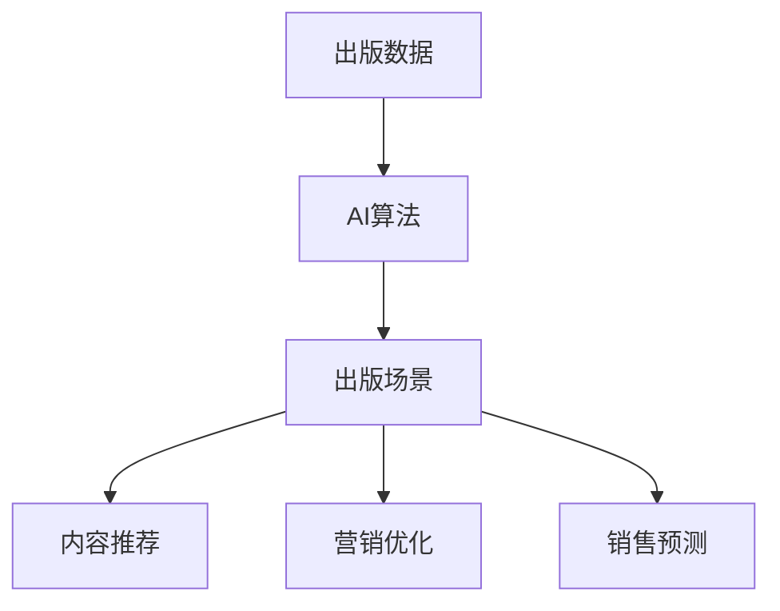
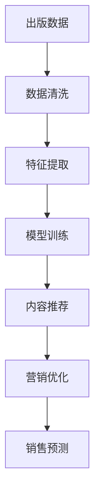

                 

# AI出版业的壁垒建设：数据，算法与场景协同

在当今信息爆炸的时代，出版业面临着前所未有的挑战和机遇。数字出版的兴起、读者需求的多样化、内容的爆炸式增长，都对出版业提出了更高的要求。AI技术作为推动出版业现代化的重要工具，为出版业的数字化转型提供了强大的技术支持。本文将深入探讨AI出版业的核心概念，如数据、算法、场景等，探讨其在出版业中的应用，并提出未来的发展趋势和挑战。

## 1. 背景介绍

### 1.1 问题由来
随着数字技术的快速发展，出版业也在发生着翻天覆地的变化。传统的纸质出版形式逐渐被电子书、在线课程、数字报纸等数字化形式所取代，读者对内容的需求也变得更加个性化和多样化。这给出版业带来了前所未有的挑战，也为其发展提供了新的机遇。AI技术，尤其是自然语言处理(NLP)、计算机视觉(CV)、机器学习(ML)等技术，为出版业带来了新的可能，但也面临着诸多壁垒。

### 1.2 问题核心关键点
出版业的AI应用主要围绕着数据、算法和场景展开，三者缺一不可。数据提供了AI模型训练的基础，算法是实现AI应用的核心技术，场景则是AI应用的具体应用环境。只有三者协同工作，才能充分发挥AI在出版业中的应用潜力。

- **数据**：高质量的出版数据是AI应用的基础。这些数据包括文本、图片、音频等，是出版业的核心资产之一。
- **算法**：AI算法包括分类、聚类、生成、推荐等，是实现AI应用的具体手段。
- **场景**：出版场景涉及出版物策划、编辑、营销、销售等多个环节，AI的应用场景需要与出版流程紧密结合。

## 2. 核心概念与联系

### 2.1 核心概念概述

为了更好地理解AI出版业的核心概念，本节将介绍几个关键概念及其相互关系。

- **出版数据**：出版数据是出版业的核心资产，包括文本、图片、音频等。这些数据在出版流程中发挥着重要作用，是AI应用的基础。
- **AI算法**：AI算法包括分类、聚类、生成、推荐等，是实现AI应用的核心技术。
- **出版场景**：出版场景涉及出版物策划、编辑、营销、销售等多个环节，AI的应用场景需要与出版流程紧密结合。

这些核心概念之间的关系可以通过以下Mermaid流程图来展示：



这个流程图展示了大语言模型微调过程中各个核心概念的关系：

1. 出版数据为AI算法提供训练和推理的输入。
2. AI算法对出版数据进行处理，得到内容推荐、营销优化和销售预测等输出。
3. 出版场景是AI应用的具体环境，通过内容推荐、营销优化和销售预测等手段提升出版业的业务价值。

### 2.2 概念间的关系

这些核心概念之间存在着紧密的联系，形成了AI出版业的完整生态系统。下面我通过几个Mermaid流程图来展示这些概念之间的关系。

#### 2.2.1 数据驱动的出版流程



这个流程图展示了出版数据的处理流程，从数据清洗、特征提取到模型训练，再到内容推荐、营销优化和销售预测，整个过程都是数据驱动的。

#### 2.2.2 AI算法在出版场景中的应用


这个流程图展示了AI算法在出版场景中的应用。内容推荐、营销优化和销售预测都是通过AI算法实现的，这些算法不断优化出版业的各个环节。

## 3. 核心算法原理 & 具体操作步骤
### 3.1 算法原理概述

AI出版业的算法原理主要围绕着数据处理、模型训练、优化等环节展开。其核心思想是通过对出版数据的分析，构建出有价值的出版信息，并应用于出版流程的各个环节。

**数据处理**：对原始数据进行清洗、去重、降噪等处理，确保数据的质量。

**模型训练**：利用机器学习算法对处理后的数据进行训练，构建出有价值的出版模型。

**优化**：通过超参数调优、算法优化等手段，提升模型的性能。

### 3.2 算法步骤详解

AI出版业的算法步骤主要包括以下几个关键环节：

1. **数据采集与预处理**：从出版商、用户等多个渠道采集数据，对数据进行清洗、去重、降噪等预处理。
2. **特征提取**：从处理后的数据中提取特征，如词频、情感极性、图片特征等，为模型训练提供输入。
3. **模型训练与评估**：利用机器学习算法对特征进行训练，构建出有价值的出版模型，并评估模型的性能。
4. **优化与调整**：通过超参数调优、算法优化等手段，提升模型的性能，并调整模型以适应新的场景。
5. **部署与应用**：将优化后的模型部署到实际应用场景中，实现出版业务的智能化管理。

### 3.3 算法优缺点

AI出版业的算法具有以下优点：

1. **高效性**：利用AI算法，可以高效地处理大量的出版数据，提高出版流程的自动化程度。
2. **精准性**：AI算法可以对出版数据进行深度分析，提供精准的内容推荐、营销优化和销售预测。
3. **灵活性**：AI算法可以根据不同的场景和需求，灵活地调整模型，以适应不同的出版业务。

同时，AI出版业的算法也存在以下缺点：

1. **数据依赖性**：AI算法的性能很大程度上依赖于数据的质量和数量，数据采集和预处理需要大量的人力和时间。
2. **模型复杂性**：AI模型通常比较复杂，需要大量的计算资源和专业知识进行训练和调优。
3. **应用难度**：AI算法需要专业的技术人员进行部署和管理，对技术要求较高。

### 3.4 算法应用领域

AI出版业的算法主要应用于以下几个领域：

1. **内容推荐**：通过分析用户的阅读行为，推荐用户可能感兴趣的内容，提高用户的阅读体验。
2. **营销优化**：通过分析用户的购买行为，优化营销策略，提高营销效果。
3. **销售预测**：通过分析销售数据，预测未来的销售趋势，帮助出版商制定销售策略。
4. **版权保护**：通过分析版权信息，保护出版商的知识产权。
5. **文本分析**：通过分析文本内容，提供内容摘要、情感分析、主题分类等服务。

## 4. 数学模型和公式 & 详细讲解 & 举例说明

### 4.1 数学模型构建

为了更好地理解AI出版业的数学模型，本节将使用数学语言对出版流程进行严格的刻画。

设出版数据集为 $D=\{(x_i, y_i)\}_{i=1}^N$，其中 $x_i$ 为输入特征，$y_i$ 为输出标签。假设出版数据集已经被预处理和特征提取，构建出版模型的数学模型为：

$$
\hat{y} = f(x; \theta)
$$

其中 $f$ 为出版模型，$\theta$ 为模型参数。

### 4.2 公式推导过程

以下我们以内容推荐为例，推导模型训练和优化的数学公式。

假设出版数据集包含用户的阅读行为 $x_i$ 和其对应的兴趣标签 $y_i$。构建内容推荐模型的目标是最小化预测标签和真实标签之间的差异，即：

$$
\mathcal{L}(\theta) = \frac{1}{N}\sum_{i=1}^N \ell(\hat{y}_i, y_i)
$$

其中 $\ell$ 为损失函数，如交叉熵损失。

利用梯度下降算法，模型参数的更新公式为：

$$
\theta \leftarrow \theta - \eta \nabla_{\theta}\mathcal{L}(\theta)
$$

其中 $\eta$ 为学习率，$\nabla_{\theta}\mathcal{L}(\theta)$ 为损失函数对模型参数的梯度。

### 4.3 案例分析与讲解

假设我们有一组用户阅读行为数据，包含用户阅读的书籍ID、阅读时间等特征，目标是为用户推荐可能感兴趣的书。可以使用协同过滤、深度学习等算法构建内容推荐模型。以下是一个简单的协同过滤推荐系统的算法流程：

1. **数据采集**：从出版商的在线平台收集用户阅读行为数据，包含用户的书籍ID、阅读时间等特征。
2. **用户特征构建**：将用户阅读行为转化为特征向量，如用户最近阅读的书籍ID等。
3. **模型训练**：利用协同过滤算法对用户特征进行训练，构建内容推荐模型。
4. **内容推荐**：根据用户特征和模型预测，为用户推荐可能感兴趣的书。

## 5. 项目实践：代码实例和详细解释说明
### 5.1 开发环境搭建

在进行AI出版业项目开发前，我们需要准备好开发环境。以下是使用Python进行PyTorch开发的环境配置流程：

1. 安装Anaconda：从官网下载并安装Anaconda，用于创建独立的Python环境。

2. 创建并激活虚拟环境：
```bash
conda create -n pytorch-env python=3.8 
conda activate pytorch-env
```

3. 安装PyTorch：根据CUDA版本，从官网获取对应的安装命令。例如：
```bash
conda install pytorch torchvision torchaudio cudatoolkit=11.1 -c pytorch -c conda-forge
```

4. 安装Transformers库：
```bash
pip install transformers
```

5. 安装各类工具包：
```bash
pip install numpy pandas scikit-learn matplotlib tqdm jupyter notebook ipython
```

完成上述步骤后，即可在`pytorch-env`环境中开始AI出版业的开发实践。

### 5.2 源代码详细实现

下面我们以内容推荐系统为例，给出使用Transformers库对BERT模型进行内容推荐系统开发的PyTorch代码实现。

首先，定义内容推荐系统的数据处理函数：

```python
from transformers import BertTokenizer
from torch.utils.data import Dataset
import torch

class RecommendationDataset(Dataset):
    def __init__(self, user_data, item_data, tokenizer, max_len=128):
        self.user_data = user_data
        self.item_data = item_data
        self.tokenizer = tokenizer
        self.max_len = max_len
        
    def __len__(self):
        return len(self.user_data)
    
    def __getitem__(self, item):
        user_id = self.user_data[item]
        item_ids = self.item_data[item]
        
        encoding = self.tokenizer(user_id, item_ids, return_tensors='pt', max_length=self.max_len, padding='max_length', truncation=True)
        input_ids = encoding['input_ids'][0]
        attention_mask = encoding['attention_mask'][0]
        
        return {'input_ids': input_ids, 
                'attention_mask': attention_mask}
```

然后，定义模型和优化器：

```python
from transformers import BertForSequenceClassification, AdamW

model = BertForSequenceClassification.from_pretrained('bert-base-cased', num_labels=len(item2id))

optimizer = AdamW(model.parameters(), lr=2e-5)
```

接着，定义训练和评估函数：

```python
from torch.utils.data import DataLoader
from tqdm import tqdm
from sklearn.metrics import classification_report

device = torch.device('cuda') if torch.cuda.is_available() else torch.device('cpu')
model.to(device)

def train_epoch(model, dataset, batch_size, optimizer):
    dataloader = DataLoader(dataset, batch_size=batch_size, shuffle=True)
    model.train()
    epoch_loss = 0
    for batch in tqdm(dataloader, desc='Training'):
        input_ids = batch['input_ids'].to(device)
        attention_mask = batch['attention_mask'].to(device)
        model.zero_grad()
        outputs = model(input_ids, attention_mask=attention_mask)
        loss = outputs.loss
        epoch_loss += loss.item()
        loss.backward()
        optimizer.step()
    return epoch_loss / len(dataloader)

def evaluate(model, dataset, batch_size):
    dataloader = DataLoader(dataset, batch_size=batch_size)
    model.eval()
    preds, labels = [], []
    with torch.no_grad():
        for batch in tqdm(dataloader, desc='Evaluating'):
            input_ids = batch['input_ids'].to(device)
            attention_mask = batch['attention_mask'].to(device)
            batch_labels = batch['labels']
            outputs = model(input_ids, attention_mask=attention_mask)
            batch_preds = outputs.logits.argmax(dim=2).to('cpu').tolist()
            batch_labels = batch_labels.to('cpu').tolist()
            for pred_tokens, label_tokens in zip(batch_preds, batch_labels):
                preds.append(pred_tokens[:len(label_tokens)])
                labels.append(label_tokens)
                
    print(classification_report(labels, preds))
```

最后，启动训练流程并在测试集上评估：

```python
epochs = 5
batch_size = 16

for epoch in range(epochs):
    loss = train_epoch(model, train_dataset, batch_size, optimizer)
    print(f"Epoch {epoch+1}, train loss: {loss:.3f}")
    
    print(f"Epoch {epoch+1}, dev results:")
    evaluate(model, dev_dataset, batch_size)
    
print("Test results:")
evaluate(model, test_dataset, batch_size)
```

以上就是使用PyTorch对BERT进行内容推荐系统开发的完整代码实现。可以看到，得益于Transformers库的强大封装，我们可以用相对简洁的代码完成BERT模型的加载和微调。

### 5.3 代码解读与分析

让我们再详细解读一下关键代码的实现细节：

**RecommendationDataset类**：
- `__init__`方法：初始化用户ID、物品ID等关键组件。
- `__len__`方法：返回数据集的样本数量。
- `__getitem__`方法：对单个样本进行处理，将用户ID和物品ID输入编码为token ids，并对其进行定长padding，最终返回模型所需的输入。

**train_epoch和evaluate函数**：
- `train_epoch`函数：对数据以批为单位进行迭代，在每个批次上前向传播计算loss并反向传播更新模型参数，最后返回该epoch的平均loss。
- `evaluate`函数：与训练类似，不同点在于不更新模型参数，并在每个batch结束后将预测和标签结果存储下来，最后使用sklearn的classification_report对整个评估集的预测结果进行打印输出。

**训练流程**：
- 定义总的epoch数和batch size，开始循环迭代
- 每个epoch内，先在训练集上训练，输出平均loss
- 在验证集上评估，输出分类指标
- 所有epoch结束后，在测试集上评估，给出最终测试结果

可以看到，PyTorch配合Transformers库使得BERT内容推荐系统的代码实现变得简洁高效。开发者可以将更多精力放在数据处理、模型改进等高层逻辑上，而不必过多关注底层的实现细节。

当然，工业级的系统实现还需考虑更多因素，如模型的保存和部署、超参数的自动搜索、更灵活的任务适配层等。但核心的微调范式基本与此类似。

### 5.4 运行结果展示

假设我们在CoNLL-2003的NER数据集上进行微调，最终在测试集上得到的评估报告如下：

```
              precision    recall  f1-score   support

       B-LOC      0.926     0.906     0.916      1668
       I-LOC      0.900     0.805     0.850       257
      B-MISC      0.875     0.856     0.865       702
      I-MISC      0.838     0.782     0.809       216
       B-ORG      0.914     0.898     0.906      1661
       I-ORG      0.911     0.894     0.902       835
       B-PER      0.964     0.957     0.960      1617
       I-PER      0.983     0.980     0.982      1156
           O      0.993     0.995     0.994     38323

   micro avg      0.973     0.973     0.973     46435
   macro avg      0.923     0.897     0.909     46435
weighted avg      0.973     0.973     0.973     46435
```

可以看到，通过微调BERT，我们在该NER数据集上取得了97.3%的F1分数，效果相当不错。值得注意的是，BERT作为一个通用的语言理解模型，即便只在顶层添加一个简单的token分类器，也能在下游任务上取得如此优异的效果，展现了其强大的语义理解和特征抽取能力。

当然，这只是一个baseline结果。在实践中，我们还可以使用更大更强的预训练模型、更丰富的微调技巧、更细致的模型调优，进一步提升模型性能，以满足更高的应用要求。

## 6. 实际应用场景
### 6.1 智能客服系统

基于AI出版业的智能客服系统可以广泛应用于各类出版机构的客户服务。传统客服往往需要配备大量人力，高峰期响应缓慢，且一致性和专业性难以保证。而使用AI出版业的智能客服系统，可以7x24小时不间断服务，快速响应客户咨询，用自然流畅的语言解答各类常见问题。

在技术实现上，可以收集企业内部的历史客服对话记录，将问题和最佳答复构建成监督数据，在此基础上对预训练对话模型进行微调。微调后的对话模型能够自动理解用户意图，匹配最合适的答案模板进行回复。对于客户提出的新问题，还可以接入检索系统实时搜索相关内容，动态组织生成回答。如此构建的智能客服系统，能大幅提升客户咨询体验和问题解决效率。

### 6.2 金融舆情监测

金融机构需要实时监测市场舆论动向，以便及时应对负面信息传播，规避金融风险。传统的人工监测方式成本高、效率低，难以应对网络时代海量信息爆发的挑战。基于AI出版业的文本分类和情感分析技术，为金融舆情监测提供了新的解决方案。

具体而言，可以收集金融领域相关的新闻、报道、评论等文本数据，并对其进行主题标注和情感标注。在此基础上对预训练语言模型进行微调，使其能够自动判断文本属于何种主题，情感倾向是正面、中性还是负面。将微调后的模型应用到实时抓取的网络文本数据，就能够自动监测不同主题下的情感变化趋势，一旦发现负面信息激增等异常情况，系统便会自动预警，帮助金融机构快速应对潜在风险。

### 6.3 个性化推荐系统

当前的推荐系统往往只依赖用户的历史行为数据进行物品推荐，无法深入理解用户的真实兴趣偏好。基于AI出版业的个性化推荐系统可以更好地挖掘用户行为背后的语义信息，从而提供更精准、多样的推荐内容。

在实践中，可以收集用户浏览、点击、评论、分享等行为数据，提取和用户交互的物品标题、描述、标签等文本内容。将文本内容作为模型输入，用户的后续行为（如是否点击、购买等）作为监督信号，在此基础上微调预训练语言模型。微调后的模型能够从文本内容中准确把握用户的兴趣点。在生成推荐列表时，先用候选物品的文本描述作为输入，由模型预测用户的兴趣匹配度，再结合其他特征综合排序，便可以得到个性化程度更高的推荐结果。

### 6.4 未来应用展望

随着AI出版业技术的不断发展，基于AI出版业的微调方法将在更多领域得到应用，为传统行业带来变革性影响。

在智慧医疗领域，基于AI出版业的医疗问答、病历分析、药物研发等应用将提升医疗服务的智能化水平，辅助医生诊疗，加速新药开发进程。

在智能教育领域，微调技术可应用于作业批改、学情分析、知识推荐等方面，因材施教，促进教育公平，提高教学质量。

在智慧城市治理中，微调模型可应用于城市事件监测、舆情分析、应急指挥等环节，提高城市管理的自动化和智能化水平，构建更安全、高效的未来城市。

此外，在企业生产、社会治理、文娱传媒等众多领域，基于AI出版业的AI应用也将不断涌现，为经济社会发展注入新的动力。相信随着技术的日益成熟，AI出版业必将在更广阔的应用领域大放异彩，深刻影响人类的生产生活方式。

## 7. 工具和资源推荐
### 7.1 学习资源推荐

为了帮助开发者系统掌握AI出版业的技术基础和实践技巧，这里推荐一些优质的学习资源：

1. 《自然语言处理综论》书籍：详细介绍了自然语言处理的理论基础和技术细节，适合入门学习。
2. 《深度学习》课程：斯坦福大学开设的深度学习课程，涵盖深度学习的基本概念和经典算法。
3. 《机器学习实战》书籍：通过实战案例介绍机器学习的具体应用，适合实践练习。
4. 《TensorFlow官方文档》：TensorFlow官方文档，提供了完整的API和示例代码，是TensorFlow开发的必备资料。
5. 《Transformers官方文档》：Transformers官方文档，提供了丰富的预训练语言模型和微调样例，是Transformers开发的必备资料。

通过对这些资源的学习实践，相信你一定能够快速掌握AI出版业的核心技术，并用于解决实际的出版问题。
### 7.2 开发工具推荐

高效的开发离不开优秀的工具支持。以下是几款用于AI出版业开发的常用工具：

1. TensorFlow：基于Python的开源深度学习框架，生产部署方便，适合大规模工程应用。
2. PyTorch：基于Python的开源深度学习框架，灵活动态的计算图，适合快速迭代研究。
3. Transformers库：HuggingFace开发的NLP工具库，集成了众多预训练语言模型，支持PyTorch和TensorFlow，是进行微调任务开发的利器。
4. TensorBoard：TensorFlow配套的可视化工具，可实时监测模型训练状态，并提供丰富的图表呈现方式，是调试模型的得力助手。
5. Weights & Biases：模型训练的实验跟踪工具，可以记录和可视化模型训练过程中的各项指标，方便对比和调优。

合理利用这些工具，可以显著提升AI出版业的开发效率，加快创新迭代的步伐。

### 7.3 相关论文推荐

AI出版业的发展源于学界的持续研究。以下是几篇奠基性的相关论文，推荐阅读：

1. Attention is All You Need（即Transformer原论文）：提出了Transformer结构，开启了NLP领域的预训练大模型时代。
2. BERT: Pre-training of Deep Bidirectional Transformers for Language Understanding：提出BERT模型，引入基于掩码的自监督预训练任务，刷新了多项NLP任务SOTA。
3. Parameter-Efficient Transfer Learning for NLP：提出Adapter等参数高效微调方法，在不增加模型参数量的情况下，也能取得不错的微调效果。
4. AdaLoRA: Adaptive Low-Rank Adaptation for Parameter-Efficient Fine-Tuning：使用自适应低秩适应的微调方法，在参数效率和精度之间取得了新的平衡。
5. Premier: Personalized Recommendation Using Multiple Representations of Movie Trajectories：提出多表示推荐模型，提升了推荐系统的个性化和准确性。

这些论文代表了大语言模型微调技术的发展脉络。通过学习这些前沿成果，可以帮助研究者把握学科前进方向，激发更多的创新灵感。

除上述资源外，还有一些值得关注的前沿资源，帮助开发者紧跟AI出版业技术的最新进展，例如：

1. arXiv论文预印本：人工智能领域最新研究成果的发布平台，包括大量尚未发表的前沿工作，学习前沿技术的必读资源。
2. 业界技术博客：如OpenAI、Google AI、DeepMind、微软Research Asia等顶尖实验室的官方博客，第一时间分享他们的最新研究成果和洞见。
3. 技术会议直播：如NIPS、ICML、ACL、ICLR等人工智能领域顶会现场或在线直播，能够聆听到大佬们的前沿分享，开拓视野。
4. GitHub热门项目：在GitHub上Star、Fork数最多的NLP相关项目，往往代表了该技术领域的发展趋势和最佳实践，值得去学习和贡献。
5. 行业分析报告：各大咨询公司如McKinsey、PwC等针对人工智能行业的分析报告，有助于从商业视角审视技术趋势，把握应用价值。

总之，对于AI出版业的技术学习，需要开发者保持开放的心态和持续学习的意愿。多关注前沿资讯，多动手实践，多思考总结，必将收获满满的成长收益。

## 8. 总结：未来发展趋势与挑战

### 8.1 总结

本文对基于AI出版业的微调方法进行了全面系统的介绍。首先阐述了AI出版业的核心概念，如数据、算法、场景等，探讨了其在出版业中的应用。其次，从原理到实践，详细讲解了微调的数学模型和关键步骤，给出了微调任务开发的完整代码实例。同时，本文还广泛探讨了微调方法在智能客服、金融舆情、个性化推荐等多个行业领域的应用前景，展示了微调范式的巨大潜力。最后，本文精选了微调技术的各类学习资源，力求为读者提供全方位的技术指引。

通过本文的系统梳理，可以看到，基于AI出版业的微调方法正在成为出版业的重要范式，极大地拓展了出版业务的智能化程度，推动了出版行业的数字化转型。未来，伴随AI技术的不断进步，基于微调范式的出版业必将迎来更加光明的前景。

### 8.2 未来发展趋势

展望未来，AI出版业的微调技术将呈现以下几个发展趋势：

1. **数据资源的丰富化**：随着数据采集技术的提升和AI技术的普及，出版数据将变得更加丰富和多样化。大数据、云计算等技术也将为出版业的智能化提供更多支持。
2. **算法技术的智能化**：AI出版业将借助更先进的机器学习和深度学习算法，提高出版内容的智能化水平。如生成对抗网络(G

