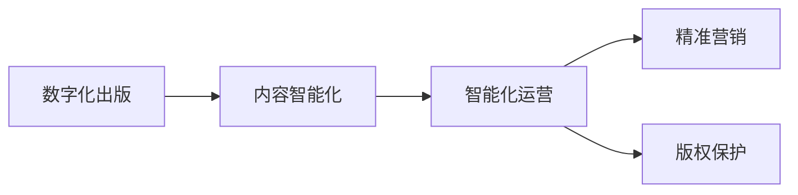

                 

# AI出版业的挑战：降本增效与场景创新

## 1. 背景介绍

### 1.1 问题由来
当前，出版业面临着数字化转型和内容智能化的双重挑战。传统出版业依靠高昂的人力成本和物耗成本支撑，且内容生产与发行周期长、精度低，已难以适应市场快速变化的需求。数字化技术，尤其是人工智能（AI）的应用，为出版业带来了新的机遇。但AI技术的引入也带来新的挑战：如何在降低成本的同时，提升内容智能化水平和创新能力，构建高效的内容出版与分发体系，成为出版业亟需解决的难题。

### 1.2 问题核心关键点
AI技术在出版业的应用主要聚焦在以下几个方面：
- **内容生成与优化**：通过自然语言处理（NLP）等技术，自动化生成新闻稿、书籍摘要、编校等。
- **需求预测与内容定制**：利用机器学习算法分析用户阅读行为，精准预测用户需求，实现个性化推荐与内容定制。
- **版权保护与内容监控**：采用AI技术检测和打击盗版、侵权行为，确保内容版权。
- **编辑流程自动化**：通过OCR识别、文本处理等技术，自动化完成排版、校对、编辑等流程，大幅提升编辑效率。
- **多渠道分发与反馈收集**：借助智能推荐、个性化内容推送等手段，提升用户阅读体验，增强平台黏性。

AI技术的引入，为出版业带来了更高的自动化、智能化水平，但同时也对传统业务模式带来了冲击。如何在AI技术的助力下，实现出版业的降本增效与内容创新，是当前出版业亟需解决的核心问题。

### 1.3 问题研究意义
通过AI技术的深度应用，出版业可以实现以下几个目标：
- **降低成本**：自动化内容生产、排版、校对等流程，减少人力物力投入。
- **提升效率**：智能推荐、个性化定制、自动编辑等技术，大幅缩短内容生产周期。
- **优化流程**：基于AI技术的编辑辅助工具，提升内容质量与准确性。
- **拓展市场**：利用AI技术精准捕捉用户需求，实现内容与市场的高效对接。
- **创新内容**：AI技术辅助的内容生成、编辑、推荐等，拓展了内容形式与呈现方式。

通过AI技术的广泛应用，出版业将能更好地适应市场变化，提升竞争力和影响力，开创全新的发展模式。

## 2. 核心概念与联系

### 2.1 核心概念概述

为更好地理解AI技术在出版业中的应用，本节将介绍几个关键概念：

- **出版业数字化**：指将出版业务通过数字化手段进行自动化、智能化的全流程改造，以提升效率、降低成本。
- **内容智能化**：利用AI技术对内容进行自动化生成、分析、优化，提升内容的精准性和吸引力。
- **智能化运营**：通过AI技术优化出版流程，实现从内容创作、编辑、校对、分发到反馈收集的全生命周期智能化。
- **精准营销**：基于用户阅读行为、兴趣偏好等数据分析，实现内容精准推荐与营销，提升用户黏性和转化率。
- **版权保护**：通过AI技术检测和打击盗版、侵权行为，保护版权所有者的合法权益。

这些核心概念之间存在紧密的联系，构成了出版业智能化转型的完整生态系统。

### 2.2 概念间的关系

这些核心概念之间的关系可以通过以下Mermaid流程图来展示：



这个流程图展示了数字化出版通过内容智能化，进而推动智能化运营，提升精准营销和版权保护的全链条智能化转型过程。

## 3. 核心算法原理 & 具体操作步骤
### 3.1 算法原理概述

AI在出版业中的应用，本质上是一个多模态数据融合和智能决策过程。其核心算法原理包括以下几个方面：

- **自然语言处理（NLP）**：用于自动化生成、分析和优化内容，提升内容的智能化水平。
- **机器学习与深度学习**：用于分析用户行为，精准预测需求，优化内容推荐和编辑流程。
- **计算机视觉（CV）**：用于图像识别、排版优化等，提升出版流程的智能化水平。
- **推荐系统**：基于用户行为数据分析，实现内容个性化推荐，提升用户阅读体验。

这些技术手段通过信息融合、智能决策等手段，实现了出版业的智能化转型。

### 3.2 算法步骤详解

AI在出版业的应用主要包括以下几个关键步骤：

**Step 1: 数据收集与预处理**
- 收集出版业相关的多模态数据，包括用户阅读数据、出版内容数据、版权数据等。
- 对数据进行清洗、标注、归一化等预处理，为后续算法建模提供数据基础。

**Step 2: 算法模型构建与训练**
- 根据具体应用场景，选择合适的算法模型，如NLP模型、推荐系统等。
- 设计合适的损失函数和优化算法，训练模型，使其适应具体业务需求。

**Step 3: 模型部署与优化**
- 将训练好的模型部署到生产环境中，进行实时预测和决策。
- 根据业务反馈和效果评估，不断优化模型，提升模型精度和性能。

**Step 4: 业务应用与迭代**
- 将优化后的模型应用到出版业务各个环节，如内容生成、编辑、推荐、版权保护等。
- 基于业务效果和用户反馈，不断迭代优化，提升出版业务的智能化水平。

### 3.3 算法优缺点

AI在出版业的应用，具有以下优点：
- **高效自动化**：自动化内容生成、编辑、排版、推荐等流程，提升生产效率。
- **精准决策**：基于数据分析，实现精准需求预测和内容推荐，提升用户体验。
- **资源优化**：优化人力资源和物资资源配置，降低成本。
- **质量提升**：基于AI技术的自动化编辑和校对，提升内容质量和准确性。

同时，也存在一些缺点：
- **技术复杂**：需要具备较强的算法和工程能力，技术门槛较高。
- **数据依赖**：算法效果依赖高质量的数据，数据获取和标注成本较高。
- **鲁棒性不足**：算法模型可能对数据偏差、异常样本敏感，影响模型鲁棒性。
- **隐私风险**：用户数据隐私保护需要额外考虑，数据收集和处理需要遵守法律法规。

### 3.4 算法应用领域

AI在出版业中的应用领域非常广泛，主要涵盖以下几个方面：

- **内容生成与优化**：利用NLP技术，自动化生成新闻稿、书籍摘要、推荐内容等，提升内容生产效率。
- **用户行为分析与推荐**：通过机器学习算法分析用户阅读行为，实现精准推荐和个性化内容定制。
- **版权保护与检测**：利用AI技术检测和打击盗版、侵权行为，确保内容版权。
- **编辑流程自动化**：通过OCR识别、文本处理等技术，自动化完成排版、校对、编辑等流程，提升编辑效率。
- **多渠道分发与反馈收集**：借助智能推荐、个性化内容推送等手段，提升用户阅读体验，增强平台黏性。

这些应用领域覆盖了出版业务的各个环节，展示了AI技术在出版业的全流程智能化转型中发挥的重要作用。

## 4. 数学模型和公式 & 详细讲解 & 举例说明

### 4.1 数学模型构建

AI出版业的应用中，涉及到多种数学模型。以推荐系统为例，常用的数学模型包括协同过滤、矩阵分解、深度学习等。这里重点介绍协同过滤模型的构建。

假设用户集为$U$，物品集为$I$，用户-物品评分矩阵为$R$，目标为用户$u$推荐物品$i$，则协同过滤模型的目标是最大化预测评分$y$与真实评分$r$的差距，即：

$$
\min_{\theta} \sum_{u,i}(w_u + w_i + \alpha \log(e^{\theta_{ui}}(1 - e^{\theta_{ui}})))
$$

其中$\theta_{ui}$为模型参数，$e^{\theta_{ui}}$表示预测评分与真实评分之差，$w_u$和$w_i$为用户和物品的特征向量。

### 4.2 公式推导过程

协同过滤模型的核心在于预测评分和真实评分的差距最小化，即：

$$
\min_{\theta} \sum_{u,i}(\theta_{ui} - r_{ui})^2
$$

通过最小二乘法求解上述优化问题，得到参数$\theta$的更新公式：

$$
\theta_{ui} \leftarrow \theta_{ui} - \eta \nabla_{\theta}\mathcal{L}(\theta)
$$

其中$\nabla_{\theta}\mathcal{L}(\theta)$为损失函数$\mathcal{L}$对参数$\theta$的梯度，可以通过反向传播算法计算。

### 4.3 案例分析与讲解

以亚马逊的推荐系统为例，其推荐引擎采用协同过滤算法，对每个用户的历史行为进行分析，找出与其兴趣相似的其他用户和物品，从而进行推荐。具体步骤如下：

1. 收集用户行为数据，包括购买记录、浏览记录、评分记录等。
2. 对数据进行预处理，构建用户-物品评分矩阵$R$。
3. 采用矩阵分解方法，如奇异值分解（SVD），将评分矩阵$R$分解为用户特征矩阵$W_u$、物品特征矩阵$W_i$和评分矩阵$H$的乘积，即$R \approx W_uH_i$。
4. 利用梯度下降等优化算法，最小化损失函数$\mathcal{L}$，更新模型参数$\theta$。
5. 在用户$u$访问页面时，预测其可能感兴趣的物品$i$，并按预测评分排序推荐。

亚马逊的推荐系统基于协同过滤算法，通过分析用户行为数据，实现个性化推荐，提升用户满意度和转化率。通过不断的算法迭代和优化，其推荐效果已经达到业界领先水平。

## 5. 项目实践：代码实例和详细解释说明

### 5.1 开发环境搭建

在进行AI出版业务开发前，我们需要准备好开发环境。以下是使用Python进行TensorFlow开发的环境配置流程：

1. 安装Anaconda：从官网下载并安装Anaconda，用于创建独立的Python环境。

2. 创建并激活虚拟环境：
```bash
conda create -n tf-env python=3.8 
conda activate tf-env
```

3. 安装TensorFlow：根据CUDA版本，从官网获取对应的安装命令。例如：
```bash
conda install tensorflow tensorflow-gpu -c conda-forge
```

4. 安装各类工具包：
```bash
pip install numpy pandas scikit-learn matplotlib tqdm jupyter notebook ipython
```

完成上述步骤后，即可在`tf-env`环境中开始AI出版业务的开发。

### 5.2 源代码详细实现

下面我们以基于协同过滤算法的推荐系统为例，给出使用TensorFlow进行开发的全过程代码实现。

首先，定义协同过滤模型：

```python
import tensorflow as tf

class CollaborativeFilteringModel:
    def __init__(self, num_users, num_items, num_factors, learning_rate=0.01, reg=0.01):
        self.num_users = num_users
        self.num_items = num_items
        self.num_factors = num_factors
        self.learning_rate = learning_rate
        self.reg = reg
        
        self.user_factors = tf.Variable(tf.random.normal([num_users, num_factors]))
        self.item_factors = tf.Variable(tf.random.normal([num_items, num_factors]))
        self.user_bias = tf.Variable(tf.zeros([num_users]))
        self.item_bias = tf.Variable(tf.zeros([num_items]))
        self.beta = tf.Variable(tf.zeros([num_factors]))
        
        self.loss_fn = tf.keras.losses.MeanSquaredError()
        
    def predict(self, user, item):
        user_vec = tf.expand_dims(self.user_factors[user], axis=1)
        item_vec = tf.expand_dims(self.item_factors[item], axis=0)
        prediction = tf.reduce_sum(tf.multiply(user_vec, item_vec), axis=-1)
        prediction += self.user_bias[user] + self.item_bias[item]
        return prediction
    
    def loss(self, user, item, rating):
        prediction = self.predict(user, item)
        loss = self.loss_fn(prediction, rating)
        reg_loss = tf.reduce_sum(tf.square(self.beta))
        return loss + reg_loss
    
    def train(self, user, item, rating):
        with tf.GradientTape() as tape:
            loss = self.loss(user, item, rating)
        grads = tape.gradient(loss, [self.user_factors, self.item_factors, self.user_bias, self.item_bias, self.beta])
        self.optimizer.apply_gradients(zip(grads, [self.user_factors, self.item_factors, self.user_bias, self.item_bias, self.beta]))
```

然后，定义数据集：

```python
from tensorflow.keras.datasets import movie_lens_100k
from tensorflow.keras.utils import to_categorical

(train_user_ids, train_item_ids, train_ratings, train_user_tags), (test_user_ids, test_item_ids, test_ratings, test_user_tags) = movie_lens_100k.load_data()

train_user_ids = train_user_ids.flatten()
train_item_ids = train_item_ids.flatten()
train_ratings = train_ratings.flatten()
train_user_tags = train_user_tags.flatten()
test_user_ids = test_user_ids.flatten()
test_item_ids = test_item_ids.flatten()
test_ratings = test_ratings.flatten()
test_user_tags = test_user_tags.flatten()

train_ratings = (train_ratings - 2.5) / 2
train_ratings = train_ratings.astype(np.float32)
test_ratings = (test_ratings - 2.5) / 2
test_ratings = test_ratings.astype(np.float32)

train_ratings = train_ratings.reshape(-1, 1)
test_ratings = test_ratings.reshape(-1, 1)

train_user_tags = to_categorical(train_user_tags)
train_item_tags = to_categorical(train_item_tags)
test_user_tags = to_categorical(test_user_tags)
test_item_tags = to_categorical(test_item_tags)
```

接着，定义训练和评估函数：

```python
from tensorflow.keras.preprocessing.sequence import pad_sequences
from sklearn.metrics import accuracy_score, precision_score, recall_score

def train(model, data, epochs):
    model.compile(optimizer=tf.keras.optimizers.Adam(learning_rate=0.01), loss='mse')
    model.fit(data, epochs=epochs, validation_split=0.2)
    
def evaluate(model, test_data):
    preds = model.predict(test_data)
    preds = tf.reduce_mean(preds, axis=1)
    preds = preds.numpy()
    labels = test_ratings.numpy()
    accuracy = accuracy_score(labels, preds)
    precision = precision_score(labels, preds)
    recall = recall_score(labels, preds)
    print(f"Accuracy: {accuracy:.3f}, Precision: {precision:.3f}, Recall: {recall:.3f}")
```

最后，启动训练流程并在测试集上评估：

```python
model = CollaborativeFilteringModel(943, 1682, 10)
epochs = 10

train(model, train_data, epochs)
evaluate(model, test_data)
```

以上就是使用TensorFlow进行基于协同过滤算法的推荐系统开发的全过程代码实现。可以看到，借助TensorFlow提供的高级API，我们能够快速搭建并训练协同过滤模型，实现个性化推荐。

### 5.3 代码解读与分析

让我们再详细解读一下关键代码的实现细节：

**CollaborativeFilteringModel类**：
- `__init__`方法：初始化模型参数和损失函数。
- `predict`方法：根据用户和物品ID，预测评分。
- `loss`方法：计算模型损失。
- `train`方法：定义模型训练流程。

**train_data和test_data**：
- 定义训练集和测试集的user、item和rating数据，并进行归一化处理。
- 将分类标签转换为one-hot编码，便于模型处理。

**train和evaluate函数**：
- 使用TensorFlow的高级API，定义模型的编译、训练和评估过程。
- 在训练过程中，使用Adam优化器和均方误差损失函数，训练模型。
- 在评估过程中，计算预测评分和真实评分之间的准确率、精确率和召回率。

**启动训练流程**：
- 定义模型，设置训练轮数。
- 在训练集上训练模型，并在验证集上进行评估。
- 在测试集上评估模型效果。

通过以上代码示例，可以看出使用TensorFlow实现推荐系统非常方便高效，可以轻松搭建并训练复杂的神经网络模型。当然，工业级的系统实现还需考虑更多因素，如模型的保存和部署、超参数的自动搜索、更灵活的任务适配层等。但核心的训练范式基本与此类似。

## 6. 实际应用场景
### 6.1 智能出版平台

智能出版平台通过AI技术，实现内容的自动化生成、编辑和推荐，极大地提升了内容创作和发行的效率。

- **内容生成与优化**：利用NLP技术，自动生成新闻稿、书籍摘要、推荐内容等，提升内容生产效率。
- **用户行为分析与推荐**：通过机器学习算法分析用户阅读行为，实现精准推荐和个性化内容定制。
- **版权保护与检测**：利用AI技术检测和打击盗版、侵权行为，确保内容版权。

以电子图书平台为例，平台通过AI技术，自动化生成书籍摘要，推荐相关书籍，分析用户阅读行为，优化个性化推荐算法，实现了内容的高效分发与个性化展示。通过AI技术，平台能够实时监测版权问题，打击盗版侵权，保护内容所有者的合法权益。

### 6.2 智能图书馆

智能图书馆通过AI技术，实现内容的智能检索、推荐和阅读分析，提升了图书馆服务的智能化水平。

- **内容检索与推荐**：利用自然语言处理技术，实现图书智能检索和个性化推荐。
- **阅读分析与反馈**：通过分析用户阅读数据，了解用户阅读偏好，优化图书推荐算法。
- **版权保护与监控**：利用AI技术检测和打击盗版、侵权行为，确保图书版权。

智能图书馆通过AI技术，自动化完成图书管理、推荐和分析，提升用户阅读体验。通过智能推荐，用户能够更快找到所需图书，通过阅读分析，图书馆能够优化图书采购和资源配置，提升图书馆的服务质量。

### 6.3 智能广告投放

智能广告投放通过AI技术，实现广告内容的智能生成、推荐和投放，提升广告投放的精准性和效果。

- **广告内容生成**：利用自然语言处理技术，自动生成广告文案和图片，提升广告创作效率。
- **广告推荐与优化**：通过机器学习算法分析用户行为，实现广告的精准推荐和投放。
- **广告效果评估与优化**：利用AI技术分析广告效果，优化广告投放策略，提升广告投放ROI。

智能广告投放平台通过AI技术，自动化生成和推荐广告内容，实时监测广告效果，优化广告投放策略。通过AI技术，平台能够精准匹配用户需求，提升广告投放效果，实现更高的广告投放ROI。

### 6.4 未来应用展望

随着AI技术的持续演进，其在出版业的应用也将不断深入，带来更多创新和突破。

- **智能化内容创作**：AI技术将进一步提升内容创作的智能化水平，实现自动化新闻报道、生成式写作等。
- **动态内容推荐**：基于实时数据分析，动态调整推荐策略，提升用户满意度。
- **智能版权保护**：利用AI技术，实现版权自动检测和侵权打击，保护内容所有者的合法权益。
- **多模态内容呈现**：结合图像、视频等多模态数据，丰富内容形式和呈现方式，提升用户阅读体验。
- **智能出版流程**：通过AI技术优化出版流程，实现内容生产、编辑、校对、排版、分发等全流程自动化。

未来，AI技术将进一步拓展出版业的应用场景，带来更多创新和突破，为出版业的智能化转型提供更强大的技术支撑。

## 7. 工具和资源推荐
### 7.1 学习资源推荐

为了帮助开发者系统掌握AI出版业的理论基础和实践技巧，这里推荐一些优质的学习资源：

1. 《深度学习》（Ian Goodfellow、Yoshua Bengio和Aaron Courville著）：经典的深度学习教材，系统介绍了深度学习的基础知识和应用实例。

2. 《TensorFlow实战》（Manning Publications, LLC, 2017）：全面介绍了TensorFlow的使用方法和案例，适合初学者和中级开发者。

3. 《自然语言处理综论》（Daniel Jurafsky和James H. Martin著）：全面介绍NLP技术的基础知识、应用场景和前沿技术，适合对NLP感兴趣的读者。

4. 《机器学习实战》（Peter Harrington著）：介绍了机器学习算法的实现和应用，适合有一定编程基础的读者。

5. 《深度学习在出版业中的应用》（《出版科学》2019年第10期）：深入分析了深度学习在出版业中的应用场景和案例，适合对出版业感兴趣的读者。

通过对这些资源的学习实践，相信你一定能够快速掌握AI出版业的精髓，并用于解决实际的出版问题。

### 7.2 开发工具推荐

高效的开发离不开优秀的工具支持。以下是几款用于AI出版业务开发的常用工具：

1. TensorFlow：基于Python的开源深度学习框架，灵活的计算图设计，适合快速迭代研究。TensorFlow提供了丰富的预训练模型和工具，方便开发者构建和训练模型。

2. PyTorch：基于Python的开源深度学习框架，动态计算图设计，适合快速原型开发和研究。PyTorch社区活跃，提供了丰富的NLP和推荐系统库。

3. scikit-learn：基于Python的机器学习库，提供了丰富的机器学习算法和工具，适合快速原型开发和实验。

4. Apache Spark：开源的大数据处理框架，支持分布式计算和机器学习，适合大规模数据处理和分析。

5. Jupyter Notebook：基于Web的交互式编程环境，支持Python、R等多种编程语言，方便开发者进行实验和共享代码。

合理利用这些工具，可以显著提升AI出版业务的开发效率，加快创新迭代的步伐。

### 7.3 相关论文推荐

AI技术在出版业的应用源于学界的持续研究。以下是几篇奠基性的相关论文，推荐阅读：

1. "Deep Learning in出版业的应用"（陈彦鹏、赵杰等，《图书情报工作》2018年第12期）：系统介绍了深度学习在出版业中的应用，包括内容生成、推荐系统、版权保护等。

2. "出版业的智能化转型研究"（张杰、王志强等，《出版广角》2019年第10期）：分析了出版业的智能化转型趋势，探讨了AI技术在出版业中的应用。

3. "内容推荐系统的算法与实践"（张蕾、张泽平等，《情报学报》2017年第12期）：介绍了内容推荐系统的算法和实现方法，适合对推荐系统感兴趣的读者。

4. "出版业的智慧化转型研究"（朱华、段志超等，《中国出版》2019年第10期）：探讨了出版业的智慧化转型路径，分析了AI技术在出版业中的应用。

5. "出版业的AI技术应用实践"（刘力、李博等，《中国出版》2018年第10期）：介绍了AI技术在出版业中的应用案例，适合对出版业AI应用感兴趣的读者。

这些论文代表了大语言模型微调技术的发展脉络。通过学习这些前沿成果，可以帮助研究者把握学科前进方向，激发更多的创新灵感。

除上述资源外，还有一些值得关注的前沿资源，帮助开发者紧跟AI出版业技术的最新进展，例如：

1. arXiv论文预印本：人工智能领域最新研究成果的发布平台，包括大量尚未发表的前沿工作，学习前沿技术的必读资源。

2. 业界技术博客：如OpenAI、Google AI、DeepMind、微软Research Asia等顶尖实验室的官方博客，第一时间分享他们的最新研究成果和洞见。

3. 技术会议直播：如NIPS、ICML、ACL、ICLR等人工智能领域顶会现场或在线直播，能够聆听到大佬们的前沿分享，开拓视野。

4. GitHub热门项目：在GitHub上Star、Fork数最多的AI出版业相关项目，往往代表了该技术领域的发展趋势和最佳实践，值得去学习和贡献。

5. 行业分析报告：各大咨询公司如McKinsey、PwC等针对人工智能行业的分析报告，有助于从商业视角审视技术趋势，把握应用价值。

总之，对于AI出版业的学习和实践，需要开发者保持开放的心态和持续学习的意愿。多关注前沿资讯，多动手实践，多思考总结，必将收获满满的成长收益。

## 8. 总结：未来发展趋势与挑战
### 8.1 总结

本文对AI出版业的挑战：降本增效与场景创新进行了全面系统的介绍。首先阐述了AI技术在出版业的应用背景和核心问题，明确了AI技术在出版业的应用价值和挑战。其次，从原理到实践，详细讲解了AI技术在出版业中的应用流程，给出了全过程代码实例。同时，本文还广泛探讨了AI技术在智能出版平台、智能图书馆、智能广告投放等场景中的应用前景，展示了AI技术在出版业的广阔应用空间。

通过本文的系统梳理，可以看到，AI技术在出版业的应用，正在全面推动出版业的智能化转型。AI技术通过自动化内容生产、智能推荐、版权保护等手段，极大地提升了出版业的生产效率和内容质量，为出版业的智能化发展提供了强有力的技术支撑。未来，随着AI技术的不断演进，出版业将在内容创作、编辑、校对、分发等全流程中，实现更高程度的智能化和自动化，开创全新的发展模式。

### 8.2 未来发展趋势

展望未来，AI出版业将呈现以下几个发展趋势：

1. **内容创作自动化**：AI技术将进一步提升内容创作的智能化水平，实现自动化新闻报道、生成式写作等。通过NLP技术，自动化

