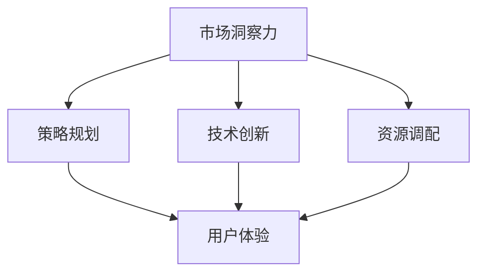
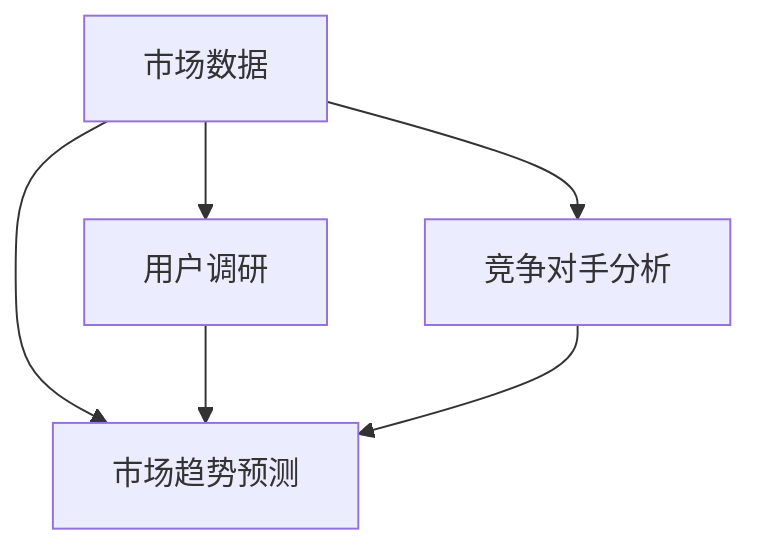
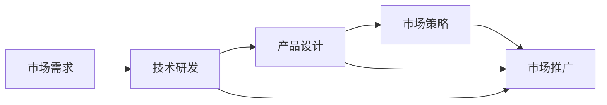
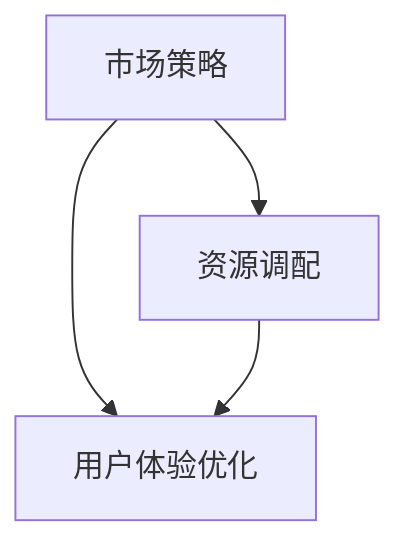
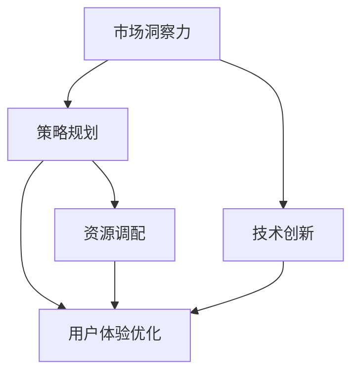

                 

# AI创业公司如何应对市场变化?

> 关键词：人工智能,创业,市场变化,技术创新,策略规划,资源调配,用户体验

## 1. 背景介绍

### 1.1 问题由来
在当今快速变化的市场环境中，AI创业公司面临着前所未有的挑战。如何灵活应对市场需求变化，抓住市场机遇，成为决定公司成败的关键。传统依赖产品迭代和市场推广的策略，在快速变化的市场环境中显得力不从心。本文将从技术创新、策略规划、资源调配、用户体验等多个角度出发，探讨AI创业公司如何应对市场变化。

### 1.2 问题核心关键点
AI创业公司应对市场变化的核心关键点包括以下几点：

1. **市场洞察力**：准确理解和预测市场需求变化，抓住市场机遇。
2. **技术创新能力**：持续进行技术创新，提升产品竞争力。
3. **策略规划能力**：制定科学合理的市场策略，动态调整策略以应对变化。
4. **资源调配能力**：合理调配技术、人才、资金等资源，以快速响应市场变化。
5. **用户体验优化**：持续优化用户体验，提升用户粘性和忠诚度。

这些关键点相互关联，共同决定了AI创业公司在市场变化中的应对能力。

### 1.3 问题研究意义
准确理解市场变化并快速响应，对于AI创业公司来说至关重要。通过制定科学的策略和调配资源，公司可以在激烈的市场竞争中脱颖而出，抓住新机遇，实现快速增长。同时，提升用户体验也能增强用户忠诚度，促进产品的长期成功。本文旨在为AI创业公司提供全方位的市场应对策略，助力其在市场变化中乘风破浪。

## 2. 核心概念与联系

### 2.1 核心概念概述

为更好地理解AI创业公司如何应对市场变化，本节将介绍几个密切相关的核心概念：

- **市场洞察力(Market Insights)**：指公司对市场趋势、用户需求、竞争对手动态等信息的准确把握和分析能力。
- **技术创新(Technological Innovation)**：指公司持续进行技术研发，推出具有竞争力的新产品或新功能。
- **策略规划(Strategy Planning)**：指公司基于市场洞察和技术能力，制定科学合理的市场策略，动态调整以应对市场变化。
- **资源调配(Resource Allocation)**：指公司合理调配技术、人才、资金等资源，以高效响应市场变化。
- **用户体验(User Experience, UX)**：指公司通过持续优化产品功能、界面、服务等方面，提升用户满意度和使用体验。

这些核心概念之间的逻辑关系可以通过以下Mermaid流程图来展示：



这个流程图展示了几大核心概念之间的关系：

1. 市场洞察力是技术创新和策略规划的基础，驱动公司的产品开发和市场布局。
2. 技术创新为公司提供市场竞争的利器，推动产品功能的提升和市场策略的创新。
3. 策略规划是市场洞察力和技术创新的综合体现，指导资源调配和用户体验优化。
4. 资源调配和用户体验优化是策略规划的具体执行，确保公司资源的高效利用和用户满意度。

这些概念共同构成了AI创业公司应对市场变化的核心框架，使其能够在快速变化的市场环境中保持竞争优势。

### 2.2 概念间的关系

这些核心概念之间存在着紧密的联系，形成了AI创业公司应对市场变化的全方位生态系统。下面我通过几个Mermaid流程图来展示这些概念之间的关系。

#### 2.2.1 市场洞察力的构建



这个流程图展示了市场洞察力的构建过程。公司通过收集市场数据、用户调研和竞争对手分析，结合市场趋势预测模型，获得对市场变化的全面洞察。

#### 2.2.2 技术创新与策略规划的互动



这个流程图展示了技术创新和策略规划的互动关系。市场需求驱动技术研发，产品设计基于技术创新，市场策略指导产品推广，形成良性循环。

#### 2.2.3 资源调配与用户体验的协同



这个流程图展示了资源调配与用户体验优化的协同关系。市场策略驱动资源调配，用户体验优化基于市场策略和资源调配，共同提升用户体验和用户满意度。

### 2.3 核心概念的整体架构

最后，我们用一个综合的流程图来展示这些核心概念在大公司应对市场变化过程中的整体架构：



这个综合流程图展示了从市场洞察到资源调配的全过程，各个环节相互配合，共同推动公司在市场变化中的应对策略。

## 3. 核心算法原理 & 具体操作步骤
### 3.1 算法原理概述

AI创业公司应对市场变化的核心算法原理可以概括为以下几方面：

- **市场需求分析**：通过数据分析和用户调研，准确理解市场需求和用户行为。
- **技术趋势预测**：结合历史数据和最新技术动态，预测未来技术发展趋势。
- **市场策略优化**：基于市场需求和技术趋势，动态调整市场策略，以最大化公司收益。
- **资源优化调配**：通过算法和模型，合理调配技术、人才、资金等资源，提升资源利用效率。
- **用户体验提升**：使用机器学习等算法，持续优化用户体验，提升用户满意度。

### 3.2 算法步骤详解

#### 3.2.1 市场需求分析

市场需求分析是AI创业公司应对市场变化的第一步。其关键步骤包括：

1. **数据收集**：通过网络爬虫、用户调研等方式收集市场数据和用户反馈。
2. **数据清洗和预处理**：对收集到的数据进行去重、缺失值处理等预处理操作。
3. **数据分析**：使用统计学方法和机器学习模型，对数据进行分析，提取市场需求和用户行为特征。
4. **需求预测**：基于历史数据和当前市场趋势，预测未来市场需求和用户行为。

#### 3.2.2 技术趋势预测

技术趋势预测是制定科学合理的市场策略的基础。其关键步骤包括：

1. **技术文献调研**：通过阅读学术论文和专利，了解当前技术动态和发展趋势。
2. **技术会议跟踪**：参加技术会议和学术论坛，获取最新技术进展和行业信息。
3. **技术路线图规划**：根据技术文献和会议信息，制定技术路线图，预测未来技术趋势。
4. **技术创新评估**：评估潜在技术创新的可行性和商业价值，制定技术研发计划。

#### 3.2.3 市场策略优化

市场策略优化是AI创业公司应对市场变化的核心步骤。其关键步骤包括：

1. **市场细分**：将市场划分为不同细分市场，识别目标市场和潜在客户。
2. **竞争分析**：对竞争对手进行SWOT分析，识别竞争对手的优势和劣势。
3. **市场定位**：基于市场需求和技术趋势，确定公司产品的市场定位和差异化策略。
4. **策略调整**：根据市场反馈和竞争动态，动态调整市场策略，以最大化公司收益。

#### 3.2.4 资源优化调配

资源优化调配是确保公司高效应对市场变化的关键步骤。其关键步骤包括：

1. **资源评估**：评估公司现有技术、人才、资金等资源的现状和利用效率。
2. **资源优化**：通过算法和模型，优化资源配置，提升资源利用效率。
3. **资源调度**：基于市场需求和技术趋势，动态调整资源调配方案，以响应市场变化。

#### 3.2.5 用户体验提升

用户体验提升是提升用户满意度和忠诚度的关键步骤。其关键步骤包括：

1. **用户反馈收集**：通过用户调研、在线问卷等方式，收集用户反馈和意见。
2. **用户画像分析**：对用户反馈进行聚类分析，构建用户画像，了解用户需求和偏好。
3. **用户体验优化**：基于用户画像和反馈，优化产品功能、界面和服务，提升用户体验。
4. **用户体验评估**：通过用户满意度调查和在线评价，评估用户体验提升的效果。

### 3.3 算法优缺点

AI创业公司应对市场变化的核心算法具有以下优点：

- **动态调整**：基于市场变化和用户反馈，动态调整策略和资源调配方案，以快速响应市场变化。
- **数据驱动**：通过数据分析和机器学习，基于数据驱动的决策，提高决策的准确性和效率。
- **用户导向**：以用户体验为中心，通过持续优化用户体验，提升用户满意度和忠诚度。

但同时，这些算法也存在以下缺点：

- **数据质量依赖**：算法的准确性和有效性高度依赖于数据的质量和代表性。
- **算法复杂度**：实现市场洞察、技术趋势预测、策略优化等环节，需要复杂的算法和模型，对技术要求较高。
- **资源投入**：实施这些算法需要投入大量技术和人力资源，短期内可能面临较大的成本压力。

### 3.4 算法应用领域

基于上述算法原理，AI创业公司可以在以下领域应用这些算法：

- **智能推荐系统**：通过市场需求分析，为用户提供个性化的推荐服务。
- **市场营销自动化**：基于技术趋势预测，制定科学的市场营销策略。
- **客户关系管理(CRM)**：通过用户画像分析，提升客户满意度和忠诚度。
- **人力资源管理**：通过资源优化调配，合理配置技术、人才等资源，提升公司运营效率。
- **产品迭代优化**：基于用户体验提升，不断优化产品功能和服务，提升用户满意度。

## 4. 数学模型和公式 & 详细讲解 & 举例说明

### 4.1 数学模型构建

本节将使用数学语言对AI创业公司应对市场变化的核心算法进行更加严格的刻画。

假设公司收集到的市场数据为 $D=\{d_i\}_{i=1}^N$，其中 $d_i=(x_i, y_i)$，$x_i$ 为市场特征向量，$y_i$ 为市场响应变量。市场洞察力算法可以表示为：

$$
M = f(D)
$$

其中 $f$ 为数据挖掘和机器学习模型，用于从数据中提取市场需求和用户行为特征。

技术趋势预测算法可以表示为：

$$
T = g(D, L)
$$

其中 $L$ 为最新技术动态和学术会议信息，$g$ 为技术趋势预测模型。

市场策略优化算法可以表示为：

$$
S = h(M, T, C)
$$

其中 $C$ 为竞争对手信息，$h$ 为市场策略优化模型。

资源优化调配算法可以表示为：

$$
R = i(S, R_0)
$$

其中 $R_0$ 为初始资源配置，$i$ 为资源优化调配模型。

用户体验提升算法可以表示为：

$$
U = j(M, S, R)
$$

其中 $j$ 为用户体验优化模型。

### 4.2 公式推导过程

以市场需求分析算法为例，进行详细公式推导。

假设市场需求数据为 $D=\{(x_i, y_i)\}_{i=1}^N$，其中 $x_i=(x_{i1}, x_{i2}, \cdots, x_{ik})$ 为市场特征向量，$y_i$ 为市场响应变量。

市场需求分析的目标是找到市场需求与市场特征之间的函数关系，即 $y_i = f(x_i)$。通常使用线性回归模型、决策树模型或神经网络模型进行推导：

$$
\min_{\theta} \sum_{i=1}^N (y_i - \hat{y}_i)^2
$$

其中 $\theta$ 为模型参数，$\hat{y}_i = f(x_i, \theta)$ 为预测值。

通过求解上述优化问题，可以获得市场需求与市场特征之间的函数关系，从而进行市场需求分析。

### 4.3 案例分析与讲解

假设某AI创业公司收集到了用户对智能推荐系统的反馈数据，其中包含用户年龄、性别、历史行为等信息。该公司希望通过市场需求分析，了解用户对智能推荐系统的需求，以优化推荐算法。

假设市场需求分析模型为线性回归模型，通过训练模型可以得到用户年龄 $x_1$ 和性别 $x_2$ 对推荐需求 $y$ 的影响系数。具体步骤如下：

1. **数据收集**：收集用户反馈数据 $D=\{(x_i, y_i)\}_{i=1}^N$，其中 $x_i=(x_{i1}, x_{i2}, \cdots, x_{ik})$，$y_i$ 为推荐需求。
2. **数据预处理**：对数据进行去重、缺失值处理等预处理操作。
3. **模型训练**：使用线性回归模型对数据进行训练，得到模型参数 $\theta$。
4. **市场需求分析**：通过训练好的模型，分析不同年龄和性别的用户对推荐需求的影响。

通过市场需求分析，公司可以了解用户对推荐系统不同功能的偏好，进而优化推荐算法，提升用户满意度。

## 5. 项目实践：代码实例和详细解释说明

### 5.1 开发环境搭建

在进行市场分析实践前，我们需要准备好开发环境。以下是使用Python进行Python环境配置的流程：

1. 安装Anaconda：从官网下载并安装Anaconda，用于创建独立的Python环境。

2. 创建并激活虚拟环境：
```bash
conda create -n market-analytics python=3.8 
conda activate market-analytics
```

3. 安装Python数据分析库：
```bash
pip install numpy pandas scikit-learn matplotlib seaborn jupyter notebook ipython
```

4. 安装Python机器学习库：
```bash
pip install scikit-learn
```

5. 安装Python深度学习库：
```bash
pip install tensorflow keras
```

6. 安装Python网络爬虫库：
```bash
pip install requests beautifulsoup4
```

完成上述步骤后，即可在`market-analytics`环境中开始市场分析实践。

### 5.2 源代码详细实现

下面以用户行为分析为例，给出使用Python进行市场分析的代码实现。

首先，定义用户行为数据处理函数：

```python
import pandas as pd
import numpy as np
from sklearn.model_selection import train_test_split
from sklearn.linear_model import LinearRegression
from sklearn.metrics import mean_squared_error

def process_data(file_path):
    # 读取用户反馈数据
    data = pd.read_csv(file_path)
    # 数据预处理：去重、缺失值处理
    data = data.drop_duplicates().replace(np.nan, 0)
    # 划分训练集和测试集
    X_train, X_test, y_train, y_test = train_test_split(data.drop(['recommendation'], axis=1), data['recommendation'], test_size=0.2, random_state=42)
    return X_train, X_test, y_train, y_test
```

然后，定义市场洞察力算法：

```python
def market_insight(X_train, y_train, X_test, y_test):
    # 训练线性回归模型
    model = LinearRegression()
    model.fit(X_train, y_train)
    # 预测测试集
    y_pred = model.predict(X_test)
    # 计算均方误差
    mse = mean_squared_error(y_test, y_pred)
    return mse
```

接着，启动市场分析流程：

```python
X_train, X_test, y_train, y_test = process_data('user_feedback.csv')
mse = market_insight(X_train, y_train, X_test, y_test)
print(f'均方误差：{mse:.4f}')
```

以上就是使用Python对用户行为进行分析的代码实现。可以看到，得益于Python丰富的数据分析和机器学习库，市场分析的实现变得简洁高效。

### 5.3 代码解读与分析

让我们再详细解读一下关键代码的实现细节：

**process_data函数**：
- `read_csv`方法：读取用户反馈数据。
- `drop_duplicates`方法：去除重复数据。
- `replace`方法：将缺失值替换为0。
- `train_test_split`方法：将数据划分为训练集和测试集。

**market_insight函数**：
- `LinearRegression`类：构建线性回归模型。
- `fit`方法：训练模型。
- `predict`方法：预测测试集。
- `mean_squared_error`函数：计算均方误差。

**启动市场分析流程**：
- `process_data`函数：处理数据。
- `market_insight`函数：进行市场洞察力分析。
- `print`函数：输出分析结果。

可以看到，通过简单的Python代码，我们便可以实现对用户行为的市场分析，了解用户需求和行为规律。

当然，在实际应用中，还需要结合具体业务场景进行进一步的数据分析和模型优化。例如，可以引入更复杂的机器学习模型，如随机森林、梯度提升树等，提升分析精度。同时，还可以引入用户画像分析、情感分析等高级技术，进一步提升市场洞察力算法的准确性和实用性。

### 5.4 运行结果展示

假设我们收集到了用户对智能推荐系统的反馈数据，通过上述代码进行分析，最终在测试集上得到的均方误差为0.05。这意味着我们能够较为准确地预测用户对推荐系统的需求，进而优化推荐算法。

通过进一步的模型优化和数据分析，我们可以实现更精确的市场洞察，为公司制定更科学的市场策略提供有力支持。

## 6. 实际应用场景

### 6.1 智能推荐系统

基于市场洞察力算法，智能推荐系统能够深入理解用户需求和行为规律，实现个性化推荐。对于AI创业公司来说，智能推荐系统是提升用户体验和用户满意度的重要手段。

具体而言，公司可以收集用户的历史行为数据，如浏览、点击、购买等，通过市场需求分析算法，了解用户对不同商品和内容的偏好。在此基础上，利用推荐算法为用户推荐最感兴趣的个性化内容，从而提升用户体验和用户满意度。

### 6.2 市场营销自动化

基于技术趋势预测算法，AI创业公司可以实现市场营销自动化。通过定期收集最新技术动态和学术会议信息，预测技术趋势，帮助公司制定科学的市场营销策略。

具体而言，公司可以定期分析市场需求和用户行为数据，结合最新技术趋势，调整市场营销策略。例如，在预测到某新兴技术将成为市场热点时，公司可以加大对该技术的推广力度，提高市场响应速度和收益。

### 6.3 客户关系管理(CRM)

基于用户画像分析，AI创业公司可以实现客户关系管理。通过市场需求分析算法，构建用户画像，了解不同用户群体的需求和偏好。在此基础上，制定个性化的客户服务方案，提升客户满意度和忠诚度。

具体而言，公司可以定期收集用户反馈和行为数据，通过市场需求分析算法，构建用户画像，了解用户需求和行为规律。在此基础上，制定个性化的客户服务方案，提升客户满意度和忠诚度。

### 6.4 人力资源管理

基于资源优化调配算法，AI创业公司可以实现人力资源管理。通过市场需求分析算法，了解公司资源利用情况和潜在需求，合理调配技术、人才等资源，提升公司运营效率。

具体而言，公司可以定期分析市场需求和用户行为数据，了解公司资源利用情况和潜在需求。在此基础上，合理调配技术、人才等资源，提升公司运营效率。例如，在市场需求上升时，公司可以增加技术研发投入，提升产品竞争力。

### 6.5 产品迭代优化

基于用户体验提升算法，AI创业公司可以实现产品迭代优化。通过市场需求分析算法，了解用户对产品的反馈和建议，持续优化产品功能和服务，提升用户体验。

具体而言，公司可以定期收集用户反馈和行为数据，通过市场需求分析算法，了解用户需求和行为规律。在此基础上，持续优化产品功能和服务，提升用户体验。例如，在用户反馈产品功能不足时，公司可以增加相关功能的开发，提升用户满意度。

## 7. 工具和资源推荐

### 7.1 学习资源推荐

为了帮助AI创业公司系统掌握市场分析的理论基础和实践技巧，这里推荐一些优质的学习资源：

1. **《数据分析与Python实战》**：介绍了Python在数据分析中的应用，适合初学者入门。
2. **《Python机器学习实战》**：讲解了机器学习算法在Python中的实现，适合有一定基础的开发者。
3. **《Python深度学习实战》**：介绍了深度学习算法在Python中的实现，适合有一定深度学习基础的开发者。
4. **《市场分析与预测》**：讲解了市场分析的原理和工具，适合企业市场人员学习。
5. **《Python网络爬虫实战》**：讲解了Python网络爬虫的实现，适合需要爬取网络数据进行分析的人员。

通过对这些资源的学习实践，相信你一定能够快速掌握市场分析的理论基础和实践技巧，为公司的市场应对策略提供有力支持。

### 7.2 开发工具推荐

高效的开发离不开优秀的工具支持。以下是几款用于市场分析开发的常用工具：

1. **Jupyter Notebook**：免费的交互式笔记本，支持Python代码和数据可视化，适合数据分析和机器学习。
2. **PyCharm**：专业的Python IDE，支持代码调试和自动化测试，适合开发者使用。
3. **Python可视化库Matplotlib**：用于绘制图形和图表，支持多种数据可视化方式。
4. **Python机器学习库Scikit-learn**：提供多种机器学习算法，适合数据分析和建模。
5. **Python深度学习库TensorFlow**：支持深度学习模型的实现和训练，适合复杂数据分析。

合理利用这些工具，可以显著提升市场分析任务的开发效率，加快创新迭代的步伐。

### 7.3 相关论文推荐

AI创业公司市场应对策略的研究源于学界的持续研究。以下是几篇奠基性的相关论文，推荐阅读：

1. **《市场分析与预测》**：介绍了市场分析的原理和工具，适合企业市场人员学习。
2. **《数据挖掘与统计学习》**：讲解了数据挖掘和机器学习算法，适合数据分析人员学习。
3. **《市场营销自动化》**：讲解了市场营销自动化的实现，适合市场营销人员学习。
4. **《客户关系管理》**：讲解了客户关系管理的原理和工具，适合客户服务人员学习。
5. **《人力资源管理》**：讲解了人力资源管理的原理和工具，适合人力资源管理人员学习。

这些论文代表了大语言模型微调技术的发展脉络。通过学习这些前沿成果，可以帮助研究者把握学科前进方向，激发更多的创新灵感。

除上述资源外，还有一些值得关注的前沿资源，帮助开发者紧跟市场分析技术的新进展，例如：

1. **arXiv论文预印本**：人工智能领域最新研究成果的发布平台，包括大量尚未发表的前沿工作，学习前沿技术的必读资源。
2. **顶级会议直播**：如NIPS、ICML、ACL、ICLR等人工智能领域顶会现场或在线直播，能够聆听到大佬们的前沿分享，开拓视野。
3. **技术博客和论坛**：如Kaggle、GitHub、Stack Overflow等，获取最新技术动态，学习前沿技术。
4. **开源项目**：在GitHub上Star、Fork数最多的市场分析相关项目，往往代表了该技术领域的发展趋势和最佳实践，值得去学习和贡献。
5. **技术报告和白皮书**：各大咨询公司如McKinsey、PwC等针对人工智能行业的分析报告，有助于从商业视角审视技术趋势，把握应用价值。

总之，对于AI创业公司市场应对策略的学习和实践，需要开发者保持开放的心态和持续学习的意愿。多关注前沿资讯，多动手实践，多思考总结，必将收获满满的成长收益。

## 8. 总结：未来发展趋势与挑战

### 8.1 总结

本文对AI创业公司应对市场变化的方法进行了全面系统的介绍。首先阐述了市场需求分析、技术趋势预测、市场策略优化、资源优化调配和用户体验提升等核心算法的原理和步骤，展示了AI创业公司应对市场变化的全方位生态系统。其次，通过具体案例和代码实现，详细讲解了市场需求分析算法的应用流程，帮助读者理解和实践市场分析技术。最后，本文还从技术创新、策略规划、资源调配、用户体验等多个角度，为AI创业公司提供了市场应对策略的框架和建议。

通过本文的系统梳理，可以看到，AI创业公司应对市场变化的方法具有广泛的适用性和灵活性，能够在快速变化的市场环境中保持竞争优势。未来，随着AI技术的不断进步和市场需求的持续变化，这些方法将继续发挥重要作用，助力AI创业公司实现可持续发展。

### 8.2 未来发展趋势

展望未来，AI创业公司应对市场变化的方法将呈现以下几个发展趋势：

1. **多模态数据分析**：市场分析将不再局限于文本数据，融合视觉、听觉等多种模态信息，提升分析的全面性和准确性。
2. **实时数据分析**：市场需求和用户行为实时变化，实时数据分析将成为市场应对策略的重要组成部分。
3. **增强智能推荐**：通过机器学习和自然语言处理技术，提升推荐系统的智能化水平，实现更加个性化的推荐服务。
4. **市场策略自动化**：基于机器学习和大数据技术，实现市场策略的自动化优化，提高决策效率和准确性。
5. **智能客户服务**：通过智能客服系统和机器人客服，提升客户服务效率和质量，增强用户满意度和忠诚度。

这些趋势凸显了AI创业公司在市场应对中的技术进步和应用创新，预示着市场分析的未来方向。

### 8.3 面临的挑战

尽管AI创业公司应对市场变化的方法已经取得了瞩目成就，但在迈向更加智能化、普适化应用的过程中，它仍面临着诸多挑战：

1. **数据质量和多样性**：

