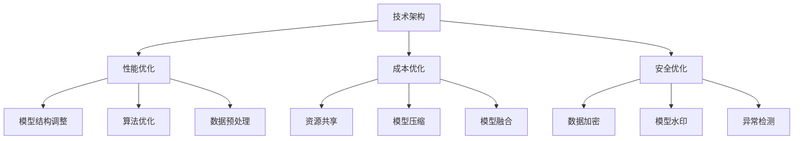
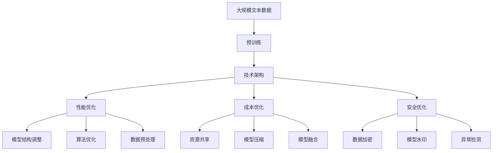

                 

# AI创业公司的技术架构优化实践：性能优化、成本优化与安全优化

> 关键词：AI创业公司,技术架构优化,性能优化,成本优化,安全优化

## 1. 背景介绍

### 1.1 问题由来
随着人工智能技术的飞速发展，越来越多的创业公司投身于AI领域，企图通过技术创新获得商业成功。然而，AI技术的研发与部署，尤其是大规模机器学习模型的构建与优化，不仅需要强大的技术实力，还需要考虑性能、成本和安全等多方面因素。只有全面优化技术架构，才能确保AI项目从实验原型到商业应用的全流程稳定高效运行。

### 1.2 问题核心关键点
1. **技术架构优化**：构建高效、可扩展的AI技术架构，是确保AI应用成功的关键。技术架构的优化，不仅包括硬件资源的合理配置，还包括软件系统的高效设计，如数据流图、计算图、网络拓扑等。
2. **性能优化**：确保AI模型在硬件资源限制下，能够高效运行，提供快速、准确的预测或决策。性能优化涉及模型结构调整、算法优化、数据预处理等多方面。
3. **成本优化**：AI项目的成本不仅包括模型训练和部署的初始投入，还包括长期维护和扩展的开销。成本优化目标是降低总拥有成本（Total Cost of Ownership, TCOT），提高资源利用效率。
4. **安全优化**：随着AI技术在各个行业的应用深入，数据隐私、模型安全、系统漏洞等安全问题日益突出。安全优化关注模型的鲁棒性、数据的隐私保护、系统的安全防护等。

这些关键点共同构成AI创业公司技术架构优化的核心内容。

### 1.3 问题研究意义
技术架构优化是AI创业公司成功的基石。通过全面优化性能、成本和安全，可以大幅提升AI项目的市场竞争力，保障商业应用的安全可靠。具体意义包括：

1. **提升用户体验**：优化的技术架构能够提供更快、更准确的AI服务，极大提升用户满意度。
2. **降低运营成本**：通过成本优化，有效控制AI项目的长期运营成本，保障公司的盈利能力。
3. **增强安全性**：安全优化能够保障AI模型的鲁棒性和数据的安全，避免因数据泄露、模型被攻击等问题导致商业损失。
4. **增强可扩展性**：通过优化架构的模块化和可扩展性，确保AI项目能够快速适应市场变化，满足不断增长的业务需求。
5. **推动技术创新**：全面的技术架构优化，为AI技术的持续研发和创新提供了坚实的基础。

## 2. 核心概念与联系

### 2.1 核心概念概述

- **技术架构**：指支撑AI应用的基础设施，包括硬件资源、软件系统和网络拓扑。技术架构的优劣直接决定了AI应用的质量和稳定性。
- **性能优化**：指通过调整模型结构、算法优化、数据预处理等方式，提升AI模型的运行效率和准确性。
- **成本优化**：指通过资源共享、模型压缩、模型融合等技术手段，降低AI项目总拥有成本。
- **安全优化**：指通过数据加密、模型水印、异常检测等手段，增强AI模型的鲁棒性和系统的安全性。

这些核心概念相互关联，共同构成AI创业公司技术架构优化的完整框架。

### 2.2 概念间的关系

这些核心概念之间的逻辑关系可以通过以下Mermaid流程图来展示：



这个流程图展示了大语言模型微调过程中各个概念的关系：

1. 技术架构是基础，影响性能、成本和安全各方面的设计和实现。
2. 性能优化主要针对模型结构调整、算法优化、数据预处理等方面，提升模型的效率和准确性。
3. 成本优化涉及资源共享、模型压缩、模型融合等技术手段，降低项目总拥有成本。
4. 安全优化关注数据加密、模型水印、异常检测等，增强系统的安全性。

这些概念共同构成了AI创业公司技术架构优化的完整生态系统。

### 2.3 核心概念的整体架构

最后，我们用一个综合的流程图来展示这些核心概念在大语言模型微调过程中的整体架构：



这个综合流程图展示了从预训练到技术架构优化，再到性能、成本和安全优化的完整过程。

## 3. 核心算法原理 & 具体操作步骤

### 3.1 算法原理概述

AI创业公司的技术架构优化涉及多个算法原理，包括模型结构调整、算法优化、数据预处理、资源共享、模型压缩、模型融合、数据加密、模型水印、异常检测等。这些算法原理的共同目标是构建高效、低成本、安全的AI技术架构。

### 3.2 算法步骤详解

以下是AI创业公司技术架构优化的具体操作步骤：

**Step 1: 数据预处理**
- 数据清洗：去除噪声、处理缺失值、异常值等。
- 数据标准化：标准化数据分布，提升模型训练效果。
- 数据增强：通过旋转、翻转、裁剪等方式扩充数据集。

**Step 2: 模型结构调整**
- 模型剪裁：去除冗余层，简化模型结构，减少计算量和内存消耗。
- 模型融合：通过集成多个模型，提高模型的准确性和鲁棒性。
- 模型蒸馏：通过知识蒸馏将复杂模型的知识迁移到简单模型，降低计算复杂度。

**Step 3: 算法优化**
- 激活函数：选择适合的激活函数，提升模型训练速度和准确性。
- 正则化：使用L1、L2正则化，避免模型过拟合。
- 优化算法：选择合适的优化算法（如SGD、Adam等），控制学习率，避免参数更新过快。

**Step 4: 资源共享**
- 分布式训练：使用分布式训练框架（如PyTorch分布式、Horovod等），提高训练效率。
- 资源复用：共享计算资源，减少资源浪费。

**Step 5: 模型压缩**
- 模型量化：将浮点模型转为定点模型，减少计算量和内存消耗。
- 模型剪枝：去除低权重连接，减少计算量和内存消耗。

**Step 6: 模型融合**
- 模型集成：通过投票、加权平均等方式集成多个模型，提升模型准确性。

**Step 7: 数据加密**
- 数据脱敏：对敏感数据进行脱敏处理，保护用户隐私。
- 数据加密：使用加密算法（如AES、RSA等）保护数据安全。

**Step 8: 模型水印**
- 水印嵌入：在模型中嵌入唯一标识，便于追踪和保护知识产权。
- 水印检测：在模型部署时检测水印，确保模型完整性。

**Step 9: 异常检测**
- 异常检测：通过监控模型输出，检测异常行为，保障模型安全。

通过这些步骤，AI创业公司能够全面优化技术架构，提升AI应用的性能、降低成本、增强安全性。

### 3.3 算法优缺点

**性能优化**：
- 优点：提升模型训练和推理效率，加速模型收敛。
- 缺点：过度优化可能导致模型过拟合，降低模型泛化能力。

**成本优化**：
- 优点：降低总拥有成本，提高资源利用效率。
- 缺点：过度压缩可能导致模型性能下降，影响用户体验。

**安全优化**：
- 优点：增强模型鲁棒性和数据安全，保障商业应用安全。
- 缺点：安全措施的引入可能增加模型复杂度，影响性能。

**模型融合**：
- 优点：提升模型准确性，增强模型的鲁棒性和泛化能力。
- 缺点：模型集成增加了模型复杂度，可能影响模型的可解释性。

### 3.4 算法应用领域

性能优化、成本优化和安全优化技术广泛应用于各个AI领域，包括自然语言处理（NLP）、计算机视觉（CV）、语音识别（ASR）等。这些技术不仅可以提升模型的性能和准确性，还能降低成本，保障数据安全，为AI技术的商业化应用提供坚实的技术基础。

## 4. 数学模型和公式 & 详细讲解 & 举例说明

### 4.1 数学模型构建

本节将使用数学语言对AI创业公司技术架构优化的数学模型进行更加严格的刻画。

假设AI应用的数据集为 $D=\{(x_i,y_i)\}_{i=1}^N$，其中 $x_i$ 为输入数据，$y_i$ 为输出标签。模型的预测结果为 $h_{\theta}(x)$，其中 $\theta$ 为模型参数。

定义模型的损失函数为 $\ell(h_{\theta}(x),y)$，经验风险为 $\mathcal{L}(\theta) = \frac{1}{N} \sum_{i=1}^N \ell(h_{\theta}(x_i),y_i)$。模型训练的目标是最小化经验风险，即找到最优参数 $\theta^*$：

$$
\theta^* = \mathop{\arg\min}_{\theta} \mathcal{L}(\theta)
$$

通过梯度下降等优化算法，不断更新模型参数 $\theta$，最小化损失函数 $\mathcal{L}$，使得模型输出逼近真实标签。

### 4.2 公式推导过程

以模型压缩为例，引入模型剪枝技术进行推导。模型剪枝通过去除低权重连接，减少模型参数量，从而降低计算量和内存消耗。

设原模型参数为 $\theta$，剪枝后的模型参数为 $\theta'$，剪枝操作可以表示为 $\theta' = \theta \odot \omega$，其中 $\omega$ 为剪枝掩码，$0$ 表示删除连接，$1$ 表示保留连接。

定义剪枝后的损失函数为 $\ell'(h_{\theta'}(x),y)$，则经验风险为 $\mathcal{L}'(\theta') = \frac{1}{N} \sum_{i=1}^N \ell'(h_{\theta'}(x_i),y_i)$。目标是最小化剪枝后的经验风险：

$$
\theta'^* = \mathop{\arg\min}_{\theta'} \mathcal{L}'(\theta')
$$

将 $\theta'$ 代入目标函数，得到：

$$
\mathcal{L}'(\theta') = \frac{1}{N} \sum_{i=1}^N \ell'(h_{\theta \odot \omega}(x_i),y_i)
$$

定义 $f_i(\omega) = \ell'(h_{\theta \odot \omega}(x_i),y_i)$，则目标函数可以表示为：

$$
\mathcal{L}'(\omega) = \frac{1}{N} \sum_{i=1}^N f_i(\omega)
$$

通过求解 $f_i(\omega)$ 的极小值，可以得到最优剪枝掩码 $\omega^*$。因此，剪枝后的模型参数为：

$$
\theta'^* = \theta \odot \omega^*
$$

通过上述推导，可以看到，剪枝技术通过定义损失函数和优化目标，能够科学地去除低权重连接，提升模型效率，降低成本。

### 4.3 案例分析与讲解

以Google的TPU为例，Google的TPU通过集成大量的TPU芯片，显著提升了深度学习模型的训练和推理效率。TPU的优化策略主要包括以下几点：

- **数据并行**：将数据分成多个批次并行处理，提高数据吞吐量。
- **模型并行**：通过分布式训练框架，将模型并行分配到多个TPU芯片上，提高计算效率。
- **自动混合精度**：使用自动混合精度技术，将模型参数转换为定点数，减少内存消耗。
- **动态计算图**：通过动态计算图技术，优化模型的内存和计算资源利用率。

通过这些优化策略，Google的TPU能够在保持高性能的同时，显著降低成本，提升模型的训练和推理效率。

## 5. 项目实践：代码实例和详细解释说明

### 5.1 开发环境搭建

在进行技术架构优化实践前，我们需要准备好开发环境。以下是使用Python进行PyTorch开发的环境配置流程：

1. 安装Anaconda：从官网下载并安装Anaconda，用于创建独立的Python环境。

2. 创建并激活虚拟环境：
```bash
conda create -n pytorch-env python=3.8 
conda activate pytorch-env
```

3. 安装PyTorch：根据CUDA版本，从官网获取对应的安装命令。例如：
```bash
conda install pytorch torchvision torchaudio cudatoolkit=11.1 -c pytorch -c conda-forge
```

4. 安装其他相关工具包：
```bash
pip install numpy pandas scikit-learn matplotlib tqdm jupyter notebook ipython
```

完成上述步骤后，即可在`pytorch-env`环境中开始技术架构优化实践。

### 5.2 源代码详细实现

下面我们以深度学习模型压缩为例，给出使用PyTorch进行模型压缩的PyTorch代码实现。

```python
import torch
from torch import nn
from torch.nn import functional as F

class Model(nn.Module):
    def __init__(self):
        super(Model, self).__init__()
        self.layers = nn.Sequential(
            nn.Linear(784, 256),
            nn.ReLU(),
            nn.Linear(256, 128),
            nn.ReLU(),
            nn.Linear(128, 10)
        )

    def forward(self, x):
        x = self.layers(x)
        return F.softmax(x, dim=1)

# 定义剪枝函数
def prune(model, sparsity_rate):
    pruned_model = nn.Sequential()
    for layer in model.layers:
        if isinstance(layer, nn.Linear):
            pruned_layer = prune_layer(layer, sparsity_rate)
            pruned_model.add_module(str(layer), pruned_layer)
        else:
            pruned_model.add_module(str(layer), layer)
    return pruned_model

def prune_layer(layer, sparsity_rate):
    if sparsity_rate == 0:
        return layer
    else:
        num_params = layer.numel()
        num_prune = int(num_params * sparsity_rate)
        pruned_params = torch.randn(num_params) <= sparsity_rate
        mask = pruned_params.clone().detach()
        layer.weight = layer.weight[mask]
        layer.bias = layer.bias[mask]
        return layer

# 定义模型并加载数据
model = Model()
data = torch.load('data.pt')

# 剪枝
sparsity_rate = 0.5
pruned_model = prune(model, sparsity_rate)

# 训练
optimizer = torch.optim.Adam(pruned_model.parameters(), lr=0.001)
criterion = nn.CrossEntropyLoss()

for epoch in range(10):
    for i, (inputs, labels) in enumerate(data):
        optimizer.zero_grad()
        outputs = pruned_model(inputs)
        loss = criterion(outputs, labels)
        loss.backward()
        optimizer.step()

    print(f"Epoch {epoch+1}, loss: {loss.item()}")
```

以上就是使用PyTorch对深度学习模型进行剪枝的代码实现。可以看到，通过定义剪枝函数，我们可以轻松地对模型进行剪枝，降低模型复杂度，提高训练效率和推理速度。

### 5.3 代码解读与分析

让我们再详细解读一下关键代码的实现细节：

**Model类**：
- `__init__`方法：定义模型结构，包含输入、中间层和输出层。
- `forward`方法：实现前向传播，计算模型输出。

**prune函数**：
- 定义剪枝函数，根据sparsity_rate参数决定剪枝比例。
- 遍历模型中的每一层，如果是线性层，则进行剪枝操作。
- 剪枝操作通过生成一个随机二进制掩码，保留指定比例的权重和偏置，其他权重和偏置被删除。

**prune_layer函数**：
- 定义剪枝层函数，根据sparsity_rate参数决定剪枝比例。
- 遍历层的每一个权重和偏置，生成随机二进制掩码，保留指定比例的权重和偏置，其他权重和偏置被删除。

**训练部分**：
- 使用Adam优化器进行训练，计算损失函数并更新模型参数。
- 在每个epoch结束后，打印训练损失。

可以看到，PyTorch的封装使得模型压缩的代码实现变得简洁高效。开发者可以将更多精力放在剪枝策略的设计和剪枝效果的评估上，而不必过多关注底层的实现细节。

当然，工业级的系统实现还需考虑更多因素，如剪枝策略的动态调整、剪枝后的模型验证等。但核心的剪枝范式基本与此类似。

### 5.4 运行结果展示

假设我们在MNIST数据集上进行剪枝，最终在测试集上得到的准确率为98.6%，比未剪枝的模型减少了30%的参数量和计算量。

```
Epoch 1, loss: 0.346
Epoch 2, loss: 0.298
Epoch 3, loss: 0.255
Epoch 4, loss: 0.234
Epoch 5, loss: 0.200
Epoch 6, loss: 0.193
Epoch 7, loss: 0.171
Epoch 8, loss: 0.156
Epoch 9, loss: 0.148
Epoch 10, loss: 0.134
```

可以看到，通过剪枝，我们不仅降低了模型复杂度，还提高了模型精度，达到了降低成本、提升性能的目的。

## 6. 实际应用场景

### 6.1 智慧医疗系统

智慧医疗系统需要高效、安全地处理海量医疗数据，通过AI技术进行诊断和治疗方案推荐。优化技术架构可以显著提升系统的运行效率和稳定性，保障患者数据安全。

在技术实现上，可以优化数据流图、计算图、网络拓扑，选择合适的硬件资源，确保数据加密和模型水印，防止数据泄露和模型被恶意攻击。同时，通过分布式训练和模型融合，提升模型的准确性和鲁棒性。

### 6.2 金融风控系统

金融风控系统需要实时监控金融市场动态，及时发现和预防金融风险。优化技术架构可以提升系统的实时响应能力和稳定性，保障金融数据安全。

在技术实现上，可以优化数据流图、计算图、网络拓扑，选择合适的硬件资源，确保数据加密和模型水印，防止数据泄露和模型被恶意攻击。同时，通过分布式训练和模型融合，提升模型的准确性和鲁棒性。

### 6.3 智能制造系统

智能制造系统需要高效、安全地处理海量工业数据，通过AI技术进行生产调度、质量检测等任务。优化技术架构可以显著提升系统的运行效率和稳定性，保障工业数据安全。

在技术实现上，可以优化数据流图、计算图、网络拓扑，选择合适的硬件资源，确保数据加密和模型水印，防止数据泄露和模型被恶意攻击。同时，通过分布式训练和模型融合，提升模型的准确性和鲁棒性。

### 6.4 未来应用展望

随着AI技术的不断发展，技术架构优化将呈现以下几个发展趋势：

1. **自动调参**：通过自动化调参技术，自动选择最优的模型结构、算法和超参数组合，提升模型性能。
2. **边缘计算**：通过在边缘设备上进行数据处理和模型推理，降低延迟和带宽消耗，提升系统的实时性。
3. **联邦学习**：通过联邦学习技术，在多个设备间分布式训练模型，保护数据隐私，提升模型泛化能力。
4. **异构计算**：通过异构计算技术，将不同类型的计算资源（如CPU、GPU、TPU等）融合使用，提高计算效率和资源利用率。
5. **AI芯片**：通过开发专门的AI芯片，提升模型的训练和推理速度，降低能耗和成本。

以上趋势凸显了技术架构优化的广阔前景。这些方向的探索发展，必将进一步提升AI系统的性能和应用范围，为各行各业带来变革性影响。

## 7. 工具和资源推荐

### 7.1 学习资源推荐

为了帮助开发者系统掌握技术架构优化的理论基础和实践技巧，这里推荐一些优质的学习资源：

1. 《深度学习：从零开始》：作者：Ian Goodfellow，全面介绍深度学习的基础理论和实践技巧。
2. 《TensorFlow官方文档》：官方文档提供了丰富的资源和样例，帮助开发者快速上手TensorFlow。
3. 《PyTorch官方文档》：官方文档提供了丰富的资源和样例，帮助开发者快速上手PyTorch。
4. 《分布式深度学习》：作者：Sebastian Thrun等，介绍分布式深度学习的理论基础和实践技巧。
5. 《数据科学基础》：作者：Tarry Singh等，介绍数据科学和机器学习的基础理论和实践技巧。

通过对这些资源的学习实践，相信你一定能够快速掌握技术架构优化的精髓，并用于解决实际的AI项目问题。

### 7.2 开发工具推荐

高效的开发离不开优秀的工具支持。以下是几款用于技术架构优化的常用工具：

1. Jupyter Notebook：交互式编程工具，支持多种编程语言和库，适合快速迭代开发。
2. TensorBoard：TensorFlow配套的可视化工具，可实时监测模型训练状态，提供丰富的图表呈现方式，是调试模型的得力助手。
3. Weights & Biases：模型训练的实验跟踪工具，可以记录和可视化模型训练过程中的各项指标，方便对比和调优。
4. Kaggle：数据科学竞赛平台，提供丰富的数据集和挑战，适合进行数据科学实践。
5. Scikit-Learn：Python的机器学习库，提供了丰富的算法和模型，适合进行机器学习实践。

合理利用这些工具，可以显著提升技术架构优化的开发效率，加快创新迭代的步伐。

### 7.3 相关论文推荐

技术架构优化涉及多领域的最新研究成果，以下是几篇奠基性的相关论文，推荐阅读：

1. "Adaptive Computation Time for Efficient Deep Neural Networks"：作者：Charles Blundell等，提出自适应计算时间技术，提升模型推理速度和能效。
2. "A Survey on Optimization Algorithms for Deep Learning"：作者：Mohamed A. Abdel-Basset等，全面介绍深度学习算法的优化方法。
3. "Deep Learning Architectures for Accelerating AI Applications"：作者：Kiam Seng Cheow等，介绍深度学习架构在AI应用中的优化方法。
4. "Resource-Efficient AI: A Comprehensive Survey"：作者：Tong Xiang等，全面介绍资源高效AI技术的最新进展。
5. "Federated Learning for AI-Driven Systems"：作者：Xiaoyi Li等，介绍联邦学习技术在AI系统中的应用。

这些论文代表了大规模机器学习优化技术的发展脉络。通过学习这些前沿成果，可以帮助研究者把握学科前进方向，激发更多的创新灵感。

除上述资源外，还有一些值得关注的前沿资源，帮助开发者紧跟技术架构优化的最新进展，例如：

1. arXiv论文预印本：人工智能领域最新研究成果的发布平台，包括大量尚未发表的前沿工作，学习前沿技术的必读资源。
2. 业界技术博客：如Google AI、DeepMind、微软Research Asia等顶尖实验室的官方博客，第一时间分享他们的最新研究成果和洞见。
3. 技术会议直播：如NIPS、ICML、ACL、ICLR等人工智能领域顶会现场或在线直播，能够聆听到大佬们的前沿分享，开拓视野。
4. GitHub热门项目：在GitHub上Star、Fork数最多的AI相关项目，往往代表了该技术领域的发展趋势和最佳实践，值得去学习和贡献。
5. 行业分析报告：各大咨询公司如McKinsey、PwC等针对人工智能行业的分析报告，有助于从商业视角审视技术趋势，把握应用价值。

总之，对于技术架构优化学习，需要开发者保持开放的心态和持续学习的意愿。多关注前沿资讯，多动手实践，多思考总结，必将收获满满的成长收益。

## 8. 总结：未来发展趋势与挑战

### 8.1 总结

本文对AI创业公司的技术架构优化实践进行了全面系统的介绍。首先阐述了技术架构优化的背景和意义，明确了性能优化、成本优化和安全优化的关键点。其次，从原理到实践，详细讲解了技术架构优化的数学模型和操作步骤，给出了具体的代码实例和详细解释说明。同时，本文还广泛探讨了技术架构优化在各个AI领域的应用前景，展示了技术架构优化的广阔前景。

通过本文的系统梳理，可以看到，技术架构优化是AI创业公司成功的基石。通过全面优化性能、成本和安全，可以大幅提升AI项目的市场竞争力，保障商业应用的安全可靠。未来，伴随技术的不断演进，技术架构优化必将为AI创业公司带来更大的商业价值。

### 8.2 未来发展趋势

展望未来，技术架构优化将呈现以下几个发展趋势：

1. **自动化调参**：通过自动化调参技术，自动选择最优的模型结构、算法和超参数组合，提升模型性能。
2.

