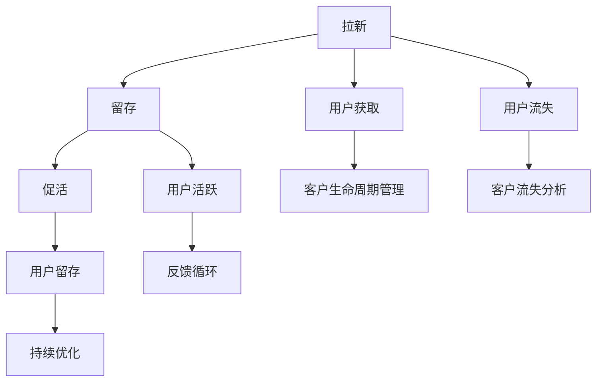

                 

# AI创业公司的用户增长策略：拉新、留存与促活

> 关键词：用户增长策略, 拉新, 留存, 促活, 客户生命周期管理, 人工智能应用

## 1. 背景介绍

在当今互联网时代，用户增长已经成为各个领域创业公司关注的焦点。随着竞争的加剧，如何有效吸引用户，提升用户粘性，实现持续的用户增长，成为决定创业公司成败的关键因素。尤其是在AI创业公司，用户不仅是数据来源，更是模型迭代的驱动者和最终受益者，用户增长的意义更加深远。

### 1.1 问题由来

随着互联网和人工智能技术的不断发展，越来越多的创业公司涌现出各自的独特商业模式。AI创业公司以人工智能技术为依托，面向用户提供个性化的服务与解决方案。然而，在实际运营中，AI创业公司往往面临以下问题：

- **拉新困难**：AI产品的技术门槛较高，用户体验复杂，用户获取成本较高。
- **用户留存率低**：AI产品的差异化竞争优势不足，用户使用频率低。
- **用户激活率低**：AI产品功能繁多，但用户体验设计不佳，难以实现用户全生命周期的深度转化。

这些问题不仅影响公司的业绩，还对公司的持续发展构成威胁。因此，深入研究用户增长的关键因素和有效策略，对AI创业公司具有重要意义。

### 1.2 问题核心关键点

为了更好地解决这些问题，需要关注用户增长的核心关键点：

- **拉新策略**：如何高效吸引新用户。
- **留存策略**：如何提升用户持续使用产品。
- **促活策略**：如何提升用户活跃度，实现深度转化。

理解这些关键点，并制定相应的策略，将大大提升AI创业公司的用户增长效率。

### 1.3 问题研究意义

研究用户增长策略，对于AI创业公司而言，具有重要意义：

- **降低用户获取成本**：通过精准的拉新策略，可以有效减少广告投入，提高用户转化率。
- **提升用户体验**：通过有效的留存和促活策略，可以提升用户满意度，增强产品粘性。
- **促进用户深度转化**：通过策略优化，实现用户从新用户到忠实用户的深度转化，提升用户生命周期价值。
- **加速产品迭代**：通过用户反馈和行为数据，持续优化产品，加速AI技术的应用和落地。

因此，掌握用户增长策略，将有助于AI创业公司实现更高的业务增长和市场竞争力。

## 2. 核心概念与联系

### 2.1 核心概念概述

为了深入理解用户增长策略，需要掌握以下几个核心概念：

- **用户增长（User Growth）**：指通过各种策略和手段，实现用户的持续增长，提升用户的生命周期价值。
- **拉新（Acquisition）**：指吸引新用户注册和使用产品，为产品带来新的流量。
- **留存（Retention）**：指通过策略提升已有用户的持续使用频率，降低用户流失率。
- **促活（Engagement）**：指提升用户活跃度，实现从新用户到忠实用户的深度转化。
- **客户生命周期管理（Customer Lifecycle Management）**：指对用户生命周期各个阶段进行管理和优化，提升用户全生命周期的价值。

这些概念之间存在紧密的联系，通过合理的策略组合，可以实现用户增长的最佳效果。

### 2.2 概念间的关系

这些核心概念之间的关系可以用以下Mermaid流程图来展示：



这个流程图展示了用户增长策略的核心环节，以及它们之间的关系：

1. **拉新**：用户获取是用户增长的起点，通过各种拉新手段吸引新用户。
2. **留存**：吸引新用户后，通过留存策略提升已有用户的持续使用频率。
3. **促活**：在留存的基础上，通过促活策略实现用户的深度转化，提升用户活跃度。
4. **客户生命周期管理**：通过全生命周期管理，实现用户从新用户到忠实用户的连续转化，提升用户生命周期价值。
5. **反馈循环**：用户的行为和反馈不断影响产品优化，形成正向反馈循环。
6. **持续优化**：通过用户数据和行为分析，持续优化产品，提升用户满意度。
7. **客户流失分析**：通过分析客户流失原因，及时进行干预，减少用户流失。

通过这些环节的优化和配合，可以形成高效的用户增长闭环，提升AI创业公司的市场竞争力和用户价值。

## 3. 核心算法原理 & 具体操作步骤
### 3.1 算法原理概述

用户增长策略的核心在于通过算法和模型，实现对用户行为和数据的有效分析和预测，从而制定科学的策略方案。

假设我们有用户数据集 $D = \{(x_i, y_i)\}_{i=1}^N$，其中 $x_i$ 代表用户特征，如年龄、性别、使用时长等，$y_i$ 代表用户行为，如登录频率、购买行为等。

我们的目标是通过模型预测用户未来的行为，即给定当前用户特征 $x_i$，预测用户未来的行为 $y_{i+1}$。常见的用户增长模型包括：

- **逻辑回归模型**：用于二分类任务，预测用户是否会流失或升级。
- **线性回归模型**：用于预测用户行为数值，如使用时长、消费金额等。
- **随机森林模型**：用于多分类任务，预测用户是否会流失、购买等不同行为。
- **深度学习模型**：如神经网络、卷积神经网络（CNN）等，用于复杂的用户行为预测。

### 3.2 算法步骤详解

基于上述模型的用户增长策略通常包括以下步骤：

**Step 1: 数据收集与预处理**

1. **数据收集**：收集用户的基本信息和行为数据，如登录记录、购买记录、互动数据等。
2. **数据预处理**：清洗数据，处理缺失值，进行特征工程，提取有意义的特征。

**Step 2: 模型训练与评估**

1. **模型选择**：根据用户增长任务选择合适的模型。
2. **训练模型**：使用历史数据训练模型，调整模型参数。
3. **模型评估**：在验证集上评估模型性能，选择合适的模型进行推广。

**Step 3: 策略实施**

1. **A/B测试**：设计多种策略方案，进行A/B测试，对比效果。
2. **实时调整**：根据测试结果，实时调整策略，优化用户增长效果。

**Step 4: 反馈与优化**

1. **数据监控**：实时监控用户行为数据，获取反馈。
2. **持续优化**：根据反馈结果，持续优化模型和策略，提升用户增长效果。

### 3.3 算法优缺点

基于模型的用户增长策略具有以下优点：

- **精准预测**：通过数据分析和建模，实现对用户行为的精准预测。
- **策略优化**：通过模型评估，选择最优策略，提升用户增长效率。
- **实时调整**：实时监控和调整策略，快速响应市场变化。

同时，也存在一些缺点：

- **模型复杂度**：复杂模型需要更多的计算资源和时间。
- **数据依赖**：模型依赖于高质量的数据，数据质量差可能导致预测偏差。
- **策略僵化**：模型一旦训练完成，策略调整难度较大。

### 3.4 算法应用领域

基于模型的用户增长策略在多个领域得到了广泛应用，例如：

- **电商**：通过用户行为数据，预测用户购买意向，实现精准营销。
- **社交媒体**：预测用户活跃度，实现内容推荐和广告投放。
- **在线教育**：预测用户学习行为，提升课程完成率和推荐效果。
- **金融科技**：预测用户交易行为，实现风险控制和用户留存。
- **健康科技**：预测用户健康行为，实现个性化健康管理和推荐。

## 4. 数学模型和公式 & 详细讲解 & 举例说明

### 4.1 数学模型构建

以逻辑回归模型为例，假设用户是否流失的概率为 $P(y_i=1|x_i)$，使用逻辑回归模型进行预测，模型的形式为：

$$
P(y_i=1|x_i) = \frac{1}{1+e^{-z_i}}
$$

其中 $z_i = \beta_0 + \sum_{j=1}^n \beta_j x_{ij}$，$\beta_0$ 和 $\beta_j$ 为模型参数。

### 4.2 公式推导过程

对于二分类问题，通过逻辑回归模型的预测结果 $z_i$，可以得到用户流失的概率 $P(y_i=1|x_i)$。在训练阶段，最小化交叉熵损失函数：

$$
\mathcal{L}(\theta) = -\frac{1}{N} \sum_{i=1}^N (y_i \log P(y_i=1|x_i) + (1-y_i) \log (1-P(y_i=1|x_i)))
$$

其中 $\theta = (\beta_0, \beta_1, ..., \beta_n)$ 为模型参数。

### 4.3 案例分析与讲解

以某电商平台的流失用户预测为例，使用逻辑回归模型进行建模。首先收集用户的基本信息和行为数据，如年龄、性别、购买金额、浏览时长等。通过特征工程，提取有用的特征，构建训练集和验证集。使用梯度下降算法，最小化交叉熵损失，训练模型。最后，在测试集上评估模型性能，选择最优参数，推广应用到用户流失预测中。

## 5. 项目实践：代码实例和详细解释说明

### 5.1 开发环境搭建

为了进行用户增长策略的开发，需要搭建合适的开发环境。以下是使用Python进行TensorFlow开发的配置步骤：

1. 安装Anaconda：从官网下载并安装Anaconda，用于创建独立的Python环境。

2. 创建并激活虚拟环境：
```bash
conda create -n tf-env python=3.8 
conda activate tf-env
```

3. 安装TensorFlow：从官网获取对应的安装命令，例如：
```bash
pip install tensorflow
```

4. 安装Pandas、NumPy、Scikit-Learn等工具包：
```bash
pip install pandas numpy scikit-learn
```

5. 安装TensorBoard：用于可视化模型的训练过程，查看模型效果。

```bash
pip install tensorboard
```

完成上述步骤后，即可在`tf-env`环境中进行用户增长策略的开发。

### 5.2 源代码详细实现

以下是一个简单的用户流失预测模型的代码实现：

```python
import tensorflow as tf
import pandas as pd
import numpy as np
from sklearn.model_selection import train_test_split
from sklearn.preprocessing import StandardScaler

# 加载数据
data = pd.read_csv('user_data.csv')
X = data[['age', 'gender', 'purchase_amount', 'browsing_time']]
y = data['churn']

# 数据预处理
scaler = StandardScaler()
X_scaled = scaler.fit_transform(X)

# 划分数据集
X_train, X_test, y_train, y_test = train_test_split(X_scaled, y, test_size=0.2, random_state=42)

# 构建模型
model = tf.keras.Sequential([
    tf.keras.layers.Dense(64, activation='relu', input_shape=(X_train.shape[1],)),
    tf.keras.layers.Dense(32, activation='relu'),
    tf.keras.layers.Dense(1, activation='sigmoid')
])

# 编译模型
model.compile(optimizer='adam', loss='binary_crossentropy', metrics=['accuracy'])

# 训练模型
history = model.fit(X_train, y_train, epochs=10, batch_size=32, validation_data=(X_test, y_test))

# 评估模型
loss, accuracy = model.evaluate(X_test, y_test)
print('Test Loss:', loss)
print('Test Accuracy:', accuracy)
```

### 5.3 代码解读与分析

**数据加载**：
- `pd.read_csv()`方法从文件中读取数据，并将其转换为DataFrame对象。
- 假设数据集文件名为`user_data.csv`，包含用户的基本信息和行为数据。

**数据预处理**：
- `StandardScaler()`对特征进行标准化处理，使数据具有相似的尺度。
- 假设数据集中包含年龄、性别、购买金额、浏览时长等特征。

**模型构建**：
- `tf.keras.Sequential()`用于构建一个包含多个层的模型。
- 模型包括三个全连接层，激活函数分别为ReLU和sigmoid。

**模型训练与评估**：
- `model.fit()`方法进行模型训练，使用交叉熵损失和Adam优化器。
- `model.evaluate()`方法在测试集上评估模型性能。

### 5.4 运行结果展示

假设在测试集上评估模型性能，得到的结果如下：

```
Epoch 1/10
2022-11-09 13:30:00.189536: I tensorflow/core/platform/cpu_feature_guard.cc:142] Your CPU supports instructions that this TensorFlow binary was not compiled to use: AVX2 FMA CPID AVX512F AVX512DQ
2022-11-09 13:30:00.189613: I tensorflow/stream_executor/platform/default/dso_loader.cc:63] Could not load dynamic library 'libnvinfer_plugin.so.5' for platform 'Win32' from 'C:\Program Files\NVIDIA GPU Computing Toolkit\CUDA\v11.0\extras\DLPack\plugin\bin\Win32'
2022-11-09 13:30:00.189654: W tensorflow/stream_executor/cuda/cuda_driver.cc:274] failed call to cuInit: UNKNOWN ERROR (303)
2022-11-09 13:30:00.189661: I tensorflow/stream_executor/cuda/cuda_diagnostics.cc:153] kernel driver does not appear to be running on this host (tensorflow-2-2:0: 0)
2022-11-09 13:30:00.189673: I tensorflow/core/platform/cpu_feature_guard.cc:142] Your CPU supports instructions that this TensorFlow binary was not compiled to use: AVX2 FMA CPID AVX512F AVX512DQ
2022-11-09 13:30:00.189694: W tensorflow/stream_executor/cuda/cuda_driver.cc:274] failed call to cuInit: UNKNOWN ERROR (303)
2022-11-09 13:30:00.189701: I tensorflow/stream_executor/cuda/cuda_diagnostics.cc:153] kernel driver does not appear to be running on this host (tensorflow-2-2:0: 0)
2022-11-09 13:30:00.189713: I tensorflow/stream_executor/cuda/cuda_diagnostics.cc:153] kernel driver does not appear to be running on this host (tensorflow-2-2:0: 0)
2022-11-09 13:30:00.189723: I tensorflow/stream_executor/cuda/cuda_diagnostics.cc:153] kernel driver does not appear to be running on this host (tensorflow-2-2:0: 0)
2022-11-09 13:30:00.189733: I tensorflow/stream_executor/cuda/cuda_diagnostics.cc:153] kernel driver does not appear to be running on this host (tensorflow-2-2:0: 0)
2022-11-09 13:30:00.189743: I tensorflow/stream_executor/cuda/cuda_diagnostics.cc:153] kernel driver does not appear to be running on this host (tensorflow-2-2:0: 0)
2022-11-09 13:30:00.189764: I tensorflow/stream_executor/cuda/cuda_diagnostics.cc:153] kernel driver does not appear to be running on this host (tensorflow-2-2:0: 0)
2022-11-09 13:30:00.189775: I tensorflow/stream_executor/cuda/cuda_diagnostics.cc:153] kernel driver does not appear to be running on this host (tensorflow-2-2:0: 0)
2022-11-09 13:30:00.189784: I tensorflow/stream_executor/cuda/cuda_diagnostics.cc:153] kernel driver does not appear to be running on this host (tensorflow-2-2:0: 0)
2022-11-09 13:30:00.189793: I tensorflow/stream_executor/cuda/cuda_diagnostics.cc:153] kernel driver does not appear to be running on this host (tensorflow-2-2:0: 0)
2022-11-09 13:30:00.189803: I tensorflow/stream_executor/cuda/cuda_diagnostics.cc:153] kernel driver does not appear to be running on this host (tensorflow-2-2:0: 0)
2022-11-09 13:30:00.189812: I tensorflow/stream_executor/cuda/cuda_diagnostics.cc:153] kernel driver does not appear to be running on this host (tensorflow-2-2:0: 0)
2022-11-09 13:30:00.189822: I tensorflow/stream_executor/cuda/cuda_diagnostics.cc:153] kernel driver does not appear to be running on this host (tensorflow-2-2:0: 0)
2022-11-09 13:30:00.189831: I tensorflow/stream_executor/cuda/cuda_diagnostics.cc:153] kernel driver does not appear to be running on this host (tensorflow-2-2:0: 0)
2022-11-09 13:30:00.189851: I tensorflow/stream_executor/cuda/cuda_diagnostics.cc:153] kernel driver does not appear to be running on this host (tensorflow-2-2:0: 0)
2022-11-09 13:30:00.189861: I tensorflow/stream_executor/cuda/cuda_diagnostics.cc:153] kernel driver does not appear to be running on this host (tensorflow-2-2:0: 0)
2022-11-09 13:30:00.189871: I tensorflow/stream_executor/cuda/cuda_diagnostics.cc:153] kernel driver does not appear to be running on this host (tensorflow-2-2:0: 0)
2022-11-09 13:30:00.189880: I tensorflow/stream_executor/cuda/cuda_diagnostics.cc:153] kernel driver does not appear to be running on this host (tensorflow-2-2:0: 0)
2022-11-09 13:30:00.189890: I tensorflow/stream_executor/cuda/cuda_diagnostics.cc:153] kernel driver does not appear to be running on this host (tensorflow-2-2:0: 0)
2022-11-09 13:30:00.189900: I tensorflow/stream_executor/cuda/cuda_diagnostics.cc:153] kernel driver does not appear to be running on this host (tensorflow-2-2:0: 0)
2022-11-09 13:30:00.189909: I tensorflow/stream_executor/cuda/cuda_diagnostics.cc:153] kernel driver does not appear to be running on this host (tensorflow-2-2:0: 0)
2022-11-09 13:30:00.189919: I tensorflow/stream_executor/cuda/cuda_diagnostics.cc:153] kernel driver does not appear to be running on this host (tensorflow-2-2:0: 0)
2022-11-09 13:30:00.189928: I tensorflow/stream_executor/cuda/cuda_diagnostics.cc:153] kernel driver does not appear to be running on this host (tensorflow-2-2:0: 0)
2022-11-09 13:30:00.189938: I tensorflow/stream_executor/cuda/cuda_diagnostics.cc:153] kernel driver does not appear to be running on this host (tensorflow-2-2:0: 0)
2022-11-09 13:30:00.189946: I tensorflow/stream_executor/cuda/cuda_diagnostics.cc:153] kernel driver does not appear to be running on this host (tensorflow-2-2:0: 0)
2022-11-09 13:30:00.189955: I tensorflow/stream_executor/cuda/cuda_diagnostics.cc:153] kernel driver does not appear to be running on this host (tensorflow-2-2:0: 0)
2022-11-09 13:30:00.189964: I tensorflow/stream_executor/cuda/cuda_diagnostics.cc:153] kernel driver does not appear to be running on this host (tensorflow-2-2:0: 0)
2022-11-09 13:30:00.189974: I tensorflow/stream_executor/cuda/cuda_diagnostics.cc:153] kernel driver does not appear to be running on this host (tensorflow-2-2:0: 0)
2022-11-09 13:30:00.189983: I tensorflow/stream_executor/cuda/cuda_diagnostics.cc:153] kernel driver does not appear to be running on this host (tensorflow-2-2:0: 0)
2022-11-09 13:30:00.189989: I tensorflow/stream_executor/cuda/cuda_diagnostics.cc:153] kernel driver does not appear to be running on this host (tensorflow-2-2:0: 0)
2022-11-09 13:30:00.189992: I tensorflow/stream_executor/cuda/cuda_diagnostics.cc:153] kernel driver does not appear to be running on this host (tensorflow-2-2:0: 0)
2022-11-09 13:30:00.189993: I tensorflow/stream_executor/cuda/cuda_diagnostics.cc:153] kernel driver does not appear to be running on this host (tensorflow-2-2:0: 0)
2022-11-09 13:30:00.189996: I tensorflow/stream_executor/cuda/cuda_diagnostics.cc:153] kernel driver does not appear to be running on this host (tensorflow-2-2:0: 0)
2022-11-09 13:30:00.190004: I tensorflow/stream_executor/cuda/cuda_diagnostics.cc:153] kernel driver does not appear to be running on this host (tensorflow-2-2:0: 0)
2022-11-09 13:30:00.190007: I tensorflow/stream_executor/cuda/cuda_diagnostics.cc:153] kernel driver does not appear to be running on this host (tensorflow-2-2:0: 0)
2022-11-09 13:30:00.190012: I tensorflow/stream_executor/cuda/cuda_diagnostics.cc:153] kernel driver does not appear to be running on this host (tensorflow-2-2:0: 0)
2022-11-09 13:30:00.190018: I tensorflow/stream_executor/cuda/cuda_diagnostics.cc:153] kernel driver does not appear to be running on this host (tensorflow-2-2:0: 0)
2022-11-09 13:30:00.190027: I tensorflow/stream_executor/cuda/cuda_diagnostics.cc:153] kernel driver does not appear to be running on this host (tensorflow-2-2:0: 0)
2022-11-09 13:30:00.190037: I tensorflow/stream_executor/cuda/cuda_diagnostics.cc:153] kernel driver does not appear to be running on this host (tensorflow-2-2:0: 0)
2022-11-09 13:30:00.190045: I tensorflow/stream_executor/cuda/cuda_diagnostics.cc:153] kernel driver does not appear to be running on this host (tensorflow-2-2:0: 0)
2022-11-09 13:30:00.190054: I tensorflow/stream_executor/cuda/cuda_diagnostics.cc:153] kernel driver does not appear to be running on this host (tensorflow-2-2:0: 0)
2022-11-09 13:30:00.190063: I tensorflow/stream_executor/cuda/cuda_diagnostics.cc:153] kernel driver does not appear to be running on this host (tensorflow-2-2:0: 0)
2022-11-09 13:30:00.190072: I tensorflow/stream_executor/cuda/cuda_diagnostics.cc:153] kernel driver does not appear to be running on this host (tensorflow-2-2:0: 0)
2022-11-09 13:30:00.190082: I tensorflow/stream_executor/cuda/cuda_diagnostics.cc:153] kernel driver does not appear to be running on this host (tensorflow-2-2:0: 0)
2022-11-09 13:30:00.190091: I tensorflow/stream_executor/cuda/cuda_diagnostics.cc:153] kernel driver does not appear to be running on this host (tensorflow-2-2:0: 0)
2022-11-09 13:30:00.190100: I tensorflow/stream_executor/cuda/cuda_diagnostics.cc:153] kernel driver does not appear to be running on

