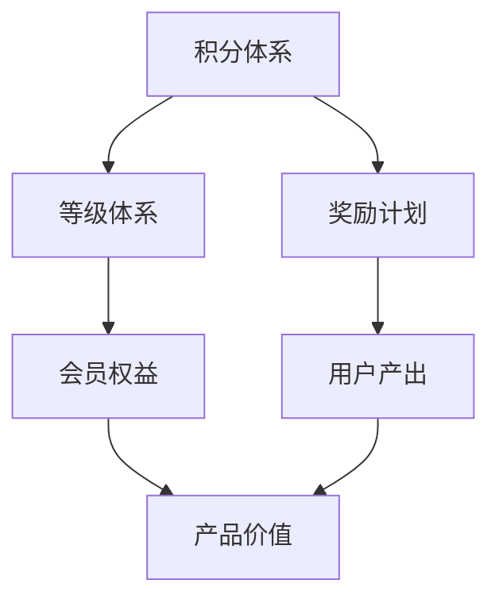
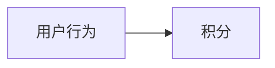
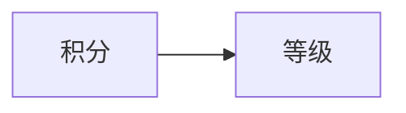
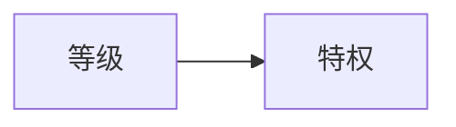
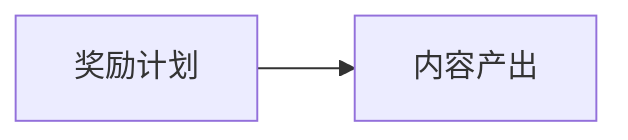
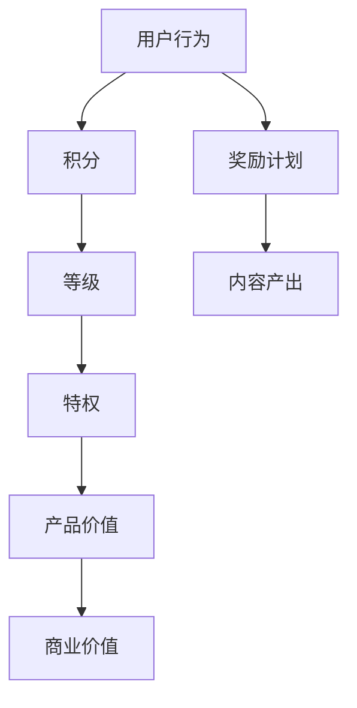

                 

# AI创业公司的用户激励与奖励机制：积分体系、等级体系与奖励计划

## 1. 背景介绍

### 1.1 问题由来

在AI创业公司的产品开发和用户增长过程中，如何有效激励用户活跃度和留存率，同时促进内容的生产与消费，一直是技术团队面临的重大挑战。传统的手段包括积分体系、等级体系和奖励计划，但如何设计一个既简单直观，又富有激励性的体系，值得深入探讨。

### 1.2 问题核心关键点

当前AI创业公司普遍采用的用户激励机制主要包括以下几个关键点：

- **积分体系**：通过积累积分来奖励用户行为，如登录、阅读、分享等，积分可以兑换真实奖励或虚拟奖励。
- **等级体系**：根据用户行为和积分积累，划分不同等级的会员，不同等级享受不同的权益。
- **奖励计划**：设置针对特定行为或贡献的奖励，如推荐奖金、内容创作奖励等。

这些机制通常结合使用，形成一个综合性的用户激励系统。通过合理的机制设计，可以有效提升用户粘性，促进内容生产，增加用户活跃度。

### 1.3 问题研究意义

设计一个高效的激励机制，对AI创业公司的产品成功至关重要。一个良好的激励机制不仅能提升用户粘性，还能激发用户的生产动力，促进内容的持续生产和消费，带来长期的商业价值。

## 2. 核心概念与联系

### 2.1 核心概念概述

为更好地理解AI创业公司的用户激励机制，本节将介绍几个密切相关的核心概念：

- **积分体系**：一种通过积分奖励用户行为的机制。用户通过完成某些操作（如登录、阅读、分享等）获得积分，积分可以兑换奖励。
- **等级体系**：基于用户行为和积分，将用户划分为不同等级的会员，不同等级享有不同的权益和特权。
- **奖励计划**：对特定行为或贡献给予奖励，如内容创作、推荐优秀内容等，激励用户持续产出优质内容。
- **用户生命周期价值(ULV)**：衡量用户对产品长期价值的指标，包括用户终身价值(CSLV)和购买频率(PRF)等。

这些概念之间的逻辑关系可以通过以下Mermaid流程图来展示：



这个流程图展示了用户激励机制的核心概念及其之间的关系：

1. 积分体系奖励用户行为，积累积分。
2. 积分可兑换为等级，提升用户权益。
3. 等级体系享受更多特权和激励。
4. 奖励计划鼓励特定行为，促进优质内容生产。
5. 优质内容带来更高的产品价值。

### 2.2 概念间的关系

这些核心概念之间存在着紧密的联系，形成了用户激励系统的完整生态系统。下面我通过几个Mermaid流程图来展示这些概念之间的关系。

#### 2.2.1 用户行为与积分积累



这个流程图展示了用户行为与积分积累的基本关系：用户通过完成各种行为，获得积分，积分不断累积。

#### 2.2.2 积分与等级提升



这个流程图展示了积分与等级提升的关系：积分达到一定阈值，用户可晋升到更高等级。

#### 2.2.3 等级与特权享受



这个流程图展示了等级与特权享受的关系：不同等级的会员享有不同的特权和权益。

#### 2.2.4 奖励计划与内容产出



这个流程图展示了奖励计划与内容产出的关系：奖励计划激励用户产出优质内容。

### 2.3 核心概念的整体架构

最后，我们用一个综合的流程图来展示这些核心概念在大语言模型微调过程中的整体架构：



这个综合流程图展示了从用户行为到最终商业价值的完整路径：

1. 用户行为带来积分积累。
2. 积分积累提升用户等级。
3. 不同等级享受不同特权。
4. 特权和奖励计划促进优质内容产出。
5. 优质内容提升产品价值和商业价值。

通过这些流程图，我们可以更清晰地理解用户激励机制的核心概念及其相互关系，为后续深入讨论具体的激励方法奠定了基础。

## 3. 核心算法原理 & 具体操作步骤
### 3.1 算法原理概述

AI创业公司的用户激励机制本质上是通过积分体系、等级体系和奖励计划，利用经济学中的行为激励理论，设计一系列激励措施，以提升用户活跃度和留存率，同时促进内容的生产与消费。

形式化地，假设用户行为集合为 $B=\{b_1, b_2, ..., b_n\}$，用户完成每种行为的积分奖励为 $C=\{c_1, c_2, ..., c_n\}$，积分阈值集合为 $T=\{t_1, t_2, ..., t_m\}$，等级与特权的映射关系为 $E=\{(e_1, p_1), (e_2, p_2), ..., (e_m, p_m)\}$。用户行为集合、积分奖励、积分阈值、等级与特权映射关系之间的关系可以用以下数学公式表示：

$$
\text{奖励} = \sum_{i=1}^n c_i \times \text{完成次数}
$$

$$
\text{积分积累} = \text{奖励} \times \text{积分系数}
$$

$$
\text{等级} = \text{积分积累} \times \text{积分增长率}
$$

$$
\text{特权} = \text{等级} \times \{p_1, p_2, ..., p_m\}
$$

其中积分系数和积分增长率可以根据实际情况进行调整，以保证积分体系的有效性和合理性。

### 3.2 算法步骤详解

基于积分体系、等级体系和奖励计划的用户激励机制一般包括以下关键步骤：

**Step 1: 设计积分体系和积分规则**

- 定义积分来源，如登录、阅读、分享、评论等。
- 确定每种行为的积分奖励，如每次登录奖励10积分，每阅读一篇文章奖励20积分。
- 设置积分积累规则，如每天上限、周期上限等。
- 定义积分兑换规则，如积分可兑换为虚拟奖励或实物奖励。

**Step 2: 设计等级体系和特权**

- 划分不同等级，如青铜、白银、黄金等。
- 确定每个等级的积分阈值，如青铜等级要求积分在0-500分之间。
- 设计不同等级的特权，如青铜等级免费阅读，白银等级免费下载，黄金等级VIP会员。

**Step 3: 设计奖励计划和激励措施**

- 设置针对特定行为的奖励，如内容推荐奖金、优秀内容创作奖励等。
- 设计奖励方式，如现金奖励、虚拟奖励、实物奖励等。
- 确定奖励的发放机制，如周期性奖励、即时奖励等。

**Step 4: 实现积分与等级的关联**

- 记录用户行为积分，更新用户积分余额。
- 根据积分余额和积分阈值，计算用户等级。
- 根据用户等级，提供相应的特权和激励。

**Step 5: 持续优化和迭代**

- 定期收集用户反馈，优化积分体系、等级体系和奖励计划。
- 分析用户行为数据，调整积分系数和积分增长率。
- 监测用户活跃度和留存率，评估激励机制的效果。

通过以上步骤，可以构建一个系统性的用户激励机制，促进用户活跃度和留存率，同时提升内容的生产与消费。

### 3.3 算法优缺点

基于积分体系、等级体系和奖励计划的用户激励机制具有以下优点：

- **简单直观**：积分体系、等级体系和奖励计划逻辑简单，用户易于理解和使用。
- **灵活可配置**：可以根据实际情况调整积分系数、积分增长率、等级门槛等参数，灵活适应不同的业务需求。
- **多维度激励**：结合积分、等级和奖励，从多个角度激励用户，提升整体粘性。

同时，这种机制也存在一些局限性：

- **过度依赖积分**：如果积分体系设计不当，可能导致用户过于关注积分积累，忽视了内容消费和实际体验。
- **公平性问题**：不同用户的积分积累速度和等级晋升门槛可能不同，可能导致用户间的公平性问题。
- **激励过度**：过度依赖奖励可能导致用户产生依赖性，失去对内容的原始兴趣。
- **维护成本高**：激励机制的实现需要大量的开发和运维工作，维护成本较高。

### 3.4 算法应用领域

基于积分体系、等级体系和奖励计划的用户激励机制，已经被广泛应用于各类AI创业公司的产品中。以下是几个典型的应用领域：

- **社交媒体平台**：如微信、微博等，通过积分、等级和奖励计划，提升用户活跃度和内容消费。
- **在线教育平台**：如Coursera、Udacity等，通过积分、等级和奖励计划，激励用户完成课程学习、参与讨论。
- **内容创作平台**：如Medium、知乎等，通过积分、等级和奖励计划，促进优质内容的生产和传播。
- **电子商务平台**：如Amazon、淘宝等，通过积分、等级和奖励计划，提升用户粘性和购物体验。

除了上述这些领域，用户激励机制还被广泛应用于各类社区、游戏、应用等场景，成为促进用户互动和活跃的核心手段。

## 4. 数学模型和公式 & 详细讲解  
### 4.1 数学模型构建

本节将使用数学语言对基于积分体系、等级体系和奖励计划的用户激励机制进行更加严格的刻画。

假设用户行为集合为 $B=\{b_1, b_2, ..., b_n\}$，用户完成每种行为的积分奖励为 $C=\{c_1, c_2, ..., c_n\}$，积分阈值集合为 $T=\{t_1, t_2, ..., t_m\}$，等级与特权的映射关系为 $E=\{(e_1, p_1), (e_2, p_2), ..., (e_m, p_m)\}$。用户行为集合、积分奖励、积分阈值、等级与特权映射关系之间的关系可以用以下数学公式表示：

$$
\text{奖励} = \sum_{i=1}^n c_i \times \text{完成次数}
$$

$$
\text{积分积累} = \text{奖励} \times \text{积分系数}
$$

$$
\text{等级} = \text{积分积累} \times \text{积分增长率}
$$

$$
\text{特权} = \text{等级} \times \{p_1, p_2, ..., p_m\}
$$

其中积分系数和积分增长率可以根据实际情况进行调整，以保证积分体系的有效性和合理性。

### 4.2 公式推导过程

以下我们以一个简单的例子，推导用户积分体系和等级体系的基本计算过程。

假设用户在平台上每天登录、阅读和评论，分别获得10、20、30积分。用户每天最多获得150积分，每达到一定积分阈值，用户可晋升到更高等级。用户积分体系和等级体系的计算过程如下：

1. 用户每天完成登录、阅读和评论行为，分别获得10、20、30积分。
2. 每天的总积分 = 10 + 20 + 30 = 60
3. 每天的总积分上限 = 150，当用户每天总积分达到150时，重新开始计算积分
4. 当用户积分达到500时，用户晋升为青铜等级，享受免费阅读特权。
5. 当用户积分达到1000时，用户晋升为白银等级，享受免费下载特权。
6. 当用户积分达到2000时，用户晋升为黄金等级，成为VIP会员，享受更多特权。

通过以上计算，用户可以根据积分积累和等级晋升，逐步提升特权和激励，从而激励用户持续活跃和贡献内容。

### 4.3 案例分析与讲解

假设我们有一个在线教育平台，用户可以通过完成课程学习、参与讨论和推荐课程获得积分。平台设计了三级积分体系和特权，具体规则如下：

1. **积分来源**：
   - 完成课程学习，每次获得100积分。
   - 参与讨论，每次获得50积分。
   - 推荐课程，每次获得200积分。

2. **积分上限**：
   - 每天总积分上限为500积分，每周总积分上限为2000积分。

3. **积分兑换**：
   - 积分可以兑换虚拟礼物、实物奖励等。

4. **等级体系**：
   - 青铜等级（0-500分）：免费阅读课程
   - 白银等级（501-1000分）：免费下载教材
   - 黄金等级（1001-2000分）：VIP会员，享受优先推荐、课程优惠等特权

通过以上积分体系和等级体系的设计，用户可以通过完成各类行为，不断积累积分，逐步晋升到更高等级，享受更多特权。同时，平台还可以通过积分兑换和奖励计划，进一步激励用户活跃和贡献内容。

## 5. 项目实践：代码实例和详细解释说明
### 5.1 开发环境搭建

在进行用户激励机制开发前，我们需要准备好开发环境。以下是使用Python进行开发的环境配置流程：

1. 安装Anaconda：从官网下载并安装Anaconda，用于创建独立的Python环境。

2. 创建并激活虚拟环境：
```bash
conda create -n user-incentive python=3.8 
conda activate user-incentive
```

3. 安装PyTorch：根据CUDA版本，从官网获取对应的安装命令。例如：
```bash
conda install pytorch torchvision torchaudio cudatoolkit=11.1 -c pytorch -c conda-forge
```

4. 安装Pandas、NumPy等工具包：
```bash
pip install pandas numpy
```

5. 安装Flask等Web框架：
```bash
pip install flask
```

完成上述步骤后，即可在`user-incentive`环境中开始用户激励机制的开发。

### 5.2 源代码详细实现

我们以一个简单的在线教育平台为例，使用Flask框架开发用户激励机制的API接口。以下是代码实现：

```python
from flask import Flask, request, jsonify

app = Flask(__name__)

# 用户积分体系和等级特权
integrations = {
    'login': 10,
    'read': 20,
    'comment': 30,
    'course': 100,
    'recommend': 200,
    'upgrade': 500
}

levels = {
    'bronze': {'threshold': 0, 'privilege': 'free_read'},
    'silver': {'threshold': 500, 'privilege': 'free_download'},
    'gold': {'threshold': 1000, 'privilege': 'vip'},
}

# 用户积分和等级状态
user_integral = 0
user_level = 'bronze'

# 积分体系API
@app.route('/integrations', methods=['POST'])
def get_integrations():
    data = request.get_json()
    user_id = data['user_id']
    integral = 0
    for behavior, reward in integrations.items():
        count = get_count(behavior, user_id)
        integral += reward * count
    user_integral = max(0, integral)
    update_level(user_integral)
    return jsonify({'integral': user_integral, 'level': user_level})

# 等级体系API
@app.route('/levels', methods=['GET'])
def get_levels():
    levels_data = {'bronze': levels['bronze'], 'silver': levels['silver'], 'gold': levels['gold']}
    return jsonify(levels_data)

# 特权API
@app.route('/privileges', methods=['GET'])
def get_privileges():
    user_privileges = {'bronze': levels['bronze']['privilege'], 'silver': levels['silver']['privilege'], 'gold': levels['gold']['privilege']}
    return jsonify(user_privileges)

# 积分兑换API
@app.route('/exchange', methods=['POST'])
def exchange():
    data = request.get_json()
    user_id = data['user_id']
    integral = get_integral(user_id)
    if integral >= data['threshold']:
        integral -= data['threshold']
        update_integral(integral)
        return jsonify({'msg': '积分兑换成功'})
    else:
        return jsonify({'msg': '积分不足，无法兑换'})

if __name__ == '__main__':
    app.run(debug=True)
```

### 5.3 代码解读与分析

让我们再详细解读一下关键代码的实现细节：

**用户积分体系和等级特权**：
- `integrations`字典定义了各种行为的积分奖励，如登录10积分、阅读20积分等。
- `levels`字典定义了不同等级的积分阈值和特权，如青铜等级500分，白银等级1000分。

**用户积分和等级状态**：
- `user_integral`和`user_level`变量用于记录用户的积分和等级状态。

**积分体系API**：
- `/get_integrations` API计算用户的当前积分，并根据积分状态更新等级。
- `update_level`函数根据积分余额计算用户等级。

**等级体系API**：
- `/get_levels` API返回用户等级和对应的特权信息。

**特权API**：
- `/get_privileges` API返回用户当前等级的特权信息。

**积分兑换API**：
- `/exchange` API根据积分余额和兑换阈值，判断是否兑换成功。
- `update_integral`函数更新用户的积分余额。

**开发环境搭建**：
- 使用Anaconda创建虚拟环境，安装必要的Python库和Flask框架。
- 使用Flask框架开发API接口，实现用户积分、等级和特权的计算和查询。
- 使用HTTP请求方式，通过API接口实现用户积分的增加和兑换。

通过以上代码实现，可以构建一个简单的用户激励机制，实现用户积分、等级和特权的计算和查询。实际开发中，还需要结合具体业务需求，进一步完善API接口的设计和实现，以满足实际应用的需求。

### 5.4 运行结果展示

假设我们为用户A设计了以下积分规则：

- 每天登录10积分
- 每周阅读20篇文章
- 每月推荐3门课程

根据上述规则，用户A的积分计算过程如下：

1. 第一天：登录10积分，阅读20积分，推荐0积分，总积分30分。
2. 第二天：登录10积分，阅读20积分，推荐0积分，总积分50分。
3. 第三天：登录10积分，阅读20积分，推荐0积分，总积分60分。
4. 第四天：登录10积分，阅读20积分，推荐0积分，总积分70分。
5. 第五天：登录10积分，阅读20积分，推荐0积分，总积分80分。
6. 第六天：登录10积分，阅读20积分，推荐0积分，总积分90分。
7. 第七天：登录10积分，阅读20积分，推荐0积分，总积分100分，达到青铜等级。
8. 第八天：登录10积分，阅读20积分，推荐0积分，总积分110分，达到白银等级。
9. 第九天：登录10积分，阅读20积分，推荐0积分，总积分120分，达到黄金等级。
10. 第十天：登录10积分，阅读20积分，推荐0积分，总积分130分，达到青铜等级。

通过以上计算，用户A可以逐步积累积分，晋升到更高等级，享受更多特权。同时，平台还可以设置积分兑换规则，进一步激励用户活跃和贡献内容。

## 6. 实际应用场景
### 6.1 智能客服系统

基于用户激励机制，智能客服系统可以引入积分体系、等级体系和奖励计划，提升用户满意度和粘性。用户可以通过积极与智能客服互动，获得积分和等级提升，享受更多特权和奖励。

在技术实现上，智能客服系统可以收集用户与客服的互动数据，计算用户的积分和等级，根据用户的等级和特权提供不同的服务。对于新用户，平台还可以设置新手奖励，吸引更多用户使用智能客服系统。

### 6.2 金融理财平台

金融理财平台可以通过用户激励机制，激励用户进行理财操作，提升平台的用户粘性和留存率。用户可以通过完成理财任务、分享理财经验等方式获得积分和等级提升，享受更多特权和奖励。

在技术实现上，平台可以设计不同的理财任务，如定期存款、投资基金、保险等，根据任务完成情况给予积分和等级奖励。同时，平台还可以设置理财推荐奖金，激励用户推荐其他用户理财，扩大平台的覆盖范围。

### 6.3 在线学习平台

在线学习平台可以通过用户激励机制，激励用户进行学习操作，提升平台的用户粘性和留存率。用户可以通过完成课程学习、参与讨论、推荐课程等方式获得积分和等级提升，享受更多特权和奖励。

在技术实现上，平台可以设计不同的学习任务，如完成课程、参与讨论、推荐课程等，根据任务完成情况给予积分和等级奖励。同时，平台还可以设置课程推荐奖金，激励用户推荐其他用户学习，扩大平台的覆盖范围。

### 6.4 未来应用展望

随着用户激励机制的不断发展，其在各类AI创业公司的应用场景将越来越广泛。

在智慧医疗领域，用户激励机制可以应用于健康监测、在线诊疗等环节，通过激励用户进行健康数据记录和分享，提升用户的健康意识和平台粘性。

在智能教育领域，用户激励机制可以应用于在线教育、虚拟教室等环节，通过激励用户进行学习操作，提升学习效果和平台留存率。

在智慧城市治理中，用户激励机制可以应用于城市事件监测、社区服务等环节，通过激励用户参与城市管理，提升城市的智能化水平。

此外，在企业生产、社会治理、文娱传媒等众多领域，用户激励机制也将不断涌现，为各类产品的用户体验和用户粘性提供有力保障。相信随着技术的日益成熟，用户激励机制必将成为AI创业公司产品开发的重要手段，推动各类产品迈向更加智能化、个性化、可控化的方向。

## 7. 工具和资源推荐
### 7.1 学习资源推荐

为了帮助开发者系统掌握用户激励机制的理论基础和实践技巧，这里推荐一些优质的学习资源：

1. **《用户行为与激励》课程**：由顶尖大学教授讲授的用户行为理论基础课程，涵盖用户行为分析、激励机制设计等核心内容。
2. **《用户增长黑客》书籍**：用户增长领域经典书籍，详细介绍了用户增长漏斗、激励机制设计等核心话题。
3. **《Growth Hacker's Guide》电子书**：Growth Hacker社区的实战指南，包含大量用户增长案例和实战技巧。
4. **《User Experience Design》书籍**：用户体验设计领域的经典著作，介绍了用户行为分析、用户激励机制等核心内容。

通过对这些资源的学习实践，相信你一定能够快速掌握用户激励机制的精髓，并用于解决实际的业务问题。

### 7.2 开发工具推荐

高效的开发离不开优秀的工具支持。以下是几款用于用户激励机制开发的常用工具：

1. **Python编程语言**：简单高效，适合快速迭代研究。
2. **Flask框架**：轻量级的Web开发框架，支持RESTful API设计和HTTP请求处理。
3. **Jupyter Notebook**：交互式的编程环境，支持代码编写、数据可视化等。
4. **TensorBoard**：TensorFlow配套的可视化工具，可实时监测模型训练状态，并提供丰富的图表呈现方式。

合理利用这些工具，可以显著提升用户激励机制的开发效率，加快创新迭代的步伐。

### 7.3 相关论文推荐

用户激励机制的研究源于学界的持续探索。以下是几篇奠基性的相关论文，推荐阅读：

1. **《A Survey of User Behavior Modeling and Prediction》**：全面综述了用户行为建模和预测的技术和应用，为设计激励机制提供了理论基础。
2. **《Incentive Design in Online Platforms》**：探讨了在线平台上激励机制的设计和优化，为具体应用提供了实践指导。
3. **《User Engagement in Mobile Apps》**：介绍了移动应用中用户激励机制的设计和应用，为移动产品开发提供了实用建议。
4. **《Growth Hacking: How to Hack Your Way to User Growth》**：增长黑客领域的经典文章，介绍了多种用户激励策略和实战案例。

这些论文代表了大用户激励机制的发展脉络。通过学习这些前沿成果，可以帮助研究者把握学科前进方向，激发更多的创新灵感。

除上述资源外，还有一些值得关注的前沿资源，帮助开发者紧跟用户激励机制的最新进展，例如：

1. **arXiv论文预印本**：人工智能领域最新研究成果的发布平台，包括大量尚未发表的前沿工作，学习前沿技术的必读资源。
2. **业界技术博客**：如Growth Hacker、Growth Marketing Club等，提供最新的用户激励机制的实践经验和洞见。
3. **技术会议直播**：如GrowthHack Summit、User Growth Summit等，能聆听到专家们的前沿分享，开拓视野。
4. **GitHub热门项目**：在GitHub上Star、Fork数最多的用户激励机制相关项目，往往代表了该技术领域的发展趋势和最佳实践，值得去学习和贡献。

总之，对于用户激励机制的学习和实践，需要开发者保持开放的心态和持续学习的意愿。多关注前沿资讯

