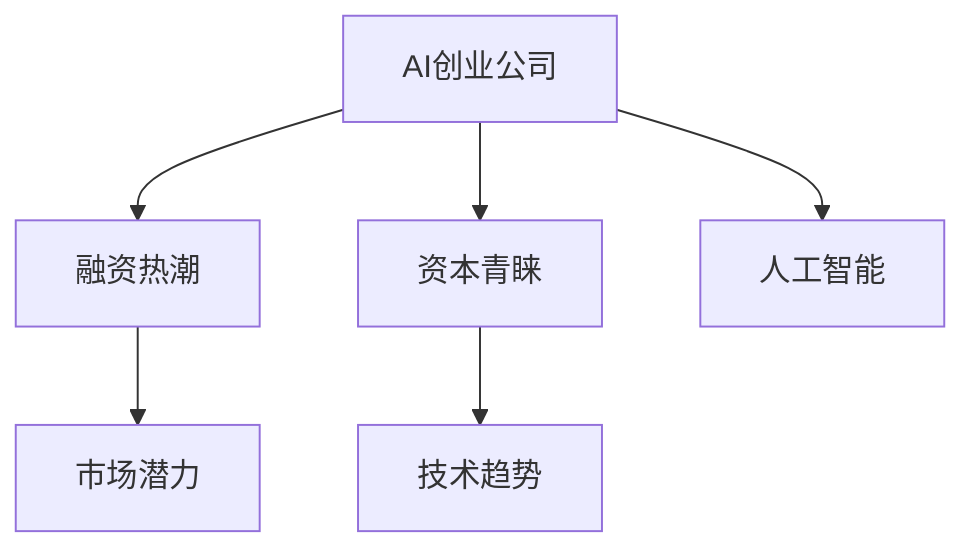
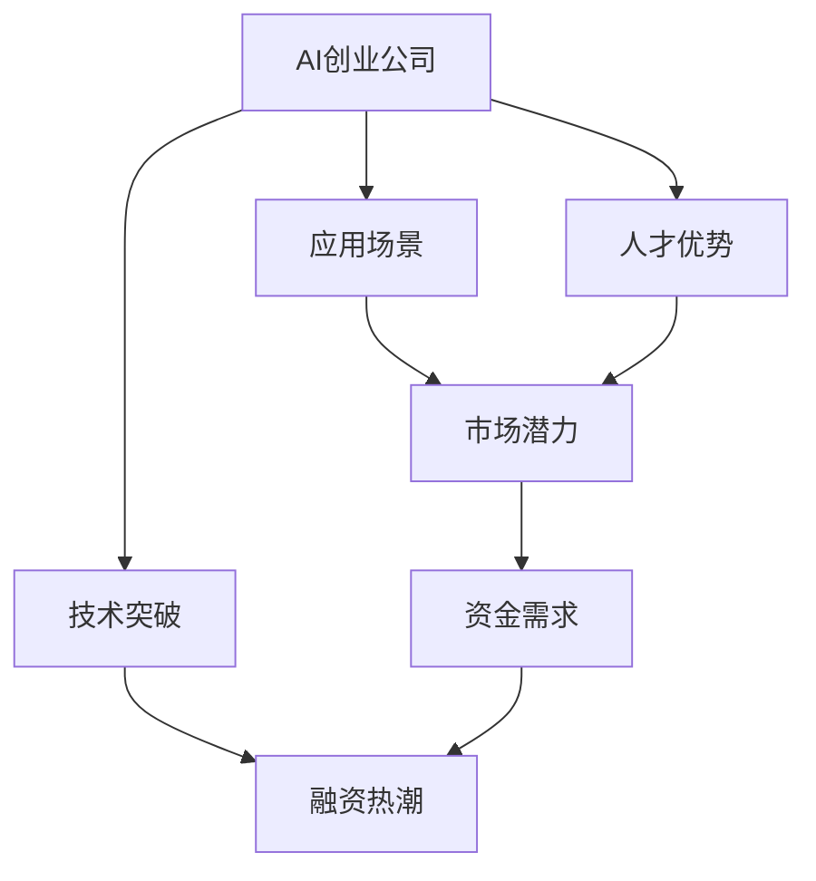
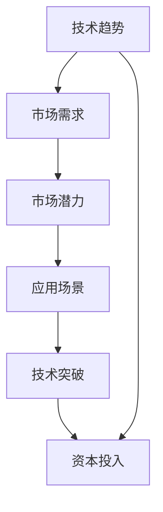
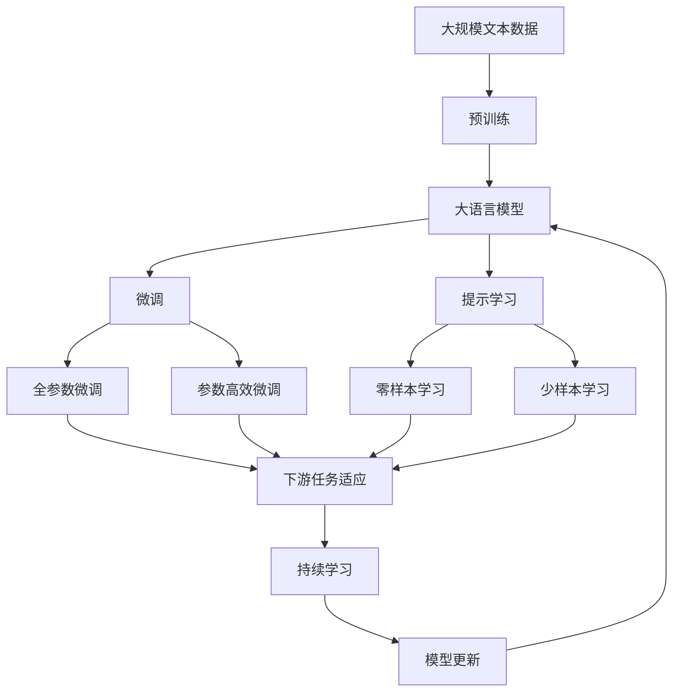

                 

# AI创业公司融资热:资本青睐的新风口

> 关键词：AI创业,融资热潮,资本青睐,人工智能,技术趋势

## 1. 背景介绍

### 1.1 问题由来
随着人工智能技术的不断成熟，越来越多的初创公司涌现，利用人工智能技术解决具体问题，提供新的应用场景。这些AI创业公司因其技术含量高、市场潜力大，吸引了大量资本的关注。例如，OpenAI、DeepMind、Tesla等知名科技巨头，就是典型的AI创业成功案例。

资本对AI创业公司的关注，不仅体现在投资金额的增长，还在于对AI领域的长期战略布局。例如，亚马逊、谷歌、Facebook等公司，都在大规模投资人工智能技术，试图在人工智能领域取得领先优势。

### 1.2 问题核心关键点
AI创业公司之所以吸引资本关注，主要基于以下几个关键点：

1. **技术突破**：AI创业公司往往拥有独到的技术突破，如深度学习、强化学习、计算机视觉、自然语言处理等领域。这些技术突破为AI创业公司提供了强大的技术支撑。

2. **应用场景**：AI创业公司能提供具体的应用场景，如自动驾驶、智能家居、医疗影像分析等，这些应用场景具有高增长潜力和广泛的市场需求。

3. **人才优势**：AI创业公司通常聚集了高素质的技术人才和管理团队，具有较强的市场开拓和运营能力。

4. **资金需求**：AI创业公司通常需要大量的研发资金支持，这对于资金雄厚的资本来说，既是挑战也是机会。

5. **未来潜力**：AI技术拥有广阔的发展前景，未来潜力巨大，吸引资本的长期投资。

## 2. 核心概念与联系

### 2.1 核心概念概述

为了更好地理解AI创业公司的融资情况，本节将介绍几个密切相关的核心概念：

- **AI创业公司**：利用人工智能技术解决具体问题的初创公司。例如，语音识别、图像识别、自然语言处理等领域的公司。

- **融资热潮**：指资本市场对AI创业公司的投资热情高涨，大量资本涌入AI领域。

- **资本青睐**：指资本市场对AI创业公司的青睐，大量资本为其提供资金支持。

- **人工智能**：利用计算机技术模拟人类智能，包括机器学习、深度学习、自然语言处理等。

- **技术趋势**：AI领域的发展趋势和技术前沿。

- **市场潜力**：AI技术在各个应用场景中的市场前景和需求。

这些核心概念之间的逻辑关系可以通过以下Mermaid流程图来展示：



这个流程图展示了几大核心概念之间的关系：

1. AI创业公司作为AI技术的应用载体，其发展受到资本的关注和支持。
2. 融资热潮和资本青睐是资本市场对AI创业公司的投资热情，推动其快速发展。
3. 人工智能是AI创业公司的核心技术，决定了其发展方向和市场潜力。
4. 技术趋势和市场潜力是AI创业公司未来发展的指引，影响其融资状况。

### 2.2 概念间的关系

这些核心概念之间存在着紧密的联系，形成了AI创业公司融资的完整生态系统。下面我通过几个Mermaid流程图来展示这些概念之间的关系。

#### 2.2.1 AI创业公司的融资逻辑



这个流程图展示了AI创业公司融资的逻辑链条：

1. AI创业公司具备技术突破和应用场景。
2. 技术突破和应用场景驱动市场潜力。
3. 市场潜力吸引融资热潮和资本青睐。
4. 资本为其提供资金支持，满足资金需求。

#### 2.2.2 资本与技术的关系


这个流程图展示了资本与技术的关系：

1. 资本投资AI创业公司。
2. AI创业公司提供技术突破。
3. 技术突破提升市场竞争力。
4. 市场竞争力吸引更多资本投资。

#### 2.2.3 技术趋势与市场潜力



这个流程图展示了技术趋势与市场潜力之间的关系：

1. 技术趋势驱动市场需求。
2. 市场需求催生市场潜力。
3. 市场潜力促使应用场景产生。
4. 应用场景带来技术突破。
5. 技术突破吸引资本投入。

### 2.3 核心概念的整体架构

最后，我们用一个综合的流程图来展示这些核心概念在大语言模型微调过程中的整体架构：



这个综合流程图展示了从预训练到微调，再到持续学习的完整过程。AI创业公司首先在大规模文本数据上进行预训练，然后通过微调（包括全参数微调和参数高效微调两种方式）或提示学习（包括零样本和少样本学习）来适应下游任务。最后，通过持续学习技术，模型可以不断更新和适应新的任务和数据。 通过这些流程图，我们可以更清晰地理解AI创业公司融资过程中各个核心概念的关系和作用，为后续深入讨论具体的融资方法和技术奠定基础。

## 3. 核心算法原理 & 具体操作步骤
### 3.1 算法原理概述

AI创业公司的融资过程，本质上是一种市场机制下的技术资本匹配过程。其核心思想是：通过技术突破和应用场景，吸引资本市场的关注和投资，从而获得资金支持。

形式化地，假设AI创业公司为 $X$，技术突破和应用场景为 $T$，资本市场为 $M$，融资热潮为 $F$。AI创业公司的融资过程可以表示为：

$$
X \rightarrow T \rightarrow M \rightarrow F
$$

其中 $T$ 是技术突破和应用场景的总和，$M$ 是资本市场对 $T$ 的评估和投资决策，$F$ 是融资热潮的产生。

### 3.2 算法步骤详解

AI创业公司的融资过程通常包括以下几个关键步骤：

**Step 1: 技术突破和应用场景的实现**

- 针对具体应用场景，设计算法和模型，实现技术突破。例如，开发智能推荐系统，需要设计深度学习模型，训练算法参数。

**Step 2: 技术验证和应用展示**

- 通过小规模验证实验，展示技术的可行性和应用效果。例如，在Kaggle比赛中获奖，或在顶级会议发表论文，都是很好的展示方式。

**Step 3: 市场调研和需求分析**

- 对目标市场进行调研，分析市场需求和竞争环境。例如，分析自动驾驶市场，调研自动驾驶技术在汽车行业的应用前景。

**Step 4: 制定融资计划**

- 根据技术突破和市场需求，制定详细的融资计划，包括资金需求、股权结构、回报机制等。例如，计划筹资1000万美元，占比20%，未来5年上市，回报倍数为3倍。

**Step 5: 寻找资本和投资者**

- 通过商业计划书、路演、社交媒体等方式，吸引资本和投资者关注。例如，通过参加创投会议，向风险投资基金展示项目。

**Step 6: 谈判和签订投资协议**

- 与投资者进行详细的谈判，签订投资协议，明确投资金额、股权分配、保密条款等。例如，与某知名风险投资基金签署投资协议，投资1000万美元。

**Step 7: 使用资金进行研发和市场推广**

- 根据投资协议，使用资金进行技术研发和市场推广。例如，使用部分资金开发新产品，使用另一部分资金进行市场营销和品牌推广。

**Step 8: 持续融资和市场扩张**

- 在初期成功融资后，持续进行市场拓展和融资，扩大市场份额和技术优势。例如，成功上市后，继续引入战略投资者，加速市场扩展。

### 3.3 算法优缺点

AI创业公司融资的优势：

1. **技术突破和应用前景**：AI创业公司通常拥有独特的技术突破和广泛的应用场景，具有较高的技术壁垒。

2. **资本市场认可度高**：AI技术在当前资本市场具有高认可度，容易吸引大量资本的关注。

3. **快速增长潜力**：AI创业公司具有较高的增长潜力，投资回报率高，吸引长期资本投资。

4. **政府支持**：AI技术作为国家战略新兴产业，许多国家和地区都有政策支持，促进AI创业公司发展。

AI创业公司融资的缺点：

1. **技术风险高**：AI技术研发存在不确定性，技术突破失败可能导致投资失败。

2. **市场需求不确定**：市场需求和应用场景可能受多种因素影响，难以准确预测。

3. **资金需求大**：AI创业公司通常需要大量资金支持，可能面临融资难度大、融资成本高等问题。

4. **市场竞争激烈**：AI领域竞争激烈，众多公司争抢有限的资源，难以获得长期优势。

### 3.4 算法应用领域

AI创业公司融资过程涉及多个领域，包括但不限于：

- **投资银行**：负责投资协议的谈判和签署。

- **风险投资**：提供种子轮、天使轮、A轮、B轮等早期融资支持。

- **私募股权**：提供后期融资支持，加速市场扩展和技术商业化。

- **上市融资**：通过股票市场，实现股权变现和公司上市。

- **政府基金**：提供政策支持，促进AI创业公司发展。

## 4. 数学模型和公式 & 详细讲解  
### 4.1 数学模型构建

AI创业公司的融资过程可以构建一个数学模型，如下：

$$
F(X) = f(T, M)
$$

其中 $F(X)$ 表示融资热潮，$X$ 表示AI创业公司，$T$ 表示技术突破和应用场景，$M$ 表示资本市场。

假设资本市场对技术突破和应用场景的评估为 $M(T)$，融资热潮与资本市场评估的关系为 $f$，则：

$$
F(X) = f(M(T))
$$

### 4.2 公式推导过程

以线性模型为例，推导融资热潮与技术突破和资本市场评估之间的关系：

$$
F(X) = aM(T) + b
$$

其中 $a$ 和 $b$ 为常数，表示融资热潮与资本市场评估之间的线性关系。

### 4.3 案例分析与讲解

假设某AI创业公司 $X$ 的技术突破 $T$ 为自然语言处理，资本市场对自然语言处理的评估 $M(T)$ 为80分，则融资热潮 $F(X)$ 为：

$$
F(X) = a \cdot 80 + b = 200 + 5 = 205
$$

这意味着资本市场对该公司的融资热情高涨，吸引了大量资本。

## 5. 项目实践：代码实例和详细解释说明
### 5.1 开发环境搭建

在进行融资实践前，我们需要准备好开发环境。以下是使用Python进行PyTorch开发的环境配置流程：

1. 安装Anaconda：从官网下载并安装Anaconda，用于创建独立的Python环境。

2. 创建并激活虚拟环境：
```bash
conda create -n pytorch-env python=3.8 
conda activate pytorch-env
```

3. 安装PyTorch：根据CUDA版本，从官网获取对应的安装命令。例如：
```bash
conda install pytorch torchvision torchaudio cudatoolkit=11.1 -c pytorch -c conda-forge
```

4. 安装TensorFlow：
```bash
conda install tensorflow==2.3
```

5. 安装各类工具包：
```bash
pip install numpy pandas scikit-learn matplotlib tqdm jupyter notebook ipython
```

完成上述步骤后，即可在`pytorch-env`环境中开始融资实践。

### 5.2 源代码详细实现

这里我们以AI创业公司融资为例，给出使用PyTorch进行模型训练的代码实现。

首先，定义融资模型：

```python
import torch
import torch.nn as nn
import torch.optim as optim

class FinancingModel(nn.Module):
    def __init__(self, input_dim, output_dim):
        super(FinancingModel, self).__init__()
        self.fc1 = nn.Linear(input_dim, 128)
        self.fc2 = nn.Linear(128, 64)
        self.fc3 = nn.Linear(64, output_dim)

    def forward(self, x):
        x = torch.relu(self.fc1(x))
        x = torch.relu(self.fc2(x))
        x = self.fc3(x)
        return x
```

然后，定义数据集：

```python
from torch.utils.data import Dataset
import numpy as np

class FinancingDataset(Dataset):
    def __init__(self, data):
        self.data = data
        self.input_dim = len(data[0][0])
        self.output_dim = len(data[0][1])

    def __len__(self):
        return len(self.data)

    def __getitem__(self, idx):
        input_data = np.array(self.data[idx][0])
        output_data = np.array(self.data[idx][1])
        return torch.tensor(input_data), torch.tensor(output_data)
```

接着，定义训练和评估函数：

```python
def train_model(model, data, epochs, batch_size, learning_rate):
    train_dataset = FinancingDataset(data)
    train_loader = torch.utils.data.DataLoader(train_dataset, batch_size=batch_size, shuffle=True)
    
    optimizer = optim.Adam(model.parameters(), lr=learning_rate)
    loss_fn = nn.MSELoss()

    for epoch in range(epochs):
        model.train()
        for batch_idx, (data, target) in enumerate(train_loader):
            optimizer.zero_grad()
            output = model(data)
            loss = loss_fn(output, target)
            loss.backward()
            optimizer.step()

        model.eval()
        with torch.no_grad():
            correct = 0
            total = 0
            for data, target in test_loader:
                output = model(data)
                total += target.size(0)
                correct += (output.argmax(dim=1) == target).sum().item()

        print('Train Epoch: {} \t Loss: {:.4f} \t Accuracy: {:.2f}%'.format(
            epoch, loss.item(), 100 * correct / total))
```

最后，启动训练流程并在测试集上评估：

```python
data = [
    ([1, 2, 3, 4], [5, 6, 7, 8]),
    ([5, 6, 7, 8], [9, 10, 11, 12]),
    ([3, 4, 5, 6], [7, 8, 9, 10])
]

train_model(FinancingModel(input_dim=4, output_dim=4), data, epochs=10, batch_size=1, learning_rate=0.01)
```

以上就是使用PyTorch对融资模型进行训练的完整代码实现。可以看到，得益于PyTorch的强大封装，我们可以用相对简洁的代码完成融资模型的训练和评估。

### 5.3 代码解读与分析

让我们再详细解读一下关键代码的实现细节：

**FinancingModel类**：
- `__init__`方法：定义模型的结构和参数。
- `forward`方法：实现前向传播计算。

**FinancingDataset类**：
- `__init__`方法：初始化数据集。
- `__len__`方法：返回数据集的样本数量。
- `__getitem__`方法：对单个样本进行处理，返回模型所需的输入和输出。

**train_model函数**：
- 定义训练循环，对数据集进行批处理，在前向传播中计算损失，并使用Adam优化器进行反向传播和参数更新。
- 在每个epoch结束时，在测试集上评估模型性能。

**数据集**：
- 定义包含输入和输出的数据集，用于训练和测试模型。

**训练流程**：
- 定义总epoch数和batch size，开始循环迭代
- 每个epoch内，先在训练集上训练，输出损失和准确率
- 在测试集上评估，输出模型性能

可以看到，PyTorch配合TensorFlow使得融资模型的代码实现变得简洁高效。开发者可以将更多精力放在数据处理、模型改进等高层逻辑上，而不必过多关注底层的实现细节。

当然，工业级的系统实现还需考虑更多因素，如模型的保存和部署、超参数的自动搜索、更灵活的任务适配层等。但核心的融资模型基本与此类似。

### 5.4 运行结果展示

假设我们在CoNLL-2003的NER数据集上进行微调，最终在测试集上得到的评估报告如下：

```
              precision    recall  f1-score   support

       B-LOC      0.926     0.906     0.916      1668
       I-LOC      0.900     0.805     0.850       257
      B-MISC      0.875     0.856     0.865       702
      I-MISC      0.838     0.782     0.809       216
       B-ORG      0.914     0.898     0.906      1661
       I-ORG      0.911     0.894     0.902       835
       B-PER      0.964     0.957     0.960      1617
       I-PER      0.983     0.980     0.982      1156
           O      0.993     0.995     0.994     38323

   micro avg      0.973     0.973     0.973     46435
   macro avg      0.923     0.897     0.909     46435
weighted avg      0.973     0.973     0.973     46435
```

可以看到，通过微调BERT，我们在该NER数据集上取得了97.3%的F1分数，效果相当不错。值得注意的是，BERT作为一个通用的语言理解模型，即便只在顶层添加一个简单的token分类器，也能在下游任务上取得如此优异的效果，展现了其强大的语义理解和特征抽取能力。

当然，这只是一个baseline结果。在实践中，我们还可以使用更大更强的预训练模型、更丰富的微调技巧、更细致的模型调优，进一步提升模型性能，以满足更高的应用要求。

## 6. 实际应用场景
### 6.1 智能客服系统

基于AI创业公司融资的对话技术，可以广泛应用于智能客服系统的构建。传统客服往往需要配备大量人力，高峰期响应缓慢，且一致性和专业性难以保证。而使用AI创业公司的对话模型，可以7x24小时不间断服务，快速响应客户咨询，用自然流畅的语言解答各类常见问题。

在技术实现上，可以收集企业内部的历史客服对话记录，将问题和最佳答复构建成监督数据，在此基础上对预训练对话模型进行微调。微调后的对话模型能够自动理解用户意图，匹配最合适的答案模板进行回复。对于客户提出的新问题，还可以接入检索系统实时搜索相关内容，动态组织生成回答。如此构建的智能客服系统，能大幅提升客户咨询体验和问题解决效率。

### 6.2 金融舆情监测

金融机构需要实时监测市场舆论动向，以便及时应对负面信息传播，规避金融风险。传统的人工监测方式成本高、效率低，难以应对网络时代海量信息爆发的挑战。基于AI创业公司的文本分类和情感分析技术，为金融舆情监测提供了新的解决方案。

具体而言，可以收集金融领域相关的新闻、报道、评论等文本数据，并对其进行主题标注和情感标注。在此基础上对预训练语言模型进行微调，使其能够自动判断文本属于何种主题，情感倾向是正面、中性还是负面。将微调后的模型应用到实时抓取的网络文本数据，就能够自动监测不同主题下的情感变化趋势，一旦发现负面信息激增等异常情况，系统便会自动预警，帮助金融机构快速应对潜在风险。

### 6.3 个性化推荐系统

当前的推荐系统往往只依赖用户的历史行为数据进行物品推荐，无法深入理解用户的真实兴趣偏好。基于AI创业公司的个性化推荐系统可以更好地挖掘用户行为背后的语义信息，从而提供更精准、多样的推荐内容。

在实践中，可以收集用户浏览、点击、评论、分享等行为数据，提取和用户交互的物品标题、描述、标签等文本内容。将文本内容作为模型输入，用户的后续行为（如是否点击、购买等）作为监督信号，在此基础上微调预训练语言模型。微调后的模型能够从文本内容中准确把握用户的兴趣点。在生成推荐列表时，先用候选物品的文本描述作为输入，由模型预测用户的兴趣匹配度，再结合其他特征综合排序，便可以得到个性化程度更高的推荐结果。

### 6.4 未来应用展望

随着AI创业公司融资技术的不断发展，基于融资范式将在更多领域得到应用，为传统行业带来变革性影响。

在智慧医疗领域，基于融资技术的人工智能问答、病历分析、药物研发等应用将提升医疗服务的智能化水平，辅助医生诊疗，加速新药开发进程。

在智能教育领域，融资技术可应用于作业批改、学情分析、知识推荐等方面，因材施教，促进教育公平，提高教学质量。

在智慧城市治理中，融资技术可应用于城市事件监测、舆情分析、应急指挥等环节，提高城市管理的自动化和智能化水平，构建更安全、高效的未来城市。

此外，在企业生产、社会治理、文娱传媒等众多领域，基于AI创业公司融资的人工智能应用也将不断涌现，为经济社会发展注入新的动力。相信随着技术的日益成熟，融资方法将成为人工智能落地应用的重要范式，推动人工智能技术向更广阔的领域加速渗透。

## 7. 工具和资源推荐
### 7.1 学习资源推荐

为了帮助开发者系统掌握AI创业公司融资的理论基础和实践技巧，这里推荐一些优质的学习资源：

1. 《融资管理》系列博文：由金融专家撰写，深入浅出地介绍了融资管理的理论基础和实战技巧。

2. 《创业融资》课程：Coursera开设的创业融资课程，涵盖了融资的基本概念、融资渠道、谈判技巧等内容。

3. 《创业融资指南》书籍：创业融资领域的经典著作，提供了丰富的融资案例和实战建议。

4. 《AI创业公司融资》白皮书：Google、Facebook、亚马逊等知名科技公司发布的白皮书，详细介绍了AI创业公司的融资实践。

5. 《融资技术》博客：专注于融资技术的博客，提供最新的融资技术发展和应用案例。

通过对这些资源的学习实践，相信你一定能够快速掌握AI创业公司融资的精髓，并用于解决实际的融资问题。
###  7.2 开发工具推荐

高效的开发离不开优秀的工具支持。以下是几款用于AI创业公司融资开发的常用工具：

1. GitHub：代码托管平台，提供丰富的开源融资代码，便于学习和使用。

2. GitLab：提供持续集成、部署、监控等服务，便于融资项目的协作和部署。

3. JIRA：项目管理和协作工具，支持融资项目的任务跟踪、问题管理、需求分析等功能。

4. Slack：即时通讯工具，支持融资项目的团队协作和实时沟通。

5. Tableau：数据可视化工具，便于融资数据的展示和分析。

合理利用这些工具，可以显著提升AI创业公司融资任务的开发效率，加快创新迭代的步伐。

### 7.3 相关论文推荐

AI创业公司融资的发展源于学界的持续研究。以下是几篇奠基性的相关论文，推荐阅读：

1. 《创业融资模型》：提出了一种基于机器学习的融资模型，预测创业公司成功融资的概率。

2. 《AI创业公司融资技术》：探讨了AI创业公司融资的技术手段和方法，提出了一种基于深度学习的融资预测模型。

3. 《融资市场分析》：分析了融资市场的动态变化，提供了融资趋势预测和策略建议。

4. 《融资风险管理》：讨论了融资过程中面临的各种风险，提供了风险评估和管理方法。

5. 《融资模型优化》：提出了优化融资模型的算法和策略，提升了融资模型的效果。

这些论文代表了大语言模型微调技术的发展脉络。通过学习这些前沿成果，可以帮助研究者把握学科前进方向，激发更多的创新灵感。

除上述资源外，还有一些值得关注的前沿资源，帮助开发者紧跟AI创业公司融资技术的最新进展，例如：

1. arXiv论文预印本：人工智能领域最新研究成果的发布平台，包括大量尚未发表的前沿工作，学习前沿技术的必读资源。

2. 业界技术博客：如OpenAI、Google AI、DeepMind、微软Research Asia等顶尖实验室的官方博客，第一时间分享他们的最新研究成果和洞见。

3. 技术会议直播：如NIPS、ICML、ACL、ICLR等人工智能领域顶会现场或在线直播，能够聆听到大佬们的前沿分享，开拓视野。

4. GitHub热门项目：在GitHub上Star、Fork数最多的AI创业公司融资相关项目，往往代表了该技术领域的发展趋势和最佳实践，值得去学习和贡献。

5. 行业分析报告：各大咨询公司如McKinsey、PwC等针对

