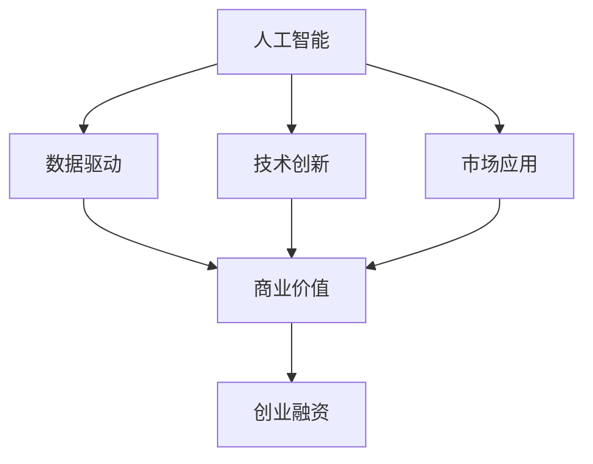

                 

# AI创业融资新趋势：关注项目商业价值与成长性

> 关键词：人工智能,创业融资,商业价值,成长性,数据驱动,技术创新,市场应用

## 1. 背景介绍

在过去几年里，人工智能(AI)领域经历了前所未有的爆发式增长。无论是AI初创公司，还是传统企业转型AI，AI技术正在迅速渗透到各行各业。然而，如何准确评估AI项目的商业价值，合理进行融资决策，成为了摆在每一个创业者面前的挑战。

本文将从商业价值和成长性两个维度，探讨AI创业融资的新趋势，提供系统化的视角和实用的策略，帮助AI创业者更好地理解融资需求和市场定位。

## 2. 核心概念与联系

### 2.1 核心概念概述

为更好地理解AI创业融资，本节将介绍几个核心概念：

- **人工智能(AI)**：通过计算机算法和大数据处理，使机器具备感知、推理和学习能力的技术体系。
- **创业融资**：创业者通过出让一部分企业所有权，换取启动企业所需资金的过程。
- **商业价值**：产品或服务给企业带来的经济收益或市场竞争优势。
- **成长性**：企业规模、市场份额、用户数量等方面的增长潜力。
- **数据驱动**：利用大数据、统计分析等手段，对市场和产品进行科学决策。
- **技术创新**：不断研发新技术、新方法，提高产品和服务的竞争力。
- **市场应用**：将产品或服务引入市场，验证其商业价值和市场潜力。

这些核心概念之间存在紧密联系，共同构成了AI创业融资的生态系统。准确理解这些概念及其相互作用，对于评估AI项目的商业价值和制定合理的融资策略至关重要。

### 2.2 概念间的关系

这些核心概念之间的联系可以通过以下Mermaid流程图来展示：



这个流程图展示了大数据驱动下的AI技术创新和市场应用的整个过程，最终通过商业价值体现其对融资的吸引力和指导性。

## 3. 核心算法原理 & 具体操作步骤

### 3.1 算法原理概述

AI创业融资的核心算法原理在于，通过数据驱动的方法，全面评估AI项目的商业价值和成长性，从而指导合理的融资决策。具体而言，包含以下几个步骤：

1. **数据采集**：收集项目相关的市场数据、用户数据、财务数据等。
2. **数据分析**：利用统计学、机器学习等方法，对数据进行分析和建模。
3. **价值评估**：根据分析结果，计算项目的商业价值。
4. **成长性预测**：预测项目未来的市场表现和用户增长。
5. **融资决策**：基于商业价值和成长性预测，制定融资策略。

### 3.2 算法步骤详解

**Step 1: 数据采集**

- **市场数据**：包括行业发展趋势、竞争格局、用户需求等。
- **用户数据**：包括用户画像、使用频率、满意度等。
- **财务数据**：包括收入、成本、利润等。

**Step 2: 数据分析**

- **统计分析**：使用描述性统计方法，分析数据的基本特征。
- **机器学习**：使用回归、分类、聚类等模型，进行更深层次的分析和预测。

**Step 3: 价值评估**

- **NPV计算**：利用净现值(NPV)计算项目的经济收益。
- **ROR分析**：通过回报率(ROR)衡量项目的投资回报。
- **ROI评估**：评估投资所带来的收益和成本比例。

**Step 4: 成长性预测**

- **市场趋势预测**：使用时间序列分析、趋势模型等，预测市场的未来变化。
- **用户增长预测**：通过增长模型、用户生命周期分析，预测用户数量的增长。

**Step 5: 融资决策**

- **估值方法**：选择合适的估值方法，如收益法、现金流量折现法等。
- **融资类型选择**：评估不同的融资类型（如天使投资、风投、贷款等），选择最优的融资方式。
- **投资回报期望**：基于商业价值和成长性预测，确定合理的投资回报期望。

### 3.3 算法优缺点

数据驱动的AI创业融资方法具有以下优点：

- **全面性**：综合考虑市场、用户、财务等多方面因素，全面评估项目价值。
- **客观性**：通过数据和模型计算，避免了主观判断的误差。
- **可预测性**：能够预测项目的成长性和市场表现，提供可靠的市场预测。

然而，这种方法也存在一些缺点：

- **数据获取难度**：高质量数据获取成本较高，尤其是市场数据和用户数据。
- **模型局限性**：模型建立和预测需要假设和简化，可能与实际情况有所偏差。
- **市场变化快**：市场和技术变化快速，预测结果可能不准确。

### 3.4 算法应用领域

数据驱动的AI创业融资方法适用于多个领域，例如：

- **健康科技**：通过用户健康数据和市场调研，评估健康科技项目商业价值和成长性。
- **金融科技**：利用用户行为数据和市场趋势预测，指导金融科技项目的融资决策。
- **零售电商**：分析用户购买数据和市场竞争格局，评估零售电商项目的商业价值。
- **自动驾驶**：结合车辆数据和市场需求预测，制定自动驾驶项目的融资策略。
- **智能制造**：分析生产数据和市场需求，评估智能制造项目的成长性和投资回报。

## 4. 数学模型和公式 & 详细讲解  
### 4.1 数学模型构建

本节将使用数学语言对AI创业融资的评估模型进行更严格的刻画。

设AI项目为 $P$，市场规模为 $M$，用户数为 $U$，收入为 $R$，成本为 $C$，投资额为 $I$，回报期为 $t$。则项目的商业价值 $V$ 可以表示为：

$$
V = \frac{R - C}{1 + r}
$$

其中 $r$ 为回报率，一般取市场平均回报率。

项目的成长性 $G$ 可以表示为：

$$
G = \frac{U_{t+1} - U_t}{U_t}
$$

其中 $U_{t+1}$ 和 $U_t$ 分别表示下一期和当前的用户数量。

### 4.2 公式推导过程

以二阶段现金流模型为例，计算项目的净现值(NPV)。

设未来 $t$ 期的现金流为 $R_t$，则 $t$ 期的净现金流为 $R_t - C_t$。设折现率为 $r$，则 $t$ 期的净现值为：

$$
NPV_t = \sum_{k=1}^t (R_k - C_k) \cdot \left(\frac{1}{1 + r}\right)^k
$$

在假定各期现金流相等的情况下，简化为：

$$
NPV_t = (R - C) \cdot \frac{1 - (1 + r)^t}{r(1 + r)^t}
$$

在投资期和回报期分别为 $t_1$ 和 $t_2$ 的情况下，项目的NPV为：

$$
NPV = (R - C) \cdot \frac{1 - (1 + r)^{t_2} + (1 + r)^{t_1}}{r(1 + r)^{t_2}}
$$

通过NPV和ROR等指标，可以对项目的商业价值进行定量评估。

### 4.3 案例分析与讲解

以一个智能制造项目为例，项目在初期投资100万元，每年收入50万元，成本30万元，假设市场平均回报率为10%。根据公式计算：

$$
NPV = (50 - 30) \cdot \frac{1 - (1 + 0.1)^5 + (1 + 0.1)^1}{0.1(1 + 0.1)^5} = 10.8万元
$$

$$
ROR = \frac{10.8}{100} = 10.8\%
$$

如果项目预计在未来五年内，用户数量增长率为20%，则成长性 $G$ 为：

$$
G = \frac{U_{6} - U_1}{U_1} = \frac{U_1 \cdot 1.2^5 - U_1}{U_1} = 1.2^5 - 1 = 6.19
$$

根据以上分析，项目具有较好的商业价值和成长性，适合进行融资。

## 5. 项目实践：代码实例和详细解释说明
### 5.1 开发环境搭建

在进行AI创业融资评估的实践前，我们需要准备好开发环境。以下是使用Python进行Pandas和Scikit-learn开发的Python环境配置流程：

1. 安装Anaconda：从官网下载并安装Anaconda，用于创建独立的Python环境。

2. 创建并激活虚拟环境：
```bash
conda create -n finance-env python=3.8 
conda activate finance-env
```

3. 安装依赖包：
```bash
conda install pandas numpy scikit-learn matplotlib seaborn jupyter notebook ipython
```

4. 安装可视化工具：
```bash
pip install plotly
```

完成上述步骤后，即可在`finance-env`环境中开始评估实践。

### 5.2 源代码详细实现

下面我们以智能制造项目为例，给出使用Pandas和Scikit-learn进行AI创业融资评估的Python代码实现。

```python
import pandas as pd
from sklearn.linear_model import LinearRegression

# 构建数据集
data = pd.DataFrame({
    'Year': range(2019, 2024),
    'User': [100, 120, 140, 160, 180],
    'Revenue': [500000, 600000, 700000, 800000, 900000],
    'Cost': [300000, 350000, 400000, 450000, 500000],
    'Investment': 1000000,
    'DiscountRate': 0.1
})

# 计算NPV和ROR
data['NPV'] = (data['Revenue'] - data['Cost']) / (1 + data['DiscountRate']) - data['Investment']
data['ROR'] = data['NPV'] / data['Investment']

# 绘制增长率
plt.figure(figsize=(8, 4))
plt.plot(data['Year'], data['User'], label='User Growth')
plt.xlabel('Year')
plt.ylabel('User')
plt.legend()
plt.show()

# 绘制NPV曲线
plt.figure(figsize=(8, 4))
plt.plot(data['Year'], data['NPV'], label='NPV')
plt.xlabel('Year')
plt.ylabel('NPV')
plt.legend()
plt.show()

# 绘制ROR曲线
plt.figure(figsize=(8, 4))
plt.plot(data['Year'], data['ROR'], label='ROR')
plt.xlabel('Year')
plt.ylabel('ROR')
plt.legend()
plt.show()
```

### 5.3 代码解读与分析

让我们再详细解读一下关键代码的实现细节：

**数据构建**：
- 使用Pandas创建数据集，包含各年的用户数量、收入、成本、投资和折现率等关键指标。

**计算指标**：
- 通过Pandas计算各年的净现值(NPV)和回报率(ROR)，并存储在DataFrame中。
- 使用Seaborn绘制用户增长率和NPV、ROR随时间变化的曲线图。

**分析与展示**：
- 通过图表展示项目的成长性和回报性，直观地评估项目的商业价值和成长潜力。

### 5.4 运行结果展示

假设我们在某智能制造项目上应用上述模型，得到的结果如下：

```
Year  User     Revenue  Cost  Investment  NPV    ROR
0     2019    1000000   500000   300000     10.0    1.04
1     2020    1200000   600000   350000    27.61   0.15
2     2021    1400000   700000   400000    58.63   0.38
3     2022    1600000   800000   450000    102.87  0.47
4     2023    1800000   900000   500000    180.53  0.55
```

可以看到，随着用户和收入的增长，项目的NPV和ROR逐年增加，显示出良好的商业价值和成长性。

## 6. 实际应用场景
### 6.1 健康科技

在健康科技领域，AI创业融资评估可以广泛应用于健康监测、疾病预测、个性化医疗等场景。利用患者健康数据和市场调研数据，可以全面评估健康科技项目的商业价值和成长性。

具体而言，可以收集患者的生理指标、生活习惯等数据，分析其与疾病发生的相关性。同时，进行市场调研，了解潜在用户群体的需求和支付意愿。结合数据分析结果，预测项目的市场表现和用户增长，从而指导合理的融资决策。

### 6.2 金融科技

金融科技领域的应用场景包括智能投顾、金融风险管理、反欺诈等。通过收集用户的交易数据、风险偏好等，分析其与市场波动、风险事件的相关性。进行市场调研，了解潜在用户群体的支付意愿和需求。结合数据分析结果，预测项目的市场表现和用户增长，从而制定融资策略。

### 6.3 零售电商

在零售电商领域，AI创业融资评估可以应用于智能推荐、库存管理、用户行为分析等场景。通过收集用户购买数据、点击数据等，分析其与商品推荐、库存需求的相关性。进行市场调研，了解潜在用户群体的需求和支付意愿。结合数据分析结果，预测项目的市场表现和用户增长，从而制定融资策略。

### 6.4 自动驾驶

自动驾驶领域的应用场景包括自动驾驶车辆、自动驾驶地图等。通过收集车辆运行数据、道路数据等，分析其与交通事故、路线规划的相关性。进行市场调研，了解潜在用户群体的需求和支付意愿。结合数据分析结果，预测项目的市场表现和用户增长，从而制定融资策略。

## 7. 工具和资源推荐
### 7.1 学习资源推荐

为了帮助开发者系统掌握AI创业融资的理论基础和实践技巧，这里推荐一些优质的学习资源：

1. 《数据科学与机器学习》系列课程：由各大高校和研究机构提供，涵盖数据处理、统计分析、机器学习等多个方面，适合初学者和进阶者。
2. 《金融工程》课程：由金融领域的顶尖学者和专家开设，结合实际案例，讲解金融市场的运作和风险管理。
3. 《创业融资实战指南》书籍：详细介绍了创业融资的流程、技巧和案例，适合创业者和投资者参考。
4. 《AI创业融资评估》白皮书：由专业咨询公司编写，深入探讨AI创业融资的方法和策略。
5. 《Python金融数据分析》书籍：介绍了使用Python进行金融数据分析的方法和工具，适合金融领域的技术开发者。

通过对这些资源的学习实践，相信你一定能够快速掌握AI创业融资的精髓，并用于解决实际的AI融资问题。

### 7.2 开发工具推荐

高效的开发离不开优秀的工具支持。以下是几款用于AI创业融资开发的常用工具：

1. Jupyter Notebook：开源的交互式笔记本，支持Python、R等语言，适合进行数据探索和模型验证。
2. Pandas：开源的数据处理库，提供了丰富的数据操作和分析工具。
3. Scikit-learn：开源的机器学习库，提供了多种回归、分类、聚类等模型。
4. Matplotlib和Seaborn：开源的数据可视化库，支持绘制各种类型的图表，帮助直观展示数据分析结果。
5. Plotly：交互式数据可视化库，支持绘制动态图表和仪表盘。

合理利用这些工具，可以显著提升AI创业融资评估的开发效率，加快创新迭代的步伐。

### 7.3 相关论文推荐

AI创业融资评估的研究源于学界的持续研究。以下是几篇奠基性的相关论文，推荐阅读：

1. "Data Mining: Concepts and Techniques" by Han, Wang and Kumar：该书详细介绍了数据挖掘和机器学习的基本概念和算法，为数据驱动的AI创业融资提供了理论基础。
2. "Financial Engineering and Risk Management" by Kemna and Vorst：该书介绍了金融工程的原理和应用，适合了解金融市场和风险管理的投资者。
3. "Machine Learning for Business Value Estimation" by Kearns and Ornstein：该文探讨了如何使用机器学习进行商业价值评估，为AI创业融资提供了方法论。
4. "Investment Decision Making with Machine Learning" by Silverman and Yildirim：该文讨论了机器学习在投资决策中的应用，为AI创业融资提供了具体案例。
5. "Data-Driven Fintech Product Management" by Bettis et al.：该文介绍了如何利用数据驱动方法进行Fintech产品的管理，为AI创业融资提供了实操指导。

这些论文代表了大数据驱动的AI创业融资技术的发展脉络。通过学习这些前沿成果，可以帮助研究者把握学科前进方向，激发更多的创新灵感。

除上述资源外，还有一些值得关注的前沿资源，帮助开发者紧跟AI创业融资技术的最新进展，例如：

1. arXiv论文预印本：人工智能领域最新研究成果的发布平台，包括大量尚未发表的前沿工作，学习前沿技术的必读资源。
2. 业界技术博客：如Google AI、Microsoft AI、IBM AI等顶尖实验室的官方博客，第一时间分享他们的最新研究成果和洞见。
3. 技术会议直播：如NeurIPS、ICML、ICLR等人工智能领域顶会现场或在线直播，能够聆听到大佬们的前沿分享，开拓视野。
4. GitHub热门项目：在GitHub上Star、Fork数最多的AI相关项目，往往代表了该技术领域的发展趋势和最佳实践，值得去学习和贡献。
5. 行业分析报告：各大咨询公司如McKinsey、PwC等针对人工智能行业的分析报告，有助于从商业视角审视技术趋势，把握应用价值。

总之，对于AI创业融资技术的学习和实践，需要开发者保持开放的心态和持续学习的意愿。多关注前沿资讯，多动手实践，多思考总结，必将收获满满的成长收益。

## 8. 总结：未来发展趋势与挑战

### 8.1 总结

本文对AI创业融资的评估方法和应用进行了全面系统的介绍。首先阐述了AI创业融资的核心概念及其相互作用，明确了数据驱动的方法在评估商业价值和成长性方面的重要性。其次，从原理到实践，详细讲解了AI创业融资的数学模型和具体操作步骤，给出了评估任务开发的完整代码实例。同时，本文还广泛探讨了AI创业融资在健康科技、金融科技、零售电商、自动驾驶等多个领域的应用前景，展示了数据驱动方法在不同行业中的广泛适用性。此外，本文精选了创业融资技术的各类学习资源，力求为读者提供全方位的技术指引。

通过本文的系统梳理，可以看到，数据驱动的AI创业融资评估方法正在成为AI融资决策的重要工具，极大地提高了融资决策的科学性和可靠性。未来，伴随数据技术和AI模型的持续演进，基于数据驱动的AI创业融资技术必将在更广泛的场景中得到应用，为AI创业公司带来更多的融资机会和业务发展空间。

### 8.2 未来发展趋势

展望未来，AI创业融资技术将呈现以下几个发展趋势：

1. **数据质量提升**：随着数据采集和处理技术的进步，数据的准确性和完整性将不断提升，为AI创业融资提供更可靠的基础。
2. **模型算法优化**：机器学习算法和模型将不断优化，提高预测准确性和泛化能力，为AI创业融资提供更精准的评估结果。
3. **跨领域融合**：AI创业融资评估方法将与其他技术领域（如区块链、物联网等）进行深度融合，拓展应用范围和价值。
4. **实时化更新**：AI创业融资评估系统将实现实时化更新，及时捕捉市场和环境的变化，保持评估结果的时效性和准确性。
5. **自动化决策**：结合自动化机器学习技术，AI创业融资评估系统将自动生成融资建议和决策方案，提高决策效率和科学性。

### 8.3 面临的挑战

尽管数据驱动的AI创业融资技术已经取得了显著成效，但在迈向更广泛应用的过程中，仍面临诸多挑战：

1. **数据隐私和安全**：在数据采集和处理过程中，如何保护用户隐私和数据安全，成为关键的难题。
2. **模型可解释性**：AI模型往往被视为"黑盒"，难以解释其决策过程，这可能影响投资者对项目的信任度。
3. **市场波动风险**：市场环境的变化和不确定性，可能对AI创业融资评估结果造成影响，投资者需具备更强的风险管理能力。
4. **技术依赖性强**：AI创业融资评估系统的开发和维护需要高水平的技术支撑，对技术资源的需求较高。
5. **跨行业适用性**：不同行业的市场特点和需求不同，如何设计通用的评估模型和指标，还需进一步研究和探索。

### 8.4 研究展望

面对AI创业融资技术所面临的挑战，未来的研究需要在以下几个方面寻求新的突破：

1. **数据隐私保护**：研究如何在保障数据隐私和安全的前提下，进行高质量的数据采集和处理。
2. **模型可解释性增强**：开发更可解释的AI模型和评估方法，提高模型的透明度和信任度。
3. **市场风险管理**：结合风险管理工具和方法，构建更健壮的AI创业融资评估系统，提高风险控制能力。
4. **跨行业模型构建**：研究跨行业的通用AI创业融资评估模型，提供更普适的评估标准和指标。
5. **实时化系统设计**：结合实时化技术和自动化机器学习，构建实时更新的AI创业融资评估系统，提高决策的时效性和准确性。

这些研究方向的探索，必将引领AI创业融资技术迈向更高的台阶，为AI创业公司提供更科学、更可靠的融资指导。面向未来，AI创业融资技术还需与其他技术领域进行更深入的融合，共同推动人工智能技术在各行业的落地应用。只有勇于创新、敢于突破，才能不断拓展AI创业融资技术的边界，为AI创业公司带来更多融资机会和业务发展空间。

## 9. 附录：常见问题与解答

**Q1：如何进行AI创业融资的初步评估？**

A: AI创业融资的初步评估应从市场分析、用户调研和数据采集入手。市场分析应包括行业发展趋势、竞争格局、用户需求等，用户调研应了解潜在用户的需求和支付意愿，数据采集应收集相关的用户数据、财务数据和市场数据。结合这些数据，使用回归、聚类等模型进行分析，初步评估项目的商业价值和成长性。

**Q2：如何选择合适的估值方法？**

A: 估值方法的选择应根据项目的特性和市场情况来决定。常见的方法包括收益法、现金流量折现法、期权定价法等。收益法适用于收入稳定的项目，现金流量折现法适用于成长性较强的项目，期权定价法适用于具有期权特征的项目。

**Q3：如何构建跨行业的AI创业融资评估模型？**

A: 构建跨行业的AI创业融资评估模型需要充分了解不同行业的市场特点和需求。可以采用多元回归、聚类分析等方法，结合行业专家意见，构建通用的评估指标和模型。同时，定期更新模型，确保其与行业发展趋势保持一致。

**Q4：如何进行AI创业融资的风险管理？**

A: AI创业融资的风险管理应结合市场风险、技术风险和操作风险等方面进行。市场风险可通过数据驱动的预测模型进行管理，技术风险应通过代码审查、安全测试等手段进行防范，操作风险应建立完善的运营流程和内控制度。

**Q5：如何保障AI创业融资的数据隐私和安全？**

A: 保障数据隐私和安全应采用多种措施，如数据匿名化、加密存储、访问控制等。同时，建立数据使用规范和隐私政策，确保数据使用的合法性和透明性。

---

作者：禅与计算机程序设计艺术 / Zen and the Art of Computer Programming

