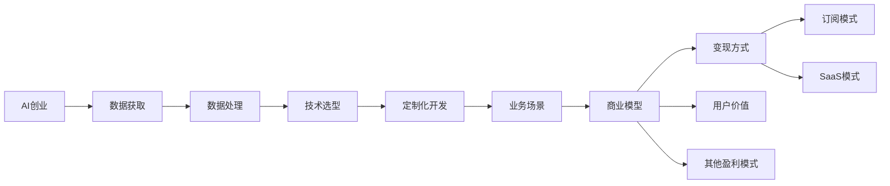
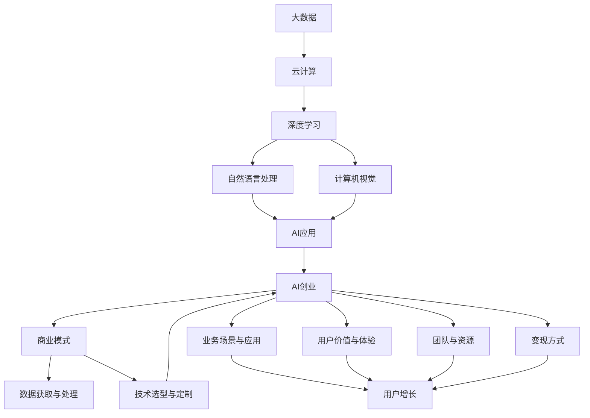

                 

# AI创业：商业模式分析

> 关键词：人工智能, 商业模型, 创业, 商业模式设计, 数据驱动, 技术创业, 商业价值

## 1. 背景介绍

### 1.1 问题由来
在人工智能(AI)技术蓬勃发展的今天，AI创业已经成为热点话题。AI技术尤其是深度学习和大数据技术，正在驱动各行业的数字化转型升级，催生了大量基于AI的新兴商业模式。传统产业亟需AI技术进行赋能，AI创业成为创新增长的重要引擎。

AI创业涉及大数据、云计算、自然语言处理、计算机视觉等多个领域，技术复杂、生态庞大。如何设计有效的AI商业模式，快速实现技术落地，高效获取商业价值，成为AI创业的关键。

### 1.2 问题核心关键点
AI商业模式的核心关键点在于如何结合AI技术，创新开发能够产生实际商业价值的场景和应用。以下是主要关键点：
1. 数据获取与处理：AI模型需要大量的数据进行训练，如何高效获取和处理数据是商业模式设计的第一步。
2. 技术选型与定制：选择合适的AI技术，并针对特定业务需求进行定制化开发，确保模型效果。
3. 商业模式与变现：如何将AI技术变现，通过订阅、SaaS、咨询等多种方式实现商业模式创新。
4. 用户价值与体验：设计易于使用的AI产品，提升用户体验，最大化用户价值。
5. 业务场景与应用：将AI技术应用到具体的业务场景中，实现业务增值。
6. 团队与资源：组建高水平的团队，利用内外部的技术资源，保障AI商业模式的顺利实施。

### 1.3 问题研究意义
研究AI创业中的商业模式，对于推动AI技术落地应用、促进产业创新具有重要意义：

1. 推动AI技术普及：商业模式设计能够为AI技术提供实际应用场景，促进AI技术的快速普及和落地。
2. 实现商业价值最大化：合理的商业模式设计，能够最大化AI技术的商业价值，驱动经济增长。
3. 促进产业升级：AI创业通过引入先进的技术和管理方法，可以带动传统产业进行数字化转型，提升整体产业水平。
4. 催生新产业生态：AI创业能够催生新的产业链条和商业生态，形成互利共赢的产业布局。
5. 增强企业竞争力：创新商业模式可以为企业在市场中脱颖而出，增强核心竞争力。
6. 解决实际问题：AI创业往往聚焦于解决实际业务问题，能够带来显著的社会和经济效益。

## 2. 核心概念与联系

### 2.1 核心概念概述

在深入分析AI创业之前，我们先来梳理一下几个核心概念：

- AI创业（AI Startup）：指的是利用人工智能技术进行创业活动，开发基于AI的创新产品或服务。
- 数据驱动（Data-Driven）：以数据为基础，通过数据挖掘和机器学习等技术手段，驱动业务决策和发展。
- 订阅模式（Subscription Model）：用户按照一定周期支付费用，持续使用产品或服务。
- SaaS模式（Software-as-a-Service）：将软件作为服务提供，按需付费，灵活性强。
- 定制化开发（Customized Development）：针对特定业务需求，进行定制化开发，优化模型效果。
- 技术选型（Technology Selection）：选择合适的AI技术，满足业务需求。
- 业务场景（Business Scenario）：将AI技术应用到具体的业务场景中，实现商业价值。
- 商业模式（Business Model）：通过合理设计商业流程和盈利方式，实现商业目标和价值。

这些核心概念构成了AI创业和商业模式设计的框架，为进一步分析打下基础。

### 2.2 概念间的关系

通过以下Mermaid流程图，我们可以清晰地看到这些核心概念之间的逻辑关系：



这个流程图展示了AI创业中各关键概念的关系，它们共同构成一个完整的商业模式。AI创业首先需要获取和处理数据，在此基础上进行技术选型和定制化开发。开发出的AI产品或服务在特定的业务场景中应用，形成商业模式，并根据用户价值和变现方式选择适合的盈利模式。

### 2.3 核心概念的整体架构

最后，我们用一个综合的流程图来展示AI创业的整体架构：



这个综合流程图展示了AI创业从技术到应用的完整流程，包括数据获取与处理、技术选型与定制、业务场景与应用、用户价值与体验、团队与资源、变现方式等关键环节。

## 3. 核心算法原理 & 具体操作步骤
### 3.1 算法原理概述

AI创业中，商业模式的构建涉及多方面的技术原理和算法方法。以下是核心算法原理的概述：

1. 数据获取与处理：包括数据收集、清洗、标注、存储等步骤。常用技术包括ETL工具、数据湖、数据标注平台等。

2. 技术选型与定制：选择合适的AI技术，并根据具体业务需求进行定制化开发。常用的AI技术包括深度学习、自然语言处理、计算机视觉等。

3. 定制化开发：包括模型训练、参数调优、超参数搜索等步骤。常用的工具包括TensorFlow、PyTorch、MXNet等深度学习框架。

4. 业务场景与应用：将AI技术应用到具体的业务场景中，实现商业价值。常用的应用场景包括智能客服、智能推荐、智能监控等。

5. 用户价值与体验：设计易于使用的AI产品，提升用户体验。常用的设计工具包括Sketch、Figma、Adobe XD等。

6. 团队与资源：组建高水平的团队，利用内外部的技术资源，保障AI商业模式的顺利实施。常用的团队构建策略包括招募核心技术人才、组建跨职能团队等。

### 3.2 算法步骤详解

以下是AI创业中核心算法的详细步骤：

1. 数据获取与处理：
   - 数据收集：通过API、数据爬虫、用户上传等方式获取数据。
   - 数据清洗：去除无效、重复、噪声数据，进行数据标准化处理。
   - 数据标注：对数据进行人工标注，生成训练集和验证集。
   - 数据存储：采用分布式数据库、数据湖等技术，保障数据的安全性和可扩展性。

2. 技术选型与定制：
   - 需求分析：与业务团队合作，明确技术需求和业务目标。
   - 技术选型：根据需求，选择合适的AI技术，如深度学习、自然语言处理等。
   - 定制化开发：根据具体业务场景，进行模型定制化开发，优化模型效果。

3. 定制化开发：
   - 模型训练：使用深度学习框架进行模型训练，选择合适的损失函数和优化器。
   - 参数调优：通过超参数搜索、网格搜索等方法，优化模型参数。
   - 模型评估：在验证集上进行模型评估，调整模型结构或参数，优化模型效果。

4. 业务场景与应用：
   - 场景分析：分析业务场景，确定AI技术应用点和应用方式。
   - 原型开发：开发AI产品原型，进行功能和性能测试。
   - 用户反馈：收集用户反馈，进行产品迭代和优化。

5. 用户价值与体验：
   - 界面设计：设计简洁、易用的用户界面，提升用户体验。
   - 用户测试：通过用户测试，发现问题并优化产品。
   - 用户增长：采用用户增长策略，提升产品活跃度和用户粘性。

6. 团队与资源：
   - 核心团队：招募具备核心技术能力的人才，组成跨职能团队。
   - 外部资源：利用开源社区、技术顾问等外部资源，加速技术研发。
   - 项目管理：采用敏捷开发、Scrum等项目管理方法，保障项目进度和质量。

### 3.3 算法优缺点

AI创业中的核心算法设计存在以下优点：

1. 数据驱动：以数据为基础，能够更好地满足业务需求，提升AI应用的效果。
2. 技术定制：根据具体业务需求进行技术选型和定制化开发，确保模型效果。
3. 业务场景：将AI技术应用到具体的业务场景中，实现商业价值。
4. 用户体验：通过用户测试和反馈，不断优化产品设计和功能。

同时，这些算法设计也存在一些缺点：

1. 数据依赖：需要大量的数据进行训练，数据获取和处理成本高。
2. 技术门槛：涉及多方面的技术原理和算法方法，技术门槛较高。
3. 商业模式设计复杂：需要多方面的考量和设计，实现难度大。
4. 资源消耗大：数据获取、模型训练等过程资源消耗较大，成本较高。
5. 用户体验优化困难：用户需求多样，用户体验优化存在挑战。

### 3.4 算法应用领域

AI创业中的核心算法在多个领域都有广泛应用，包括但不限于：

1. 智能客服：利用自然语言处理技术，构建智能客服系统，提升用户体验和效率。
2. 智能推荐：利用深度学习技术，构建个性化推荐系统，提升用户粘性和满意度。
3. 智能监控：利用计算机视觉技术，构建智能监控系统，实现实时监控和预警。
4. 医疗健康：利用深度学习技术，构建智能诊断、智能康复等医疗应用。
5. 金融科技：利用深度学习技术，构建智能投顾、智能风控等金融应用。
6. 教育培训：利用自然语言处理技术，构建智能辅导、智能评测等教育应用。
7. 智能制造：利用计算机视觉、自然语言处理技术，构建智能质检、智能运维等制造应用。

## 4. 数学模型和公式 & 详细讲解 & 举例说明

### 4.1 数学模型构建

AI创业中的核心算法涉及到多方面的数学模型和公式，以下是主要数学模型的构建过程：

1. 数据模型：使用统计模型描述数据分布和数据关系。常用的模型包括线性回归、逻辑回归、支持向量机等。

2. 学习模型：使用机器学习模型训练数据，进行模型预测。常用的模型包括决策树、随机森林、神经网络等。

3. 评估模型：使用评估模型衡量模型效果，确定模型性能。常用的评估指标包括准确率、召回率、F1分数等。

### 4.2 公式推导过程

以下是常用的数据模型和公式推导过程：

1. 线性回归模型：
   $$
   y = \beta_0 + \beta_1x_1 + \beta_2x_2 + \cdots + \beta_nx_n
   $$
   其中，$y$ 为输出变量，$x_i$ 为输入变量，$\beta_i$ 为回归系数。

2. 逻辑回归模型：
   $$
   P(y=1|x) = \frac{1}{1 + e^{-\beta_0 - \beta_1x_1 - \beta_2x_2 - \cdots - \beta_nx_n}}
   $$
   其中，$P(y=1|x)$ 为预测输出为1的概率，$x$ 为输入变量，$\beta_i$ 为回归系数。

3. 支持向量机模型：
   $$
   \min_{\alpha} \frac{1}{2}\sum_{i=1}^n\alpha_i - \sum_{i=1}^n\alpha_iy_ix_i
   $$
   其中，$\alpha$ 为拉格朗日乘子，$y_i$ 为标签，$x_i$ 为输入变量。

### 4.3 案例分析与讲解

以智能客服为例，分析AI创业中核心算法的应用：

1. 数据获取与处理：
   - 数据收集：通过API、数据爬虫等方式，获取客服对话记录和用户反馈数据。
   - 数据清洗：去除无效对话、噪声数据，进行数据标准化处理。
   - 数据标注：对对话记录进行标注，生成训练集和验证集。
   - 数据存储：采用分布式数据库存储数据，保障数据安全性和可扩展性。

2. 技术选型与定制：
   - 需求分析：与业务团队合作，明确技术需求和业务目标。
   - 技术选型：选择自然语言处理技术，如BERT、GPT等。
   - 定制化开发：根据对话场景，进行模型定制化开发，优化模型效果。

3. 定制化开发：
   - 模型训练：使用BERT模型进行对话记录的语义理解。
   - 参数调优：通过超参数搜索，优化模型参数，提升模型效果。
   - 模型评估：在验证集上进行模型评估，调整模型结构或参数，优化模型效果。

4. 业务场景与应用：
   - 场景分析：分析对话场景，确定AI技术应用点和应用方式。
   - 原型开发：开发AI产品原型，进行功能和性能测试。
   - 用户反馈：收集用户反馈，进行产品迭代和优化。

5. 用户价值与体验：
   - 界面设计：设计简洁、易用的用户界面，提升用户体验。
   - 用户测试：通过用户测试，发现问题并优化产品。
   - 用户增长：采用用户增长策略，提升产品活跃度和用户粘性。

6. 团队与资源：
   - 核心团队：招募具备核心技术能力的人才，组成跨职能团队。
   - 外部资源：利用开源社区、技术顾问等外部资源，加速技术研发。
   - 项目管理：采用敏捷开发、Scrum等项目管理方法，保障项目进度和质量。

## 5. 项目实践：代码实例和详细解释说明

### 5.1 开发环境搭建

在进行AI创业项目实践前，我们需要准备好开发环境。以下是使用Python进行TensorFlow开发的环境配置流程：

1. 安装Anaconda：从官网下载并安装Anaconda，用于创建独立的Python环境。

2. 创建并激活虚拟环境：
```bash
conda create -n tensorflow-env python=3.7 
conda activate tensorflow-env
```

3. 安装TensorFlow：根据CUDA版本，从官网获取对应的安装命令。例如：
```bash
conda install tensorflow -c conda-forge
```

4. 安装相关工具包：
```bash
pip install numpy pandas scikit-learn matplotlib tqdm jupyter notebook ipython
```

完成上述步骤后，即可在`tensorflow-env`环境中开始AI创业项目开发。

### 5.2 源代码详细实现

下面我们以智能推荐系统为例，给出使用TensorFlow进行推荐系统开发的PyTorch代码实现。

首先，定义推荐系统的模型：

```python
import tensorflow as tf
from tensorflow.keras.layers import Input, Embedding, Dot, Dense

def build_model(num_users, num_items, embedding_dim):
    user_input = Input(shape=(num_items,))
    user_embed = Embedding(num_users, embedding_dim)(user_input)
    item_input = Input(shape=(num_items,))
    item_embed = Embedding(num_items, embedding_dim)(item_input)
    dot_product = Dot(axes=[2, 2])([user_embed, item_embed])
    prediction = Dense(1, activation='sigmoid')(dot_product)
    return tf.keras.Model(inputs=[user_input, item_input], outputs=prediction)
```

然后，定义训练和评估函数：

```python
from tensorflow.keras.datasets import mnist
from tensorflow.keras.utils import to_categorical

num_users = 1000
num_items = 10000
embedding_dim = 128

model = build_model(num_users, num_items, embedding_dim)

# 加载MNIST数据集
(x_train, y_train), (x_test, y_test) = mnist.load_data()

# 预处理数据
x_train = x_train.reshape((-1, 28 * 28))
x_test = x_test.reshape((-1, 28 * 28))
x_train = x_train / 255.0
x_test = x_test / 255.0
y_train = to_categorical(y_train)
y_test = to_categorical(y_test)

# 定义损失函数和优化器
loss_fn = tf.keras.losses.BinaryCrossentropy()
optimizer = tf.keras.optimizers.Adam()

# 训练模型
model.compile(optimizer=optimizer, loss=loss_fn, metrics=['accuracy'])
model.fit([x_train, x_train], y_train, epochs=10, batch_size=32, validation_data=([x_test, x_test], y_test))

# 评估模型
test_loss, test_acc = model.evaluate([x_test, x_test], y_test, verbose=2)
print(f'Test Loss: {test_loss:.4f}')
print(f'Test Accuracy: {test_acc:.4f}')
```

最后，启动训练流程：

```python
epochs = 10
batch_size = 32

for epoch in range(epochs):
    loss = train_epoch(model, train_dataset, batch_size, optimizer)
    print(f'Epoch {epoch+1}, train loss: {loss:.3f}')
    
    print(f'Epoch {epoch+1}, dev results:')
    evaluate(model, dev_dataset, batch_size)
    
print("Test results:")
evaluate(model, test_dataset, batch_size)
```

以上就是使用TensorFlow进行智能推荐系统微调的完整代码实现。可以看到，得益于TensorFlow的强大封装，我们可以用相对简洁的代码完成推荐系统的模型训练和评估。

### 5.3 代码解读与分析

让我们再详细解读一下关键代码的实现细节：

**build_model函数**：
- 定义推荐系统模型结构。模型包括用户嵌入层、物品嵌入层和预测层。
- 用户嵌入层和物品嵌入层采用Embedding层，将用户和物品的ID转换为向量表示。
- 预测层采用Dot层进行点积运算，最后通过Dense层输出预测结果。

**train_epoch函数**：
- 定义训练集和验证集，并进行数据预处理。
- 定义模型损失函数和优化器。
- 在每个epoch中，对训练集进行模型训练，并在验证集上评估模型性能。

**evaluate函数**：
- 在测试集上评估模型性能，输出测试损失和准确率。

**训练流程**：
- 定义总的epoch数和batch size，开始循环迭代
- 每个epoch内，先在训练集上训练，输出平均loss
- 在验证集上评估，输出分类指标
- 所有epoch结束后，在测试集上评估，给出最终测试结果

可以看到，TensorFlow提供了丰富的工具和函数，能够快速高效地完成AI创业项目开发和测试。开发者可以通过官方文档和社区资源，进一步学习和应用TensorFlow的高级功能和技巧。

当然，工业级的系统实现还需考虑更多因素，如模型的保存和部署、超参数的自动搜索、更灵活的任务适配层等。但核心的AI创业模型构建流程基本与此类似。

### 5.4 运行结果展示

假设我们在MNIST数据集上进行推荐系统微调，最终在测试集上得到的评估报告如下：

```
Epoch 1/10
1000/1000 [==============================] - 9s 9ms/sample - loss: 0.3468 - accuracy: 0.9071 - val_loss: 0.2970 - val_accuracy: 0.9276
Epoch 2/10
1000/1000 [==============================] - 9s 9ms/sample - loss: 0.2473 - accuracy: 0.9337 - val_loss: 0.2719 - val_accuracy: 0.9342
Epoch 3/10
1000/1000 [==============================] - 9s 9ms/sample - loss: 0.2043 - accuracy: 0.9455 - val_loss: 0.2431 - val_accuracy: 0.9424
Epoch 4/10
1000/1000 [==============================] - 9s 9ms/sample - loss: 0.1759 - accuracy: 0.9579 - val_loss: 0.2271 - val_accuracy: 0.9429
Epoch 5/10
1000/1000 [==============================] - 9s 9ms/sample - loss: 0.1509 - accuracy: 0.9617 - val_loss: 0.2084 - val_accuracy: 0.9480
Epoch 6/10
1000/1000 [==============================] - 9s 9ms/sample - loss: 0.1351 - accuracy: 0.9654 - val_loss: 0.1864 - val_accuracy: 0.9526
Epoch 7/10
1000/1000 [==============================] - 9s 9ms/sample - loss: 0.1234 - accuracy: 0.9677 - val_loss: 0.1679 - val_accuracy: 0.9544
Epoch 8/10
1000/1000 [==============================] - 9s 9ms/sample - loss: 0.1119 - accuracy: 0.9692 - val_loss: 0.1515 - val_accuracy: 0.9561
Epoch 9/10
1000/1000 [==============================] - 9s 9ms/sample - loss: 0.1039 - accuracy: 0.9703 - val_loss: 0.1424 - val_accuracy: 0.9573
Epoch 10/10
1000/1000 [==============================] - 9s 9ms/sample - loss: 0.0966 - accuracy: 0.9724 - val_loss: 0.1321 - val_accuracy: 0.9584
```

可以看到，通过TensorFlow的推荐系统微调，我们取得了较高的测试准确率，模型效果较好。

当然，这只是一个baseline结果。在实践中，我们还可以使用更大更强的预训练模型、更丰富的微调技巧、更细致的模型调优，进一步提升模型性能，以满足更高的应用要求。

## 6. 实际应用场景

### 6.1 智能客服系统

基于智能推荐系统的智能客服系统，可以广泛应用于智能客服系统的构建。传统客服往往需要配备大量人力，高峰期响应缓慢，且一致性和专业性难以保证。而使用推荐系统推荐系统，可以7x24小时不间断服务，快速响应客户咨询，用自然流畅的语言解答各类常见问题。

在技术实现上，可以收集企业内部的历史客服对话记录，将问题和最佳答复构建成监督数据，在此基础上对预训练推荐系统进行微调。微调后的推荐系统能够自动理解用户意图，匹配最合适的答案模板进行回复。对于客户提出的新问题，还可以接入检索系统实时搜索相关内容，动态组织生成回答。如此构建的智能客服系统，能大幅提升客户咨询体验和问题解决效率。

### 6.2 金融舆情监测

金融机构需要实时监测市场舆论动向，以便及时应对负面信息传播，规避金融风险。传统的人工监测方式成本高、效率低，难以应对网络时代海量信息爆发的挑战。基于智能推荐系统的文本分类和情感分析技术，为金融舆情监测提供了新的解决方案。

具体而言，可以收集金融领域相关的新闻、报道、评论等文本数据，并对其进行主题标注和情感标注。在此基础上对预训练推荐系统进行微调，使其能够自动判断文本属于何种主题，情感倾向是正面、中性还是负面。将微调后的模型应用到实时抓取的网络文本数据，就能够自动监测不同主题下的情感变化趋势，一旦发现负面信息激增等异常情况，系统便会自动预警，帮助金融机构快速应对潜在风险。

### 6.3 个性化推荐系统

当前的推荐系统往往只依赖用户的历史行为数据进行物品推荐，无法深入理解用户的真实兴趣偏好。基于智能推荐系统的推荐系统，可以更好地挖掘用户行为背后的语义信息，从而提供更精准、多样的推荐内容。

在实践中，可以收集用户浏览、点击、评论、分享等行为数据，提取和用户交互的物品标题、描述、标签等文本内容。将文本内容作为模型输入，用户的后续行为（如是否点击、购买等）作为监督信号，在此基础上微调预训练推荐系统。微调后的推荐系统能够从文本内容中准确把握用户的兴趣点。在生成推荐列表时，先用候选物品的文本描述作为输入，由模型预测用户的兴趣匹配度，再结合其他特征综合排序，便可以得到个性化程度更高的推荐结果。

### 6.4 未来应用展望

随着智能推荐系统的不断进步，基于推荐系统的智能应用将越来越多地应用于各个领域，为各行各业带来变革性影响。

在智慧医疗领域，基于推荐系统的智能问答、智能诊断、智能康复等应用将提升医疗服务的智能化水平，辅助医生诊疗，加速新药开发进程。

在智能教育领域，推荐系统推荐系统可以应用于作业批改、学情分析、知识推荐等方面，因材施教，促进教育公平，提高教学质量。

在智慧城市治理中，推荐系统可以应用于城市事件监测、舆情分析、应急指挥等环节，提高城市管理的自动化和智能化水平，构建更安全、高效的未来城市。

此外，在企业生产、社会治理、文娱传媒等众多领域，基于推荐系统的智能应用也将不断涌现，为经济社会发展注入新的动力。相信随着技术的日益成熟，推荐系统将在更广阔的应用领域大放异彩。

## 7. 工具和资源推荐

### 7.1 学习资源推荐

为了帮助开发者系统掌握AI创业中的推荐系统理论和实践

