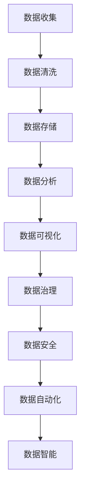
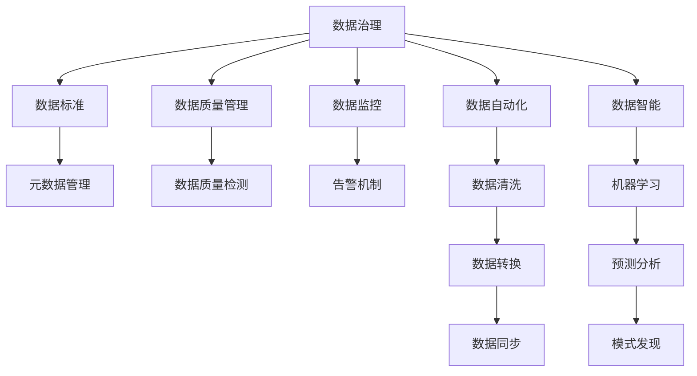

                 

# AI创业：数据管理的创新方法分享

> 关键词：AI创业, 数据管理, 数据隐私, 数据治理, 数据自动化, 数据智能

## 1. 背景介绍

随着人工智能技术的蓬勃发展，越来越多的企业开始投入到AI创业中，希望通过智能技术推动业务创新和转型升级。然而，数据作为AI系统的"粮食"，其管理和治理质量直接决定了AI系统的效果和应用范围。因此，在AI创业的道路上，如何有效管理数据，构建健壮可靠的数据治理体系，成为了每个企业都必须面对的挑战。本文将从数据管理的技术和实践层面，分享一些创新的方法和策略，为AI创业者提供有益的参考。

## 2. 核心概念与联系

### 2.1 核心概念概述

在数据管理的背景下，核心概念主要包括以下几个方面：

- **数据管理(Data Management)**：指对数据的收集、存储、处理、分析、利用等全生命周期的管理和控制。数据管理的目标是保证数据的安全、准确、可靠、高效，同时满足业务需求。

- **数据治理(Data Governance)**：是数据管理的高级形式，强调从组织战略到执行的全面规范和优化，确保数据质量、安全性和合规性。数据治理通常包括数据标准、元数据、质量管理、数据监控等环节。

- **数据自动化(Automated Data Management)**：利用自动化技术，如数据清洗、数据转换、数据同步等，减少人工干预，提高数据处理的效率和准确性。

- **数据智能(Intelligent Data Management)**：引入人工智能技术，如机器学习、自然语言处理等，对数据进行深入分析和挖掘，发现隐藏的知识和规律，提升数据管理决策的智能化水平。

这些核心概念通过以下Mermaid流程图展现它们的联系和相互依赖关系：



在这个流程图中，数据收集是数据管理的起点，数据清洗和存储是基础环节，数据分析和可视化是关键应用，数据治理和数据安全是管理体系，数据自动化和数据智能是技术手段，共同构成了数据管理的完整体系。

### 2.2 核心概念的整体架构

为了更好地理解数据管理的核心概念，我们可以使用一个综合的流程图来展示它们之间的整体架构：



这个综合流程图展示了数据管理从顶层治理到具体实施的过程，其中数据治理是最高层，数据自动化和数据智能在具体实施中发挥关键作用，而数据标准、元数据、质量管理、监控告警等环节则构成了数据管理的基础体系。

## 3. 核心算法原理 & 具体操作步骤
### 3.1 算法原理概述

数据管理的核心算法原理主要围绕数据治理和数据自动化展开，下面将详细介绍这些原理：

#### 3.1.1 数据治理原理

数据治理的核心是构建一个规范化的数据管理体系，通过制定数据标准、管理元数据、监控数据质量、保护数据安全等手段，确保数据的高效利用和可靠运行。数据治理的原理可以概括为以下几个步骤：

1. **数据标准制定**：建立统一的数据命名规则、数据格式、数据类型等标准，确保数据的一致性和可比性。
2. **元数据管理**：收集、存储和管理数据的元数据（如数据来源、数据结构、数据变化等），为数据分析、数据管理提供支撑。
3. **数据质量管理**：对数据进行清洗、去重、填充缺失值等操作，确保数据的质量和准确性。
4. **数据监控与告警**：建立数据监控机制，实时监测数据的访问、修改等行为，一旦发现异常立即触发告警。

#### 3.1.2 数据自动化原理

数据自动化利用自动化技术，减少人工干预，提高数据处理的效率和准确性。数据自动化的原理可以概括为以下几个步骤：

1. **数据清洗自动化**：自动对数据进行清洗，包括去除噪声、处理缺失值、规范数据格式等。
2. **数据转换自动化**：自动对数据进行转换，包括数据类型转换、数据格式转换等。
3. **数据同步自动化**：自动同步不同数据源之间的数据，确保数据的一致性。
4. **数据转换自动化**：自动对数据进行转换，包括数据类型转换、数据格式转换等。

### 3.2 算法步骤详解

#### 3.2.1 数据治理算法步骤

1. **数据标准制定**：通过企业内数据治理委员会或数据架构师，制定统一的数据标准，如命名规则、数据格式、数据类型等。
2. **元数据管理**：建立元数据管理系统，收集、存储和管理数据的元数据，如数据来源、数据结构、数据变化等。
3. **数据质量管理**：利用数据质量工具，对数据进行清洗、去重、填充缺失值等操作，确保数据的质量和准确性。
4. **数据监控与告警**：建立数据监控机制，实时监测数据的访问、修改等行为，一旦发现异常立即触发告警。

#### 3.2.2 数据自动化算法步骤

1. **数据清洗自动化**：编写数据清洗脚本，自动执行数据清洗任务，如去除噪声、处理缺失值、规范数据格式等。
2. **数据转换自动化**：利用ETL工具，自动对数据进行转换，如数据类型转换、数据格式转换等。
3. **数据同步自动化**：使用数据同步工具，自动同步不同数据源之间的数据，确保数据的一致性。
4. **数据转换自动化**：自动对数据进行转换，包括数据类型转换、数据格式转换等。

### 3.3 算法优缺点

#### 3.3.1 数据治理算法的优缺点

**优点**：
- 规范化和标准化数据管理，提高数据的可用性和一致性。
- 通过元数据管理和数据质量管理，确保数据的准确性和可靠性。
- 通过数据监控和告警，及时发现和解决问题，提升系统稳定性。

**缺点**：
- 需要投入大量资源和时间进行数据标准制定和元数据管理。
- 数据质量管理可能需要较长的周期才能见效，且质量标准难以完全覆盖所有场景。
- 数据监控告警系统复杂，需要持续维护和优化。

#### 3.3.2 数据自动化算法的优缺点

**优点**：
- 减少人工干预，提高数据处理效率和准确性。
- 自动化工具易于部署和维护，可扩展性强。
- 自动化脚本可复用，提升数据处理的一致性和可维护性。

**缺点**：
- 需要较高的技术水平和专业知识，对系统架构和工具选择要求高。
- 自动化工具可能存在一定的限制，不能完全满足所有复杂需求。
- 自动化脚本需要定期维护和更新，以适应数据变化和业务需求。

### 3.4 算法应用领域

数据治理和数据自动化算法在多个领域都有广泛应用，包括但不限于以下几个方面：

- **金融行业**：金融企业需要处理大量的交易数据、客户数据和风险数据，通过数据治理和数据自动化，确保数据质量和安全，支持风险控制、信贷评估等业务。
- **医疗行业**：医疗数据具有高复杂性、高敏感性，通过数据治理和数据自动化，确保数据隐私和安全，支持临床决策支持、疾病预测等业务。
- **零售行业**：零售企业需要处理大量的消费者数据和交易数据，通过数据治理和数据自动化，优化库存管理、个性化推荐等业务。
- **制造业**：制造业企业需要处理大量的生产数据和供应链数据，通过数据治理和数据自动化，提升生产效率、优化供应链管理等业务。

## 4. 数学模型和公式 & 详细讲解 & 举例说明

### 4.1 数学模型构建

在本节中，我们将构建一个简化的数据治理数学模型，用于展示数据治理的核心原理和过程。

#### 4.1.1 数据质量模型

数据质量是数据治理的重要环节，数据质量模型主要衡量数据的完整性、准确性、一致性、及时性等指标。我们可以使用以下数学模型来表示数据质量：

$$
\text{Data Quality} = \frac{\text{Data Accuracy} + \text{Data Completeness} + \text{Data Consistency} + \text{Data Timeliness}}{\text{Total Score}}
$$

其中，Data Accuracy表示数据的准确性，Data Completeness表示数据的完整性，Data Consistency表示数据的一致性，Data Timeliness表示数据的时效性，Total Score表示数据质量的总体得分。

#### 4.1.2 数据监控模型

数据监控是数据治理的重要手段，通过建立数据监控模型，可以实时监测数据的访问、修改等行为，确保数据的安全和合规。数据监控模型的核心是建立数据流图，监测数据的流动过程。以下是一个简化的数据监控模型：

$$
\text{Data Flow Graph} = \{(x_i, y_i)\}_{i=1}^N
$$

其中，$x_i$表示数据流节点，$y_i$表示数据流方向，$N$表示数据流节点总数。通过构建数据流图，可以明确数据的流动路径和变化过程，发现异常数据流，及时采取措施。

### 4.2 公式推导过程

#### 4.2.1 数据质量模型推导

根据数据质量模型，我们可以推导出数据质量评分的计算公式：

$$
\text{Data Quality Score} = \text{Data Accuracy Score} + \text{Data Completeness Score} + \text{Data Consistency Score} + \text{Data Timeliness Score}
$$

其中，Data Accuracy Score表示数据的准确性评分，Data Completeness Score表示数据的完整性评分，Data Consistency Score表示数据的一致性评分，Data Timeliness Score表示数据的时效性评分。

#### 4.2.2 数据监控模型推导

根据数据监控模型，我们可以推导出数据流图的表示方法：

$$
\text{Data Flow Graph} = \bigcup_{i=1}^N (x_i, y_i)
$$

其中，$\bigcup$表示数据流图的并集，$(x_i, y_i)$表示数据流图中的节点和方向。

### 4.3 案例分析与讲解

#### 4.3.1 案例分析

假设一个金融企业需要进行数据治理，制定统一的数据标准，建立元数据管理系统，对数据进行清洗、转换和同步。以下是数据治理的详细案例分析：

1. **数据标准制定**：通过企业内数据治理委员会，制定统一的数据命名规则、数据格式、数据类型等标准。
2. **元数据管理**：建立元数据管理系统，收集、存储和管理数据的元数据，如数据来源、数据结构、数据变化等。
3. **数据质量管理**：利用数据质量工具，对数据进行清洗、去重、填充缺失值等操作，确保数据的质量和准确性。
4. **数据监控与告警**：建立数据监控机制，实时监测数据的访问、修改等行为，一旦发现异常立即触发告警。

#### 4.3.2 案例讲解

在上述案例中，数据标准制定和元数据管理是数据治理的基础，数据质量管理是数据治理的核心，数据监控告警是数据治理的保障。通过这一系列的步骤，企业可以构建规范化的数据管理体系，确保数据的高效利用和可靠运行。

## 5. 项目实践：代码实例和详细解释说明

### 5.1 开发环境搭建

在进行数据管理项目实践前，我们需要准备好开发环境。以下是使用Python进行PyTorch开发的环境配置流程：

1. 安装Anaconda：从官网下载并安装Anaconda，用于创建独立的Python环境。

2. 创建并激活虚拟环境：
```bash
conda create -n data-env python=3.8 
conda activate data-env
```

3. 安装PyTorch：根据CUDA版本，从官网获取对应的安装命令。例如：
```bash
conda install pytorch torchvision torchaudio cudatoolkit=11.1 -c pytorch -c conda-forge
```

4. 安装各类工具包：
```bash
pip install numpy pandas scikit-learn matplotlib tqdm jupyter notebook ipython
```

完成上述步骤后，即可在`data-env`环境中开始数据管理实践。

### 5.2 源代码详细实现

下面我们以数据清洗和数据转换为例，给出使用PyTorch进行数据管理的PyTorch代码实现。

首先，定义数据清洗和转换函数：

```python
import pandas as pd

def data_cleaning(df):
    # 去除噪声
    df = df.dropna()
    # 处理缺失值
    df = df.fillna(0)
    # 规范数据格式
    df = df.astype('int64')
    return df

def data_conversion(df):
    # 数据类型转换
    df['date'] = pd.to_datetime(df['date'])
    df['amount'] = df['amount'].astype('float64')
    return df
```

然后，加载数据并应用数据清洗和转换函数：

```python
# 加载数据
df = pd.read_csv('data.csv')

# 数据清洗
df = data_cleaning(df)

# 数据转换
df = data_conversion(df)
```

接着，导出清洗后的数据：

```python
df.to_csv('cleaned_data.csv', index=False)
```

### 5.3 代码解读与分析

让我们再详细解读一下关键代码的实现细节：

**data_cleaning函数**：
- 去除数据中的噪声，即去除缺失值。
- 处理缺失值，将其用0填充。
- 规范数据格式，将数据类型转换为整数。

**data_conversion函数**：
- 将日期数据转换为日期格式。
- 将金额数据转换为浮点数。

**加载数据**：
- 使用Pandas的read_csv函数加载CSV文件。

**数据清洗**：
- 调用data_cleaning函数对数据进行清洗。

**数据转换**：
- 调用data_conversion函数对数据进行转换。

**导出数据**：
- 使用Pandas的to_csv函数将清洗后的数据导出为CSV文件。

通过这些步骤，我们可以看到，PyTorch结合Pandas和Numpy，可以很方便地进行数据清洗和转换。这些工具提供了丰富的数据处理功能，帮助开发者快速实现数据管理的基本需求。

### 5.4 运行结果展示

假设我们在处理一个客户交易数据集，最终得到清洗和转换后的数据如下：

```plaintext
id,date,amount
1,2022-01-01,1000
2,2022-01-02,2000
3,2022-01-03,1500
...
```

可以看到，通过数据清洗和转换，我们消除了数据中的噪声和格式不一致性，使得数据更加整洁和规范，便于后续的数据分析和建模。

## 6. 实际应用场景

### 6.1 金融行业

在金融行业中，数据质量对风险控制、信贷评估等业务至关重要。通过数据治理和数据自动化，金融企业可以实时监测数据的质量和行为，确保数据的安全和准确性。

例如，某金融企业利用数据治理和数据自动化技术，建立了统一的数据标准和元数据管理系统，对交易数据和客户数据进行清洗、转换和同步。通过数据质量评分和数据监控告警，企业及时发现并解决了数据质量问题，提升了风险控制和信贷评估的准确性，减少了欺诈风险和损失。

### 6.2 医疗行业

医疗数据具有高复杂性、高敏感性，通过数据治理和数据自动化，医疗机构可以确保数据隐私和安全，支持临床决策支持、疾病预测等业务。

例如，某医院利用数据治理和数据自动化技术，建立了统一的数据标准和元数据管理系统，对患者数据和医疗记录进行清洗、转换和同步。通过数据质量评分和数据监控告警，医院及时发现并解决了数据质量问题，提升了临床决策的准确性，提高了疾病预测的效率和效果，保障了患者隐私安全。

### 6.3 零售行业

零售企业需要处理大量的消费者数据和交易数据，通过数据治理和数据自动化，企业可以优化库存管理、个性化推荐等业务。

例如，某零售企业利用数据治理和数据自动化技术，建立了统一的数据标准和元数据管理系统，对消费者数据和交易数据进行清洗、转换和同步。通过数据质量评分和数据监控告警，企业及时发现并解决了数据质量问题，提升了个性化推荐的精准度和库存管理的效率，提高了销售额和客户满意度。

### 6.4 制造业

制造业企业需要处理大量的生产数据和供应链数据，通过数据治理和数据自动化，企业可以提升生产效率、优化供应链管理等业务。

例如，某制造企业利用数据治理和数据自动化技术，建立了统一的数据标准和元数据管理系统，对生产数据和供应链数据进行清洗、转换和同步。通过数据质量评分和数据监控告警，企业及时发现并解决了数据质量问题，提升了生产效率和供应链管理的精度，减少了生产成本和物料浪费。

## 7. 工具和资源推荐

### 7.1 学习资源推荐

为了帮助开发者系统掌握数据管理的技术和实践，这里推荐一些优质的学习资源：

1. 《Python数据科学手册》：由Python社区的知名人士编写的数据科学入门书籍，涵盖了数据处理、数据可视化、机器学习等基本概念和实践技巧。

2. 《Data Science from Scratch》：由Python社区的知名人士编写的数据科学入门书籍，详细介绍了数据科学的核心概念和基本技能。

3. 《深入理解数据科学》：由Kaggle社区的顶尖数据科学家编写的数据科学高级课程，涵盖数据处理、机器学习、深度学习等高级内容。

4. 《PyTorch官方文档》：PyTorch的官方文档，提供了丰富的数据处理和机器学习样例代码，是学习和实践数据管理的重要参考资料。

5. 《Data Management for Machine Learning》：由行业专家编写的数据管理教程，涵盖数据清洗、数据转换、数据同步等具体技术。

通过这些资源的学习实践，相信你一定能够快速掌握数据管理的精髓，并用于解决实际的NLP问题。

### 7.2 开发工具推荐

高效的开发离不开优秀的工具支持。以下是几款用于数据管理开发的常用工具：

1. Pandas：Python的官方数据分析库，提供了强大的数据处理功能，包括数据清洗、数据转换、数据同步等。

2. NumPy：Python的科学计算库，提供了高效的数组和矩阵计算功能，支持数据清洗和转换。

3. Scikit-learn：Python的机器学习库，提供了丰富的数据处理和机器学习算法，支持数据清洗和转换。

4. PyTorch：基于Python的深度学习框架，提供了强大的自动微分和模型优化功能，支持数据清洗和转换。

5. Jupyter Notebook：Python的数据处理和机器学习开发环境，支持交互式编程和代码执行，方便开发者进行实验和调试。

6. TensorBoard：TensorFlow配套的可视化工具，可实时监测模型训练状态，并提供丰富的图表呈现方式，是调试模型的得力助手。

合理利用这些工具，可以显著提升数据管理任务的开发效率，加快创新迭代的步伐。

### 7.3 相关论文推荐

数据管理技术的发展源于学界的持续研究。以下是几篇奠基性的相关论文，推荐阅读：

1. "Data Governance Framework: An Overview"：介绍了数据治理框架的核心概念和技术方法。

2. "Automated Data Cleaning: A Survey"：综述了数据清洗的技术和算法，提供了丰富的应用案例和实际应用建议。

3. "Big Data Privacy: Challenges and Solutions"：探讨了大数据时代下数据隐私保护的方法和策略，为数据管理提供了重要的参考。

4. "Data Quality Assessment and Improvement: An Overview"：综述了数据质量评估和改进的技术方法，提供了丰富的应用案例和实际应用建议。

这些论文代表了数据管理技术的发展脉络。通过学习这些前沿成果，可以帮助研究者把握学科前进方向，激发更多的创新灵感。

除上述资源外，还有一些值得关注的前沿资源，帮助开发者紧跟数据管理技术的最新进展，例如：

1. arXiv论文预印本：人工智能领域最新研究成果的发布平台，包括大量尚未发表的前沿工作，学习前沿技术的必读资源。

2. 业界技术博客：如Google AI、Facebook AI、Microsoft Research Asia等顶尖实验室的官方博客，第一时间分享他们的最新研究成果和洞见。

3. 技术会议直播：如KDD、SIGKDD、ICML、ICDM等数据科学和数据管理领域的顶级会议现场或在线直播，能够聆听到行业专家和顶尖学者的分享。

4. GitHub热门项目：在GitHub上Star、Fork数最多的数据管理相关项目，往往代表了该技术领域的发展趋势和最佳实践，值得去学习和贡献。

5. 行业分析报告：各大咨询公司如McKinsey、PwC等针对数据管理行业的分析报告，有助于从商业视角审视技术趋势，把握应用价值。

总之，对于数据管理技术的学习和实践，需要开发者保持开放的心态和持续学习的意愿。多关注前沿资讯，多动手实践，多思考总结，必将收获满满的成长收益。

## 8. 总结：未来发展趋势与挑战

### 8.1 总结

本文对数据管理的核心概念和算法原理进行了全面系统的介绍。首先阐述了数据治理和数据自动化的核心原理，展示了数据管理从数据标准制定、元数据管理、数据质量管理到数据监控告警的完整过程。其次，从理论到实践，详细讲解了数据清洗、数据转换、数据同步等具体操作，提供了实际应用中的代码实现和结果展示。最后，本文还探讨了数据管理在金融、医疗、零售、制造等实际应用场景中的应用前景，展示了数据管理技术的广泛适用性。

通过本文的系统梳理，可以看到，数据管理技术在大规模数据处理、智能决策支持、自动化部署等方面发挥着至关重要的作用。未来的数据管理技术将如何进一步提升数据治理的效率和效果，保障数据的安全和隐私，为AI创业提供坚实的基础，是我们必须面对的挑战和机遇。

### 8.2 未来发展趋势

展望未来，数据管理技术将呈现以下几个发展趋势：

1. 数据治理智能化：引入人工智能技术，如机器学习、自然语言处理等，对数据进行深入分析和挖掘，发现隐藏的知识和规律，提升数据治理决策的智能化水平。

2. 数据治理自动化：利用自动化技术，如数据清洗、数据转换、数据同步等，减少人工干预，提高数据处理的效率和准确性。

3. 数据治理可视化：引入可视化技术，如数据流图、数据质量评分等，帮助数据治理人员直观了解数据管理状态和问题，提高治理效率。

4. 数据治理云端化：利用云计算技术，实现数据治理服务的云端部署，提供按需扩展、弹性伸缩的数据治理解决方案。

5. 数据治理区块链化：引入区块链技术，保障数据治理过程的透明性和可追溯性，提升数据治理的信任度。

这些趋势凸显了数据管理技术的广阔前景。这些方向的探索发展，必将进一步提升数据治理的效率和效果，保障数据的安全和隐私，为AI创业提供坚实的基础。

### 8.3 面临的挑战

尽管数据管理技术已经取得了显著的进步，但在迈向更加智能化、普适化应用的过程中，它仍面临着诸多挑战：

1. 数据标准制定难度大：数据标准的制定需要跨部门、跨系统的协调，面临多种数据格式、多种业务需求，协调成本高。

2. 数据质量管理复杂：数据质量管理涉及数据清洗、数据转换、数据同步等多个环节，且每个环节都有不同的技术和方法，需要综合考虑。

3. 数据隐私保护困难：数据隐私保护面临多种技术和法规挑战，如何在保障隐私的前提下，提供高效的数据治理服务，需要多方面的努力。

4. 数据治理系统复杂：数据治理系统涉及元数据管理、数据质量管理、数据监控告警等多个模块，系统设计和实现复杂度高。

5. 数据治理效率低：数据治理过程涉及大量人工干预，效率较低，需要引入自动化技术，提升数据治理的效率和效果。

这些挑战需要我们在数据治理过程中不断优化，探索更加高效、智能、安全的解决方案。

### 8.4 研究展望

面对数据管理面临的种种挑战，未来的研究需要在以下几个方面寻求新的突破：

1. 探索更加智能的数据治理方法：引入人工智能技术，提升数据治理的智能化水平，帮助数据治理人员更快速地发现和解决问题。

2. 研究更加自动化的数据治理技术：利用自动化技术，减少人工干预，提升数据治理的效率和效果。

3. 引入更加可视化的方法：利用可视化技术，帮助数据治理人员直观了解数据管理状态和问题，提高治理效率。

4. 探索更加高效的数据治理方案：利用云计算、区块链等技术，提供按需扩展、弹性伸缩的数据治理解决方案。

5. 引入更加智能的监控告警系统：利用人工智能技术，提升数据监控告警的智能化水平，帮助数据治理人员及时发现和解决问题。

这些研究方向将引领数据管理技术迈向更高的台阶，为AI创业者提供更加坚实的技术基础，助力企业实现数字化转型和智能化升级。

## 9. 附录：常见问题与解答

**Q1：数据管理的重要性体现在哪些方面？**

A: 数据管理的重要性主要体现在以下几个方面：
1. 数据质量管理：通过数据清洗、数据转换、数据同步等操作，确保数据的质量和准确性，为数据分析和决策提供可靠的支撑。
2. 数据安全保护：通过建立数据监控机制和数据隐私保护机制，确保数据的安全性和合规性，防止数据泄露和滥用。
3. 数据治理优化：通过制定数据标准、管理元数据、优化数据流程等手段，提高数据治理的效率和效果，

