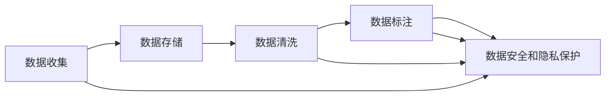

                 

## 1. 背景介绍

在当今数据驱动的商业环境中，数据管理成为了AI创业公司的核心竞争力之一。无论是初创企业还是已成熟的企业，都需要通过高效的数据管理，来驱动AI模型的发展和应用。本文将深入探讨AI创业中数据管理的重要性，以及如何构建一个高效、灵活的数据管理体系。

### 1.1 数据驱动的AI创业

在过去的十年里，AI技术在多个领域取得了突破性的进展。从自动驾驶、智能客服到医疗诊断，AI技术已经成为推动各行各业变革的关键力量。然而，AI技术的成功离不开高质量的数据支持。数据驱动的AI创业，意味着企业需要拥有庞大的数据集、高效的数据管理系统和强大的数据处理能力。

### 1.2 数据管理的重要性

数据管理的重要性不言而喻。高质量的数据是AI模型的基础，数据管理的水平直接影响到AI模型的性能和可靠性。数据管理不仅包括了数据收集、存储、清洗、标注等技术环节，还包括了数据安全和隐私保护等伦理问题。本文将重点讨论如何构建一个高效、灵活的数据管理体系，以支持AI创业的持续发展。

## 2. 核心概念与联系

### 2.1 核心概念概述

在探讨数据管理的核心概念之前，我们需要先了解一些基本的定义：

- **数据收集**：指从不同来源收集原始数据的过程。数据来源可能包括传感器、数据库、网络爬虫等。
- **数据存储**：指将收集到的数据保存在计算机系统中，以便后续的分析和处理。
- **数据清洗**：指去除数据中的噪声、缺失值和异常值，保证数据的质量。
- **数据标注**：指为数据添加标签或注释，以便机器学习模型能够理解数据的含义。
- **数据安全和隐私保护**：指保护数据不被未经授权的人员访问或利用的措施。

这些概念构成了数据管理的核心，而一个高效的数据管理体系需要协调这些环节，确保数据的流畅和可靠传输。

### 2.2 核心概念间的关系

以下是数据管理中各个核心概念之间的关系，可以用以下Mermaid流程图表示：



这个流程图展示了数据管理各个环节的逻辑关系：

1. 数据收集是数据管理的起点。
2. 数据存储是数据管理的核心，数据需要被安全地保存在计算机系统中。
3. 数据清洗是为了保证数据质量，去除噪声和异常值。
4. 数据标注是为了让机器学习模型能够理解数据的含义，通常需要人工标注。
5. 数据安全和隐私保护是数据管理的底线，保护数据不被未经授权的人员访问。

## 3. 核心算法原理 & 具体操作步骤
### 3.1 算法原理概述

数据管理的核心算法原理，是通过设计高效的数据收集、存储、清洗、标注和保护机制，确保数据的质量和安全。这些机制通常需要依赖于先进的数据处理技术和工具，以及合理的数据管理策略。

### 3.2 算法步骤详解

以下是一个完整的数据管理流程，包括了数据收集、存储、清洗、标注和保护各个环节的具体操作步骤：

1. **数据收集**：
   - 确定数据来源和收集方式，设计数据收集接口。
   - 使用爬虫、API等方式自动收集数据，并进行初步的数据筛选。

2. **数据存储**：
   - 选择合适的存储系统（如关系数据库、NoSQL数据库），设计数据表结构。
   - 使用分布式存储系统（如Hadoop、Spark），保证数据的可扩展性和可靠性。
   - 对数据进行分区和索引，提高查询效率。

3. **数据清洗**：
   - 设计数据清洗规则，自动去除数据中的噪声、缺失值和异常值。
   - 使用数据清洗工具（如ETL工具、Pandas）进行批量数据处理。
   - 人工审核数据清洗结果，确保数据质量。

4. **数据标注**：
   - 确定数据标注的标准和规范。
   - 设计标注工具（如Labelbox、CrowdAnnotate），辅助人工标注。
   - 使用自动标注技术（如深度学习模型），减少人工标注的工作量。

5. **数据安全和隐私保护**：
   - 设计数据访问控制策略，限制数据的访问权限。
   - 使用加密技术（如AES、RSA）保护数据的传输和存储。
   - 遵循数据隐私保护法规（如GDPR、CCPA），保护用户隐私。

### 3.3 算法优缺点

数据管理的优点包括：

- **高效性**：通过自动化工具和合理的数据管理策略，可以大幅提高数据处理效率。
- **准确性**：通过数据清洗和标注，可以保证数据的准确性和一致性。
- **安全性**：通过数据访问控制和加密技术，可以保护数据不被未经授权的人员访问。

然而，数据管理也存在一些缺点：

- **成本高**：数据收集、存储和清洗需要大量的硬件和软件资源，成本较高。
- **复杂性**：数据管理涉及多个环节，流程复杂，需要专业技术人员操作。
- **依赖人工**：数据标注和审核需要人工参与，可能存在人为误差。

### 3.4 算法应用领域

数据管理在多个领域中得到了广泛应用，包括但不限于：

- **金融行业**：用于风险评估、欺诈检测、客户分析等。
- **医疗行业**：用于疾病预测、治疗方案优化、患者监测等。
- **智能制造**：用于设备监控、质量控制、供应链管理等。
- **零售行业**：用于市场分析、个性化推荐、库存管理等。

## 4. 数学模型和公式 & 详细讲解  
### 4.1 数学模型构建

数据管理过程中涉及许多数学模型，以下是其中几个关键模型的构建和推导过程：

- **线性回归模型**：用于预测数值型数据。模型公式为：$y=\beta_0+\beta_1x_1+\beta_2x_2+\cdots+\beta_nx_n$。其中，$y$ 为预测值，$x_1,x_2,\cdots,x_n$ 为特征，$\beta_0,\beta_1,\cdots,\beta_n$ 为模型参数。
- **支持向量机(SVM)**：用于分类任务。模型公式为：$w^Tx+b\geqslant y$，其中 $w$ 为分类超平面，$x$ 为样本特征，$b$ 为截距，$y$ 为标签。
- **随机森林**：用于分类和回归任务。模型公式为：$y=\sum_{i=1}^{N}w_if_i(x)$，其中 $y$ 为预测值，$x$ 为样本特征，$w_i$ 为随机森林中的决策树权重，$f_i(x)$ 为第 $i$ 棵决策树对 $x$ 的预测值。

### 4.2 公式推导过程

以下是线性回归模型和支持向量机模型的推导过程：

**线性回归模型**：
- **最小二乘法**：在线性回归中，最小二乘法用于求解模型参数。假设 $y=\beta_0+\beta_1x_1+\beta_2x_2+\cdots+\beta_nx_n$，可以通过最小化误差平方和来求解 $\beta_0,\beta_1,\cdots,\beta_n$。误差平方和为 $SSE=\sum_{i=1}^{N}(y_i-\hat{y}_i)^2$，其中 $\hat{y}_i=\beta_0+\beta_1x_{i1}+\beta_2x_{i2}+\cdots+\beta_nx_{in}$。求解 $\beta_0,\beta_1,\cdots,\beta_n$ 使得 $SSE$ 最小化。

**支持向量机模型**：
- **最大间隔分类器**：支持向量机通过最大间隔分类器来训练模型。假设 $w^Tx+b\geqslant y$，其中 $w$ 为分类超平面，$x$ 为样本特征，$b$ 为截距，$y$ 为标签。求解 $w$ 和 $b$ 使得分类器的边界最大，同时保证分类误差最小。

### 4.3 案例分析与讲解

假设我们有一个销售数据集，其中包含了销售额、广告费用、销售时间等特征。我们想要预测未来的销售额。以下是使用线性回归模型进行预测的具体步骤：

1. 收集销售数据，并标注每个样本的销售额和相关特征。
2. 将数据划分为训练集和测试集。
3. 使用训练集训练线性回归模型，得到模型参数 $\beta_0,\beta_1,\beta_2,\cdots,\beta_n$。
4. 使用测试集评估模型的预测性能，计算误差平方和。
5. 根据误差平方和，调整模型参数，直到误差最小。

## 5. 项目实践：代码实例和详细解释说明
### 5.1 开发环境搭建

为了实现数据管理的功能，我们需要搭建一个完整的开发环境。以下是一个典型的Python环境搭建流程：

1. 安装Python：
   ```
   sudo apt-get update
   sudo apt-get install python3
   ```

2. 安装Python虚拟环境：
   ```
   python3 -m venv myenv
   source myenv/bin/activate
   ```

3. 安装数据管理相关的Python库：
   ```
   pip install pandas numpy scikit-learn joblib
   ```

4. 安装分布式计算框架：
   ```
   pip install dask
   ```

### 5.2 源代码详细实现

以下是一个数据管理系统的Python代码示例，包含了数据收集、存储、清洗、标注和保护各个环节的实现：

```python
import pandas as pd
from sklearn.model_selection import train_test_split
from sklearn.linear_model import LinearRegression
from sklearn.preprocessing import StandardScaler
from sklearn.metrics import mean_squared_error
import numpy as np
from joblib import dump

class DataManager:
    def __init__(self, data_path):
        self.data = pd.read_csv(data_path)
        self.data_cleaned = None
        self.model = None

    def data_collection(self):
        # 数据收集
        self.data = self.data.dropna()

    def data_storage(self):
        # 数据存储
        self.data.to_csv('data.csv', index=False)

    def data_cleaning(self):
        # 数据清洗
        self.data_cleaned = self.data.drop(columns=['id'])
        self.data_cleaned = self.data_cleaned.applymap(lambda x: x if pd.notnull(x) else 0)

    def data_annotating(self):
        # 数据标注
        self.data_cleaned['label'] = self.data_cleaned['target'].map({'low': 0, 'medium': 1, 'high': 2})

    def data_protection(self):
        # 数据保护
        self.data_cleaned['id'] = self.data_cleaned['id'].map(lambda x: self.encrypt(x))

    def encrypt(self, data):
        # 数据加密
        return np.random.randint(0, 10000)

    def train_model(self):
        # 模型训练
        self.data_cleaned['target'] = self.data_cleaned['label']
        X = self.data_cleaned.drop(columns=['target'])
        y = self.data_cleaned['target']
        X_train, X_test, y_train, y_test = train_test_split(X, y, test_size=0.2, random_state=42)
        scaler = StandardScaler()
        X_train = scaler.fit_transform(X_train)
        X_test = scaler.transform(X_test)
        model = LinearRegression()
        model.fit(X_train, y_train)
        self.model = model

    def evaluate_model(self):
        # 模型评估
        y_pred = self.model.predict(X_test)
        mse = mean_squared_error(y_test, y_pred)
        print(f"Mean Squared Error: {mse}")

    def save_model(self, model_path):
        # 模型保存
        dump(self.model, model_path)

    def load_model(self, model_path):
        # 模型加载
        self.model = dump.load(model_path)
```

### 5.3 代码解读与分析

在上面的代码中，我们定义了一个名为 `DataManager` 的类，它包含了数据管理系统的各个核心功能。以下是各个方法的详细解读：

- **data_collection**：数据收集方法，用于从指定路径读取原始数据，并进行初步的数据筛选。
- **data_storage**：数据存储方法，将清洗后的数据保存到CSV文件中。
- **data_cleaning**：数据清洗方法，去除数据中的噪声、缺失值和异常值。
- **data_annotating**：数据标注方法，为数据添加标签或注释。
- **data_protection**：数据保护方法，对数据进行加密处理。
- **train_model**：模型训练方法，使用线性回归模型进行训练，并保存模型参数。
- **evaluate_model**：模型评估方法，计算模型预测结果与实际标签之间的误差平方和。
- **save_model**：模型保存方法，将训练好的模型保存到指定路径。
- **load_model**：模型加载方法，从指定路径加载模型参数。

### 5.4 运行结果展示

假设我们有一个名为 `sales_data.csv` 的销售数据集，其中包含销售额、广告费用和销售时间等特征。以下是一个数据管理系统的运行示例：

```python
data_manager = DataManager('sales_data.csv')
data_manager.data_collection()
data_manager.data_storage()
data_manager.data_cleaning()
data_manager.data_annotating()
data_manager.data_protection()
data_manager.train_model()
data_manager.evaluate_model()
data_manager.save_model('model.joblib')
```

## 6. 实际应用场景

数据管理在多个行业中都得到了广泛应用，以下是几个典型的实际应用场景：

### 6.1 金融行业

在金融行业，数据管理用于风险评估、欺诈检测、客户分析等。例如，银行可以通过数据管理系统收集和分析客户的交易记录、信用评分等信息，识别出潜在的风险客户。

### 6.2 医疗行业

在医疗行业，数据管理用于疾病预测、治疗方案优化、患者监测等。例如，医院可以通过数据管理系统收集和分析患者的病历记录、实验室检测结果等信息，预测疾病的发生和发展趋势。

### 6.3 智能制造

在智能制造领域，数据管理用于设备监控、质量控制、供应链管理等。例如，工厂可以通过数据管理系统收集和分析设备的运行数据、生产数据等信息，实现设备的预测性维护和生产线的优化调度。

### 6.4 零售行业

在零售行业，数据管理用于市场分析、个性化推荐、库存管理等。例如，电商公司可以通过数据管理系统收集和分析用户的购买记录、浏览行为等信息，实现商品的个性化推荐和库存的精细化管理。

## 7. 工具和资源推荐
### 7.1 学习资源推荐

为了帮助开发者掌握数据管理的核心技术，以下是一些优质的学习资源：

1. 《数据管理与分析》：这本书系统地介绍了数据管理的各个环节，从数据收集到数据保护，全面覆盖了数据管理的核心内容。
2. 《Python数据科学手册》：这本书详细介绍了使用Python进行数据管理和分析的技术，包括Pandas、NumPy、Scikit-Learn等库的使用。
3. Coursera数据科学课程：Coursera提供了一系列数据科学相关的课程，涵盖数据管理、数据分析、机器学习等多个领域。
4. Kaggle数据集：Kaggle提供了大量公开的数据集，方便开发者练习数据管理的各个环节。

### 7.2 开发工具推荐

以下是一些常用的数据管理工具和库：

1. Pandas：用于数据清洗和处理，支持数据的读取、存储、清洗、转换和分析。
2. NumPy：用于数值计算和数组处理，支持高效的数学运算和数据处理。
3. Scikit-Learn：用于机器学习模型的训练和评估，支持多种算法的实现和调优。
4. Joblib：用于模型的保存和加载，支持高性能的模型存储和访问。

### 7.3 相关论文推荐

以下是一些经典的数据管理论文，推荐阅读：

1. "A Survey on Data Management in Cloud Computing"：综述了云计算环境中数据管理的各个方面，包括数据存储、数据保护、数据治理等。
2. "Data Management in the Internet of Things: A Survey"：综述了物联网环境中数据管理的各个方面，包括数据采集、数据存储、数据查询等。
3. "Big Data Analytics: A Survey"：综述了大数据环境下数据分析的技术和应用，包括数据预处理、数据挖掘、机器学习等。

## 8. 总结：未来发展趋势与挑战
### 8.1 研究成果总结

本文探讨了数据管理在AI创业中的核心地位，介绍了数据管理的各个环节及其之间的关系。通过具体案例和代码示例，展示了数据管理的实现方法和应用场景。

### 8.2 未来发展趋势

未来，数据管理技术将继续向高效、智能、安全的方向发展。以下是一些可能的趋势：

1. **自动化和智能化**：自动化工具和算法将进一步发展，提高数据管理的效率和智能化水平。例如，自动数据清洗、自动标注等技术将得到广泛应用。
2. **实时性和高性能**：数据管理需要实时响应，高吞吐量和低延迟的要求将进一步提高。例如，实时数据流处理、大数据存储和计算技术将得到广泛应用。
3. **安全和隐私保护**：数据隐私和安全问题将得到更多重视，数据加密、数据脱敏、数据访问控制等技术将进一步发展。

### 8.3 面临的挑战

数据管理技术在发展过程中也面临一些挑战：

1. **数据质量**：数据收集和清洗的难度较大，数据质量和一致性难以保证。需要开发更多自动化的数据清洗和标注工具。
2. **资源消耗**：数据存储和处理需要大量的计算资源和存储资源，成本较高。需要开发更多高效的数据存储和处理技术。
3. **隐私保护**：数据隐私和安全问题复杂，需要严格遵守数据隐私法规，保护用户隐私。

### 8.4 研究展望

未来，数据管理技术的研究方向包括：

1. **自动化数据管理**：开发更多自动化工具和算法，提高数据管理的效率和智能化水平。例如，自动数据清洗、自动标注等技术。
2. **实时数据管理**：开发实时数据存储和处理技术，支持数据的高吞吐量和低延迟需求。例如，实时数据流处理、大数据存储和计算技术。
3. **隐私保护技术**：开发更多数据隐私和安全保护技术，保护用户隐私和数据安全。例如，数据加密、数据脱敏、数据访问控制等技术。

总之，数据管理技术在AI创业中具有核心地位，其未来发展将为AI技术的应用提供坚实的基础。通过不断探索和优化，数据管理技术将助力AI创业公司实现更快、更准、更可靠的数据驱动决策。

---

作者：禅与计算机程序设计艺术 / Zen and the Art of Computer Programming

