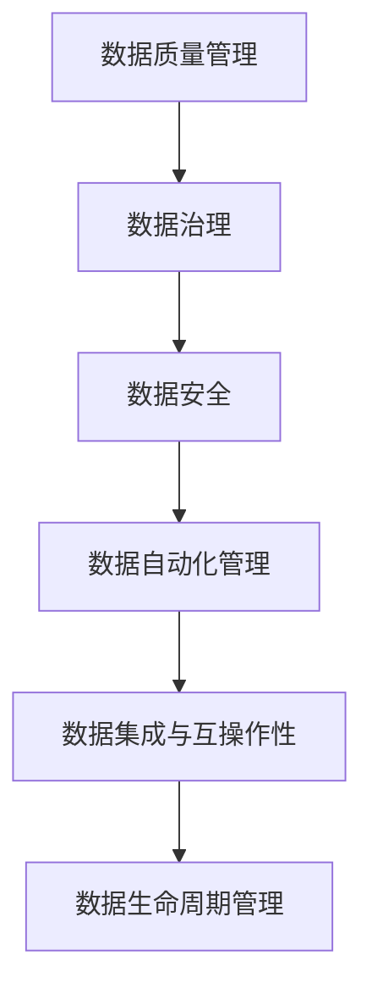

                 

# AI创业：数据管理的策略与实践解析

> 关键词：
> - AI创业
> - 数据管理
> - 数据策略
> - 实践解析
> - 数据治理
> - 数据安全
> - 数据质量
> - 数据自动化

## 1. 背景介绍

在AI创业的浪潮中，数据管理的策略与实践解析成为了创业团队最关注的重点之一。数据管理不仅关系到企业的核心竞争力，还直接影响了AI项目的成功率。无论是机器学习模型训练、预测建模还是自然语言处理（NLP）等AI应用，高质量的数据都是不可或缺的基础。因此，本文将从背景介绍、核心概念与联系、核心算法原理、具体实践操作、应用领域、数学模型和公式、项目实践案例、实际应用场景、工具和资源推荐、未来趋势与挑战等多个维度，全面解析AI创业中数据管理的策略与实践。

### 1.1 问题由来
在当今数字化时代，数据无处不在。随着AI技术的不断成熟，数据已经成为驱动企业创新的重要资产。然而，数据管理并非易事。数据的质量、安全、合规、成本等因素，都可能影响数据管理的成效，进而影响AI项目的整体效果。在AI创业中，团队需要有效地管理数据，确保其高质量、高可用性，以便于快速迭代模型，获得更好的商业成果。

### 1.2 问题核心关键点
数据管理的核心关键点主要包括以下几个方面：
1. **数据质量管理**：确保数据的准确性、完整性、一致性、及时性等。
2. **数据安全管理**：保护数据的隐私和完整性，防止数据泄露和篡改。
3. **数据治理结构**：建立有效的数据管理架构，确保数据流动的透明度和可追溯性。
4. **数据自动化管理**：利用自动化工具和算法，提高数据管理的效率和精确度。
5. **数据集成与互操作性**：将不同来源的数据整合起来，确保数据在不同系统之间能无缝共享和交换。
6. **数据生命周期管理**：从数据采集、存储、处理、分析到销毁，对数据进行全生命周期管理。

### 1.3 问题研究意义
数据管理的策略与实践解析对于AI创业团队有着重要的指导意义：
1. **提升项目成功率**：高质量的数据管理，能够确保模型训练的准确性和鲁棒性，提高项目成功率。
2. **降低成本**：通过自动化和优化数据管理流程，减少人力和资源投入，降低数据管理的成本。
3. **增强竞争力**：优秀的数据管理能力，能够为创业团队在竞争中赢得先机。
4. **保障数据安全**：保护用户隐私和企业机密，符合法律法规要求。
5. **支持企业创新**：提供高质量的数据资产，促进企业产品和服务的创新。

## 2. 核心概念与联系

### 2.1 核心概念概述

数据管理是一个复杂的系统工程，涉及多个核心概念。以下是关键概念的简要概述：

- **数据质量管理**：指通过一系列技术和方法，确保数据的准确性、完整性、一致性、及时性等。
- **数据治理**：指制定和执行数据管理策略，确保数据的可访问性、可解释性和合规性。
- **数据安全**：指保护数据隐私和完整性，防止数据泄露和篡改。
- **数据自动化管理**：指利用自动化工具和算法，提高数据管理的效率和精确度。
- **数据集成与互操作性**：指将不同来源的数据整合起来，确保数据在不同系统之间能无缝共享和交换。
- **数据生命周期管理**：指从数据采集、存储、处理、分析到销毁，对数据进行全生命周期管理。

### 2.2 核心概念间的关系

这些核心概念之间存在着紧密的联系，形成了数据管理的完整生态系统。通过以下Mermaid流程图，我们可以更清晰地理解这些概念之间的关系：



这个流程图展示了数据质量管理、数据治理、数据安全、数据自动化管理、数据集成与互操作性、数据生命周期管理这些概念之间的联系。

## 3. 核心算法原理 & 具体操作步骤

### 3.1 算法原理概述

数据管理的技术涉及多个领域，包括数据质量管理、数据治理、数据安全、数据自动化管理、数据集成与互操作性、数据生命周期管理等。其核心算法原理主要基于以下几个方面：

- **数据清洗**：通过算法和技术手段，去除数据中的噪声、错误和冗余，提升数据质量。
- **数据标准化**：将不同来源的数据按照统一的格式和标准进行处理，确保数据的互操作性。
- **数据匿名化**：通过算法对数据进行匿名化处理，保护用户隐私和数据安全。
- **数据自动化处理**：利用自动化工具和算法，对数据进行高效处理，如ETL（Extract, Transform, Load）流程。
- **数据治理策略**：通过数据治理模型，制定和执行数据管理策略，确保数据的安全和合规。

### 3.2 算法步骤详解

数据管理的算法步骤通常包括以下几个关键环节：

1. **数据采集**：从不同的数据源收集数据，确保数据的多样性和完整性。
2. **数据清洗与预处理**：去除数据中的噪声、错误和冗余，提升数据质量。
3. **数据标准化**：将不同来源的数据按照统一的格式和标准进行处理，确保数据的互操作性。
4. **数据安全保护**：通过加密、访问控制、审计等手段，保护数据的隐私和完整性。
5. **数据治理**：制定和执行数据管理策略，确保数据的安全和合规。
6. **数据自动化管理**：利用自动化工具和算法，对数据进行高效处理，如ETL（Extract, Transform, Load）流程。
7. **数据集成与互操作性**：将不同来源的数据整合起来，确保数据在不同系统之间能无缝共享和交换。
8. **数据生命周期管理**：从数据采集、存储、处理、分析到销毁，对数据进行全生命周期管理。

### 3.3 算法优缺点

数据管理算法的优点主要包括：
- **提升数据质量**：通过清洗和预处理，提升数据质量，确保模型训练的准确性和鲁棒性。
- **降低管理成本**：通过自动化处理和治理策略，降低数据管理的成本。
- **增强数据安全**：通过加密和访问控制等手段，保护数据的隐私和完整性。

数据管理算法的缺点主要包括：
- **技术复杂性**：数据管理涉及多个领域和多种技术，技术复杂性较高。
- **依赖于数据源**：数据管理的成效很大程度上依赖于数据源的质量和多样性。
- **需要持续维护**：数据管理是一个持续的过程，需要不断地更新和维护。

### 3.4 算法应用领域

数据管理算法在多个领域中都有广泛的应用，包括但不限于以下几个方面：

1. **金融行业**：在金融风险评估、信贷审批、投资分析等场景中，数据管理对模型训练和决策支持具有重要意义。
2. **医疗行业**：在疾病预测、药物研发、临床决策支持等场景中，数据管理对模型的准确性和鲁棒性有直接影响。
3. **零售行业**：在客户行为分析、销售预测、库存管理等场景中，数据管理对业务决策具有重要作用。
4. **智能制造**：在生产调度、质量控制、设备维护等场景中，数据管理对智能制造系统的稳定性和效率有重要影响。
5. **智能交通**：在交通流量预测、事故分析、路径规划等场景中，数据管理对智能交通系统的可靠性和实用性有直接影响。

## 4. 数学模型和公式 & 详细讲解 & 举例说明

### 4.1 数学模型构建

数据管理的技术涉及多个领域，其数学模型可以基于以下几个方面进行构建：

- **数据清洗与预处理**：
  - 假设原始数据为 $D=\{(x_i, y_i)\}_{i=1}^N$，其中 $x_i$ 为特征向量，$y_i$ 为标签。
  - 数据清洗的目标是去除噪声和错误，得到高质量的训练数据 $D'$。
  
  数据清洗的基本流程包括数据清洗算法、特征选择、数据去重等。

- **数据标准化**：
  - 假设数据集 $D$ 包含 $m$ 个特征 $x_1, x_2, \dots, x_m$，标准化后的数据集为 $D'$。
  - 标准化公式为：$x'_i = \frac{x_i - \mu}{\sigma}$，其中 $\mu$ 为均值，$\sigma$ 为标准差。

- **数据安全保护**：
  - 假设需要保护的敏感数据为 $S$，加密后的数据为 $S'$。
  - 常用的加密算法包括对称加密和非对称加密，常用的加密方法包括AES、RSA等。

- **数据自动化处理**：
  - 假设数据处理流程为ETL，即Extract（提取）、Transform（转换）、Load（加载）。
  - ETL流程的自动化工具包括Pandas、ETL工具如Talend、Apache Nifi等。

### 4.2 公式推导过程

数据管理中的一些关键算法和公式如下：

- **数据清洗算法**：假设数据集 $D$ 包含噪声 $N$，经过数据清洗算法处理后，得到数据集 $D'$。
  - 假设数据清洗算法为 $A$，则 $D' = A(D, N)$。

- **数据标准化公式**：
  - 假设原始数据为 $D=\{(x_i, y_i)\}_{i=1}^N$，标准化后的数据集为 $D'$。
  - 标准化公式为：$x'_i = \frac{x_i - \mu}{\sigma}$，其中 $\mu$ 为均值，$\sigma$ 为标准差。

- **数据加密算法**：
  - 假设需要保护的敏感数据为 $S$，加密后的数据为 $S'$。
  - 假设加密算法为 $E$，则 $S' = E(S, K)$，其中 $K$ 为密钥。

- **数据自动化处理流程**：
  - 假设数据处理流程为ETL，即Extract（提取）、Transform（转换）、Load（加载）。
  - ETL流程的自动化工具包括Pandas、ETL工具如Talend、Apache Nifi等。

### 4.3 案例分析与讲解

以下是一个数据清洗和标准化的示例：

假设有一个包含学生成绩的数据集 $D$，其中包含学生姓名 $name$、数学成绩 $math$ 和英语成绩 $english$。

- **数据清洗**：首先去除重复记录和缺失值，得到数据集 $D'$。
- **数据标准化**：对数学成绩和英语成绩进行标准化处理，得到数据集 $D''$。

```python
import pandas as pd
from sklearn.preprocessing import StandardScaler

# 读取数据
df = pd.read_csv('grades.csv')

# 数据清洗
df = df.drop_duplicates().dropna()

# 数据标准化
scaler = StandardScaler()
df[['math', 'english']] = scaler.fit_transform(df[['math', 'english']])
```

## 5. 项目实践：代码实例和详细解释说明

### 5.1 开发环境搭建

数据管理的实践通常需要搭建一个高效的环境。以下是一个Python开发环境搭建的流程：

1. **安装Python**：
  - 从官网下载并安装Python。
  - 选择正确的Python版本，确保与所需库兼容。

2. **安装依赖库**：
  - 使用pip安装Pandas、NumPy、Scikit-learn等常用的数据处理库。
  - 安装ETL工具如Talend、Apache Nifi等。

3. **安装数据可视化工具**：
  - 安装Matplotlib、Seaborn等数据可视化库，便于数据探索和分析。

### 5.2 源代码详细实现

以下是一个Python脚本，用于数据清洗、标准化和加密：

```python
import pandas as pd
from sklearn.preprocessing import StandardScaler
from Crypto.Cipher import AES

# 数据清洗与预处理
df = pd.read_csv('grades.csv')
df = df.drop_duplicates().dropna()

# 数据标准化
scaler = StandardScaler()
df[['math', 'english']] = scaler.fit_transform(df[['math', 'english']])

# 数据加密
key = b'some_secret_key'
cipher = AES.new(key, AES.MODE_ECB)
ciphertext = cipher.encrypt(df.to_csv().encode())
```

### 5.3 代码解读与分析

以下是代码的详细解读和分析：

- **数据清洗与预处理**：使用Pandas库进行数据清洗和预处理，去除重复记录和缺失值。
- **数据标准化**：使用Scikit-learn库进行数据标准化，对数学成绩和英语成绩进行标准化处理。
- **数据加密**：使用AES加密算法对数据进行加密处理，确保数据的安全性。

### 5.4 运行结果展示

运行上述代码后，可以得到清洗和标准化的数据集，以及加密后的数据。具体结果如下：

```python
# 输出标准化后的数据集
print(df[['math', 'english']])

# 输出加密后的数据
print(ciphertext)
```

## 6. 实际应用场景

数据管理在实际应用中有着广泛的应用场景。以下是几个典型的应用场景：

### 6.1 智能客服系统

在智能客服系统中，数据管理对提升客户体验和系统效率具有重要意义。

- **数据采集**：采集客户历史聊天记录、满意度评分、操作行为等数据。
- **数据清洗与预处理**：去除噪声和错误，确保数据的准确性和完整性。
- **数据标准化**：将不同来源的数据按照统一的格式和标准进行处理，确保数据的互操作性。
- **数据安全保护**：对客户隐私数据进行加密和访问控制，保护数据安全。
- **数据治理**：制定和执行数据管理策略，确保数据的合规性和可用性。

### 6.2 金融风险评估

在金融风险评估中，数据管理对模型的训练和预测具有重要影响。

- **数据采集**：采集客户信用记录、交易记录、市场数据等。
- **数据清洗与预处理**：去除噪声和错误，确保数据的准确性和完整性。
- **数据标准化**：将不同来源的数据按照统一的格式和标准进行处理，确保数据的互操作性。
- **数据安全保护**：对敏感数据进行加密和访问控制，保护数据安全。
- **数据治理**：制定和执行数据管理策略，确保数据的合规性和可用性。

### 6.3 医疗疾病预测

在医疗疾病预测中，数据管理对模型的训练和预测具有重要影响。

- **数据采集**：采集病人的历史病历、实验室检查结果、影像数据等。
- **数据清洗与预处理**：去除噪声和错误，确保数据的准确性和完整性。
- **数据标准化**：将不同来源的数据按照统一的格式和标准进行处理，确保数据的互操作性。
- **数据安全保护**：对病人隐私数据进行加密和访问控制，保护数据安全。
- **数据治理**：制定和执行数据管理策略，确保数据的合规性和可用性。

## 7. 工具和资源推荐

### 7.1 学习资源推荐

为了帮助开发者系统掌握数据管理的策略与实践，这里推荐一些优质的学习资源：

1. **《数据科学与机器学习》**：斯坦福大学公开课，讲解数据科学和机器学习的基础知识和技能。
2. **《Python数据科学手册》**：讲解Python在数据科学中的应用，涵盖数据清洗、数据可视化、数据处理等。
3. **《数据治理实践指南》**：DAMA国际数据管理协会的官方指南，涵盖数据治理的全面知识。
4. **Kaggle**：数据科学竞赛平台，提供大量的数据集和挑战，实战练兵的好地方。

### 7.2 开发工具推荐

数据管理的开发工具种类繁多，以下是几个常用的工具：

1. **Pandas**：Python中常用的数据处理库，支持数据清洗、数据预处理、数据可视化等功能。
2. **NumPy**：Python中常用的数值计算库，支持高效的数据处理和计算。
3. **Scikit-learn**：Python中常用的机器学习库，支持数据标准化、数据降维等功能。
4. **Apache Nifi**：ETL工具，支持数据清洗、数据转换、数据加载等功能。
5. **Tableau**：数据可视化工具，支持数据探索和分析，直观展示数据结果。

### 7.3 相关论文推荐

数据管理的技术不断发展，以下是几篇具有代表性的相关论文：

1. **《大数据处理与分析技术》**：介绍大数据处理与分析的常用技术和方法。
2. **《数据治理的理论与实践》**：讨论数据治理的理论与实践，提出数据治理的最佳实践。
3. **《数据加密技术综述》**：介绍数据加密技术的理论基础和应用实例。
4. **《ETL工具的实现与应用》**：介绍ETL工具的实现与应用，涵盖ETL工具的常用技术和方法。

## 8. 总结：未来发展趋势与挑战

### 8.1 研究成果总结

数据管理的策略与实践解析对于AI创业有着重要的指导意义。通过本文的介绍，我们系统地了解了数据管理的核心概念、核心算法原理、具体操作步骤、应用领域、数学模型和公式、项目实践案例、实际应用场景、工具和资源推荐、未来趋势与挑战等。

### 8.2 未来发展趋势

数据管理技术的未来发展趋势主要包括：

1. **自动化与智能化**：利用自动化工具和算法，提高数据管理的效率和精确度。
2. **数据治理与隐私保护**：制定和执行数据管理策略，确保数据的安全和合规。
3. **数据集成与互操作性**：将不同来源的数据整合起来，确保数据在不同系统之间能无缝共享和交换。
4. **数据生命周期管理**：从数据采集、存储、处理、分析到销毁，对数据进行全生命周期管理。

### 8.3 面临的挑战

数据管理在发展过程中面临诸多挑战：

1. **数据质量管理**：数据的多样性和复杂性，使得数据清洗和预处理变得复杂。
2. **数据安全保护**：数据泄露和篡改的风险，需要持续的加密和访问控制。
3. **数据治理结构**：数据管理架构的设计和执行，需要跨部门、跨系统的协同工作。
4. **数据自动化管理**：数据自动化处理的效率和精确度，需要不断的优化和改进。
5. **数据集成与互操作性**：不同来源的数据整合，需要解决数据格式、数据标准等问题。
6. **数据生命周期管理**：数据的采集、存储、处理、分析到销毁，需要全面的管理和监控。

### 8.4 研究展望

未来的研究应在以下几个方面寻求新的突破：

1. **数据质量提升**：通过更先进的数据清洗和预处理算法，提升数据质量。
2. **数据治理优化**：利用更智能的数据治理模型，制定和执行更有效的数据管理策略。
3. **数据安全加强**：通过更高效的数据加密和访问控制技术，保护数据安全。
4. **数据自动化优化**：通过更智能的数据自动化工具和算法，提高数据管理的效率和精确度。
5. **数据集成与互操作性增强**：通过更先进的数据集成和互操作技术，实现数据无缝共享和交换。
6. **数据生命周期管理改进**：通过更全面的数据生命周期管理方法，确保数据的可靠性和可用性。

总之，数据管理的策略与实践解析是AI创业中不可或缺的一部分。未来的研究需要在数据质量、数据治理、数据安全、数据自动化管理、数据集成与互操作性、数据生命周期管理等多个方面寻求新的突破，以更好地应对数据管理中的挑战，提升数据管理的效率和效果，为AI创业的成功奠定坚实的基础。

## 9. 附录：常见问题与解答

**Q1：数据管理对AI项目的影响有多大？**

A: 数据管理对AI项目的影响非常大。高质量的数据管理，能够确保模型训练的准确性和鲁棒性，提高项目成功率。数据管理不当，可能导致模型训练的错误和偏差，影响模型的应用效果。

**Q2：数据清洗与预处理中的常见问题有哪些？**

A: 数据清洗与预处理中的常见问题包括：
1. 数据重复记录：需要去除重复记录，确保数据唯一性。
2. 数据缺失值：需要处理缺失值，确保数据的完整性。
3. 数据噪声：需要去除噪声，确保数据准确性。
4. 数据格式不统一：需要统一数据格式，确保数据的互操作性。

**Q3：数据加密与访问控制有哪些常用技术？**

A: 数据加密与访问控制常用技术包括：
1. 对称加密：如AES、DES等。
2. 非对称加密：如RSA、ECC等。
3. 访问控制：如RBAC（基于角色的访问控制）、ABAC（基于属性的访问控制）等。

**Q4：数据自动化处理的优势和挑战是什么？**

A: 数据自动化处理的优势包括：
1. 提高处理效率：通过自动化工具和算法，提高数据处理的效率。
2. 提高处理精确度：通过自动化处理，减少人为错误，提高数据处理的精确度。
3. 降低人力成本：通过自动化处理，减少人力成本，提高数据处理的可维护性。

数据自动化处理的挑战包括：
1. 技术复杂性：数据自动化处理涉及多种技术和工具，技术复杂性较高。
2. 系统依赖性：数据自动化处理依赖于系统的稳定性和可靠性，系统故障可能导致数据处理中断。

**Q5：如何确保数据管理策略的执行？**

A: 确保数据管理策略的执行，可以采取以下措施：
1. 制定明确的策略：制定明确的数据管理策略，确保数据的合规性和可用性。
2. 定期审计与监控：通过定期审计和监控，发现数据管理中的问题，及时纠正和改进。
3. 建立反馈机制：建立反馈机制，及时收集数据管理中的问题和改进建议，持续优化数据管理策略。

通过不断优化和改进数据管理策略，可以确保数据管理的成效，提升数据管理的效率和效果，为AI项目的成功奠定坚实的基础。

---

作者：禅与计算机程序设计艺术 / Zen and the Art of Computer Programming

