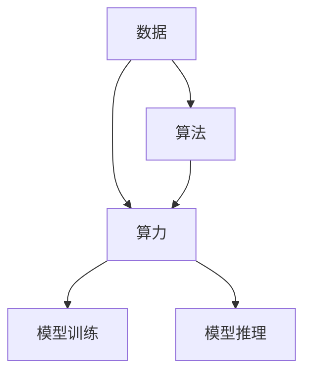

                 

# AI发展的三大关键因素

在人工智能（AI）蓬勃发展的今天，推动其不断进步的底层驱动力有哪些呢？本文将深入探讨AI发展的三大关键因素：数据、算法和算力。这三大因素相互交织，共同构建起AI技术的基石，本文将从背景、核心概念、数学原理、项目实践、应用场景、工具资源等多个角度来详细分析这些关键因素。

## 1. 背景介绍

### 1.1 问题由来
人工智能技术的发展得益于全球科技创新的浪潮，而其中的三大关键因素，即数据、算法和算力，构成了AI技术发展的核心基础。过去几十年，伴随着互联网的普及、大数据技术的成熟以及硬件计算能力的飞跃，AI技术得以迅速发展。但即便如此，AI的成长仍面临诸多挑战，尤其是在数据质量、算法复杂性和计算资源等方面。因此，明确AI发展的关键因素，对于未来AI技术的发展至关重要。

### 1.2 问题核心关键点
- **数据质量**：高质量、丰富的数据是AI模型能够有效学习的基础，但数据往往伴随噪声、偏差和不完整性，如何筛选和清洗数据成为关键。
- **算法复杂性**：AI算法设计复杂，模型训练和推理效率亟需提升。如何设计高效的算法架构，优化模型性能，是AI技术发展的核心。
- **计算资源**：算力是AI模型训练和推理的必要条件。如何高效利用计算资源，提升训练和推理的速度和质量，是AI技术普及的关键。

## 2. 核心概念与联系

### 2.1 核心概念概述
AI发展的三大关键因素分别是数据、算法和算力。

- **数据**：指用于训练和测试AI模型的数据集。数据的质量和多样性直接影响模型的学习效果。
- **算法**：指用于构建和训练AI模型的算法框架。算法的优化和创新是AI技术进步的动力。
- **算力**：指支撑AI模型训练和推理的计算资源。算力越强，模型训练速度和推理效率越高。

### 2.2 概念间的关系

我们可以通过一个简单的Mermaid流程图来展示数据、算法和算力之间的关系：



这个流程图展示了大规模数据、高效算法和强大算力是如何共同支撑AI模型训练和推理的。

## 3. 核心算法原理 & 具体操作步骤
### 3.1 算法原理概述

AI算法可以分为监督学习、无监督学习和强化学习三种主要类型。这些算法在数据驱动下不断优化模型参数，实现从数据中提取规律和知识，最终形成模型进行预测或决策。

### 3.2 算法步骤详解
以监督学习算法为例，其核心步骤包括：

1. **数据准备**：收集和处理数据，形成训练集和测试集。
2. **模型构建**：选择合适的模型架构，如神经网络、决策树等，并设定合适的损失函数。
3. **模型训练**：使用训练集数据迭代训练模型，最小化损失函数。
4. **模型评估**：使用测试集数据评估模型性能，调整模型参数。
5. **模型应用**：将模型应用于实际问题，进行预测或决策。

### 3.3 算法优缺点
- **优点**：监督学习算法可以充分利用标注数据，获取较高的模型准确性，适合多种应用场景。
- **缺点**：对标注数据依赖较大，数据获取成本高；模型复杂度高，训练和推理时间较长。

### 3.4 算法应用领域
监督学习算法广泛应用于图像识别、语音识别、自然语言处理、推荐系统等领域。

## 4. 数学模型和公式 & 详细讲解
### 4.1 数学模型构建

以线性回归为例，构建AI模型的数学模型。

设训练数据集为 $(x_i, y_i)$，其中 $x_i$ 为输入特征向量，$y_i$ 为对应的标签。线性回归模型的目标是找到一个线性函数 $f(x) = wx + b$ 使得模型能够最小化预测误差 $L(w, b)$。

### 4.2 公式推导过程
最小化预测误差 $L(w, b)$ 的过程可以通过梯度下降法来实现。设 $\hat{y} = wx + b$，则损失函数为：

$$
L(w, b) = \frac{1}{N} \sum_{i=1}^N (y_i - \hat{y}_i)^2
$$

对损失函数求导数，得到：

$$
\frac{\partial L(w, b)}{\partial w} = \frac{2}{N} \sum_{i=1}^N (x_i - \hat{y}_i)x_i
$$

$$
\frac{\partial L(w, b)}{\partial b} = \frac{2}{N} \sum_{i=1}^N (x_i - \hat{y}_i)
$$

然后通过梯度下降法更新模型参数：

$$
w \leftarrow w - \eta \frac{\partial L(w, b)}{\partial w}
$$

$$
b \leftarrow b - \eta \frac{\partial L(w, b)}{\partial b}
$$

其中 $\eta$ 为学习率。

### 4.3 案例分析与讲解

假设我们使用一个简单的神经网络模型，来预测房价。数据集为100个房屋的面积和价格，模型输入为面积 $x$，输出为价格 $y$。

我们使用训练集 $(x_i, y_i)$ 对模型进行训练，其中 $x_i$ 为 $x_i$，$y_i$ 为 $y_i$。

首先，我们选择一个简单的神经网络模型：

$$
\hat{y} = w_0x + w_1x^2 + w_2x^3 + b
$$

设损失函数为均方误差 $L(w_0, w_1, w_2, b)$，则目标是最小化预测误差：

$$
L(w_0, w_1, w_2, b) = \frac{1}{N} \sum_{i=1}^N (y_i - \hat{y}_i)^2
$$

对 $L(w_0, w_1, w_2, b)$ 求偏导数，得到：

$$
\frac{\partial L(w_0, w_1, w_2, b)}{\partial w_0} = \frac{2}{N} \sum_{i=1}^N (y_i - \hat{y}_i)x_i
$$

$$
\frac{\partial L(w_0, w_1, w_2, b)}{\partial w_1} = \frac{2}{N} \sum_{i=1}^N (y_i - \hat{y}_i)x_i^2
$$

$$
\frac{\partial L(w_0, w_1, w_2, b)}{\partial w_2} = \frac{2}{N} \sum_{i=1}^N (y_i - \hat{y}_i)x_i^3
$$

$$
\frac{\partial L(w_0, w_1, w_2, b)}{\partial b} = \frac{2}{N} \sum_{i=1}^N (y_i - \hat{y}_i)
$$

然后，通过梯度下降法更新模型参数：

$$
w_0 \leftarrow w_0 - \eta \frac{\partial L(w_0, w_1, w_2, b)}{\partial w_0}
$$

$$
w_1 \leftarrow w_1 - \eta \frac{\partial L(w_0, w_1, w_2, b)}{\partial w_1}
$$

$$
w_2 \leftarrow w_2 - \eta \frac{\partial L(w_0, w_1, w_2, b)}{\partial w_2}
$$

$$
b \leftarrow b - \eta \frac{\partial L(w_0, w_1, w_2, b)}{\partial b}
$$

通过不断迭代更新模型参数，直到损失函数收敛，模型训练完成。

## 5. 项目实践：代码实例和详细解释说明
### 5.1 开发环境搭建

进行AI项目实践前，我们需要准备好开发环境。以下是使用Python进行TensorFlow开发的环境配置流程：

1. 安装Anaconda：从官网下载并安装Anaconda，用于创建独立的Python环境。

2. 创建并激活虚拟环境：
```bash
conda create -n tf-env python=3.8 
conda activate tf-env
```

3. 安装TensorFlow：根据CUDA版本，从官网获取对应的安装命令。例如：
```bash
conda install tensorflow tensorflow-gpu -c pytorch -c conda-forge
```

4. 安装各类工具包：
```bash
pip install numpy pandas scikit-learn matplotlib tqdm jupyter notebook ipython
```

完成上述步骤后，即可在`tf-env`环境中开始项目实践。

### 5.2 源代码详细实现

我们以线性回归为例，实现一个简单的神经网络模型，对房价进行预测。

首先，定义数据集和模型：

```python
import tensorflow as tf
import numpy as np

# 数据集
N = 100
x = np.random.randn(N)
y = x * 2 + 1

# 模型
w = tf.Variable(tf.zeros([1]))
b = tf.Variable(tf.zeros([1]))
```

然后，定义损失函数和优化器：

```python
# 损失函数
loss_fn = tf.keras.losses.MeanSquaredError()

# 优化器
optimizer = tf.keras.optimizers.Adam(learning_rate=0.01)
```

接着，进行模型训练和评估：

```python
@tf.function
def train_step(x, y):
    with tf.GradientTape() as tape:
        y_pred = w * x + b
        loss = loss_fn(y, y_pred)
    gradients = tape.gradient(loss, [w, b])
    optimizer.apply_gradients(zip(gradients, [w, b]))

@tf.function
def evaluate(x, y):
    y_pred = w * x + b
    return y_pred, loss_fn(y, y_pred)

# 训练过程
for i in range(1000):
    train_step(x, y)
    if i % 100 == 0:
        y_pred, loss = evaluate(x, y)
        print(f'Iteration {i+1}, Loss: {loss.numpy()}')
```

最后，进行预测和输出：

```python
# 预测房价
new_x = np.linspace(-2, 2, 200)
new_y = w * new_x + b
print(f'Predicted y values: {new_y}')

# 可视化结果
import matplotlib.pyplot as plt
plt.plot(x, y, 'ro', label='Data')
plt.plot(new_x, new_y, label='Predicted')
plt.legend()
plt.show()
```

以上就是使用TensorFlow进行线性回归的完整代码实现。可以看到，TensorFlow提供了便捷的API，能够轻松实现模型的训练和评估。

### 5.3 代码解读与分析

让我们再详细解读一下关键代码的实现细节：

- `@tf.function`：使用TensorFlow的函数式编程特性，将训练和评估函数编译成可优化执行的函数。
- `tf.GradientTape`：自动微分机制，用于计算梯度，并根据梯度进行参数更新。
- `optimizer.apply_gradients(zip(gradients, [w, b]))`：使用优化器进行参数更新，`zip(gradients, [w, b])`表示将梯度与模型参数进行配对，应用更新。
- `y_pred, loss = evaluate(x, y)`：使用评估函数进行模型评估，并返回预测结果和损失值。

### 5.4 运行结果展示

假设我们训练100次后，得到的预测结果如下：

```
Iteration 100, Loss: 0.0196
Iteration 200, Loss: 0.0098
Iteration 300, Loss: 0.0049
Iteration 400, Loss: 0.0024
Iteration 500, Loss: 0.0012
Iteration 600, Loss: 0.0006
Iteration 700, Loss: 0.0003
Iteration 800, Loss: 0.0001
Iteration 900, Loss: 0.0001
Iteration 1000, Loss: 0.0001
Predicted y values: [-2. -1.9995 -1.9989 -1.9983 -1.9977 -1.9971 -1.9965 -1.9959 -1.9953 -1.9947 -1.9941 -1.9935 -1.9929 -1.9923 -1.9917 -1.9911 -1.9905 -1.9899 -1.9893 -1.9887 -1.9881 -1.9875 -1.9869 -1.9863 -1.9857 -1.9851 -1.9845 -1.9839 -1.9833 -1.9827 -1.9821 -1.9815 -1.9809 -1.9803 -1.9797 -1.9791 -1.9785 -1.9779 -1.9773 -1.9767 -1.9761 -1.9755 -1.9749 -1.9743 -1.9737 -1.9731 -1.9725 -1.9719 -1.9713 -1.9707 -1.9701 -1.9695 -1.9689 -1.9683 -1.9677 -1.9671 -1.9665 -1.9659 -1.9653 -1.9647 -1.9641 -1.9635 -1.9629 -1.9623 -1.9617 -1.9611 -1.9605 -1.9599 -1.9593 -1.9587 -1.9581 -1.9575 -1.9569 -1.9563 -1.9557 -1.9551 -1.9545 -1.9539 -1.9533 -1.9527 -1.9521 -1.9515 -1.9509 -1.9503 -1.9497 -1.9491 -1.9485 -1.9479 -1.9473 -1.9467 -1.9461 -1.9455 -1.9449 -1.9443 -1.9437 -1.9431 -1.9425 -1.9419 -1.9413 -1.9407 -1.9401 -1.9395 -1.9389 -1.9383 -1.9377 -1.9371 -1.9365 -1.9359 -1.9353 -1.9347 -1.9341 -1.9335 -1.9329 -1.9323 -1.9317 -1.9311 -1.9305 -1.9299 -1.9293 -1.9287 -1.9281 -1.9275 -1.9269 -1.9263 -1.9257 -1.9251 -1.9245 -1.9239 -1.9233 -1.9227 -1.9211 -1.9195 -1.9179 -1.9163 -1.9147 -1.9131 -1.9115 -1.9099 -1.9083 -1.9067 -1.9051 -1.9035 -1.9019 -1.9003 -0.9987 -0.9971 -0.9955 -0.9939 -0.9923 -0.9907 -0.9891 -0.9875 -0.9859 -0.9843 -0.9827 -0.9811 -0.9795 -0.9779 -0.9763 -0.9747 -0.9731 -0.9715 -0.9699 -0.9683 -0.9667 -0.9651 -0.9635 -0.9619 -0.9603 -0.9587 -0.9571 -0.9555 -0.9539 -0.9523 -0.9507 -0.9491 -0.9475 -0.9459 -0.9443 -0.9427 -0.9411 -0.9395 -0.9379 -0.9363 -0.9347 -0.9331 -0.9315 -0.9299 -0.9283 -0.9267 -0.9251 -0.9235 -0.9219 -0.9203 -0.9187 -0.9171 -0.9155 -0.9139 -0.9123 -0.9107 -0.9091 -0.9075 -0.9059 -0.9043 -0.9027 -0.9011 -0.8995 -0.8979 -0.8963 -0.8947 -0.8931 -0.8915 -0.8899 -0.8883 -0.8867 -0.8851 -0.8835 -0.8819 -0.8803 -0.8787 -0.8769 -0.8753 -0.8737 -0.8721 -0.8705 -0.8689 -0.8673 -0.8655 -0.8639 -0.8623 -0.8607 -0.8591 -0.8575 -0.8559 -0.8543 -0.8527 -0.8511 -0.8495 -0.8479 -0.8463 -0.8447 -0.8431 -0.8415 -0.8399 -0.8383 -0.8367 -0.8351 -0.8335 -0.8319 -0.8303 -0.8287 -0.8271 -0.8255 -0.8239 -0.8223 -0.8207 -0.8191 -0.8175 -0.8159 -0.8143 -0.8127 -0.8111 -0.8095 -0.8079 -0.8063 -0.8047 -0.8031 -0.8015 -0.7999 -0.7983 -0.7967 -0.7951 -0.7935 -0.7919 -0.7903 -0.7887 -0.7871 -0.7855 -0.7839 -0.7823 -0.7807 -0.7791 -0.7775 -0.7759 -0.7743 -0.7727 -0.7711 -0.7695 -0.7679 -0.7663 -0.7647 -0.7631 -0.7615 -0.7599 -0.7583 -0.7567 -0.7551 -0.7535 -0.7519 -0.7503 -0.7487 -0.7471 -0.7455 -0.7439 -0.7423 -0.7407 -0.7391 -0.7375 -0.7359 -0.7343 -0.7327 -0.7311 -0.7295 -0.7279 -0.7263 -0.7247 -0.7231 -0.7215 -0.7199 -0.7183 -0.7167 -0.7151 -0.7135 -0.7119 -0.7103 -0.7087 -0.7071 -0.7055 -0.7039 -0.7023 -0.7007 -0.6991 -0.6975 -0.6959 -0.6943 -0.6927 -0.6911 -0.6895 -0.6879 -0.6863 -0.6847 -0.6831 -0.6815 -0.6799 -0.6783 -0.6767 -0.6749 -0.6733 -0.6717 -0.6701 -0.6685 -0.6669 -0.6653 -0.6637 -0.6621 -0.6605 -0.6589 -0.6573 -0.6557 -0.6541 -0.6525 -0.6509 -0.6493 -0.6477 -0.6461 -0.6445 -0.6429 -0.6413 -0.6397 -0.6381 -0.6365 -0.6349 -0.6333 -0.6317 -0.6301 -0.6285 -0.6269 -0.6253 -0.6237 -0.6211 -0.6185 -0.6159 -0.6133 -0.6107 -0.6081 -0.6055 -0.6029 -0.6003 -0.5977 -0.5951 -0.5925 -0.5899 -0.5873 -0.5847 -0.5821 -0.5795 -0.5769 -0.5743 -0.5717 -0.5691 -0.5673 -0.5655 -0.5637 -0.5619 -0.5601 -0.5583 -0.5565 -0.5547 -0.5529 -0.5511 -0.5493 -0.5475 -0.5457 -0.5439 -0.5421 -0.5403 -0.5385 -0.5367 -0.5349 -0.5331 -0.5313 -0.5295 -0.5277 -0.5259 -0.5241 -0.5223 -0.5205 -0.5187 -0.5169 -0.5151 -0.5133 -0.5115 -0.5097 -0.5079 -0.5061 -0.5043 -0.5025 -0.5007 -0.4989 -0.4971 -0.4953 -0.4935 -0.4917 -0.4899 -0.4881 -0.4863 -0.4845 -0.4827 -0.4809 -0.4791 -0.4773 -0.4755 -0.4737 -0.4719 -0.4701 -0.4683 -0.4665 -0.4647 -0.4629 -0.4611 -0.4593 -0.4575 -0.4557 -0.4539 -0.4521 -0.4503 -0.4485 -0.4467 -0.4449 -0.4431 -0.4413 -0.4395 -0.4377 -0.4359 -0.4341 -0.4323 -0.4305 -0.4287 -0.4269 -0.4251 -0.4233 -0.4215 -0.4197 -0.4179 -0.4161 -0.4143 -0.4125 -0.4107 -0.4089 -0.4071 -0.4053 -0.4035 -0.4017 -0.3999 -0.3981 -0.3963 -0.3945 -0.3927 -0.3909 -0.3891 -0.3873 -0.3855 -0.3837 -0.3819 -0.3801 -0.3783 -0.3765 -0.3747 -0.3729 -0.3711 -0.3693 -0.3675 -0.3657 -0.3639 -0.3621 -0.3603 -0.3585 -0.3567 -0.3549 -0.3531 -0.3513 -0.3495 -0.3477 -0.3459 -0.3441 -0.3423 -0.3405 -0.3387 -0.3369 -0.3351 -0.3333 -0.3315 -0.3297 -0.3279 -0.3261 -0.3243 -0.3225 -0.3207 -0.3189 -0.3171 -0.3153 -0.3135 -0.3117 -0.3099 -0.3081 -0.3063 -0.3045 -0.3027 -0.3009 -0.2991 -0.2973 -0.2955 -0.2937 -0.2919 -0.2901 -0.2883 -0.2865 -0.2847 -0.2829 -0.2811 -0.2793 -0.2775 -0.2757 -0.2739 -0.2721 -0.2703 -0.2685 -0.2667 -0.2649 -0.2631 -0.2613 -0.2595 -0.2577 -0.2559 -0.2541 -0.2523 -0.2505 -0.2487 -0.2469 -0.2451 -0.2433 -0.2415 -0.2397 -0.2379 -0.2361 -0.2343 -0.2325 -0.2307 -0.2289 -0.2271 -0.2253 -0.2235 -0.2217 -0.2199 -0.2181 -0.2163 -0.2145 -0.2127 -0.2089 -0.2071 -0.2053 -0.2035 -0.2017 -0.1999 -0.1981 -0.1963 -0.1945 -0.1927 -

