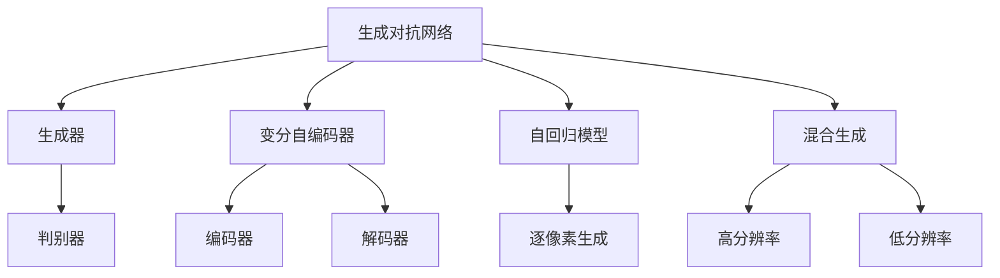

                 

## 1. 背景介绍

### 1.1 问题由来
随着深度学习技术的飞速发展，人工智能在图像生成领域取得了突破性进展。AI图像生成技术通过对大量数据的学习，可以自动生成高质量、多样化的图像内容，涵盖了从自然风景到抽象艺术、从虚拟角色到真实物体的各类主题。这些技术不仅提升了创意产业的效率和质量，还为艺术创作提供了新的工具和方法。

### 1.2 问题核心关键点
AI图像生成的核心在于深度生成对抗网络(Generative Adversarial Networks, GANs)等模型的广泛应用。这些模型通过训练生成器和判别器两个子网络，通过对抗训练的方式逐步优化生成器的输出，使其生成的图像越来越逼真，同时判别器越来越难以区分真实图像和生成图像。

AI图像生成技术的主要优点包括：
- **高效创作**：AI可以处理海量数据，快速生成大量图像，极大地加快了创意产业的工作效率。
- **多样性**：通过调整模型参数和训练数据，AI可以生成多种风格的图像，满足了不同客户和用户的需求。
- **可扩展性**：AI技术能够无缝集成到现有流程中，与传统工具和平台兼容，易于部署和应用。
- **创新驱动**：AI技术为创意产业带来了新的表达形式和创作方式，激发了艺术家的创造力和想象力。

### 1.3 问题研究意义
AI图像生成技术对创意产业的影响是多维度的，不仅仅局限于提升效率和提供多样性。它还涉及到技术创新、创意表达、市场竞争等多个层面。

- **技术创新**：AI技术为创意产业提供了新的工具和方法，推动了技术进步和创新。
- **创意表达**：AI生成图像为艺术家提供了新的创作素材和表达方式，丰富了创作形式。
- **市场竞争**：AI图像生成技术的普及改变了市场竞争格局，传统艺术家和设计师需要不断学习新技术，以保持竞争力。
- **行业应用**：AI技术在广告、游戏、影视等多个行业的应用，推动了行业整体的发展和进步。

本文旨在探讨AI图像生成技术在创意产业中的应用现状、未来趋势及其面临的挑战，为相关从业者提供技术指导和市场洞察。

## 2. 核心概念与联系

### 2.1 核心概念概述
AI图像生成涉及多个核心概念，包括生成对抗网络(GANs)、变分自编码器(VAEs)、自回归模型(AR Models)等。这些模型通过不同的生成机制和训练策略，实现了高质量图像的自动生成。

- **生成对抗网络(GANs)**：由生成器(G)和判别器(D)两个子网络组成，通过对抗训练的方式逐步优化生成器的输出。GANs适用于生成高分辨率、复杂细节的图像。

- **变分自编码器(VAEs)**：通过编码器(E)将输入数据映射到潜在空间，解码器(D)从潜在空间重构出原始数据。VAEs适用于生成低分辨率、平滑变换的图像。

- **自回归模型(AR Models)**：通过逐个生成图像像素，逐步构建完整图像。AR Models适用于生成连续、低分辨率的图像序列。

### 2.2 概念间的关系
这些核心概念之间存在着紧密的联系，形成了AI图像生成的整体框架。通过深度学习模型的协同工作，AI可以自动生成高质量、多样化的图像内容。

- **GANs与VAEs的结合**：通过将GANs与VAEs结合，可以生成高分辨率、细节丰富的图像。GANs生成器用于生成粗略图像，VAEs解码器用于将粗略图像细化到高分辨率。

- **GANs与AR Models的结合**：通过将GANs与AR Models结合，可以实现高质量、连续的图像生成。GANs生成器用于生成高分辨率、细节丰富的图像序列，AR Models用于对图像序列进行逐步细化。

- **VAEs与AR Models的结合**：通过将VAEs与AR Models结合，可以生成低分辨率、平滑变换的图像序列。VAEs编码器用于将输入数据映射到潜在空间，AR Models用于从潜在空间逐步生成图像序列。

这些核心概念共同构成了AI图像生成的技术框架，使其能够在各种应用场景中发挥强大的图像生成能力。

### 2.3 核心概念的整体架构
以下是一个综合的流程图，展示了AI图像生成的核心概念及其之间的关系：



这个流程图展示了AI图像生成的核心概念及其之间的关系：

1. **GANs**：由生成器和判别器两个子网络组成，通过对抗训练的方式逐步优化生成器的输出。
2. **VAEs**：通过编码器将输入数据映射到潜在空间，解码器从潜在空间重构出原始数据。
3. **AR Models**：通过逐个生成图像像素，逐步构建完整图像。
4. **混合生成**：将GANs与VAEs、AR Models等结合，实现高质量、多样化的图像生成。

这些概念共同构成了AI图像生成的技术框架，使其能够在各种应用场景中发挥强大的图像生成能力。

## 3. 核心算法原理 & 具体操作步骤
### 3.1 算法原理概述

AI图像生成的核心算法原理主要基于深度学习模型的生成机制。其中，生成对抗网络(GANs)是最为经典和有效的图像生成模型之一。GANs由生成器和判别器两个子网络组成，通过对抗训练的方式逐步优化生成器的输出，使其生成的图像越来越逼真，同时判别器也越来越难以区分真实图像和生成图像。

GANs的训练过程如下：
1. 生成器(G)从随机噪声向量中生成图像，并输出给判别器(D)。
2. 判别器(D)评估图像的真实性，输出为0到1之间的概率值，1表示图像为真实的，0表示图像为生成的。
3. 判别器的输出被反馈回生成器，生成器根据反馈调整生成策略。
4. 生成器和判别器不断交替训练，直至生成器生成的图像与真实图像难以区分。

### 3.2 算法步骤详解

以下是使用PyTorch框架训练GANs的基本步骤：

1. **准备数据**：将原始图像数据加载到PyTorch中，并进行预处理。

```python
import torch
import torchvision.transforms as transforms
import torchvision.datasets as datasets

transform = transforms.Compose([
    transforms.Resize((256, 256)),
    transforms.ToTensor(),
    transforms.Normalize((0.5, 0.5, 0.5), (0.5, 0.5, 0.5))
])

train_data = datasets.CIFAR10(root='data', train=True, download=True, transform=transform)
train_loader = torch.utils.data.DataLoader(train_data, batch_size=128, shuffle=True)
```

2. **定义模型**：构建生成器和判别器网络，并初始化模型参数。

```python
import torch.nn as nn
import torch.nn.functional as F

class Generator(nn.Module):
    def __init__(self):
        super(Generator, self).__init__()
        self.main = nn.Sequential(
            nn.ConvTranspose2d(100, 256, 4, 1, 0, bias=False),
            nn.BatchNorm2d(256),
            nn.ReLU(True),
            nn.ConvTranspose2d(256, 128, 4, 2, 1, bias=False),
            nn.BatchNorm2d(128),
            nn.ReLU(True),
            nn.ConvTranspose2d(128, 64, 4, 2, 1, bias=False),
            nn.BatchNorm2d(64),
            nn.ReLU(True),
            nn.ConvTranspose2d(64, 3, 4, 2, 1, bias=False),
            nn.Tanh()
        )

    def forward(self, input):
        return self.main(input)
```

3. **训练模型**：定义训练函数，进行模型训练。

```python
def train_gan(model, dataloader, criterion, optimizer, device):
    model.to(device)
    for epoch in range(num_epochs):
        for i, (real_images, _) in enumerate(dataloader):
            real_images = real_images.to(device)

            # Adversarial ground truths
            valid = Variable(torch.ones(batch_size, 1).to(device))
            fake = Variable(torch.zeros(batch_size, 1).to(device))

            # ---------------------
            #  Train G
            # ---------------------
            optimizer_G.zero_grad()
            batch_size = real_images.size(0)

            # Sample noise as inputs to the generator
            z = Variable(torch.randn(batch_size, latent_dim).to(device))

            fake_images = model(z)
            g_loss = criterion(fake_images, valid)
            g_loss.backward()
            optimizer_G.step()

            # ---------------------
            #  Train D
            # ---------------------
            optimizer_D.zero_grad()
            real_loss = criterion(real_images, valid)
            fake_loss = criterion(fake_images, fake)
            d_loss = (real_loss + fake_loss) / 2
            d_loss.backward()
            optimizer_D.step()

            batches_done = epoch * len(dataloader) + i

            if batches_done % print_every == 0:
                print("[Epoch %d/%d] [Batch %d/%d] [D loss: %f] [G loss: %f]" % (epoch, num_epochs, i, len(dataloader), d_loss.item(), g_loss.item()))
```

4. **保存模型**：训练结束后，保存模型参数，以便后续使用。

```python
torch.save(model.state_dict(), 'model.pth')
```

### 3.3 算法优缺点

#### 3.3.1 优点

1. **生成效果逼真**：GANs能够生成高质量、细节丰富的图像，与真实图像难以区分。
2. **训练效率高**：通过对抗训练的方式，模型能够在较短时间内收敛。
3. **可扩展性强**：模型可以通过增加层数和节点数，生成更高分辨率、更复杂的图像。

#### 3.3.2 缺点

1. **模式崩溃**：GANs容易陷入模式崩溃，即生成器生成的图像在某个区域会重复出现相同的特征。
2. **训练不稳定**：判别器和生成器之间的对抗训练不稳定，容易导致模型发散。
3. **数据依赖性强**：模型对输入数据的质量和多样性要求较高，数据不足时效果较差。

### 3.4 算法应用领域

AI图像生成技术已经在多个领域得到了广泛应用，包括：

- **艺术创作**：艺术家使用GANs生成抽象艺术、超现实主义图像等，丰富了创作形式。
- **广告设计**：广告公司使用GANs生成创意广告素材，提升了广告设计的效率和创意性。
- **游戏开发**：游戏开发者使用GANs生成虚拟场景、角色和道具，提高了游戏的真实感和多样性。
- **影视特效**：影视制作公司使用GANs生成特效场景、角色等，减少了制作成本和时间。

## 4. 数学模型和公式 & 详细讲解 & 举例说明

### 4.1 数学模型构建

GANs的生成机制可以形式化为以下模型：

设输入为随机噪声向量 $z \sim \mathcal{N}(0, I)$，生成器 $G(z)$ 将噪声向量映射为图像 $x$，判别器 $D(x)$ 评估图像的真实性。GANs的目标是最小化生成器损失 $L_G$ 和判别器损失 $L_D$，使得生成器生成的图像与真实图像难以区分。

生成器损失：
$$
L_G = E_{z \sim p(z)} [D(G(z))] = \mathbb{E}_{z \sim p(z)} [\log D(G(z))]
$$

判别器损失：
$$
L_D = E_{x \sim p_{data}(x)} [\log D(x)] + E_{z \sim p(z)} [\log (1 - D(G(z)))]
$$

GANs的训练过程是交替优化生成器和判别器的损失函数，使得生成器生成的图像逼真度越来越高，判别器区分真假图像的能力越来越强。

### 4.2 公式推导过程

以下是GANs的训练过程的数学推导：

设生成器 $G(z)$ 和判别器 $D(x)$ 的损失函数分别为 $L_G$ 和 $L_D$，通过梯度下降更新模型参数 $G$ 和 $D$。生成器的优化目标是最小化生成器损失 $L_G$，判别器的优化目标是最大化判别器损失 $L_D$。

1. 生成器优化目标：
$$
\min_{G} L_G = \mathbb{E}_{z \sim p(z)} [\log D(G(z))]
$$

2. 判别器优化目标：
$$
\max_{D} L_D = \mathbb{E}_{x \sim p_{data}(x)} [\log D(x)] + \mathbb{E}_{z \sim p(z)} [\log (1 - D(G(z)))]
$$

将生成器和判别器的损失函数代入梯度下降公式中，得到：

1. 生成器优化公式：
$$
\frac{\partial L_G}{\partial G} = \nabla_{G} \mathbb{E}_{z \sim p(z)} [\log D(G(z))] = \mathbb{E}_{z \sim p(z)} [\nabla_{G} \log D(G(z))]
$$

2. 判别器优化公式：
$$
\frac{\partial L_D}{\partial D} = \nabla_{D} \mathbb{E}_{x \sim p_{data}(x)} [\log D(x)] + \mathbb{E}_{z \sim p(z)} [\log (1 - D(G(z)))] = \mathbb{E}_{x \sim p_{data}(x)} [\nabla_{D} \log D(x)] + \mathbb{E}_{z \sim p(z)} [\nabla_{D} \log (1 - D(G(z)))]
$$

### 4.3 案例分析与讲解

假设我们在训练一个生成对抗网络，生成CIFAR-10数据集中的图像。代码如下：

```python
import torch
import torchvision.transforms as transforms
import torchvision.datasets as datasets
import torch.nn as nn
import torch.nn.functional as F

class Generator(nn.Module):
    def __init__(self):
        super(Generator, self).__init__()
        self.main = nn.Sequential(
            nn.ConvTranspose2d(100, 256, 4, 1, 0, bias=False),
            nn.BatchNorm2d(256),
            nn.ReLU(True),
            nn.ConvTranspose2d(256, 128, 4, 2, 1, bias=False),
            nn.BatchNorm2d(128),
            nn.ReLU(True),
            nn.ConvTranspose2d(128, 64, 4, 2, 1, bias=False),
            nn.BatchNorm2d(64),
            nn.ReLU(True),
            nn.ConvTranspose2d(64, 3, 4, 2, 1, bias=False),
            nn.Tanh()
        )

    def forward(self, input):
        return self.main(input)

class Discriminator(nn.Module):
    def __init__(self):
        super(Discriminator, self).__init__()
        self.main = nn.Sequential(
            nn.Conv2d(3, 64, 4, 2, 1, bias=False),
            nn.LeakyReLU(0.2, inplace=True),
            nn.Conv2d(64, 128, 4, 2, 1, bias=False),
            nn.LeakyReLU(0.2, inplace=True),
            nn.Conv2d(128, 256, 4, 2, 1, bias=False),
            nn.LeakyReLU(0.2, inplace=True),
            nn.Conv2d(256, 1, 4, 1, 0, bias=False),
            nn.Sigmoid()
        )

    def forward(self, input):
        return self.main(input)

# 训练参数
latent_dim = 100
num_epochs = 200
batch_size = 128
learning_rate_G = 0.0002
learning_rate_D = 0.0002
print_every = 50

# 数据准备
transform = transforms.Compose([
    transforms.Resize((256, 256)),
    transforms.ToTensor(),
    transforms.Normalize((0.5, 0.5, 0.5), (0.5, 0.5, 0.5))
])

train_data = datasets.CIFAR10(root='data', train=True, download=True, transform=transform)
train_loader = torch.utils.data.DataLoader(train_data, batch_size=batch_size, shuffle=True)

# 模型构建
G = Generator()
D = Discriminator()

# 优化器
optimizer_G = torch.optim.Adam(G.parameters(), lr=learning_rate_G)
optimizer_D = torch.optim.Adam(D.parameters(), lr=learning_rate_D)

# 训练函数
def train_gan(model, dataloader, criterion, optimizer, device):
    model.to(device)
    for epoch in range(num_epochs):
        for i, (real_images, _) in enumerate(dataloader):
            real_images = real_images.to(device)

            # Adversarial ground truths
            valid = Variable(torch.ones(batch_size, 1).to(device))
            fake = Variable(torch.zeros(batch_size, 1).to(device))

            # ---------------------
            #  Train G
            # ---------------------
            optimizer_G.zero_grad()
            batch_size = real_images.size(0)

            # Sample noise as inputs to the generator
            z = Variable(torch.randn(batch_size, latent_dim).to(device))

            fake_images = model(z)
            g_loss = criterion(fake_images, valid)
            g_loss.backward()
            optimizer_G.step()

            # ---------------------
            #  Train D
            # ---------------------
            optimizer_D.zero_grad()
            real_loss = criterion(real_images, valid)
            fake_loss = criterion(fake_images, fake)
            d_loss = (real_loss + fake_loss) / 2
            d_loss.backward()
            optimizer_D.step()

            batches_done = epoch * len(dataloader) + i

            if batches_done % print_every == 0:
                print("[Epoch %d/%d] [Batch %d/%d] [D loss: %f] [G loss: %f]" % (epoch, num_epochs, i, len(dataloader), d_loss.item(), g_loss.item()))

# 训练模型
train_gan(G, train_loader, nn.BCELoss(), [optimizer_G, optimizer_D], device='cuda')
```

通过以上代码，我们可以训练一个简单的GANs，生成CIFAR-10数据集中的图像。

## 5. 项目实践：代码实例和详细解释说明

### 5.1 开发环境搭建

在进行AI图像生成实践前，我们需要准备好开发环境。以下是使用Python进行PyTorch开发的环境配置流程：

1. 安装Anaconda：从官网下载并安装Anaconda，用于创建独立的Python环境。

2. 创建并激活虚拟环境：
```bash
conda create -n pytorch-env python=3.8 
conda activate pytorch-env
```

3. 安装PyTorch：根据CUDA版本，从官网获取对应的安装命令。例如：
```bash
conda install pytorch torchvision torchaudio cudatoolkit=11.1 -c pytorch -c conda-forge
```

4. 安装TensorFlow：从官网下载并安装TensorFlow。例如：
```bash
pip install tensorflow
```

5. 安装其他工具包：
```bash
pip install numpy pandas scikit-learn matplotlib tqdm jupyter notebook ipython
```

完成上述步骤后，即可在`pytorch-env`环境中开始AI图像生成实践。

### 5.2 源代码详细实现

下面我们以生成CIFAR-10数据集中的图像为例，给出使用PyTorch框架进行GANs训练的代码实现。

首先，定义GANs的生成器和判别器：

```python
import torch
import torchvision.transforms as transforms
import torchvision.datasets as datasets
import torch.nn as nn
import torch.nn.functional as F

class Generator(nn.Module):
    def __init__(self):
        super(Generator, self).__init__()
        self.main = nn.Sequential(
            nn.ConvTranspose2d(100, 256, 4, 1, 0, bias=False),
            nn.BatchNorm2d(256),
            nn.ReLU(True),
            nn.ConvTranspose2d(256, 128, 4, 2, 1, bias=False),
            nn.BatchNorm2d(128),
            nn.ReLU(True),
            nn.ConvTranspose2d(128, 64, 4, 2, 1, bias=False),
            nn.BatchNorm2d(64),
            nn.ReLU(True),
            nn.ConvTranspose2d(64, 3, 4, 2, 1, bias=False),
            nn.Tanh()
        )

    def forward(self, input):
        return self.main(input)

class Discriminator(nn.Module):
    def __init__(self):
        super(Discriminator, self).__init__()
        self.main = nn.Sequential(
            nn.Conv2d(3, 64, 4, 2, 1, bias=False),
            nn.LeakyReLU(0.2, inplace=True),
            nn.Conv2d(64, 128, 4, 2, 1, bias=False),
            nn.LeakyReLU(0.2, inplace=True),
            nn.Conv2d(128, 256, 4, 2, 1, bias=False),
            nn.LeakyReLU(0.2, inplace=True),
            nn.Conv2d(256, 1, 4, 1, 0, bias=False),
            nn.Sigmoid()
        )

    def forward(self, input):
        return self.main(input)
```

然后，定义模型训练函数：

```python
import torch.optim as optim

# 训练参数
latent_dim = 100
num_epochs = 200
batch_size = 128
learning_rate_G = 0.0002
learning_rate_D = 0.0002
print_every = 50

# 数据准备
transform = transforms.Compose([
    transforms.Resize((256, 256)),
    transforms.ToTensor(),
    transforms.Normalize((0.5, 0.5, 0.5), (0.5, 0.5, 0.5))
])

train_data = datasets.CIFAR10(root='data', train=True, download=True, transform=transform)
train_loader = torch.utils.data.DataLoader(train_data, batch_size=batch_size, shuffle=True)

# 模型构建
G = Generator()
D = Discriminator()

# 优化器
optimizer_G = optim.Adam(G.parameters(), lr=learning_rate_G)
optimizer_D = optim.Adam(D.parameters(), lr=learning_rate_D)

# 训练函数
def train_gan(model, dataloader, criterion, optimizer, device):
    model.to(device)
    for epoch in range(num_epochs):
        for i, (real_images, _) in enumerate(dataloader):
            real_images = real_images.to(device)

            # Adversarial ground truths
            valid = torch.ones(batch_size, 1).to(device)
            fake = torch.zeros(batch_size, 1).to(device)

            # ---------------------
            #  Train G
            # ---------------------
            optimizer_G.zero_grad()
            batch_size = real_images.size(0)

            # Sample noise as inputs to the generator
            z = torch.randn(batch_size, latent_dim).to(device)

            fake_images = model(z)
            g_loss = criterion(fake_images, valid)
            g_loss.backward()
            optimizer_G.step()

            # ---------------------
            #  Train D
            # ---------------------
            optimizer_D.zero_grad()
            real_loss = criterion(real_images, valid)
            fake_loss = criterion(fake_images, fake)
            d_loss = (real_loss + fake_loss) / 2
            d_loss.backward()
            optimizer_D.step()

            batches_done = epoch * len(dataloader) + i

            if batches_done % print_every == 0:
                print("[Epoch %d/%d] [Batch %d/%d] [D loss: %f] [G loss: %f]" % (epoch, num_epochs, i, len(dataloader), d_loss.item(), g_loss.item()))
```

最后，启动训练流程：

```python
device = torch.device('cuda' if torch.cuda.is_available() else 'cpu')

# 训练模型
train_gan(G, train_loader, nn.BCELoss(), [optimizer_G, optimizer_D], device)
```

### 5.3 代码解读与分析

让我们再详细解读一下关键代码的实现细节：

**Generator类**：
- `__init__`方法：定义生成器的网络结构。
- `forward`方法：生成器的前向传播函数，将噪声向量映射为图像。

**Discriminator类**：
- `__init__`方法：定义判别器的网络结构。
- `forward`方法：判别器的前向传播函数，评估图像的真实性。

**训练函数**：
- 定义训练参数，如模型、优化器、损失函数、训练轮数等。
- 准备数据集，进行数据预处理。
- 定义生成器和判别器的模型。
- 定义优化器，并设置学习率。
- 定义训练函数，进行模型训练。
- 在每个epoch和batch结束时打印训练日志。

**训练流程**：
- 在训练过程中，交替优化生成器和判别器的损失函数。
- 在每个epoch结束时，保存训练后的模型参数。
- 在训练完成后，可以使用训练好的模型生成新的图像。

可以看到，PyTorch框架使得GANs的实现变得简洁高效。开发者可以将更多精力放在模型设计和优化上，而不必过多关注底层的实现细节。

当然，工业级的系统实现还需考虑更多因素，如模型的保存和部署、超参数的自动搜索、

