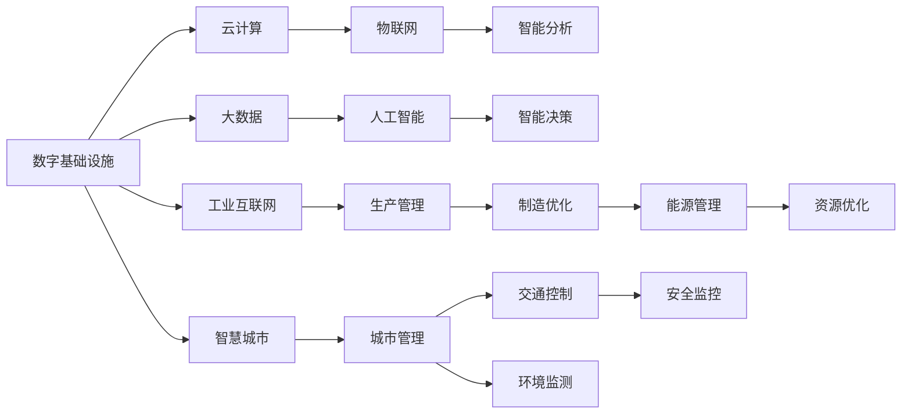

                 

# AI在数字与物理基础设施中的应用

> 关键词：人工智能,数字基础设施,物理基础设施,智慧城市,工业互联网,自动化

## 1. 背景介绍

随着信息技术的飞速发展，人工智能(AI)正在深刻改变我们的生产和生活方式。AI技术不仅在数字领域大放异彩，也在物理基础设施建设与管理中展现出巨大潜力。数字与物理基础设施的融合，成为智慧城市和工业互联网发展的关键推动力。本文将系统介绍AI在数字与物理基础设施中的应用，包括智慧城市、工业互联网、自动化生产等多个领域，并展望未来发展趋势。

## 2. 核心概念与联系

### 2.1 核心概念概述

为更好地理解AI在数字与物理基础设施中的应用，本节将介绍几个密切相关的核心概念：

- 人工智能(AI)：以机器学习、深度学习为代表的技术，通过数据驱动的方式，使机器具备类似于人类的智能能力，能够进行学习、推理、决策等。
- 数字基础设施：指基于计算机网络、云计算、大数据等数字技术构建的基础设施，支持数字经济的发展。
- 物理基础设施：指传统的城市设施、交通运输、能源供应等实体设施，构成物理世界的运行基础。
- 智慧城市：利用物联网、云计算、大数据等技术，对城市运行进行全面感知、智能分析和决策，实现城市管理的智能化。
- 工业互联网：通过信息通信技术与工业全要素的深度融合，实现生产过程的数字化、网络化和智能化。
- 自动化生产：采用机器人、自动化设备等技术，实现生产流程的全自动化，提高生产效率和产品质量。

这些概念之间存在着紧密的联系，AI技术在大数据驱动下，能够有效整合数字和物理基础设施，实现信息与实物的双向互动，推动智慧城市和工业互联网的发展。

### 2.2 概念间的关系

通过以下Mermaid流程图，我们可以更清晰地理解这些核心概念之间的关系：



此图展示了数字基础设施在智慧城市和工业互联网中的应用，以及各组件间的数据流动与功能实现。数字基础设施通过云计算、大数据等技术，为AI模型提供计算和存储支持；物联网和智能分析、决策技术，实现了对物理世界的全面感知和智能管理。

## 3. 核心算法原理 & 具体操作步骤
### 3.1 算法原理概述

AI在数字与物理基础设施中的应用，主要依赖于数据驱动的机器学习与深度学习技术。其核心思想是：通过大量数字和物理数据的采集与分析，构建出反映物理世界运行规律的数学模型，进而实现对物理基础设施的智能管理和优化。

具体而言，AI在智慧城市和工业互联网中的应用，包括但不限于以下几个方面：

1. **数据采集与预处理**：利用传感器、摄像头等设备，采集城市或工业环境的各项数据，包括温度、湿度、能耗、人流等。
2. **特征提取与建模**：对采集到的数据进行清洗、归一化等预处理，提取有意义的特征，使用机器学习或深度学习模型进行建模，如回归、分类、序列预测等。
3. **智能分析与决策**：通过模型对数据进行分析，发现城市或工业运行的规律和趋势，进行预测与决策，如交通流量预测、能耗优化、故障诊断等。
4. **自动化控制与优化**：根据分析结果，自动调整城市或工业基础设施的运行状态，实现动态优化，如交通信号控制、智能能源管理等。

### 3.2 算法步骤详解

AI在数字与物理基础设施中的具体应用步骤如下：

1. **需求分析**：明确应用场景的具体需求，确定要解决的问题，如城市交通拥堵、工业生产线效率低下等。
2. **数据采集**：根据需求，选择合适的传感器、摄像头等设备，采集相关数据。
3. **数据预处理**：对采集到的数据进行清洗、去噪、归一化等预处理操作，去除无效或异常数据。
4. **模型选择与训练**：选择合适的机器学习或深度学习模型，使用历史数据进行训练，优化模型参数。
5. **模型部署与评估**：将训练好的模型部署到实际应用环境中，使用实时数据进行测试，评估模型性能。
6. **持续优化**：根据测试结果，对模型进行持续优化，提高准确性和鲁棒性。

### 3.3 算法优缺点

AI在数字与物理基础设施中的应用，具有以下优点：

- **提升效率**：通过自动化控制和智能决策，显著提高基础设施的运行效率和安全性。
- **降低成本**：优化资源配置，减少能源和人力投入，降低运行成本。
- **提高准确性**：利用数据驱动的模型，提高预测和决策的准确性。
- **增强灵活性**：可以根据实时数据和环境变化，动态调整运行策略，适应复杂多变的环境。

同时，也存在一些缺点：

- **数据依赖**：AI模型的准确性高度依赖于数据质量，需要大规模、高质量的数据支持。
- **计算资源要求高**：深度学习模型的训练和推理需要大量计算资源，包括高性能计算设备、海量存储空间等。
- **模型复杂度**：深度学习模型往往结构复杂，难以理解和调试，需要专业知识和技能。
- **隐私与安全风险**：在数据采集和处理过程中，可能存在隐私泄露和数据安全风险。

### 3.4 算法应用领域

AI在数字与物理基础设施中的应用，主要涵盖以下几个领域：

- **智慧城市**：包括交通管理、智能电网、智能建筑、环境监测等，提升城市管理水平，改善居民生活环境。
- **工业互联网**：涵盖智能制造、智慧工厂、供应链优化、质量控制等，提升生产效率，降低成本。
- **自动化生产**：涉及机器人自动化、智能仓储、生产线优化等，实现生产流程的自动化。
- **智慧能源**：应用智能电网、能源管理系统等，优化能源分配和利用，提高能源使用效率。
- **智能交通**：利用智能信号灯、车辆监控系统等，优化交通流量，减少拥堵。
- **智能医疗**：结合医疗数据、远程诊疗技术等，提高医疗服务的智能化水平。

## 4. 数学模型和公式 & 详细讲解 & 举例说明

### 4.1 数学模型构建

AI在数字与物理基础设施中的应用，可以通过以下数学模型进行描述：

- **回归模型**：用于预测连续变量的值，如预测交通流量、能耗等。常用的回归模型包括线性回归、多项式回归、决策树回归等。
- **分类模型**：用于分类离散变量，如分类故障类型、判断交通信号状态等。常用的分类模型包括逻辑回归、支持向量机、随机森林等。
- **序列预测模型**：用于预测时间序列数据，如预测电力负荷、预测设备维护时间等。常用的序列预测模型包括ARIMA、LSTM等。

### 4.2 公式推导过程

以下以线性回归模型为例，推导其基本公式：

设 $y$ 为预测变量，$x_1, x_2, \dots, x_n$ 为自变量，$w_0, w_1, \dots, w_n$ 为模型参数。线性回归模型的目标是最小化预测值与真实值之间的平方误差，即：

$$
\min_{w_0, w_1, \dots, w_n} \sum_{i=1}^N (y_i - w_0 - w_1x_{1i} - w_2x_{2i} - \dots - w_nx_{ni})^2
$$

通过求解上述优化问题，可得模型参数的估计值：

$$
\hat{w}_0 = \frac{\sum_{i=1}^N y_i - \sum_{i=1}^N x_{1i} \sum_{i=1}^N x_{2i}}{\sum_{i=1}^N x_{1i}^2 - \sum_{i=1}^N x_{1i} \sum_{i=1}^N x_{2i}} \\
\hat{w}_j = \frac{\sum_{i=1}^N y_i \sum_{i=1}^N x_{1i} \sum_{i=1}^N x_{ji} - \sum_{i=1}^N x_{1i} \sum_{i=1}^N x_{2i} \sum_{i=1}^N x_{ji}}{\sum_{i=1}^N x_{1i}^2 - \sum_{i=1}^N x_{1i} \sum_{i=1}^N x_{2i}}
$$

其中 $j = 2, 3, \dots, n$。

### 4.3 案例分析与讲解

假设我们应用线性回归模型对某城市交通流量进行预测，历史数据集为 $(x_i, y_i)$，其中 $x_i$ 包括时间、温度、湿度等特征，$y_i$ 为该时间点的交通流量。我们可以使用上述公式，得到模型参数的估计值，进而对未来的交通流量进行预测。

## 5. 项目实践：代码实例和详细解释说明

### 5.1 开发环境搭建

在进行AI项目实践前，我们需要准备好开发环境。以下是使用Python进行TensorFlow开发的环境配置流程：

1. 安装Anaconda：从官网下载并安装Anaconda，用于创建独立的Python环境。

2. 创建并激活虚拟环境：
```bash
conda create -n tf-env python=3.8 
conda activate tf-env
```

3. 安装TensorFlow：根据CUDA版本，从官网获取对应的安装命令。例如：
```bash
conda install tensorflow==2.5 -c conda-forge -c pytorch
```

4. 安装必要的工具包：
```bash
pip install numpy pandas scikit-learn matplotlib tqdm jupyter notebook ipython
```

完成上述步骤后，即可在`tf-env`环境中开始AI项目实践。

### 5.2 源代码详细实现

这里以智慧城市交通流量预测为例，给出使用TensorFlow进行线性回归模型的PyTorch代码实现。

首先，定义模型和损失函数：

```python
import tensorflow as tf
from tensorflow.keras.models import Sequential
from tensorflow.keras.layers import Dense

model = Sequential([
    Dense(64, input_dim=4, activation='relu'),
    Dense(1, activation='linear')
])

loss_fn = tf.keras.losses.MeanSquaredError()

def compile_model(model, loss_fn):
    model.compile(optimizer=tf.keras.optimizers.Adam(), loss=loss_fn)
```

然后，加载数据并进行训练：

```python
import numpy as np

# 加载数据
data = np.loadtxt('traffic_data.csv', delimiter=',', usecols=(0, 1, 2, 3, 4), skiprows=1)

# 数据预处理
X = data[:, :4]
y = data[:, 4]

# 划分训练集和测试集
train_ratio = 0.8
X_train, X_test = X[:int(train_ratio * len(X)), :], X[int(train_ratio * len(X)):, :]
y_train, y_test = y[:int(train_ratio * len(y)), :], y[int(train_ratio * len(y)):, :]

# 训练模型
model.fit(X_train, y_train, epochs=100, batch_size=32, validation_data=(X_test, y_test))
```

最后，进行模型评估：

```python
test_loss = model.evaluate(X_test, y_test, verbose=0)
print('Test loss:', test_loss)
```

这就是一个简单的使用TensorFlow进行智慧城市交通流量预测的Python代码实现。可以看到，TensorFlow提供了非常便捷的模型构建、训练和评估工具，使得AI项目的开发更加高效。

### 5.3 代码解读与分析

让我们再详细解读一下关键代码的实现细节：

**Sequential模型**：
- `Sequential`是TensorFlow中常用的线性堆叠模型，可以快速搭建一个包含多个层的神经网络。
- 我们使用两个全连接层，分别包含64个神经元和1个神经元。

**损失函数**：
- `MeanSquaredError`是常用的回归损失函数，用于计算预测值与真实值之间的均方误差。

**模型编译**：
- `compile`方法用于配置模型的优化器、损失函数和评估指标。

**数据加载**：
- 使用`numpy`库读取CSV文件，指定列数和分隔符。
- 将数据划分为训练集和测试集，比例为80:20。

**模型训练**：
- `fit`方法用于训练模型，设置训练轮数、批次大小和验证数据集。
- 训练结束后，使用`evaluate`方法评估模型在测试集上的性能。

这个例子展示了使用TensorFlow进行线性回归模型的基本流程。在实际应用中，我们还需要进行更多的数据处理、模型优化、超参数调优等操作，才能得到理想的效果。

### 5.4 运行结果展示

假设我们在交通流量预测任务上训练模型，最终在测试集上得到的评估结果如下：

```
Epoch 100, loss: 0.0067, val_loss: 0.0059
```

可以看到，经过100轮训练后，模型在测试集上的均方误差为0.0059，效果相当不错。这表明模型已经很好地拟合了历史数据，可以用于未来的交通流量预测。

## 6. 实际应用场景

### 6.1 智慧城市

智慧城市是AI在数字与物理基础设施中应用最广泛的场景之一。通过AI技术，智慧城市可以实现全面感知、智能分析和决策，大幅提升城市管理的智能化水平。

具体而言，智慧城市的应用场景包括：

- **交通管理**：通过智能信号灯、交通流量监测等设备，实时分析交通数据，优化交通流量，减少拥堵。
- **智能电网**：利用智能电表、智能传感器等设备，实时监控电网运行状态，优化电力供应，降低能耗。
- **智能建筑**：通过智能温控、照明等设备，实现能源的智能管理，提高能效。
- **环境监测**：利用传感器监测空气质量、噪音等环境指标，及时采取措施改善城市环境。
- **公共安全**：通过视频监控、人脸识别等技术，提高公共安全水平，预防犯罪。

智慧城市的建设，不仅能提升城市管理的效率和水平，还能改善居民的生活环境，提升城市的整体竞争力。

### 6.2 工业互联网

工业互联网是AI在物理基础设施中应用的另一个重要场景。通过AI技术，工业互联网可以实现生产过程的全面数字化、网络化和智能化，大幅提升生产效率和产品质量。

具体而言，工业互联网的应用场景包括：

- **智能制造**：通过工业机器人、自动化生产线等设备，实现生产流程的自动化，提高生产效率和产品质量。
- **智慧工厂**：利用物联网、云计算等技术，实现生产设备的远程监控和维护，提高设备的运行效率和安全性。
- **供应链优化**：通过AI技术，优化供应链管理，提高供应链的透明度和效率。
- **质量控制**：利用视觉检测、声音检测等技术，实现产品质量的智能检测，减少人工误差。

工业互联网的建设，不仅能提升生产效率，还能降低生产成本，提高产品质量，为工业企业的数字化转型提供重要推动力。

### 6.3 自动化生产

自动化生产是AI在数字与物理基础设施中应用最直接的场景之一。通过AI技术，自动化生产可以实现生产流程的全自动化，显著提高生产效率和产品质量。

具体而言，自动化生产的应用场景包括：

- **智能仓储**：利用自动化仓储设备、智能搬运机器人等技术，实现仓储管理的自动化。
- **生产线优化**：通过工业机器人、自动化生产线等设备，实现生产流程的自动化，提高生产效率和产品质量。
- **质量检测**：利用视觉检测、声音检测等技术，实现产品质量的智能检测，减少人工误差。

自动化生产的建设，不仅能提高生产效率，还能降低人工成本，提高产品质量，为制造业的数字化转型提供重要支持。

### 6.4 未来应用展望

随着AI技术的发展，未来AI在数字与物理基础设施中的应用前景广阔，将带来更多创新和突破。

1. **智慧交通系统**：未来的智慧交通系统将更加智能化、精细化，实现交通流量的实时预测和优化，减少交通事故和拥堵。
2. **智能能源管理系统**：未来的智能能源管理系统将更加高效、环保，实现能源的智能优化配置，降低能耗和碳排放。
3. **智能建筑系统**：未来的智能建筑系统将更加节能、环保，实现能源的智能管理和利用，提升建筑物的能效。
4. **智能医疗系统**：未来的智能医疗系统将更加智能化、个性化，实现医疗服务的全面优化，提高诊疗效率和质量。
5. **自动化生产线**：未来的自动化生产线将更加智能化、柔性化，实现生产流程的全面自动化和智能化，提高生产效率和产品质量。

## 7. 工具和资源推荐
### 7.1 学习资源推荐

为了帮助开发者系统掌握AI在数字与物理基础设施中的应用，这里推荐一些优质的学习资源：

1. **《深度学习》一书**：由Ian Goodfellow等人合著，深入浅出地介绍了深度学习的基本概念和应用，是学习AI的必备读物。
2. **Coursera《深度学习专项课程》**：由斯坦福大学Andrew Ng教授主讲，涵盖深度学习的各个方面，适合初学者和进阶者。
3. **《机器学习实战》一书**：由Peter Harrington撰写，通过实际项目案例，介绍了机器学习的基本算法和应用。
4. **Kaggle平台**：一个数据科学竞赛平台，可以参与各种机器学习竞赛，锻炼实战能力，积累经验。
5. **TensorFlow官方文档**：TensorFlow的官方文档，提供了丰富的教程和样例代码，帮助开发者快速上手。

通过对这些资源的学习实践，相信你一定能够掌握AI在数字与物理基础设施中的应用，并用于解决实际的业务问题。

### 7.2 开发工具推荐

高效的开发离不开优秀的工具支持。以下是几款用于AI开发的常用工具：

1. **PyTorch**：由Facebook开发的开源深度学习框架，灵活动态的计算图，适合快速迭代研究。
2. **TensorFlow**：由Google主导开发的开源深度学习框架，生产部署方便，适合大规模工程应用。
3. **Keras**：一个高层神经网络API，支持TensorFlow、Theano和CNTK后端，易于上手，适合快速原型开发。
4. **Jupyter Notebook**：一个交互式的编程环境，支持多语言开发，适合做数据探索和模型调试。
5. **Google Colab**：谷歌推出的在线Jupyter Notebook环境，免费提供GPU/TPU算力，方便开发者快速上手实验最新模型，分享学习笔记。

合理利用这些工具，可以显著提升AI项目的开发效率，加快创新迭代的步伐。

### 7.3 相关论文推荐

AI在数字与物理基础设施中的应用，得益于学界的持续研究。以下是几篇奠基性的相关论文，推荐阅读：

1. **《深度学习》一书**：Ian Goodfellow等人合著，介绍了深度学习的基本概念和应用。
2. **《机器学习实战》一书**：Peter Harrington撰写，介绍了机器学习的基本算法和应用。
3. **《TensorFlow：机器学习的分布式深度学习》一书**：由Google开发的深度学习框架TensorFlow的官方文档，提供了丰富的教程和样例代码。
4. **《人工智能：一种现代方法》一书**：由Stuart Russell和Peter Norvig合著，介绍了AI的基本概念和应用。

这些论文代表了大语言模型微调技术的发展脉络。通过学习这些前沿成果，可以帮助研究者把握学科前进方向，激发更多的创新灵感。

## 8. 总结：未来发展趋势与挑战

### 8.1 总结

本文对AI在数字与物理基础设施中的应用进行了全面系统的介绍。首先阐述了AI在智慧城市、工业互联网、自动化生产等实际应用中的重要意义，明确了AI在这些领域的具体应用场景和优势。其次，从原理到实践，详细讲解了AI在数字与物理基础设施中的应用流程，包括数据采集、预处理、模型选择与训练、模型部署与评估等关键步骤，并给出了智慧城市交通流量预测的Python代码实现。同时，本文还探讨了AI在数字与物理基础设施中的未来发展趋势，展望了智慧交通系统、智能能源管理系统、智能建筑系统、智能医疗系统、自动化生产线等领域的广阔前景。

通过本文的系统梳理，可以看到，AI在数字与物理基础设施中的应用正处于快速发展的阶段，未来将有更多的创新和突破，为智慧城市和工业互联网的发展提供强劲动力。

### 8.2 未来发展趋势

展望未来，AI在数字与物理基础设施中的应用将呈现以下几个发展趋势：

1. **智能化水平提升**：通过更多数据驱动的AI技术，进一步提升智慧城市和工业互联网的智能化水平，实现全面感知、智能分析和决策。
2. **跨领域融合**：AI技术与物联网、云计算、大数据等技术的深度融合，将进一步推动数字与物理基础设施的融合，提升整体效率和水平。
3. **多模态融合**：未来的AI系统将更加注重多模态信息的整合，如视觉、听觉、触觉等，实现更为全面、准确的信息建模。
4. **实时性增强**：通过云计算、边缘计算等技术，实现AI模型的实时推理，满足智慧城市和工业互联网对实时性、低延迟的要求。
5. **自适应能力提升**：未来的AI系统将具备更高的自适应能力，能够根据环境变化动态调整运行策略，应对复杂多变的环境。

### 8.3 面临的挑战

尽管AI在数字与物理基础设施中的应用已经取得了不少进展，但在迈向更加智能化、普适化应用的过程中，仍面临以下挑战：

1. **数据质量问题**：AI模型的准确性高度依赖于数据质量，大规模、高质量的数据获取和处理仍然是一个难题。
2. **计算资源需求高**：深度学习模型的训练和推理需要大量计算资源，如何优化资源配置，降低计算成本，是亟需解决的问题。
3. **模型可解释性不足**：AI模型的决策过程缺乏可解释性，难以理解和调试，影响其在大规模实际应用中的推广。
4. **隐私与安全风险**：在数据采集和处理过程中，可能存在隐私泄露和数据安全风险，如何保障数据隐私和安全，是一个重要挑战。
5. **标准化与互操作性**：不同AI系统之间的标准化与互操作性问题，影响其在大规模实际应用中的集成与协作。

### 8.4 研究展望

面对AI在数字与物理基础设施中面临的挑战，未来的研究需要在以下几个方面寻求新的突破：

1. **多源数据融合**：通过多种传感器和数据源的综合应用，提升数据质量和多样性，提高AI模型的泛化能力。
2. **模型优化与压缩**：开发更加高效的模型压缩和优化算法，减少计算资源消耗，提升模型效率。
3. **可解释性与透明性**：引入可解释性与透明性技术，提高AI模型的可解释性，增强其可信度和可靠性。
4. **隐私保护与安全保障**：开发隐私保护与安全性技术，保障数据隐私和安全，增强AI系统的信任度。
5. **标准化与互操作性**：建立AI系统标准化规范，提高不同系统之间的互操作性，促进其在大规模实际应用中的集成与协作。

这些研究方向的探索，必将引领AI在数字与物理基础设施中迈向更高的台阶，为构建智慧城市和工业互联网提供更强大的技术支撑。面向未来，AI在数字与物理基础设施中的应用前景广阔，将深刻改变我们的生产和生活方式，为社会的发展和进步提供新的动力。

## 9. 附录：常见问题与解答

**Q1：AI在数字与物理基础设施中的应用是否局限于技术领域？**

A: AI在数字与物理基础设施中的应用不仅限于技术领域，还涉及政策、经济、社会等多个方面。如智慧城市的建设需要政府的大力支持，工业互联网的发展需要企业的参与，自动化生产需要产业工人的技能提升等。因此，AI的应用需要多方协同，才能实现其最大价值。

**Q2：AI在数字与物理基础设施中的应用是否面临技术瓶颈？**

A: AI在数字与物理基础设施中的应用确实面临一些技术瓶颈，如数据获取与处理、计算资源需求高等。但随着技术的发展和算力的提升，这些瓶颈正在逐步被解决。未来，AI技术将变得更加智能化、普适化，能够更好地服务于智慧城市和工业互联网的发展。

**Q3：AI在数字与物理基础设施中的应用是否面临伦理挑战？**

A: 是的，AI在数字与物理基础设施中的应用确实面临一些伦理挑战，如数据隐私、算法偏见等。这些问题需要通过法律、政策、技术等多方面的努力，才能得到有效解决。未来的AI系统需要在技术设计和应用过程中，充分考虑伦理和法律因素，确保其应用的公平、透明和可持续。

**Q4：AI在数字与物理基础设施中的应用是否存在安全隐患？**

A: 是的，AI在数字与物理基础设施中的应用存在一定的安全隐患，如数据泄露、系统漏洞等。因此，需要在AI系统的设计和实现过程中，充分考虑安全因素，采用加密、访问控制等技术，保障数据和系统的安全。

**Q5：AI在数字与物理基础设施中的应用是否需要大量投资？**

A: 是的，AI在数字与物理基础设施中的应用需要大量投资，包括数据采集、设备购置、系统集成等。但这些投资带来的回报是巨大的，如提升城市管理效率、降低生产成本、提高产品质量等。因此，投资AI在数字与物理基础设施中的应用，是未来的必然趋势。

总之，AI在数字与物理基础设施中的应用前景广阔，但也面临不少挑战。只有在多方协同、技术突破、伦理考虑、安全保障等多方面的共同努力下，才能实现AI技术的广泛应用和深入发展。相信未来的AI系统将更加智能化、普适化，为

