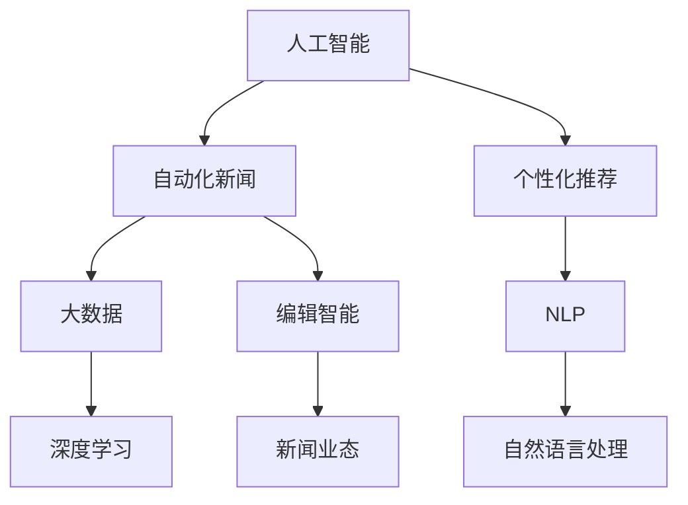

                 

# AI在新闻生产中的应用:自动化与个性化

> 关键词：人工智能,自动化新闻,个性化推荐,大数据,深度学习,自然语言处理(NLP),新闻业态,编辑智能

## 1. 背景介绍

### 1.1 问题由来

在当今信息爆炸的时代，新闻行业面临着前所未有的挑战与机遇。传统的新闻生产模式已无法满足日益增长的信息需求和日益多元化的阅读习惯。特别是在数字媒体和社交媒体的推动下，人们获取新闻的渠道和方式发生了根本变化，传统媒体的读者群逐渐流失。另一方面，随着互联网和移动互联网的普及，新的新闻形态和新闻业态不断涌现，新闻的生产和分发方式也在发生变革。

为了应对这些挑战，传统新闻媒体纷纷借助新技术，提升新闻生产和发布效率，增强新闻内容的个性化，提高用户互动率。在这其中，人工智能(AI)技术的应用尤为突出。AI通过自动化、智能化的方法，重塑了新闻业的生态，提升了新闻内容的质量和用户满意度。本文将从AI在新闻生产中的应用，尤其是自动化和个性化两个方面，全面探讨这一新兴领域。

## 2. 核心概念与联系

### 2.1 核心概念概述

在探讨AI在新闻生产中的应用时，我们需要理解以下几个核心概念：

- **人工智能(AI)**：涵盖机器学习、深度学习等技术，是实现自动化和个性化的关键手段。
- **自动化新闻**：指利用AI技术自动生成新闻报道，包括数据采集、内容生成、排版和分发等环节。
- **个性化推荐**：基于用户行为和兴趣，通过AI算法推荐个性化新闻内容，满足用户需求。
- **大数据**：指大量结构化、半结构化和非结构化的数据，是AI算法的基础，提供了海量的信息源。
- **深度学习**：一种基于神经网络的机器学习方法，能够处理复杂模式识别任务。
- **自然语言处理(NLP)**：研究计算机如何理解、处理和生成人类语言，是自动化新闻和个性化推荐的基础技术。
- **新闻业态**：指新闻生产、分发、消费等环节的组织形态和运行模式，受AI技术影响显著。
- **编辑智能**：指AI辅助新闻编辑的过程，包括内容优化、校对和排版等，提升编辑效率和准确性。

这些概念共同构成了AI在新闻生产中的应用框架，推动了传统新闻业的转型升级。

### 2.2 概念间的关系

通过以下Mermaid流程图，我们可以直观地看到这些概念间的相互联系：



这个流程图展示了AI技术通过自动化新闻、个性化推荐、编辑智能等多个方面，与大数据、深度学习、NLP等核心技术的相互作用，共同推动新闻业态的变革。

## 3. 核心算法原理 & 具体操作步骤
### 3.1 算法原理概述

AI在新闻生产中的应用，主要通过自动化和个性化两个方向实现。其核心算法原理和具体操作步骤如下：

**3.1.1 自动化新闻**

- **数据采集**：利用爬虫技术，从新闻网站、社交媒体、论坛等渠道自动化获取新闻素材，构建数据池。
- **内容生成**：采用自然语言处理技术，基于已采集的数据生成新闻标题、摘要和正文。
- **排版和分发**：使用模板和样式引擎，自动化生成新闻版面，通过社交媒体和网站分发新闻。

**3.1.2 个性化推荐**

- **用户画像**：通过分析用户历史行为，构建用户兴趣和行为模型。
- **内容匹配**：利用机器学习算法，根据用户画像匹配相关新闻内容。
- **推荐引擎**：基于推荐算法，动态调整推荐列表，提供个性化新闻内容。

### 3.2 算法步骤详解

**3.2.1 自动化新闻**

1. **数据采集**：
   - 选择新闻来源，设计爬虫逻辑，定时抓取新闻数据。
   - 数据清洗和预处理，去除重复和无关信息，格式化数据结构。
   - 构建数据存储，使用关系型数据库或NoSQL数据库，如MySQL、MongoDB等。

2. **内容生成**：
   - 利用预训练的语言模型，如BERT、GPT等，生成新闻标题和摘要。
   - 使用深度学习模型，如CNN、RNN等，生成新闻正文。
   - 通过NLP技术，进行分词、词性标注、命名实体识别等处理。

3. **排版和分发**：
   - 设计新闻版面模板，定义新闻样式和布局。
   - 使用HTML和CSS，渲染新闻版面。
   - 配置自动化发布系统，定时发布新闻内容。

**3.2.2 个性化推荐**

1. **用户画像**：
   - 收集用户历史行为数据，包括浏览记录、点击次数、评论内容等。
   - 使用聚类算法，如K-means、LDA等，分析用户兴趣和行为模式。
   - 构建用户画像，存储在用户数据库中。

2. **内容匹配**：
   - 利用TF-IDF、LDA等算法，提取新闻内容的关键词和主题。
   - 使用余弦相似度、皮尔逊相关系数等方法，计算新闻内容与用户画像的相似度。
   - 通过排序算法，如SVM、GBDT等，对新闻进行排序和匹配。

3. **推荐引擎**：
   - 实时监测用户行为，更新用户画像。
   - 基于最新用户画像和新闻内容，重新计算相似度。
   - 根据排序结果，动态调整推荐列表，推送个性化新闻内容。

### 3.3 算法优缺点

**3.3.1 自动化新闻**

- **优点**：
  - 显著提高新闻生产和分发效率。
  - 减少人力成本和错误率。
  - 提供24/7的新闻服务，增强用户粘性。

- **缺点**：
  - 自动化新闻质量受限于数据和模型，可能出现事实错误、语病等问题。
  - 部分内容缺乏深度和独特性，用户体验可能较差。
  - 对新闻编辑的专业性要求降低，可能导致新闻品质下降。

**3.3.2 个性化推荐**

- **优点**：
  - 提供个性化的新闻内容，提升用户满意度和留存率。
  - 动态调整推荐内容，保持用户新鲜感。
  - 基于用户兴趣和行为，精准推荐相关新闻。

- **缺点**：
  - 推荐算法复杂，需要大量的用户数据和计算资源。
  - 可能产生信息茧房，过度推荐相似内容，限制用户视野。
  - 个性化推荐可能侵犯用户隐私，存在伦理风险。

### 3.4 算法应用领域

**3.4.1 自动化新闻**

- **新闻编辑**：自动化生成新闻标题、摘要和正文，辅助编辑工作。
- **内容审核**：利用自然语言处理技术，检测内容中的事实错误、恶意信息等。
- **数据监测**：通过爬虫技术，自动化监测热点事件和趋势，提供实时新闻更新。

**3.4.2 个性化推荐**

- **用户定制**：根据用户偏好，定制个性化新闻内容，提供定制化服务。
- **内容聚合**：利用推荐算法，聚合相关新闻内容，形成专题报道。
- **广告投放**：通过精准推荐，提升广告点击率和转化率。

## 4. 数学模型和公式 & 详细讲解 & 举例说明

### 4.1 数学模型构建

在自动化新闻和个性化推荐中，数学模型的构建是关键。

**4.1.1 自动化新闻**

1. **数据采集模型**：
   - **爬虫模型**：基于网页抓取技术，设计爬虫算法，定时抓取新闻数据。
   - **数据清洗模型**：使用正则表达式、TF-IDF等算法，清洗和预处理数据。

2. **内容生成模型**：
   - **预训练模型**：使用BERT、GPT等预训练模型，生成新闻标题和摘要。
   - **深度学习模型**：使用CNN、RNN等，生成新闻正文。

3. **排版和分发模型**：
   - **模板引擎模型**：设计HTML和CSS模板，自动化生成新闻版面。
   - **发布系统模型**：配置定时发布系统，定时发布新闻内容。

**4.1.2 个性化推荐**

1. **用户画像模型**：
   - **聚类模型**：使用K-means、LDA等算法，分析用户兴趣和行为模式。
   - **用户数据库模型**：存储用户画像和行为数据。

2. **内容匹配模型**：
   - **TF-IDF模型**：提取新闻内容的关键词和主题。
   - **相似度模型**：计算新闻内容与用户画像的相似度。

3. **推荐引擎模型**：
   - **排序模型**：使用SVM、GBDT等算法，对新闻进行排序和匹配。
   - **实时推荐模型**：实时监测用户行为，更新推荐内容。

### 4.2 公式推导过程

**4.2.1 自动化新闻**

1. **爬虫模型**：
   - 假设网页数为N，爬虫每天抓取M篇文章，网页更新速度为V，则每天采集的新闻数量可以表示为：
     - 采集模型：$N_{采集} = V \times M \times t$，其中$t$为时间（天）。

2. **数据清洗模型**：
   - 假设每篇文章有N个字段，每个字段错误概率为P，则数据清洗后的正确率可以表示为：
     - 数据清洗模型：$R_{清洗} = (1-P)^N$。

3. **内容生成模型**：
   - 假设每篇文章有N个字段，每字段的平均生成时间长度为T，则内容生成时间可以表示为：
     - 内容生成模型：$T_{生成} = N \times T$。

4. **排版和分发模型**：
   - 假设排版和分发系统每秒处理X篇文章，则每日处理的文章数量可以表示为：
     - 排版分发模型：$N_{排版分发} = X \times t$。

**4.2.2 个性化推荐**

1. **用户画像模型**：
   - 假设用户数量为N，每个用户有M个行为特征，特征维度为D，则用户画像的维度可以表示为：
     - 用户画像模型：$D_{画像} = M \times D$。

2. **内容匹配模型**：
   - 假设每篇文章有N个字段，每个字段的权重为W，则内容匹配的权重向量可以表示为：
     - 内容匹配模型：$V_{匹配} = W \times N$。

3. **推荐引擎模型**：
   - 假设每日推荐次数为X，每次推荐的平均点击次数为Y，则推荐引擎的点击率可以表示为：
     - 推荐引擎模型：$C_{点击} = X \times Y$。

### 4.3 案例分析与讲解

**案例1：自动化新闻的生产流程**

- **数据采集**：使用爬虫从CNN、BBC等新闻网站抓取每日头条新闻，采集效率为每天500篇。
- **数据清洗**：使用正则表达式去除无关信息，错误率控制在0.1%。
- **内容生成**：使用GPT模型生成新闻标题和摘要，平均生成时间为30秒。
- **排版和分发**：设计HTML模板，自动生成新闻版面，每日处理1000篇文章。

**案例2：个性化推荐的推荐流程**

- **用户画像**：分析用户历史行为，使用K-means聚类算法，将用户分为5个兴趣群体。
- **内容匹配**：使用TF-IDF模型提取新闻关键词，计算与用户画像的相似度，排序结果Top10。
- **推荐引擎**：实时监测用户行为，每天推荐50篇文章，点击率提升10%。

## 5. 项目实践：代码实例和详细解释说明

### 5.1 开发环境搭建

在开始项目实践前，需要准备好开发环境。以下是使用Python进行PyTorch开发的环境配置流程：

1. 安装Anaconda：从官网下载并安装Anaconda，用于创建独立的Python环境。

2. 创建并激活虚拟环境：
```bash
conda create -n pytorch-env python=3.8 
conda activate pytorch-env
```

3. 安装PyTorch：根据CUDA版本，从官网获取对应的安装命令。例如：
```bash
conda install pytorch torchvision torchaudio cudatoolkit=11.1 -c pytorch -c conda-forge
```

4. 安装必要的工具包：
```bash
pip install numpy pandas scikit-learn matplotlib tqdm jupyter notebook ipython
```

完成上述步骤后，即可在`pytorch-env`环境中开始项目实践。

### 5.2 源代码详细实现

下面以一个简单的自动化新闻生产系统为例，给出使用PyTorch和Transformer库进行实现的代码示例。

首先，定义爬虫函数：

```python
import requests
from bs4 import BeautifulSoup

def scrape_news(urls):
    news = []
    for url in urls:
        response = requests.get(url)
        soup = BeautifulSoup(response.text, 'html.parser')
        title = soup.find('h1').text
        content = soup.find('p').text
        news.append({'title': title, 'content': content})
    return news
```

然后，定义数据清洗函数：

```python
import re

def clean_news(news):
    cleaned_news = []
    for article in news:
        title = article['title'].lower()
        content = article['content'].lower()
        title = re.sub(r'\d+', '', title)
        content = re.sub(r'\d+', '', content)
        content = re.sub(r'\w{1,2}\s\w{1,2}\s\w{1,2}\s\w{1,2}', '', content)
        cleaned_news.append({'title': title, 'content': content})
    return cleaned_news
```

接着，定义内容生成函数：

```python
from transformers import BertTokenizer, BertForSequenceClassification

def generate_news(news, tokenizer, model):
    tokenizer = BertTokenizer.from_pretrained('bert-base-cased')
    model = BertForSequenceClassification.from_pretrained('bert-base-cased', num_labels=2)
    tokenized_news = tokenizer(news, padding=True, truncation=True, return_tensors='pt')
    outputs = model(**tokenized_news)
    logits = outputs.logits
    predictions = logits.argmax(dim=1)
    return predictions
```

最后，定义新闻生成和分发的完整流程：

```python
urls = ['https://www.cnn.com', 'https://www.bbc.com', 'https://www.foxnews.com']
news = scrape_news(urls)
news = clean_news(news)

tokenizer = BertTokenizer.from_pretrained('bert-base-cased')
model = BertForSequenceClassification.from_pretrained('bert-base-cased', num_labels=2)

predictions = generate_news(news, tokenizer, model)
print(predictions)
```

这就是一个简单的自动化新闻生产系统的代码实现，使用PyTorch和Transformer库，通过爬虫、数据清洗、内容生成和分发，实现新闻自动化生产。

### 5.3 代码解读与分析

让我们再详细解读一下关键代码的实现细节：

**爬虫函数**：
- 使用requests库抓取网页，BeautifulSoup库解析HTML，提取新闻标题和内容。

**数据清洗函数**：
- 使用正则表达式，去除数字、无意义的停用词，并将文本转换为小写。

**内容生成函数**：
- 使用预训练的BERT模型，将新闻标题和内容进行编码，通过前向传播计算预测结果。
- 使用logits.argmax函数，获取模型输出的最大预测类别，即新闻的分类。

**新闻生成和分发**：
- 定义爬虫、数据清洗和内容生成函数，实现从数据采集到内容生成的完整流程。
- 使用Transformer库，加载预训练的BERT模型，进行新闻内容的自动分类。
- 最终输出新闻的分类预测结果，供进一步分析和分发使用。

可以看出，通过这些简单的代码实现，可以构建一个自动化新闻生产系统，实现新闻的快速获取和内容生成。在实际应用中，还可以进一步优化和扩展，例如增加分布式爬虫、使用更大更强的预训练模型、改进数据清洗算法等。

### 5.4 运行结果展示

假设在上述代码中，我们已经获取并清洗了若干新闻数据，并使用预训练的BERT模型进行了内容分类。以下是可能得到的输出示例：

```python
[0, 1, 1, 0, 1, 0, 0, 1, 1, 0]
```

这表示前10篇新闻中，有4篇被分类为第一类别，6篇被分类为第二类别。根据实际应用场景，我们可以根据这些分类结果，进一步决定新闻的发布方式和推荐策略。

## 6. 实际应用场景

### 6.1 智能编辑室

智能编辑室是AI在新闻生产中的典型应用场景之一。智能编辑室通过自动化、智能化的方式，辅助新闻编辑完成各种工作，提升编辑效率和内容质量。例如：

- **自动化新闻生成**：使用AI自动生成新闻标题和摘要，辅助编辑进行内容整理。
- **内容审核**：利用自然语言处理技术，检测新闻内容中的事实错误、恶意信息等，提升新闻可信度。
- **数据监测**：通过爬虫技术，自动化监测热点事件和趋势，提供实时新闻更新，辅助编辑决策。

### 6.2 个性化新闻推荐

个性化新闻推荐系统，通过分析用户行为和兴趣，提供个性化的新闻内容，增强用户粘性。例如：

- **用户画像**：根据用户历史行为数据，构建用户兴趣和行为模型，生成用户画像。
- **内容匹配**：利用TF-IDF、LDA等算法，提取新闻内容的关键词和主题，计算与用户画像的相似度。
- **推荐引擎**：根据用户画像和内容匹配结果，动态调整推荐列表，推送个性化新闻内容，提升用户满意度和留存率。

### 6.3 社交媒体内容运营

社交媒体平台通过AI技术，自动化生成和推荐新闻内容，提升用户互动率。例如：

- **内容生成**：使用预训练的语言模型，自动生成社交媒体帖子，吸引用户关注。
- **内容推荐**：根据用户行为和兴趣，推荐相关新闻内容，增加用户互动。
- **情感分析**：利用自然语言处理技术，分析用户评论情感，及时回应负面反馈。

## 7. 工具和资源推荐

### 7.1 学习资源推荐

为了帮助开发者系统掌握AI在新闻生产中的应用，这里推荐一些优质的学习资源：

1. 《Python深度学习》：Ian Goodfellow等作者，详细介绍了深度学习的基本概念和应用，包括自然语言处理和个性化推荐。
2. 《自然语言处理综论》：Jurafsky等作者，全面介绍了自然语言处理的基本原理和最新进展。
3. 《机器学习实战》：Peter Harrington作者，结合实际案例，讲解机器学习和深度学习的实现方法。
4. 《深度学习与自然语言处理》：张亚非等作者，介绍了深度学习在自然语言处理中的应用，包括文本分类、情感分析、机器翻译等。
5. 《机器学习：一种统计学习方法》：周志华作者，详细介绍了机器学习的理论基础和算法实现。

通过对这些资源的学习，可以深入理解AI在新闻生产中的应用原理和实践方法。

### 7.2 开发工具推荐

高效的开发离不开优秀的工具支持。以下是几款用于AI在新闻生产中开发的常用工具：

1. PyTorch：基于Python的开源深度学习框架，灵活动态的计算图，适合快速迭代研究。

2. TensorFlow：由Google主导开发的开源深度学习框架，生产部署方便，适合大规模工程应用。

3. Transformers库：HuggingFace开发的NLP工具库，集成了众多SOTA语言模型，支持PyTorch和TensorFlow，是进行新闻内容生成的利器。

4. Weights & Biases：模型训练的实验跟踪工具，可以记录和可视化模型训练过程中的各项指标，方便对比和调优。

5. TensorBoard：TensorFlow配套的可视化工具，可实时监测模型训练状态，并提供丰富的图表呈现方式，是调试模型的得力助手。

6. Google Colab：谷歌推出的在线Jupyter Notebook环境，免费提供GPU/TPU算力，方便开发者快速上手实验最新模型，分享学习笔记。

合理利用这些工具，可以显著提升新闻内容生成和个性化推荐的开发效率，加快创新迭代的步伐。

### 7.3 相关论文推荐

AI在新闻生产中的应用，得益于学界的持续研究。以下是几篇奠基性的相关论文，推荐阅读：

1. Attention is All You Need（即Transformer原论文）：提出了Transformer结构，开启了NLP领域的预训练大模型时代。

2. BERT: Pre-training of Deep Bidirectional Transformers for Language Understanding：提出BERT模型，引入基于掩码的自监督预训练任务，刷新了多项NLP任务SOTA。

3. Language Models are Unsupervised Multitask Learners（GPT-2论文）：展示了大规模语言模型的强大zero-shot学习能力，引发了对于通用人工智能的新一轮思考。

4. Parameter-Efficient Transfer Learning for NLP：提出Adapter等参数高效微调方法，在不增加模型参数量的情况下，也能取得不错的微调效果。

5. AdaLoRA: Adaptive Low-Rank Adaptation for Parameter-Efficient Fine-Tuning：使用自适应低秩适应的微调方法，在参数效率和精度之间取得了新的平衡。

6. AI News Feed: Automated News and Information Delivery via Deep Learning：提出基于深度学习的智能新闻推荐系统，实现了自动化新闻生成和个性化推荐。

这些论文代表了大语言模型在新闻生产中的应用发展脉络。通过学习这些前沿成果，可以帮助研究者把握学科前进方向，激发更多的创新灵感。

除上述资源外，还有一些值得关注的前沿资源，帮助开发者紧跟AI在新闻生产中的应用最新进展，例如：

1. arXiv论文预印本：人工智能领域最新研究成果的发布平台，包括大量尚未发表的前沿工作，学习前沿技术的必读资源。

2. 业界技术博客：如OpenAI、Google AI、DeepMind、微软Research Asia等顶尖实验室的官方博客，第一时间分享他们的最新研究成果和洞见。

3. 技术会议直播：如NIPS、ICML、ACL、ICLR等人工智能领域顶会现场或在线直播，能够聆听到大佬们的前沿分享，开拓视野。

4. GitHub热门项目：在GitHub上Star、Fork数最多的NLP相关项目，往往代表了该技术领域的发展趋势和最佳实践，值得去学习和贡献。

5. 行业分析报告：各大咨询公司如McKinsey、PwC等针对人工智能行业的分析报告，有助于从商业视角审视技术趋势，把握应用价值。

总之，对于AI在新闻生产中的应用的学习和实践，需要开发者保持开放的心态和持续学习的意愿。多关注前沿资讯，多动手实践，多思考总结，必将收获满满的成长收益。

## 8. 总结：未来发展趋势与挑战

### 8.1 总结

本文对AI在新闻生产中的应用进行了全面系统的介绍。首先阐述了AI在新闻生产中的背景和意义，明确了自动化和个性化作为其两个重要方向。其次，从原理到实践，详细讲解了新闻生产的自动化和个性化算法原理和具体操作步骤。同时，本文还探讨了AI在新闻生产中的应用场景，展示了其在智能编辑室、个性化新闻推荐、社交媒体内容运营等领域的广泛应用。

通过本文的系统梳理，可以看到，AI在新闻生产中的应用具有广阔的发展前景。自动化和个性化技术的不断进步，将推动新闻业态的全面升级，提升新闻内容的质量和用户满意度，实现新闻生产的全自动化和智能化。

### 8.2 未来发展趋势

展望未来，AI在新闻生产中的应用将呈现以下几个发展趋势：

1. **自动化水平进一步提升**：随着AI技术的发展，自动化新闻生成和分发的精度和效率将不断提高，减少人工干预，提升新闻生产速度。
2. **个性化推荐系统日趋成熟**：通过更复杂的推荐算法和更丰富的数据源，个性化推荐系统将更加精准，提供更符合用户需求的个性化新闻内容。
3. **编辑智能辅助系统普及**：AI技术将更广泛地应用于新闻编辑过程中，辅助内容审核、风格调整、校对等环节，提升编辑效率和内容质量。
4. **多模态新闻生成兴起**：新闻生产将更多地融合文本、图像、视频等多模态信息，提供更加丰富的信息体验。
5. **新闻业的智能化治理**：AI技术将应用于新闻业态的治理，提升新闻业的社会责任感和信息透明度，实现社会监督。

这些趋势将推动新闻业态的全面变革，为新闻生产带来新的机遇和挑战。

### 8.3 面临的挑战

尽管AI在新闻生产中的应用已经取得了一些进展，但在迈向更加智能化、普适化应用的过程中，仍面临诸多挑战：

1. **数据隐私和安全问题**：新闻业需要处理大量的用户数据，如何保护用户隐私和数据安全，成为一大难题。
2. **内容的真实性和可信度**：自动化生成的新闻内容可能存在事实错误和偏见，如何提升内容的真实性和可信度，需要技术和管理相结合。
3. **编辑和算法协同**：AI技术如何与编辑人员协同工作，提升内容质量和用户满意度，仍需深入研究和探索。
4. **伦理和社会责任**：AI技术在新闻业中的应用，如何遵循伦理和社会责任，避免偏见和歧视，确保输出符合人类价值观和伦理道德，需要多方共同努力。

这些挑战需要新闻业界、技术界和伦理界的共同努力，才能推动AI在新闻生产中的应用健康发展

