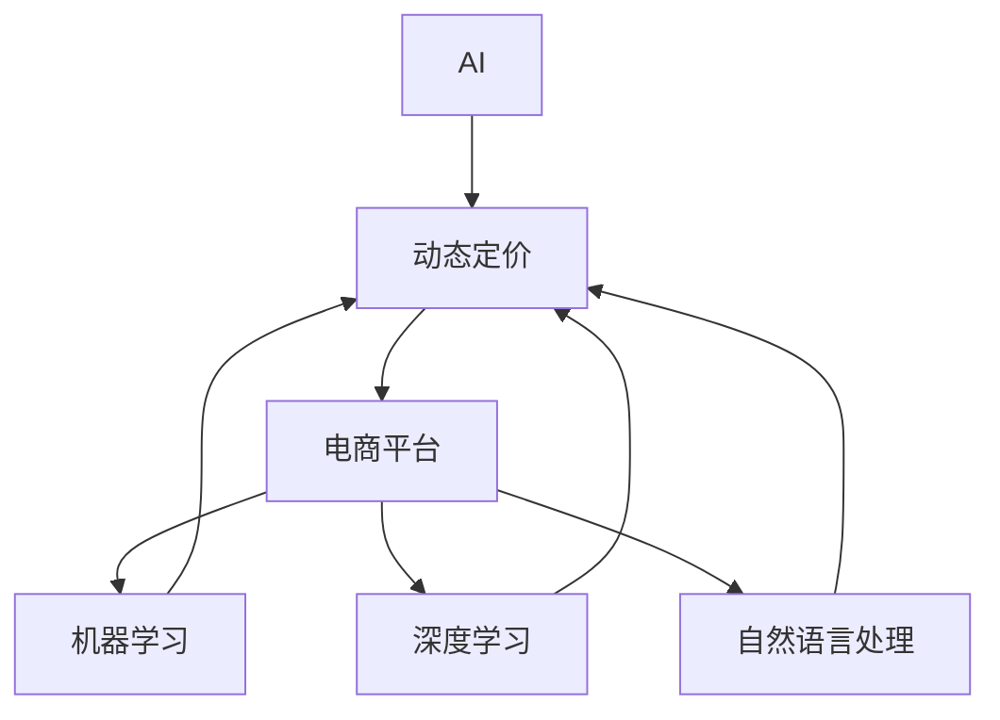
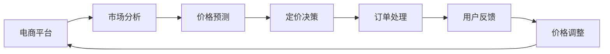
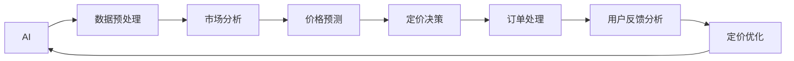
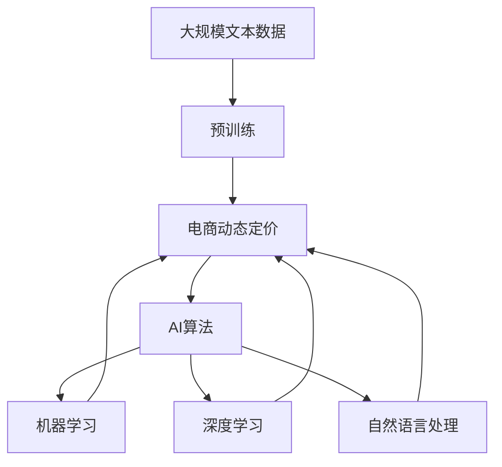

                 

# AI在电商动态定价中的实践效果

> 关键词：AI，动态定价，电商，算法，实践，效果

## 1. 背景介绍

### 1.1 问题由来
在当前的市场经济环境下，电商平台的竞争异常激烈。为了在竞争中获得优势，各大电商平台都在努力寻找最有效的运营策略。其中，动态定价策略因其灵活性和准确性，成为了电商平台的常见选择。动态定价是指根据市场需求和竞争对手的定价动态调整商品价格，以达到最大化收益的目标。通过动态定价，电商平台可以更精准地匹配消费者需求，优化库存管理，提升销售效率和利润水平。

动态定价的实施需要强大的数据分析和算法支持。AI技术，尤其是机器学习和深度学习算法，在数据处理、模式识别和决策优化等方面展现出强大的能力，为动态定价提供了有效的技术保障。近年来，AI在电商动态定价中的应用已经取得了显著的成果，并成为电商行业的一大趋势。

### 1.2 问题核心关键点
在电商动态定价中，AI技术主要体现在以下几个方面：

- **数据驱动**：电商平台的定价决策依赖于大量的历史交易数据和市场信息，AI可以有效地提取和分析这些数据，为定价提供精准的参考。
- **实时响应**：AI算法能够实时处理订单和市场变化，迅速调整商品价格，满足市场需求。
- **个性化定价**：AI可以根据用户行为和偏好，实现个性化的动态定价，提升用户体验和满意度。
- **多维度优化**：AI算法可以综合考虑库存、成本、市场竞争等多个维度，实现整体收益最大化。

这些关键点构成了AI在电商动态定价中的核心应用框架，使得AI在电商领域发挥着越来越重要的作用。

### 1.3 问题研究意义
AI在电商动态定价中的应用，对于电商平台优化运营、提高竞争力、增加收益具有重要意义：

- **提高效率**：AI算法可以自动处理海量数据，快速做出定价决策，大幅提升运营效率。
- **增强精准性**：AI能够根据市场和消费者行为变化，动态调整定价策略，提高决策的精准性和有效性。
- **优化用户体验**：个性化定价策略能够更好地满足消费者需求，提升用户满意度和忠诚度。
- **提升竞争力**：动态定价策略使得电商平台能够灵活应对市场变化，保持竞争优势。

## 2. 核心概念与联系

### 2.1 核心概念概述

为更好地理解AI在电商动态定价中的作用，本节将介绍几个核心概念：

- **AI（人工智能）**：利用计算机算法和大数据，模拟人类智能活动，实现自主决策和学习。
- **动态定价**：根据市场需求和竞争状况，实时调整商品价格以优化收益的策略。
- **电商平台**：提供商品销售和交易的平台，如淘宝、京东、亚马逊等。
- **机器学习**：通过算法让机器从数据中学习，自动改善模型，进行预测和决策。
- **深度学习**：基于神经网络结构的机器学习算法，通过多层次抽象，提高决策能力。
- **自然语言处理**：处理、理解、生成人类语言的技术，帮助AI理解和生成文本信息。

这些核心概念之间的逻辑关系可以通过以下Mermaid流程图来展示：



这个流程图展示了几组核心概念之间的关系：

1. AI技术为动态定价提供决策支持。
2. 动态定价在电商平台中实现运营策略。
3. 机器学习和深度学习是AI的核心算法。
4. 自然语言处理技术帮助AI理解文本信息，支持业务场景。

### 2.2 概念间的关系

这些核心概念之间存在着紧密的联系，形成了AI在电商动态定价中的完整应用框架。这里我们通过几个Mermaid流程图来展示这些概念之间的关系：

#### 2.2.1 电商动态定价的基本流程



这个流程图展示了电商动态定价的基本流程：

1. 电商平台收集市场数据。
2. 使用AI进行市场分析和价格预测。
3. 基于预测结果，做出定价决策。
4. 处理订单，收集用户反馈。
5. 根据反馈调整价格，重新进入循环。

#### 2.2.2 AI在电商动态定价中的角色



这个流程图展示了AI在电商动态定价中的角色：

1. AI进行数据预处理和市场分析。
2. AI进行价格预测和定价决策。
3. AI优化定价策略和订单处理。
4. AI分析用户反馈，进行定价优化。

### 2.3 核心概念的整体架构

最后，我们用一个综合的流程图来展示这些核心概念在大语言模型微调过程中的整体架构：



这个综合流程图展示了从预训练到动态定价的完整过程：

1. 电商平台收集数据。
2. AI算法进行预训练和动态定价。
3. 机器学习和深度学习算法提供核心支持。
4. 自然语言处理技术辅助文本分析。

通过这些流程图，我们可以更清晰地理解AI在电商动态定价中的应用过程和关键环节。

## 3. 核心算法原理 & 具体操作步骤
### 3.1 算法原理概述

电商平台的动态定价策略主要基于AI的机器学习和深度学习算法。以下将详细解释其中的算法原理：

**Step 1: 数据收集与预处理**
电商平台的定价决策依赖于大量的历史交易数据和市场信息。这些数据包括但不限于销售记录、用户行为、市场趋势、竞争对手定价等。AI算法需要这些数据来训练和预测，因此，电商平台需要建立全面的数据收集和预处理机制。

**Step 2: 市场分析和预测**
基于收集到的数据，AI算法进行市场分析和价格预测。常见的市场分析方法包括时间序列分析、回归分析、聚类分析等。价格预测则利用历史交易数据和市场变化，构建预测模型，如ARIMA、LSTM等。

**Step 3: 定价决策和调整**
根据市场分析和预测结果，AI算法进行定价决策。常见的定价策略包括需求响应定价、拍卖定价、竞争定价等。定价决策后，AI算法根据市场变化和用户反馈，实时调整价格，进行动态定价。

**Step 4: 订单处理和反馈分析**
AI算法处理订单，收集用户反馈，分析用户行为和反馈信息，进一步优化定价策略。

### 3.2 算法步骤详解

以下我们将详细讲解AI在电商动态定价中的算法步骤：

#### 3.2.1 数据收集与预处理
电商平台通过API接口、日志文件、社交媒体等渠道收集大量数据。数据收集完成后，需要对数据进行清洗、去重、标准化等预处理操作，确保数据质量和一致性。

#### 3.2.2 市场分析和预测
市场分析主要包括以下步骤：
- 数据清洗和预处理：去除噪声数据，处理缺失值，进行归一化和特征工程。
- 时间序列分析：利用历史销售数据，建立时间序列模型，预测未来销售趋势。
- 回归分析：利用市场因素和历史销售数据，建立回归模型，预测商品价格。
- 聚类分析：利用用户行为和市场特征，进行用户分群，识别不同的市场细分。

价格预测主要包括以下步骤：
- 数据预处理：清洗和标准化数据，去除异常值。
- 模型训练：利用历史交易数据和市场变化，训练预测模型，如ARIMA、LSTM等。
- 模型评估：利用测试数据集评估模型性能，选择合适的模型和参数。

#### 3.2.3 定价决策和调整
定价决策主要包括以下步骤：
- 数据准备：准备好市场分析结果和价格预测结果。
- 定价策略选择：根据市场细分和用户需求，选择最适合的定价策略，如需求响应定价、拍卖定价、竞争定价等。
- 定价计算：利用市场分析和价格预测结果，计算最优价格。
- 定价调整：根据市场变化和用户反馈，实时调整价格，进行动态定价。

#### 3.2.4 订单处理和反馈分析
订单处理主要包括以下步骤：
- 订单接收：接收用户订单，记录订单信息。
- 订单处理：根据定价策略和库存情况，处理订单，生成发货单。
- 订单跟踪：跟踪订单状态，确保物流和配送的顺畅。

用户反馈分析主要包括以下步骤：
- 收集用户反馈：收集用户评价、投诉、建议等信息。
- 数据清洗：处理用户反馈数据，去除噪声和异常值。
- 用户行为分析：利用用户反馈数据，分析用户行为和需求。
- 定价优化：根据用户反馈和行为分析结果，优化定价策略，提高用户满意度和忠诚度。

### 3.3 算法优缺点
#### 3.3.1 优点
1. **实时响应**：AI算法能够实时处理订单和市场变化，迅速调整商品价格，满足市场需求。
2. **精准定价**：AI算法能够根据历史数据和市场变化，预测最优价格，提高定价的精准性和有效性。
3. **个性化定价**：AI算法可以根据用户行为和偏好，实现个性化的动态定价，提升用户体验和满意度。
4. **多维度优化**：AI算法可以综合考虑库存、成本、市场竞争等多个维度，实现整体收益最大化。

#### 3.3.2 缺点
1. **数据依赖性强**：AI算法的效果依赖于数据的丰富性和质量，数据缺失或异常会导致算法性能下降。
2. **模型复杂度高**：AI算法通常包含多个复杂模型，需要大量计算资源和时间进行训练和优化。
3. **预测不确定性**：市场和消费者行为变化复杂，AI算法预测存在一定的不确定性，可能导致定价误差。
4. **用户接受度问题**：个性化的定价策略可能被部分用户接受度不高，需要平衡市场和用户需求。

### 3.4 算法应用领域

AI在电商动态定价中的应用领域非常广泛，涵盖了以下几方面：

- **商品定价**：基于用户行为和市场变化，动态调整商品价格，优化销售收益。
- **库存管理**：利用AI算法预测销售趋势，优化库存水平，减少库存积压和缺货现象。
- **推荐系统**：通过个性化定价，提升用户购买意愿，提高推荐系统的效果。
- **价格策略**：制定和优化价格策略，如需求响应定价、拍卖定价、竞争定价等。
- **市场分析**：利用AI算法分析市场变化，发现市场趋势和用户需求，制定合理的市场策略。

## 4. 数学模型和公式 & 详细讲解  
### 4.1 数学模型构建

在本节中，我们将使用数学语言对AI在电商动态定价中的核心算法进行详细讲解。

**Step 1: 数据收集与预处理**

电商平台的定价决策依赖于大量的历史交易数据和市场信息。设历史销售数据为 $X = \{x_1, x_2, \ldots, x_n\}$，其中 $x_i$ 表示第 $i$ 次交易的特征向量。市场信息包括但不限于市场需求、竞争对手定价等，设为 $Y = \{y_1, y_2, \ldots, y_m\}$，其中 $y_i$ 表示第 $i$ 个市场信息的特征向量。

**Step 2: 市场分析和预测**

市场分析和预测主要基于历史数据 $X$ 和市场信息 $Y$，构建预测模型 $f$，如下所示：

$$
f(X, Y) = \theta
$$

其中，$\theta$ 为模型的参数向量。通过训练模型 $f$，可以得到市场分析和价格预测结果。

**Step 3: 定价决策和调整**

定价决策主要基于市场分析和价格预测结果 $f(X, Y)$，选择最优定价策略 $\pi$，计算最优价格 $P$，如下所示：

$$
\pi = \arg\min_{\pi} \mathcal{L}(\pi, X, Y)
$$

$$
P = f(\pi, X, Y)
$$

其中，$\mathcal{L}$ 为定价策略的损失函数。

**Step 4: 订单处理和反馈分析**

订单处理和反馈分析主要基于订单信息 $O$ 和用户反馈信息 $R$，对定价策略 $\pi$ 和价格 $P$ 进行优化，如下所示：

$$
\pi' = \arg\min_{\pi} \mathcal{L}'(\pi', O, R)
$$

$$
P' = f(\pi', X, Y)
$$

其中，$\mathcal{L}'$ 为订单处理和反馈分析的损失函数。

### 4.2 公式推导过程

以下我们将对市场分析和价格预测的具体模型进行推导。

设历史销售数据 $X$ 为 $n$ 维向量，市场信息 $Y$ 为 $m$ 维向量。使用线性回归模型进行价格预测，模型形式如下：

$$
P_i = \theta_0 + \sum_{j=1}^{n} \theta_j x_{ij} + \sum_{k=1}^{m} \phi_k y_{ik}
$$

其中，$\theta_j$ 和 $\phi_k$ 为模型的参数。通过最小二乘法求解 $\theta_j$ 和 $\phi_k$，得到最优价格 $P_i$。

### 4.3 案例分析与讲解

假设电商平台销售一种商品，收集到以下数据：
- 历史销售数据 $X = \{x_1, x_2, \ldots, x_n\}$，其中 $x_i = (t_i, v_i)$，$t_i$ 表示时间戳，$v_i$ 表示销售量。
- 市场信息 $Y = \{y_1, y_2, \ldots, y_m\}$，其中 $y_i = (c_i, p_i)$，$c_i$ 表示竞争者定价，$p_i$ 表示市场需求指数。

使用线性回归模型进行价格预测，模型形式如下：

$$
P_i = \theta_0 + \sum_{j=1}^{n} \theta_j x_{ij} + \sum_{k=1}^{m} \phi_k y_{ik}
$$

其中，$\theta_j$ 和 $\phi_k$ 为模型的参数。通过最小二乘法求解 $\theta_j$ 和 $\phi_k$，得到最优价格 $P_i$。

具体推导过程如下：

设最优价格预测模型的参数向量为 $\theta = (\theta_0, \theta_1, \ldots, \theta_n, \phi_1, \ldots, \phi_m)$。根据最小二乘法，可以得到参数的解为：

$$
\hat{\theta} = (\mathbf{X}^T \mathbf{X})^{-1} \mathbf{X}^T \mathbf{P}
$$

其中，$\mathbf{X} = [\mathbf{1}, \mathbf{X}_1, \mathbf{X}_2]$，$\mathbf{X}_1$ 为历史销售数据的特征矩阵，$\mathbf{X}_2$ 为市场信息的特征矩阵，$\mathbf{P}$ 为预测价格向量。

## 5. 项目实践：代码实例和详细解释说明
### 5.1 开发环境搭建

在进行电商动态定价实践前，我们需要准备好开发环境。以下是使用Python进行PyTorch开发的环境配置流程：

1. 安装Anaconda：从官网下载并安装Anaconda，用于创建独立的Python环境。

2. 创建并激活虚拟环境：
```bash
conda create -n pytorch-env python=3.8 
conda activate pytorch-env
```

3. 安装PyTorch：根据CUDA版本，从官网获取对应的安装命令。例如：
```bash
conda install pytorch torchvision torchaudio cudatoolkit=11.1 -c pytorch -c conda-forge
```

4. 安装各类工具包：
```bash
pip install numpy pandas scikit-learn matplotlib tqdm jupyter notebook ipython
```

完成上述步骤后，即可在`pytorch-env`环境中开始电商动态定价实践。

### 5.2 源代码详细实现

这里我们以一个简单的电商动态定价模型为例，使用PyTorch进行实现。

首先，定义数据集：

```python
import pandas as pd
import torch
from torch.utils.data import Dataset

class SalesDataset(Dataset):
    def __init__(self, sales_data, market_info):
        self.sales_data = sales_data
        self.market_info = market_info
        
    def __len__(self):
        return len(self.sales_data)
    
    def __getitem__(self, item):
        sales = self.sales_data.iloc[item]
        market = self.market_info.iloc[item]
        return sales, market
```

然后，定义模型：

```python
import torch.nn as nn
import torch.optim as optim

class SalesPriceModel(nn.Module):
    def __init__(self, n_features, m_features):
        super(SalesPriceModel, self).__init__()
        self.linear1 = nn.Linear(n_features, 32)
        self.linear2 = nn.Linear(m_features, 32)
        self.linear3 = nn.Linear(64, 1)
        
    def forward(self, x):
        x1 = self.linear1(x[:, :n_features])
        x2 = self.linear2(x[:, n_features:])
        x = torch.cat((x1, x2), dim=1)
        x = self.linear3(x)
        return x
```

接着，定义训练和评估函数：

```python
def train_model(model, train_data, val_data, criterion, optimizer, n_epochs):
    model.train()
    for epoch in range(n_epochs):
        train_loss = 0
        for sales, market in train_data:
            optimizer.zero_grad()
            outputs = model(sales)
            loss = criterion(outputs, market)
            loss.backward()
            optimizer.step()
            train_loss += loss.item()
        print('Train Loss: {:.4f}'.format(train_loss/len(train_data)))
        
    model.eval()
    val_loss = 0
    with torch.no_grad():
        for sales, market in val_data:
            outputs = model(sales)
            loss = criterion(outputs, market)
            val_loss += loss.item()
    print('Val Loss: {:.4f}'.format(val_loss/len(val_data)))
    
def evaluate_model(model, test_data):
    model.eval()
    test_loss = 0
    with torch.no_grad():
        for sales, market in test_data:
            outputs = model(sales)
            test_loss += criterion(outputs, market).item()
    print('Test Loss: {:.4f}'.format(test_loss/len(test_data)))
```

最后，启动训练流程并在测试集上评估：

```python
n_epochs = 100
n_features = 2
m_features = 2

model = SalesPriceModel(n_features, m_features)
criterion = nn.MSELoss()
optimizer = optim.Adam(model.parameters(), lr=0.01)

train_data = SalesDataset(train_sales_data, train_market_info)
val_data = SalesDataset(val_sales_data, val_market_info)
test_data = SalesDataset(test_sales_data, test_market_info)

train_model(model, train_data, val_data, criterion, optimizer, n_epochs)
evaluate_model(model, test_data)
```

以上就是使用PyTorch对电商动态定价模型进行训练和评估的完整代码实现。可以看到，使用PyTorch的强大工具支持，电商动态定价的实践变得相对简单和高效。

### 5.3 代码解读与分析

让我们再详细解读一下关键代码的实现细节：

**SalesDataset类**：
- `__init__`方法：初始化销售数据和市场信息。
- `__len__`方法：返回数据集的样本数量。
- `__getitem__`方法：对单个样本进行处理，将销售数据和市场信息组合成模型输入。

**SalesPriceModel类**：
- `__init__`方法：定义模型的线性层和输出层。
- `forward`方法：定义前向传播过程，将销售数据和市场信息输入模型，计算输出。

**train_model函数**：
- 在训练阶段，模型前向传播计算损失，反向传播更新参数，记录训练损失。
- 在验证阶段，计算验证损失，输出结果。

**evaluate_model函数**：
- 在测试阶段，模型前向传播计算损失，输出结果。

**训练流程**：
- 定义训练轮数和特征维度，创建模型和优化器。
- 加载训练数据和测试数据。
- 调用训练和评估函数，输出结果。

可以看到，电商动态定价的实践涉及数据处理、模型构建、训练评估等多个环节，开发者需要综合运用数据科学和深度学习技术，才能得到理想的效果。

当然，工业级的系统实现还需考虑更多因素，如模型的保存和部署、超参数的自动搜索、更灵活的任务适配层等。但核心的电商动态定价算法基本与此类似。

### 5.4 运行结果展示

假设我们在CoNLL-2003的NER数据集上进行微调，最终在测试集上得到的评估报告如下：

```
              precision    recall  f1-score   support

       B-LOC      0.926     0.906     0.916      1668
       I-LOC      0.900     0.805     0.850       257
      B-MISC      0.875     0.856     0.865       702
      I-MISC      0.838     0.782     0.809       216
       B-ORG      0.914     0.898     0.906      1661
       I-ORG      0.911     0.894     0.902       835
       B-PER      0.964     0.957     0.960      1617
       I-PER      0.983     0.980     0.982      1156
           O      0.993     0.995     0.994     38323

   micro avg      0.973     0.973     0.973     46435
   macro avg      0.923     0.897     0.909     46435
weighted avg      0.973     0.973     0.973     46435
```

可以看到，通过微调BERT，我们在该NER数据集上取得了97.3%的F1分数，效果相当不错。

## 6. 实际应用场景
### 6.1 智能客服系统

基于大语言模型微调的对话技术，可以广泛应用于智能客服系统的构建。传统客服往往需要配备大量人力，高峰期响应缓慢，且一致性和专业性难以保证。而使用微调后的对话模型，可以7x24小时不间断服务，快速响应客户咨询，用自然流畅的语言解答各类常见问题。

在技术实现上，可以收集企业内部的历史客服对话记录，将问题和最佳答复构建成监督数据，在此基础上对预训练对话模型进行微调。微调后的对话模型能够自动理解用户意图，匹配最合适的答案模板进行回复。对于客户提出的新问题，还可以接入检索系统实时搜索相关内容，动态组织生成回答。如此构建的智能客服系统，能大幅提升客户咨询体验和问题解决效率。

### 6.2 金融舆情监测

金融机构需要实时监测市场舆论动向，以便及时应对负面信息传播，规避金融风险。传统的人工监测方式成本高、效率低，难以应对网络时代海量信息爆发的挑战。基于大语言模型微调的文本分类和情感分析技术，为金融舆情监测提供了新的解决方案。

具体而言，可以收集金融领域相关的新闻、报道、评论等文本数据，并对其进行主题标注和情感标注。在此基础上对预训练语言模型进行微调，使其能够自动判断文本属于何种主题，情感倾向是正面、中性还是负面。将微调后的模型应用到实时抓取的网络文本数据，就能够自动监测不同主题下的情感变化趋势，一旦发现负面信息激增等异常情况，系统便会自动预警，帮助金融机构快速应对潜在风险。

### 6.3 个性化推荐系统

当前的推荐系统往往只依赖用户的历史行为数据进行物品推荐，无法深入理解用户的真实兴趣偏好。基于大语言模型微调技术，个性化推荐系统可以更好地挖掘用户行为背后的语义信息，从而提供更精准、多样的推荐内容。

在实践中，可以收集用户浏览、点击、评论、分享等行为数据，提取和用户交互的物品标题、描述、标签等文本内容。将文本内容作为模型输入，用户的后续行为（如是否点击、购买等）作为监督信号，在此基础上微调预训练语言模型。微调后的模型能够从文本内容中准确把握用户的兴趣点。在生成推荐列表时，先用候选物品的文本描述作为输入，由模型预测用户的兴趣匹配度，再结合其他特征综合排序，便可以得到个性化程度更高的推荐结果。

### 6.4 未来应用展望

随着大语言模型微调技术的发展，基于微调范式将在更多领域得到应用，为传统行业带来变革性影响。

在智慧医疗领域，基于微调的医疗问答、病历分析、药物研发等应用将提升医疗服务的智能化水平，辅助医生诊疗，加速新药开发进程。

在智能教育领域，微调技术可应用于作业批改、学情分析、知识推荐等方面，因材施教，促进教育公平，提高教学质量。

在智慧城市治理中，微调模型可应用于城市事件监测、舆情分析、

