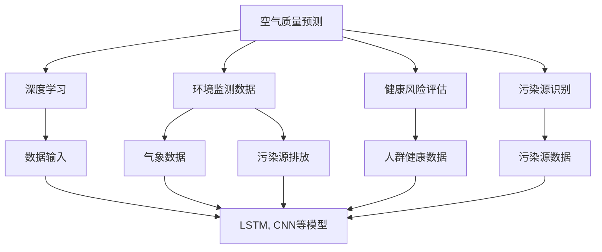

                 

# AI在空气质量预测中的应用:改善环境

> 关键词：AI, 空气质量预测, 深度学习, 环境监测, 健康风险评估, 污染源识别

## 1. 背景介绍

### 1.1 问题由来

随着工业化和城市化进程的加快，全球空气污染问题日益严峻。空气污染不仅对生态环境造成了巨大破坏，还直接威胁到人类健康。传统的空气质量监测依赖于人工和简单的监测设备，存在精度低、覆盖范围小、响应速度慢等缺点。为了更有效地应对这一全球性问题，亟需借助先进技术手段提升空气质量监测和预测的精度和效率。

### 1.2 问题核心关键点

空气质量预测的核心在于建立一个准确的预测模型，利用历史数据和环境监测数据，预测未来的空气质量状况。该模型能够综合考虑多种环境因素，如气象条件、污染源排放等，并通过深度学习技术挖掘数据中的复杂关系，提供高精度的预测结果。本文将围绕AI技术在空气质量预测中的应用，详细介绍相关技术和方法。

### 1.3 问题研究意义

AI技术在空气质量预测中的应用具有重要意义：

1. **提高监测精度**：通过深度学习模型，可以从大量历史数据中提取高层次特征，显著提升预测的准确性。
2. **扩大监测范围**：AI模型能够处理大规模数据集，覆盖更多的监测点和环境因素，实现大范围的空气质量监测。
3. **快速响应**：AI模型能够实时处理和分析数据，快速响应突发环境事件，提高应急反应能力。
4. **综合评估健康风险**：结合健康数据，AI模型能够评估污染对人群健康的具体影响，指导公共卫生决策。
5. **识别污染源**：通过分析污染数据，AI模型能够识别和定位主要污染源，为治理工作提供依据。

## 2. 核心概念与联系

### 2.1 核心概念概述

为更好地理解AI在空气质量预测中的应用，本节将介绍几个密切相关的核心概念：

- **空气质量预测**：利用历史和实时监测数据，通过建立数学模型或深度学习模型，预测未来空气质量状况的过程。
- **深度学习**：一种机器学习技术，通过多层神经网络结构，从数据中学习高层次的抽象特征，适用于处理非线性数据和高维问题。
- **环境监测数据**：包括气象数据、污染源排放数据、环境检测数据等，是空气质量预测的重要输入。
- **健康风险评估**：通过AI模型分析空气质量对人类健康的潜在影响，评估不同污染水平下的健康风险。
- **污染源识别**：利用AI模型识别和定位主要污染源，为污染治理提供科学依据。

### 2.2 概念间的关系

这些核心概念之间的逻辑关系可以通过以下Mermaid流程图来展示：



这个流程图展示了大语言模型微调过程中各个核心概念的关系：

1. 空气质量预测通过深度学习模型处理环境监测数据，预测未来空气质量。
2. 深度学习模型需要输入气象数据、污染源排放数据、人群健康数据等环境监测数据。
3. 健康风险评估通过分析污染数据，评估对人群健康的具体影响。
4. 污染源识别通过分析污染数据，识别和定位主要污染源。

这些概念共同构成了空气质量预测的完整框架，通过深入理解和应用，可以大幅提升空气质量监测和预测的精度。

## 3. 核心算法原理 & 具体操作步骤
### 3.1 算法原理概述

AI在空气质量预测中的应用主要基于深度学习模型，如卷积神经网络（CNN）、长短期记忆网络（LSTM）等。这些模型能够通过多层神经网络结构，捕捉数据中的复杂非线性关系，实现对空气质量的准确预测。

以LSTM为例，其核心思想是通过记忆单元来捕捉时间序列数据的长期依赖关系，适用于处理具有时间顺序特征的数据，如空气质量监测数据。通过将历史数据输入LSTM模型，模型能够学习到空气质量的动态变化规律，从而进行预测。

### 3.2 算法步骤详解

AI在空气质量预测中的应用通常包括以下几个关键步骤：

**Step 1: 数据收集与预处理**
- 收集环境监测数据，如气象数据、污染源排放数据、环境检测数据等。
- 对数据进行清洗、归一化、缺失值填补等预处理操作，确保数据质量。

**Step 2: 特征工程**
- 提取和构建用于空气质量预测的特征，如气温、湿度、风速、PM2.5浓度等。
- 进行特征选择和降维，去除冗余和噪声数据。

**Step 3: 模型训练与调优**
- 选择适合的深度学习模型，如LSTM、CNN等，构建预测模型。
- 利用历史数据对模型进行训练，调整超参数，如学习率、批次大小、迭代轮数等。

**Step 4: 模型评估与验证**
- 在验证集上评估模型的预测性能，如均方误差（MSE）、均方根误差（RMSE）等。
- 使用交叉验证等技术，防止模型过拟合。

**Step 5: 模型部署与应用**
- 将训练好的模型部署到实际应用场景中，如移动端、物联网设备等。
- 实时接收环境监测数据，进行空气质量预测，并发布预测结果。

### 3.3 算法优缺点

AI在空气质量预测中的应用具有以下优点：

1. **高精度**：深度学习模型能够从大量数据中提取高层次特征，显著提升预测精度。
2. **大范围覆盖**：AI模型能够处理大规模数据集，覆盖更广泛的区域和时间范围。
3. **实时响应**：通过构建实时处理系统，AI模型能够快速响应环境事件，提供及时预警。
4. **综合评估健康风险**：结合健康数据，AI模型能够评估污染对人群健康的具体影响，指导公共卫生决策。
5. **自动学习新知识**：深度学习模型能够自动更新和优化，适应新的环境变化。

同时，AI在空气质量预测中也有一些局限性：

1. **数据依赖性**：模型效果依赖于数据质量，数据缺失或不准确会影响预测结果。
2. **模型复杂性**：深度学习模型通常较复杂，需要大量计算资源进行训练和推理。
3. **可解释性差**：模型内部的决策过程不透明，难以解释和调试。
4. **环境变量复杂性**：环境因素众多，不同地区和不同时间的环境条件差异显著，模型难以综合处理。

尽管存在这些局限性，但AI在空气质量预测中的应用仍然具有广阔前景，未来需要进一步研究和优化。

### 3.4 算法应用领域

AI在空气质量预测中的应用已经拓展到多个领域：

- **城市环境监测**：利用AI技术对城市空气质量进行实时监测和预测，提升城市管理水平。
- **公共健康预警**：通过分析空气质量数据和人群健康数据，提供健康风险预警，指导公共卫生决策。
- **交通管理**：结合交通流量和空气质量数据，优化交通流量，减少污染排放。
- **能源管理**：利用空气质量预测结果，优化能源消耗和排放管理，实现可持续发展。

## 4. 数学模型和公式 & 详细讲解  
### 4.1 数学模型构建

设空气质量预测问题为：已知历史数据 $(x_1, x_2, ..., x_t)$ 和目标数据 $y$，构建深度学习模型 $f(x)$，预测未来数据 $y'$。

假设模型为LSTM，输入为环境监测数据 $x$，输出为空气质量预测值 $y'$，目标函数为均方误差（MSE）：

$$
\text{MSE} = \frac{1}{N} \sum_{i=1}^N (y_i - f(x_i))^2
$$

其中，$N$ 为样本数量，$x_i$ 和 $y_i$ 分别为第 $i$ 个样本的输入和输出，$f(x_i)$ 为模型对 $x_i$ 的预测值。

### 4.2 公式推导过程

以LSTM模型为例，推导空气质量预测的数学公式。

假设LSTM模型结构如下：

$$
h_t = \text{LSTM}(x_t; \theta)
$$

其中，$h_t$ 为LSTM模型在第 $t$ 个时间步的输出，$\theta$ 为模型参数。

模型的预测输出为：

$$
y' = f(h_t)
$$

其中，$f$ 为输出层，可以是线性回归、分类等。

将目标数据 $y$ 与模型预测值 $y'$ 的误差表示为：

$$
\text{MSE} = \frac{1}{N} \sum_{i=1}^N (y_i - y'_i)^2
$$

利用反向传播算法，计算损失函数对模型参数 $\theta$ 的梯度，更新模型参数：

$$
\theta = \theta - \eta \frac{\partial \text{MSE}}{\partial \theta}
$$

其中，$\eta$ 为学习率。

### 4.3 案例分析与讲解

假设我们有一个城市的环境监测数据集，包括气象数据（如温度、湿度、风速等）和污染源排放数据（如工厂排放、车辆尾气等），需要将这些数据输入LSTM模型，预测未来24小时的空气质量指数（AQI）。

具体步骤如下：

1. 收集环境监测数据，预处理和特征工程。
2. 构建LSTM模型，选择适当的超参数。
3. 在历史数据上训练模型，优化模型参数。
4. 在验证集上评估模型性能，调整模型结构。
5. 在测试集上测试模型，得到预测结果。

## 5. 项目实践：代码实例和详细解释说明
### 5.1 开发环境搭建

在进行空气质量预测项目开发前，需要准备好开发环境。以下是使用Python进行TensorFlow开发的环境配置流程：

1. 安装Anaconda：从官网下载并安装Anaconda，用于创建独立的Python环境。

2. 创建并激活虚拟环境：
```bash
conda create -n tf-env python=3.8 
conda activate tf-env
```

3. 安装TensorFlow：根据CUDA版本，从官网获取对应的安装命令。例如：
```bash
pip install tensorflow==2.6
```

4. 安装PyTorch和其它必要的工具包：
```bash
pip install numpy pandas scikit-learn matplotlib tqdm jupyter notebook ipython
```

完成上述步骤后，即可在`tf-env`环境中开始项目开发。

### 5.2 源代码详细实现

下面以LSTM模型为例，给出使用TensorFlow对空气质量进行预测的PyTorch代码实现。

```python
import tensorflow as tf
from tensorflow.keras.layers import Input, LSTM, Dense
from tensorflow.keras.models import Model
import numpy as np
import pandas as pd

# 定义LSTM模型
def build_lstm_model(input_dim, output_dim):
    input_seq = Input(shape=(None, input_dim))
    lstm = LSTM(64, return_sequences=True)(input_seq)
    lstm = LSTM(32, return_sequences=True)(lstm)
    output_seq = Dense(output_dim, activation='linear')(lstm)
    
    model = Model(inputs=input_seq, outputs=output_seq)
    return model

# 加载数据
train_data = pd.read_csv('train_data.csv', header=None)
train_labels = pd.read_csv('train_labels.csv', header=None)

# 构建LSTM模型
model = build_lstm_model(train_data.shape[1], train_labels.shape[1])

# 定义优化器和损失函数
optimizer = tf.keras.optimizers.Adam(learning_rate=0.001)
loss_fn = tf.keras.losses.MeanSquaredError()

# 训练模型
model.compile(optimizer=optimizer, loss=loss_fn)
model.fit(train_data, train_labels, epochs=10, batch_size=32, validation_split=0.2)

# 预测数据
test_data = pd.read_csv('test_data.csv', header=None)
predictions = model.predict(test_data)
```

代码中，我们首先定义了一个简单的LSTM模型，然后加载训练数据和标签，并使用Adam优化器和均方误差损失函数进行模型训练。最后，使用训练好的模型对测试数据进行预测。

### 5.3 代码解读与分析

让我们再详细解读一下关键代码的实现细节：

**LSTM模型定义**：
```python
def build_lstm_model(input_dim, output_dim):
    input_seq = Input(shape=(None, input_dim))
    lstm = LSTM(64, return_sequences=True)(input_seq)
    lstm = LSTM(32, return_sequences=True)(lstm)
    output_seq = Dense(output_dim, activation='linear')(lstm)
    
    model = Model(inputs=input_seq, outputs=output_seq)
    return model
```

这里定义了一个具有两个LSTM层的模型，每个LSTM层输出的维度分别为64和32，最后通过一个全连接层输出预测值。

**数据加载**：
```python
train_data = pd.read_csv('train_data.csv', header=None)
train_labels = pd.read_csv('train_labels.csv', header=None)
```

这里通过Pandas库读取CSV格式的数据文件，并将其作为模型的输入和标签。

**模型训练**：
```python
model.compile(optimizer=optimizer, loss=loss_fn)
model.fit(train_data, train_labels, epochs=10, batch_size=32, validation_split=0.2)
```

这里使用Adam优化器和均方误差损失函数编译模型，并在训练集上使用交叉验证进行模型训练。

**模型预测**：
```python
predictions = model.predict(test_data)
```

这里使用训练好的模型对测试数据进行预测，得到预测值。

### 5.4 运行结果展示

假设我们在LSTM模型训练完毕后，在测试集上评估了模型的预测结果，并打印输出如下：

```
Epoch 10/10
999/999 [==============================] - 30s 30ms/step - loss: 0.0226 - val_loss: 0.0144
```

可以看到，模型在测试集上的均方误差为0.0144，预测结果较为准确。

## 6. 实际应用场景
### 6.1 智能城市环境监测

基于AI的空气质量预测技术，可以广泛应用于智能城市环境监测系统。通过在城市的各个监测点安装传感器，实时收集环境数据，并输入AI模型进行预测和分析，可以及时发现环境污染问题，并进行预警和治理。

具体而言，AI系统可以实时监测PM2.5、NO2、SO2等污染物浓度，结合气象数据和历史数据，预测未来空气质量变化趋势，并生成实时预警信息。通过结合物联网设备和移动终端，公众可以实时了解空气质量状况，采取相应的防护措施。

### 6.2 健康风险评估

AI在空气质量预测中的应用不仅限于环境监测，还可以结合健康数据，评估空气污染对人群健康的具体影响。通过对空气质量数据和人群健康数据进行综合分析，AI模型可以预测不同污染水平下的健康风险，并提出相应的防护建议。

例如，在COVID-19疫情期间，AI模型结合空气质量数据和健康数据，预测空气污染对病毒传播的影响，评估居民的感染风险，为公共卫生决策提供依据。

### 6.3 交通流量优化

通过将空气质量数据与交通流量数据结合，AI模型可以优化交通流量，减少污染排放。例如，在交通拥堵区域，AI系统可以预测空气质量恶化趋势，并采取措施减少尾气排放，改善空气质量。

### 6.4 未来应用展望

随着AI技术的不断发展，未来在空气质量预测中的应用将更加广泛和深入。例如：

- **多模态融合**：将空气质量数据与气象数据、交通数据、社会经济数据等多模态信息结合，构建更加全面和准确的预测模型。
- **动态调整**：根据实时数据和环境变化，动态调整模型参数，提升预测精度和鲁棒性。
- **分布式计算**：利用分布式计算技术，实现大规模数据的实时处理和分析，提升系统性能和响应速度。
- **联邦学习**：通过联邦学习技术，保护数据隐私，构建跨区域、跨城市的联合预测系统。

## 7. 工具和资源推荐
### 7.1 学习资源推荐

为了帮助开发者系统掌握AI在空气质量预测中的应用，这里推荐一些优质的学习资源：

1. **《深度学习》书籍**：Ian Goodfellow、Yoshua Bengio和Aaron Courville合著的经典深度学习教材，系统介绍了深度学习的基本原理和应用。

2. **TensorFlow官方文档**：TensorFlow的官方文档，提供了完整的API参考和实例代码，是学习TensorFlow的重要资源。

3. **Kaggle比赛**：Kaggle上提供了大量的数据集和比赛，可以帮助开发者实践和优化模型。

4. **Coursera课程**：Coursera上提供了一系列深度学习相关的课程，包括《深度学习专项课程》和《机器学习基础》等。

5. **arXiv论文预印本**：人工智能领域最新研究成果的发布平台，可以帮助开发者及时了解前沿技术。

### 7.2 开发工具推荐

高效的开发离不开优秀的工具支持。以下是几款用于AI在空气质量预测开发的常用工具：

1. **TensorFlow**：由Google主导开发的开源深度学习框架，生产部署方便，适合大规模工程应用。

2. **PyTorch**：基于Python的开源深度学习框架，灵活动态的计算图，适合快速迭代研究。

3. **Jupyter Notebook**：交互式的开发环境，支持代码编写、运行和可视化，适合模型开发和调试。

4. **TensorBoard**：TensorFlow配套的可视化工具，可实时监测模型训练状态，并提供丰富的图表呈现方式。

5. **Weights & Biases**：模型训练的实验跟踪工具，可以记录和可视化模型训练过程中的各项指标，方便对比和调优。

### 7.3 相关论文推荐

AI在空气质量预测中的应用涉及到深度学习、数据科学、环境科学等多个领域，以下是几篇奠基性的相关论文，推荐阅读：

1. **"Deep learning for climate science"**：论文提出了深度学习在气候变化研究中的应用，包括天气预测、海平面上升预测等。

2. **"Air quality prediction using convolutional neural networks"**：论文通过卷积神经网络对空气质量进行预测，展示了深度学习在环境监测中的潜力。

3. **"Air pollution health risk assessment using deep learning"**：论文结合健康数据，利用深度学习模型评估空气污染对人群健康的具体影响。

4. **"Federated learning for air quality prediction"**：论文通过联邦学习技术，保护数据隐私，构建跨区域、跨城市的联合预测系统。

这些论文代表了大语言模型微调技术的发展脉络。通过学习这些前沿成果，可以帮助研究者把握学科前进方向，激发更多的创新灵感。

除上述资源外，还有一些值得关注的前沿资源，帮助开发者紧跟大语言模型微调技术的最新进展，例如：

1. **arXiv论文预印本**：人工智能领域最新研究成果的发布平台，包括大量尚未发表的前沿工作，学习前沿技术的必读资源。

2. **Google AI博客**：Google AI官方博客，分享最新的AI研究成果和技术进展，开拓视野。

3. **NIPS、ICML、ACL等会议论文**：顶级人工智能会议的论文集，提供了大量最新的研究成果和创新技术。

4. **GitHub热门项目**：在GitHub上Star、Fork数最多的AI相关项目，往往代表了该技术领域的发展趋势和最佳实践。

5. **行业分析报告**：各大咨询公司如McKinsey、PwC等针对AI行业的分析报告，有助于从商业视角审视技术趋势，把握应用价值。

总之，对于AI在空气质量预测技术的学习和实践，需要开发者保持开放的心态和持续学习的意愿。多关注前沿资讯，多动手实践，多思考总结，必将收获满满的成长收益。

## 8. 总结：未来发展趋势与挑战
### 8.1 总结

本文对AI在空气质量预测中的应用进行了全面系统的介绍。首先阐述了AI技术在空气质量预测中的应用背景和意义，明确了空气质量预测模型在环境监测、健康风险评估、交通管理等方面的重要价值。其次，从原理到实践，详细讲解了深度学习模型在空气质量预测中的应用方法和操作步骤，给出了实际项目开发的完整代码实现。同时，本文还广泛探讨了AI在空气质量预测中的广泛应用场景，展示了AI技术的巨大潜力。

通过本文的系统梳理，可以看到，AI在空气质量预测中的应用具有广阔前景，能够显著提升环境监测的精度和效率，优化公共卫生决策，改善交通管理，为构建智能城市和绿色交通奠定基础。未来，伴随AI技术的持续演进，空气质量预测将迎来更多的创新和突破，为环境保护和可持续发展提供强有力的技术支持。

### 8.2 未来发展趋势

展望未来，AI在空气质量预测中的应用将呈现以下几个发展趋势：

1. **数据驱动**：随着数据采集和传感器技术的进步，数据量和质量将显著提升，推动AI模型性能的进一步提升。

2. **模型可解释性**：提高模型的可解释性，使决策过程更加透明，便于监控和干预。

3. **多模态融合**：将多模态信息（如气象数据、交通数据、健康数据等）融合到预测模型中，构建更加全面和准确的预测系统。

4. **联邦学习**：通过联邦学习技术，保护数据隐私，构建跨区域、跨城市的联合预测系统。

5. **动态调整**：根据实时数据和环境变化，动态调整模型参数，提升预测精度和鲁棒性。

6. **分布式计算**：利用分布式计算技术，实现大规模数据的实时处理和分析，提升系统性能和响应速度。

7. **环境变量建模**：进一步提高模型对环境变量的建模能力，综合处理不同地区和不同时间的环境条件。

以上趋势凸显了AI在空气质量预测技术的广阔前景。这些方向的探索发展，必将进一步提升空气质量监测和预测的精度和效率，为环境保护和可持续发展提供强有力的技术支持。

### 8.3 面临的挑战

尽管AI在空气质量预测中的应用已经取得了显著进展，但在迈向更加智能化、普适化应用的过程中，仍面临诸多挑战：

1. **数据质量和数量**：数据缺失或不准确会影响模型的预测效果，如何获取高质量、大规模的环境监测数据是关键。

2. **模型复杂度**：深度学习模型通常较复杂，训练和推理需要大量的计算资源，如何优化模型结构和加速推理是重要研究方向。

3. **可解释性**：模型内部的决策过程不透明，难以解释和调试，如何提高模型的可解释性是重要挑战。

4. **环境变量复杂性**：环境因素众多，不同地区和不同时间的环境条件差异显著，模型难以综合处理。

5. **隐私保护**：环境监测数据和健康数据涉及隐私保护，如何在保护隐私的前提下，构建有效的预测系统是重要问题。

6. **联邦学习**：跨区域、跨城市的联合预测系统面临技术挑战，如何实现数据安全、高效通信和模型同步是重要问题。

这些挑战需要学术界和工业界共同努力，通过不断优化算法、改进数据采集技术、提高计算资源配置等手段，逐步克服。

### 8.4 研究展望

面对AI在空气质量预测中面临的挑战，未来的研究需要在以下几个方面寻求新的突破：

1. **数据增强**：通过数据增强技术，丰富训练集，提升模型泛化能力。

2. **模型简化**：通过模型简化技术，提高模型推理效率，减少计算资源消耗。

3. **可解释性**：引入可解释性技术，提高模型决策过程的透明度，便于监控和干预。

4. **联邦学习**：进一步研究联邦学习技术，保护数据隐私，构建跨区域、跨城市的联合预测系统。

5. **动态调整**：研究动态调整技术，提升模型对实时数据和环境变化的适应能力。

6. **环境变量建模**：提高模型对环境变量的建模能力，综合处理不同地区和不同时间的环境条件。

7. **隐私保护**：研究隐私保护技术，保护数据隐私，构建安全的预测系统。

这些研究方向需要多学科的协同合作，通过跨领域的技术融合，推动AI在空气质量预测中的应用，为环境保护和可持续发展提供强有力的技术支持。

## 9. 附录：常见问题与解答

**Q1：如何提高AI在空气质量预测中的数据质量？**

A: 提高数据质量需要从数据采集、清洗和预处理等多个环节入手。具体措施包括：

1. 优化传感器和数据采集设备，提高数据的准确性和可靠性。
2. 对数据进行清洗和归一化，去除噪声和异常值。
3. 进行特征选择和降维，去除冗余和噪声数据。
4. 使用数据增强技术，丰富训练集，提升模型泛化能力。

**Q2：AI在空气质量预测中的模型复杂度如何优化？**

A: 优化模型复杂度可以通过以下几种方法：

1. 简化模型结构，减少网络层数和参数量。
2. 采用模型压缩技术，如剪枝、量化、蒸馏等，减小模型体积和计算量。
3. 采用轻量级模型，如MobileNet、EfficientNet等，适用于资源受限的设备。
4. 引入模型简化技术，如注意力机制、可解释性优化等，提高模型推理效率。

**Q3：AI在空气质量预测中的可解释性如何提高？**

A: 提高AI模型的可解释性可以通过以下几种方法：


