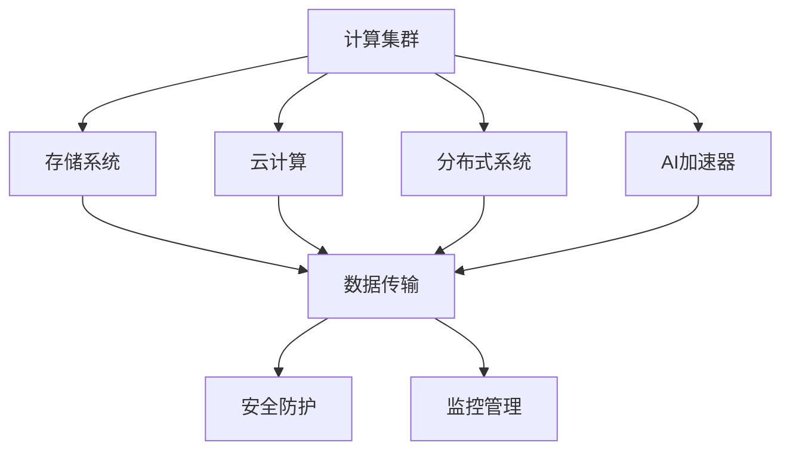

                 

## 1. 背景介绍

### 1.1 问题由来

随着人工智能（AI）技术的迅猛发展，各类新型AI工作负载对AI基础设施提出了更高的要求。这些新型工作负载包括但不限于大规模深度学习模型的训练、推理、以及与物联网、自动化系统、虚拟和增强现实等的集成。现代AI基础设施不仅要满足数据中心的计算、存储和网络需求，还需要具备高弹性、高可扩展性以及可靠的安全保障能力，才能应对复杂多变的应用需求。

### 1.2 问题核心关键点

目前AI基础设施建设的关键点主要包括以下几个方面：

- 计算需求：AI模型训练和推理对计算资源的需求巨大，需要高性能的计算集群。
- 存储需求：大规模数据集和模型参数的存储需要高性能、大容量的存储系统。
- 网络需求：高速、低延迟的网络架构是保证数据和模型高效传输的前提。
- 安全性需求：AI模型的训练数据和推理输出涉及大量敏感信息，需要强有力的安全防护措施。
- 可扩展性需求：AI工作负载的动态变化要求基础设施具备高弹性、灵活的扩展能力。

### 1.3 问题研究意义

研究AI基础设施的发展，对于推动AI技术在各个领域的落地应用具有重要意义：

- 加速应用开发：高效、可扩展的基础设施支持能够大大加速AI模型的开发和部署，缩短产品上市时间。
- 提升模型性能：高性能计算、存储和网络设施能够保证AI模型在训练和推理中的效率和效果。
- 降低成本投入：合理的资源分配和优化管理可以显著降低AI应用开发和运行的成本。
- 推动技术创新：新型AI基础设施的研究为AI技术的持续进步提供了必要的支持。

## 2. 核心概念与联系

### 2.1 核心概念概述

在深入讨论AI基础设施的建设之前，我们需要理解几个核心概念：

- **AI基础设施（AI Infrastructure）**：包括计算集群、存储系统、网络架构、安全防护和监控管理等组成部分，是AI模型训练、推理和应用部署的基础。
- **云计算（Cloud Computing）**：基于互联网的计算服务模式，提供弹性的计算和存储资源，能够灵活应对AI工作负载的需求。
- **分布式系统（Distributed System）**：由多个计算节点构成的系统，通过协同计算提升处理能力，支持大规模AI模型的训练和推理。
- **边缘计算（Edge Computing）**：将计算任务分散在靠近数据源的边缘设备上处理，减少数据传输延迟，支持实时AI应用。
- **AI加速器（AI Accelerator）**：专门为AI模型训练和推理优化的硬件设备，如GPU、TPU等，显著提升计算效率。

这些概念构成了AI基础设施的基本框架，相互之间有着紧密的联系。计算集群和存储系统是基础设施的硬件核心，云计算提供了弹性的资源管理和服务，分布式系统支持大规模并行计算，边缘计算满足了实时性需求，AI加速器则提供了硬件性能提升。安全防护和监控管理则是确保基础设施稳定运行和数据安全的必要措施。

### 2.2 概念间的关系

这些核心概念之间的关系可以通过以下Mermaid流程图来展示：



这个流程图展示了大规模AI基础设施的基本组成和相互之间的关系：

1. 计算集群和存储系统是基础设施的硬件核心，提供了计算和存储的能力。
2. 云计算提供了弹性的资源管理和灵活的服务模式。
3. 分布式系统支持大规模并行计算，满足大规模AI模型训练和推理的需求。
4. AI加速器通过硬件性能提升，显著加快了AI模型的训练和推理过程。
5. 安全防护和监控管理保障了基础设施的稳定运行和数据安全。

## 3. 核心算法原理 & 具体操作步骤

### 3.1 算法原理概述

AI基础设施的建设主要基于以下几个核心算法和原理：

- **分布式计算框架**：如Apache Spark、Apache Flink等，支持大规模数据处理和分布式计算。
- **数据分区和复制**：将数据分割为多个块，并在多个节点上进行复制，保证数据的高可用性和读取效率。
- **异步计算和数据流**：通过异步计算和数据流管理，优化AI模型的训练和推理效率。
- **AI加速器调度**：合理调度AI加速器，最大化利用硬件性能，提升计算效率。
- **动态资源分配**：根据工作负载的变化动态调整计算和存储资源，满足实时需求。

### 3.2 算法步骤详解

基于上述算法原理，AI基础设施的建设通常包括以下几个关键步骤：

**Step 1: 需求分析与规划**
- 分析AI工作负载的需求，包括计算、存储、网络和安全等方面。
- 制定详细的系统规划，包括硬件选型、网络架构和安全策略等。

**Step 2: 基础设施搭建**
- 根据规划搭建计算集群和存储系统，选择合适的硬件设备。
- 配置网络架构，确保数据传输的高效和低延迟。
- 安装和配置云计算平台，提供弹性的资源管理和服务。
- 部署分布式计算框架，支持大规模并行计算。
- 配置AI加速器，提升计算效率。

**Step 3: 系统优化与测试**
- 根据实际工作负载进行系统调优，包括优化计算和存储资源分配、调度AI加速器等。
- 进行性能测试，确保系统的稳定性和性能指标。
- 进行安全防护和监控管理，保障基础设施的安全和可靠运行。

**Step 4: 应用部署与监控**
- 将AI模型部署到基础设施上，进行训练和推理。
- 实时监控系统的性能和运行状态，及时发现和解决问题。
- 根据需求调整资源配置，保持基础设施的高效运行。

### 3.3 算法优缺点

AI基础设施建设涉及多个核心算法和原理，具有以下优点和局限性：

**优点**：
- 提供高弹性的计算和存储资源，能够灵活应对AI工作负载的变化。
- 支持大规模并行计算，提升AI模型训练和推理的效率。
- 基于云计算平台，能够按需扩展资源，降低建设和管理成本。
- 引入AI加速器，显著提升计算性能，加速模型训练和推理。

**局限性**：
- 初始投资和建设成本较高，尤其是硬件设备和基础设施的选型和配置。
- 系统复杂度高，建设和维护难度较大，需要具备专业技能。
- 资源利用率不一定最优，需要持续优化和调整。
- 对数据传输和存储的网络要求高，需要高性能的网络架构。

### 3.4 算法应用领域

AI基础设施广泛应用于以下几个领域：

- **科学研究**：支持大规模科学数据的处理和分析，加速科学研究进程。
- **工业制造**：提升生产过程的智能化和自动化水平，提高生产效率和质量。
- **金融服务**：提供实时数据分析和预测，优化金融决策和风险管理。
- **医疗健康**：支持复杂的医疗数据分析和疾病预测，提升医疗服务质量。
- **智慧城市**：构建智能交通、智慧能源等系统，提升城市管理和居民生活质量。
- **智能家居**：集成AI推理和控制，实现智能化的家居管理和生活服务。

## 4. 数学模型和公式 & 详细讲解

### 4.1 数学模型构建

在AI基础设施的建设和优化过程中，数学模型和公式扮演着重要的角色。以下将介绍几个关键的数学模型和公式。

- **分布式计算框架中的任务调度模型**：
  $$
  \min_{\pi} \sum_{j=1}^{J} \left\{ \sum_{i=1}^{I} C_{i,j}^{\pi} \cdot T_{i,j}^{\pi} \right\}
  $$
  其中，$\pi$为任务调度方案，$C_{i,j}$为任务$i$和节点$j$的计算代价，$T_{i,j}^{\pi}$为任务$i$在节点$j$上的执行时间。

- **数据分区和复制的均衡模型**：
  $$
  \min_{x} \left\{ \sum_{i=1}^{n} x_i \cdot (C_i + \frac{R_i}{x_i}) \right\}
  $$
  其中，$x_i$为节点$i$上的数据量，$C_i$为节点$i$的计算能力，$R_i$为节点$i$的存储容量。

- **异步计算和数据流管理模型**：
  $$
  \min_{\tau} \sum_{i=1}^{N} \left\{ d_i \cdot (1 + \tau_i) \right\}
  $$
  其中，$d_i$为数据块$i$的大小，$\tau_i$为数据块$i$的传输延迟。

### 4.2 公式推导过程

这些数学模型和公式的推导过程，能够帮助开发者理解和优化AI基础设施。例如，任务调度模型的推导，可以确保任务在各个节点上的均衡分配，避免资源浪费和瓶颈问题。数据分区和复制模型的推导，可以确保数据的高可用性和读取效率。异步计算和数据流管理模型的推导，可以优化数据传输过程，减少延迟，提升AI模型的训练和推理效率。

### 4.3 案例分析与讲解

以下通过一个具体的案例，展示AI基础设施在实际应用中的作用：

**案例：金融风险评估系统**

某金融公司需要构建一个基于AI的金融风险评估系统，用于实时评估客户的信用风险。该系统需要处理大规模的历史数据，包括客户的交易记录、信用评分等，通过机器学习模型进行风险预测。

在基础设施建设过程中，该公司采用分布式计算框架Apache Spark进行数据处理和模型训练。具体步骤如下：

1. **需求分析与规划**：分析风险评估系统的需求，包括计算、存储、网络和安全等方面。制定详细的系统规划，包括硬件选型、网络架构和安全策略等。
2. **基础设施搭建**：搭建计算集群和存储系统，选择合适的硬件设备。配置网络架构，确保数据传输的高效和低延迟。部署Apache Spark，支持大规模数据处理和分布式计算。
3. **系统优化与测试**：根据实际工作负载进行系统调优，包括优化计算和存储资源分配、调度AI加速器等。进行性能测试，确保系统的稳定性和性能指标。进行安全防护和监控管理，保障基础设施的安全和可靠运行。
4. **应用部署与监控**：将风险评估模型部署到基础设施上，进行训练和推理。实时监控系统的性能和运行状态，及时发现和解决问题。根据需求调整资源配置，保持基础设施的高效运行。

## 5. 项目实践：代码实例和详细解释说明

### 5.1 开发环境搭建

在进行AI基础设施的实际应用实践前，我们需要准备好开发环境。以下是使用Python进行Apache Spark开发的环境配置流程：

1. 安装Anaconda：从官网下载并安装Anaconda，用于创建独立的Python环境。
2. 创建并激活虚拟环境：
```bash
conda create -n spark-env python=3.8 
conda activate spark-env
```
3. 安装Apache Spark：根据操作系统版本，从官网获取对应的安装命令。例如：
```bash
conda install apache-spark=3.2.1
```
4. 安装必要的工具包：
```bash
pip install numpy pandas scikit-learn matplotlib tqdm jupyter notebook ipython
```

完成上述步骤后，即可在`spark-env`环境中开始AI基础设施的实践。

### 5.2 源代码详细实现

这里以金融风险评估系统为例，给出使用Apache Spark进行数据处理和模型训练的PySpark代码实现。

首先，定义数据处理函数：

```python
from pyspark.sql import SparkSession
from pyspark.sql.functions import col, split
from pyspark.sql.types import StructType, StructField, StringType, IntegerType

spark = SparkSession.builder.appName('FinancialRiskAssessment').getOrCreate()

# 定义数据结构
schema = StructType([
    StructField('customer_id', StringType(), True),
    StructField('transaction_date', StringType(), True),
    StructField('transaction_amount', IntegerType(), True),
    StructField('transaction_type', StringType(), True)
])

# 定义数据处理函数
def process_data(data_df):
    # 数据清洗
    data_df = data_df.dropna()
    
    # 特征提取
    data_df = data_df.select([col('customer_id'), col('transaction_date'), 
                             col('transaction_amount'), col('transaction_type')])
    
    # 数据切分
    data_df = data_df.repartition(10)
    
    # 数据持久化
    data_df = data_df.persist(StorageLevel.MEMORY_AND_DISK)
    
    return data_df
```

然后，定义模型训练函数：

```python
from pyspark.ml.classification import LogisticRegression
from pyspark.ml.feature import VectorAssembler, IndexToString, StringIndexer

# 定义特征选择器和模型
feature_assembler = VectorAssembler(inputCols=['transaction_amount', 'transaction_type'], outputCol='features')
lr = LogisticRegression(featuresCol='features', labelCol='risk_score', maxIter=10, regParam=0.3, elasticNetParam=0.8)

# 定义训练函数
def train_model(data_df):
    # 特征提取
    data_df = feature_assembler.transform(data_df)
    
    # 数据切分
    train_df, test_df = data_df.randomSplit([0.7, 0.3])
    
    # 模型训练
    model = lr.fit(train_df)
    
    # 模型评估
    prediction_df = model.transform(test_df)
    prediction_df = prediction_df.select(['customer_id', 'risk_score'])
    prediction_df.show(truncate=False)
    
    return model
```

最后，启动训练流程：

```python
# 读取数据
data_df = spark.read.csv('financial_data.csv', header=True, inferSchema=True, schema=schema)

# 数据处理
data_df = process_data(data_df)

# 模型训练
model = train_model(data_df)

# 输出结果
model.summary
```

以上就是使用PySpark进行金融风险评估系统数据处理和模型训练的完整代码实现。可以看到，得益于Apache Spark的强大封装，我们可以用相对简洁的代码完成大规模数据处理和模型训练。

### 5.3 代码解读与分析

让我们再详细解读一下关键代码的实现细节：

**process_data函数**：
- 数据清洗：去除缺失值和异常值。
- 特征提取：选择有意义的特征，如交易金额和交易类型。
- 数据切分：将数据切分为多个分区，提高并行处理效率。
- 数据持久化：将处理后的数据持久化到内存和磁盘，提高读取效率。

**train_model函数**：
- 特征提取：使用向量装配器将特征转换为向量形式。
- 数据切分：将数据分为训练集和测试集。
- 模型训练：使用逻辑回归模型训练。
- 模型评估：在测试集上评估模型效果。

**训练流程**：
- 读取数据：从CSV文件中读取金融数据。
- 数据处理：调用process_data函数进行数据处理。
- 模型训练：调用train_model函数进行模型训练。
- 输出结果：输出模型摘要和预测结果。

可以看到，Apache Spark的API设计简洁高效，使用户能够快速实现复杂的数据处理和模型训练任务。然而，实际的工程应用中，还需要考虑更多因素，如数据的分布式存储、模型的调优、调参、监控等。

## 6. 实际应用场景

### 6.1 智能制造

在智能制造领域，AI基础设施能够提供实时数据分析和预测，提升生产过程的智能化和自动化水平。例如，某汽车制造厂利用AI基础设施进行生产线的实时监控和预测维护，通过分析传感器数据，预测设备故障并进行预防性维护，显著降低了停机时间和维护成本。

### 6.2 智慧医疗

在智慧医疗领域，AI基础设施能够支持大规模医疗数据的处理和分析，提升诊断和治疗的智能化水平。例如，某医院利用AI基础设施进行病历分析和影像识别，通过分析患者的病历和影像数据，辅助医生进行诊断和治疗决策，提高了诊断的准确性和治疗的效果。

### 6.3 智能交通

在智能交通领域，AI基础设施能够提供实时交通数据的分析和管理，提升交通的智能化和安全性。例如，某城市利用AI基础设施进行交通流量分析和智能调度，通过分析实时交通数据，优化交通信号和路线，减少了交通拥堵和事故率。

### 6.4 未来应用展望

随着AI基础设施的发展，未来的应用场景将更加广泛，涵盖更多的垂直领域：

- **自动驾驶**：支持自动驾驶车辆的实时数据分析和路径规划，提升行驶安全和效率。
- **智慧农业**：提供实时气象和土壤数据的分析，优化农业生产过程。
- **智能物流**：支持物流系统的实时数据分析和优化，提升物流效率和减少成本。
- **智能客服**：提供实时客户咨询数据的分析和管理，提升客户服务质量。

## 7. 工具和资源推荐

### 7.1 学习资源推荐

为了帮助开发者系统掌握AI基础设施的理论基础和实践技巧，这里推荐一些优质的学习资源：

1. **Apache Spark官方文档**：提供了详细的API文档和示例代码，帮助开发者快速上手。
2. **《深度学习与分布式机器学习实战》书籍**：介绍了Apache Spark等分布式计算框架的实战应用，包括数据处理、模型训练和优化等内容。
3. **Coursera《深度学习与分布式机器学习》课程**：由斯坦福大学和DeepLearning.ai提供的深度学习与分布式机器学习的在线课程，涵盖大量前沿理论和实践内容。
4. **Kaggle**：一个数据科学竞赛平台，提供了大量AI基础设施相关的实战案例和数据集。
5. **GitHub**：Apache Spark等基础设施项目的官方GitHub仓库，提供了丰富的代码示例和社区支持。

通过对这些资源的学习实践，相信你一定能够快速掌握AI基础设施的精髓，并用于解决实际的AI问题。

### 7.2 开发工具推荐

高效的开发离不开优秀的工具支持。以下是几款用于AI基础设施开发的常用工具：

1. **Apache Spark**：基于Java和Scala编写的分布式计算框架，支持大规模数据处理和机器学习任务。
2. **Apache Hadoop**：一个分布式计算框架，支持大规模数据存储和处理，与Spark无缝集成。
3. **Docker**：一个开源的容器化平台，支持Spark等基础设施的容器化部署和扩展。
4. **Kubernetes**：一个开源的容器编排平台，支持Spark等基础设施的自动化部署和管理。
5. **Jupyter Notebook**：一个交互式的笔记本环境，支持Python、Spark等工具的交互式开发和调试。

合理利用这些工具，可以显著提升AI基础设施的开发效率，加快创新迭代的步伐。

### 7.3 相关论文推荐

AI基础设施的发展源于学界的持续研究。以下是几篇奠基性的相关论文，推荐阅读：

1. **分布式机器学习算法与系统**：研究了分布式机器学习算法和系统的设计与实现，包括Spark、Hadoop等基础设施的研究。
2. **大数据处理与分析框架**：介绍了Spark等大数据处理框架的核心技术，包括数据存储、分布式计算和数据流管理等。
3. **深度学习与分布式计算**：探讨了深度学习与分布式计算的结合，介绍了Spark等基础设施在深度学习中的应用。
4. **边缘计算与物联网**：研究了边缘计算与物联网的结合，介绍了边缘计算在实时AI应用中的作用。
5. **AI加速器设计与实现**：介绍了AI加速器的设计与实现，包括GPU、TPU等硬件设备的性能优化。

这些论文代表了大数据与AI基础设施的发展脉络。通过学习这些前沿成果，可以帮助研究者把握学科前进方向，激发更多的创新灵感。

除上述资源外，还有一些值得关注的前沿资源，帮助开发者紧跟AI基础设施技术的发展趋势，例如：

1. **arXiv论文预印本**：人工智能领域最新研究成果的发布平台，包括大量尚未发表的前沿工作，学习前沿技术的必读资源。
2. **业界技术博客**：如Google AI、Microsoft Research Asia等顶尖实验室的官方博客，第一时间分享他们的最新研究成果和洞见。
3. **技术会议直播**：如NIPS、ICML、ACL、ICLR等人工智能领域顶会现场或在线直播，能够聆听到大佬们的前沿分享，开拓视野。
4. **GitHub热门项目**：在GitHub上Star、Fork数最多的AI基础设施相关项目，往往代表了该技术领域的发展趋势和最佳实践，值得去学习和贡献。
5. **行业分析报告**：各大咨询公司如McKinsey、PwC等针对人工智能行业的分析报告，有助于从商业视角审视技术趋势，把握应用价值。

总之，对于AI基础设施的研究和学习，需要开发者保持开放的心态和持续学习的意愿。多关注前沿资讯，多动手实践，多思考总结，必将收获满满的成长收益。

## 8. 总结：未来发展趋势与挑战

### 8.1 研究成果总结

本文对AI基础设施的发展进行了全面系统的介绍。首先阐述了AI基础设施建设的背景和意义，明确了基础设施在支持AI工作负载中的重要作用。其次，从原理到实践，详细讲解了AI基础设施的数学模型和算法原理，提供了实际应用的代码实现。同时，本文还广泛探讨了AI基础设施在智能制造、智慧医疗、智能交通等多个领域的应用前景，展示了基础设施的广泛应用价值。最后，本文精选了基础设施的各类学习资源，力求为读者提供全方位的技术指引。

通过本文的系统梳理，可以看到，AI基础设施为AI技术在各个领域的落地应用提供了坚实的技术基础，极大地提升了AI模型的训练和推理效率。未来，伴随基础设施技术的不断演进，AI技术的应用范围和应用效果必将进一步提升。

### 8.2 未来发展趋势

展望未来，AI基础设施的发展将呈现以下几个趋势：

1. **云计算与边缘计算的融合**：未来，云计算与边缘计算将更加紧密结合，形成云-边协同的计算架构，支持更灵活、高效的应用场景。
2. **AI加速器与云计算的结合**：AI加速器将与云计算平台深度融合，支持更多类型的硬件设备，提升计算效率。
3. **异构计算的支持**：异构计算技术将得到广泛应用，支持多种硬件设备的协同计算，提高处理能力和效率。
4. **分布式训练与推理的优化**：分布式训练和推理技术将进一步优化，支持更大规模模型的训练和推理，提高性能和效率。
5. **数据湖与大数据技术的融合**：数据湖技术将与大数据技术深度融合，支持更大规模数据的存储和处理，提高数据的利用率。

以上趋势凸显了AI基础设施的发展方向，为AI技术的持续进步提供了必要支持。这些方向的探索发展，必将进一步提升AI技术的计算效率和应用效果。

### 8.3 面临的挑战

尽管AI基础设施建设取得了显著进展，但在迈向更加智能化、普适化应用的过程中，它仍面临诸多挑战：

1. **数据隐私和安全**：AI基础设施需要处理大量敏感数据，如何保障数据隐私和安全成为重要问题。
2. **资源管理**：大规模分布式系统的资源管理复杂度较高，如何高效管理和优化资源利用率是一大难题。
3. **异构设备的协同**：AI加速器与传统CPU/GPU等硬件设备的协同优化，仍需进一步研究。
4. **计算效率**：在处理大规模数据和复杂模型时，计算效率的提升仍需更多技术突破。
5. **自动化运维**：如何实现自动化运维和故障检测，保障基础设施的稳定运行。

正视基础设施面临的这些挑战，积极应对并寻求突破，将是大规模AI基础设施发展的重要课题。相信随着学界和产业界的共同努力，这些挑战终将一一被克服，AI基础设施必将在构建人机协同的智能时代中扮演越来越重要的角色。

### 8.4 研究展望

面对AI基础设施面临的挑战，未来的研究需要在以下几个方面寻求新的突破：

1. **分布式系统优化**：进一步优化分布式系统的资源管理和调度，提高系统的效率和可靠性。
2. **数据隐私保护**：研究数据隐私保护技术，确保数据的安全和合规。
3. **AI加速器优化**：开发新的AI加速器硬件和软件架构，提升计算效率和能效比。
4. **自动化运维系统**：研究自动化运维和故障检测系统，保障基础设施的稳定运行。
5. **异构设备协同**：开发新的异构设备协同技术，支持多种硬件设备的协同计算。

这些研究方向将引领AI基础设施技术的发展，为AI技术的落地应用提供坚实的技术基础。只有勇于创新、敢于突破，才能不断拓展基础设施的边界，为AI技术的产业化进程注入新的动力。

## 9. 附录：常见问题与解答

**Q1：如何选择合适的AI基础设施？**

A: 选择合适的AI基础设施需要考虑以下因素：
1. **计算能力**：根据任务需求选择合适的计算集群，如CPU、GPU、TPU等。
2. **存储需求**：根据数据量选择合适的存储系统，如HDFS、S3等。
3. **网络性能**：确保数据传输的高效和低延迟，如10Gbps网络。
4. **安全性**：保障数据隐私和安全，如数据加密、访问控制等。
5. **可扩展性**：选择具有高弹性、灵活扩展能力的基础设施，如云平台。

**Q2：AI基础设施的资源管理有哪些策略？**

A: 资源管理是AI基础设施建设的重要环节，常见的策略包括：
1. **负载均衡**：通过负载均衡器分配计算资源，避免资源瓶颈。
2. **自动扩展**：根据任务需求动态调整计算资源，确保系统的弹性。
3. **资源监控**：实时监控系统性能和资源利用率，及时发现和解决问题。
4. **自动调参

