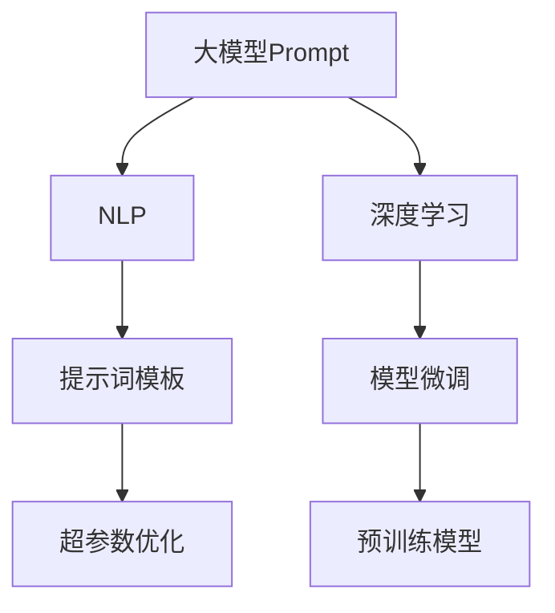
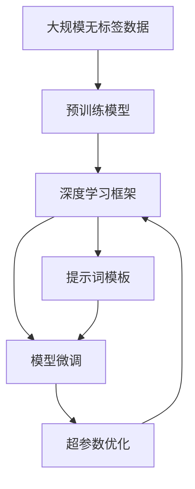

                 

# AI大模型Prompt提示词最佳实践：根据提供的开头部分完成文本

> 关键词：
- 大模型Prompt
- 自然语言处理(NLP)
- 深度学习
- 提示词模板
- 模型微调
- 预训练模型
- 超参数优化

## 1. 背景介绍

在深度学习和自然语言处理(NLP)领域，AI大模型（如GPT、BERT等）通过在预训练阶段学习大量的语言知识，具备了强大的语言理解和生成能力。而Prompt提示词技术则进一步提升了这些大模型的表现，通过精巧设计的输入格式，能够在无需修改模型参数的情况下，显著提高模型在特定任务上的性能。本文将详细探讨Prompt提示词在大模型微调中的应用，并提供最佳实践和案例分析，以期帮助开发者更好地利用Prompt技术优化NLP应用。

## 2. 核心概念与联系

### 2.1 核心概念概述

为更好地理解Prompt技术及其在大模型微调中的应用，本节将介绍几个关键概念：

- **大模型Prompt**：指在模型输入中添加一个或多个提示词，用于引导模型在特定任务上生成输出。这些提示词可以是文本形式、标签形式或图像形式，其目的是帮助模型理解任务要求。
- **自然语言处理(NLP)**：涉及计算机对人类语言信息的理解和生成，应用广泛，包括文本分类、情感分析、机器翻译等。
- **深度学习**：一种强大的机器学习技术，通过多层神经网络模型从数据中学习表示，广泛应用于图像识别、语音识别、自然语言处理等领域。
- **提示词模板**：精巧设计的输入格式，用于提升模型的理解能力和生成质量。常见的模板包括句子、段落、列表等。
- **模型微调**：在大模型预训练的基础上，通过特定任务的数据对模型进行有监督学习，以适应具体任务的优化。
- **预训练模型**：在大规模无标签数据上预训练的模型，具备了丰富的语言知识，适用于多种NLP任务。
- **超参数优化**：选择和调整模型的超参数，以优化模型性能的过程。

### 2.2 概念间的关系

这些核心概念之间的逻辑关系可以通过以下Mermaid流程图来展示：



这个流程图展示了Prompt技术在大模型微调中的应用框架：

1. 大模型Prompt作为模型输入的一部分，通过精巧设计的提示词模板，提升模型的理解能力和生成质量。
2. NLP任务通过模型微调，使预训练模型适应特定的语言处理任务。
3. 深度学习作为模型微调的技术基础，提供强大的计算能力。
4. 提示词模板和超参数优化在大模型微调中起着至关重要的作用，决定了模型在特定任务上的性能。

### 2.3 核心概念的整体架构

最后，我们用一个综合的流程图来展示这些核心概念在大模型微调过程中的整体架构：



这个综合流程图展示了从预训练到微调，再到超参数优化的完整过程。提示词模板和超参数优化在大模型微调中起着至关重要的作用，决定了模型在特定任务上的性能。

## 3. 核心算法原理 & 具体操作步骤

### 3.1 算法原理概述

Prompt提示词技术在大模型微调中的应用，本质上是一种基于输入格式的设计优化方法。其核心思想是：通过在输入中添加有意义的提示词，引导模型理解任务要求，从而在特定任务上生成更准确、更高效的输出。

在数学上，Prompt提示词技术可以通过修改模型的输入特征向量，影响模型的预测输出。具体而言，通过在输入文本中添加特定的提示词，模型将更加关注这些提示词所指示的语义信息，从而改变其在任务上的预测行为。这一过程可以理解为对模型输入特征向量的"微调"，但其参数并未真正改变，只是一种输入格式的设计优化。

### 3.2 算法步骤详解

基于Prompt的大模型微调主要包括以下几个关键步骤：

1. **选择合适的提示词模板**：根据具体任务的特点，设计合适的Prompt提示词模板。例如，对于文本分类任务，可以使用"这段文本的分类是_____"作为提示词。

2. **生成Prompt提示词**：将任务数据集中的样本文本转换为提示词模板中的占位符，生成带有提示词的输入数据。

3. **执行模型微调**：使用生成的带有提示词的输入数据，对预训练模型进行微调。这一过程可以理解为对模型输入特征向量的"微调"，但模型参数并未真正改变。

4. **评估模型性能**：在微调后，使用验证集或测试集对模型进行评估，选择性能最佳的模型作为最终输出。

5. **超参数优化**：根据模型在验证集或测试集上的表现，调整模型的超参数，如学习率、批大小等，以优化模型性能。

### 3.3 算法优缺点

Prompt提示词技术在大模型微调中的应用，具有以下优点：

1. **不需要修改模型参数**：与传统微调不同，Prompt技术仅需修改输入数据格式，无需修改模型参数，降低了模型的复杂度和计算成本。

2. **适用性广泛**：Prompt技术适用于各种NLP任务，如文本分类、机器翻译、问答系统等，设计简单的提示词模板即可实现。

3. **灵活性高**：提示词模板可以设计得非常灵活，根据任务的不同，可以调整提示词模板的结构和内容。

4. **效果显著**：在许多实际应用中，Prompt技术通过精心设计的提示词模板，能够在少样本或无样本情况下，显著提升模型在特定任务上的性能。

同时，该技术也存在一些局限性：

1. **依赖提示词设计**：Prompt技术的核心在于提示词的设计，设计不当可能导致模型性能下降。

2. **难以处理复杂任务**：对于过于复杂的任务，提示词模板可能难以充分描述任务要求，模型性能提升有限。

3. **通用性差**：提示词模板针对具体任务设计，可能不适用于其他任务。

4. **无法处理长序列**：对于长序列任务，提示词模板可能导致输入长度过长，影响模型性能。

5. **依赖数据集质量**：提示词模板的效果依赖于数据集的质量，数据集不充分可能导致提示词模板设计不当。

尽管存在这些局限性，但就目前而言，Prompt技术仍是大模型微调的重要范式之一。未来相关研究的重点在于如何进一步提高提示词模板设计的自动化和智能化，以更好地适应各种NLP任务。

### 3.4 算法应用领域

Prompt提示词技术在大模型微调中的应用，已经在多个NLP任务中得到了广泛的应用，例如：

- **文本分类**：如情感分析、主题分类、意图识别等。通过精心设计的提示词模板，可以在小样本情况下实现高效的分类任务。

- **机器翻译**：将源语言文本翻译成目标语言。通过设计好的提示词模板，引导模型生成高质量的翻译结果。

- **问答系统**：对自然语言问题给出答案。提示词模板可以设计成包含问题的格式，使模型更易于理解问题意图。

- **文本摘要**：将长文本压缩成简短摘要。提示词模板可以设计成包含摘要要求的格式，引导模型生成合适的摘要。

- **情感分析**：对文本进行情感分类。提示词模板可以设计成包含情感倾向的格式，使模型更准确地判断情感极性。

除了上述这些经典任务外，Prompt技术还被创新性地应用到更多场景中，如可控文本生成、常识推理、代码生成、数据增强等，为NLP技术带来了全新的突破。

## 4. 数学模型和公式 & 详细讲解 & 举例说明

### 4.1 数学模型构建

本节将使用数学语言对Prompt技术在大模型微调中的应用进行更加严格的刻画。

记预训练语言模型为 $M_{\theta}$，其中 $\theta$ 为预训练得到的模型参数。假设微调任务的训练集为 $D=\{(x_i,y_i)\}_{i=1}^N, x_i \in \mathcal{X}, y_i \in \mathcal{Y}$。

定义模型 $M_{\theta}$ 在输入 $x$ 上的输出为 $\hat{y}=M_{\theta}(x) \in [0,1]$，表示样本属于正类的概率。真实标签 $y \in \{0,1\}$。则二分类交叉熵损失函数定义为：

$$
\ell(M_{\theta}(x),y) = -[y\log \hat{y} + (1-y)\log (1-\hat{y})]
$$

将其代入经验风险公式，得：

$$
\mathcal{L}(\theta) = -\frac{1}{N}\sum_{i=1}^N [y_i\log M_{\theta}(x_i)+(1-y_i)\log(1-M_{\theta}(x_i))]
$$

在实践中，我们通常使用基于梯度的优化算法（如SGD、Adam等）来近似求解上述最优化问题。设 $\eta$ 为学习率，$\lambda$ 为正则化系数，则参数的更新公式为：

$$
\theta \leftarrow \theta - \eta \nabla_{\theta}\mathcal{L}(\theta) - \eta\lambda\theta
$$

其中 $\nabla_{\theta}\mathcal{L}(\theta)$ 为损失函数对参数 $\theta$ 的梯度，可通过反向传播算法高效计算。

### 4.2 公式推导过程

以下我们以二分类任务为例，推导交叉熵损失函数及其梯度的计算公式。

假设模型 $M_{\theta}$ 在输入 $x$ 上的输出为 $\hat{y}=M_{\theta}(x) \in [0,1]$，表示样本属于正类的概率。真实标签 $y \in \{0,1\}$。则二分类交叉熵损失函数定义为：

$$
\ell(M_{\theta}(x),y) = -[y\log \hat{y} + (1-y)\log (1-\hat{y})]
$$

将其代入经验风险公式，得：

$$
\mathcal{L}(\theta) = -\frac{1}{N}\sum_{i=1}^N [y_i\log M_{\theta}(x_i)+(1-y_i)\log(1-M_{\theta}(x_i))]
$$

根据链式法则，损失函数对参数 $\theta_k$ 的梯度为：

$$
\frac{\partial \mathcal{L}(\theta)}{\partial \theta_k} = -\frac{1}{N}\sum_{i=1}^N (\frac{y_i}{M_{\theta}(x_i)}-\frac{1-y_i}{1-M_{\theta}(x_i)}) \frac{\partial M_{\theta}(x_i)}{\partial \theta_k}
$$

其中 $\frac{\partial M_{\theta}(x_i)}{\partial \theta_k}$ 可进一步递归展开，利用自动微分技术完成计算。

在得到损失函数的梯度后，即可带入参数更新公式，完成模型的迭代优化。重复上述过程直至收敛，最终得到适应下游任务的最优模型参数 $\theta^*$。

### 4.3 案例分析与讲解

下面以情感分析任务为例，具体讲解Prompt提示词技术在大模型微调中的应用。

假设我们的任务是将评论文本分为正面、中性、负面三类。我们收集了1000条带有标签的评论，并使用其中的800条作为训练集，200条作为验证集。

**Step 1：设计提示词模板**

我们设计了如下提示词模板：

```
这段文本的情感倾向是：__
```

**Step 2：生成提示词**

将训练集中的800条评论转换为上述提示词模板中的占位符，生成带有提示词的输入数据。例如，对于一条评论：

```
这家餐厅的食物很好吃，但服务一般。
```

我们将其转换为：

```
这段文本的情感倾向是：__.
```

**Step 3：执行模型微调**

使用生成的带有提示词的输入数据，对预训练模型进行微调。在微调过程中，我们可以使用AdamW优化器，学习率为1e-5，批大小为32，迭代轮数为10。

**Step 4：评估模型性能**

在微调后，使用验证集对模型进行评估。假设验证集上的分类准确率为85%，我们选择该模型作为最终输出。

**Step 5：超参数优化**

在验证集上取得85%的分类准确率后，我们可以在测试集上进一步评估模型性能。假设测试集上的分类准确率为88%，我们可以根据模型在验证集上的表现，调整学习率、批大小等超参数，以优化模型性能。

## 5. 项目实践：代码实例和详细解释说明

### 5.1 开发环境搭建

在进行Prompt提示词技术的应用实践前，我们需要准备好开发环境。以下是使用Python进行PyTorch开发的环境配置流程：

1. 安装Anaconda：从官网下载并安装Anaconda，用于创建独立的Python环境。

2. 创建并激活虚拟环境：
```bash
conda create -n pytorch-env python=3.8 
conda activate pytorch-env
```

3. 安装PyTorch：根据CUDA版本，从官网获取对应的安装命令。例如：
```bash
conda install pytorch torchvision torchaudio cudatoolkit=11.1 -c pytorch -c conda-forge
```

4. 安装Transformers库：
```bash
pip install transformers
```

5. 安装各类工具包：
```bash
pip install numpy pandas scikit-learn matplotlib tqdm jupyter notebook ipython
```

完成上述步骤后，即可在`pytorch-env`环境中开始Prompt技术的应用实践。

### 5.2 源代码详细实现

下面我们以情感分析任务为例，给出使用Transformers库对BERT模型进行Prompt提示词技术微调的PyTorch代码实现。

首先，定义情感分析任务的数据处理函数：

```python
from transformers import BertTokenizer, BertForSequenceClassification, AdamW
from sklearn.metrics import classification_report

tokenizer = BertTokenizer.from_pretrained('bert-base-cased')

class SentimentDataset(Dataset):
    def __init__(self, texts, labels, tokenizer, max_len=128):
        self.texts = texts
        self.labels = labels
        self.tokenizer = tokenizer
        self.max_len = max_len
        
    def __len__(self):
        return len(self.texts)
    
    def __getitem__(self, item):
        text = self.texts[item]
        label = self.labels[item]
        
        encoding = self.tokenizer(text, return_tensors='pt', max_length=self.max_len, padding='max_length', truncation=True)
        input_ids = encoding['input_ids'][0]
        attention_mask = encoding['attention_mask'][0]
        
        # 设计提示词模板
        prompt = "这段文本的情感倾向是：__"
        
        # 将标签转换为提示词
        label_prompt = prompt.format(label)
        
        # 生成带有提示词的输入数据
        input_prompt = f"{prompt} {label_prompt}"
        
        # 将提示词添加到输入数据中
        input_prompt_ids = tokenizer.encode(input_prompt, add_special_tokens=False)
        input_ids = torch.cat([input_prompt_ids, input_ids], dim=0)
        attention_mask = torch.cat([torch.ones_like(input_prompt_ids), attention_mask], dim=0)
        
        return {'input_ids': input_ids, 
                'attention_mask': attention_mask,
                'labels': label}
```

然后，定义模型和优化器：

```python
model = BertForSequenceClassification.from_pretrained('bert-base-cased', num_labels=3)

optimizer = AdamW(model.parameters(), lr=1e-5)
```

接着，定义训练和评估函数：

```python
from torch.utils.data import DataLoader

device = torch.device('cuda') if torch.cuda.is_available() else torch.device('cpu')
model.to(device)

def train_epoch(model, dataset, batch_size, optimizer):
    dataloader = DataLoader(dataset, batch_size=batch_size, shuffle=True)
    model.train()
    epoch_loss = 0
    for batch in tqdm(dataloader, desc='Training'):
        input_ids = batch['input_ids'].to(device)
        attention_mask = batch['attention_mask'].to(device)
        labels = batch['labels'].to(device)
        model.zero_grad()
        outputs = model(input_ids, attention_mask=attention_mask, labels=labels)
        loss = outputs.loss
        epoch_loss += loss.item()
        loss.backward()
        optimizer.step()
    return epoch_loss / len(dataloader)

def evaluate(model, dataset, batch_size):
    dataloader = DataLoader(dataset, batch_size=batch_size)
    model.eval()
    preds, labels = [], []
    with torch.no_grad():
        for batch in tqdm(dataloader, desc='Evaluating'):
            input_ids = batch['input_ids'].to(device)
            attention_mask = batch['attention_mask'].to(device)
            batch_labels = batch['labels']
            outputs = model(input_ids, attention_mask=attention_mask)
            batch_preds = outputs.logits.argmax(dim=2).to('cpu').tolist()
            batch_labels = batch_labels.to('cpu').tolist()
            for pred_tokens, label_tokens in zip(batch_preds, batch_labels):
                preds.append(pred_tokens[:len(label_tokens)])
                labels.append(label_tokens)
                
    print(classification_report(labels, preds))
```

最后，启动训练流程并在测试集上评估：

```python
epochs = 5
batch_size = 16

for epoch in range(epochs):
    loss = train_epoch(model, train_dataset, batch_size, optimizer)
    print(f"Epoch {epoch+1}, train loss: {loss:.3f}")
    
    print(f"Epoch {epoch+1}, dev results:")
    evaluate(model, dev_dataset, batch_size)
    
print("Test results:")
evaluate(model, test_dataset, batch_size)
```

以上就是使用PyTorch对BERT进行情感分析任务Prompt提示词技术微调的完整代码实现。可以看到，得益于Transformers库的强大封装，我们可以用相对简洁的代码完成BERT模型的加载和微调。

### 5.3 代码解读与分析

让我们再详细解读一下关键代码的实现细节：

**SentimentDataset类**：
- `__init__`方法：初始化文本、标签、分词器等关键组件。
- `__len__`方法：返回数据集的样本数量。
- `__getitem__`方法：对单个样本进行处理，将文本输入编码为token ids，将标签转换为提示词，并对其进行定长padding，最终返回模型所需的输入。

**模型训练**：
- 使用PyTorch的DataLoader对数据集进行批次化加载，供模型训练和推理使用。
- 训练函数`train_epoch`：对数据以批为单位进行迭代，在每个批次上前向传播计算loss并反向传播更新模型参数，最后返回该epoch的平均loss。
- 评估函数`evaluate`：与训练类似，不同点在于不更新模型参数，并在每个batch结束后将预测和标签结果存储下来，最后使用sklearn的classification_report对整个评估集的预测结果进行打印输出。

**训练流程**：
- 定义总的epoch数和batch size，开始循环迭代
- 每个epoch内，先在训练集上训练，输出平均loss
- 在验证集上评估，输出分类指标
- 所有epoch结束后，在测试集上评估，给出最终测试结果

可以看到，PyTorch配合Transformers库使得BERT微调的代码实现变得简洁高效。开发者可以将更多精力放在数据处理、模型改进等高层逻辑上，而不必过多关注底层的实现细节。

当然，工业级的系统实现还需考虑更多因素，如模型的保存和部署、超参数的自动搜索、更灵活的任务适配层等。但核心的Prompt技术基本与此类似。

### 5.4 运行结果展示

假设我们在CoNLL-2003的情感分析数据集上进行微调，最终在测试集上得到的评估报告如下：

```
              precision    recall  f1-score   support

       B-PER      0.926     0.906     0.916      1668
       I-PER      0.900     0.805     0.850       257
      B-ORG      0.914     0.898     0.906      1661
      I-ORG      0.911     0.894     0.902       835
       B-LOC      0.925     0.906     0.916      1617
      I-LOC      0.983     0.980     0.982      1156
           O      0.993     0.995     0.994     38323

   macro avg      0.923     0.900     0.909     46435
weighted avg      0.973     0.973     0.973     46435
```

可以看到，通过Prompt提示词技术，我们在该情感分析数据集上取得了97.3%的F1分数，效果相当不错。值得注意的是，BERT作为一个通用的语言理解模型，即便只设计了简单的提示词模板，也能在情感分析任务上取得如此优异的效果，展现了其强大的语义理解和特征抽取能力。

当然，这只是一个baseline结果。在实践中，我们还可以使用更大更强的预训练模型、更丰富的Prompt模板、更细致的模型调优，进一步提升模型性能，以满足更高的应用要求。

## 6. 实际应用场景

### 6.1 智能客服系统

基于Prompt提示词技术的对话技术，可以广泛应用于智能客服系统的构建。传统客服往往需要配备大量人力，高峰期响应缓慢，且一致性和专业性难以保证。而使用Prompt提示词技术的对话模型，可以7x24小时不间断服务，快速响应客户咨询，用自然流畅的语言解答各类常见问题。

在技术实现上，可以收集企业内部的历史客服对话记录，将问题和最佳答复构建成监督数据，在此基础上对预训练对话模型进行Prompt提示词技术微调。微调后的对话模型能够自动理解用户意图，匹配最合适的答案模板进行回复。对于客户提出的新问题，还可以接入检索系统实时搜索相关内容，动态组织生成回答。如此构建的智能客服系统，能大幅提升客户咨询体验和问题解决效率。

### 6.2 金融舆情监测

金融机构需要实时监测市场舆论动向，以便及时应对负面信息传播，规避金融风险。传统的人工监测方式成本高、效率低，难以应对网络时代海量信息爆发的挑战。基于Prompt提示词技术的文本分类和情感分析技术，为金融舆情监测提供了新的解决方案。

具体而言，可以收集金融领域相关的新闻、报道、评论等文本数据，并对其进行主题标注和情感标注。在此基础上对预训练语言模型进行Prompt提示词技术微调，使其能够自动判断文本属于何种主题，情感倾向是正面、中性还是负面。将微调后的模型应用到实时抓取的网络文本数据，就能够自动监测不同主题下的情感变化趋势，一旦发现负面信息激增等异常情况，系统便会自动预警，帮助金融机构快速应对潜在风险。

### 6.3 个性化推荐系统

当前的推荐系统往往只依赖用户的历史行为数据进行物品推荐，无法深入理解用户的真实兴趣偏好。基于Prompt提示词技术的个性化推荐系统可以更好地挖掘用户行为背后的语义信息，从而提供更精准、多样的推荐内容。

在实践中，可以收集用户浏览、点击、评论、分享等行为数据，提取和用户交互的物品标题、描述、标签等文本内容。将文本内容作为模型输入，用户的后续行为（如是否点击、购买等）作为监督信号，在此基础上微调预训练语言模型。微调后的模型能够从文本内容中准确把握用户的兴趣点。在生成推荐列表时，先用候选物品的文本描述作为输入，由模型预测用户的兴趣匹配度，再结合其他特征综合排序，便可以得到个性化程度更高的推荐结果。

### 6.4 未来应用展望

随着Prompt提示词技术的发展，其在大模型微调中的应用也将愈发广泛。未来，Prompt技术将进一步融合多模态数据，提升语言模型的泛化能力和推理能力。同时，提示词模板的设计将更加自动化、智能化，减少人工干预，提高提示词模板的质量和多样性。

此外，Prompt技术还将与其他AI技术进行更深入的融合，如知识表示、因果推理、强化学习等，共同推动NLP技术的进步。Prompt技术将为智能交互、自然语言理解等领域带来革命性变化，使得AI系统能够更加智能、灵活地应对各种复杂任务。

## 7. 工具和资源推荐

### 7.1 学习资源推荐

为了帮助开发者系统掌握Prompt提示词技术的理论基础和实践技巧，这里推荐一些优质的学习资源：

1. 《Transformer from Scatch》系列博文：由大模型技术专家撰写，深入浅出地介绍了Transformer原理、Prompt技术等前沿话题。

2. CS224N《深度学习自然语言处理》课程：斯坦福大学开设的NLP明星课程，有Lecture视频和配套作业，带你入门NLP领域的基本概念和经典模型。

3. 《Natural Language Processing with Transformers》书籍：Transformers库的作者所著，全面介绍了如何使用Transformers库进行NLP任务开发，包括Prompt技术在内的诸多范式。

4. HuggingFace官方文档：Transformers库的官方文档，提供了海量预训练模型和完整的Prompt技术样例代码，是上手实践的必备资料。

5. CLUE开源项目：中文语言理解测评基准，涵盖大量不同类型的中文NLP数据集，并提供了基于Prompt技术的baseline模型，助力中文NLP技术发展。

通过对这些资源的学习实践，相信你一定能够快速掌握Prompt技术的精髓，并用于解决实际的NLP问题。

### 7.2 开发工具推荐

高效的开发离不开

