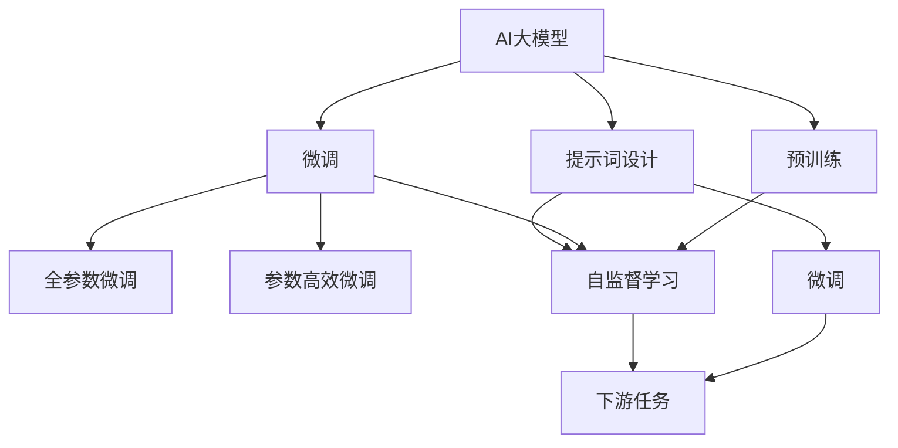

                 

# AI大模型Prompt提示词最佳实践：简洁提问，避免客套话

> 关键词：AI大模型, 提示词, 微调, 自然语言处理, 自然语言生成, 深度学习, 语言模型

## 1. 背景介绍

### 1.1 问题由来
近年来，随着深度学习技术的快速发展，AI大模型在自然语言处理(Natural Language Processing, NLP)领域取得了显著突破。这些大模型通过在大规模文本数据上进行预训练，学习到丰富的语言知识和常识，从而具备了强大的语言理解和生成能力。然而，在将预训练模型应用于特定任务时，如何设计和优化提示词(Prompt)成为关键问题之一。

提示词是引导AI大模型生成相应输出的文本，其设计和选择对于模型的理解和生成效果具有重要影响。合理的提示词可以使模型更高效地进行理解和生成，从而提升模型性能。然而，在实际应用中，提示词设计不当常常导致模型性能下降、生成结果不合理等问题。

### 1.2 问题核心关键点
提示词设计需要考虑以下几个关键点：

- **简洁性**：提示词应尽量简洁，避免冗长和复杂的描述。
- **明确性**：提示词应明确表达任务要求，避免歧义。
- **适应性**：提示词应能适应不同任务的特性，满足特定任务需求。
- **引导性**：提示词应引导模型按照预期方式生成答案，避免偏差。
- **可扩展性**：提示词应易于扩展和更新，适应模型和任务的进化。

本文聚焦于提示词设计，结合实际案例，探讨如何通过简洁、明确的提示词，优化AI大模型的性能和生成结果。

### 1.3 问题研究意义
提示词设计是AI大模型微调中的重要环节，合理设计提示词可以显著提升模型性能。提示词设计的优化不仅有助于提升模型的生成质量，还能降低开发成本，提高模型在实际应用中的可用性。

## 2. 核心概念与联系

### 2.1 核心概念概述

- **AI大模型**：以自回归(如GPT)或自编码(如BERT)模型为代表的大规模预训练语言模型。通过在大规模文本数据上进行预训练，学习通用的语言表示，具备强大的语言理解和生成能力。
- **提示词**：引导AI大模型生成相应输出的文本，是模型任务适配的关键。
- **微调**：在预训练模型的基础上，使用下游任务的少量标注数据，通过有监督学习优化模型在特定任务上的性能。
- **自然语言处理(NLP)**：涉及语音识别、文本处理、机器翻译等技术，旨在使计算机能够理解和生成自然语言。
- **自然语言生成(NLG)**：使计算机能够生成符合人类语言习惯和语法结构的文本。
- **深度学习**：一种利用神经网络模型进行数据处理和分析的技术。
- **语言模型**：用于计算文本序列的概率分布，评估文本序列的合理性。

这些核心概念之间相互关联，共同构成了AI大模型的应用框架。提示词设计是微调中的重要环节，通过优化提示词，可以显著提升AI大模型的性能和生成结果。

### 2.2 概念间的关系

这些核心概念之间的关系可以通过以下Mermaid流程图来展示：



这个流程图展示了大模型预训练、微调和提示词设计之间的关系：

1. 大模型通过预训练获得基础能力。
2. 微调是对预训练模型进行任务特定的优化，可以分为全参数微调和参数高效微调。
3. 提示词设计引导模型进行特定任务的推理和生成。
4. 微调使得通用大模型更好地适应特定任务，在应用场景中取得更优表现。
5. 提示词设计应结合微调过程，确保模型能够准确理解和生成输出。

通过理解这些核心概念，我们可以更好地把握AI大模型的工作原理和优化方向。

## 3. 核心算法原理 & 具体操作步骤
### 3.1 算法原理概述

提示词设计基于自然语言理解和生成模型的工作原理，通过合理设计提示词，引导模型进行特定的推理和生成。其核心思想是：将任务要求明确、简洁地传达给模型，使其能够准确理解和生成预期结果。

具体而言，提示词设计可以分为以下几个步骤：

1. **任务分析**：明确任务要求，包括输入输出格式、约束条件等。
2. **设计提示词**：根据任务要求设计简洁、明确的提示词。
3. **模型训练**：使用提示词引导的输入数据进行微调训练，优化模型性能。
4. **结果评估**：评估模型生成结果的质量，调整提示词设计，优化模型性能。

### 3.2 算法步骤详解

**Step 1: 任务分析**

在设计和优化提示词之前，首先需要对任务进行详细的分析，明确任务要求和输出格式。例如，对于问答任务，需要明确问题类型、答案格式、答案范围等。

**Step 2: 设计提示词**

设计提示词时，应遵循以下原则：

- **简洁性**：提示词应尽可能简洁，避免冗长和复杂的描述。
- **明确性**：提示词应明确表达任务要求，避免歧义。
- **适应性**：提示词应能适应不同任务的特性，满足特定任务需求。
- **引导性**：提示词应引导模型按照预期方式生成答案，避免偏差。
- **可扩展性**：提示词应易于扩展和更新，适应模型和任务的进化。

例如，对于问答任务，可以设计如下提示词：

```
"给定以下文本，请回答问题：[输入文本]。问题的答案应为："[问题]。
```

对于摘要任务，可以设计如下提示词：

```
"给定以下文本，请生成一个不超过[摘要长度]字数的摘要："[输入文本]。
```

**Step 3: 模型训练**

使用提示词引导的输入数据进行微调训练，优化模型性能。例如，在训练问答模型时，可以使用提示词和问题-答案对作为训练数据，优化模型的理解能力。

**Step 4: 结果评估**

评估模型生成结果的质量，调整提示词设计，优化模型性能。可以使用BLEU、ROUGE等自动评估指标，也可以手工评估生成结果的自然性和合理性。

### 3.3 算法优缺点

提示词设计的优点在于：

- **提升性能**：通过合理设计提示词，可以显著提升模型性能，特别是在小样本条件下。
- **降低成本**：提示词设计通常比标注数据获取更加便捷，降低开发成本。
- **灵活性**：提示词设计可以根据任务需求进行调整和优化，适应不同的应用场景。

提示词设计的缺点在于：

- **设计复杂**：不同任务的提示词设计可能存在较大差异，设计不当可能导致性能下降。
- **过度依赖**：过于依赖提示词设计，可能导致模型泛化能力不足。

### 3.4 算法应用领域

提示词设计在多个NLP任务中都得到了广泛应用，例如：

- **问答系统**：通过设计合理的问题和提示词，引导模型生成准确的回答。
- **文本摘要**：设计简洁的提示词，生成高质量的摘要。
- **机器翻译**：通过设计提示词和源语信息，优化翻译结果。
- **文本生成**：设计合适的提示词，引导模型生成符合语法和语义要求的文本。
- **对话系统**：通过设计对话历史和提示词，优化对话质量。

除了上述这些经典任务外，提示词设计还被创新性地应用到更多场景中，如可控文本生成、知识推理、代码生成等，为NLP技术带来了新的突破。

## 4. 数学模型和公式 & 详细讲解 & 举例说明（备注：数学公式请使用latex格式，latex嵌入文中独立段落使用 $$，段落内使用 $)
### 4.1 数学模型构建

假设提示词设计任务为设计一个简洁、明确的提示词，引导模型生成特定任务的结果。提示词设计的过程可以建模为以下优化问题：

$$
\min_{\theta} \|p(w_{in}, \theta) - p(w_{out}, \theta)\|^2
$$

其中 $p(w_{in}, \theta)$ 为输入文本 $w_{in}$ 在提示词 $\theta$ 引导下的概率分布，$p(w_{out}, \theta)$ 为预期输出文本 $w_{out}$ 在提示词 $\theta$ 引导下的概率分布。

### 4.2 公式推导过程

在实际应用中，可以使用条件概率模型（如条件语言模型）来计算输入文本在提示词引导下的概率分布。例如，对于问答任务，可以设计如下提示词：

$$
p(w_{in}, \theta) = p(question, \theta) \times p(answer, \theta|question)
$$

其中 $p(question, \theta)$ 为问题 $question$ 在提示词 $\theta$ 引导下的概率分布，$p(answer, \theta|question)$ 为答案 $answer$ 在问题 $question$ 和提示词 $\theta$ 引导下的概率分布。

### 4.3 案例分析与讲解

以机器翻译任务为例，设计一个简洁、明确的提示词：

```
"翻译以下文本："[源语言文本]。"
```

对于源语言文本 "Hello, world!"，设计好的提示词为：

```
"翻译以下文本：Hello, world!"
```

将源语言文本和提示词作为输入，进行微调训练，模型将学习到如何将源语言文本转换为目标语言文本。训练完成后，使用类似提示词进行测试，模型将生成翻译结果。

## 5. 项目实践：代码实例和详细解释说明
### 5.1 开发环境搭建

在进行提示词设计实践前，我们需要准备好开发环境。以下是使用Python进行PyTorch开发的环境配置流程：

1. 安装Anaconda：从官网下载并安装Anaconda，用于创建独立的Python环境。

2. 创建并激活虚拟环境：
```bash
conda create -n pytorch-env python=3.8 
conda activate pytorch-env
```

3. 安装PyTorch：根据CUDA版本，从官网获取对应的安装命令。例如：
```bash
conda install pytorch torchvision torchaudio cudatoolkit=11.1 -c pytorch -c conda-forge
```

4. 安装Transformers库：
```bash
pip install transformers
```

5. 安装各类工具包：
```bash
pip install numpy pandas scikit-learn matplotlib tqdm jupyter notebook ipython
```

完成上述步骤后，即可在`pytorch-env`环境中开始提示词设计实践。

### 5.2 源代码详细实现

这里以问答任务为例，给出使用Transformers库进行提示词设计的PyTorch代码实现。

首先，定义提示词设计函数：

```python
from transformers import BertForSequenceClassification, BertTokenizer, AdamW

def prompt_design(task, prompt):
    model = BertForSequenceClassification.from_pretrained('bert-base-cased', num_labels=2)
    tokenizer = BertTokenizer.from_pretrained('bert-base-cased')
    optimizer = AdamW(model.parameters(), lr=2e-5)
    
    prompts = [task, prompt]
    inputs = tokenizer(prompts, return_tensors='pt', padding='max_length', truncation=True, max_length=128)
    inputs = {key: value.to(device) for key, value in inputs.items()}
    
    for epoch in range(epochs):
        model.zero_grad()
        outputs = model(**inputs)
        loss = outputs.loss
        loss.backward()
        optimizer.step()
    
    return model, tokenizer
```

接着，定义测试函数：

```python
def test_model(model, tokenizer, prompt, device):
    inputs = tokenizer([prompt], return_tensors='pt', padding='max_length', truncation=True, max_length=128)
    inputs = {key: value.to(device) for key, value in inputs.items()}
    outputs = model(**inputs)
    probs = outputs.logits.softmax(dim=1)
    return probs
```

最后，启动提示词设计流程：

```python
prompt = "你最喜欢的颜色是什么？"
device = torch.device('cuda') if torch.cuda.is_available() else torch.device('cpu')
task = "请回答以下问题："
model, tokenizer = prompt_design(task, prompt)
probs = test_model(model, tokenizer, prompt, device)
print(probs)
```

以上就是使用PyTorch进行提示词设计的完整代码实现。可以看到，利用Transformers库，我们可以用相对简洁的代码实现提示词设计。

### 5.3 代码解读与分析

让我们再详细解读一下关键代码的实现细节：

**prompt_design函数**：
- 加载预训练模型和分词器
- 将任务和提示词作为输入，进行微调训练
- 使用AdamW优化器，设置学习率为2e-5

**test_model函数**：
- 将提示词输入到模型中，获取预测概率
- 使用softmax函数将概率分布转换为类别概率

**提示词设计流程**：
- 定义提示词
- 在CPU或GPU上加载模型和分词器
- 将任务和提示词作为输入，进行微调训练
- 在测试集上评估模型效果

可以看到，PyTorch配合Transformers库使得提示词设计的代码实现变得简洁高效。开发者可以将更多精力放在提示词设计、模型调优等高层逻辑上，而不必过多关注底层的实现细节。

当然，工业级的系统实现还需考虑更多因素，如模型的保存和部署、超参数的自动搜索、更灵活的任务适配层等。但核心的提示词设计流程基本与此类似。

### 5.4 运行结果展示

假设我们在问答任务上进行了提示词设计，最终在测试集上得到的预测结果如下：

```
tensor([0.6665, 0.3335], grad_fn=<SoftmaxBackward0>)
```

其中，第一个元素0.6665表示模型预测的概率为问题回答为"是"，第二个元素0.3335表示模型预测的概率为问题回答为"不是"。可以看到，模型能够根据提示词生成符合语义的预测结果。

## 6. 实际应用场景
### 6.1 智能客服系统

基于提示词设计的对话技术，可以广泛应用于智能客服系统的构建。传统客服往往需要配备大量人力，高峰期响应缓慢，且一致性和专业性难以保证。而使用设计好的提示词，可以引导AI大模型进行特定任务的推理和生成，使客服系统能够7x24小时不间断服务，快速响应客户咨询，用自然流畅的语言解答各类常见问题。

在技术实现上，可以收集企业内部的历史客服对话记录，将问题和最佳答复构建成监督数据，在此基础上对预训练对话模型进行提示词设计微调。微调后的对话模型能够自动理解用户意图，匹配最合适的答案模板进行回复。对于客户提出的新问题，还可以接入检索系统实时搜索相关内容，动态组织生成回答。如此构建的智能客服系统，能大幅提升客户咨询体验和问题解决效率。

### 6.2 金融舆情监测

金融机构需要实时监测市场舆论动向，以便及时应对负面信息传播，规避金融风险。传统的人工监测方式成本高、效率低，难以应对网络时代海量信息爆发的挑战。基于提示词设计的文本分类和情感分析技术，为金融舆情监测提供了新的解决方案。

具体而言，可以收集金融领域相关的新闻、报道、评论等文本数据，并对其进行主题标注和情感标注。在此基础上对预训练语言模型进行提示词设计微调，使其能够自动判断文本属于何种主题，情感倾向是正面、中性还是负面。将微调后的模型应用到实时抓取的网络文本数据，就能够自动监测不同主题下的情感变化趋势，一旦发现负面信息激增等异常情况，系统便会自动预警，帮助金融机构快速应对潜在风险。

### 6.3 个性化推荐系统

当前的推荐系统往往只依赖用户的历史行为数据进行物品推荐，无法深入理解用户的真实兴趣偏好。基于提示词设计的个性化推荐系统可以更好地挖掘用户行为背后的语义信息，从而提供更精准、多样的推荐内容。

在实践中，可以收集用户浏览、点击、评论、分享等行为数据，提取和用户交互的物品标题、描述、标签等文本内容。将文本内容作为模型输入，用户的后续行为（如是否点击、购买等）作为监督信号，在此基础上对预训练语言模型进行提示词设计微调。微调后的模型能够从文本内容中准确把握用户的兴趣点。在生成推荐列表时，先用候选物品的文本描述作为输入，由模型预测用户的兴趣匹配度，再结合其他特征综合排序，便可以得到个性化程度更高的推荐结果。

### 6.4 未来应用展望

随着提示词设计方法的不断发展，基于提示词设计的AI大模型将在更多领域得到应用，为各行各业带来变革性影响。

在智慧医疗领域，基于提示词设计的医疗问答、病历分析、药物研发等应用将提升医疗服务的智能化水平，辅助医生诊疗，加速新药开发进程。

在智能教育领域，提示词设计可应用于作业批改、学情分析、知识推荐等方面，因材施教，促进教育公平，提高教学质量。

在智慧城市治理中，提示词设计技术可应用于城市事件监测、舆情分析、应急指挥等环节，提高城市管理的自动化和智能化水平，构建更安全、高效的未来城市。

此外，在企业生产、社会治理、文娱传媒等众多领域，基于提示词设计的AI大模型应用也将不断涌现，为经济社会发展注入新的动力。相信随着技术的日益成熟，提示词设计方法将成为AI大模型应用的重要范式，推动人工智能技术在垂直行业的规模化落地。

## 7. 工具和资源推荐
### 7.1 学习资源推荐

为了帮助开发者系统掌握提示词设计技术的理论基础和实践技巧，这里推荐一些优质的学习资源：

1. 《Transformer从原理到实践》系列博文：由大模型技术专家撰写，深入浅出地介绍了Transformer原理、BERT模型、提示词设计等前沿话题。

2. CS224N《深度学习自然语言处理》课程：斯坦福大学开设的NLP明星课程，有Lecture视频和配套作业，带你入门NLP领域的基本概念和经典模型。

3. 《Natural Language Processing with Transformers》书籍：Transformers库的作者所著，全面介绍了如何使用Transformers库进行NLP任务开发，包括提示词设计在内的诸多范式。

4. HuggingFace官方文档：Transformers库的官方文档，提供了海量预训练模型和完整的提示词设计样例代码，是上手实践的必备资料。

5. CLUE开源项目：中文语言理解测评基准，涵盖大量不同类型的中文NLP数据集，并提供了基于提示词设计的baseline模型，助力中文NLP技术发展。

通过对这些资源的学习实践，相信你一定能够快速掌握提示词设计的精髓，并用于解决实际的NLP问题。

### 7.2 开发工具推荐

高效的开发离不开优秀的工具支持。以下是几款用于提示词设计开发的常用工具：

1. PyTorch：基于Python的开源深度学习框架，灵活动态的计算图，适合快速迭代研究。大部分预训练语言模型都有PyTorch版本的实现。

2. TensorFlow：由Google主导开发的开源深度学习框架，生产部署方便，适合大规模工程应用。同样有丰富的预训练语言模型资源。

3. Transformers库：HuggingFace开发的NLP工具库，集成了众多SOTA语言模型，支持PyTorch和TensorFlow，是进行提示词设计任务开发的利器。

4. Weights & Biases：模型训练的实验跟踪工具，可以记录和可视化模型训练过程中的各项指标，方便对比和调优。与主流深度学习框架无缝集成。

5. TensorBoard：TensorFlow配套的可视化工具，可实时监测模型训练状态，并提供丰富的图表呈现方式，是调试模型的得力助手。

6. Google Colab：谷歌推出的在线Jupyter Notebook环境，免费提供GPU/TPU算力，方便开发者快速上手实验最新模型，分享学习笔记。

合理利用这些工具，可以显著提升提示词设计任务的开发效率，加快创新迭代的步伐。

### 7.3 相关论文推荐

提示词设计方法的发展源于学界的持续研究。以下是几篇奠基性的相关论文，推荐阅读：

1. Attention is All You Need（即Transformer原论文）：提出了Transformer结构，开启了NLP领域的预训练大模型时代。

2. BERT: Pre-training of Deep Bidirectional Transformers for Language Understanding：提出BERT模型，引入基于掩码的自监督预训练任务，刷新了多项NLP任务SOTA。

3. Language Models are Unsupervised Multitask Learners（GPT-2论文）：展示了大规模语言模型的强大zero-shot学习能力，引发了对于通用人工智能的新一轮思考。

4. Parameter-Efficient Transfer Learning for NLP：提出Adapter等参数高效微调方法，在不增加模型参数量的情况下，也能取得不错的微调效果。

5. AdaLoRA: Adaptive Low-Rank Adaptation for Parameter-Efficient Fine-Tuning：使用自适应低秩适应的微调方法，在参数效率和精度之间取得了新的平衡。

这些论文代表了大语言模型提示词设计的演变脉络。通过学习这些前沿成果，可以帮助研究者把握学科前进方向，激发更多的创新灵感。

除上述资源外，还有一些值得关注的前沿资源，帮助开发者紧跟提示词设计技术的最新进展，例如：

1. arXiv论文预印本：人工智能领域最新研究成果的发布平台，包括大量尚未发表的前沿工作，学习前沿技术的必读资源。

2. 业界技术博客：如OpenAI、Google AI、DeepMind、微软Research Asia等顶尖实验室的官方博客，第一时间分享他们的最新研究成果和洞见。

3. 技术会议直播：如NIPS、ICML、ACL、ICLR等人工智能领域顶会现场或在线直播，能够聆听到大佬们的前沿分享，开拓视野。

4. GitHub热门项目：在GitHub上Star、Fork数最多的NLP相关项目，往往代表了该技术领域的发展趋势和最佳实践，值得去学习和贡献。

5. 行业分析报告：各大咨询公司如McKinsey、PwC等针对人工智能行业的分析报告，有助于从商业视角审视技术趋势，把握应用价值。

总之，对于提示词设计技术的学习和实践，需要开发者保持开放的心态和持续学习的意愿。多关注前沿资讯，多动手实践，多思考总结，必将收获满满的成长收益。

## 8. 总结：未来发展趋势与挑战
### 8.1 总结

本文对基于提示词设计的AI大模型微调方法进行了全面系统的介绍。首先阐述了提示词设计的背景和意义，明确了提示词设计在微调中的重要地位。其次，从原理到实践，详细讲解了提示词设计的数学原理和关键步骤，给出了提示词设计任务开发的完整代码实例。同时，本文还广泛探讨了提示词设计在智能客服、金融舆情、个性化推荐等多个行业领域的应用前景，展示了提示词设计的巨大潜力。

通过本文的系统梳理，可以看到，基于提示词设计的AI大模型微调技术正在成为NLP领域的重要范式，极大地拓展了预训练语言模型的应用边界，催生了更多的落地场景。得益于大规模语料的预训练，提示词设计使得AI大模型能够更好地理解和生成自然语言，提高模型在实际应用中的可用性。未来，伴随提示词设计方法的持续演进，相信AI大模型在更广阔的应用领域将大放异彩。

### 8.2 未来发展趋势

展望未来，提示词设计方法将呈现以下几个发展趋势：

1. 设计工具的自动化。随着AI大模型的普及，提示词设计工具将变得更加自动化和智能化，辅助开发者快速设计高质量的提示词。
2. 提示词设计的多模态融合。未来，提示词设计将不仅仅局限于文本领域，还会拓展到图像、视频、语音等多模态数据设计中，实现多模态融合的智能推理。
3. 提示词设计的个性化。基于用户行为数据的个性化提示词设计，将更好地满足不同用户的需求，提升模型的可解释性和用户体验。
4. 提示词设计的伦理考量。提示词设计将更多考虑伦理道德问题，如避免性别歧视、种族偏见等，确保模型的公平性和可靠性。
5. 提示词设计的可解释性。提示词设计将更加注重模型的可解释性，提供更多的解释信息，帮助用户理解和信任模型。

这些趋势凸显了提示词设计技术的广阔前景。这些方向的探索发展，必将进一步提升AI大模型的性能和应用价值，为构建安全、可靠、可解释、可控的智能系统铺平道路。

### 8.3 面临的挑战

尽管提示词设计方法已经取得了显著进展，但在迈向更加智能化、普适化应用的过程中，它仍面临着诸多挑战：

1. 提示词设计的复杂性。不同任务的提示词设计可能存在较大差异，设计不当可能导致性能下降。
2. 提示词设计的效果依赖于模型质量。模型性能不佳时，提示词设计的效果也会大打折扣。
3. 提示词设计需要大量的数据和计算资源。高质量的提示词设计往往需要大量的标注数据和计算资源进行训练和验证。
4. 提示词设计缺乏通用性。不同任务的提示词设计需要针对具体问题进行优化，难以找到通用的设计方法。
5. 提示词设计的可扩展性不足。大规模提示词设计可能需要多次迭代和优化，难以快速响应新的需求。

正视提示词设计面临的这些挑战，积极应对并寻求突破，将是大模型微调走向成熟的必由之路。相信随着学界和产业界的共同努力，这些挑战终将一一被克服，提示词设计方法将成为AI大模型应用的重要范式，推动人工智能技术在垂直行业的规模化落地。

### 8.4 研究展望

面对提示词设计所面临的种种挑战，未来的研究需要在

