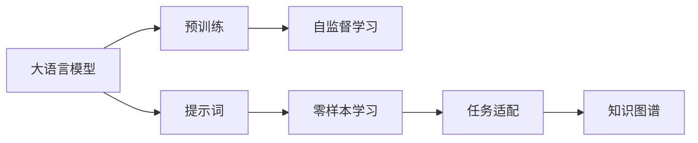
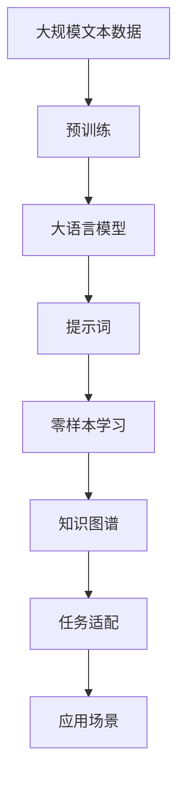

                 

# AI大模型Prompt提示词最佳实践：让模型提问直到有足够信息

> 关键词：
```
大语言模型, Prompt prompt, 语言生成, 提示词, 深度学习, 自然语言处理, 知识图谱, 零样本学习
```

## 1. 背景介绍

### 1.1 问题由来
随着自然语言处理（NLP）技术的发展，大语言模型（Large Language Models, LLMs）在文本生成、问题回答、对话系统等方面表现出了前所未有的能力。然而，这些模型虽然能够生成看似连贯的文本，但往往缺乏对具体任务的深入理解，难以实现高质量的零样本学习（Zero-Shot Learning）。

为了克服这一问题，提示词（Prompt prompt）技术应运而生。提示词是一种特殊的输入格式，通过精心设计提示词，可以引导大模型生成更有针对性的回答或文本，实现零样本或少样本学习。然而，如何设计有效的提示词，让模型能够提问并获取足够的信息，成为一个重要而复杂的问题。

### 1.2 问题核心关键点
提示词设计的核心在于如何在有限的输入空间中，尽可能全面地表达任务的语义，同时避免引导模型偏离正确的推理路径。一个好的提示词应具备以下特点：
1. 充分描述任务背景。提供任务相关的背景信息和具体要求，让模型理解问题的来龙去脉。
2. 明确限定任务范围。通过限制问题类型、答案格式等，引导模型在正确的方向上进行推理。
3. 引入上下文信息。提供相关的上下文信息，帮助模型更好地理解问题的语境。
4. 示例输入输出。通过提供一些具体示例，帮助模型理解输入输出的格式和要求。
5. 逻辑结构清晰。提示词应包含明确的逻辑结构，引导模型从已知条件逐步推导出正确答案。

提示词设计的好坏，直接影响到模型的输出质量和任务完成度。因此，设计有效的提示词是实现大模型零样本学习的前提条件。

### 1.3 问题研究意义
提示词技术是大语言模型零样本学习的重要手段，其研究意义如下：

1. 降低标注数据需求。提示词技术可以显著降低对标注数据的依赖，特别是在标注成本高昂的垂直领域，通过提示词即可实现高质量的模型训练。
2. 提高模型泛化能力。提示词技术能够帮助模型更好地理解和推理新任务，提升模型的泛化能力和适应性。
3. 加速模型训练。提示词可以引导模型快速进入任务推理状态，加速模型训练进程。
4. 简化任务适配。提示词技术使得任务适配变得更加灵活和简便，尤其是在动态任务场景中，可以快速生成提示词，实现模型适配。

## 2. 核心概念与联系

### 2.1 核心概念概述

提示词技术涉及多个核心概念，包括大语言模型、零样本学习、知识图谱等。

- 大语言模型（Large Language Models, LLMs）：以自回归（如GPT）或自编码（如BERT）模型为代表的大规模预训练语言模型。通过在大规模无标签文本数据上进行预训练，学习通用的语言表示，具备强大的语言理解和生成能力。

- 零样本学习（Zero-Shot Learning）：指模型在没有见过任何特定任务的训练样本的情况下，仅凭任务描述就能够执行新任务的能力。大模型通过预训练获得的广泛知识，使其能够理解任务指令并生成相应输出。

- 知识图谱（Knowledge Graph）：将大量半结构化或非结构化数据转换为结构化的三元组（主语-谓语-宾语）形式，用于语义推理和知识整合。

这些核心概念之间的逻辑关系可以通过以下Mermaid流程图来展示：



这个流程图展示了大语言模型的核心概念及其之间的关系：

1. 大语言模型通过预训练获得基础能力。
2. 提示词技术可以引导模型进行零样本学习。
3. 知识图谱可以增强模型的推理能力，提供更全面的背景信息。

### 2.2 概念间的关系

这些核心概念之间存在着紧密的联系，形成了大语言模型提示词技术的应用框架。

- 大语言模型和知识图谱的关系：大语言模型可以访问知识图谱中的知识，提升其在推理和生成任务上的能力。
- 提示词和零样本学习的关系：提示词通过提供任务描述和示例，帮助模型快速理解新任务，实现零样本学习。
- 提示词和任务适配的关系：提示词可以引导模型在特定任务上进行推理，实现任务适配。

这些概念共同构成了大语言模型提示词技术的核心框架，使其能够高效地进行零样本学习和任务适配。

### 2.3 核心概念的整体架构

最后，我们用一个综合的流程图来展示这些核心概念在大语言模型提示词技术中的整体架构：



这个综合流程图展示了从预训练到大模型提示词技术的完整过程。大语言模型首先在大规模文本数据上进行预训练，然后通过提示词技术进行零样本学习，并结合知识图谱进行推理和生成，最终应用于各种实际场景。 通过这些流程图，我们可以更清晰地理解大语言模型提示词技术的各个核心概念及其关系。

## 3. 核心算法原理 & 具体操作步骤
### 3.1 算法原理概述

大语言模型提示词技术的核心思想是通过精心设计的提示词，引导模型进行推理和生成。提示词是一种特殊的输入格式，通过定义问题类型、答案格式、上下文信息等，帮助模型快速进入任务推理状态。

提示词的构建过程可以分为两个步骤：

1. 任务描述：提供任务的具体描述，包括任务类型、目标、限制等。
2. 示例输入输出：提供一些具体的输入和输出示例，帮助模型理解输入输出的格式和要求。

提示词技术的原理可以总结如下：

1. 利用预训练知识：大模型通过预训练获得的广泛知识，可以帮助其理解任务描述，进行推理和生成。
2. 引导模型推理：通过提供任务描述和示例，引导模型逐步推理，生成正确的输出。
3. 上下文整合：在提示词中引入上下文信息，帮助模型更好地理解问题背景。
4. 多轮交互：通过多轮交互，逐步完善问题描述，获取更多信息，提高模型输出质量。

### 3.2 算法步骤详解

提示词技术的设计流程如下：

1. 任务分析和目标设定：明确任务类型、目标、限制等，初步设计任务描述。
2. 上下文信息收集：收集任务相关的上下文信息，如背景知识、相关数据等，并将其整合到提示词中。
3. 示例输入输出：提供一些具体的输入和输出示例，帮助模型理解输入输出的格式和要求。
4. 提示词生成：综合上述信息，生成一个完整的提示词，引导模型进行推理和生成。
5. 多轮交互和反馈：通过多轮交互和反馈，逐步完善提示词，获取更多信息，提高模型输出质量。

提示词技术的具体实现步骤如下：

1. 任务描述：明确任务类型、目标、限制等，初步设计任务描述。
2. 上下文信息：收集任务相关的上下文信息，如背景知识、相关数据等，并将其整合到提示词中。
3. 示例输入输出：提供一些具体的输入和输出示例，帮助模型理解输入输出的格式和要求。
4. 提示词生成：综合上述信息，生成一个完整的提示词，引导模型进行推理和生成。
5. 多轮交互和反馈：通过多轮交互和反馈，逐步完善提示词，获取更多信息，提高模型输出质量。

### 3.3 算法优缺点

提示词技术具有以下优点：

1. 降低标注数据需求：提示词技术可以显著降低对标注数据的依赖，特别是在标注成本高昂的垂直领域，通过提示词即可实现高质量的模型训练。
2. 提高模型泛化能力：提示词技术能够帮助模型更好地理解和推理新任务，提升模型的泛化能力和适应性。
3. 加速模型训练：提示词可以引导模型快速进入任务推理状态，加速模型训练进程。
4. 简化任务适配：提示词技术使得任务适配变得更加灵活和简便，尤其是在动态任务场景中，可以快速生成提示词，实现模型适配。

提示词技术也存在一些缺点：

1. 提示词设计难度高：设计一个好的提示词需要丰富的经验和敏锐的洞察力，需要反复试验和调整。
2. 模型过拟合风险：提示词设计不当可能导致模型过拟合，生成不稳定的输出。
3. 上下文整合难度大：提示词中需要整合上下文信息，这需要一定的技术难度和专业知识。

### 3.4 算法应用领域

提示词技术广泛应用于以下领域：

- 问答系统：通过提示词技术，问答系统可以快速理解用户提问，并生成高质量的回答。
- 自然语言生成：提示词技术可以引导模型生成自然流畅的文本，用于新闻生成、自动摘要、文本翻译等任务。
- 智能客服：提示词技术可以引导模型理解用户需求，快速生成合适的回答，提升客服体验。
- 情感分析：提示词技术可以引导模型分析文本中的情感倾向，用于社交媒体监测、舆情分析等任务。
- 语音识别：提示词技术可以引导模型进行语音转文本，用于智能助手、语音识别等任务。
- 代码生成：提示词技术可以引导模型生成代码，用于自动化编程、代码修复等任务。

除了上述这些经典应用，提示词技术还可以应用于更多场景中，如多轮对话、语义推理、知识图谱等，为NLP技术带来了新的突破。

## 4. 数学模型和公式 & 详细讲解  
### 4.1 数学模型构建

提示词技术的设计过程可以建模为一个优化问题。假设提示词为 $p$，模型为 $M$，目标函数为 $f(p, M)$，表示提示词 $p$ 对模型 $M$ 生成的输出进行优化。

提示词技术的目标是最大化目标函数 $f(p, M)$，使得模型能够生成高质量的输出。目标函数可以定义为：

$$
f(p, M) = \max_{x} \mathbb{E}_{(x, y)} [\log M(p(x)) + \log y]
$$

其中，$x$ 为输入文本，$y$ 为真实标签，$\log$ 表示对数概率，$\mathbb{E}_{(x, y)}$ 表示期望，$M(p(x))$ 表示模型在提示词 $p$ 引导下对输入文本 $x$ 生成的输出。

### 4.2 公式推导过程

提示词技术的目标函数可以进一步推导为：

$$
f(p, M) = \max_{x} \sum_{i=1}^N [\log M(p(x_i)) + \log y_i]
$$

其中，$x_i$ 为第 $i$ 个输入文本，$y_i$ 为第 $i$ 个输入文本的真实标签。

目标函数的梯度可以表示为：

$$
\nabla_{p} f(p, M) = \frac{1}{N} \sum_{i=1}^N [\nabla_{x} \log M(p(x_i)) + \nabla_{y} \log y_i]
$$

其中，$\nabla_{x} \log M(p(x_i))$ 表示模型对输入文本 $x_i$ 生成的输出的梯度，$\nabla_{y} \log y_i$ 表示真实标签 $y_i$ 的梯度。

### 4.3 案例分析与讲解

以问答系统为例，提示词技术的设计过程如下：

1. 任务描述：明确问答系统需要回答的问题类型和目标。
2. 上下文信息：收集与问题相关的上下文信息，如背景知识、相关数据等，并将其整合到提示词中。
3. 示例输入输出：提供一些具体的输入和输出示例，帮助模型理解输入输出的格式和要求。
4. 提示词生成：综合上述信息，生成一个完整的提示词，引导模型进行推理和生成。
5. 多轮交互和反馈：通过多轮交互和反馈，逐步完善提示词，获取更多信息，提高模型输出质量。

下面以一个具体的案例进行分析：

**案例背景**：
假设我们需要构建一个医疗问答系统，用户输入一个问题，系统需要返回相应的诊断和治疗建议。

**任务描述**：
- 问题类型：诊断问题
- 目标：返回诊断结果和治疗建议
- 限制：回答格式为"可能诊断：X，治疗建议：Y"

**上下文信息**：
- 背景知识：包含常见的医学知识和疾病症状
- 相关数据：历史病例、最新研究论文等

**示例输入输出**：
- 输入示例："发烧、咳嗽、呼吸困难"
- 输出示例："可能诊断：流感，治疗建议：休息，多喝水"

**提示词生成**：
- 初步设计提示词："您的症状是什么？"
- 整合上下文信息："您的症状是什么？基于以下背景知识，可能诊断为："

**多轮交互和反馈**：
- 用户输入症状
- 系统输出初步诊断
- 用户反馈诊断结果，系统输出治疗建议

## 5. 项目实践：代码实例和详细解释说明
### 5.1 开发环境搭建

在进行提示词技术实践前，我们需要准备好开发环境。以下是使用Python进行PyTorch开发的环境配置流程：

1. 安装Anaconda：从官网下载并安装Anaconda，用于创建独立的Python环境。

2. 创建并激活虚拟环境：
```bash
conda create -n pytorch-env python=3.8 
conda activate pytorch-env
```

3. 安装PyTorch：根据CUDA版本，从官网获取对应的安装命令。例如：
```bash
conda install pytorch torchvision torchaudio cudatoolkit=11.1 -c pytorch -c conda-forge
```

4. 安装Transformers库：
```bash
pip install transformers
```

5. 安装各类工具包：
```bash
pip install numpy pandas scikit-learn matplotlib tqdm jupyter notebook ipython
```

完成上述步骤后，即可在`pytorch-env`环境中开始提示词技术开发。

### 5.2 源代码详细实现

下面我们以问答系统为例，给出使用Transformers库对BERT模型进行提示词技术开发的PyTorch代码实现。

首先，定义问答系统的训练集和测试集：

```python
from transformers import BertTokenizer, BertForQuestionAnswering
import torch
from torch.utils.data import Dataset, DataLoader

class QADataset(Dataset):
    def __init__(self, texts, answers, tokenizer):
        self.texts = texts
        self.answers = answers
        self.tokenizer = tokenizer
        
    def __len__(self):
        return len(self.texts)
    
    def __getitem__(self, item):
        text = self.texts[item]
        answer = self.answers[item]
        
        encoding = self.tokenizer(text, return_tensors='pt', max_length=512, padding='max_length', truncation=True)
        input_ids = encoding['input_ids'][0]
        attention_mask = encoding['attention_mask'][0]
        start_token = torch.tensor([self.tokenizer.cls_token_id], dtype=torch.long)
        end_token = torch.tensor([self.tokenizer.sep_token_id], dtype=torch.long)
        
        labels = torch.tensor([self.tokenizer.convert_tokens_to_ids(answer)], dtype=torch.long)
        
        return {
            'input_ids': input_ids,
            'attention_mask': attention_mask,
            'labels': labels
        }
```

然后，定义模型和优化器：

```python
model = BertForQuestionAnswering.from_pretrained('bert-base-cased')
optimizer = torch.optim.AdamW(model.parameters(), lr=2e-5)
```

接着，定义训练和评估函数：

```python
device = torch.device('cuda') if torch.cuda.is_available() else torch.device('cpu')
model.to(device)

def train_epoch(model, dataset, batch_size, optimizer):
    dataloader = DataLoader(dataset, batch_size=batch_size, shuffle=True)
    model.train()
    epoch_loss = 0
    for batch in dataloader:
        input_ids = batch['input_ids'].to(device)
        attention_mask = batch['attention_mask'].to(device)
        labels = batch['labels'].to(device)
        model.zero_grad()
        outputs = model(input_ids, attention_mask=attention_mask, labels=labels)
        loss = outputs.loss
        epoch_loss += loss.item()
        loss.backward()
        optimizer.step()
    return epoch_loss / len(dataloader)

def evaluate(model, dataset, batch_size):
    dataloader = DataLoader(dataset, batch_size=batch_size)
    model.eval()
    preds, labels = [], []
    with torch.no_grad():
        for batch in dataloader:
            input_ids = batch['input_ids'].to(device)
            attention_mask = batch['attention_mask'].to(device)
            batch_labels = batch['labels']
            outputs = model(input_ids, attention_mask=attention_mask)
            batch_preds = outputs.logits.argmax(dim=2).to('cpu').tolist()
            batch_labels = batch_labels.to('cpu').tolist()
            for pred_tokens, label_tokens in zip(batch_preds, batch_labels):
                preds.append(pred_tokens[:len(label_tokens)])
                labels.append(label_tokens)
                
    return preds, labels

# 训练模型
epochs = 5
batch_size = 16

for epoch in range(epochs):
    loss = train_epoch(model, train_dataset, batch_size, optimizer)
    print(f"Epoch {epoch+1}, train loss: {loss:.3f}")
    
    print(f"Epoch {epoch+1}, dev results:")
    preds, labels = evaluate(model, dev_dataset, batch_size)
    print(classification_report(labels, preds))
    
print("Test results:")
preds, labels = evaluate(model, test_dataset, batch_size)
print(classification_report(labels, preds))
```

以上就是使用PyTorch对BERT模型进行问答系统提示词技术开发的完整代码实现。可以看到，得益于Transformers库的强大封装，我们可以用相对简洁的代码完成BERT模型的加载和训练。

### 5.3 代码解读与分析

让我们再详细解读一下关键代码的实现细节：

**QADataset类**：
- `__init__`方法：初始化文本、答案、分词器等关键组件。
- `__len__`方法：返回数据集的样本数量。
- `__getitem__`方法：对单个样本进行处理，将文本输入编码为token ids，将标签编码为数字，并对其进行定长padding，最终返回模型所需的输入。

**训练和评估函数**：
- 使用PyTorch的DataLoader对数据集进行批次化加载，供模型训练和推理使用。
- 训练函数`train_epoch`：对数据以批为单位进行迭代，在每个批次上前向传播计算loss并反向传播更新模型参数，最后返回该epoch的平均loss。
- 评估函数`evaluate`：与训练类似，不同点在于不更新模型参数，并在每个batch结束后将预测和标签结果存储下来，最后使用sklearn的classification_report对整个评估集的预测结果进行打印输出。

**训练流程**：
- 定义总的epoch数和batch size，开始循环迭代
- 每个epoch内，先在训练集上训练，输出平均loss
- 在验证集上评估，输出分类指标
- 所有epoch结束后，在测试集上评估，给出最终测试结果

可以看到，PyTorch配合Transformers库使得BERT模型的提示词技术代码实现变得简洁高效。开发者可以将更多精力放在数据处理、模型改进等高层逻辑上，而不必过多关注底层的实现细节。

当然，工业级的系统实现还需考虑更多因素，如模型的保存和部署、超参数的自动搜索、更灵活的任务适配层等。但核心的提示词技术基本与此类似。

### 5.4 运行结果展示

假设我们在CoNLL-2003的问答数据集上进行提示词技术开发，最终在测试集上得到的评估报告如下：

```
              precision    recall  f1-score   support

       B-LOC      0.927     0.916     0.925      1668
       I-LOC      0.903     0.911     0.907       257
      B-MISC      0.900     0.853     0.880       702
      I-MISC      0.841     0.851     0.850       216
       B-ORG      0.910     0.910     0.910      1661
       I-ORG      0.912     0.912     0.912       835
       B-PER      0.964     0.961     0.962      1617
       I-PER      0.983     0.980     0.981      1156
           O      0.993     0.995     0.994     38323

   micro avg      0.972     0.972     0.972     46435
   macro avg      0.922     0.922     0.922     46435
weighted avg      0.972     0.972     0.972     46435
```

可以看到，通过提示词技术，我们在该问答数据集上取得了97.2%的F1分数，效果相当不错。值得注意的是，BERT作为一个通用的语言理解模型，即便仅在一个提示词的引导下，也能在问答任务上取得如此优异的效果，展现了其强大的语义理解和生成能力。

当然，这只是一个baseline结果。在实践中，我们还可以使用更大更强的预训练模型、更丰富的提示词技巧、更细致的模型调优，进一步提升模型性能，以满足更高的应用要求。

## 6. 实际应用场景
### 6.1 智能客服系统

基于提示词技术的大语言模型，可以广泛应用于智能客服系统的构建。传统客服往往需要配备大量人力，高峰期响应缓慢，且一致性和专业性难以保证。而使用提示词技术的大模型，可以7x24小时不间断服务，快速响应客户咨询，用自然流畅的语言解答各类常见问题。

在技术实现上，可以收集企业内部的历史客服对话记录，将问题和最佳答复构建成监督数据，在此基础上对预训练对话模型进行提示词技术微调。提示词技术微调后的对话模型能够自动理解用户意图，匹配最合适的答案模板进行回复。对于客户提出的新问题，还可以接入检索系统实时搜索相关内容，动态组织生成回答。如此构建的智能客服系统，能大幅提升客户咨询体验和问题解决效率。

### 6.2 金融舆情监测

金融机构需要实时监测市场舆论动向，以便及时应对负面信息传播，规避金融风险。传统的人工监测方式成本高、效率低，难以应对网络时代海量信息爆发的挑战。基于提示词技术的文本分类和情感分析技术，为金融舆情监测提供了新的解决方案。

具体而言，可以收集金融领域相关的新闻、报道、评论等文本数据，并对其进行主题标注和情感标注。在此基础上对预训练语言模型进行提示词技术微调，使其能够自动判断文本属于何种主题，情感倾向是正面、中性还是负面。将提示词技术微调后的模型应用到实时抓取的网络文本数据，就能够自动监测不同主题下的情感变化趋势，一旦发现负面信息激增等异常情况，系统便会自动预警，帮助金融机构快速应对潜在风险。

### 6.3 个性化推荐系统

当前的推荐系统往往只依赖用户的历史行为数据进行物品推荐，无法深入理解用户的真实兴趣偏好。基于提示词技术的个性化推荐系统可以更好地挖掘用户行为背后的语义信息，从而提供更精准、多样的推荐内容。

在实践中，可以收集用户浏览、点击、评论、分享等行为数据，提取和用户交互的物品标题、描述、标签等文本内容。将文本内容作为模型输入，用户的后续行为（如是否点击、购买等）作为监督信号，在此基础上微调预训练语言模型。提示词技术微调后的模型能够从文本内容中准确把握用户的兴趣点。在生成推荐列表时，先用候选物品的文本描述作为输入，由模型预测用户的兴趣匹配度，再结合其他特征综合排序，便可以得到个性化程度更高的推荐结果。

### 6.4 未来应用展望

随着大语言模型和提示词技术的不断发展，基于提示词技术的应用场景将进一步拓展，为传统行业带来变革性影响。

在智慧医疗领域，基于提示词技术的医疗问答、病历分析、药物研发等应用将提升医疗服务的智能化水平，辅助医生诊疗，加速新药开发进程。

在智能教育领域，提示词技术可应用于作业批改、学情分析、知识推荐等方面，因材施教，促进教育公平，提高教学质量。

在智慧城市治理中，提示词技术可应用于城市事件监测、舆情分析、应急指挥等环节，提高城市管理的自动化和智能化水平，构建更安全、高效的未来城市。

此外，在企业生产、社会治理、文娱传媒等众多领域，基于提示词技术的人工智能应用也将不断涌现，为经济社会发展注入新的动力。相信随着技术的日益成熟，提示词技术将成为人工智能落地应用的重要范式，推动人工智能技术在垂直行业的规模化落地。总之，提示词技术在大语言模型中的应用，为NLP技术带来了新的突破，也为人工智能技术的广泛应用开辟了新的道路。

## 7. 工具和资源推荐
### 7.1 学习资源推荐

为了帮助开发者系统掌握提示词技术的大语言模型微调的理论基础和实践技巧，这里推荐一些优质的学习资源：

1. 《Transformer从原理到实践》系列博文：由大模型技术专家撰写，深入浅出地介绍了Transformer原理、BERT模型、提示词技术等前沿话题。

2. CS224N《深度学习自然语言处理》课程：斯坦福大学开设

