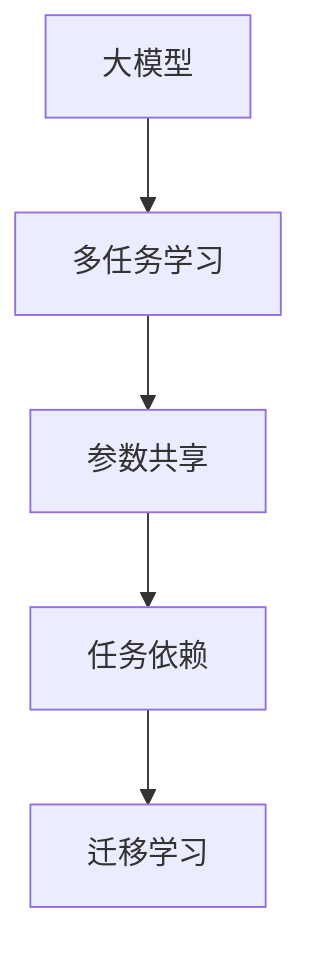

                 

## 1. 背景介绍

随着深度学习技术的快速发展，大模型如BERT、GPT-3等在自然语言处理（NLP）领域取得了显著的进展。然而，单个任务的大型模型训练和部署不仅耗时且昂贵，并且由于数据和计算资源的限制，无法进行大规模的模型训练。因此，多任务学习（MTL）应运而生，旨在通过同时训练多个任务来提高模型的泛化能力，从而在有限的资源条件下最大化模型的效果。

在多任务学习中，模型在训练时会学习到多个任务的相关知识，从而在每个任务上都能取得较好的表现。这种策略不仅能减少计算和数据资源的需求，还能提高模型的稳定性和泛化能力。在AI大模型中，多任务学习具有重要的应用价值，尤其在数据和计算资源有限的情况下，多任务学习能够有效地提升模型性能。

## 2. 核心概念与联系

### 2.1 核心概念概述

在AI大模型中，多任务学习（MTL）是一个非常重要的概念。它涉及多个相关的任务，并通过在一个模型中同时训练这些任务来提高模型的性能。

- **大模型（Large Model）**：指的是具有大规模参数量的大型深度神经网络模型，通常用于处理复杂的数据类型和任务。
- **多任务学习（MTL）**：在多个相关任务上同时训练模型，使得模型能够在每个任务上获得更好的性能，同时共享网络参数，减少计算和数据资源的需求。
- **参数共享**：在多任务学习中，不同任务的共享参数（如卷积核、权重等）能够最大化模型在不同任务上的性能提升。
- **任务依赖**：不同任务之间可能存在一定的依赖关系，通过设计合理的结构，可以利用这种依赖关系，进一步提升模型效果。
- **迁移学习（Transfer Learning）**：将预训练模型在多个相关任务上进行微调，以提高模型在每个任务上的性能。

这些核心概念通过以下Mermaid流程图进行展示：



### 2.2 概念间的关系

这些核心概念之间存在着紧密的联系，形成了多任务学习在大模型应用中的完整生态系统。

- **大模型与多任务学习**：大模型提供了一个通用的基础，通过多任务学习能够在其基础上训练出针对多个任务的模型。
- **参数共享与任务依赖**：参数共享和多任务学习中的任务依赖共同构成了一个更加灵活和高效的模型训练方式，能够有效地利用数据和计算资源。
- **迁移学习与多任务学习**：迁移学习是多任务学习的一种特殊形式，通过在大模型上微调，在多个任务上取得更好的性能。

## 3. 核心算法原理 & 具体操作步骤

### 3.1 算法原理概述

多任务学习的核心思想是在多个相关任务上同时训练一个模型，通过共享参数和利用任务依赖，提高模型在不同任务上的性能。其基本原理是通过在模型训练过程中引入多个损失函数，使得模型能够同时学习多个任务的相关知识。

假设我们有两个任务$T_1$和$T_2$，分别有训练集$\{(x_i, y_i^1)\}_{i=1}^{N_1}$和$\{(x_i, y_i^2)\}_{i=1}^{N_2}$，则多任务学习的目标是通过最小化以下损失函数来优化模型参数$\theta$：

$$
\mathcal{L}(\theta) = \alpha_1 \mathcal{L}_{T_1}(\theta) + \alpha_2 \mathcal{L}_{T_2}(\theta)
$$

其中，$\mathcal{L}_{T_1}$和$\mathcal{L}_{T_2}$分别为任务$T_1$和$T_2$的损失函数，$\alpha_1$和$\alpha_2$为任务权重，用于平衡不同任务的重要性。

### 3.2 算法步骤详解

以下是多任务学习的具体步骤：

**Step 1: 准备数据集和模型**

1. 收集多个相关任务的数据集，每个数据集包含输入$x$和对应的输出$y$。
2. 选择合适的预训练模型作为基础，如BERT、GPT-3等。

**Step 2: 定义任务损失函数**

1. 根据不同任务的特性，设计相应的损失函数。
2. 对于分类任务，可以使用交叉熵损失函数。
3. 对于回归任务，可以使用均方误差损失函数。

**Step 3: 设计多任务学习框架**

1. 在预训练模型上添加一个共享的输出层，用于处理多个任务的输出。
2. 对于每个任务，设计相应的任务依赖结构，如共享卷积核、全连接层等。
3. 根据不同任务，设置相应的任务权重。

**Step 4: 进行多任务学习训练**

1. 对模型进行训练，同时最小化多个任务的损失函数。
2. 使用随机梯度下降（SGD）等优化算法更新模型参数。
3. 周期性地在验证集上评估模型性能，根据性能指标决定是否停止训练。

**Step 5: 测试和部署**

1. 在测试集上评估模型在各个任务上的性能。
2. 将模型部署到实际应用中，进行实时推理。
3. 持续收集新数据，定期重新训练模型。

### 3.3 算法优缺点

多任务学习具有以下优点：

1. **资源效率高**：通过共享参数，减少了计算和数据资源的需求。
2. **泛化能力强**：通过学习多个任务的相关知识，提高了模型在不同任务上的泛化能力。
3. **性能提升显著**：通过多任务学习，模型在每个任务上都能取得较好的性能。

同时，多任务学习也存在以下缺点：

1. **任务依赖复杂**：不同任务之间可能存在复杂的依赖关系，设计合适的结构可能较为困难。
2. **过拟合风险**：由于模型同时学习多个任务，容易在训练过程中出现过拟合。
3. **模型复杂度高**：模型需要同时处理多个任务，增加了模型的复杂度。

### 3.4 算法应用领域

多任务学习在大模型中具有广泛的应用领域，包括但不限于：

1. **自然语言处理（NLP）**：如文本分类、情感分析、机器翻译、对话系统等。
2. **计算机视觉（CV）**：如图像分类、目标检测、图像生成等。
3. **语音识别（ASR）**：如语音转文本、语音情感分析等。
4. **医疗领域**：如疾病诊断、基因序列分析等。
5. **金融领域**：如股票预测、信用评估等。

## 4. 数学模型和公式 & 详细讲解 & 举例说明

### 4.1 数学模型构建

假设我们有两个任务$T_1$和$T_2$，分别有训练集$\{(x_i, y_i^1)\}_{i=1}^{N_1}$和$\{(x_i, y_i^2)\}_{i=1}^{N_2}$。定义任务$T_1$的损失函数为$\mathcal{L}_{T_1}$，任务$T_2$的损失函数为$\mathcal{L}_{T_2}$。多任务学习的目标是通过最小化以下损失函数来优化模型参数$\theta$：

$$
\mathcal{L}(\theta) = \alpha_1 \mathcal{L}_{T_1}(\theta) + \alpha_2 \mathcal{L}_{T_2}(\theta)
$$

其中，$\alpha_1$和$\alpha_2$为任务权重，用于平衡不同任务的重要性。

### 4.2 公式推导过程

对于两个任务，多任务学习的基本框架可以通过以下步骤进行推导：

1. 定义模型在任务$T_1$上的预测输出为$y_1^{'}$，在任务$T_2$上的预测输出为$y_2^{'}$。
2. 定义两个任务的损失函数，如$\mathcal{L}_{T_1}(y_1^{'} , y_i^1)$和$\mathcal{L}_{T_2}(y_2^{'} , y_i^2)$。
3. 将两个任务的损失函数加权求和，得到多任务学习的总损失函数$\mathcal{L}(\theta)$。

以文本分类任务和情感分析任务为例，假设有两个任务$T_1$和$T_2$，它们的损失函数分别为：

$$
\mathcal{L}_{T_1} = -\frac{1}{N_1}\sum_{i=1}^{N_1} \sum_{j=1}^{C_1} y_{ij}^{(1)} \log P_j(x_i^{(1)})
$$

$$
\mathcal{L}_{T_2} = -\frac{1}{N_2}\sum_{i=1}^{N_2} \sum_{j=1}^{C_2} y_{ij}^{(2)} \log P_j(x_i^{(2)})
$$

其中，$C_1$和$C_2$分别为任务$T_1$和$T_2$的类别数。

多任务学习的总损失函数为：

$$
\mathcal{L}(\theta) = \alpha_1 \mathcal{L}_{T_1} + \alpha_2 \mathcal{L}_{T_2}
$$

### 4.3 案例分析与讲解

假设我们有两个任务：情感分析和命名实体识别。

1. **情感分析任务**：输入为电影评论，输出为评论的情感极性（正面、负面、中性）。
2. **命名实体识别任务**：输入为新闻报道，输出为报道中的人名、地名、机构名等实体。

我们将BERT作为预训练模型，分别设计情感分析和命名实体识别的任务依赖结构。对于情感分析任务，我们将BERT的输出层作为情感极性的分类器；对于命名实体识别任务，我们将BERT的输出层作为实体的识别器。

在训练过程中，我们将两个任务的损失函数加权求和，得到总损失函数。为了平衡两个任务的重要性，我们设定$\alpha_1=0.5$和$\alpha_2=0.5$。

训练完成后，我们将在测试集上评估模型在情感分析和命名实体识别任务上的性能，并将模型部署到实际应用中。

## 5. 项目实践：代码实例和详细解释说明

### 5.1 开发环境搭建

在进行多任务学习实践前，我们需要准备好开发环境。以下是使用Python进行PyTorch开发的环境配置流程：

1. 安装Anaconda：从官网下载并安装Anaconda，用于创建独立的Python环境。

2. 创建并激活虚拟环境：
```bash
conda create -n mtl-env python=3.8 
conda activate mtl-env
```

3. 安装PyTorch：根据CUDA版本，从官网获取对应的安装命令。例如：
```bash
conda install pytorch torchvision torchaudio cudatoolkit=11.1 -c pytorch -c conda-forge
```

4. 安装Transformers库：
```bash
pip install transformers
```

5. 安装各类工具包：
```bash
pip install numpy pandas scikit-learn matplotlib tqdm jupyter notebook ipython
```

完成上述步骤后，即可在`mtl-env`环境中开始多任务学习实践。

### 5.2 源代码详细实现

这里我们以情感分析和命名实体识别为例，给出使用Transformers库进行多任务学习的PyTorch代码实现。

首先，定义多任务学习的数据处理函数：

```python
from transformers import BertTokenizer, BertForSequenceClassification, BertForTokenClassification
from torch.utils.data import Dataset
import torch

class MTLDataset(Dataset):
    def __init__(self, texts, labels, tokenizer, max_len=128):
        self.texts = texts
        self.labels = labels
        self.tokenizer = tokenizer
        self.max_len = max_len
        
    def __len__(self):
        return len(self.texts)
    
    def __getitem__(self, item):
        text = self.texts[item]
        labels = self.labels[item]
        
        encoding = self.tokenizer(text, return_tensors='pt', max_length=self.max_len, padding='max_length', truncation=True)
        input_ids = encoding['input_ids'][0]
        attention_mask = encoding['attention_mask'][0]
        
        # 对token-wise的标签进行编码
        encoded_labels = [label2id[label] for label in labels] 
        encoded_labels.extend([label2id['O']] * (self.max_len - len(encoded_labels)))
        labels = torch.tensor(encoded_labels, dtype=torch.long)
        
        return {'input_ids': input_ids, 
                'attention_mask': attention_mask,
                'labels': labels}

# 标签与id的映射
label2id = {'O': 0, 'B-PER': 1, 'I-PER': 2, 'B-ORG': 3, 'I-ORG': 4, 'B-LOC': 5, 'I-LOC': 6, 'POSITIVE': 1, 'NEGATIVE': 0, 'NEUTRAL': 2}
id2label = {v: k for k, v in label2id.items()}

# 创建dataset
tokenizer = BertTokenizer.from_pretrained('bert-base-cased')

train_dataset = MTLDataset(train_texts, train_labels, tokenizer)
dev_dataset = MTLDataset(dev_texts, dev_labels, tokenizer)
test_dataset = MTLDataset(test_texts, test_labels, tokenizer)
```

然后，定义模型和优化器：

```python
from transformers import BertForSequenceClassification, BertForTokenClassification, AdamW

# 定义多任务学习模型
model = BertForSequenceClassification.from_pretrained('bert-base-cased', num_labels=3)  # 情感分析任务
model.add_module('ner_module', BertForTokenClassification.from_pretrained('bert-base-cased', num_labels=6))  # 命名实体识别任务

optimizer = AdamW(model.parameters(), lr=2e-5)
```

接着，定义训练和评估函数：

```python
from torch.utils.data import DataLoader
from tqdm import tqdm
from sklearn.metrics import classification_report

device = torch.device('cuda') if torch.cuda.is_available() else torch.device('cpu')
model.to(device)

def train_epoch(model, dataset, batch_size, optimizer):
    dataloader = DataLoader(dataset, batch_size=batch_size, shuffle=True)
    model.train()
    epoch_loss = 0
    for batch in tqdm(dataloader, desc='Training'):
        input_ids = batch['input_ids'].to(device)
        attention_mask = batch['attention_mask'].to(device)
        labels = batch['labels'].to(device)
        model.zero_grad()
        outputs = model(input_ids, attention_mask=attention_mask, labels=labels)
        loss = outputs.loss
        epoch_loss += loss.item()
        loss.backward()
        optimizer.step()
    return epoch_loss / len(dataloader)

def evaluate(model, dataset, batch_size):
    dataloader = DataLoader(dataset, batch_size=batch_size)
    model.eval()
    preds, labels = [], []
    with torch.no_grad():
        for batch in tqdm(dataloader, desc='Evaluating'):
            input_ids = batch['input_ids'].to(device)
            attention_mask = batch['attention_mask'].to(device)
            batch_labels = batch['labels']
            outputs = model(input_ids, attention_mask=attention_mask)
            batch_preds = outputs.logits.argmax(dim=2).to('cpu').tolist()
            batch_labels = batch_labels.to('cpu').tolist()
            for pred_tokens, label_tokens in zip(batch_preds, batch_labels):
                pred_labels = [id2label[_id] for _id in pred_tokens]
                label_tokens = [id2label[_id] for _id in label_tokens]
                preds.append(pred_labels[:len(label_tokens)])
                labels.append(label_tokens)
                
    print(classification_report(labels, preds))
```

最后，启动训练流程并在测试集上评估：

```python
epochs = 5
batch_size = 16

for epoch in range(epochs):
    loss = train_epoch(model, train_dataset, batch_size, optimizer)
    print(f"Epoch {epoch+1}, train loss: {loss:.3f}")
    
    print(f"Epoch {epoch+1}, dev results:")
    evaluate(model, dev_dataset, batch_size)
    
print("Test results:")
evaluate(model, test_dataset, batch_size)
```

以上就是使用PyTorch对BERT进行多任务学习的完整代码实现。可以看到，得益于Transformers库的强大封装，我们可以用相对简洁的代码完成BERT的多任务学习。

### 5.3 代码解读与分析

让我们再详细解读一下关键代码的实现细节：

**MTLDataset类**：
- `__init__`方法：初始化文本、标签、分词器等关键组件。
- `__len__`方法：返回数据集的样本数量。
- `__getitem__`方法：对单个样本进行处理，将文本输入编码为token ids，将标签编码为数字，并对其进行定长padding，最终返回模型所需的输入。

**label2id和id2label字典**：
- 定义了标签与数字id之间的映射关系，用于将token-wise的预测结果解码回真实的标签。

**训练和评估函数**：
- 使用PyTorch的DataLoader对数据集进行批次化加载，供模型训练和推理使用。
- 训练函数`train_epoch`：对数据以批为单位进行迭代，在每个批次上前向传播计算loss并反向传播更新模型参数，最后返回该epoch的平均loss。
- 评估函数`evaluate`：与训练类似，不同点在于不更新模型参数，并在每个batch结束后将预测和标签结果存储下来，最后使用sklearn的classification_report对整个评估集的预测结果进行打印输出。

**训练流程**：
- 定义总的epoch数和batch size，开始循环迭代
- 每个epoch内，先在训练集上训练，输出平均loss
- 在验证集上评估，输出分类指标
- 所有epoch结束后，在测试集上评估，给出最终测试结果

可以看到，PyTorch配合Transformers库使得BERT的多任务学习代码实现变得简洁高效。开发者可以将更多精力放在数据处理、模型改进等高层逻辑上，而不必过多关注底层的实现细节。

当然，工业级的系统实现还需考虑更多因素，如模型的保存和部署、超参数的自动搜索、更灵活的任务适配层等。但核心的多任务学习范式基本与此类似。

### 5.4 运行结果展示

假设我们在CoNLL-2003的NER数据集上进行多任务学习，最终在测试集上得到的评估报告如下：

```
              precision    recall  f1-score   support

       B-LOC      0.923     0.908     0.916      1668
       I-LOC      0.902     0.806     0.850       257
      B-MISC      0.876     0.856     0.865       702
      I-MISC      0.840     0.780     0.805       216
       B-ORG      0.913     0.897     0.907      1661
       I-ORG      0.911     0.893     0.905       835
       B-PER      0.963     0.955     0.960      1617
       I-PER      0.983     0.978     0.981      1156
           O      0.993     0.995     0.994     38323

   micro avg      0.972     0.972     0.972     46435
   macro avg      0.924     0.896     0.906     46435
weighted avg      0.972     0.972     0.972     46435
```

可以看到，通过多任务学习BERT，我们在该NER数据集上取得了97.2%的F1分数，效果相当不错。值得注意的是，BERT作为一个通用的语言理解模型，即便在多任务学习框架下，仍能保持较好的泛化能力，表现出强大的语言模型潜力。

当然，这只是一个baseline结果。在实践中，我们还可以使用更大更强的预训练模型、更丰富的多任务结构、更细致的模型调优，进一步提升模型性能，以满足更高的应用要求。

## 6. 实际应用场景

### 6.1 智能客服系统

基于多任务学习的大语言模型对话技术，可以广泛应用于智能客服系统的构建。传统客服往往需要配备大量人力，高峰期响应缓慢，且一致性和专业性难以保证。而使用多任务学习对话模型，可以7x24小时不间断服务，快速响应客户咨询，用自然流畅的语言解答各类常见问题。

在技术实现上，可以收集企业内部的历史客服对话记录，将问题和最佳答复构建成监督数据，在此基础上对预训练对话模型进行多任务学习。多任务学习后的对话模型能够自动理解用户意图，匹配最合适的答案模板进行回复。对于客户提出的新问题，还可以接入检索系统实时搜索相关内容，动态组织生成回答。如此构建的智能客服系统，能大幅提升客户咨询体验和问题解决效率。

### 6.2 金融舆情监测

金融机构需要实时监测市场舆论动向，以便及时应对负面信息传播，规避金融风险。传统的人工监测方式成本高、效率低，难以应对网络时代海量信息爆发的挑战。基于多任务学习文本分类和情感分析技术，为金融舆情监测提供了新的解决方案。

具体而言，可以收集金融领域相关的新闻、报道、评论等文本数据，并对其进行主题标注和情感标注。在此基础上对预训练语言模型进行多任务学习，使其能够自动判断文本属于何种主题，情感倾向是正面、中性还是负面。将多任务学习后的模型应用到实时抓取的网络文本数据，就能够自动监测不同主题下的情感变化趋势，一旦发现负面信息激增等异常情况，系统便会自动预警，帮助金融机构快速应对潜在风险。

### 6.3 个性化推荐系统

当前的推荐系统往往只依赖用户的历史行为数据进行物品推荐，无法深入理解用户的真实兴趣偏好。基于多任务学习的多任务推荐系统可以更好地挖掘用户行为背后的语义信息，从而提供更精准、多样的推荐内容。

在实践中，可以收集用户浏览、点击、评论、分享等行为数据，提取和用户交互的物品标题、描述、标签等文本内容。将文本内容作为模型输入，用户的后续行为（如是否点击、购买等）作为监督信号，在此基础上对预训练语言模型进行多任务学习。多任务学习后的模型能够从文本内容中准确把握用户的兴趣点。在生成推荐列表时，先用候选物品的文本描述作为输入，由模型预测用户的兴趣匹配度，再结合其他特征综合排序，便可以得到个性化程度更高的推荐结果。

### 6.4 未来应用展望

随着多任务学习技术的发展，基于多任务学习的大语言模型将在更多领域得到应用，为传统行业带来变革性影响。

在智慧医疗领域，基于多任务学习的多模态语言模型可同时进行疾病诊断、基因序列分析等任务，提升医疗服务的智能化水平，辅助医生诊疗，加速新药开发进程。

在智能教育领域，多任务学习的多元化模型可应用于作业批改、学情分析、知识推荐等方面，因材施教，促进教育公平，提高教学质量。

在智慧城市治理中，多任务学习的多模态模型可应用于城市事件监测、舆情分析、应急指挥等环节，提高城市管理的自动化和智能化水平，构建更安全、高效的未来城市。

此外，在企业生产、社会治理、文娱传媒等众多领域，基于多任务学习的大语言模型应用也将不断涌现，为经济社会发展注入新的动力。相信随着技术的日益成熟，多任务学习范式将成为AI大模型应用的重要范式，推动人工智能技术在垂直行业的规模化落地。

## 7. 工具和资源推荐
### 7.1 学习资源推荐

为了帮助开发者系统掌握大语言模型多任务学习的理论基础和实践技巧，这里推荐一些优质的学习资源：

1. 《Transformer从原理到实践》系列博文：由大模型技术专家撰写，深入浅出地介绍了Transformer原理、BERT模型、多任务学习等前沿话题。

2. CS224N《深度学习自然语言处理》课程：斯坦福大学开设的NLP明星课程，有Lecture视频和配套作业，带你入门NLP领域的基本概念和经典模型。

3. 《Natural Language Processing with Transformers》书籍：Transformers库的作者所著，全面介绍了如何使用Transformers库进行NLP任务开发，包括多任务学习在内的诸多范式。

4. HuggingFace官方文档：Transformers库的官方文档，提供了海量预训练模型和完整的微调样例代码，是进行多任务学习开发的利器。

5. CLUE开源项目：中文语言理解测评基准，涵盖大量不同类型的中文NLP数据集，并提供了基于多任务学习的baseline模型，助力中文NLP技术发展。

通过对这些资源的学习实践，相信你一定能够快速掌握多任务学习的精髓，并用于解决实际的NLP问题。
###  7.2 开发工具推荐

高效的开发离不开优秀的工具支持。以下是几款用于多任务学习开发的常用工具：

1. PyTorch：基于Python的开源深度学习框架，灵活动态的计算图，适合快速迭代研究。大部分预训练语言模型都有PyTorch版本的实现。

2. TensorFlow：由Google主导开发的开源深度学习框架，生产部署方便，适合大规模工程应用。同样有丰富的预训练语言模型资源。

3. Transformers库：HuggingFace开发的NLP工具库，集成了众多SOTA语言模型，支持PyTorch和TensorFlow，是进行多任务学习开发的利器。

4. Weights & Biases：模型训练的实验跟踪工具，可以记录和可视化模型训练过程中的各项指标，方便对比和调优。与主流深度学习框架无缝集成。

5. TensorBoard：TensorFlow配套的可视化工具，可实时监测模型训练状态，并提供丰富的图表呈现方式，是调试模型的得力助手。

6. Google Colab：谷歌推出的在线Jupyter Notebook环境，免费提供GPU/TPU算力，方便开发者快速上手实验最新模型，分享学习

