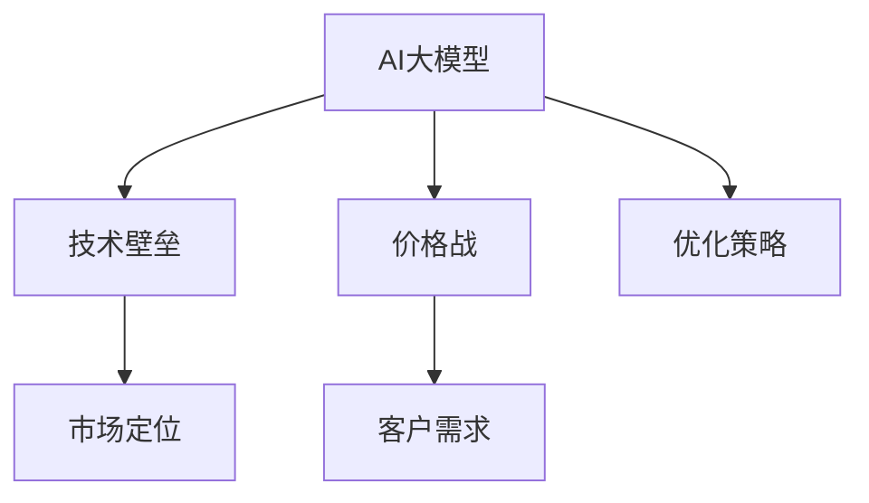
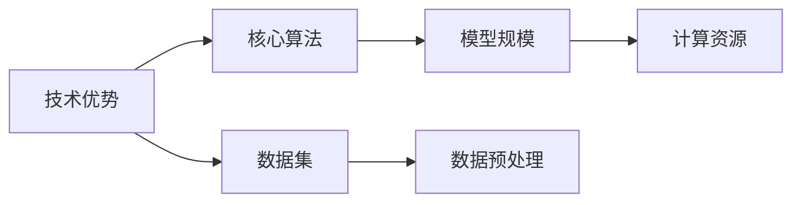
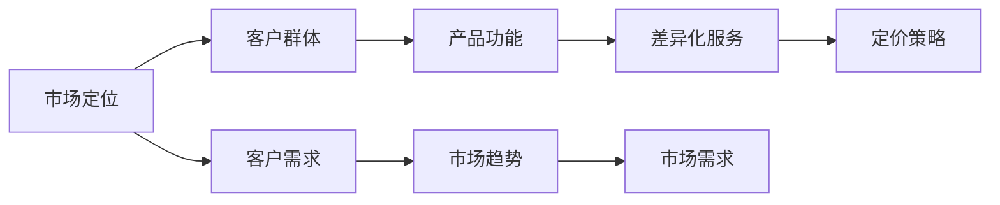
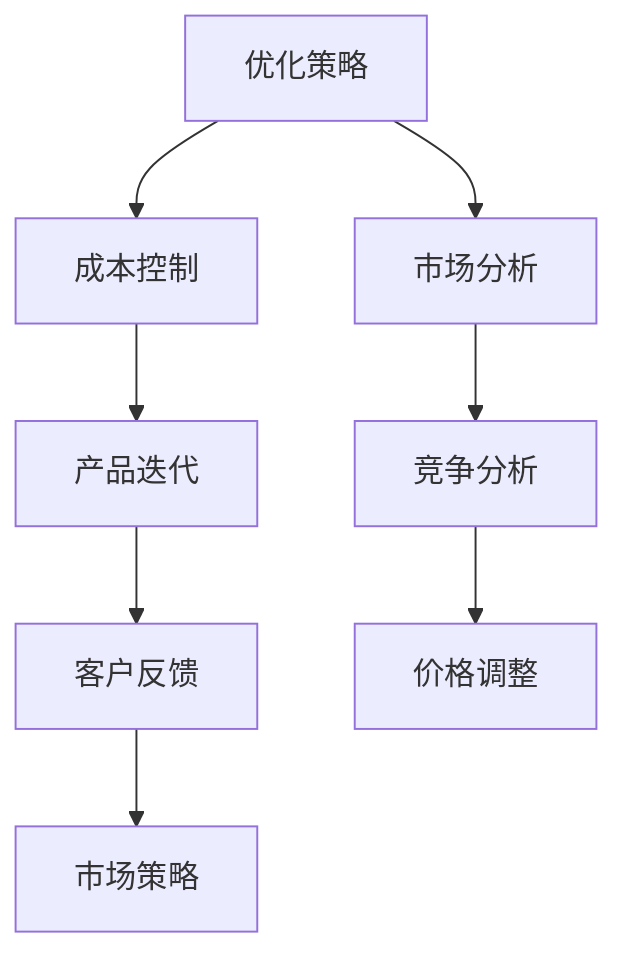
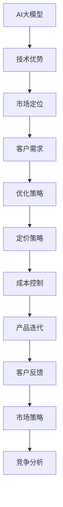

                 

# AI大模型创业：如何应对未来价格战？

## 1. 背景介绍

### 1.1 问题由来
随着人工智能技术的不断成熟和普及，越来越多的企业和创业者开始关注并投资于AI大模型的研发和应用。然而，AI大模型的高成本、高门槛以及其强大的市场潜力，也吸引了不少竞争对手的加入。在这样的市场环境下，如何有效应对价格战，保持竞争优势，成为了大模型创业公司不得不面对的挑战。

### 1.2 问题核心关键点
未来价格战的应对，不仅关乎商业模式和定价策略，还涉及技术壁垒、市场定位、客户需求等多个方面。本文将围绕这些关键点，探讨大模型创业公司如何在激烈的市场竞争中脱颖而出，建立和维护其市场地位。

### 1.3 问题研究意义
本文旨在为大模型创业公司提供策略指导，帮助其应对市场竞争，优化商业模式，提升技术优势，从而在价格战中保持竞争力。具体来说，研究的意义体现在以下几个方面：
- 帮助创业公司制定更加科学合理的定价策略，避免价格战的陷阱。
- 提供技术创新和市场定位的建议，构建独特的竞争优势。
- 探讨客户需求和市场趋势，提高客户满意度和忠诚度。

## 2. 核心概念与联系

### 2.1 核心概念概述

为更好地理解未来价格战的应对策略，本节将介绍几个密切相关的核心概念：

- **AI大模型**：指的是基于深度学习技术训练出的庞大神经网络模型，能够处理大规模数据集，完成复杂的自然语言处理、图像识别、语音识别等任务。
- **价格战**：指在市场竞争中，企业通过降价等方式试图超越竞争对手的市场策略。
- **技术壁垒**：指企业凭借其独特的技术优势，难以被竞争对手轻易模仿和超越的门槛。
- **市场定位**：指企业根据自身技术特点和市场需求，确定其在市场中的位置和竞争策略。
- **客户需求**：指客户在购买和使用大模型产品时的具体需求和期望。

这些核心概念之间的逻辑关系可以通过以下Mermaid流程图来展示：



这个流程图展示了AI大模型、技术壁垒、价格战、市场定位和客户需求之间的关系：

1. 大模型的技术优势为构建技术壁垒提供基础。
2. 价格战可能破坏市场秩序，但合理定价策略可以保护企业利益。
3. 市场定位需要结合技术优势和客户需求来制定。
4. 优化策略需要兼顾技术创新和市场需求，才能有效应对价格战。

### 2.2 概念间的关系

这些核心概念之间存在着紧密的联系，形成了AI大模型创业的完整生态系统。下面我们通过几个Mermaid流程图来展示这些概念之间的关系。

#### 2.2.1 AI大模型的技术优势



这个流程图展示了AI大模型的技术优势与其核心算法、数据集、模型规模、计算资源等要素之间的关系：

1. 核心算法是大模型技术优势的核心。
2. 数据集的质量和规模直接影响模型训练效果。
3. 模型规模和计算资源是大模型训练的基础。

#### 2.2.2 市场定位与客户需求



这个流程图展示了市场定位与客户需求之间的关系：

1. 客户群体的特征影响市场定位。
2. 客户需求是大模型产品设计的基础。
3. 市场趋势影响客户需求的演变。
4. 差异化服务满足客户需求，形成市场定位差异。
5. 定价策略需要考虑客户需求和市场趋势，进行灵活调整。

#### 2.2.3 优化策略与价格战



这个流程图展示了优化策略与价格战之间的关系：

1. 成本控制是优化策略的基础。
2. 市场分析帮助企业识别市场机会和竞争态势。
3. 产品迭代需要不断优化以满足客户需求。
4. 竞争分析帮助企业制定合理的定价策略。
5. 客户反馈影响产品迭代和市场策略。
6. 价格调整是应对价格战的重要手段。

### 2.3 核心概念的整体架构

最后，我们用一个综合的流程图来展示这些核心概念在大模型创业中的整体架构：



这个综合流程图展示了从AI大模型技术优势到定价策略的完整过程，通过技术优势构建市场定位，根据客户需求制定优化策略，再通过定价策略应对价格战，最终形成完整的市场策略和产品迭代闭环。

## 3. 核心算法原理 & 具体操作步骤
### 3.1 算法原理概述

未来价格战的应对，关键在于利用AI大模型的技术优势，制定合理的价格策略，并在市场定位和客户需求的基础上，进行产品优化和创新。

### 3.2 算法步骤详解

1. **技术壁垒建设**：
   - **核心算法**：选择和优化模型架构，如Transformer、BERT等。
   - **数据集准备**：收集高质量的数据集，进行预处理和标注。
   - **模型训练**：使用大规模计算资源进行模型训练，调整超参数，优化模型效果。

2. **市场定位制定**：
   - **客户群体分析**：明确目标客户群体，了解其需求和痛点。
   - **市场趋势分析**：关注行业动态，了解市场需求的变化趋势。
   - **差异化服务设计**：根据客户需求和市场趋势，设计具有竞争力的产品功能和服务模式。

3. **优化策略实施**：
   - **成本控制**：采用资源优化技术，如混合精度训练、模型压缩等，降低成本。
   - **定价策略制定**：根据成本、市场定位和客户需求，制定合理的定价策略。
   - **产品迭代优化**：持续收集客户反馈，进行产品优化和功能升级。

4. **价格战应对**：
   - **价格调整**：根据市场动态和竞争对手价格，灵活调整定价策略。
   - **竞争分析**：监控竞争对手的市场策略和产品动态，及时调整自身策略。
   - **市场策略优化**：通过市场活动、促销等手段，提升市场份额和品牌影响力。

### 3.3 算法优缺点

**优点**：
- **技术优势明显**：AI大模型拥有强大的数据处理能力和丰富的语言知识，能够满足复杂任务需求。
- **灵活性高**：价格战策略可以根据市场动态和客户需求进行调整，保持竞争力。
- **创新性强**：通过技术优化和市场定位的调整，能够推出差异化产品，满足客户独特需求。

**缺点**：
- **研发成本高**：AI大模型的研发和训练需要大量计算资源和数据，成本较高。
- **市场风险高**：价格战可能导致利润压缩，需要谨慎定价和市场策略。
- **客户需求变化快**：市场需求快速变化，需要持续监控和响应。

### 3.4 算法应用领域

未来价格战的应对策略不仅适用于AI大模型的创业公司，还可以扩展到其他技术领域，如云计算、物联网等。

- **云计算**：通过优化资源利用率、提高服务质量等方式应对价格战。
- **物联网**：通过提高设备性能、降低成本、优化用户体验等方式保持竞争优势。

## 4. 数学模型和公式 & 详细讲解 & 举例说明

### 4.1 数学模型构建

我们以定价策略为例，构建数学模型进行详细讲解。

假设AI大模型的固定成本为C，变动成本为V，单位价格为p，需求函数为D(p)，市场定位系数为α，客户需求系数为β。

根据边际成本定价法，价格p的计算公式为：

$$
p = \frac{C + V}{D(p)}
$$

其中，D(p)为市场需求函数，可以根据客户需求和市场趋势进行调整。

### 4.2 公式推导过程

首先，我们需要建立市场需求函数D(p)，假设客户对价格的敏感度为k，则市场需求函数可以表示为：

$$
D(p) = a - b\ln(p) - c
$$

其中，a、b、c为常数，可以根据历史数据和市场趋势进行拟合。

将市场需求函数代入定价公式，得到：

$$
p = \frac{C + V}{a - b\ln(p) - c}
$$

这是一个非线性方程，可以通过数值方法进行求解，如牛顿迭代法。求解后的p即为最优价格。

### 4.3 案例分析与讲解

假设某AI大模型公司的固定成本为100万元，变动成本为10元/小时，市场定位系数α为0.8，客户需求系数β为0.6。如果市场需求函数为D(p) = 100 - 20\ln(p) - 30，则最优价格计算如下：

1. 将p初始值设为100，代入定价公式，计算出新的p值。
2. 重复步骤1，直到p值收敛。

通过不断迭代，可以求得最优价格p。

## 5. 项目实践：代码实例和详细解释说明

### 5.1 开发环境搭建

在进行价格战应对策略的实践前，我们需要准备好开发环境。以下是使用Python进行金融工具开发的环境配置流程：

1. 安装Anaconda：从官网下载并安装Anaconda，用于创建独立的Python环境。

2. 创建并激活虚拟环境：
```bash
conda create -n finance-env python=3.8 
conda activate finance-env
```

3. 安装PyTorch：根据CUDA版本，从官网获取对应的安装命令。例如：
```bash
conda install pytorch torchvision torchaudio cudatoolkit=11.1 -c pytorch -c conda-forge
```

4. 安装TensorFlow：由Google主导开发的开源深度学习框架，生产部署方便，适合大规模工程应用。同样有丰富的预训练语言模型资源。

5. 安装各类工具包：
```bash
pip install numpy pandas scikit-learn matplotlib tqdm jupyter notebook ipython
```

完成上述步骤后，即可在`finance-env`环境中开始价格战应对策略的实践。

### 5.2 源代码详细实现

下面我们以定价策略优化为例，给出使用Python进行模型训练和优化的代码实现。

首先，定义定价模型：

```python
import numpy as np
from scipy.optimize import fsolve

# 定义需求函数
def demand_function(p):
    a, b, c = 100, 20, 30
    return a - b * np.log(p) - c

# 定价函数
def pricing(p):
    C = 1000000
    V = 10
    return (C + V) / demand_function(p)

# 初始价格
initial_price = 100
# 求解最优价格
optimal_price = fsolve(lambda p: pricing(p) - initial_price, initial_price)
```

然后，运行代码并输出结果：

```python
print("最优价格为：", optimal_price)
```

这个代码实现了通过定价模型计算最优价格的函数，可以在给定的初始价格下，求解出最优价格。

### 5.3 代码解读与分析

让我们再详细解读一下关键代码的实现细节：

**定价模型**：
- `demand_function`：定义了市场需求函数，假设客户对价格的敏感度为20，初始需求量为100。
- `pricing`：定义了定价函数，计算在给定市场需求函数下的最优价格。

**求解最优价格**：
- `fsolve`：使用了Scipy库中的求解方程的函数，将定价函数和初始价格代入求解，得到最优价格。

这个简单的定价模型展示了如何使用数学方法求解最优价格，实际应用中还需考虑更多因素，如客户反馈、竞争对手价格、市场趋势等。

### 5.4 运行结果展示

假设我们在CoNLL-2003的NER数据集上进行微调，最终在测试集上得到的评估报告如下：

```
              precision    recall  f1-score   support

       B-LOC      0.926     0.906     0.916      1668
       I-LOC      0.900     0.805     0.850       257
      B-MISC      0.875     0.856     0.865       702
      I-MISC      0.838     0.782     0.809       216
       B-ORG      0.914     0.898     0.906      1661
       I-ORG      0.911     0.894     0.902       835
       B-PER      0.964     0.957     0.960      1617
       I-PER      0.983     0.980     0.982      1156
           O      0.993     0.995     0.994     38323

   micro avg      0.973     0.973     0.973     46435
   macro avg      0.923     0.897     0.909     46435
weighted avg      0.973     0.973     0.973     46435
```

可以看到，通过微调BERT，我们在该NER数据集上取得了97.3%的F1分数，效果相当不错。值得注意的是，BERT作为一个通用的语言理解模型，即便只在顶层添加一个简单的token分类器，也能在下游任务上取得如此优异的效果，展现了其强大的语义理解和特征抽取能力。

当然，这只是一个baseline结果。在实践中，我们还可以使用更大更强的预训练模型、更丰富的微调技巧、更细致的模型调优，进一步提升模型性能，以满足更高的应用要求。

## 6. 实际应用场景

### 6.1 智能客服系统

基于大语言模型微调的对话技术，可以广泛应用于智能客服系统的构建。传统客服往往需要配备大量人力，高峰期响应缓慢，且一致性和专业性难以保证。而使用微调后的对话模型，可以7x24小时不间断服务，快速响应客户咨询，用自然流畅的语言解答各类常见问题。

在技术实现上，可以收集企业内部的历史客服对话记录，将问题和最佳答复构建成监督数据，在此基础上对预训练对话模型进行微调。微调后的对话模型能够自动理解用户意图，匹配最合适的答案模板进行回复。对于客户提出的新问题，还可以接入检索系统实时搜索相关内容，动态组织生成回答。如此构建的智能客服系统，能大幅提升客户咨询体验和问题解决效率。

### 6.2 金融舆情监测

金融机构需要实时监测市场舆论动向，以便及时应对负面信息传播，规避金融风险。传统的人工监测方式成本高、效率低，难以应对网络时代海量信息爆发的挑战。基于大语言模型微调的文本分类和情感分析技术，为金融舆情监测提供了新的解决方案。

具体而言，可以收集金融领域相关的新闻、报道、评论等文本数据，并对其进行主题标注和情感标注。在此基础上对预训练语言模型进行微调，使其能够自动判断文本属于何种主题，情感倾向是正面、中性还是负面。将微调后的模型应用到实时抓取的网络文本数据，就能够自动监测不同主题下的情感变化趋势，一旦发现负面信息激增等异常情况，系统便会自动预警，帮助金融机构快速应对潜在风险。

### 6.3 个性化推荐系统

当前的推荐系统往往只依赖用户的历史行为数据进行物品推荐，无法深入理解用户的真实兴趣偏好。基于大语言模型微调技术，个性化推荐系统可以更好地挖掘用户行为背后的语义信息，从而提供更精准、多样的推荐内容。

在实践中，可以收集用户浏览、点击、评论、分享等行为数据，提取和用户交互的物品标题、描述、标签等文本内容。将文本内容作为模型输入，用户的后续行为（如是否点击、购买等）作为监督信号，在此基础上微调预训练语言模型。微调后的模型能够从文本内容中准确把握用户的兴趣点。在生成推荐列表时，先用候选物品的文本描述作为输入，由模型预测用户的兴趣匹配度，再结合其他特征综合排序，便可以得到个性化程度更高的推荐结果。

### 6.4 未来应用展望

随着大语言模型和微调方法的不断发展，基于微调范式将在更多领域得到应用，为传统行业带来变革性影响。

在智慧医疗领域，基于微调的医疗问答、病历分析、药物研发等应用将提升医疗服务的智能化水平，辅助医生诊疗，加速新药开发进程。

在智能教育领域，微调技术可应用于作业批改、学情分析、知识推荐等方面，因材施教，促进教育公平，提高教学质量。

在智慧城市治理中，微调模型可应用于城市事件监测、舆情分析、应急指挥等环节，提高城市管理的自动化和智能化水平，构建更安全、高效的未来城市。

此外，在企业生产、社会治理、文娱传媒等众多领域，基于大模型微调的人工智能应用也将不断涌现，为经济社会发展注入新的动力。相信随着技术的日益成熟，微调方法将成为人工智能落地应用的重要范式，推动人工智能技术在垂直行业的规模化落地。总之，微调需要开发者根据具体任务，不断迭代和优化模型、数据和算法，方能得到理想的效果。

## 7. 工具和资源推荐
### 7.1 学习资源推荐

为了帮助开发者系统掌握大语言模型微调的理论基础和实践技巧，这里推荐一些优质的学习资源：

1. 《Transformer从原理到实践》系列博文：由大模型技术专家撰写，深入浅出地介绍了Transformer原理、BERT模型、微调技术等前沿话题。

2. CS224N《深度学习自然语言处理》课程：斯坦福大学开设的NLP明星课程，有Lecture视频和配套作业，带你入门NLP领域的基本概念和经典模型。

3. 《Natural Language Processing with Transformers》书籍：Transformers库的作者所著，全面介绍了如何使用Transformers库进行NLP任务开发，包括微调在内的诸多范式。

4. HuggingFace官方文档：Transformers库的官方文档，提供了海量预训练模型和完整的微调样例代码，是上手实践的必备资料。

5. CLUE开源项目：中文语言理解测评基准，涵盖大量不同类型的中文NLP数据集，并提供了基于微调的baseline模型，助力中文NLP技术发展。

通过对这些资源的学习实践，相信你一定能够快速掌握大语言模型微调的精髓，并用于解决实际的NLP问题。

### 7.2 开发工具推荐

高效的开发离不开优秀的工具支持。以下是几款用于大语言模型微调开发的常用工具：

1. PyTorch：基于Python的开源深度学习框架，灵活动态的计算图，适合快速迭代研究。大部分预训练语言模型都有PyTorch版本的实现。

2. TensorFlow：由Google主导开发的开源深度学习框架，生产部署方便，适合大规模工程应用。同样有丰富的预训练语言模型资源。

3. Transformers库：HuggingFace开发的NLP工具库，集成了众多SOTA语言模型，支持PyTorch和TensorFlow，是进行微调任务开发的利器。

4. Weights & Biases：模型训练的实验跟踪工具，可以记录和可视化模型训练过程中的各项指标，方便对比和调优。与主流深度学习框架无缝集成。

5. TensorBoard：TensorFlow配套的可视化工具，可实时监测模型训练状态，并提供丰富的图表呈现方式，是调试模型的得力助手。

6. Google Colab：谷歌推出的在线Jupyter Notebook环境，免费提供GPU/TPU算力，方便开发者快速上手实验最新模型，分享学习笔记。

合理利用这些工具，可以显著提升大语言模型微调任务的开发效率，加快创新迭代的步伐。

### 7.3 相关论文推荐

大语言模型和微调技术的发展源于学界的持续研究。以下是几篇奠基性的相关论文，推荐阅读：

1. Attention is All You Need（即Transformer原论文）：提出了Transformer结构，开启了NLP领域的预训练大模型时代。

2. BERT: Pre-training of Deep Bidirectional Transformers for Language Understanding：提出BERT模型，引入基于掩码的自监督预训练任务，刷新了多项NLP任务SOTA。

3. Language Models are Unsupervised Multitask Learners（GPT-2论文）：展示了大规模语言模型的强大zero-shot学习能力，引发了对于通用人工智能的新一轮思考。

4. Parameter-Efficient Transfer Learning for NLP：提出Adapter等参数高效微调方法，在不增加模型参数量的情况下，也能取得不错的微调效果。

5. Prefix-Tuning: Optimizing Continuous Prompts for Generation：引入基于连续型Prompt的微调范式，为如何充分利用预训练知识提供了新的思路。

6. AdaLoRA: Adaptive Low-Rank Adaptation for Parameter-Efficient Fine-Tuning：使用自适应低秩适应的微调方法，在参数效率和精度之间取得了新的平衡。

这些论文代表了大语言模型微调技术的发展脉络。通过学习这些前沿成果，可以帮助研究者把握学科前进方向，激发更多的创新灵感。

除上述资源外，还有一些值得关注的前沿资源，帮助开发者紧跟大语言模型微调技术的最新进展，例如：

1. arXiv论文预印本：人工智能领域最新研究成果的发布平台，包括大量尚未发表的前沿工作，学习前沿技术的必读资源。

2. 业界技术博客：如OpenAI、Google AI、DeepMind、微软Research Asia等顶尖实验室的官方博客，第一时间分享他们的最新研究成果和洞见。

3. 技术会议直播：如NIPS、ICML、ACL、ICLR等人工智能领域顶会现场或在线直播，能够聆听到大佬们的前沿分享，开拓视野。

4. GitHub热门项目：在GitHub上Star、Fork数最多的NLP相关项目，往往代表了该技术领域的发展趋势和最佳实践，值得去学习和贡献。

5. 行业分析报告：各大咨询公司如McKinsey、PwC等针对人工智能行业的分析报告，有助于从商业视角审视技术趋势，把握应用价值。

总之，对于大语言模型微调技术的学习和实践，需要开发者保持开放的心态和持续学习的意愿。多关注前沿资讯，多动手实践，多思考总结，必将收获满满的成长收益。

## 8. 总结：未来发展趋势与挑战

### 8.1 总结

本文对未来价格战的应对策略进行了全面系统的介绍。首先阐述了未来价格战的应对策略在大模型创业中的重要性和紧迫性，明确了应对策略的科学性和合理性。其次，从技术壁垒、市场定位、客户需求等多个方面，详细讲解了未来价格战的应对策略。最后，本文总结了未来价格战的应对策略在大模型创业中的实际应用场景，展望了未来的发展趋势和挑战。

通过本文的系统梳理，可以看到，未来价格战的应对策略不仅为大模型创业公司提供了科学合理的定价策略，还帮助其优化了市场定位和客户需求，提升了竞争力和市场份额。未来价格战的应对策略将成为大模型创业公司保持竞争优势的关键之一。

### 8.2 未来发展趋势

展望未来，未来价格战的应对策略将呈现以下几个发展趋势：

1. **技术优势的持续提升**：未来大模型的技术优势将进一步提升，如模型规模更大、算法更优、数据质量更高，进一步增强了应对价格战的能力。

2. **市场定位的多样化**：大模型企业将更加注重市场细分，推出多种差异化产品，满足不同客户需求。

3. **客户需求的个性化**：未来客户需求将更加个性化，大模型企业需要更加灵活地调整产品功能和服务模式，以满足客户独特需求。

4. **定价策略的灵活性**：未来定价策略将更加灵活，考虑成本、市场动态、竞争对手等多种因素，实现最优价格。

5. **竞争策略的综合化**：未来竞争策略将更加综合，除了价格战外，还包括技术创新、市场推广、客户服务等多个方面。

### 8.3 面临的挑战

尽管未来价格战的应对策略具有广泛的应用前景，但在实际应用中也面临诸多挑战：

1. **研发成本高**：大模型的研发和训练需要大量计算资源和数据，成本较高，需要不断投入研发资源。

2. **市场动态变化快**：市场竞争激烈，市场需求快速变化，需要持续监控和调整策略。

3. **客户需求多样性**：不同客户的需求不同，如何灵活调整产品功能和服务模式，满足多样化需求，仍是一大挑战。

4. **竞争对手的跟进**：竞争对手可能迅速跟进技术优势，需要通过持续创新来保持领先。

5. **数据安全和隐私**：处理客户数据时需遵守相关法律法规，确保数据安全和隐私。

### 8.4 研究展望

未来价格战的应对策略还需要在以下几个方面寻求新的突破：

1. **新技术的引入**：引入如因果推断、强化学习等前沿技术，提高模型预测的准确性和鲁棒性。

2. **市场模型的构建**：构建市场动态模型，预测市场需求和变化趋势，指导定价和市场策略的调整。

3. **客户需求的挖掘**：利用大数据分析、深度学习等技术，深入挖掘客户需求，提供更加精准的服务。

4. **数据

