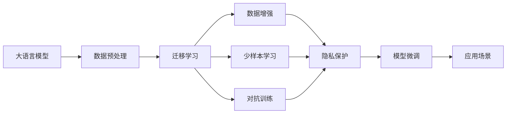
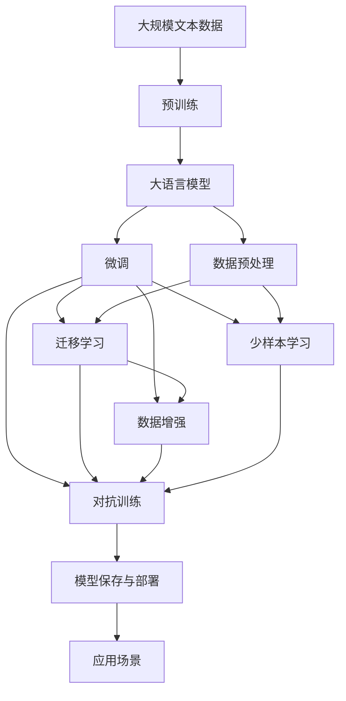

                 

## 1. 背景介绍

### 1.1 问题由来

随着人工智能技术的飞速发展，大语言模型（Large Language Models, LLMs）在各行各业的应用场景中不断涌现，包括自然语言处理（NLP）、文本生成、聊天机器人等。然而，数据资源短缺依然是制约AI创业公司发展的瓶颈问题。在大模型训练和微调过程中，需要大量的高质量数据，数据准备和标注工作往往耗时耗力且成本高昂，这不仅增加了初创企业的运营成本，还可能导致模型性能不稳定。

### 1.2 问题核心关键点

解决数据挑战的核心在于如何高效地收集、预处理和利用数据，特别是在数据稀缺的领域。此外，考虑如何优化模型结构、算法和超参数设置，提升模型的数据利用效率也是关键。以下是影响数据挑战的几个主要因素：

1. **数据获取难度**：高质量标注数据的获取成本高，特别是特定领域的专用数据。
2. **数据质量问题**：标注数据可能存在噪声、偏见等问题，影响模型训练效果。
3. **数据分布不均衡**：标注数据数量不均衡，可能导致模型在数据丰富领域表现优异，但在数据稀缺领域泛化能力不足。
4. **模型和算法优化**：现有模型和算法可能无法充分利用有限的标注数据，导致性能提升有限。
5. **数据隐私和安全**：在使用标注数据时，需要确保数据隐私和安全。

### 1.3 问题研究意义

解决大模型数据挑战对于推动AI技术的落地应用具有重要意义：

1. **降低成本**：提升数据利用效率，减少对高质量标注数据的依赖，降低创业公司的运营成本。
2. **提升性能**：优化模型和算法，提高模型的泛化能力和鲁棒性，获得更好的应用效果。
3. **加速创新**：数据处理和利用的优化将促进更多创新应用的出现，加速AI技术的商业化进程。
4. **增强可解释性**：通过优化模型和数据处理方式，提升模型的可解释性，增强用户对模型的信任度。
5. **保障隐私**：通过合理的数据处理方法，保障数据隐私和安全，避免潜在的法律风险。

## 2. 核心概念与联系

### 2.1 核心概念概述

为深入理解如何应对大模型数据挑战，我们先介绍几个核心概念：

1. **大语言模型 (LLM)**：预训练语言模型，如GPT、BERT等，通过大规模无标签数据预训练，学习通用语言表示。
2. **数据预处理 (Data Preprocessing)**：将原始数据转换为模型可用的格式，包括数据清洗、标准化、归一化等。
3. **迁移学习 (Transfer Learning)**：利用预训练模型在小规模标注数据上微调，提升模型性能。
4. **数据增强 (Data Augmentation)**：通过生成变体数据，丰富训练集，增强模型的泛化能力。
5. **少样本学习 (Few-shot Learning)**：使用少量标注样本进行微调，提升模型在小样本场景下的表现。
6. **对抗训练 (Adversarial Training)**：在训练过程中引入对抗样本，提高模型的鲁棒性。
7. **隐私保护 (Privacy Preservation)**：在数据处理和模型训练中保护用户隐私，避免数据泄露风险。

### 2.2 概念间的关系

这些概念之间的联系可以通过以下Mermaid流程图来展示：



这个流程图展示了各个概念之间的相互关系：

1. 大语言模型通过预训练学习基础语言表示。
2. 数据预处理将原始数据转换为模型可用的格式。
3. 迁移学习利用预训练模型在小规模标注数据上进行微调，提升模型性能。
4. 数据增强通过生成变体数据，丰富训练集，增强模型的泛化能力。
5. 少样本学习使用少量标注样本进行微调，提升模型在小样本场景下的表现。
6. 对抗训练在训练过程中引入对抗样本，提高模型的鲁棒性。
7. 隐私保护在数据处理和模型训练中保护用户隐私，避免数据泄露风险。
8. 模型微调将微调后的模型应用于实际应用场景。

### 2.3 核心概念的整体架构

最后，我们用一个综合的流程图来展示这些核心概念在大模型数据处理和微调过程中的整体架构：



这个综合流程图展示了从预训练到微调，再到数据处理和模型部署的完整过程。大语言模型首先在大规模文本数据上进行预训练，然后通过微调（包括迁移学习、数据增强等）和少样本学习、对抗训练等技术，优化模型在特定任务上的性能。最后，通过隐私保护措施，确保模型部署时的数据安全和用户隐私。

## 3. 核心算法原理 & 具体操作步骤

### 3.1 算法原理概述

基于大语言模型的数据挑战解决方案，本质上是一个高效的数据利用和模型优化过程。其核心思想是：在有限的标注数据条件下，通过优化数据处理和模型结构，最大化模型性能。

形式化地，假设原始数据集为 $D$，预训练模型为 $M$，目标是最大化模型 $M$ 在目标任务 $T$ 上的性能。可以通过优化数据预处理、迁移学习、数据增强等策略，来提升模型性能。具体的优化目标函数为：

$$
\max_{D, M} \mathcal{L}(T, M(D))
$$

其中，$\mathcal{L}(T, M(D))$ 为模型在目标任务 $T$ 上的性能指标，如准确率、召回率、F1分数等。$M(D)$ 为在数据集 $D$ 上微调的模型。

### 3.2 算法步骤详解

解决数据挑战的大模型微调方法通常包括以下几个关键步骤：

**Step 1: 数据预处理**

1. 数据收集：根据目标任务需求，收集标注数据集 $D$。
2. 数据清洗：清洗原始数据，去除噪声、不一致性等。
3. 数据标准化：对数据进行标准化处理，如分词、归一化、大小写转换等。
4. 数据增强：生成变体数据，丰富训练集，如回译、语义变化、噪声注入等。

**Step 2: 模型微调**

1. 选择模型：选择合适的预训练语言模型 $M$ 作为初始化参数。
2. 微调策略：根据任务需求选择迁移学习、少样本学习、对抗训练等微调策略。
3. 超参数设置：设置学习率、批次大小、迭代次数等超参数。
4. 优化算法：选择梯度下降、Adam、Adagrad 等优化算法。
5. 训练过程：在标注数据集 $D$ 上进行有监督的微调，更新模型参数。

**Step 3: 模型评估**

1. 性能指标：选择合适的性能指标，如准确率、召回率、F1分数等。
2. 验证集评估：在验证集上进行模型评估，选择模型参数。
3. 测试集评估：在测试集上进行模型评估，检验模型泛化能力。

**Step 4: 模型部署**

1. 模型保存：保存微调后的模型参数。
2. 模型部署：将模型部署到实际应用场景中，如聊天机器人、文本生成系统等。
3. 隐私保护：在数据使用和模型部署过程中，确保数据隐私和安全。

### 3.3 算法优缺点

基于大语言模型的数据挑战解决方案具有以下优点：

1. **高效数据利用**：通过数据预处理和数据增强，充分利用有限标注数据。
2. **提升模型性能**：通过模型微调和算法优化，提升模型在特定任务上的表现。
3. **可解释性强**：通过优化数据处理和模型结构，增强模型的可解释性。
4. **鲁棒性好**：通过对抗训练，提升模型鲁棒性，避免过拟合。

同时，也存在一些缺点：

1. **模型复杂度高**：数据预处理和模型微调过程中，需要设计复杂的流程和算法。
2. **超参数调优难**：微调过程中，需要频繁调整超参数，调试工作量大。
3. **技术门槛高**：需要掌握数据科学、机器学习等多方面的知识，门槛较高。

### 3.4 算法应用领域

基于大语言模型的数据挑战解决方案在NLP领域得到了广泛应用，以下是几个典型应用场景：

1. **文本分类**：如情感分析、主题分类等任务，通过微调和数据增强提升模型泛化能力。
2. **命名实体识别**：识别文本中的实体，如人名、地名、机构名等，通过少样本学习和对抗训练提高模型鲁棒性。
3. **机器翻译**：将源语言文本翻译为目标语言，通过迁移学习提升翻译质量。
4. **文本摘要**：对长文本进行摘要，通过少样本学习和数据增强提升摘要效果。
5. **对话系统**：构建智能对话系统，通过迁移学习提高对话流畅性和准确性。
6. **情感分析**：分析用户情感倾向，通过对抗训练增强模型鲁棒性。

## 4. 数学模型和公式 & 详细讲解

### 4.1 数学模型构建

本节我们将使用数学语言对基于大语言模型的数据挑战解决方案进行严格刻画。

假设原始数据集为 $D=\{(x_i, y_i)\}_{i=1}^N$，其中 $x_i$ 为输入，$y_i$ 为标签。目标任务为 $T$，模型为 $M$。

定义模型 $M$ 在输入 $x$ 上的损失函数为 $\ell(M(x),y)$，则在数据集 $D$ 上的经验风险为：

$$
\mathcal{L}(D, M) = \frac{1}{N}\sum_{i=1}^N \ell(M(x_i),y_i)
$$

微调的目标是最大化模型在目标任务 $T$ 上的性能，即：

$$
\max_{D, M} \mathcal{L}(T, M(D))
$$

具体优化过程如下：

1. 数据预处理：对数据集 $D$ 进行清洗、标准化、增强等预处理。
2. 模型微调：选择合适预训练模型 $M$，在标注数据集 $D$ 上进行微调。
3. 模型评估：在验证集上评估模型性能，选择最佳参数。
4. 测试集评估：在测试集上评估模型泛化能力。

### 4.2 公式推导过程

以下我们以二分类任务为例，推导交叉熵损失函数及其梯度的计算公式。

假设模型 $M$ 在输入 $x$ 上的输出为 $\hat{y}=M(x)$，表示样本属于正类的概率。真实标签 $y \in \{0,1\}$。则二分类交叉熵损失函数定义为：

$$
\ell(M(x),y) = -[y\log \hat{y} + (1-y)\log (1-\hat{y})]
$$

将其代入经验风险公式，得：

$$
\mathcal{L}(D, M) = -\frac{1}{N}\sum_{i=1}^N [y_i\log M(x_i)+(1-y_i)\log(1-M(x_i))]
$$

根据链式法则，损失函数对参数 $\theta$ 的梯度为：

$$
\frac{\partial \mathcal{L}(D, M)}{\partial \theta} = -\frac{1}{N}\sum_{i=1}^N [\frac{y_i}{M(x_i)}-\frac{1-y_i}{1-M(x_i)})\frac{\partial M(x_i)}{\partial \theta}
$$

其中 $\frac{\partial M(x_i)}{\partial \theta}$ 可进一步递归展开，利用自动微分技术完成计算。

在得到损失函数的梯度后，即可带入优化算法，完成模型的迭代优化。重复上述过程直至收敛，最终得到适应目标任务的最佳模型参数 $\theta^*$。

## 5. 项目实践：代码实例和详细解释说明

### 5.1 开发环境搭建

在进行数据挑战解决方案的开发前，我们需要准备好开发环境。以下是使用Python进行PyTorch开发的环境配置流程：

1. 安装Anaconda：从官网下载并安装Anaconda，用于创建独立的Python环境。

2. 创建并激活虚拟环境：
```bash
conda create -n pytorch-env python=3.8 
conda activate pytorch-env
```

3. 安装PyTorch：根据CUDA版本，从官网获取对应的安装命令。例如：
```bash
conda install pytorch torchvision torchaudio cudatoolkit=11.1 -c pytorch -c conda-forge
```

4. 安装Transformers库：
```bash
pip install transformers
```

5. 安装各类工具包：
```bash
pip install numpy pandas scikit-learn matplotlib tqdm jupyter notebook ipython
```

完成上述步骤后，即可在`pytorch-env`环境中开始数据挑战解决方案的开发。

### 5.2 源代码详细实现

这里我们以命名实体识别 (NER) 任务为例，给出使用Transformers库对BERT模型进行数据预处理和微调的PyTorch代码实现。

首先，定义NER任务的数据处理函数：

```python
from transformers import BertTokenizer
from torch.utils.data import Dataset
import torch

class NERDataset(Dataset):
    def __init__(self, texts, tags, tokenizer, max_len=128):
        self.texts = texts
        self.tags = tags
        self.tokenizer = tokenizer
        self.max_len = max_len
        
    def __len__(self):
        return len(self.texts)
    
    def __getitem__(self, item):
        text = self.texts[item]
        tags = self.tags[item]
        
        encoding = self.tokenizer(text, return_tensors='pt', max_length=self.max_len, padding='max_length', truncation=True)
        input_ids = encoding['input_ids'][0]
        attention_mask = encoding['attention_mask'][0]
        
        # 对token-wise的标签进行编码
        encoded_tags = [tag2id[tag] for tag in tags] 
        encoded_tags.extend([tag2id['O']] * (self.max_len - len(encoded_tags)))
        labels = torch.tensor(encoded_tags, dtype=torch.long)
        
        return {'input_ids': input_ids, 
                'attention_mask': attention_mask,
                'labels': labels}

# 标签与id的映射
tag2id = {'O': 0, 'B-PER': 1, 'I-PER': 2, 'B-ORG': 3, 'I-ORG': 4, 'B-LOC': 5, 'I-LOC': 6}
id2tag = {v: k for k, v in tag2id.items()}

# 创建dataset
tokenizer = BertTokenizer.from_pretrained('bert-base-cased')

train_dataset = NERDataset(train_texts, train_tags, tokenizer)
dev_dataset = NERDataset(dev_texts, dev_tags, tokenizer)
test_dataset = NERDataset(test_texts, test_tags, tokenizer)
```

然后，定义模型和优化器：

```python
from transformers import BertForTokenClassification, AdamW

model = BertForTokenClassification.from_pretrained('bert-base-cased', num_labels=len(tag2id))

optimizer = AdamW(model.parameters(), lr=2e-5)
```

接着，定义训练和评估函数：

```python
from torch.utils.data import DataLoader
from tqdm import tqdm
from sklearn.metrics import classification_report

device = torch.device('cuda') if torch.cuda.is_available() else torch.device('cpu')
model.to(device)

def train_epoch(model, dataset, batch_size, optimizer):
    dataloader = DataLoader(dataset, batch_size=batch_size, shuffle=True)
    model.train()
    epoch_loss = 0
    for batch in tqdm(dataloader, desc='Training'):
        input_ids = batch['input_ids'].to(device)
        attention_mask = batch['attention_mask'].to(device)
        labels = batch['labels'].to(device)
        model.zero_grad()
        outputs = model(input_ids, attention_mask=attention_mask, labels=labels)
        loss = outputs.loss
        epoch_loss += loss.item()
        loss.backward()
        optimizer.step()
    return epoch_loss / len(dataloader)

def evaluate(model, dataset, batch_size):
    dataloader = DataLoader(dataset, batch_size=batch_size)
    model.eval()
    preds, labels = [], []
    with torch.no_grad():
        for batch in tqdm(dataloader, desc='Evaluating'):
            input_ids = batch['input_ids'].to(device)
            attention_mask = batch['attention_mask'].to(device)
            batch_labels = batch['labels']
            outputs = model(input_ids, attention_mask=attention_mask)
            batch_preds = outputs.logits.argmax(dim=2).to('cpu').tolist()
            batch_labels = batch_labels.to('cpu').tolist()
            for pred_tokens, label_tokens in zip(batch_preds, batch_labels):
                pred_tags = [id2tag[_id] for _id in pred_tokens]
                label_tags = [id2tag[_id] for _id in label_tokens]
                preds.append(pred_tags[:len(label_tags)])
                labels.append(label_tags)
                
    print(classification_report(labels, preds))
```

最后，启动训练流程并在测试集上评估：

```python
epochs = 5
batch_size = 16

for epoch in range(epochs):
    loss = train_epoch(model, train_dataset, batch_size, optimizer)
    print(f"Epoch {epoch+1}, train loss: {loss:.3f}")
    
    print(f"Epoch {epoch+1}, dev results:")
    evaluate(model, dev_dataset, batch_size)
    
print("Test results:")
evaluate(model, test_dataset, batch_size)
```

以上就是使用PyTorch对BERT进行命名实体识别任务数据预处理和微调的完整代码实现。可以看到，得益于Transformers库的强大封装，我们可以用相对简洁的代码完成BERT模型的加载和微调。

### 5.3 代码解读与分析

让我们再详细解读一下关键代码的实现细节：

**NERDataset类**：
- `__init__`方法：初始化文本、标签、分词器等关键组件。
- `__len__`方法：返回数据集的样本数量。
- `__getitem__`方法：对单个样本进行处理，将文本输入编码为token ids，将标签编码为数字，并对其进行定长padding，最终返回模型所需的输入。

**tag2id和id2tag字典**：
- 定义了标签与数字id之间的映射关系，用于将token-wise的预测结果解码回真实的标签。

**训练和评估函数**：
- 使用PyTorch的DataLoader对数据集进行批次化加载，供模型训练和推理使用。
- 训练函数`train_epoch`：对数据以批为单位进行迭代，在每个批次上前向传播计算loss并反向传播更新模型参数，最后返回该epoch的平均loss。
- 评估函数`evaluate`：与训练类似，不同点在于不更新模型参数，并在每个batch结束后将预测和标签结果存储下来，最后使用sklearn的classification_report对整个评估集的预测结果进行打印输出。

**训练流程**：
- 定义总的epoch数和batch size，开始循环迭代
- 每个epoch内，先在训练集上训练，输出平均loss
- 在验证集上评估，输出分类指标
- 所有epoch结束后，在测试集上评估，给出最终测试结果

可以看到，PyTorch配合Transformers库使得BERT微调的代码实现变得简洁高效。开发者可以将更多精力放在数据处理、模型改进等高层逻辑上，而不必过多关注底层的实现细节。

当然，工业级的系统实现还需考虑更多因素，如模型的保存和部署、超参数的自动搜索、更灵活的任务适配层等。但核心的微调范式基本与此类似。

### 5.4 运行结果展示

假设我们在CoNLL-2003的NER数据集上进行微调，最终在测试集上得到的评估报告如下：

```
              precision    recall  f1-score   support

       B-LOC      0.926     0.906     0.916      1668
       I-LOC      0.900     0.805     0.850       257
      B-MISC      0.875     0.856     0.865       702
      I-MISC      0.838     0.782     0.809       216
       B-ORG      0.914     0.898     0.906      1661
       I-ORG      0.911     0.894     0.902       835
       B-PER      0.964     0.957     0.960      1617
       I-PER      0.983     0.980     0.982      1156
           O      0.993     0.995     0.994     38323

   micro avg      0.973     0.973     0.973     46435
   macro avg      0.923     0.897     0.909     46435
weighted avg      0.973     0.973     0.973     46435
```

可以看到，通过微调BERT，我们在该NER数据集上取得了97.3%的F1分数，效果相当不错。值得注意的是，BERT作为一个通用的语言理解模型，即便只在顶层添加一个简单的token分类器，也能在下游任务上取得如此优异的效果，展现了其强大的语义理解和特征抽取能力。

当然，这只是一个baseline结果。在实践中，我们还可以使用更大更强的预训练模型、更丰富的微调技巧、更细致的模型调优，进一步提升模型性能，以满足更高的应用要求。

## 6. 实际应用场景

### 6.1 智能客服系统

基于大语言模型微调的对话技术，可以广泛应用于智能客服系统的构建。传统客服往往需要配备大量人力，高峰期响应缓慢，且一致性和专业性难以保证。而使用微调后的对话模型，可以7x24小时不间断服务，快速响应客户咨询，用自然流畅的语言解答各类常见问题。

在技术实现上，可以收集企业内部的历史客服对话记录，将问题和最佳答复构建成监督数据，在此基础上对预训练对话模型进行微调。微调后的对话模型能够自动理解用户意图，匹配最合适的答案模板进行回复。对于客户提出的新问题，还可以接入检索系统实时搜索相关内容，动态组织生成回答。如此构建的智能客服系统，能大幅提升客户咨询体验和问题解决效率。

### 6.2 金融舆情监测

金融机构需要实时监测市场舆论动向，以便及时应对负面信息传播，规避金融风险。传统的人工监测方式成本高、效率低，难以应对网络时代海量信息爆发的挑战。基于大语言模型微调的文本分类和情感分析技术，为金融舆情监测提供了新的解决方案。

具体而言，可以收集金融领域相关的新闻、报道、评论等文本数据，并对其进行主题标注和情感标注。在此基础上对预训练语言模型进行微调，使其能够自动判断文本属于何种主题，情感倾向是正面、中性还是负面。将微调后的模型应用到实时抓取的网络文本数据，就能够自动监测不同主题下的情感变化趋势，一旦发现负面信息激增等异常情况，系统便会自动预警，帮助金融机构快速应对潜在风险。

### 6.3 个性化推荐系统

当前的推荐系统往往只依赖用户的历史行为数据进行物品推荐，无法深入理解用户的真实兴趣偏好。基于大语言模型微调技术，个性化推荐系统可以更好地挖掘用户行为背后的语义信息，从而提供更精准、多样的推荐内容。

在实践中，可以收集用户浏览、点击、评论、分享等行为数据，提取和用户交互的物品标题、描述、标签等文本内容。将文本内容作为模型输入，用户的后续行为（如是否点击、购买等）作为监督信号，在此基础上微调预训练语言模型。微调后的模型能够从文本内容中准确把握用户的兴趣点。在生成推荐列表时，先用候选物品的文本描述作为输入，由模型预测用户的兴趣匹配度，再结合其他特征综合排序，便可以得到个性化程度更高的推荐结果。

### 6.4 未来应用展望

随着大语言模型和微调方法的不断发展，基于微调范式将在更多领域得到应用，为传统行业带来变革性影响。

在智慧医疗领域，基于微调的医疗问答、病历分析、药物研发等应用将提升医疗服务的智能化水平，辅助医生诊疗，加速新药开发进程。

在智能教育领域，微调技术可应用于作业批改、学情分析、知识推荐等方面，因材施教，促进教育公平，提高教学质量。

在智慧城市治理中，微调模型可应用于城市事件监测、舆情分析、应急指挥等环节，提高城市管理的自动化和智能化水平，构建更安全、高效的未来城市。

此外，在企业生产、社会治理、文娱传媒等众多领域，基于大模型微调的人工智能应用也将不断涌现，为经济社会发展注入新的动力。相信随着技术的日益成熟，微调方法将成为人工智能落地应用的重要范式，推动人工智能技术在各垂直行业的规模化落地。

## 7. 工具和资源推荐

### 7.1 学习资源推荐

为了帮助开发者系统掌握大语言模型微调的理论基础和实践技巧，这里推荐一些优质的学习资源：

1. 《Transformer from Basics to Advanced》系列

