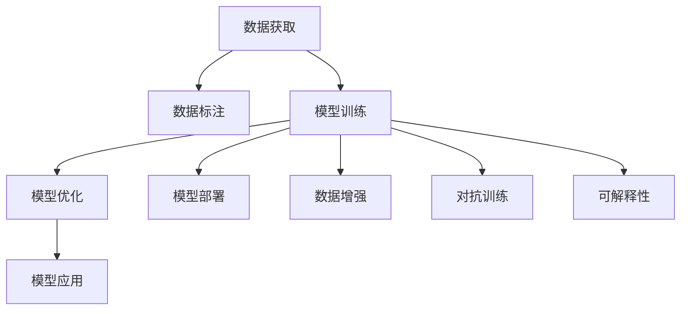

                 

## 1. 背景介绍

### 1.1 问题由来
随着人工智能技术的飞速发展，AI大模型（Large AI Models）在多个领域展现了卓越的性能，包括自然语言处理（NLP）、计算机视觉（CV）、语音识别等。比如，GPT-3、BERT、DALL-E等模型在特定任务上取得了前所未有的成绩。这些大模型的涌现，不仅推动了学术研究的前沿，也引发了广泛的市场应用和创业浪潮。

然而，大模型的研发和部署涉及大量的资源投入，包括数据标注、硬件设施和专业人才。加之模型训练和推理的成本高昂，导致其应用门槛较高，商业化过程充满挑战。因此，如何高效、低成本地构建AI大模型，实现商业化应用，成为当前AI创业和产业发展亟需解决的问题。

### 1.2 问题核心关键点
1. **数据获取与标注**：AI大模型的训练需要大量标注数据，这对于小公司来说成本较高且耗时较长。
2. **硬件资源需求**：大模型的训练和推理需要高性能GPU或TPU等硬件设施，这对初创企业是一大挑战。
3. **算法和模型复杂度**：大模型的算法和模型结构复杂，需要深厚的技术积累和持续的优化。
4. **商业化路径**：如何将大模型的技术和应用落地到实际业务中，创造商业价值。
5. **市场竞争**：众多AI创业公司竞相研发和部署大模型，如何在竞争中突围。

### 1.3 问题研究意义
AI大模型创业不仅仅是技术问题，更是商业模式和市场竞争的挑战。对于AI创业者而言，抓住机遇，构建具有竞争力的AI大模型，是实现商业成功和产业升级的关键。

1. **技术创新**：通过技术创新，提高模型的准确性、效率和可扩展性。
2. **降低成本**：降低模型研发和运营成本，提高性价比，拓展市场覆盖。
3. **应用落地**：推动模型在垂直行业的应用，创造实际商业价值。
4. **市场竞争**：在激烈的市场竞争中占据有利位置，获得客户认可和市场份额。
5. **社会价值**：通过技术手段解决社会问题，提升公共服务的智能化水平。

## 2. 核心概念与联系

### 2.1 核心概念概述
1. **AI大模型**：指具有强大计算能力和丰富知识储备的深度学习模型，包括文本、图像、语音等多个模态。如GPT-3、BERT、DALL-E等。
2. **迁移学习**：指通过预训练和微调的方式，在大模型上加载特定任务的知识，提高模型的泛化能力和应用效率。
3. **数据增强**：通过数据扩充和生成，增加训练样本多样性，提升模型性能。
4. **对抗训练**：在训练过程中加入对抗样本，提高模型的鲁棒性和泛化能力。
5. **可解释性**：提高模型的可解释性，便于用户理解和调试，减少不确定性。

### 2.2 概念间的关系

大模型的应用，涉及从数据获取、模型训练、优化、部署到应用的各个环节。这些环节环环相扣，共同决定了模型的性能和效果。以下是一个综合性的Mermaid流程图，展示了核心概念之间的联系：



这个流程图展示了从数据到应用的全流程，每个环节的优化和改进，都对最终模型的性能有重要影响。

## 3. 核心算法原理 & 具体操作步骤

### 3.1 算法原理概述

AI大模型的核心算法原理，可以归结为以下几个关键点：

1. **深度学习模型**：使用深度神经网络，通过多层次的抽象和特征提取，实现对复杂问题的建模。
2. **预训练和微调**：在大规模无标签数据上预训练模型，通过少量有标签数据进行微调，适配特定任务。
3. **迁移学习**：利用预训练模型的知识，在新任务上进行微调，减少从头训练的时间和成本。
4. **数据增强和对抗训练**：通过数据增强和对抗训练，提升模型的鲁棒性和泛化能力。
5. **可解释性**：通过可解释性方法，提高模型的透明度，便于用户理解和调试。

### 3.2 算法步骤详解

AI大模型的创建和应用，通常包括以下关键步骤：

**Step 1: 数据获取与标注**

1. **数据来源**：获取包含目标任务所需的数据。数据可以是文本、图像、音频等多种形式。
2. **数据标注**：对数据进行标注，生成训练所需的标注数据集。标注数据集的大小和质量，对模型性能有重要影响。

**Step 2: 模型选择与初始化**

1. **模型选择**：根据任务需求选择合适的预训练模型。常见模型包括BERT、GPT、DALL-E等。
2. **模型初始化**：将预训练模型加载到系统中，并进行必要的参数初始化。

**Step 3: 数据增强与预训练**

1. **数据增强**：通过数据扩充、数据生成等方式，增加训练样本的多样性。例如，对于文本数据，可以采用回译、同义词替换等方法。
2. **预训练**：在无标签数据上，对模型进行预训练。预训练可以加速模型的收敛和泛化能力。

**Step 4: 微调与优化**

1. **微调**：在预训练模型的基础上，通过有标签数据进行微调，适配特定任务。微调过程中，可以采用AdamW、SGD等优化算法，设置合适的学习率。
2. **优化**：通过正则化、Dropout、Early Stopping等方法，防止模型过拟合，提高泛化能力。

**Step 5: 模型部署与评估**

1. **模型部署**：将微调后的模型部署到实际应用中，进行推理和预测。
2. **性能评估**：在测试数据上评估模型的性能，判断其是否达到预期效果。

### 3.3 算法优缺点

AI大模型具有以下优点：

1. **泛化能力强**：通过预训练和微调，模型能够泛化到不同任务和数据集。
2. **效率高**：模型训练和推理速度快，适用于大规模数据处理和实时应用。
3. **应用广**：模型可以应用于多个垂直领域，解决多种实际问题。

然而，也存在一些缺点：

1. **依赖数据**：模型训练和微调依赖大量的标注数据，数据获取成本较高。
2. **资源需求高**：模型训练和推理需要高性能硬件设施，初创企业难以负担。
3. **算法复杂**：模型的设计和优化需要深厚的技术积累和持续的研究。
4. **可解释性差**：模型往往是"黑盒"，缺乏透明度，难以理解和调试。

### 3.4 算法应用领域

AI大模型已经在多个领域得到了广泛应用，如自然语言处理（NLP）、计算机视觉（CV）、语音识别等。以下是一些典型的应用场景：

1. **自然语言处理**：包括文本分类、命名实体识别、机器翻译、对话系统等。
2. **计算机视觉**：包括图像分类、目标检测、图像生成等。
3. **语音识别**：包括语音识别、语音合成等。
4. **推荐系统**：包括商品推荐、内容推荐等。
5. **医疗健康**：包括医学影像分析、疾病诊断等。
6. **金融服务**：包括信用评估、风险管理等。

## 4. 数学模型和公式 & 详细讲解  
### 4.1 数学模型构建

假设有一个通用的AI大模型 $M_{\theta}$，其中 $\theta$ 为模型参数。假设目标任务为二分类任务，训练数据集为 $\{(x_i, y_i)\}_{i=1}^N$，其中 $x_i$ 为输入数据，$y_i \in \{0, 1\}$ 为标签。定义模型在数据集上的损失函数为 $\ell(M_{\theta}, D)$，平均损失函数为 $\mathcal{L}(\theta)$。

损失函数通常采用交叉熵损失函数：

$$
\ell(M_{\theta}(x), y) = -y \log M_{\theta}(x) - (1 - y) \log (1 - M_{\theta}(x))
$$

平均损失函数为：

$$
\mathcal{L}(\theta) = \frac{1}{N} \sum_{i=1}^N \ell(M_{\theta}(x_i), y_i)
$$

### 4.2 公式推导过程

以二分类任务为例，计算模型在单个样本 $(x_i, y_i)$ 上的损失函数 $\ell$：

$$
\ell(M_{\theta}(x), y) = -y \log M_{\theta}(x) - (1 - y) \log (1 - M_{\theta}(x))
$$

将损失函数代入平均损失函数，得到：

$$
\mathcal{L}(\theta) = \frac{1}{N} \sum_{i=1}^N [-y_i \log M_{\theta}(x_i) - (1 - y_i) \log (1 - M_{\theta}(x_i))]
$$

使用随机梯度下降（SGD）算法更新模型参数 $\theta$：

$$
\theta \leftarrow \theta - \eta \nabla_{\theta}\mathcal{L}(\theta)
$$

其中 $\eta$ 为学习率，$\nabla_{\theta}\mathcal{L}(\theta)$ 为损失函数对参数 $\theta$ 的梯度。

### 4.3 案例分析与讲解

以文本分类任务为例，使用BERT模型进行微调。假设有一个新闻分类任务，新闻文本数据集为 $D=\{(x_i, y_i)\}_{i=1}^N$，其中 $x_i$ 为新闻文本，$y_i \in \{0, 1\}$ 为新闻类别。

1. **数据准备**：将新闻文本数据集分为训练集、验证集和测试集，分别进行数据增强和预处理。
2. **模型选择**：选择BERT模型作为预训练模型，并根据任务需求设计任务适配层。
3. **微调过程**：使用训练集数据对BERT模型进行微调，调整顶层分类器参数，学习新闻分类的知识。
4. **性能评估**：在验证集和测试集上评估模型性能，判断微调效果。

## 5. 项目实践：代码实例和详细解释说明

### 5.1 开发环境搭建

为了构建和部署AI大模型，需要搭建一个具备高性能计算和数据存储能力的开发环境。以下是一些推荐的步骤：

1. **安装Python**：选择最新版本的Python，并创建虚拟环境。
2. **安装依赖库**：安装TensorFlow、PyTorch、transformers等深度学习框架和工具库。
3. **搭建服务器**：选择合适的服务器或云平台，部署计算资源。
4. **配置数据存储**：搭建数据存储系统，如HDFS、S3等，存储和访问数据。

### 5.2 源代码详细实现

以下是一个使用PyTorch和transformers库构建和微调BERT模型的示例代码：

```python
import torch
import torch.nn as nn
import torch.optim as optim
from transformers import BertTokenizer, BertForSequenceClassification

# 数据准备
tokenizer = BertTokenizer.from_pretrained('bert-base-uncased')
train_data = ...
train_labels = ...
val_data = ...
val_labels = ...
test_data = ...
test_labels = ...

# 模型定义
model = BertForSequenceClassification.from_pretrained('bert-base-uncased', num_labels=2)

# 模型训练
model.train()
optimizer = optim.Adam(model.parameters(), lr=2e-5)
for epoch in range(epochs):
    for i, (inputs, labels) in enumerate(train_data):
        optimizer.zero_grad()
        outputs = model(inputs)
        loss = outputs.loss
        loss.backward()
        optimizer.step()
```

### 5.3 代码解读与分析

1. **数据准备**：使用BERT自带的分词器进行文本数据预处理，生成token序列。
2. **模型定义**：选择预训练的BERT模型，并根据任务需求定义任务适配层。
3. **模型训练**：使用随机梯度下降算法进行模型训练，调整分类器参数。
4. **性能评估**：在验证集和测试集上评估模型性能，并调整超参数。

### 5.4 运行结果展示

使用上述代码进行训练后，可以在验证集和测试集上评估模型性能。例如，使用F1分数来评估文本分类任务的性能：

```python
from sklearn.metrics import f1_score

# 评估模型
def evaluate(model, data, labels):
    model.eval()
    preds = model(data).predict_proba()[:, 1]
    f1 = f1_score(labels, preds.round().astype(int))
    return f1

# 验证集评估
f1_val = evaluate(model, val_data, val_labels)
print(f'F1 score on validation set: {f1_val}')

# 测试集评估
f1_test = evaluate(model, test_data, test_labels)
print(f'F1 score on test set: {f1_test}')
```

## 6. 实际应用场景

### 6.1 智能客服系统

智能客服系统通过AI大模型进行自然语言理解，实现人机对话。以下是一个实际应用案例：

1. **数据准备**：收集客户咨询记录，标注问题和答案。
2. **模型训练**：使用BERT等大模型进行预训练和微调，适配客户咨询场景。
3. **系统部署**：将微调后的模型部署到客服系统中，实现自动回复功能。

### 6.2 金融舆情监测

金融舆情监测系统通过AI大模型进行文本分类和情感分析，实时监测市场舆情。以下是一个实际应用案例：

1. **数据准备**：收集金融领域的新闻、评论等文本数据，并标注情感和主题。
2. **模型训练**：使用BERT等大模型进行预训练和微调，适配情感分析和主题分类任务。
3. **系统部署**：将微调后的模型部署到舆情监测系统中，实时监控市场舆情。

### 6.3 个性化推荐系统

个性化推荐系统通过AI大模型进行用户行为分析，实现商品推荐。以下是一个实际应用案例：

1. **数据准备**：收集用户浏览、点击等行为数据，并标注用户喜好。
2. **模型训练**：使用BERT等大模型进行预训练和微调，适配推荐系统任务。
3. **系统部署**：将微调后的模型部署到推荐系统中，实现个性化推荐功能。

### 6.4 未来应用展望

未来，AI大模型将在更多领域得到应用，以下是一些潜在的应用方向：

1. **智慧医疗**：通过AI大模型进行医学影像分析和疾病诊断，提升医疗服务水平。
2. **智能教育**：通过AI大模型进行学生行为分析和智能推荐，提升教育质量。
3. **智慧城市**：通过AI大模型进行城市事件监测和舆情分析，提升城市治理水平。
4. **智能制造**：通过AI大模型进行生产流程优化和设备维护，提升生产效率。
5. **农业智能化**：通过AI大模型进行农情监测和病虫害预测，提升农业生产水平。

## 7. 工具和资源推荐

### 7.1 学习资源推荐

为了系统掌握AI大模型的构建和应用，以下是一些推荐的学习资源：

1. **《深度学习》课程**：斯坦福大学的深度学习课程，涵盖了深度学习的基本原理和应用。
2. **《Transformer》论文**：Transformer模型的原始论文，介绍了Transformer的原理和应用。
3. **《动手学深度学习》书籍**：动手学深度学习平台，提供丰富的深度学习实践案例。
4. **《Python深度学习》书籍**：针对Python深度学习的入门书籍，包含大量实用案例。
5. **arXiv预印本**：人工智能领域的最新研究论文，涵盖多个领域的深度学习应用。

### 7.2 开发工具推荐

以下是一些推荐用于AI大模型构建和应用开发的工具：

1. **PyTorch**：深度学习框架，支持GPU加速和动态计算图。
2. **TensorFlow**：深度学习框架，支持分布式计算和模型部署。
3. **HuggingFace Transformers**：深度学习工具库，包含大量预训练模型和微调样例。
4. **TensorBoard**：可视化工具，监控模型训练和推理过程。
5. **Weights & Biases**：实验跟踪工具，记录和可视化模型训练指标。

### 7.3 相关论文推荐

以下是一些推荐阅读的AI大模型相关论文：

1. **Attention is All You Need**：Transformer模型的原始论文，介绍了Transformer的原理和应用。
2. **BERT: Pre-training of Deep Bidirectional Transformers for Language Understanding**：BERT模型的原始论文，介绍了BERT的预训练和微调方法。
3. **GPT-3**：GPT-3模型的论文，介绍了GPT-3的预训练和微调方法。
4. **DALL-E**：DALL-E模型的论文，介绍了DALL-E的预训练和图像生成方法。
5. **BERT-NC**：针对中文的BERT模型，介绍了中文BERT的预训练和微调方法。

## 8. 总结：未来发展趋势与挑战

### 8.1 研究成果总结

AI大模型已经在多个领域展示了卓越的性能和广泛的应用前景，但其构建和应用也面临诸多挑战。本节将总结这些研究成果，并展望未来发展趋势。

1. **技术突破**：通过技术创新，提升模型性能和效率，降低成本，拓展应用范围。
2. **应用场景**：通过AI大模型解决实际问题，创造商业价值，推动行业智能化转型。
3. **市场竞争**：在激烈的市场竞争中，构建具有竞争力的AI大模型，获得客户认可和市场份额。

### 8.2 未来发展趋势

未来，AI大模型将呈现以下几个发展趋势：

1. **规模化应用**：AI大模型将在更多垂直领域得到应用，解决复杂问题。
2. **跨领域融合**：AI大模型将与知识图谱、规则库等外部知识结合，提升信息整合能力。
3. **可解释性增强**：提高模型的可解释性，增强用户信任和系统可靠性。
4. **持续学习**：通过持续学习，提高模型的适应性和鲁棒性，应对数据分布变化。
5. **多模态融合**：融合视觉、语音等多种模态，提升模型的感知能力和应用场景。

### 8.3 面临的挑战

尽管AI大模型带来了许多机遇，但也面临诸多挑战：

1. **数据获取和标注**：数据获取和标注成本高，数据质量和多样性不足。
2. **计算资源需求**：模型训练和推理需要高性能硬件，初创企业难以负担。
3. **算法复杂度**：模型的设计和优化需要深厚的技术积累和持续的研究。
4. **可解释性差**：模型往往是"黑盒"，缺乏透明度，难以理解和调试。
5. **安全性问题**：模型可能学习到有害信息，存在安全风险。

### 8.4 研究展望

未来，需要在以下几个方面进行深入研究：

1. **无监督学习**：开发无监督学习和半监督学习方法，减少对标注数据的依赖。
2. **可解释性**：提高模型的可解释性，增强用户信任和系统可靠性。
3. **持续学习**：研究持续学习方法和策略，提升模型的适应性和鲁棒性。
4. **多模态融合**：融合视觉、语音等多种模态，提升模型的感知能力和应用场景。
5. **跨领域迁移**：研究跨领域迁移方法，提升模型的通用性和泛化能力。

## 9. 附录：常见问题与解答

### 9.1 Q1：如何选择合适的预训练模型？

A: 根据任务需求选择适合的预训练模型。常见模型包括BERT、GPT、DALL-E等。考虑模型的规模、性能和适用领域。

### 9.2 Q2：数据增强有哪些方法？

A: 数据增强包括回译、同义词替换、噪声注入等方法。例如，对于文本数据，可以采用回译生成新文本，增加训练样本多样性。

### 9.3 Q3：如何提高模型的可解释性？

A: 使用可解释性方法，如Attention机制、LIME、SHAP等，分析模型的决策过程，提供透明的输出解释。

### 9.4 Q4：如何优化模型的训练效率？

A: 使用分布式训练、混合精度训练、模型并行等方法，减少计算资源消耗，提升训练效率。

### 9.5 Q5：模型部署有哪些注意事项？

A: 考虑模型的可扩展性和性能，选择合适的部署平台。进行模型裁剪、量化等优化，减少推理资源消耗。

---

作者：禅与计算机程序设计艺术 / Zen and the Art of Computer Programming

