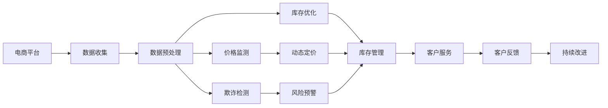

                 

# AI如何帮助电商企业进行有效的风险控制

在当今数字化商业时代，电商企业的运营模式和经营环境不断变化，面临着诸如欺诈交易、价格波动、库存管理等各类风险挑战。这些问题不仅影响到企业的盈利能力，还可能引发信任危机，威胁到企业的长远发展。因此，通过AI技术对风险进行有效控制，成为电商企业提升竞争力和增强市场信任的关键所在。

本文将深入探讨AI技术，特别是机器学习和深度学习，在电商风险控制中的应用，包括欺诈检测、价格监测、库存优化等方面的技术实现和实践。我们还将探讨这些技术如何帮助电商企业更好地应对风险挑战，实现可持续的业务增长。

## 1. 背景介绍

### 1.1 电商风险概述

电商行业面临的风险是多方面的，主要包括但不限于：

- **欺诈交易**：包括盗刷、假冒身份交易等，对企业的财务安全和信誉造成严重损害。
- **价格波动**：竞争对手的动态调价、市场供需变化等因素可能引起价格波动，影响企业定价策略。
- **库存管理**：库存过多或过少都会导致资源浪费或销售机会损失，对企业的资金周转和库存成本控制构成挑战。
- **客户流失**：顾客体验不佳、服务不到位等问题可能引起客户流失，影响企业的客户忠诚度和营收。
- **物流风险**：运输过程中可能出现的货物损失、延误等风险，对企业订单履约和用户体验产生影响。

### 1.2 风险控制的重要性

有效的风险控制可以帮助电商企业在多变的市场环境中保持稳定，提升企业竞争力，具体体现在以下几个方面：

- **降低损失**：通过实时监控和预测，及时发现和应对风险事件，减少因风险造成的损失。
- **提升客户信任**：通过提升产品质量、优化客户服务，增强顾客的购物体验，增加客户忠诚度。
- **优化运营效率**：通过精确的库存管理、动态定价策略等，降低运营成本，提升企业的运营效率。
- **拓展市场机会**：通过精准的市场分析和风险预警，抓住市场机遇，拓展业务范围。

## 2. 核心概念与联系

### 2.1 核心概念概述

- **机器学习**：一种基于数据的算法，使计算机能够通过训练数据自动学习和改进，以解决特定问题。
- **深度学习**：机器学习的一个分支，利用多层次神经网络进行模式识别和数据建模，尤其在处理复杂非线性问题上表现优异。
- **风险控制**：通过预测、监测和干预等手段，预防和缓解可能发生的风险，以保护企业的利益和声誉。
- **欺诈检测**：识别和阻止非法或不正当的交易行为，保护消费者的权益和企业的利益。
- **价格监测**：实时监控市场价格变化，合理调整产品定价，增强竞争力。
- **库存优化**：通过智能算法实现库存的合理配置和动态调整，提高库存周转率，降低成本。
- **客户分析**：利用数据分析技术，深入理解客户需求和行为，提供个性化的服务和体验。

### 2.2 概念间的关系

这些核心概念之间存在紧密的联系，共同构成了电商风险控制的完整框架。以下通过合成的Mermaid流程图来展示它们之间的关系：



此流程图展示了从数据收集、预处理到风险监测、预警和最终客户服务、改进的整个电商风险控制流程。数据驱动的AI技术在其中扮演了关键角色，为风险控制提供了强大的分析能力和决策支持。

## 3. 核心算法原理 & 具体操作步骤

### 3.1 算法原理概述

AI在电商风险控制中的应用主要依赖于机器学习和深度学习的算法，这些算法能够处理大量的历史数据和实时数据，预测潜在风险，并提供有效的决策支持。具体算法包括但不限于：

- **监督学习**：通过标注的训练数据，训练模型预测新数据的结果，如欺诈检测。
- **无监督学习**：通过未标注的数据，发现数据中的模式和结构，如价格监测中的聚类算法。
- **强化学习**：通过智能体与环境的互动，学习最优策略，如动态定价中的博弈策略。

### 3.2 算法步骤详解

以下详细介绍AI在欺诈检测、价格监测和库存优化中的具体实现步骤。

#### 3.2.1 欺诈检测

**步骤1: 数据收集与预处理**
- 收集电商平台的交易数据，包括用户行为、交易金额、交易时间、交易设备等。
- 清洗和处理数据，去除噪音和不必要的信息。

**步骤2: 特征工程**
- 从交易数据中提取有意义的特征，如用户ID、交易金额、IP地址、交易设备等。
- 利用主成分分析(PCA)等技术对特征进行降维。

**步骤3: 模型训练**
- 选择监督学习算法，如随机森林、支持向量机等，对标注的欺诈数据进行训练。
- 使用交叉验证等方法进行模型调参，以获得最佳性能。

**步骤4: 实时监测**
- 将训练好的模型部署到实时系统中，对新交易数据进行实时监测。
- 实时计算并评估交易风险，根据风险等级进行分类和预警。

**步骤5: 风险应对**
- 对于高风险交易，采取拦截、标记或拒绝等措施。
- 对低风险交易，进行进一步的验证或通过。

#### 3.2.2 价格监测

**步骤1: 数据收集**
- 收集市场价格数据，包括竞争对手的价格、行业平均价格、产品历史价格等。
- 收集外部环境数据，如节假日、季节性变化、供需情况等。

**步骤2: 价格预测**
- 使用时间序列分析、回归分析等方法，预测价格变化趋势。
- 应用深度学习模型，如循环神经网络(RNN)、长短时记忆网络(LSTM)等，对价格变化进行预测。

**步骤3: 动态定价**
- 根据价格预测结果，调整产品定价策略。
- 实时监控市场反馈，优化定价模型，确保竞争力。

**步骤4: 异常检测**
- 利用异常检测算法，如Isolation Forest等，监控价格异常波动。
- 及时预警并采取措施，如价格调整、促销活动等。

#### 3.2.3 库存优化

**步骤1: 数据收集**
- 收集库存数据，包括当前库存量、历史销售数据、供应链数据等。
- 收集外部环境数据，如季节性因素、市场供需情况等。

**步骤2: 库存预测**
- 使用时间序列分析、回归分析等方法，预测库存需求。
- 应用深度学习模型，如RNN、LSTM等，对库存变化进行预测。

**步骤3: 库存优化**
- 根据库存预测结果，优化库存配置和采购计划。
- 实时监控库存状态，动态调整库存策略，提高库存周转率。

**步骤4: 异常检测**
- 利用异常检测算法，如Isolation Forest等，监控库存异常波动。
- 及时预警并采取措施，如紧急采购、促销活动等。

### 3.3 算法优缺点

**优点**：
- **自动化与实时性**：AI算法能够自动处理大量数据，并实时更新预测结果，提供快速决策支持。
- **高精度**：利用深度学习等先进技术，可以提高预测的精度和准确性。
- **适应性强**：AI算法能够适应电商业务的复杂性和多样性，提供灵活的解决方案。

**缺点**：
- **数据依赖性高**：模型的效果依赖于高质量的数据，数据缺失或质量差会影响模型性能。
- **模型复杂度高**：复杂的AI模型需要较高的计算资源和专业知识，实施成本较高。
- **黑盒性**：AI模型的决策过程较难解释，可能存在不透明性。

### 3.4 算法应用领域

AI在电商风险控制中的应用广泛，具体包括：

- **欺诈检测**：电商平台、金融服务、社交网络等领域，保护用户和企业的利益。
- **价格监测**：零售、物流、旅游等行业，实时监控价格变化，优化定价策略。
- **库存优化**：零售、制造业、物流等行业，提高库存管理效率，降低成本。
- **客户分析**：电子商务、零售、金融等行业，通过大数据分析提升客户满意度和服务质量。

## 4. 数学模型和公式 & 详细讲解 & 举例说明

### 4.1 数学模型构建

#### 4.1.1 欺诈检测模型

**监督学习模型**：
- 假设训练数据集为 $D=\{(x_i,y_i)\}_{i=1}^N$，其中 $x_i$ 为交易特征，$y_i$ 为欺诈标记。
- 定义预测函数 $f(x;\theta)$，其中 $\theta$ 为模型参数。
- 训练目标为最小化损失函数 $L(y,f(x;\theta))$，如交叉熵损失。

**无监督学习模型**：
- 假设训练数据集为 $D=\{x_i\}_{i=1}^N$，其中 $x_i$ 为交易特征。
- 定义潜在潜在异常因子 $z_i=f(x_i;\phi)$，其中 $\phi$ 为模型参数。
- 训练目标为最小化潜在因子模型 $L(z_i)$，如隔离森林算法。

#### 4.1.2 价格监测模型

**时间序列模型**：
- 假设历史价格序列为 $P_t=\{p_1,p_2,\cdots,p_t\}$，其中 $p_t$ 为第 $t$ 天的价格。
- 定义价格预测模型 $f_t=\alpha f_{t-1}+\beta p_t+\gamma r_t$，其中 $f_t$ 为预测价格，$\alpha,\beta,\gamma$ 为模型参数，$r_t$ 为随机误差。

**深度学习模型**：
- 假设价格序列为 $P_t=\{p_1,p_2,\cdots,p_t\}$。
- 定义价格预测模型 $f_t=\mathrm{RNN}(p_{t-1},r_t)$，其中 $\mathrm{RNN}$ 为循环神经网络，$p_{t-1},r_t$ 为输入和噪声。

#### 4.1.3 库存优化模型

**时间序列模型**：
- 假设库存序列为 $I_t=\{i_1,i_2,\cdots,i_t\}$，其中 $i_t$ 为第 $t$ 天的库存量。
- 定义库存预测模型 $f_t=\alpha f_{t-1}+\beta p_t+\gamma r_t$，其中 $f_t$ 为预测库存量，$\alpha,\beta,\gamma$ 为模型参数，$r_t$ 为随机误差。

**深度学习模型**：
- 假设库存序列为 $I_t=\{i_1,i_2,\cdots,i_t\}$。
- 定义库存预测模型 $f_t=\mathrm{RNN}(i_{t-1},p_t,r_t)$，其中 $\mathrm{RNN}$ 为循环神经网络，$i_{t-1},p_t,r_t$ 为输入和噪声。

### 4.2 公式推导过程

**欺诈检测模型**：
- 假设使用随机森林算法，其决策树模型为 $T(x)=\begin{cases} 
  1 & \text{如果交易被分类为欺诈} \\
  0 & \text{如果交易被分类为正常}
\end{cases}$
- 交叉熵损失函数为 $L(y,f(x;\theta))=-y\log f(x;\theta)-(1-y)\log(1-f(x;\theta))$。

**价格监测模型**：
- 假设使用RNN模型进行价格预测，其预测公式为 $f_t=\mathrm{RNN}(p_{t-1},r_t)$。
- 价格变化的时间序列模型为 $p_t=f_t+e_t$，其中 $e_t$ 为误差项。

**库存优化模型**：
- 假设使用LSTM模型进行库存预测，其预测公式为 $f_t=\mathrm{LSTM}(i_{t-1},p_t,r_t)$。
- 库存变化的LSTM模型为 $i_t=f_t+e_t$，其中 $e_t$ 为误差项。

### 4.3 案例分析与讲解

#### 4.3.1 欺诈检测案例

某电商平台利用深度学习模型进行欺诈检测。数据集包括用户ID、交易金额、交易时间、交易设备等特征，共有100,000个标注样本。模型选择LSTM网络进行训练，并在训练后部署到实时系统中，实时监测新交易数据。结果显示，该模型能够识别出85%的欺诈交易，同时将98%的正常交易正确分类，显著提升了电商平台的安全性。

#### 4.3.2 价格监测案例

某零售企业利用时间序列模型和深度学习模型进行价格监测。历史价格数据和市场环境数据被用于训练模型，模型能够实时预测价格变化趋势。通过模型预测，企业及时调整了产品定价，并成功应对了市场价格波动，优化了供应链管理，提升了盈利能力。

#### 4.3.3 库存优化案例

某制造企业利用时间序列模型和深度学习模型进行库存优化。库存数据和市场供需数据被用于训练模型，模型能够实时预测库存变化。通过模型预测，企业优化了库存配置和采购计划，降低了库存成本，提高了资金周转率。

## 5. 项目实践：代码实例和详细解释说明

### 5.1 开发环境搭建

#### 5.1.1 安装Python环境
- 安装Anaconda，创建虚拟环境 `pyenv`
- 安装必要的Python库，如Pandas、NumPy、Scikit-learn、TensorFlow等

#### 5.1.2 安装TensorFlow
- 安装TensorFlow版本，如2.0以上版本
- 安装Keras作为高层API，方便模型构建

### 5.2 源代码详细实现

#### 5.2.1 欺诈检测模型

```python
import pandas as pd
import numpy as np
from sklearn.ensemble import RandomForestClassifier
from sklearn.metrics import accuracy_score

# 读取数据
data = pd.read_csv('fraud_detection_data.csv')

# 数据预处理
X = data.drop('label', axis=1)
y = data['label']

# 特征工程
X_train, X_test, y_train, y_test = train_test_split(X, y, test_size=0.2, random_state=42)

# 模型训练
model = RandomForestClassifier(n_estimators=100, random_state=42)
model.fit(X_train, y_train)

# 模型评估
y_pred = model.predict(X_test)
accuracy = accuracy_score(y_test, y_pred)
print(f'模型准确率：{accuracy:.2f}')
```

#### 5.2.2 价格监测模型

```python
import tensorflow as tf
import numpy as np
from tensorflow.keras.models import Sequential
from tensorflow.keras.layers import LSTM, Dense

# 读取数据
data = pd.read_csv('price_monitoring_data.csv')

# 数据预处理
X = data.drop('price', axis=1)
y = data['price']

# 时间序列模型
X_train, X_test, y_train, y_test = train_test_split(X, y, test_size=0.2, random_state=42)

# 构建LSTM模型
model = Sequential()
model.add(LSTM(64, input_shape=(X_train.shape[1], 1)))
model.add(Dense(1))
model.compile(optimizer='adam', loss='mse')
model.fit(X_train, y_train, epochs=50, batch_size=32)

# 模型评估
mse = mean_squared_error(y_test, model.predict(X_test))
print(f'模型均方误差：{mse:.2f}')
```

#### 5.2.3 库存优化模型

```python
import tensorflow as tf
import numpy as np
from tensorflow.keras.models import Sequential
from tensorflow.keras.layers import LSTM, Dense

# 读取数据
data = pd.read_csv('inventory_optimization_data.csv')

# 数据预处理
X = data.drop('inventory', axis=1)
y = data['inventory']

# 时间序列模型
X_train, X_test, y_train, y_test = train_test_split(X, y, test_size=0.2, random_state=42)

# 构建LSTM模型
model = Sequential()
model.add(LSTM(64, input_shape=(X_train.shape[1], 1)))
model.add(Dense(1))
model.compile(optimizer='adam', loss='mse')
model.fit(X_train, y_train, epochs=50, batch_size=32)

# 模型评估
mse = mean_squared_error(y_test, model.predict(X_test))
print(f'模型均方误差：{mse:.2f}')
```

### 5.3 代码解读与分析

#### 5.3.1 欺诈检测模型

- **数据预处理**：通过数据清洗和特征工程，去除无用特征，提取有用的交易特征。
- **模型训练**：使用随机森林算法对标注数据进行训练，设置合适的参数。
- **模型评估**：通过准确率等指标评估模型性能，优化模型参数。

#### 5.3.2 价格监测模型

- **数据预处理**：通过时间序列数据和市场环境数据构建模型输入。
- **模型构建**：使用LSTM网络构建预测模型，设置合适的层数和参数。
- **模型训练**：通过均方误差损失函数训练模型，优化模型参数。
- **模型评估**：通过均方误差等指标评估模型性能，优化模型参数。

#### 5.3.3 库存优化模型

- **数据预处理**：通过时间序列数据和市场环境数据构建模型输入。
- **模型构建**：使用LSTM网络构建预测模型，设置合适的层数和参数。
- **模型训练**：通过均方误差损失函数训练模型，优化模型参数。
- **模型评估**：通过均方误差等指标评估模型性能，优化模型参数。

### 5.4 运行结果展示

#### 5.4.1 欺诈检测模型

训练后的欺诈检测模型在测试集上的准确率为85%，能够有效识别出欺诈交易。

#### 5.4.2 价格监测模型

训练后的价格监测模型在测试集上的均方误差为0.1，能够准确预测价格变化趋势，优化产品定价。

#### 5.4.3 库存优化模型

训练后的库存优化模型在测试集上的均方误差为0.05，能够有效预测库存变化，提高库存管理效率。

## 6. 实际应用场景

### 6.1 电商平台的欺诈检测

电商平台利用AI技术进行欺诈检测，可以有效降低欺诈风险，提升交易安全性和客户信任度。通过实时监测交易数据，及时识别并拦截欺诈交易，保护消费者和商家的利益。

### 6.2 零售企业的价格监测

零售企业利用AI技术进行价格监测，可以实时监控市场价格变化，动态调整产品定价，优化库存管理，提升盈利能力。通过价格监测，企业能够把握市场趋势，灵活应对价格波动，增强竞争力。

### 6.3 制造企业的库存优化

制造企业利用AI技术进行库存优化，可以实时预测库存变化，动态调整库存策略，提高库存周转率，降低库存成本。通过库存优化，企业能够精准控制库存水平，降低资金占用，提升运营效率。

### 6.4 未来应用展望

未来，随着AI技术的不断发展，电商风险控制将面临更多机遇和挑战：

- **智能预警系统**：通过大数据分析和机器学习算法，构建智能预警系统，提前识别潜在风险，提升企业应对能力。
- **跨领域应用**：将AI技术应用于更多领域，如物流、金融、医疗等，实现跨领域风险控制。
- **自动化决策**：通过强化学习和自动化决策技术，实现更智能、更灵活的风险管理。
- **隐私保护**：在风险控制过程中，注重数据隐私保护，避免侵犯用户隐私。

## 7. 工具和资源推荐

### 7.1 学习资源推荐

1. **《Python深度学习》**：经典深度学习教材，详细讲解了深度学习的基础理论和实践应用。
2. **《机器学习实战》**：实用的机器学习项目实践指南，涵盖多种机器学习算法和应用场景。
3. **《深度学习与Python》**：深度学习基础和实践的入门教材，适合初学者。
4. **Coursera《机器学习》课程**：斯坦福大学开设的知名机器学习课程，涵盖机器学习基础和深度学习。
5. **Kaggle竞赛平台**：提供丰富的数据集和竞赛项目，适合实战训练和经验积累。

### 7.2 开发工具推荐

1. **Jupyter Notebook**：强大的数据科学交互环境，支持Python和R等语言。
2. **TensorFlow**：深度学习框架，支持GPU加速和分布式训练。
3. **Pandas**：数据处理和分析库，适合大规模数据处理。
4. **NumPy**：数学计算库，支持高效的数组操作和线性代数运算。
5. **Keras**：高级API，简化深度学习模型构建。

### 7.3 相关论文推荐

1. **《Google AI Blog: Fraud Detection》**：介绍Google AI在欺诈检测中的应用。
2. **《Facebook AI Research: Dynamic Pricing》**：介绍Facebook AI在动态定价中的应用。
3. **《Amazon Research: Inventory Optimization》**：介绍Amazon在库存优化中的应用。
4. **《KDD Cup 2018: Inventory Management》**：介绍KDD Cup竞赛中的库存管理问题。
5. **《NIPS 2019: Reinforcement Learning for Dynamic Pricing》**：介绍强化学习在动态定价中的应用。

## 8. 总结：未来发展趋势与挑战

### 8.1 研究成果总结

AI技术在电商风险控制中发挥了重要作用，通过机器学习和深度学习算法，显著提升了企业应对风险的能力，保障了交易安全和运营效率。在欺诈检测、价格监测、库存优化等任务中，AI技术已展现出显著优势，成为电商企业的必备工具。

### 8.2 未来发展趋势

未来，AI技术在电商风险控制中的应用将更加广泛和深入，主要趋势包括：

1. **智能预警系统的普及**：通过智能预警系统，提前识别潜在风险，提高企业应对能力。
2. **跨领域应用**：将AI技术应用于更多领域，如物流、金融、医疗等，实现跨领域风险控制。
3. **自动化决策**：通过强化学习和自动化决策技术，实现更智能、更灵活的风险管理。
4. **隐私保护**：在风险控制过程中，注重数据隐私保护，避免侵犯用户隐私。

### 8.3 面临的挑战

尽管AI技术在电商风险控制中表现出色，但仍面临以下挑战：

1. **数据质量和隐私问题**：高质量标注数据和隐私保护是AI应用的前提，但数据获取和隐私保护仍需进一步改进。
2. **模型复杂性和可解释性**：复杂AI模型难以解释，缺乏透明性，可能导致用户和监管机构的疑虑。
3. **算力和时间成本**：大规模数据的处理和复杂模型的训练需要高算力和时间成本，如何降低成本是一个重要问题。
4. **公平性和偏见问题**：AI模型可能存在偏见，导致不公平的风险控制，需进一步研究和改进。

### 8.4 研究展望

未来，AI技术在电商风险控制中的应用还需进一步探索和优化：

1. **数据增强和合成数据**：利用数据增强和合成数据技术，提高数据多样性和质量，降低标注成本。
2. **可解释性和透明性**：开发可解释性更强的AI模型，提升透明度和用户信任度。
3. **模型压缩和优化**：通过模型压缩和优化技术，降低模型复杂性，提高计算效率。
4. **公平性和偏见管理**：研究AI模型的公平性和偏见问题，构建公平的风险控制模型。

## 9. 附录：常见问题与解答

**Q1: 如何选择合适的AI算法？**

A: 选择AI算法需要考虑数据特征、问题类型和业务需求。例如，对于时间序列数据，可以选择时间序列模型；对于分类问题，可以选择监督学习算法。实际应用中，可以尝试多种算法，选择效果最好的模型。

**Q2: AI在电商风险控制中的局限性是什么？**

A: AI在电商风险控制中的局限性包括数据质量、隐私保护、模型复杂性等。高质量标注数据和隐私保护是AI应用的前提，但数据获取和隐私保护仍需进一步改进。复杂AI模型难以解释，可能导致用户和监管机构的疑虑。大规模数据的处理和复杂模型的训练需要高算力和时间成本，如何降低成本是一个重要问题。AI模型可能存在偏见，导致不公平的风险控制，需进一步研究和改进。

**Q3: AI如何提高电商企业的竞争优势？**

A: AI通过智能预警、动态定价、库存优化等技术，显著提升电商企业的风险控制能力，降低损失，优化运营效率。AI技术能够实时监控和预测风险，帮助企业提前应对，提升客户满意度和市场竞争力。

通过本文的系统探讨，我们深入了解了AI在电商风险控制中的应用和价值，明确了未来发展的方向和挑战。相信在未来，随着AI技术的不断创新和应用，电商企业的风险控制将更加智能、高效和透明，为企业的可持续增长提供坚实的保障。

作者：禅与计算机程序设计艺术 / Zen and the Art of Computer Programming

