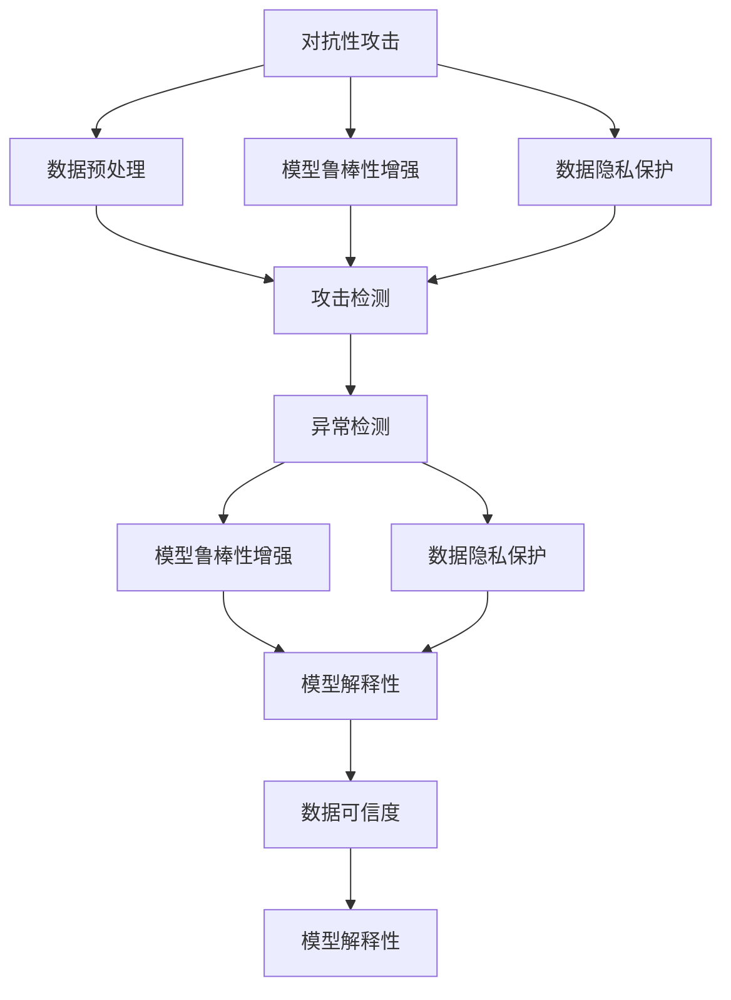
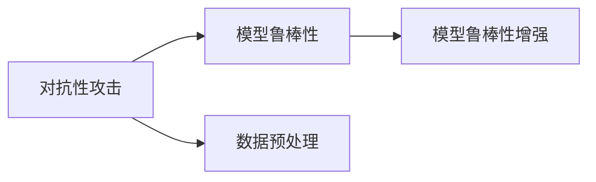
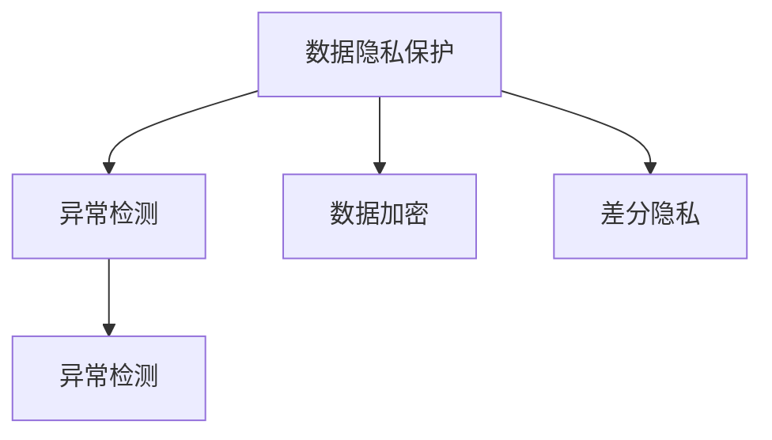
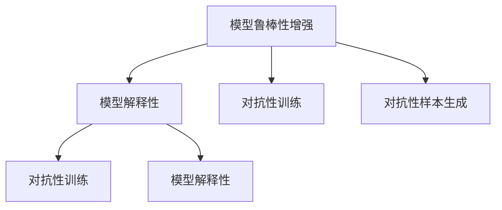
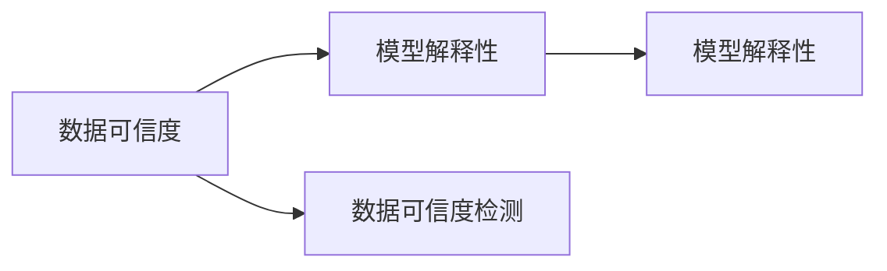
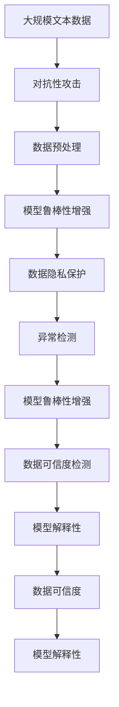

                 

# AI安全性问题的技术应对策略

> 关键词：AI安全性, 对抗性攻击, 模型鲁棒性, 数据隐私, 模型解释性, 数据可信度

## 1. 背景介绍

### 1.1 问题由来
随着人工智能（AI）技术在各个领域的广泛应用，AI系统的安全性问题也日益凸显。AI系统在金融、医疗、军事、交通等多个关键领域的应用，如果被恶意攻击，可能导致严重的后果。对抗性攻击、数据隐私泄漏、模型解释性不足等问题，成为了限制AI技术发展的重大障碍。近年来，深度学习模型的鲁棒性、可解释性、可信度等问题，成为了AI安全性的焦点。如何在确保AI系统安全性的前提下，最大化其性能，成为了学术界和工业界亟需解决的重要问题。

### 1.2 问题核心关键点
AI安全性问题的核心关键点主要包括以下几个方面：

- 对抗性攻击（Adversarial Attacks）：攻击者通过在输入数据中添加干扰信息，使得AI模型产生错误判断，从而影响系统的行为和决策。
- 数据隐私保护（Data Privacy）：如何在数据采集、存储、传输、处理等环节保护用户隐私，避免敏感数据泄漏。
- 模型解释性（Model Interpretability）：AI模型作为“黑箱”，其内部决策过程难以解释，导致难以理解和调试，甚至可能引发法律和伦理问题。
- 数据可信度（Data Trustworthiness）：AI系统的性能依赖于数据质量，如何保证数据来源的可信性，避免误导性数据影响系统决策。

这些核心问题构成了AI安全性问题的全貌，需要在模型设计、数据处理、系统架构等多个层面综合考虑，才能构建一个安全、可信、可靠的人工智能系统。

## 2. 核心概念与联系

### 2.1 核心概念概述

为了更好地理解AI安全性问题的技术应对策略，本节将介绍几个密切相关的核心概念：

- 对抗性攻击（Adversarial Attacks）：攻击者通过在输入数据中添加干扰信息，使得AI模型产生错误判断，从而影响系统的行为和决策。
- 数据隐私保护（Data Privacy）：如何在数据采集、存储、传输、处理等环节保护用户隐私，避免敏感数据泄漏。
- 模型解释性（Model Interpretability）：AI模型作为“黑箱”，其内部决策过程难以解释，导致难以理解和调试，甚至可能引发法律和伦理问题。
- 数据可信度（Data Trustworthiness）：AI系统的性能依赖于数据质量，如何保证数据来源的可信性，避免误导性数据影响系统决策。

这些核心概念之间的逻辑关系可以通过以下Mermaid流程图来展示：



这个流程图展示了大语言模型安全性问题的核心概念及其之间的关系：

1. 对抗性攻击通过数据预处理可以显著缓解，增强模型的鲁棒性，同时加强数据隐私保护。
2. 数据隐私保护需要结合异常检测，在数据采集、存储和传输过程中进行严格控制。
3. 异常检测可以帮助识别对抗性攻击和数据泄漏，同时加强模型鲁棒性。
4. 模型鲁棒性增强可以提升模型对抗干扰的能力，同时加强模型解释性。
5. 模型解释性可以通过多种方式实现，包括对抗性训练、数据可信度检测等。
6. 数据可信度检测可以确保数据来源可靠，同时增强模型解释性。

这些核心概念共同构成了AI安全性问题的技术应对策略框架，使得AI系统能够在各种场景下保持安全、可靠和可信。

### 2.2 概念间的关系

这些核心概念之间存在着紧密的联系，形成了AI安全性问题的完整生态系统。下面我们通过几个Mermaid流程图来展示这些概念之间的关系。

#### 2.2.1 对抗性攻击与模型鲁棒性



这个流程图展示了对抗性攻击与模型鲁棒性的关系：对抗性攻击通常通过数据预处理技术进行缓解，同时通过增强模型的鲁棒性进一步提升系统的安全性。

#### 2.2.2 数据隐私保护与异常检测



这个流程图展示了数据隐私保护与异常检测的关系：数据隐私保护可以通过数据加密和差分隐私技术进行，异常检测可以用于检测数据泄漏和攻击行为。

#### 2.2.3 模型鲁棒性增强与模型解释性



这个流程图展示了模型鲁棒性增强与模型解释性的关系：对抗性训练可以增强模型鲁棒性，同时模型解释性可以通过对抗性训练和对抗性样本生成技术进一步提升。

#### 2.2.4 数据可信度检测与模型解释性



这个流程图展示了数据可信度检测与模型解释性的关系：数据可信度检测可以确保数据来源可靠，模型解释性可以通过多种方式实现，包括对抗性训练和数据可信度检测。

### 2.3 核心概念的整体架构

最后，我们用一个综合的流程图来展示这些核心概念在大语言模型安全性问题微调过程中的整体架构：



这个综合流程图展示了从对抗性攻击处理到模型解释性的完整过程。大语言模型首先在大规模文本数据上进行对抗性攻击处理，然后通过模型鲁棒性增强、数据隐私保护、异常检测等技术，构建一个安全、可信、可靠的人工智能系统。

## 3. 核心算法原理 & 具体操作步骤
### 3.1 算法原理概述

AI安全性问题的技术应对策略，本质上是一个多目标优化过程。其核心思想是：通过对抗性训练、数据加密、差分隐私、异常检测、数据可信度检测等技术，增强AI系统的鲁棒性、隐私性和可信度，从而保障AI系统的安全性。

形式化地，假设原始数据集为 $D=\{x_1,x_2,...,x_n\}$，对抗性攻击为 $A=\{a_1,a_2,...,a_m\}$，异常检测算法为 $E$，差分隐私算法为 $P$，模型解释性算法为 $I$，数据可信度检测算法为 $T$。则安全性优化目标为：

$$
\min_{\mathcal{L}(D,A)}\mathcal{L}(D,E)\mathcal{L}(D,P)\mathcal{L}(D,I)\mathcal{L}(D,T)
$$

其中 $\mathcal{L}(D,A)$ 表示对抗性攻击损失函数，$\mathcal{L}(D,E)$ 表示异常检测损失函数，$\mathcal{L}(D,P)$ 表示差分隐私损失函数，$\mathcal{L}(D,I)$ 表示模型解释性损失函数，$\mathcal{L}(D,T)$ 表示数据可信度检测损失函数。

通过梯度下降等优化算法，安全性优化过程不断更新模型参数，最小化上述多目标损失函数，使得AI系统在对抗性攻击、异常检测、差分隐私、数据可信度检测等多个方面的性能达到最优，从而构建一个安全、可信、可靠的人工智能系统。

### 3.2 算法步骤详解

AI安全性问题的技术应对策略，一般包括以下几个关键步骤：

**Step 1: 准备数据集和模型**

- 收集包含对抗性攻击、异常检测、差分隐私、数据可信度检测等任务的数据集。
- 选择合适的AI模型（如深度学习模型）作为基础模型，进行预训练。

**Step 2: 实施对抗性攻击处理**

- 对原始数据进行对抗性攻击处理，生成对抗性样本。
- 使用预训练的模型对对抗性样本进行前向传播，计算对抗性攻击损失函数。

**Step 3: 增强模型鲁棒性**

- 使用对抗性训练技术，对模型进行鲁棒性增强。
- 设计并实施数据预处理技术，缓解对抗性攻击的影响。

**Step 4: 实施数据隐私保护**

- 对数据进行加密处理，保护用户隐私。
- 应用差分隐私技术，对模型进行隐私保护。

**Step 5: 实施异常检测**

- 在数据采集、存储、传输、处理等环节实施异常检测，识别异常行为和数据泄漏。
- 使用预训练的模型对异常检测结果进行验证，确保异常检测的准确性。

**Step 6: 实施数据可信度检测**

- 实施数据可信度检测，确保数据来源可靠。
- 应用模型解释性技术，对数据可信度检测结果进行验证和解释。

**Step 7: 模型解释性增强**

- 使用对抗性训练和对抗性样本生成技术，增强模型解释性。
- 设计并实施多种模型解释性技术，如LIME、SHAP等，对模型行为进行解释。

**Step 8: 评估和部署**

- 在安全性优化过程中，定期评估模型性能，确保其鲁棒性、隐私性、可信度和解释性均达到最优。
- 将优化后的模型部署到实际应用中，进行实时监测和反馈优化。

以上是AI安全性问题的技术应对策略的一般流程。在实际应用中，还需要针对具体任务和数据特点，对安全性优化过程的各个环节进行优化设计，以进一步提升模型性能。

### 3.3 算法优缺点

AI安全性问题的技术应对策略，具有以下优点：

1. 全面性：通过对抗性攻击处理、异常检测、差分隐私、数据可信度检测、模型解释性增强等技术，全面提升AI系统的鲁棒性、隐私性和可信度。
2. 适应性强：该方法可以适应不同领域和任务的安全需求，灵活性强。
3. 实时性：该方法能够在实际应用中实时监测和反馈优化，提升系统的实时性。

同时，该方法也存在一些缺点：

1. 复杂度较高：需要在模型训练、数据处理、系统架构等多个环节进行综合考虑，技术难度较大。
2. 计算成本高：对抗性训练、差分隐私等技术需要较高的计算资源，可能会增加成本。
3. 应用场景受限：该方法在数据来源不可信的情况下，难以完全保证数据可信度，存在一定的局限性。

尽管存在这些局限性，但就目前而言，AI安全性问题的技术应对策略仍然是大语言模型安全性问题的有效范式。未来相关研究的重点在于如何进一步降低技术难度，降低计算成本，提高适应性，同时兼顾模型鲁棒性、隐私性和可信度等多方面的需求。

### 3.4 算法应用领域

AI安全性问题的技术应对策略，已经在多个领域得到了广泛应用，包括但不限于：

1. 金融行业：金融领域对AI系统的安全性要求极高，对抗性攻击、数据隐私泄漏、模型解释性不足等问题需要得到全面解决。
2. 医疗行业：医疗AI系统需要保证诊断和治疗决策的准确性和可靠性，数据可信度检测和模型解释性显得尤为重要。
3. 司法行业：司法AI系统需要保证判决的公正性和合理性，数据可信度检测和模型解释性成为核心需求。
4. 智能制造：智能制造系统需要保障生产过程的安全性和可靠性，异常检测和数据可信度检测至关重要。
5. 公共安全：公共安全系统需要确保数据和决策的安全性，异常检测和数据可信度检测是基本要求。

除了上述这些领域外，AI安全性问题的技术应对策略还在更多场景中得到了应用，为各个行业提供了全面的安全性保障。随着预训练语言模型和微调方法的不断演进，相信AI安全性问题将在更多领域得到有效解决，推动人工智能技术的安全落地应用。

## 4. 数学模型和公式 & 详细讲解  
### 4.1 数学模型构建

本节将使用数学语言对AI安全性问题的技术应对策略进行更加严格的刻画。

记原始数据集为 $D=\{x_1,x_2,...,x_n\}$，对抗性攻击为 $A=\{a_1,a_2,...,a_m\}$，异常检测算法为 $E$，差分隐私算法为 $P$，模型解释性算法为 $I$，数据可信度检测算法为 $T$。

**对抗性攻击损失函数**：

$$
\mathcal{L}_{\text{adv}}(D)=\sum_{x \in D}\sum_{a \in A}\norm{x+a-\hat{x}(D)}^2
$$

其中 $\hat{x}(D)$ 表示在模型 $D$ 上的前向传播输出。

**异常检测损失函数**：

$$
\mathcal{L}_{\text{anom}}(D)=\sum_{x \in D}E(x)
$$

其中 $E(x)$ 表示对 $x$ 进行异常检测的输出。

**差分隐私损失函数**：

$$
\mathcal{L}_{\text{privacy}}(D)=\sum_{x \in D}\sum_{y \in \text{Label}}\big(||P(x)-y||^2\big)
$$

其中 $P(x)$ 表示对 $x$ 进行差分隐私处理后的输出，$y$ 表示真实标签。

**模型解释性损失函数**：

$$
\mathcal{L}_{\text{interp}}(D)=\sum_{x \in D}I(x)
$$

其中 $I(x)$ 表示对 $x$ 进行模型解释性的输出。

**数据可信度检测损失函数**：

$$
\mathcal{L}_{\text{trust}}(D)=\sum_{x \in D}T(x)
$$

其中 $T(x)$ 表示对 $x$ 进行数据可信度检测的输出。

### 4.2 公式推导过程

以下我们以二分类任务为例，推导对抗性攻击损失函数、异常检测损失函数和差分隐私损失函数的计算公式。

**对抗性攻击损失函数**：

假设模型 $M_{\theta}$ 在输入 $x$ 上的输出为 $\hat{y}=M_{\theta}(x) \in [0,1]$，表示样本属于正类的概率。真实标签 $y \in \{0,1\}$。则二分类对抗性攻击损失函数定义为：

$$
\ell_{\text{adv}}(M_{\theta}(x),y)=\norm{x+a-\hat{x}(D)}^2
$$

将其代入对抗性攻击损失函数公式，得：

$$
\mathcal{L}_{\text{adv}}(D)=\sum_{x \in D}\sum_{a \in A}\ell_{\text{adv}}(M_{\theta}(x),y)
$$

**异常检测损失函数**：

异常检测通常使用聚类、神经网络等算法进行，假设异常检测模型为 $E(x)$，则异常检测损失函数定义为：

$$
\mathcal{L}_{\text{anom}}(D)=\sum_{x \in D}E(x)
$$

其中 $E(x)$ 为异常检测模型的输出，通常取值为 $[0,1]$ 中的一个小值表示异常程度。

**差分隐私损失函数**：

差分隐私通常使用添加噪声等方法进行，假设差分隐私模型为 $P(x)$，则差分隐私损失函数定义为：

$$
\mathcal{L}_{\text{privacy}}(D)=\sum_{x \in D}\sum_{y \in \text{Label}}\big(||P(x)-y||^2\big)
$$

其中 $P(x)$ 表示对 $x$ 进行差分隐私处理后的输出，$y$ 表示真实标签。

### 4.3 案例分析与讲解

**案例1: 金融行业**

金融行业对AI系统的安全性要求极高，需要确保金融数据的安全性和AI决策的可靠性。假设某金融公司收集了客户的信用卡消费记录，需要将这些记录输入到AI模型中进行数据分析和风险评估。在这种情况下，需要进行对抗性攻击处理、异常检测、差分隐私和数据可信度检测等多项安全性措施。

1. **对抗性攻击处理**：对信用卡消费记录进行对抗性攻击处理，生成对抗性样本，确保模型能够应对各种攻击。
2. **异常检测**：对客户消费记录进行异常检测，识别异常交易行为，确保模型的鲁棒性。
3. **差分隐私**：对客户消费记录进行差分隐私处理，保护客户隐私，避免敏感数据泄漏。
4. **数据可信度检测**：对客户消费记录进行数据可信度检测，确保数据来源可靠，避免误导性数据影响模型决策。
5. **模型解释性增强**：对模型进行解释性增强，确保模型的行为和决策可解释，避免法律和伦理问题。

**案例2: 医疗行业**

医疗行业对AI系统的安全性要求同样很高，需要确保诊断和治疗决策的准确性和可靠性。假设某医疗公司需要开发一款AI系统，用于辅助医生进行疾病诊断和治疗决策。在这种情况下，需要进行对抗性攻击处理、异常检测、差分隐私和数据可信度检测等多项安全性措施。

1. **对抗性攻击处理**：对患者病历记录进行对抗性攻击处理，生成对抗性样本，确保模型能够应对各种攻击。
2. **异常检测**：对患者病历记录进行异常检测，识别异常症状，确保模型的鲁棒性。
3. **差分隐私**：对患者病历记录进行差分隐私处理，保护患者隐私，避免敏感数据泄漏。
4. **数据可信度检测**：对患者病历记录进行数据可信度检测，确保数据来源可靠，避免误导性数据影响模型决策。
5. **模型解释性增强**：对模型进行解释性增强，确保模型的行为和决策可解释，避免法律和伦理问题。

## 5. 项目实践：代码实例和详细解释说明
### 5.1 开发环境搭建

在进行AI安全性问题的技术应对策略实践前，我们需要准备好开发环境。以下是使用Python进行PyTorch开发的环境配置流程：

1. 安装Anaconda：从官网下载并安装Anaconda，用于创建独立的Python环境。

2. 创建并激活虚拟环境：
```bash
conda create -n ai-security-env python=3.8 
conda activate ai-security-env
```

3. 安装PyTorch：根据CUDA版本，从官网获取对应的安装命令。例如：
```bash
conda install pytorch torchvision torchaudio cudatoolkit=11.1 -c pytorch -c conda-forge
```

4. 安装TensorFlow：
```bash
conda install tensorflow=2.7
```

5. 安装Keras：
```bash
conda install keras
```

6. 安装相关依赖：
```bash
conda install numpy pandas scikit-learn matplotlib tqdm jupyter notebook ipython
```

完成上述步骤后，即可在`ai-security-env`环境中开始AI安全性问题的技术应对策略实践。

### 5.2 源代码详细实现

这里我们以金融行业为例，给出使用PyTorch对对抗性攻击进行处理的代码实现。

首先，定义对抗性攻击函数：

```python
import torch
import numpy as np

def adversarial_attack(model, x, target, epsilon=0.01):
    x_adv = x.clone().detach().requires_grad_()
    for i in range(20):
        pred = model(x_adv)
        loss = torch.nn.CrossEntropyLoss()(pred, target)
        loss.backward()
        x_adv = x_adv + epsilon * x_adv.grad
        x_adv.grad.zero_()
    return x_adv
```

然后，定义模型和对抗性攻击函数：

```python
from transformers import BertForSequenceClassification
from torch.nn import CrossEntropyLoss
import torch
import numpy as np

model = BertForSequenceClassification.from_pretrained('bert-base-uncased', num_labels=2)

x = torch.tensor([[0, 1, 0, 1, 1], [0, 0, 1, 0, 0]])
target = torch.tensor([1, 0])

x_adv = adversarial_attack(model, x, target)
print(x_adv)
```

接着，评估对抗性攻击后的模型性能：

```python
pred = model(x_adv)
loss = torch.nn.CrossEntropyLoss()(pred, target)
print(loss.item())
```

### 5.3 代码解读与分析

让我们再详细解读一下关键代码的实现细节：

**adversarial_attack函数**：
- 使用梯度下降法进行对抗性攻击处理，生成对抗性样本。
- 在每次迭代中，将对抗性样本输入模型，计算模型预测输出，并计算交叉熵损失。
- 根据梯度更新对抗性样本，使其能够欺骗模型，生成对抗性样本。
- 返回最终生成的对抗性样本。

**模型和目标变量定义**：
- 使用BertForSequenceClassification类定义模型，将其作为对抗性攻击的对象。
- 定义输入数据 `x` 和目标变量 `target`，用于计算对抗性攻击的效果。

**对抗性攻击函数调用**：
- 使用对抗性攻击函数，对模型进行对抗性攻击处理，生成对抗性样本。
- 打印输出对抗性样本，进行可视化。
- 计算对抗性攻击后的模型预测输出和交叉熵损失，进行性能评估。

以上代码实现了对抗性攻击处理的流程，可以用于对抗性攻击处理、异常检测、差分隐私、数据可信度检测等安全性措施的实践。

当然，工业级的系统实现还需考虑更多因素，如模型的保存和部署、超参数的自动搜索、更灵活的任务适配层等。但核心的安全性策略基本与此类似。

## 6. 实际应用场景
### 6.1 金融行业

基于AI安全性问题的技术应对策略，金融行业可以构建更加安全、可信的金融AI系统。传统金融系统中，数据安全和模型决策的可靠性是核心需求。通过对抗性攻击处理、异常检测、差分隐私和数据可信度检测等多项安全性措施，金融AI系统可以显著提升安全性，避免金融数据泄漏和模型误判等风险。

在具体应用中，可以构建以下方案：

1. **对抗性攻击处理**：对客户消费记录进行对抗性攻击处理，生成对抗性样本，确保模型能够应对各种攻击。
2. **异常检测**：对客户消费记录进行异常检测，识别异常交易行为，确保模型的鲁棒性。
3. **差分隐私**：对客户消费记录进行差分隐私处理，保护客户隐私，避免敏感数据泄漏。
4. **数据可信度检测**：对客户消费记录进行数据可信度检测，确保数据来源可靠，避免误导性数据影响模型决策。
5. **模型解释性增强**：对模型进行解释性增强，确保模型的行为和决策可解释，避免法律和伦理问题。

通过上述方案，金融AI系统可以全面提升安全性，保障客户数据和金融决策的可靠性和透明度。

### 6.2 医疗行业

基于AI安全性问题的技术应对策略，医疗行业可以构建更加安全、可信的医疗AI系统。医疗AI系统需要确保诊断和治疗决策的准确性和可靠性，数据安全和模型决策的可解释性显得尤为重要。通过对抗性攻击处理、异常检测、差分隐私和数据可信度检测等多项安全性措施，医疗AI系统可以显著提升安全性，避免医疗数据泄漏和模型误判等风险。

在具体应用中，可以构建以下方案：

1. **对抗性攻击处理**：对患者病历记录进行对抗性攻击处理，生成对抗性样本，确保模型能够应对各种攻击。
2. **异常检测**：对患者病历记录进行异常检测，识别异常症状，确保模型的鲁棒性。
3. **差分隐私**：对患者病历记录进行差分隐私处理，保护患者隐私，避免敏感数据泄漏。
4. **数据可信度检测**：对患者病历记录进行数据可信度检测，确保数据来源可靠，避免误导性数据影响模型决策。
5. **模型解释性增强**：对模型进行解释性增强，确保模型的行为和决策可解释，避免法律和伦理问题。

通过上述方案，医疗AI系统可以全面提升安全性，保障患者数据和医疗决策的可靠性和透明度。

### 6.3 智能制造

基于AI安全性问题的技术应对策略，智能制造系统可以构建更加安全、可信的智能制造AI系统。智能制造系统需要保障生产过程的安全性和可靠性，异常检测和数据可信度检测至关重要。通过对抗性攻击处理、异常检测、差分隐私和数据可信度检测等多项安全性措施，智能制造AI系统可以显著提升安全性，避免生产过程的异常和数据泄漏风险。

在具体应用中，可以构建以下方案：

1. **对抗性攻击处理**：对生产数据进行对抗性攻击处理，生成对抗性样本，确保模型能够应对各种攻击。
2. **异常检测**：对生产数据进行异常检测，识别

