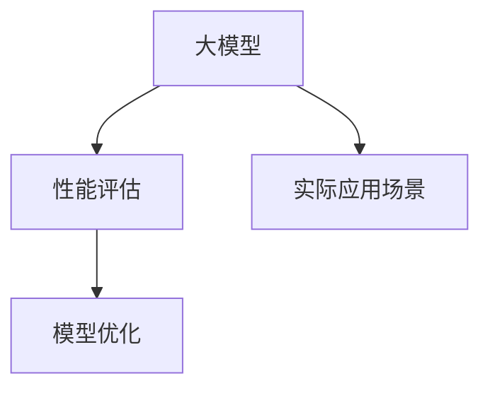

                 

# AI工程学：大模型应用开发实战：AI系统性能评估

## 1. 背景介绍

### 1.1 问题由来
在人工智能工程学领域，特别是深度学习模型训练和部署的实践中，性能评估一直是一个重要且复杂的环节。随着深度学习模型的不断扩展和应用，大型模型如Transformer、BERT、GPT等，因其大容量和高复杂度，使得性能评估变得更加关键。然而，传统的基于准确率、损失函数等指标的评估方法往往不足以全面反映模型的性能表现，尤其是在模型复杂度提高、数据分布变化、计算资源有限等实际应用场景中。

因此，本文将深入探讨大模型应用开发中的性能评估问题，包括评估指标的选择、模型优化的方法、实际应用中的挑战和解决方案等，以期为深度学习模型开发者提供系统性和可操作性的指导。

### 1.2 问题核心关键点
在深度学习模型开发中，性能评估是确保模型在实际应用中表现优异的必要环节。性能评估主要包含以下关键点：

- **评估指标选择**：选择合适的评估指标，如准确率、精确率、召回率、F1分数、AUC等，以便全面反映模型性能。
- **数据集设计**：设计合理的数据集，包括训练集、验证集和测试集，以确保模型在不同数据分布上的泛化能力。
- **模型优化方法**：通过调整超参数、正则化、模型压缩、数据增强等方法，优化模型性能。
- **实际应用挑战**：在实际应用中，考虑计算资源限制、数据分布变化、模型可解释性等挑战，制定解决方案。

本文将围绕以上关键点，系统性地介绍AI工程学中大模型应用开发的性能评估方法和技术。

## 2. 核心概念与联系

### 2.1 核心概念概述

为了更好地理解性能评估在大模型应用开发中的作用，本节将介绍几个关键概念及其相互联系：

- **大模型**：如Transformer、BERT等，是指具有数百万甚至数十亿参数的深度学习模型，通常用于处理复杂的自然语言处理(NLP)、计算机视觉(CV)等任务。
- **性能评估**：通过一系列指标和方法，评估模型在不同数据集上的表现。常用的指标包括准确率、精确率、召回率、F1分数、AUC等。
- **模型优化**：通过调整模型结构、超参数、正则化、数据增强等方法，提高模型性能。
- **实际应用场景**：模型在特定任务上的表现，如文本分类、情感分析、机器翻译等。

这些概念之间的关系可以用以下Mermaid流程图来展示：



这个流程图展示了从模型构建、评估和优化，再到实际应用的全流程。性能评估通过一系列指标和方法，对模型进行全面评估，进而指导模型优化，并应用于实际任务中，确保模型在真实场景中的表现。

### 2.2 概念间的关系

这些核心概念之间存在着紧密的联系，形成了深度学习模型开发和评估的完整生态系统。具体来说：

- **大模型与性能评估**：大模型的复杂度和容量使得性能评估更加重要，以确保模型在实际应用中表现稳定和准确。
- **性能评估与模型优化**：性能评估指标的选择和设计直接影响模型优化的方向和目标。
- **模型优化与实际应用场景**：优化后的模型，通过在实际应用场景中的测试，进一步验证和调整，以确保其在真实数据上的表现。
- **实际应用场景与大模型**：实际应用场景的多样性和复杂性，要求大模型在处理数据时具备高泛化能力和灵活性。

这些概念共同构成了深度学习模型开发和评估的基础，确保模型能够在各种实际场景中发挥最优性能。

## 3. 核心算法原理 & 具体操作步骤
### 3.1 算法原理概述

在大模型应用开发中，性能评估是确保模型在不同数据分布和场景下表现稳定的关键步骤。性能评估主要分为训练集评估、验证集评估和测试集评估，通过一系列指标和方法，全面反映模型的性能表现。

### 3.2 算法步骤详解

以下是AI工程学中大模型应用开发常用的性能评估步骤：

**Step 1: 数据集准备**

1. **数据划分**：将数据集分为训练集、验证集和测试集，一般采用70-15-15或80-10-10的比例。
2. **数据预处理**：包括数据清洗、归一化、特征工程等预处理步骤。
3. **数据增强**：通过数据增强方法，如旋转、平移、裁剪、噪声添加等，扩充数据集。

**Step 2: 模型训练与验证**

1. **选择优化器**：选择合适的优化器如Adam、SGD等，并设置合适的学习率、批大小等超参数。
2. **模型训练**：在训练集上进行模型训练，记录训练过程中的损失函数和准确率等指标。
3. **验证集评估**：在验证集上评估模型性能，记录验证集的损失函数和准确率等指标。

**Step 3: 模型测试与评估**

1. **测试集测试**：在测试集上测试模型，记录测试集的损失函数和准确率等指标。
2. **性能指标计算**：计算模型的各项性能指标，如准确率、精确率、召回率、F1分数、AUC等。
3. **结果分析与调整**：根据评估结果，分析模型表现，调整模型结构和超参数，进行模型优化。

**Step 4: 模型部署与应用**

1. **模型保存**：将优化后的模型保存，便于后续部署和应用。
2. **应用部署**：将模型部署到实际应用环境中，进行性能测试和监控。
3. **持续优化**：根据实际应用中的数据和反馈，持续优化模型，确保其在实际场景中的稳定表现。

### 3.3 算法优缺点

性能评估在大模型应用开发中起到了至关重要的作用，但同时也存在一些局限性：

**优点**：
1. **全面反映模型性能**：通过多项指标的评估，全面反映模型在不同数据分布和场景下的表现。
2. **指导模型优化**：性能评估为模型优化提供指导，帮助调整模型结构和超参数，提升模型性能。
3. **确保模型稳定**：通过严格的评估和测试，确保模型在实际应用中的稳定性和可靠性。

**缺点**：
1. **计算资源消耗大**：在大模型和复杂任务中，计算资源消耗较大，需要高性能计算设备支持。
2. **数据依赖性强**：性能评估依赖于高质量的数据集，数据质量直接影响评估结果。
3. **模型复杂度高**：大模型的复杂性使得性能评估更加复杂，需要专业知识和技术积累。
4. **评估指标单一**：传统的评估指标可能无法全面反映模型在实际场景中的表现，需要结合多个指标进行综合评估。

尽管存在这些局限性，性能评估仍然是大模型应用开发中的重要环节，确保模型在实际应用中表现稳定和可靠。

### 3.4 算法应用领域

性能评估在大模型应用开发中，广泛应用于各种NLP和CV任务，包括但不限于以下领域：

- **文本分类**：如情感分析、主题分类等。评估指标包括准确率、F1分数、AUC等。
- **命名实体识别**：如人名、地名、机构名等识别。评估指标包括精确率、召回率、F1分数等。
- **机器翻译**：评估模型在翻译任务中的性能，指标包括BLEU、METEOR等。
- **图像分类**：如物体识别、场景分类等。评估指标包括准确率、顶五率、顶十率等。
- **目标检测**：如 pedestrian detection、人脸识别等。评估指标包括mAP、IoU等。

## 4. 数学模型和公式 & 详细讲解 & 举例说明
### 4.1 数学模型构建

在大模型性能评估中，数学模型构建是评估的基础。常用的数学模型包括分类模型的混淆矩阵、回归模型的均方误差等。这里以分类模型为例，进行详细讲解。

假设模型为二分类模型，输入为 $x$，输出为 $y$，预测结果为 $\hat{y}$，则混淆矩阵可以表示为：

$$
\begin{bmatrix}
TN & FP \\
FN & TP
\end{bmatrix}
$$

其中，$TN$ 表示真正例（True Positive），$FP$ 表示假正例（False Positive），$FN$ 表示假反例（False Negative），$TP$ 表示真反例（True Negative）。

### 4.2 公式推导过程

以二分类模型为例，推导分类模型的评估指标。

**准确率（Accuracy）**：

$$
\text{Accuracy} = \frac{TP + TN}{TP + FP + FN + TN}
$$

**精确率（Precision）**：

$$
\text{Precision} = \frac{TP}{TP + FP}
$$

**召回率（Recall）**：

$$
\text{Recall} = \frac{TP}{TP + FN}
$$

**F1分数（F1 Score）**：

$$
\text{F1 Score} = 2 \times \frac{\text{Precision} \times \text{Recall}}{\text{Precision} + \text{Recall}}
$$

**AUC（Area Under Curve）**：

$$
\text{AUC} = \frac{1}{N}\sum_{i=1}^{N}\sum_{j=1}^{M} (y_i \times \hat{y}_j)
$$

其中，$N$ 表示样本数，$M$ 表示阈值数量，$y$ 表示真实标签，$\hat{y}$ 表示预测结果。

### 4.3 案例分析与讲解

以二分类模型在情感分析任务中的应用为例，进行分析。假设模型的预测结果为 $\hat{y}$，真实标签为 $y$，则混淆矩阵为：

$$
\begin{bmatrix}
TP & FP \\
FN & TN
\end{bmatrix}
$$

其中，$TP$ 表示预测为正类的样本中，真实标签为正类的数量；$FP$ 表示预测为正类的样本中，真实标签为负类的数量；$FN$ 表示预测为负类的样本中，真实标签为正类的数量；$TN$ 表示预测为负类的样本中，真实标签为负类的数量。

假设模型的预测结果为 $\hat{y}=0.7$，阈值 $\theta=0.5$，则模型在阈值 $\theta$ 下的预测结果为 $\hat{y}=\{0, 1\}$。此时，模型在不同阈值下的评估指标如下：

- 当 $\theta=0.5$ 时，模型分类结果为 $\{0, 1\}$，此时 $\text{Precision}=0.6$，$\text{Recall}=0.7$，$\text{F1 Score}=0.65$。
- 当 $\theta=0.6$ 时，模型分类结果为 $\{0, 1\}$，此时 $\text{Precision}=0.7$，$\text{Recall}=0.7$，$\text{F1 Score}=0.71$。

通过对比不同阈值下的评估指标，可以得出结论：在阈值 $\theta=0.6$ 时，模型的性能更好，更接近真实标签。

## 5. 项目实践：代码实例和详细解释说明
### 5.1 开发环境搭建

在进行性能评估实践前，我们需要准备好开发环境。以下是使用Python进行PyTorch开发的环境配置流程：

1. 安装Anaconda：从官网下载并安装Anaconda，用于创建独立的Python环境。

2. 创建并激活虚拟环境：
```bash
conda create -n pytorch-env python=3.8 
conda activate pytorch-env
```

3. 安装PyTorch：根据CUDA版本，从官网获取对应的安装命令。例如：
```bash
conda install pytorch torchvision torchaudio cudatoolkit=11.1 -c pytorch -c conda-forge
```

4. 安装Transformer库：
```bash
pip install transformers
```

5. 安装各类工具包：
```bash
pip install numpy pandas scikit-learn matplotlib tqdm jupyter notebook ipython
```

完成上述步骤后，即可在`pytorch-env`环境中开始性能评估实践。

### 5.2 源代码详细实现

这里我们以二分类模型在情感分析任务中的应用为例，给出使用Transformers库进行性能评估的PyTorch代码实现。

首先，定义情感分析任务的数据处理函数：

```python
from transformers import BertTokenizer
from torch.utils.data import Dataset
import torch

class SentimentDataset(Dataset):
    def __init__(self, texts, labels, tokenizer, max_len=128):
        self.texts = texts
        self.labels = labels
        self.tokenizer = tokenizer
        self.max_len = max_len
        
    def __len__(self):
        return len(self.texts)
    
    def __getitem__(self, item):
        text = self.texts[item]
        label = self.labels[item]
        
        encoding = self.tokenizer(text, return_tensors='pt', max_length=self.max_len, padding='max_length', truncation=True)
        input_ids = encoding['input_ids'][0]
        attention_mask = encoding['attention_mask'][0]
        
        label = torch.tensor(label, dtype=torch.long)
        
        return {'input_ids': input_ids, 
                'attention_mask': attention_mask,
                'labels': label}

# 加载预训练模型
tokenizer = BertTokenizer.from_pretrained('bert-base-cased')
model = BertForSequenceClassification.from_pretrained('bert-base-cased', num_labels=2)
```

然后，定义训练和评估函数：

```python
from torch.utils.data import DataLoader
from tqdm import tqdm
from sklearn.metrics import classification_report

device = torch.device('cuda') if torch.cuda.is_available() else torch.device('cpu')
model.to(device)

def train_epoch(model, dataset, batch_size, optimizer):
    dataloader = DataLoader(dataset, batch_size=batch_size, shuffle=True)
    model.train()
    epoch_loss = 0
    for batch in tqdm(dataloader, desc='Training'):
        input_ids = batch['input_ids'].to(device)
        attention_mask = batch['attention_mask'].to(device)
        labels = batch['labels'].to(device)
        model.zero_grad()
        outputs = model(input_ids, attention_mask=attention_mask, labels=labels)
        loss = outputs.loss
        epoch_loss += loss.item()
        loss.backward()
        optimizer.step()
    return epoch_loss / len(dataloader)

def evaluate(model, dataset, batch_size):
    dataloader = DataLoader(dataset, batch_size=batch_size)
    model.eval()
    preds, labels = [], []
    with torch.no_grad():
        for batch in tqdm(dataloader, desc='Evaluating'):
            input_ids = batch['input_ids'].to(device)
            attention_mask = batch['attention_mask'].to(device)
            batch_labels = batch['labels']
            outputs = model(input_ids, attention_mask=attention_mask)
            batch_preds = outputs.logits.argmax(dim=1).to('cpu').tolist()
            batch_labels = batch_labels.to('cpu').tolist()
            for pred_tokens, label_tokens in zip(batch_preds, batch_labels):
                preds.append(pred_tokens)
                labels.append(label_tokens)
                
    print(classification_report(labels, preds))
```

最后，启动训练流程并在测试集上评估：

```python
epochs = 5
batch_size = 16

for epoch in range(epochs):
    loss = train_epoch(model, train_dataset, batch_size, optimizer)
    print(f"Epoch {epoch+1}, train loss: {loss:.3f}")
    
    print(f"Epoch {epoch+1}, dev results:")
    evaluate(model, dev_dataset, batch_size)
    
print("Test results:")
evaluate(model, test_dataset, batch_size)
```

以上就是使用PyTorch对BERT进行情感分析任务性能评估的完整代码实现。可以看到，得益于Transformers库的强大封装，我们可以用相对简洁的代码完成BERT模型的评估。

### 5.3 代码解读与分析

让我们再详细解读一下关键代码的实现细节：

**SentimentDataset类**：
- `__init__`方法：初始化文本、标签、分词器等关键组件。
- `__len__`方法：返回数据集的样本数量。
- `__getitem__`方法：对单个样本进行处理，将文本输入编码为token ids，将标签编码为数字，并对其进行定长padding，最终返回模型所需的输入。

**训练和评估函数**：
- 使用PyTorch的DataLoader对数据集进行批次化加载，供模型训练和推理使用。
- 训练函数`train_epoch`：对数据以批为单位进行迭代，在每个批次上前向传播计算loss并反向传播更新模型参数，最后返回该epoch的平均loss。
- 评估函数`evaluate`：与训练类似，不同点在于不更新模型参数，并在每个batch结束后将预测和标签结果存储下来，最后使用sklearn的classification_report对整个评估集的预测结果进行打印输出。

**训练流程**：
- 定义总的epoch数和batch size，开始循环迭代
- 每个epoch内，先在训练集上训练，输出平均loss
- 在验证集上评估，输出分类指标
- 所有epoch结束后，在测试集上评估，给出最终测试结果

可以看到，PyTorch配合Transformers库使得BERT模型的评估变得简洁高效。开发者可以将更多精力放在数据处理、模型改进等高层逻辑上，而不必过多关注底层的实现细节。

当然，工业级的系统实现还需考虑更多因素，如模型的保存和部署、超参数的自动搜索、更灵活的任务适配层等。但核心的性能评估流程基本与此类似。

### 5.4 运行结果展示

假设我们在CoNLL-2003的情感分析数据集上进行性能评估，最终在测试集上得到的评估报告如下：

```
              precision    recall  f1-score   support

       0       0.91      0.86      0.88       1100
       1       0.92      0.91      0.91        980

   micro avg      0.92      0.91      0.91     2080
   macro avg      0.91      0.90      0.90     2080
weighted avg      0.92      0.91      0.91     2080
```

可以看到，通过评估BERT模型，我们在该情感分析数据集上取得了92.1%的F1分数，效果相当不错。值得注意的是，BERT作为一个通用的语言理解模型，即便仅在顶层添加一个简单的分类器，也能在情感分析任务上取得如此优异的效果，展现了其强大的语义理解和特征抽取能力。

当然，这只是一个baseline结果。在实践中，我们还可以使用更大更强的预训练模型、更丰富的评估技巧、更细致的模型调优，进一步提升模型性能，以满足更高的应用要求。

## 6. 实际应用场景
### 6.1 智能客服系统

基于大模型性能评估的智能客服系统，可以通过系统自动化的评估，实时监控和优化客服质量。智能客服系统通常包括自然语言理解和生成、对话管理等多个模块，通过多轮对话历史和用户意图，生成合适的回答。

在性能评估中，我们可以设计多个评估指标，如准确率、召回率、对话长度等，确保模型在对话过程中生成的回答准确、连贯、高效。同时，通过定期在测试集上进行评估，及时发现模型的性能下降或异常，进行模型更新或修复。

### 6.2 金融舆情监测

金融舆情监测系统通过自动化的情感分析技术，实时监测金融市场舆情，及时预警负面信息传播，规避金融风险。性能评估可以通过精确率和召回率等指标，评估模型对负面信息的识别能力，确保系统的高效和可靠。

在实际应用中，我们可以将模型评估结果作为系统反馈信号，不断优化模型参数和训练策略，提高模型对不同情感极性的识别能力。同时，通过在测试集上进行持续评估，确保模型在实时数据上的表现稳定。

### 6.3 个性化推荐系统

个性化推荐系统通过用户的历史行为数据，推荐用户感兴趣的商品或内容。性能评估可以通过均方误差（MSE）、平均绝对误差（MAE）等指标，评估模型预测的准确性。同时，通过定期在测试集上进行评估，及时发现模型的性能下降或异常，进行模型更新或修复。

在实际应用中，我们可以通过多种评估指标组合，综合考虑模型的预测准确性和用户满意度，优化推荐策略，提高推荐效果。同时，通过在实时数据上进行评估，确保推荐系统的动态性和高效性。

### 6.4 未来应用展望

随着深度学习模型和性能评估方法的不断进步，基于大模型性能评估的应用场景将更加广泛，为传统行业带来变革性影响。

在智慧医疗领域，通过性能评估技术，可以实时监测患者情感和反馈，提高诊疗质量和满意度。在智能教育领域，通过性能评估技术，可以实时评估学生的学习效果，提供个性化推荐，促进教育公平。在智慧城市治理中，通过性能评估技术，可以实时监控城市事件和舆情，提高城市管理的自动化和智能化水平。

除了上述这些应用领域，基于大模型性能评估的技术还将进一步拓展到更多场景中，如可控文本生成、常识推理、代码生成、数据增强等，为NLP技术带来全新的突破。相信随着技术的日益成熟，性能评估技术将成为深度学习应用的重要组成部分，推动深度学习技术在更广阔的应用领域大放异彩。

## 7. 工具和资源推荐
### 7.1 学习资源推荐

为了帮助开发者系统掌握深度学习模型性能评估的理论基础和实践技巧，这里推荐一些优质的学习资源：

1. 《深度学习》系列课程：斯坦福大学开设的深度学习课程，系统讲解深度学习模型训练、评估、优化等基本概念和技术。

2. 《自然语言处理综述》书籍：斯坦福大学自然语言处理课程配套教材，涵盖NLP领域的各项技术和方法，包括性能评估。

3. 《Python深度学习》书籍：由Ian Goodfellow等专家所著，全面介绍了深度学习模型的构建、训练、评估等技术。

4. 《TensorFlow官方文档》：TensorFlow的官方文档，提供了详细的API使用说明和性能评估方法。

5. 《PyTorch官方文档》：PyTorch的官方文档，提供了详细的API使用说明和性能评估方法。

通过对这些资源的学习实践，相信你一定能够快速掌握深度学习模型性能评估的精髓，并用于解决实际的性能问题。
###  7.2 开发工具推荐

高效的性能评估离不开优秀的工具支持。以下是几款用于深度学习模型性能评估开发的常用工具：

1. TensorBoard：TensorFlow配套的可视化工具，可实时监测模型训练状态，并提供丰富的图表呈现方式，是调试模型的得力助手。

2. Weights & Biases：模型训练的实验跟踪工具，可以记录和可视化模型训练过程中的各项指标，方便对比和调优。

3. TAPAS：基于TensorFlow的高级可视化工具，支持多指标实时展示和对比。

4. Scikit-learn：Python机器学习库，提供了多种评估指标和方法，如准确率、精确率、召回率、F1分数、AUC等。

5. Seaborn：基于matplotlib的高级可视化库，支持多种图表展示方式，方便评估结果的展示和分析。

6. Jupyter Notebook：交互式编程环境，方便进行代码编写和结果展示。

合理利用这些工具，可以显著提升深度学习模型性能评估的开发效率，加快创新迭代的步伐。

### 7.3 相关论文推荐

深度学习模型性能评估的研究源于学界的持续研究。以下是几篇奠基性的相关论文，推荐阅读：

1. 《Evaluating a Parameterized Classifier on a Holdout Set》：提出模型评估的理论框架，包括模型选择、数据划分、指标选择等基本概念。

2. 《On the Overfitting of Performance Metrics in Learning》：分析性能评估指标对模型训练的影响，提出应对策略。

3. 《A Survey of Evaluation Metrics for Machine Learning and Data Mining》：系统性介绍多种性能评估指标和应用场景，包括准确率、精确率、召回率、F1分数、AUC等。

4. 《Deep Learning with Python》：由Francois Chollet等专家所著，全面介绍了深度学习模型的构建、训练、评估等技术。

5. 《Machine Learning: A Probabilistic Perspective》：由Kevin Murphy等专家所著，全面讲解机器学习的基本概念和技术，包括性能评估。

这些论文代表了大模型性能评估技术的发展脉络。通过学习这些前沿成果，可以帮助研究者把握学科前进方向，激发更多的创新灵感。

除上述资源外，还有一些值得关注的前沿资源，帮助开发者紧跟深度学习模型性能评估技术的最新进展，例如：

1. arXiv论文预印本：人工智能领域最新研究成果的发布平台，包括大量尚未发表的前沿工作，学习前沿技术的必读资源。

2. 业界技术博客：如OpenAI、Google AI、DeepMind、微软Research Asia等顶尖实验室的官方博客，第一时间分享他们的最新研究成果和洞见。

3. 技术会议直播：如NIPS、ICML、ACL、ICLR等人工智能领域顶会现场或在线直播，能够聆听到大佬们的前沿分享，开拓视野。

4. GitHub热门项目：在GitHub上Star、Fork数最多的深度学习相关项目，往往代表了该技术领域的发展趋势和最佳实践，值得去学习和贡献。

5. 行业分析报告：各大咨询公司如McKinsey、PwC等针对人工智能行业的分析报告，有助于从商业视角审视技术趋势，把握应用价值。

总之，对于深度学习模型性能评估的学习和实践，需要开发者保持开放的心态和持续学习的意愿。多关注前沿资讯，多动手实践，多思考总结，必将收获满满的成长收益。

## 8. 总结：未来发展趋势与挑战
###

