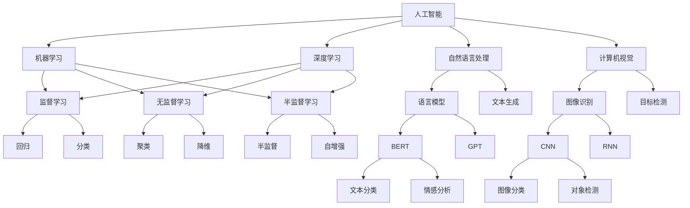
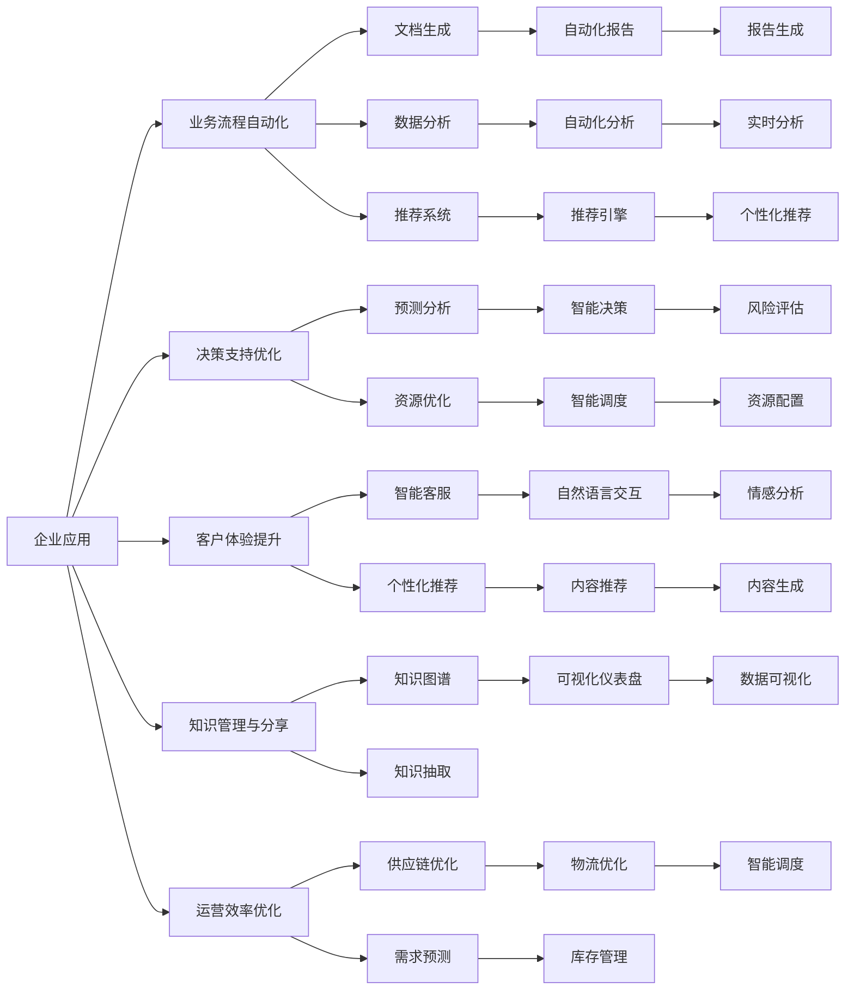
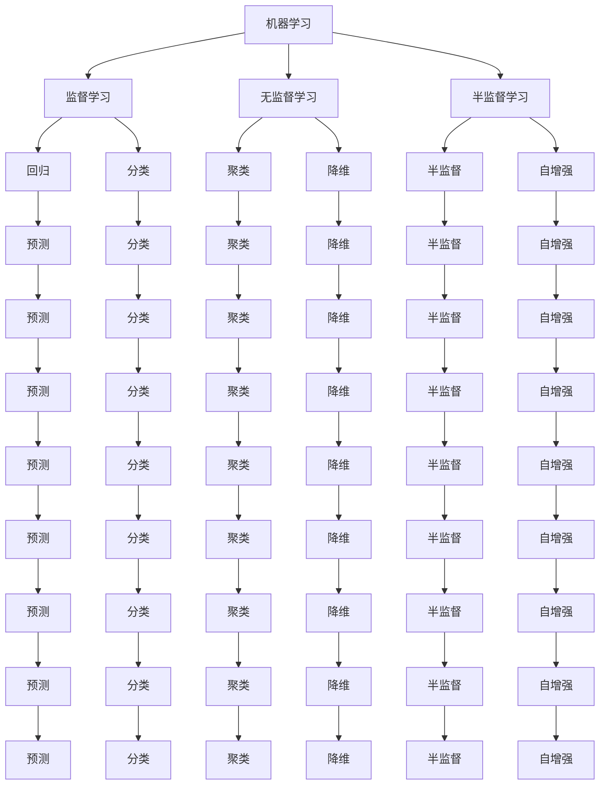
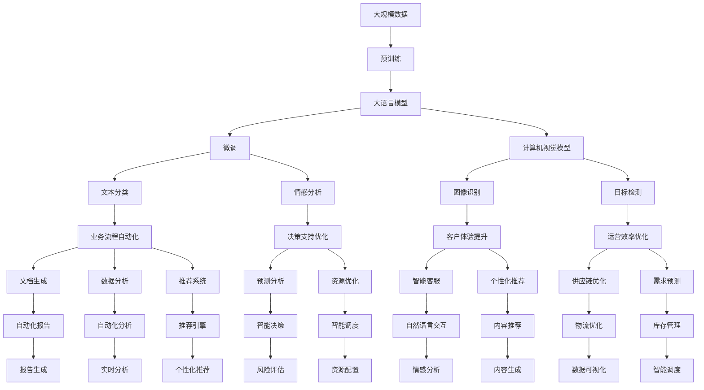

                 

## 1. 背景介绍

### 1.1 问题由来
人工智能（AI）技术在过去十年中取得了令人瞩目的进展，从深度学习到自然语言处理（NLP）、计算机视觉（CV）、机器人学等各个领域，都在不断突破和创新。尤其是在企业领域，AI技术正在重新定义业务流程、提高运营效率、优化决策支持、增强客户体验等方面发挥着越来越重要的作用。

AI技术的快速发展，离不开深度学习模型的支撑，尤其是基于深度神经网络的大规模预训练模型（如BERT、GPT等）的突破。这些模型通过在海量无标签数据上进行预训练，学习到了丰富的通用语言知识和视觉特征，能够处理复杂的业务需求，并在特定任务上进行微调，实现高性能和低成本的业务应用。

### 1.2 问题核心关键点
AI技术在企业中的应用，主要集中在以下几个关键点：

- **业务流程自动化**：通过AI技术，自动化处理重复性高、规则明确的任务，如文档生成、数据分析、推荐系统等，大幅提升效率，降低人工错误。
- **决策支持优化**：AI系统能够利用大数据分析和机器学习技术，提供精准的预测和决策支持，帮助企业快速响应市场变化，优化资源配置。
- **客户体验提升**：AI技术在自然语言处理、计算机视觉等领域的突破，带来了智能客服、个性化推荐、内容推荐、图像识别等应用，提升客户满意度。
- **知识管理与分享**：AI技术能够自动整理、抽取和关联知识，构建企业知识图谱，促进知识的传递和共享，加速创新迭代。
- **运营效率优化**：AI技术在物流、制造、金融等领域的应用，通过优化供应链、预测需求、智能调度等，大幅提高企业的运营效率和效益。

### 1.3 问题研究意义
AI技术在企业中的应用，对于提高企业竞争力、降低运营成本、提升客户体验具有重要意义：

- **成本节约**：自动化处理重复性任务，减少人工成本和时间，降低运营复杂度。
- **效率提升**：通过AI技术进行预测和优化，快速响应市场变化，提高业务处理速度和准确性。
- **决策支持**：提供基于数据的预测和建议，帮助企业做出更精准的决策，规避风险。
- **客户满意**：通过智能客服、个性化推荐等应用，提升客户体验，增加用户黏性和忠诚度。
- **知识驱动**：自动化的知识管理与分享，促进组织创新，加速产品和服务迭代。

## 2. 核心概念与联系

### 2.1 核心概念概述

为了更好地理解AI技术在企业中的应用，本节将介绍几个密切相关的核心概念：

- **人工智能（AI）**：通过模拟人类的智能行为，使机器能够自主学习、推理和决策的技术。
- **机器学习（ML）**：一种通过数据训练模型，使机器能够从经验中学习和改进的技术。
- **深度学习（DL）**：机器学习的一种高级形式，利用多层次神经网络对复杂数据进行学习和处理。
- **自然语言处理（NLP）**：使计算机能够理解、处理和生成人类语言的技术。
- **计算机视觉（CV）**：使计算机能够“看”和理解图像、视频等视觉数据的技术。
- **知识图谱（KG）**：将大量结构化和非结构化数据整合成图形结构，用于知识管理和推理。

这些概念之间的逻辑关系可以通过以下Mermaid流程图来展示：



这个流程图展示了几大AI核心概念及其之间的关系：

1. **人工智能**：包括机器学习、深度学习等子领域。
2. **机器学习**：分为监督学习、无监督学习和半监督学习等。
3. **深度学习**：利用多层次神经网络处理复杂数据。
4. **自然语言处理**：基于语言模型和生成模型，实现文本分类、情感分析等任务。
5. **计算机视觉**：基于CNN、RNN等网络，实现图像识别、目标检测等任务。
6. **知识图谱**：整合结构化和非结构化数据，支持知识管理和推理。

这些概念共同构成了AI技术在企业应用的框架，为企业数字化转型提供了有力支持。通过理解这些核心概念，我们可以更好地把握AI技术的应用方向和优化路径。

### 2.2 概念间的关系

这些核心概念之间存在着紧密的联系，形成了AI技术在企业应用的整体生态系统。下面我通过几个Mermaid流程图来展示这些概念之间的关系。

#### 2.2.1 AI技术的应用领域



这个流程图展示了AI技术在企业中应用的几个主要领域及其相关技术：

1. **业务流程自动化**：利用文档生成、数据分析、推荐系统等技术，自动化处理各种任务。
2. **决策支持优化**：通过预测分析、资源优化等技术，提供精准的决策支持。
3. **客户体验提升**：通过智能客服、个性化推荐等技术，提升客户满意度。
4. **知识管理与分享**：利用知识图谱、知识抽取等技术，促进知识的整理和传播。
5. **运营效率优化**：通过供应链优化、需求预测、智能调度等技术，提高运营效率。

#### 2.2.2 机器学习在企业中的应用



这个流程图展示了机器学习在企业中应用的各个子领域及其相关技术：

1. **监督学习**：通过回归、分类等技术，提供预测和分类支持。
2. **无监督学习**：通过聚类、降维等技术，发现数据的内在结构。
3. **半监督学习**：利用少量标注数据和大量未标注数据，提高模型的泛化能力。
4. **回归**：通过预测技术，提供数值预测支持。
5. **分类**：通过分类技术，提供标签预测支持。
6. **聚类**：通过相似性分析，发现数据的内在分组。
7. **降维**：通过数据压缩技术，降低数据维度。
8. **自增强**：通过反馈学习技术，不断提升模型性能。

### 2.3 核心概念的整体架构

最后，我们用一个综合的流程图来展示这些核心概念在企业应用中的整体架构：



这个综合流程图展示了从数据预处理到模型微调，再到应用部署的完整过程。企业中的AI应用，通常通过预训练语言模型或计算机视觉模型，进行微调以适配特定任务，然后通过自动化报告、智能决策等技术，提升企业的运营效率和客户体验。

通过这些流程图，我们可以更清晰地理解AI技术在企业应用中的各个环节和关键技术，为后续深入讨论具体的AI技术应用提供基础。

## 3. 核心算法原理 & 具体操作步骤
### 3.1 算法原理概述

AI技术在企业中的应用，主要依赖于机器学习模型的构建和优化。其核心思想是：通过数据驱动的方式，训练出能够自动识别和处理数据的模型，然后将其应用于具体的业务场景中，实现自动化、智能化和高效化的业务处理。

形式化地，假设企业的数据集为 $D=\{(x_i,y_i)\}_{i=1}^N, x_i \in \mathcal{X}, y_i \in \mathcal{Y}$，其中 $\mathcal{X}$ 为输入空间，$\mathcal{Y}$ 为输出空间，$y_i$ 为标签。

定义模型 $M_{\theta}$ 在输入 $x$ 上的输出为 $\hat{y}=M_{\theta}(x) \in \mathcal{Y}$，目标是最小化预测输出与真实标签之间的差异，即：

$$
\mathcal{L}(\theta) = \frac{1}{N}\sum_{i=1}^N \ell(M_{\theta}(x_i),y_i)
$$

其中 $\ell$ 为损失函数，用于衡量模型输出与真实标签之间的差异。常见的损失函数包括均方误差损失、交叉熵损失等。

通过梯度下降等优化算法，模型不断更新参数 $\theta$，最小化损失函数 $\mathcal{L}$，使得模型输出逼近真实标签。在实际应用中，通常会通过分批次训练、交叉验证等方法，优化模型性能。

### 3.2 算法步骤详解

AI技术在企业中的应用，一般包括以下几个关键步骤：

**Step 1: 数据准备**
- 收集企业内外的相关数据，包括历史业务数据、客户数据、市场数据等。
- 对数据进行预处理，包括数据清洗、特征工程、数据划分等。

**Step 2: 模型选择与构建**
- 根据应用场景，选择合适的机器学习模型，如线性回归、决策树、随机森林、深度神经网络等。
- 利用训练数据集，训练出初始模型，并进行交叉验证，评估模型性能。

**Step 3: 模型优化**
- 调整模型超参数，如学习率、正则化参数、批大小等，优化模型性能。
- 应用正则化技术，如L2正则、Dropout等，防止过拟合。
- 引入自动化技术，如自动化报告生成、自动化分析等，提升模型效率。

**Step 4: 模型部署**
- 将训练好的模型部署到生产环境中，进行实时处理。
- 设计API接口，方便业务系统调用模型服务。
- 进行系统集成，实现与企业现有系统的无缝对接。

**Step 5: 持续学习与优化**
- 定期收集新数据，重新训练模型，保持模型性能。
- 引入在线学习技术，支持模型在运行过程中的动态更新。
- 进行模型监控和评估，及时发现和修复模型问题。

以上是AI技术在企业中的主要应用流程。在实际应用中，还需要针对具体业务场景，对各环节进行优化设计，如改进数据质量、优化模型架构、调整超参数等，以进一步提升模型性能和应用效果。

### 3.3 算法优缺点

AI技术在企业中的应用，具有以下优点：

1. **自动化处理**：通过机器学习模型，自动化处理大量重复性、规则明确的任务，大幅提升效率，降低人工成本。
2. **数据驱动决策**：通过数据驱动的方式，提供精准的预测和决策支持，帮助企业快速响应市场变化，优化资源配置。
3. **客户体验提升**：通过智能客服、个性化推荐等技术，提升客户满意度，增加用户黏性和忠诚度。
4. **知识驱动创新**：通过自动化的知识管理与分享，促进组织创新，加速产品和服务迭代。

然而，AI技术在企业中的应用，也存在一些缺点：

1. **数据质量要求高**：高质量、完整的数据是模型训练的基础，数据缺失或噪声会影响模型性能。
2. **模型复杂度大**：大规模、复杂的模型需要较高的计算资源和存储资源，对企业技术能力提出挑战。
3. **算法可解释性不足**：许多AI模型具有“黑盒”特征，难以解释其内部工作机制和决策逻辑，影响应用可信度。
4. **安全与隐私风险**：AI模型可能学习到有害、敏感的信息，造成数据泄露和隐私风险。
5. **技术成本高**：AI技术的开发、部署、维护需要较高的技术成本和专业人才，对企业投资提出要求。

尽管存在这些缺点，AI技术在企业中的应用前景仍然广阔，其核心价值在于通过自动化和智能化，提升业务效率和客户体验，为企业的数字化转型提供动力。

### 3.4 算法应用领域

AI技术在企业中的应用，已经渗透到各个业务领域，涵盖从客户服务到运营管理，从市场营销到供应链管理等多个方面。以下是一些典型的应用领域：

- **客户服务**：智能客服、语音识别、情感分析等，提升客户体验。
- **市场营销**：客户画像、推荐系统、广告投放优化等，提升客户转化率。
- **供应链管理**：需求预测、库存管理、物流优化等，提高供应链效率。
- **运营管理**：生产调度、质量控制、设备维护等，优化运营效率。
- **财务管理**：风险评估、信用评分、财务报表分析等，提升财务决策水平。

除了这些主流应用领域，AI技术还在医疗、能源、制造等多个行业展现出巨大的应用潜力，为传统行业的数字化转型提供了新的技术和方案。

## 4. 数学模型和公式 & 详细讲解 & 举例说明（备注：数学公式请使用latex格式，latex嵌入文中独立段落使用 $$，段落内使用 $)
### 4.1 数学模型构建

在企业应用中，常用的AI模型包括线性回归、决策树、随机森林、深度神经网络等。以线性回归模型为例，其数学模型构建如下：

假设模型的输入为 $x \in \mathbb{R}^d$，输出为 $y \in \mathbb{R}$，模型的线性回归函数为：

$$
y = \theta^T x
$$

其中 $\theta$ 为模型的参数向量。模型的损失函数为均方误差损失：

$$
\ell(y,\hat{y}) = \frac{1}{2}\|y-\hat{y}\|^2
$$

目标是最小化损失函数，即：

$$
\mathcal{L}(\theta) = \frac{1}{N}\sum_{i=1}^N \ell(y_i,\hat{y}_i)
$$

其中 $\hat{y}_i = \theta^T x_i$ 为模型的预测输出。通过梯度下降等优化算法，模型不断更新参数 $\theta$，最小化损失函数 $\mathcal{L}$，使得模型输出逼近真实标签。

### 4.2 公式推导过程

以线性回归为例，其公式推导过程如下：

假设数据集 $D=\{(x_i,y_i)\}_{i=1}^N$，其中 $x_i \in \mathbb{R}^d$，$y_i \in \mathbb{R}$。

模型 $M_{\theta}$ 的线性回归函数为：

$$
y = \theta^T x
$$

其中 $\theta$ 为模型的参数向量。

模型的损失函数为均方误差损失：

$$
\ell(y,\hat{y}) = \frac{1}{2}\|y-\hat{y}\|^2
$$

目标是最小化损失函数，即：

$$
\mathcal{L}(\theta) = \frac{1}{N}\sum_{i=1}^N \ell(y_i,\hat{y}_i)
$$

其中 $\hat{y}_i = \theta^T x_i$ 为模型的预测输出。

对损失函数求偏导，得到：

$$
\frac{\partial \mathcal{L}(\theta)}{\partial \theta_j} = \frac{1}{N}\sum_{i=1}^N (y_i - \hat{y}_i)x_{ij}
$$

其中 $x_{ij}$ 为 $x_i$ 的第 $j$ 个特征值。

通过梯度下降等优化算法，模型不断更新参数 $\theta$，最小化损失函数 $\mathcal{L}$，使得模型输出逼近真实标签。

### 4.3 案例分析与讲解

以线性回归模型在需求预测中的应用为例，其步骤包括：

1. **数据准备**：收集历史销售数据，包括时间、销售量、促销活动等。
2. **模型构建**：选择线性回归模型，利用训练数据集训练出初始模型。
3. **模型优化**：调整模型超参数，如学习率、正则化参数等，优化模型性能。
4. **模型部署**：将训练好的模型部署到生产环境中，进行实时需求预测。
5. **持续学习与优化**：定期收集新数据，重新训练模型，保持模型性能。

通过线性回归模型，企业可以基于历史数据预测未来的需求量，优化库存管理，减少库存积压，提升运营效率。

## 5. 项目实践：代码实例和详细解释说明
### 5.1 开发环境搭建

在进行企业AI应用开发前，我们需要准备好开发环境。以下是使用Python进行PyTorch开发的环境配置流程：

1. 安装Anaconda：从官网下载并安装Anaconda，用于创建独立的Python环境。

2. 创建并激活虚拟环境：
```bash
conda create -n pytorch-env python=3.8 
conda activate pytorch-env
```

3. 安装PyTorch：根据CUDA版本，从官网获取对应的安装命令。例如：
```bash
conda install pytorch torchvision torchaudio cudatoolkit=11.1 -c pytorch -c conda-forge
```

4. 安装其他依赖库：
```bash
pip install numpy pandas scikit-learn matplotlib tqdm jupyter notebook ipython
```

完成上述步骤后，即可在`pytorch-env`环境中开始AI应用开发。

### 5.2 源代码详细实现

这里我们以需求预测为例，给出使用PyTorch进行线性回归模型的PyTorch代码实现。

首先，定义数据处理函数：

```python
import pandas as pd
import numpy as np
from sklearn.model_selection import train_test_split
from sklearn.preprocessing import StandardScaler
from torch.utils.data import Dataset, DataLoader
import torch
import torch.nn as nn
import torch.optim as optim

class DemandData(Dataset):
    def __init__(self, data, target, test_ratio=0.2, scale=True):
        self.data = data
        self.target = target
        self.test_ratio = test_ratio
        self.scale = scale
        
        self.train_data, self.test_data, self.train_target, self.test_target = train_test_split(data, target, test_size=test_ratio, random_state=42)
        if scale:
            self.scaler = StandardScaler()
            self.train_data = self.scaler.fit_transform(self.train_data)
            self.test_data = self.scaler.transform(self.test_data)
            self.train_target = self.scaler.fit_transform(self.train_target.reshape(-1, 1)).reshape(-1)
            self.test_target = self.scaler.transform(self.test_target.reshape(-1, 1)).reshape(-1)
            
    def __len__(self):
        return len(self.train_data)
    
    def __getitem__(self, item):
        x = self.train_data[item]
        y = self.train_target[item]
        return x, y
```

然后，定义模型和优化器：

```python
class LinearRegression(nn.Module):
    def __init__(self, input_dim):
        super(LinearRegression, self).__init__()
        self.linear = nn.Linear(input_dim, 1)
        
    def forward(self, x):
        return self.linear(x)

model = LinearRegression(input_dim=3)
optimizer = optim.Adam(model.parameters(), lr=0.01)
```

接着，定义训练和评估函数：

```python
device = torch.device('cuda' if torch.cuda.is_available() else 'cpu')
model.to(device)

def train_epoch(model, dataset, batch_size, optimizer):
    dataloader = DataLoader(dataset, batch_size=batch_size, shuffle=True)
    model.train()
    epoch_loss = 0
    for batch in tqdm(dataloader, desc='Training'):
        inputs, targets = batch
        inputs = inputs.to(device)
        targets = targets.to(device)
        model.zero_grad()
        outputs = model(inputs)
        loss = nn.MSELoss()(outputs, targets)
        epoch_loss += loss.item()
        loss.backward()
        optimizer.step()
    return epoch_loss / len(dataloader)

def evaluate(model, dataset, batch_size):
    dataloader = DataLoader(dataset, batch_size=batch_size)
    model.eval()
    preds = []
    with torch.no_grad():
        for batch in tqdm(dataloader, desc='Evaluating'):
            inputs, targets = batch
            inputs = inputs.to(device)
            targets = targets.to(device)
            outputs = model(inputs)
            preds.append(outputs.cpu().numpy())
                
    print(np.mean(np.square(preds - targets)))
```

最后，启动训练流程并在测试集上评估：

```python
epochs = 100
batch_size = 32

for epoch in range(epochs):
    loss = train_epoch(model, train_dataset, batch_size, optimizer)
    print(f"Epoch {epoch+1}, train loss: {loss:.3f}")
    
    print(f"Epoch {epoch+1}, test MSE:")
    evaluate(model, test_dataset, batch_size)
```

以上就是使用PyTorch进行需求预测的完整代码实现。可以看到，得益于PyTorch的强大封装，我们可以用相对简洁的代码完成线性回归模型的构建和微调。

### 5.3 代码解读与分析

让我们再详细解读一下关键代码的实现细节：


