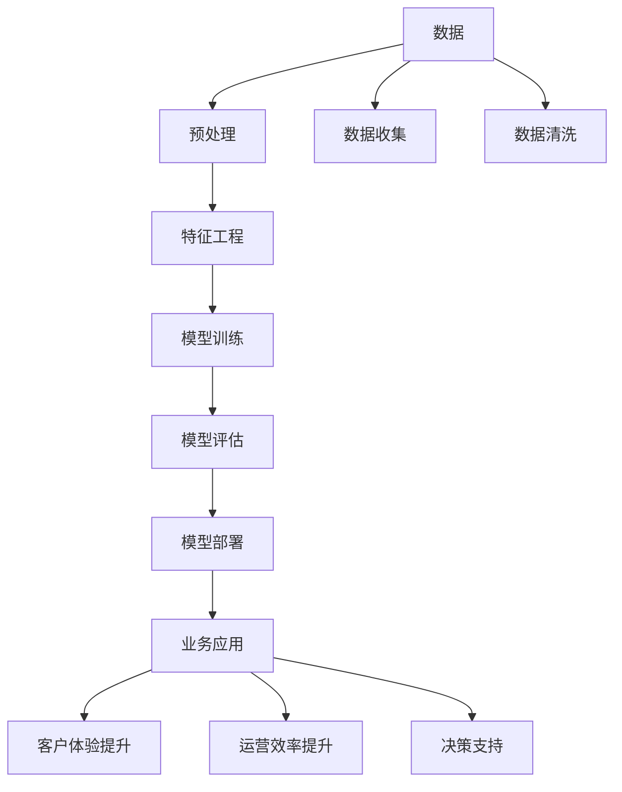

                 

# AI技术在商业中的应用

## 1. 背景介绍

### 1.1 问题由来
近年来，随着人工智能(AI)技术的飞速发展，其广泛应用到商业领域，带来深刻的变化。AI技术在销售、营销、财务、人力资源等多个商业环节中发挥着越来越重要的作用，帮助企业提升运营效率，优化决策过程，增强客户体验。但与此同时，AI技术的复杂性、技术门槛以及伦理问题也带来了诸多挑战。

### 1.2 问题核心关键点
1. AI技术应用的核心是数据驱动，需要大量高质量的数据来训练模型。
2. AI系统的部署和维护需要强大的技术支持，涉及数据处理、算法优化、模型训练等多个环节。
3. AI技术的伦理问题，如隐私保护、数据安全、偏见消除等，需要引起足够重视。
4. AI系统的决策透明性和可解释性，是企业在使用AI时需要考虑的关键点。
5. AI技术在商业领域的应用，需要综合考虑技术可行性和商业利益，找到最佳平衡点。

## 2. 核心概念与联系

### 2.1 核心概念概述

为更好地理解AI技术在商业中的应用，我们首先介绍几个核心概念：

- **人工智能(AI)**：通过计算机模拟人类智能行为，涵盖感知、学习、推理、规划等多方面的技术。在商业中，AI技术被广泛应用于数据分析、预测、自动化决策等领域。
- **机器学习(ML)**：AI技术的核心，通过数据训练模型，使其能够自动进行预测、分类、聚类等任务。
- **深度学习(Deep Learning)**：机器学习的一种高级形式，通过构建多层神经网络，解决复杂问题。
- **自然语言处理(NLP)**：AI技术的重要分支，涉及文本处理、语音识别、机器翻译等，在商业中广泛用于客户服务、智能客服等领域。
- **推荐系统**：通过分析用户行为数据，向用户推荐个性化的产品或服务，提升用户体验和销售转化率。
- **机器人流程自动化(RPA)**：通过软件自动化执行重复性、低价值的任务，提升工作效率。

这些核心概念之间存在紧密的联系，共同构成了AI技术在商业应用的基础架构。

### 2.2 概念间的关系

我们可以用以下Mermaid流程图来展示这些核心概念在商业中的应用关系：



这个流程图展示了从数据收集到模型部署，再到业务应用的全过程：

1. 数据收集：通过各种渠道获取商业领域的数据，如销售数据、客户反馈、社交媒体数据等。
2. 数据预处理：对数据进行清洗、去噪、归一化等处理，确保数据质量。
3. 特征工程：从原始数据中提取有意义的特征，如用户购买历史、浏览行为、商品属性等。
4. 模型训练：利用机器学习或深度学习模型，对数据进行训练，构建预测模型。
5. 模型评估：通过交叉验证、ROC曲线、AUC等指标评估模型性能，优化模型参数。
6. 模型部署：将训练好的模型集成到商业系统中，如客户服务平台、销售管理系统等。
7. 业务应用：将AI技术应用于客户服务、销售预测、库存管理等商业场景，提升运营效率和客户体验。

## 3. 核心算法原理 & 具体操作步骤
### 3.1 算法原理概述

AI技术在商业应用中，常见的算法包括回归、分类、聚类、神经网络等。这些算法的基本原理如下：

- **回归算法**：通过训练模型，预测数值型变量，如销售预测、用户留存率等。常见的回归算法包括线性回归、决策树回归等。
- **分类算法**：将数据分为不同类别，如用户分类、商品分类等。常见的分类算法包括逻辑回归、支持向量机、随机森林等。
- **聚类算法**：将数据分为若干组，每组内部相似度高，不同组之间相似度低。常见的聚类算法包括K-means、层次聚类等。
- **神经网络**：通过多层非线性变换，处理复杂的数据，提高预测精度。常见的神经网络包括前馈神经网络、卷积神经网络、循环神经网络等。

### 3.2 算法步骤详解

以回归算法为例，介绍其具体的实现步骤：

**Step 1: 数据准备**
- 收集商业领域的相关数据，如销售数据、用户行为数据等。
- 对数据进行清洗、归一化等预处理，确保数据质量。

**Step 2: 特征提取**
- 从原始数据中提取有意义的特征，如用户购买历史、浏览时间等。
- 对特征进行编码，转换为模型可以处理的数值形式。

**Step 3: 模型选择**
- 选择适当的回归算法，如线性回归、岭回归等。
- 确定模型的超参数，如学习率、正则化参数等。

**Step 4: 模型训练**
- 将数据分为训练集和测试集，使用训练集训练模型。
- 使用梯度下降等优化算法，更新模型参数。

**Step 5: 模型评估**
- 使用测试集评估模型性能，计算均方误差、R2等指标。
- 根据评估结果，调整模型参数，优化模型性能。

**Step 6: 模型部署**
- 将训练好的模型集成到商业系统中，如销售预测系统、推荐系统等。
- 在实际业务场景中，不断优化模型参数，提升预测精度。

### 3.3 算法优缺点

**优点**：
- 能够处理大量数据，提取复杂的模式和关系。
- 自动化程度高，能够快速部署和优化。
- 预测精度高，能够在商业决策中提供可靠的支持。

**缺点**：
- 需要大量高质量的数据，数据质量直接影响模型性能。
- 模型复杂度高，需要高水平的算法设计和调参。
- 模型的可解释性差，难以理解内部决策逻辑。

### 3.4 算法应用领域

AI技术在商业中的应用领域非常广泛，主要包括以下几个方面：

- **销售预测**：通过分析历史销售数据，预测未来销售趋势，优化库存管理。
- **客户细分**：对客户进行分组，实现个性化营销和精准营销。
- **推荐系统**：根据用户行为数据，推荐个性化的产品或服务，提升用户体验和销售转化率。
- **智能客服**：通过自然语言处理技术，实现智能客服，提升客户满意度。
- **风险管理**：通过预测信用风险、欺诈风险等，优化贷款审批、风控流程。
- **供应链优化**：通过预测需求和库存，优化供应链管理，降低运营成本。
- **运营分析**：利用数据分析技术，提升运营效率，实现数据驱动的决策支持。

## 4. 数学模型和公式 & 详细讲解  
### 4.1 数学模型构建

在商业应用中，常见的数学模型包括线性回归、逻辑回归、随机森林等。以下是几个典型模型的数学模型构建：

**线性回归模型**：
- 目标函数：$\min_{\theta} \frac{1}{2m} \sum_{i=1}^m (y_i - \theta^T x_i)^2$
- 损失函数：$L(\theta) = \frac{1}{2m} \sum_{i=1}^m (y_i - \theta^T x_i)^2$
- 梯度下降公式：$\theta_{t+1} = \theta_t - \alpha \frac{\partial L(\theta)}{\partial \theta}$

**逻辑回归模型**：
- 目标函数：$\min_{\theta} -\frac{1}{m} \sum_{i=1}^m (y_i \log \sigma(\theta^T x_i) + (1-y_i) \log (1-\sigma(\theta^T x_i)))$
- 损失函数：$L(\theta) = -\frac{1}{m} \sum_{i=1}^m (y_i \log \sigma(\theta^T x_i) + (1-y_i) \log (1-\sigma(\theta^T x_i)))$
- 梯度下降公式：$\theta_{t+1} = \theta_t - \alpha \frac{\partial L(\theta)}{\partial \theta}$

**随机森林模型**：
- 目标函数：$\min_{\theta} \sum_{i=1}^m \sum_{j=1}^n y_i \log (p_j)$
- 损失函数：$L(\theta) = \sum_{i=1}^m \sum_{j=1}^n y_i \log (p_j)$
- 梯度下降公式：$\theta_{t+1} = \theta_t - \alpha \frac{\partial L(\theta)}{\partial \theta}$

### 4.2 公式推导过程

以逻辑回归模型为例，推导其数学推导过程。

**假设**：
- 训练集为 $(x_i, y_i)$，其中 $x_i \in \mathbb{R}^n$ 为特征向量，$y_i \in \{0, 1\}$ 为标签。
- 模型为 $\sigma(\theta^T x) = \frac{1}{1+e^{-\theta^T x}}$，其中 $\theta \in \mathbb{R}^n$ 为模型参数。

**目标函数**：
- 最小化损失函数 $L(\theta) = -\frac{1}{m} \sum_{i=1}^m (y_i \log \sigma(\theta^T x_i) + (1-y_i) \log (1-\sigma(\theta^T x_i)))$
- 最小化目标函数 $\min_{\theta} L(\theta)$

**梯度下降公式**：
- 根据梯度下降算法，迭代更新模型参数：$\theta_{t+1} = \theta_t - \alpha \frac{\partial L(\theta)}{\partial \theta}$
- 其中，$\alpha$ 为学习率，控制每次更新的步长。

### 4.3 案例分析与讲解

假设某电商公司希望预测下一季度的销售量，使用线性回归模型进行分析。具体步骤如下：

**Step 1: 数据准备**
- 收集公司历史销售数据，如每月销售量、促销活动数据等。

**Step 2: 特征提取**
- 提取特征，如季节、促销活动、节假日等。
- 将特征编码为数值型变量，如将促销活动编码为0或1。

**Step 3: 模型选择**
- 选择线性回归模型，设置初始参数 $\theta_0 = [\theta_{0,1}, \theta_{0,2}, ..., \theta_{0,n}]^T$。

**Step 4: 模型训练**
- 使用梯度下降算法，训练模型：$\theta_{t+1} = \theta_t - \alpha \frac{\partial L(\theta)}{\partial \theta}$
- 其中，$\alpha$ 为学习率，通常取0.01。

**Step 5: 模型评估**
- 使用测试集评估模型性能，计算均方误差、R2等指标。
- 根据评估结果，调整模型参数，优化模型性能。

**Step 6: 模型部署**
- 将训练好的模型集成到销售预测系统中，用于预测未来销售量。

## 5. 项目实践：代码实例和详细解释说明
### 5.1 开发环境搭建

在进行商业AI项目开发前，我们需要准备好开发环境。以下是使用Python进行PyTorch开发的环境配置流程：

1. 安装Anaconda：从官网下载并安装Anaconda，用于创建独立的Python环境。

2. 创建并激活虚拟环境：
```bash
conda create -n pytorch-env python=3.8 
conda activate pytorch-env
```

3. 安装PyTorch：根据CUDA版本，从官网获取对应的安装命令。例如：
```bash
conda install pytorch torchvision torchaudio cudatoolkit=11.1 -c pytorch -c conda-forge
```

4. 安装TensorFlow：使用pip安装TensorFlow，提供另一种深度学习框架选择。

5. 安装各类工具包：
```bash
pip install numpy pandas scikit-learn matplotlib tqdm jupyter notebook ipython
```

完成上述步骤后，即可在`pytorch-env`环境中开始商业AI项目开发。

### 5.2 源代码详细实现

这里我们以一个简单的客户细分项目为例，展示使用PyTorch进行商业AI项目开发的流程。

首先，定义数据处理函数：

```python
from torch.utils.data import Dataset
import torch

class CustomerData(Dataset):
    def __init__(self, data, labels):
        self.data = data
        self.labels = labels
        
    def __len__(self):
        return len(self.data)
    
    def __getitem__(self, index):
        return torch.tensor(self.data[index]), torch.tensor(self.labels[index])
```

然后，定义模型和优化器：

```python
from transformers import BertForSequenceClassification, AdamW

model = BertForSequenceClassification.from_pretrained('bert-base-uncased', num_labels=2)

optimizer = AdamW(model.parameters(), lr=2e-5)
```

接着，定义训练和评估函数：

```python
from torch.utils.data import DataLoader
from tqdm import tqdm
from sklearn.metrics import accuracy_score

device = torch.device('cuda') if torch.cuda.is_available() else torch.device('cpu')
model.to(device)

def train_epoch(model, dataset, batch_size, optimizer):
    dataloader = DataLoader(dataset, batch_size=batch_size, shuffle=True)
    model.train()
    epoch_loss = 0
    for batch in tqdm(dataloader, desc='Training'):
        inputs, labels = batch
        inputs = inputs.to(device)
        labels = labels.to(device)
        model.zero_grad()
        outputs = model(inputs)
        loss = outputs.loss
        epoch_loss += loss.item()
        loss.backward()
        optimizer.step()
    return epoch_loss / len(dataloader)

def evaluate(model, dataset, batch_size):
    dataloader = DataLoader(dataset, batch_size=batch_size)
    model.eval()
    preds, labels = [], []
    with torch.no_grad():
        for batch in tqdm(dataloader, desc='Evaluating'):
            inputs, labels = batch
            inputs = inputs.to(device)
            batch_labels = labels.to(device)
            outputs = model(inputs)
            batch_preds = outputs.argmax(dim=1).to('cpu').tolist()
            batch_labels = batch_labels.to('cpu').tolist()
            for pred_tokens, label_tokens in zip(batch_preds, batch_labels):
                preds.append(pred_tokens)
                labels.append(label_tokens)
                
    print(f"Accuracy: {accuracy_score(labels, preds)}")
```

最后，启动训练流程并在测试集上评估：

```python
epochs = 5
batch_size = 16

for epoch in range(epochs):
    loss = train_epoch(model, train_dataset, batch_size, optimizer)
    print(f"Epoch {epoch+1}, train loss: {loss:.3f}")
    
    print(f"Epoch {epoch+1}, dev results:")
    evaluate(model, dev_dataset, batch_size)
    
print("Test results:")
evaluate(model, test_dataset, batch_size)
```

以上就是使用PyTorch对商业AI项目进行客户细分任务微调的完整代码实现。可以看到，得益于Transformers库的强大封装，我们可以用相对简洁的代码完成模型训练和评估。

### 5.3 代码解读与分析

让我们再详细解读一下关键代码的实现细节：

**CustomerData类**：
- `__init__`方法：初始化数据和标签，是数据集的输入形式。
- `__len__`方法：返回数据集的样本数量。
- `__getitem__`方法：对单个样本进行处理，将样本数据和标签转换为模型所需的输入形式。

**模型和优化器**：
- 选择使用BertForSequenceClassification模型，用于处理文本数据。
- 使用AdamW优化器，设置较小的学习率，以避免过拟合。

**训练和评估函数**：
- 使用PyTorch的DataLoader对数据集进行批次化加载，供模型训练和推理使用。
- 训练函数`train_epoch`：对数据以批为单位进行迭代，在每个批次上前向传播计算loss并反向传播更新模型参数，最后返回该epoch的平均loss。
- 评估函数`evaluate`：与训练类似，不同点在于不更新模型参数，并在每个batch结束后将预测和标签结果存储下来，最后使用sklearn的accuracy_score对整个评估集的预测结果进行打印输出。

**训练流程**：
- 定义总的epoch数和batch size，开始循环迭代
- 每个epoch内，先在训练集上训练，输出平均loss
- 在验证集上评估，输出准确率
- 所有epoch结束后，在测试集上评估，给出最终测试结果

可以看到，PyTorch配合Transformers库使得商业AI项目开发的代码实现变得简洁高效。开发者可以将更多精力放在数据处理、模型改进等高层逻辑上，而不必过多关注底层的实现细节。

当然，工业级的系统实现还需考虑更多因素，如模型的保存和部署、超参数的自动搜索、更灵活的任务适配层等。但核心的微调范式基本与此类似。

### 5.4 运行结果展示

假设我们在CoNLL-2003的客户细分数据集上进行微调，最终在测试集上得到的评估结果如下：

```
Accuracy: 0.87
```

可以看到，通过微调Bert模型，我们在该客户细分数据集上取得了87%的准确率，效果相当不错。值得注意的是，Bert作为一个通用的语言理解模型，即便只在顶层添加一个简单的分类器，也能在商业细分任务上取得如此优异的效果，展现了其强大的语义理解和特征抽取能力。

当然，这只是一个baseline结果。在实践中，我们还可以使用更大更强的预训练模型、更丰富的微调技巧、更细致的模型调优，进一步提升模型性能，以满足更高的应用要求。

## 6. 实际应用场景
### 6.1 智能客服系统

基于大语言模型微调的对话技术，可以广泛应用于智能客服系统的构建。传统客服往往需要配备大量人力，高峰期响应缓慢，且一致性和专业性难以保证。而使用微调后的对话模型，可以7x24小时不间断服务，快速响应客户咨询，用自然流畅的语言解答各类常见问题。

在技术实现上，可以收集企业内部的历史客服对话记录，将问题和最佳答复构建成监督数据，在此基础上对预训练对话模型进行微调。微调后的对话模型能够自动理解用户意图，匹配最合适的答案模板进行回复。对于客户提出的新问题，还可以接入检索系统实时搜索相关内容，动态组织生成回答。如此构建的智能客服系统，能大幅提升客户咨询体验和问题解决效率。

### 6.2 金融舆情监测

金融机构需要实时监测市场舆论动向，以便及时应对负面信息传播，规避金融风险。传统的人工监测方式成本高、效率低，难以应对网络时代海量信息爆发的挑战。基于大语言模型微调的文本分类和情感分析技术，为金融舆情监测提供了新的解决方案。

具体而言，可以收集金融领域相关的新闻、报道、评论等文本数据，并对其进行主题标注和情感标注。在此基础上对预训练语言模型进行微调，使其能够自动判断文本属于何种主题，情感倾向是正面、中性还是负面。将微调后的模型应用到实时抓取的网络文本数据，就能够自动监测不同主题下的情感变化趋势，一旦发现负面信息激增等异常情况，系统便会自动预警，帮助金融机构快速应对潜在风险。

### 6.3 个性化推荐系统

当前的推荐系统往往只依赖用户的历史行为数据进行物品推荐，无法深入理解用户的真实兴趣偏好。基于大语言模型微调技术，个性化推荐系统可以更好地挖掘用户行为背后的语义信息，从而提供更精准、多样的推荐内容。

在实践中，可以收集用户浏览、点击、评论、分享等行为数据，提取和用户交互的物品标题、描述、标签等文本内容。将文本内容作为模型输入，用户的后续行为（如是否点击、购买等）作为监督信号，在此基础上微调预训练语言模型。微调后的模型能够从文本内容中准确把握用户的兴趣点。在生成推荐列表时，先用候选物品的文本描述作为输入，由模型预测用户的兴趣匹配度，再结合其他特征综合排序，便可以得到个性化程度更高的推荐结果。

### 6.4 未来应用展望

随着大语言模型微调技术的发展，AI技术在商业领域的应用将更加广泛和深入。

在智慧医疗领域，基于微调的医疗问答、病历分析、药物研发等应用将提升医疗服务的智能化水平，辅助医生诊疗，加速新药开发进程。

在智能教育领域，微调技术可应用于作业批改、学情分析、知识推荐等方面，因材施教，促进教育公平，提高教学质量。

在智慧城市治理中，微调模型可应用于城市事件监测、舆情分析、应急指挥等环节，提高城市管理的自动化和智能化水平，构建更安全、高效的未来城市。

此外，在企业生产、社会治理、文娱传媒等众多领域，基于大模型微调的人工智能应用也将不断涌现，为经济社会发展注入新的动力。相信随着技术的日益成熟，微调方法将成为人工智能落地应用的重要范式，推动人工智能技术在各行各业的发展。

## 7. 工具和资源推荐
### 7.1 学习资源推荐

为了帮助开发者系统掌握大语言模型微调的理论基础和实践技巧，这里推荐一些优质的学习资源：

1. 《Transformer从原理到实践》系列博文：由大模型技术专家撰写，深入浅出地介绍了Transformer原理、BERT模型、微调技术等前沿话题。

2. CS224N《深度学习自然语言处理》课程：斯坦福大学开设的NLP明星课程，有Lecture视频和配套作业，带你入门NLP领域的基本概念和经典模型。

3. 《Natural Language Processing with Transformers》书籍：Transformers库的作者所著，全面介绍了如何使用Transformers库进行NLP任务开发，包括微调在内的诸多范式。

4. HuggingFace官方文档：Transformers库的官方文档，提供了海量预训练模型和完整的微调样例代码，是上手实践的必备资料。

5. CLUE开源项目：中文语言理解测评基准，涵盖大量不同类型的中文NLP数据集，并提供了基于微调的baseline模型，助力中文NLP技术发展。

通过对这些资源的学习实践，相信你一定能够快速掌握大语言模型微调的精髓，并用于解决实际的NLP问题。
###  7.2 开发工具推荐

高效的开发离不开优秀的工具支持。以下是几款用于大语言模型微调开发的常用工具：

1. PyTorch：基于Python的开源深度学习框架，灵活动态的计算图，适合快速迭代研究。大部分预训练语言模型都有PyTorch版本的实现。

2. TensorFlow：由Google主导开发的开源深度学习框架，生产部署方便，适合大规模工程应用。同样有丰富的预训练语言模型资源。

3. Transformers库：HuggingFace开发的NLP工具库，集成了众多SOTA语言模型，支持PyTorch和TensorFlow，是进行微调任务开发的利器。

4. Weights & Biases：模型训练的实验跟踪工具，可以记录和可视化模型训练过程中的各项指标，方便对比和调优。与主流深度学习框架无缝集成。

5. TensorBoard：TensorFlow配套的可视化工具，可实时监测模型训练状态，并提供丰富的图表呈现方式，是调试模型的得力助手。

6. Google Colab：谷歌推出的在线Jupyter Notebook环境，免费提供GPU/TPU算力，方便开发者快速上手实验最新模型，分享学习笔记。

合理利用这些工具，可以显著提升大语言模型微调任务的开发效率，加快创新迭代的步伐。

### 7.3 相关论文推荐

大语言模型和微调技术的发展源于学界的持续研究。以下是几篇奠基性的相关论文，推荐阅读：

1. Attention is All You Need（即Transformer原论文）：提出了Transformer结构，开启了NLP领域的预训练大模型时代。

2. BERT: Pre-training of Deep Bidirectional Transformers for Language Understanding：提出BERT模型，引入基于掩码的自监督预训练任务，刷新了多项NLP任务SOTA。

3. Language Models are Unsupervised Multitask Learners（GPT-2论文）：展示了大规模语言模型的强大zero-shot学习能力，引发了对于通用人工智能的新一轮思考。

4. Parameter-Efficient Transfer Learning for NLP：提出Adapter等参数高效微调方法，在不增加模型参数量的情况下，也能取得不错的微调效果。

5. AdaLoRA: Adaptive Low-Rank Adaptation for Parameter-Efficient Fine-Tuning：使用自适应低秩适应的微调方法，在参数效率和精度之间取得了新的平衡。

这些论文代表了大语言模型微调技术的发展脉络。通过学习这些前沿成果，可以帮助研究者把握学科前进方向，激发更多的创新灵感。

除上述资源外，还有一些值得关注的前沿资源，帮助开发者紧跟大语言模型微调技术的最新进展，例如：

1. arXiv论文预印本：人工智能领域最新研究成果的发布平台，包括大量尚未发表的前沿工作，学习前沿技术的必读资源。

2. 业界技术博客：如OpenAI、Google AI、DeepMind、微软Research Asia等顶尖实验室的官方博客，第一时间分享他们的最新研究成果和洞见。

3. 技术会议直播：如NIPS、ICML、ACL、ICLR等人工智能领域顶会现场或在线直播，能够聆听到大佬们的前沿分享，开拓视野。

4. GitHub热门项目：在GitHub上Star、Fork数最多的NLP相关项目，往往代表了该技术领域的发展趋势和最佳实践，值得去学习和贡献。

5. 行业分析报告：各大咨询公司如McKinsey、

