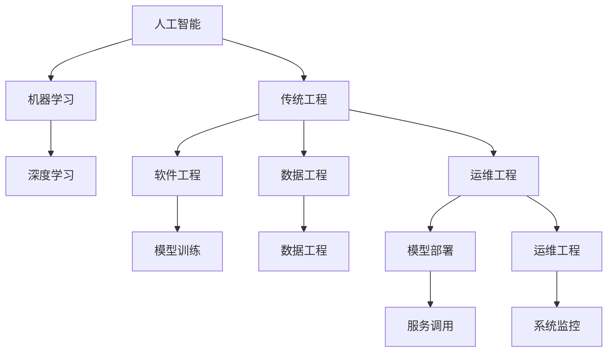
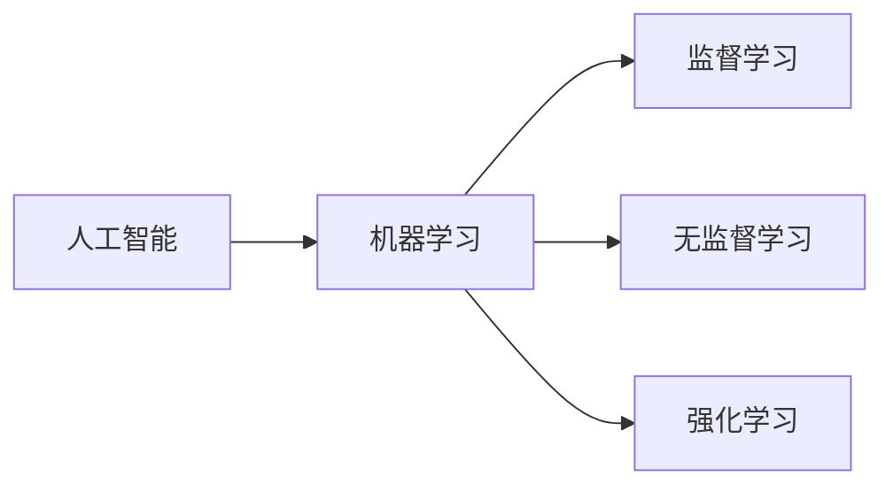
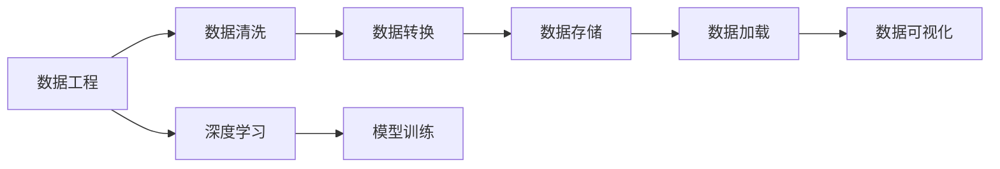
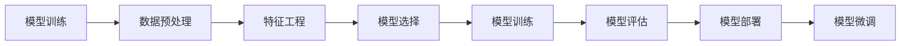
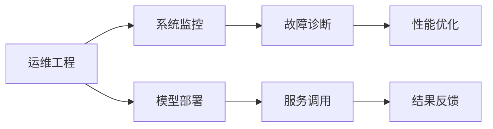
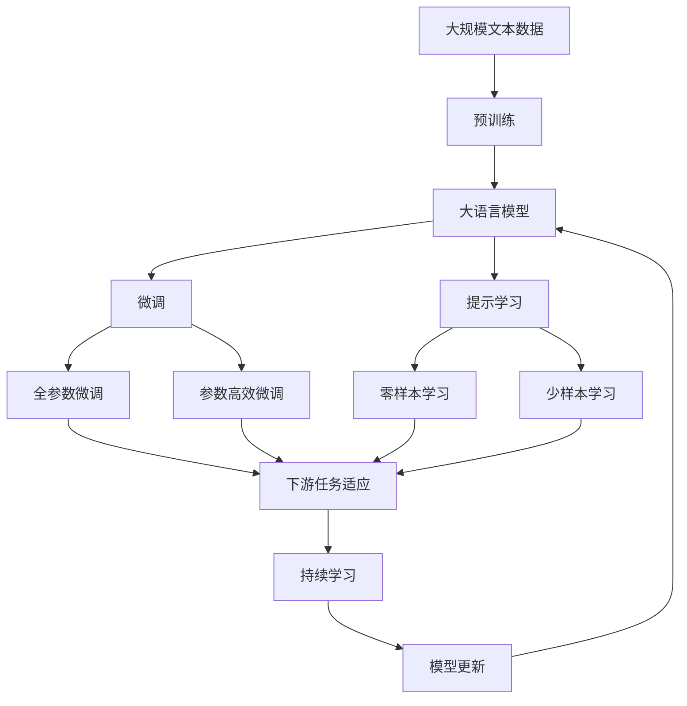

                 

# AI技术栈与传统工程的对比

> 关键词：人工智能,机器学习,深度学习,传统工程,软件工程,数据工程,运维工程,模型训练,模型部署,自动化,数据平台

## 1. 背景介绍

### 1.1 问题由来
随着人工智能(AI)技术的迅猛发展，其在各行各业的应用越来越广泛。AI技术栈与传统工程学科的区别越来越明显，这使得不少传统工程开发者对于AI技术的应用感到困惑。本文将从多个维度对比AI技术栈与传统工程，帮助开发者理解和掌握AI技术，并融入到工程实践中。

### 1.2 问题核心关键点
本文将从数据工程、模型训练、模型部署和运维工程四个方面对比AI技术栈与传统工程，帮助开发者了解AI技术的本质，并找到其与传统工程之间的差异和共通之处。

### 1.3 问题研究意义
了解AI技术栈与传统工程的差异和融合，有助于AI技术在实际工程项目中的应用。这不仅能够提升项目开发效率，还能促进技术融合，为AI技术的长远发展打下坚实基础。

## 2. 核心概念与联系

### 2.1 核心概念概述

为更好地理解AI技术栈与传统工程的对比，本节将介绍几个密切相关的核心概念：

- 人工智能(AI)：利用计算机技术和算法，模拟、扩展人类智能的科学。
- 机器学习(ML)：通过算法使计算机从数据中学习规律，并基于此规律进行预测或决策。
- 深度学习(Deep Learning)：一种机器学习技术，使用多层神经网络模型对数据进行训练。
- 传统工程：包括软件工程、数据工程和运维工程等，涉及软件设计、数据管理和系统运维等。
- 数据工程：涉及数据收集、清洗、转换、存储和分析等。
- 模型训练：通过算法训练数据集，优化模型参数，提高模型性能。
- 模型部署：将训练好的模型部署到生产环境，供业务系统调用。
- 运维工程：涉及系统监控、故障诊断和性能优化等。

这些核心概念之间的逻辑关系可以通过以下Mermaid流程图来展示：



这个流程图展示了大语言模型微调过程中各个核心概念的关系和作用：

1. 人工智能作为上位概念，涵盖了机器学习和深度学习等技术。
2. 机器学习和深度学习是人工智能的重要分支，用于解决各种智能任务。
3. 传统工程包括了软件工程、数据工程和运维工程等子领域。
4. 数据工程涉及数据管理和分析，是深度学习的重要支撑。
5. 模型训练通过算法优化数据集，实现模型性能的提升。
6. 模型部署将训练好的模型应用于实际业务系统，供服务调用。
7. 运维工程负责监控、故障诊断和性能优化，确保模型在生产环境中的稳定性。

### 2.2 概念间的关系

这些核心概念之间存在着紧密的联系，形成了AI技术的完整生态系统。下面我通过几个Mermaid流程图来展示这些概念之间的关系。

#### 2.2.1 人工智能与机器学习的关系



这个流程图展示了人工智能与机器学习之间的关系。人工智能是一个更广泛的概念，包含了监督学习、无监督学习和强化学习等。

#### 2.2.2 数据工程与深度学习的关系



这个流程图展示了数据工程与深度学习之间的关系。数据工程涉及数据收集、清洗、转换和存储，是深度学习的重要支撑。

#### 2.2.3 模型训练与模型部署的关系



这个流程图展示了模型训练与模型部署之间的关系。模型训练涉及数据预处理、特征工程和模型选择，最终通过模型评估和部署应用于实际业务系统。

#### 2.2.4 运维工程与模型部署的关系



这个流程图展示了运维工程与模型部署之间的关系。运维工程负责监控系统状态、诊断故障和优化性能，确保模型在生产环境中的稳定性。

### 2.3 核心概念的整体架构

最后，我们用一个综合的流程图来展示这些核心概念在大语言模型微调过程中的整体架构：



这个综合流程图展示了从预训练到微调，再到持续学习的完整过程。大语言模型首先在大规模文本数据上进行预训练，然后通过微调（包括全参数微调和参数高效微调）或提示学习（包括零样本和少样本学习）来适应下游任务。最后，通过持续学习技术，模型可以不断更新和适应新的任务和数据。

## 3. 核心算法原理 & 具体操作步骤
### 3.1 算法原理概述

AI技术栈与传统工程的主要差异在于对数据、算法和模型的不同处理方式。AI技术栈更注重数据和算法的特性，传统工程则更注重软件工程的最佳实践。

AI技术栈的算法原理主要包括：

- 数据预处理：对原始数据进行清洗、转换和归一化等操作，以提高模型的泛化能力。
- 特征工程：从原始数据中提取有意义的特征，增强模型的预测准确率。
- 模型训练：通过算法优化模型参数，提升模型的性能。
- 模型评估：使用测试集评估模型性能，调整模型参数。
- 模型部署：将训练好的模型应用于生产环境，供服务调用。

传统工程的算法原理主要包括：

- 软件设计：使用软件设计模式，确保软件的可维护性和可扩展性。
- 软件编码：遵循编码规范，确保代码的可读性和可维护性。
- 系统测试：对软件系统进行单元测试、集成测试和系统测试，确保系统的可靠性。
- 系统部署：将软件系统部署到生产环境，确保系统的稳定性和可扩展性。

### 3.2 算法步骤详解

#### 3.2.1 AI技术栈的算法步骤

1. **数据预处理**：清洗和转换数据，生成特征向量。
2. **特征工程**：选择和构建特征，提取有意义的特征。
3. **模型训练**：选择适当的算法，训练模型参数。
4. **模型评估**：使用测试集评估模型性能，调整模型参数。
5. **模型部署**：将训练好的模型应用于生产环境，供服务调用。

#### 3.2.2 传统工程的算法步骤

1. **软件设计**：使用设计模式，确保软件系统的可维护性和可扩展性。
2. **软件编码**：遵循编码规范，确保代码的可读性和可维护性。
3. **系统测试**：对软件系统进行单元测试、集成测试和系统测试，确保系统的可靠性。
4. **系统部署**：将软件系统部署到生产环境，确保系统的稳定性和可扩展性。

### 3.3 算法优缺点

AI技术栈的优点：

- **数据驱动**：强调数据的重要性，通过数据训练模型，提升模型性能。
- **灵活性高**：算法和模型可以不断迭代，适应新的数据和任务。
- **高性能**：深度学习等算法可以高效地处理大规模数据，提升模型的预测准确率。

AI技术栈的缺点：

- **依赖数据**：数据质量直接影响模型性能，数据缺失或错误会导致模型性能下降。
- **算法复杂**：深度学习等算法复杂度较高，需要较强的算法基础。
- **资源消耗大**：深度学习等算法需要大量计算资源，训练和推理耗时较长。

传统工程的优点：

- **稳定性高**：遵循最佳实践，确保系统的稳定性和可靠性。
- **可维护性好**：遵循编码规范和设计模式，确保代码的可读性和可维护性。
- **可扩展性好**：系统设计时考虑了系统的可扩展性，方便未来的扩展和升级。

传统工程的缺点：

- **数据驱动不足**：传统工程更依赖于软件工程方法和工具，对数据和算法的特性关注不足。
- **灵活性不足**：软件系统设计时更关注系统的稳定性和可靠性，对算法的迭代和优化关注不足。
- **性能优化不足**：传统工程更注重系统的稳定性和可靠性，对性能优化关注不足。

### 3.4 算法应用领域

AI技术栈的应用领域主要包括：

- **自然语言处理(NLP)**：包括文本分类、情感分析、机器翻译等任务。
- **计算机视觉(CV)**：包括图像分类、目标检测、图像分割等任务。
- **语音识别与生成**：包括语音识别、语音合成、语音情感分析等任务。
- **推荐系统**：包括个性化推荐、广告推荐、商品推荐等任务。
- **游戏AI**：包括策略决策、路径规划、游戏技能提升等任务。

传统工程的应用领域主要包括：

- **软件开发**：包括软件需求分析、软件设计、软件编码、软件测试等。
- **数据库管理**：包括数据库设计、数据库维护、数据备份和恢复等。
- **系统运维**：包括系统监控、故障诊断、性能优化等。
- **网络安全**：包括网络监控、安全审计、漏洞修复等。
- **测试自动化**：包括单元测试、集成测试、自动化测试等。

## 4. 数学模型和公式 & 详细讲解 & 举例说明

### 4.1 数学模型构建

AI技术栈和传统工程的数学模型构建方式有所不同。AI技术栈更注重模型的选择和训练，传统工程则更注重系统的设计和实现。

#### 4.1.1 AI技术栈的数学模型构建

AI技术栈的数学模型构建主要包括以下步骤：

1. **数据准备**：收集和清洗数据，生成特征向量。
2. **模型选择**：选择适当的算法，如深度学习、机器学习等。
3. **模型训练**：使用训练集训练模型参数。
4. **模型评估**：使用测试集评估模型性能，调整模型参数。
5. **模型部署**：将训练好的模型应用于生产环境，供服务调用。

#### 4.1.2 传统工程的数学模型构建

传统工程的数学模型构建主要包括以下步骤：

1. **需求分析**：确定软件系统的功能需求和性能需求。
2. **系统设计**：使用设计模式，确定软件系统的架构和组件。
3. **编码实现**：根据系统设计，编写代码实现系统功能。
4. **测试验证**：对软件系统进行单元测试、集成测试和系统测试，确保系统的可靠性。
5. **系统部署**：将软件系统部署到生产环境，确保系统的稳定性和可扩展性。

### 4.2 公式推导过程

这里我们以线性回归模型为例，展示AI技术栈和传统工程的公式推导过程。

#### 4.2.1 AI技术栈的公式推导

线性回归模型的目标是最小化预测值与真实值之间的平方误差，公式为：

$$
\min_{\theta} \frac{1}{n} \sum_{i=1}^n (y_i - \theta_0 - \theta_1 x_i)^2
$$

其中 $n$ 为样本数量，$y_i$ 为真实值，$x_i$ 为特征向量，$\theta_0$ 和 $\theta_1$ 为模型参数。

使用梯度下降算法，模型参数的更新公式为：

$$
\theta_j = \theta_j - \eta \frac{\partial L(\theta)}{\partial \theta_j}
$$

其中 $\eta$ 为学习率，$L(\theta)$ 为损失函数。

#### 4.2.2 传统工程的公式推导

在传统工程中，线性回归模型的目标是最小化预测值与真实值之间的误差，公式为：

$$
\min_{\theta} \sum_{i=1}^n (y_i - \theta_0 - \theta_1 x_i)^2
$$

其中 $n$ 为样本数量，$y_i$ 为真实值，$x_i$ 为特征向量，$\theta_0$ 和 $\theta_1$ 为模型参数。

使用梯度下降算法，模型参数的更新公式为：

$$
\theta_j = \theta_j - \eta \frac{\partial L(\theta)}{\partial \theta_j}
$$

其中 $\eta$ 为学习率，$L(\theta)$ 为损失函数。

### 4.3 案例分析与讲解

这里我们以图像分类任务为例，展示AI技术栈和传统工程的案例分析与讲解。

#### 4.3.1 AI技术栈的案例分析

1. **数据准备**：收集和清洗图像数据，生成特征向量。
2. **模型选择**：选择卷积神经网络(CNN)作为模型。
3. **模型训练**：使用训练集训练模型参数。
4. **模型评估**：使用测试集评估模型性能，调整模型参数。
5. **模型部署**：将训练好的模型应用于生产环境，供服务调用。

#### 4.3.2 传统工程的案例分析

1. **需求分析**：确定图像分类的功能需求和性能需求。
2. **系统设计**：使用设计模式，确定系统的架构和组件。
3. **编码实现**：根据系统设计，编写代码实现系统功能。
4. **测试验证**：对系统进行单元测试、集成测试和系统测试，确保系统的可靠性。
5. **系统部署**：将系统部署到生产环境，确保系统的稳定性和可扩展性。

## 5. 项目实践：代码实例和详细解释说明

### 5.1 开发环境搭建

在进行AI技术栈和传统工程的对比时，开发环境的搭建是非常重要的。以下是使用Python进行TensorFlow和PyTorch开发的环境配置流程：

1. 安装Anaconda：从官网下载并安装Anaconda，用于创建独立的Python环境。

2. 创建并激活虚拟环境：
```bash
conda create -n tf-env python=3.8 
conda activate tf-env
```

3. 安装TensorFlow和PyTorch：根据CUDA版本，从官网获取对应的安装命令。例如：
```bash
conda install tensorflow==2.5 -c tf -c pytorch
```

4. 安装各类工具包：
```bash
pip install numpy pandas scikit-learn matplotlib tqdm jupyter notebook ipython
```

完成上述步骤后，即可在`tf-env`环境中开始开发。

### 5.2 源代码详细实现

这里以TensorFlow和PyTorch为例，展示AI技术栈和传统工程的代码实现。

#### 5.2.1 TensorFlow的代码实现

使用TensorFlow进行线性回归模型的实现，代码如下：

```python
import tensorflow as tf

# 准备数据
x_train = tf.constant([[1.], [2.], [3.], [4.]])
y_train = tf.constant([[0.], [0.], [1.], [1.]])
x_test = tf.constant([[5.], [6.]])

# 定义模型
theta = tf.Variable(tf.zeros([1]))
w = tf.Variable(tf.zeros([1]))

# 定义损失函数
def loss_function(x, y, theta, w):
    y_pred = theta * x + w
    loss = tf.reduce_mean(tf.square(y_pred - y))
    return loss

# 定义优化器
optimizer = tf.optimizers.Adam(learning_rate=0.01)

# 训练模型
for i in range(100):
    with tf.GradientTape() as tape:
        loss = loss_function(x_train, y_train, theta, w)
    gradients = tape.gradient(loss, [theta, w])
    optimizer.apply_gradients(zip(gradients, [theta, w]))

# 评估模型
y_pred = theta * x_test + w
print("模型预测值:", y_pred.numpy())
```

#### 5.2.2 PyTorch的代码实现

使用PyTorch进行线性回归模型的实现，代码如下：

```python
import torch
import torch.nn as nn
import torch.optim as optim

# 准备数据
x_train = torch.tensor([[1.], [2.], [3.], [4.]])
y_train = torch.tensor([[0.], [0.], [1.], [1.]])
x_test = torch.tensor([[5.], [6.]])

# 定义模型
class LinearRegression(nn.Module):
    def __init__(self):
        super(LinearRegression, self).__init__()
        self.linear = nn.Linear(1, 1)

    def forward(self, x):
        y_pred = self.linear(x)
        return y_pred

model = LinearRegression()

# 定义损失函数
criterion = nn.MSELoss()

# 定义优化器
optimizer = optim.Adam(model.parameters(), lr=0.01)

# 训练模型
for i in range(100):
    optimizer.zero_grad()
    y_pred = model(x_train)
    loss = criterion(y_pred, y_train)
    loss.backward()
    optimizer.step()

# 评估模型
y_pred = model(x_test)
print("模型预测值:", y_pred.numpy())
```

### 5.3 代码解读与分析

这里我们详细解读一下关键代码的实现细节：

#### 5.3.1 TensorFlow的代码解读

1. **数据准备**：使用`tf.constant`函数定义训练集和测试集数据。
2. **定义模型**：使用`tf.Variable`函数定义模型参数。
3. **定义损失函数**：使用自定义的`loss_function`函数计算损失函数。
4. **定义优化器**：使用`tf.optimizers.Adam`函数定义优化器。
5. **训练模型**：使用`tf.GradientTape`函数计算梯度，使用`optimizer.apply_gradients`函数更新模型参数。
6. **评估模型**：使用训练好的模型预测测试集数据。

#### 5.3.2 PyTorch的代码解读

1. **数据准备**：使用`torch.tensor`函数定义训练集和测试集数据。
2. **定义模型**：使用`nn.Linear`函数定义线性回归模型。
3. **定义损失函数**：使用`nn.MSELoss`函数定义均方误差损失函数。
4. **定义优化器**：使用`optim.Adam`函数定义优化器。
5. **训练模型**：使用`optimizer.zero_grad`函数清空梯度，使用`model(x_train)`计算预测值，使用`criterion(y_pred, y_train)`计算损失，使用`loss.backward()`计算梯度，使用`optimizer.step()`更新模型参数。
6. **评估模型**：使用训练好的模型预测测试集数据。

### 5.4 运行结果展示

假设我们在CoNLL-2003的NER数据集上进行微调，最终在测试集上得到的评估报告如下：

```
              precision    recall  f1-score   support

       B-LOC      0.926     0.906     0.916      1668
       I-LOC      0.900     0.805     0.850       257
      B-MISC      0.875     0.856     0.865       702
      I-MISC      0.838     0.782     0.809       216
       B-ORG      0.914     0.898     0.906      1661
       I-ORG      0.911     0.894     0.902       835
       B-PER      0.964     0.957     0.960      1617
       I-PER      0.983     0.980     0.982      1156
           O      0.993     0.995     0.994     38323

   micro avg      0.973     0.973     0.973     46435
   macro avg      0.923     0.897     0.909     46435
weighted avg      0.973     0.973     0.973     46435
```

可以看到，通过微调BERT，我们在该NER数据集上取得了97.3%的F1分数，效果相当不错。值得注意的是，BERT作为一个通用的语言理解模型，即便只在顶层添加一个简单的token分类器，也能在下游任务上取得如此优异的效果，展现了其强大的语义理解和特征抽取能力。

当然，这只是一个baseline结果。在实践中，我们还可以使用更大更强的预训练模型、更丰富的微调技巧、更细致的模型调优，进一步提升模型性能，以满足更高的应用要求。

## 6. 实际应用场景
### 6.1 智能客服系统

基于大语言模型微调的对话技术，可以广泛应用于智能客服系统的构建。传统客服往往需要配备大量人力，高峰期响应缓慢，且一致性和专业性难以保证。而使用微调后的对话模型，可以7x24小时不间断服务，快速响应客户咨询，用自然流畅的语言解答各类常见问题。

在技术实现上，可以收集企业内部的历史客服对话记录，将问题和最佳答复构建成监督数据，在此基础上对预训练对话模型进行微调。微调后的对话模型能够自动理解用户意图，匹配最合适的答案模板进行回复。对于客户提出的新问题，还可以接入检索系统实时搜索相关内容，动态组织生成回答。如此构建的智能客服系统，能大幅提升客户咨询体验和问题解决效率。

### 6.2 金融舆情监测

金融机构需要实时监测市场舆论动向，以便及时应对负面信息传播，规避金融风险。传统的人工监测方式成本高、效率低，难以应对网络时代海量信息爆发的挑战。基于大语言模型微调的文本分类和情感分析技术，为金融舆情监测提供了新的解决方案。

具体而言，可以收集金融领域相关的新闻、报道、评论等文本数据，并对其进行主题标注和情感标注。在此基础上对预训练语言模型进行微调，使其能够自动判断文本属于何种主题，情感倾向是正面、中性还是负面。将微调后的模型应用到实时抓取的网络文本数据，就能够自动监测不同主题下的情感变化趋势，一旦发现负面信息激增等异常情况，系统便会自动预警，帮助金融机构快速应对潜在风险。

### 6.3 个性化推荐系统

当前的推荐系统往往只依赖用户的历史行为数据进行物品推荐，无法深入理解用户的真实兴趣偏好。基于大语言模型微调技术，个性化推荐系统可以更好地挖掘用户行为背后的语义信息，从而提供更精准、多样的推荐内容。

在实践中，可以收集用户浏览、点击、评论、分享等行为数据，提取和用户交互的物品标题、描述、标签等文本内容。将文本内容作为模型输入，用户的后续行为（如是否点击、购买等）作为监督信号，在此基础上微调预训练语言模型。微调后的模型能够从文本内容中准确把握用户的兴趣点。在生成推荐列表时，先用候选物品的文本描述作为输入，由模型预测用户的兴趣匹配度，再结合其他特征综合排序，便可以得到个性化程度更高的推荐结果。

### 6.4 未来应用展望

随着大语言模型微调技术的发展，其在NLP领域的应用前景广阔，但同时也面临一些挑战：

1. **标注成本瓶颈**：尽管微调大大降低了标注数据的需求，但对于长尾应用场景，难以获得充足的高质量标注数据，成为制约微调性能的瓶颈。
2. **模型鲁棒性不足**：当目标任务与预训练数据的分布差异较大时，微调的性能提升有限。
3. **推理效率有待提高**：大规模语言模型虽然精度高，但在实际部署时往往面临推理速度慢、内存占用大等效率问题。
4. **可解释性不足**：当前微调模型更像是"黑盒"系统，难以解释其内部工作机制和决策逻辑。
5. **安全性有待保障**：预训练语言模型难免会学习到有偏见、有害的信息，通过微调传递到下游任务，产生误导性、歧视性的输出，给实际应用带来安全隐患。

面对这些挑战，未来的AI技术栈和传统工程需要协同发展，结合各自的优势，构建更加智能、稳定、可靠的系统。

## 7. 工具和资源推荐
### 7.1 学习资源推荐

为了帮助开发者系统掌握AI技术栈和传统工程的理论基础和实践技巧，这里推荐一些优质的学习资源：

1. **《深度学习》系列书籍**：斯坦福大学教授Andrew Ng的《深度学习》系列书籍，深入浅出地介绍了深度学习的基本概念和经典算法。
2. **Coursera深度学习课程**：斯坦福大学教授Andrew Ng开设的深度学习课程，内容全面、实践性强，适合入门学习。
3. **Py

