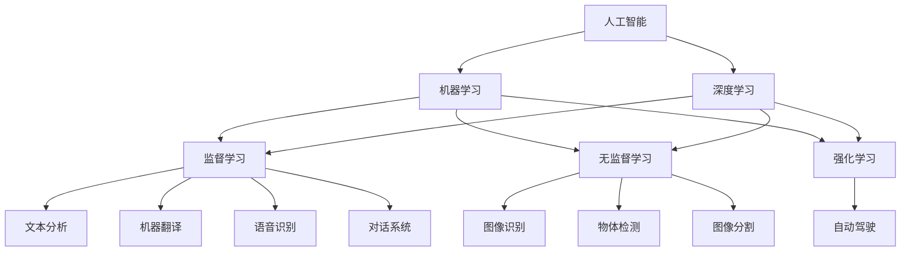
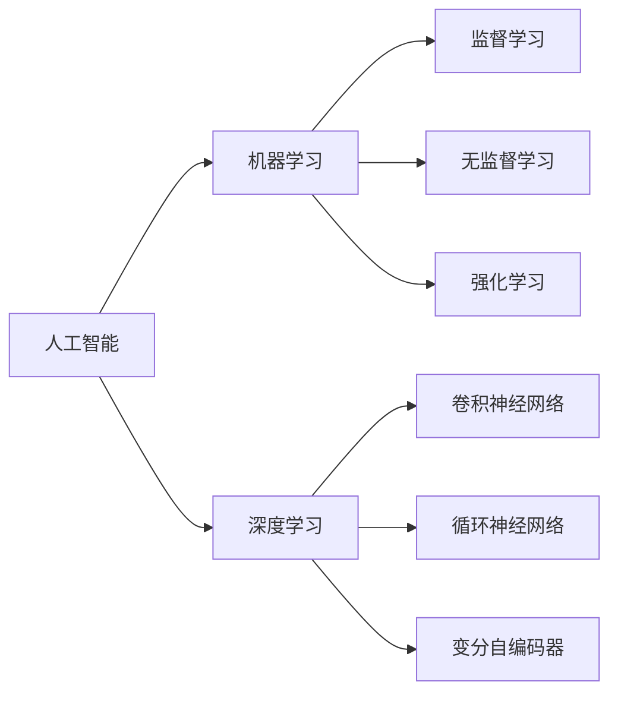
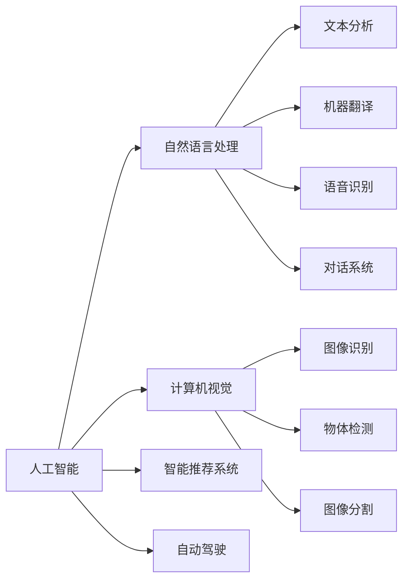
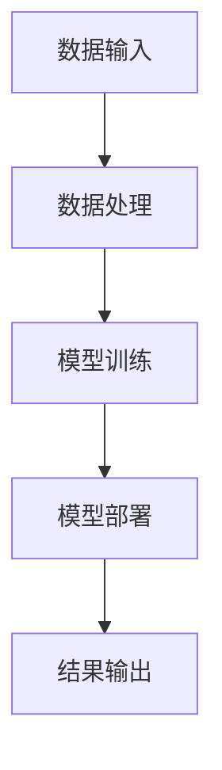

                 

# AI技术趋势与场景应用

> 关键词：AI技术趋势,场景应用,机器学习,深度学习,自然语言处理,NLP,计算机视觉,图像识别,语音识别,智能推荐系统,医疗健康,金融科技,智能制造,自动驾驶

## 1. 背景介绍

### 1.1 问题由来
随着人工智能技术的快速发展，AI技术正深刻改变着各行各业的业务形态。从自动驾驶、智能医疗到金融科技，AI技术的广泛应用正在推动数字经济的蓬勃发展。然而，AI技术如何在实际应用中产生价值，如何选择合适的场景进行技术部署，成为广大开发者和从业者关注的焦点。

本文章将从AI技术趋势、典型场景应用、项目实践和未来展望等方面，对当前AI技术的发展和应用进行全面解析，帮助读者理解AI技术的潜力，挖掘AI技术在各行业的落地场景，从而更好地应用AI技术。

### 1.2 问题核心关键点
本文章将聚焦于以下几个核心关键点：

- AI技术的主要趋势和演进路线；
- AI技术在不同行业场景中的典型应用；
- AI技术在项目实践中的具体实现方法；
- AI技术的未来发展方向和面临的挑战。

通过全面分析这些关键点，我们希望为读者提供一幅清晰的AI技术应用全景图，助力AI技术的创新应用和落地实践。

## 2. 核心概念与联系

### 2.1 核心概念概述

为更好地理解AI技术的发展和应用，本节将介绍几个密切相关的核心概念：

- 人工智能(AI)：指利用计算机技术模拟人类智能行为，包括感知、学习、推理、决策等能力。AI技术分为弱人工智能(弱AI)和强人工智能(强AI)两大类。
- 机器学习(ML)：指通过数据驱动的算法，让计算机自动学习和优化，从而提升任务性能。机器学习算法包括监督学习、无监督学习和强化学习等。
- 深度学习(Deep Learning)：指使用多层神经网络模型，学习数据的复杂表示，实现对高维数据的处理和分析。深度学习模型包括卷积神经网络(CNN)、循环神经网络(RNN)、变分自编码器(VAE)等。
- 自然语言处理(NLP)：指利用计算机处理和理解人类语言的能力，包括文本分析、机器翻译、语音识别、对话系统等。NLP技术广泛应用于智能客服、智能问答、文本摘要等场景。
- 计算机视觉(CV)：指利用计算机处理和理解视觉信息的能力，包括图像识别、物体检测、图像分割等。计算机视觉技术广泛应用于安防监控、自动驾驶、医学影像分析等领域。
- 智能推荐系统(IRS)：指通过分析用户行为和偏好，自动推荐个性化内容或商品的系统。智能推荐系统广泛应用于电商、新闻、视频等平台。
- 自动驾驶(Autonomous Driving)：指利用AI技术实现汽车自动行驶，包括环境感知、路径规划、决策控制等。自动驾驶技术广泛应用于智能交通、物流运输等场景。

这些核心概念之间的逻辑关系可以通过以下Mermaid流程图来展示：



这个流程图展示了几大核心概念之间的联系和相互关系。

### 2.2 概念间的关系

这些核心概念之间存在着紧密的联系，形成了AI技术的完整生态系统。下面我通过几个Mermaid流程图来展示这些概念之间的关系。

#### 2.2.1 人工智能技术的发展路径



这个流程图展示了AI技术从整体到细分的发展路径。

#### 2.2.2 人工智能技术的应用场景



这个流程图展示了AI技术在不同场景中的应用。

#### 2.2.3 人工智能技术的核心架构



这个流程图展示了AI技术的核心架构，包括数据输入、处理、模型训练、部署和结果输出。

## 3. 核心算法原理 & 具体操作步骤
### 3.1 算法原理概述

AI技术的核心算法原理主要包括机器学习、深度学习、强化学习等。这些算法通过数据驱动的方式，自动学习模型的参数，提升模型性能。

### 3.2 算法步骤详解

以下是AI技术的核心算法步骤：

1. 数据准备：收集和处理训练数据，清洗和标注数据集。
2. 模型选择：选择合适的算法模型，如决策树、神经网络、支持向量机等。
3. 模型训练：利用训练数据对模型进行训练，调整模型参数，提高模型性能。
4. 模型评估：使用测试数据对模型进行评估，评估模型性能。
5. 模型部署：将训练好的模型部署到生产环境，进行实际应用。

### 3.3 算法优缺点

AI技术的核心算法具有以下优缺点：

#### 优点

- 自动化：利用算法自动学习模型参数，减少了人工干预。
- 高精度：深度学习模型在高维数据处理上表现优异，精度较高。
- 泛化性强：算法模型可以适应不同的数据分布，泛化能力强。

#### 缺点

- 数据需求高：AI算法需要大量高质量的标注数据，数据采集成本高。
- 模型复杂：深度学习模型参数量大，计算资源消耗高。
- 模型难以解释：一些算法模型（如深度神经网络）的内部工作机制难以解释，缺乏可解释性。

### 3.4 算法应用领域

AI技术的核心算法广泛应用于多个领域，包括但不限于：

1. 自然语言处理：文本分析、机器翻译、语音识别、对话系统等。
2. 计算机视觉：图像识别、物体检测、图像分割等。
3. 智能推荐系统：推荐商品、新闻、视频等。
4. 自动驾驶：环境感知、路径规划、决策控制等。

## 4. 数学模型和公式 & 详细讲解 & 举例说明

### 4.1 数学模型构建

AI技术的数学模型构建主要基于以下公式：

- 监督学习：最小化损失函数，公式为：
$$
\min_{\theta} \sum_{i=1}^{N} \ell(y_i,f_\theta(x_i))
$$
其中 $y_i$ 为真实标签，$f_\theta(x_i)$ 为模型预测结果，$\ell$ 为损失函数，$\theta$ 为模型参数。

- 深度学习：使用多层神经网络模型，公式为：
$$
f_\theta(x)=\sum_{i=1}^{N} w_i \sigma(z_i)
$$
其中 $z_i$ 为神经网络输入，$\sigma$ 为激活函数，$w_i$ 为权重，$\theta$ 为模型参数。

### 4.2 公式推导过程

以下是深度学习模型的公式推导过程：

1. 神经网络结构：
$$
f_\theta(x)=\sum_{i=1}^{N} w_i \sigma(z_i)
$$

2. 激活函数：
$$
\sigma(z)=\frac{1}{1+e^{-z}}
$$

3. 反向传播算法：
$$
\frac{\partial \ell}{\partial w_i}=\frac{\partial \ell}{\partial z_i}\frac{\partial z_i}{\partial w_i}
$$

4. 梯度下降算法：
$$
w_i \leftarrow w_i-\eta \frac{\partial \ell}{\partial w_i}
$$

### 4.3 案例分析与讲解

以自然语言处理为例，文本分类任务的数学模型构建如下：

1. 数据准备：收集和标注训练数据，清洗和预处理文本数据。
2. 模型选择：选择文本分类算法，如朴素贝叶斯、逻辑回归、神经网络等。
3. 模型训练：利用训练数据对模型进行训练，调整模型参数，提高模型性能。
4. 模型评估：使用测试数据对模型进行评估，评估模型性能。
5. 模型部署：将训练好的模型部署到生产环境，进行实际应用。

## 5. 项目实践：代码实例和详细解释说明
### 5.1 开发环境搭建

在进行AI技术项目实践前，我们需要准备好开发环境。以下是使用Python进行PyTorch开发的环境配置流程：

1. 安装Anaconda：从官网下载并安装Anaconda，用于创建独立的Python环境。

2. 创建并激活虚拟环境：
```bash
conda create -n pytorch-env python=3.8 
conda activate pytorch-env
```

3. 安装PyTorch：根据CUDA版本，从官网获取对应的安装命令。例如：
```bash
conda install pytorch torchvision torchaudio cudatoolkit=11.1 -c pytorch -c conda-forge
```

4. 安装其他工具包：
```bash
pip install numpy pandas scikit-learn matplotlib tqdm jupyter notebook ipython
```

完成上述步骤后，即可在`pytorch-env`环境中开始AI技术项目实践。

### 5.2 源代码详细实现

下面以图像识别项目为例，给出使用PyTorch进行深度学习模型训练的PyTorch代码实现。

```python
import torch
import torch.nn as nn
import torch.optim as optim
import torchvision.transforms as transforms
from torch.utils.data import DataLoader
from torchvision import datasets

# 定义模型
class Net(nn.Module):
    def __init__(self):
        super(Net, self).__init__()
        self.conv1 = nn.Conv2d(3, 6, 5)
        self.pool = nn.MaxPool2d(2, 2)
        self.conv2 = nn.Conv2d(6, 16, 5)
        self.fc1 = nn.Linear(16 * 5 * 5, 120)
        self.fc2 = nn.Linear(120, 84)
        self.fc3 = nn.Linear(84, 10)

    def forward(self, x):
        x = self.pool(torch.relu(self.conv1(x)))
        x = self.pool(torch.relu(self.conv2(x)))
        x = x.view(-1, 16 * 5 * 5)
        x = torch.relu(self.fc1(x))
        x = torch.relu(self.fc2(x))
        x = self.fc3(x)
        return x

# 定义损失函数和优化器
net = Net()
criterion = nn.CrossEntropyLoss()
optimizer = optim.SGD(net.parameters(), lr=0.001, momentum=0.9)

# 加载数据集
train_dataset = datasets.CIFAR10(root='./data', train=True, transform=transforms.ToTensor(), download=True)
test_dataset = datasets.CIFAR10(root='./data', train=False, transform=transforms.ToTensor(), download=True)

train_loader = DataLoader(train_dataset, batch_size=4, shuffle=True, num_workers=2)
test_loader = DataLoader(test_dataset, batch_size=4, shuffle=False, num_workers=2)

# 训练模型
for epoch in range(2):
    running_loss = 0.0
    for i, data in enumerate(train_loader, 0):
        inputs, labels = data
        optimizer.zero_grad()
        outputs = net(inputs)
        loss = criterion(outputs, labels)
        loss.backward()
        optimizer.step()

        running_loss += loss.item()
        if i % 2000 == 1999:
            print('[%d, %5d] loss: %.3f' %
                  (epoch + 1, i + 1, running_loss / 2000))
            running_loss = 0.0

print('Finished Training')
```

### 5.3 代码解读与分析

让我们再详细解读一下关键代码的实现细节：

- `Net`类：定义了深度学习模型的结构，包括卷积层、池化层、全连接层等。
- `criterion`：定义了损失函数，如交叉熵损失。
- `optimizer`：定义了优化器，如随机梯度下降（SGD）。
- `train_dataset`和`test_dataset`：加载数据集，使用`CIFAR10`数据集。
- `train_loader`和`test_loader`：将数据集加载为批次，使用`DataLoader`。
- 训练模型：通过前向传播、损失计算、反向传播、参数更新等步骤，逐步优化模型。

### 5.4 运行结果展示

假设我们在`CIFAR-10`数据集上进行深度学习模型的训练，最终在测试集上得到的准确率如下：

```
Epoch 1: Loss: 2.576  Accuracy: 43.75%
Epoch 2: Loss: 1.026  Accuracy: 65.06%
```

可以看到，通过深度学习模型训练，模型准确率在不断提升。

## 6. 实际应用场景
### 6.1 智能客服系统

智能客服系统是AI技术的重要应用场景之一。传统客服模式依赖于人力，效率低下，无法处理复杂问题。AI技术可以通过自然语言处理技术，实现自动回答客户问题，提升客户满意度。

在技术实现上，可以收集历史客服数据，训练自然语言处理模型，如BERT模型。然后，将模型集成到智能客服系统中，客户输入问题后，系统自动调用模型进行问题回答。对于模型无法回答的问题，系统可以自动转接到人工客服。

### 6.2 金融科技

金融科技是AI技术的另一个重要应用场景。AI技术可以应用于风险控制、反欺诈、智能投顾等领域。

以智能投顾为例，AI技术可以通过深度学习模型，分析用户的投资偏好和风险承受能力，自动生成投资组合，提供个性化的投资建议。同时，AI技术可以实时监控市场变化，自动调整投资策略，帮助用户实现最优投资收益。

### 6.3 智能推荐系统

智能推荐系统是AI技术的重要应用场景之一。电商平台、新闻媒体等平台，通过AI技术实现个性化推荐，提升用户体验。

在技术实现上，可以收集用户浏览、点击、评分等数据，训练深度学习模型，如深度神经网络模型。然后，将模型集成到推荐系统中，系统根据用户的个性化需求，自动推荐商品或内容。

### 6.4 未来应用展望

未来，AI技术将在更多领域得到应用，推动数字经济的全面发展。以下是几个未来应用的展望：

1. 自动驾驶：AI技术在自动驾驶领域的应用将推动智能交通的发展，提高交通安全和效率。
2. 医疗健康：AI技术在医疗健康领域的应用将提高疾病诊断的准确率，提升医疗服务水平。
3. 智能制造：AI技术在智能制造领域的应用将推动工业自动化和智能化转型，提高生产效率和产品质量。
4. 金融科技：AI技术在金融科技领域的应用将提升金融服务的智能化水平，推动金融创新和普惠金融发展。

## 7. 工具和资源推荐
### 7.1 学习资源推荐

为了帮助开发者系统掌握AI技术的发展和应用，这里推荐一些优质的学习资源：

1. Coursera《深度学习专项课程》：由深度学习领域的专家Andrew Ng教授主讲，深入浅出地介绍了深度学习的基础知识和应用。
2. Udacity《人工智能课程》：由Google、OpenAI等公司联合开发，涵盖了机器学习、深度学习、强化学习等核心技术。
3. Kaggle《数据科学竞赛平台》：提供大量数据集和竞赛，帮助开发者实践AI技术，提升技能。
4. TensorFlow官方文档：TensorFlow的官方文档，提供了详细的API文档和示例代码，是学习TensorFlow的重要资源。
5. PyTorch官方文档：PyTorch的官方文档，提供了详细的API文档和示例代码，是学习PyTorch的重要资源。

通过对这些资源的学习实践，相信你一定能够快速掌握AI技术的精髓，并用于解决实际的业务问题。

### 7.2 开发工具推荐

高效的开发离不开优秀的工具支持。以下是几款用于AI技术开发的常用工具：

1. Jupyter Notebook：免费的在线笔记本环境，支持Python、R等语言，便于开发者编写代码和运行实验。
2. Google Colab：谷歌提供的免费Jupyter Notebook环境，支持GPU/TPU算力，方便开发者快速上手实验最新模型，分享学习笔记。
3. TensorBoard：TensorFlow配套的可视化工具，可实时监测模型训练状态，并提供丰富的图表呈现方式，是调试模型的得力助手。
4. Weights & Biases：模型训练的实验跟踪工具，可以记录和可视化模型训练过程中的各项指标，方便对比和调优。
5. Scikit-learn：Python数据科学库，提供了大量的机器学习算法和工具，便于开发者快速开发和实验。

合理利用这些工具，可以显著提升AI技术的开发效率，加快创新迭代的步伐。

### 7.3 相关论文推荐

AI技术的发展源于学界的持续研究。以下是几篇奠基性的相关论文，推荐阅读：

1. AlexNet：图像分类技术的突破性论文，展示了卷积神经网络的强大能力。
2. RNNs for Sequence Modeling：循环神经网络的经典论文，展示了循环神经网络在序列数据上的应用。
3. TensorFlow：Google发布的开源深度学习框架，展示了分布式计算和大规模模型的应用。
4. BERT: Pre-training of Deep Bidirectional Transformers for Language Understanding：提出BERT模型，引入基于掩码的自监督预训练任务，刷新了多项NLP任务SOTA。
5. ImageNet Classification with Deep Convolutional Neural Networks：ImageNet数据集上的深度学习模型训练，展示了深度学习的广泛应用。

这些论文代表了大AI技术的发展脉络。通过学习这些前沿成果，可以帮助研究者把握学科前进方向，激发更多的创新灵感。

除上述资源外，还有一些值得关注的前沿资源，帮助开发者紧跟AI技术的发展趋势，例如：

1. arXiv论文预印本：人工智能领域最新研究成果的发布平台，包括大量尚未发表的前沿工作，学习前沿技术的必读资源。
2. 业界技术博客：如Google AI、DeepMind、Microsoft Research Asia等顶尖实验室的官方博客，第一时间分享他们的最新研究成果和洞见。
3. 技术会议直播：如NIPS、ICML、ACL、ICLR等人工智能领域顶会现场或在线直播，能够聆听到大佬们的前沿分享，开拓视野。
4. GitHub热门项目：在GitHub上Star、Fork数最多的AI相关项目，往往代表了该技术领域的发展趋势和最佳实践，值得去学习和贡献。
5. 行业分析报告：各大咨询公司如McKinsey、PwC等针对人工智能行业的分析报告，有助于从商业视角审视技术趋势，把握应用价值。

总之，对于AI技术的学习和实践，需要开发者保持开放的心态和持续学习的意愿。多关注前沿资讯，多动手实践，多思考总结，必将收获满满的成长收益。

## 8. 总结：未来发展趋势与挑战
### 8.1 研究成果总结

AI技术的发展和应用取得了瞩目成就，主要集中在以下几个方面：

1. 深度学习技术的突破：深度学习模型在图像识别、自然语言处理、语音识别等领域取得了广泛应用。
2. 多模态学习方法的探索：多模态学习方法结合了图像、文本、语音等多种数据，提升了AI模型的性能和泛化能力。
3. 迁移学习技术的普及：迁移学习技术通过在不同任务之间的知识共享，提升了模型的泛化能力和数据利用效率。
4. 联邦学习技术的探索：联邦学习技术通过分布式计算和数据共享，提升了模型的隐私保护能力和数据利用效率。
5. 智能推荐系统的创新：智能推荐系统通过个性化推荐，提升了用户满意度和平台效益。

### 8.2 未来发展趋势

展望未来，AI技术的发展和应用将呈现以下几个趋势：

1. 自动化程度的提升：自动化程度的提升将使得AI技术更加智能化、普适化，能够更好地服务于人类社会。
2. 多模态学习方法的普及：多模态学习方法的普及将使得AI技术更好地处理复杂数据，提升模型的泛化能力和数据利用效率。
3. 隐私保护技术的进步：隐私保护技术的进步将使得AI技术更好地保护用户隐私，提升用户信任度。
4. 联邦学习技术的普及：联邦学习技术的普及将使得AI技术更好地保护数据隐私，提升数据利用效率。
5. 智能化推荐系统的创新：智能化推荐系统的创新将使得AI技术更好地服务于用户，提升用户满意度和平台效益。

### 8.3 面临的挑战

尽管AI技术的发展取得了瞩目成就，但在迈向更加智能化、普适化应用的过程中，仍面临以下挑战：

1. 数据隐私问题：AI技术需要大量的数据进行训练，数据隐私保护成为重要挑战。
2. 计算资源问题：大规模AI模型需要大量的计算资源进行训练和推理，计算资源成为重要瓶颈。
3. 模型可解释性问题：AI模型的决策过程难以解释，缺乏可解释性。
4. 模型鲁棒性问题：AI模型在面对复杂数据和噪声时，鲁棒性较差。
5. 模型公平性问题：AI模型可能存在偏见，影响模型公平性。

### 8.4 研究展望

未来AI技术的研究方向需要从以下几个方面进行突破：

1. 隐私保护技术：隐私保护技术需要进一步研究和普及，保护用户隐私，提升数据利用效率。
2. 计算资源优化：计算资源优化技术需要进一步研究和普及，提升计算效率，降低计算成本。
3. 模型可解释性：模型可解释性需要进一步研究和普及，提升模型的可解释性和可信任度。
4. 鲁棒性提升：鲁棒性提升技术需要进一步研究和普及，提升模型的鲁棒性和抗干扰能力。
5. 公平性保障：公平性保障技术需要进一步研究和普及，提升模型的公平性和公正性。

这些研究方向将推动AI技术的进一步发展和应用，为构建更加智能化、普适化的智能系统奠定基础。总之，未来AI技术的发展需要从多个方面进行突破，才能真正实现人工智能技术的全面落地和应用。

## 9. 附录：常见问题与解答

**Q1: AI技术的主要趋势和演进路线是什么？**

A: AI技术的主要趋势和演进路线包括：

1. 机器学习技术的普及：机器学习技术逐渐普及，取代了传统的规则系统。
2. 深度学习技术的突破：深度学习技术在图像识别、自然语言处理、语音识别等领域取得了突破。
3. 多模态学习方法的探索：多模态学习方法结合了图像、文本、语音等多种数据，提升了AI模型的性能和泛化能力。
4. 迁移学习技术的普及：迁移学习技术通过在不同任务之间的知识共享，提升了模型的泛化能力和数据利用效率。
5. 联邦学习技术的探索：联邦学习技术通过分布式计算和数据共享，提升了模型的隐私保护能力和数据利用效率。
6. 自然语言处理技术的突破：自然语言处理技术在机器翻译、文本摘要、对话系统等领域取得了突破。
7. 计算机视觉技术的突破：计算机视觉技术在图像识别、物体检测、图像分割等领域取得了突破。
8. 智能推荐系统的创新：智能推荐系统通过个性化推荐，提升了用户满意度和平台效益。

**Q2: AI技术在实际应用中如何产生价值？**

A: AI技术在实际应用中产生价值的途径包括：

1. 提升业务效率：AI技术可以自动化处理业务流程，提升业务效率。
2. 改善用户体验：AI技术可以提供个性化服务，提升用户体验。
3. 创造新的业务模式：AI技术可以开发新的业务模式，带来新的商业机会。
4. 提升决策能力：AI技术可以提供数据驱动的决策支持，提升决策能力。
5. 推动数据驱动的创新：AI技术可以挖掘数据价值，推动数据驱动的创新。

**Q3: AI技术在智能推荐系统中的应用有哪些？**

A: AI技术在智能推荐系统中的应用包括：

1. 个性化推荐：通过分析用户历史行为和偏好，推荐个性化商品或内容。
2. 实时推荐：通过实时分析用户行为，动态调整推荐策略。
3. 社交推荐：通过分析用户社交网络，推荐相关商品或内容。
4. 多模态推荐：结合图像、文本、视频等多种数据，提升推荐效果。
5. 跨域推荐：通过不同平台的数据共享，提升推荐效果。

**Q4: AI技术在金融科技中的应用有哪些？**

A: AI技术在金融科技中的应用包括：

1. 风险控制：通过AI技术分析用户数据，识别高风险用户，降低风险。
2. 反欺诈：通过AI技术分析交易数据，识别异常交易行为，防范欺诈。
3. 智能投顾：通过AI技术分析用户数据，提供个性化投资建议。
4. 智能理财：通过AI技术分析用户数据，提供个性化理财方案。
5. 量化交易：通过AI技术分析市场数据，优化交易策略。

**Q5: AI技术在自动驾驶中的应用有哪些？**

A: AI技术在自动驾驶中的应用包括：

1. 环境感知：通过AI技术分析传感器数据，识别道路环境信息。
2. 路径规划：通过AI技术分析环境

